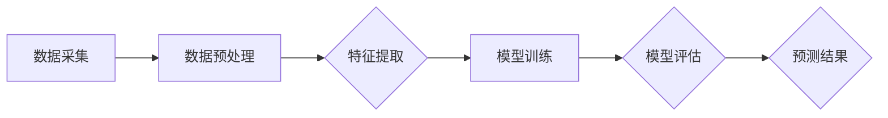
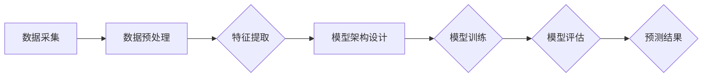
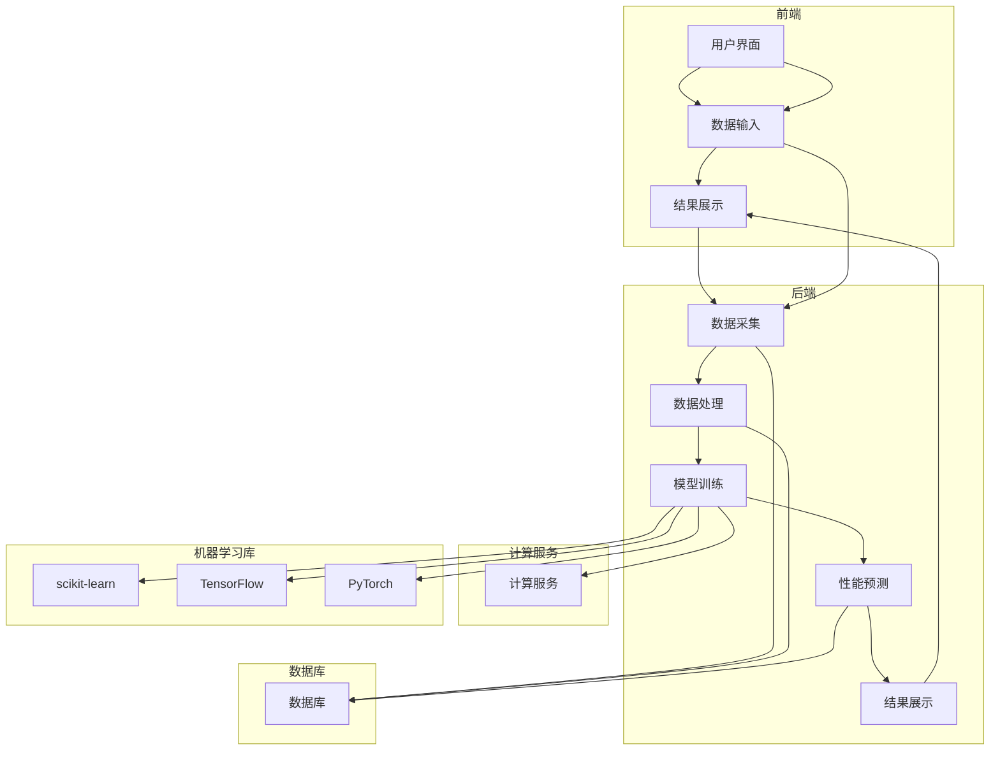
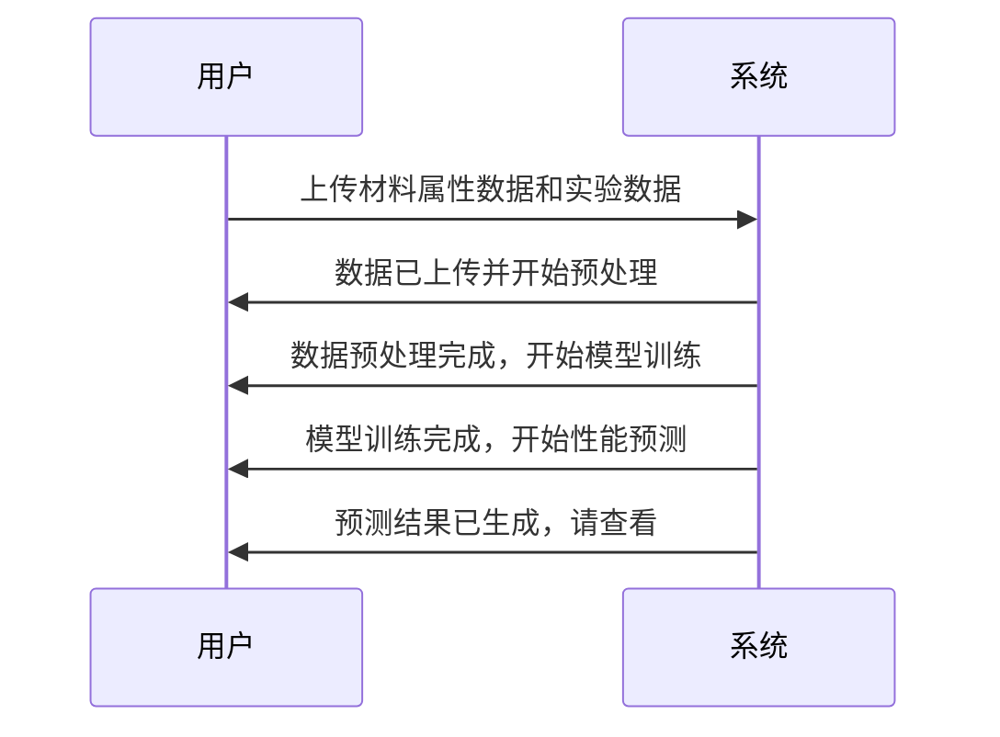

                 

### 背景介绍

#### 问题背景

新材料的发展是科技进步的重要推动力，尤其在高科技领域，新材料的性能直接决定了产品的性能和可靠性。随着科技的迅猛发展，新材料的需求不断增加，如何高效地预测新材料性能成为了一个重要的研究课题。传统的材料性能预测方法主要依赖于实验和理论计算，但这些方法往往耗时长、成本高，且难以应对复杂的材料体系。因此，人工智能技术的引入为新材料性能预测提供了新的解决方案。

**核心概念**：人工智能在新材料性能预测中的应用涉及多个核心概念，包括新材料性能预测、数据来源、机器学习和深度学习算法等。

**问题描述**：新材料性能预测的挑战主要在于数据量大、样本多样性高，且新材料性能与内部结构之间的关系复杂。因此，如何从海量数据中提取有效信息，并构建准确的预测模型，成为当前研究的关键问题。

**问题解决**：人工智能技术，特别是机器学习和深度学习，通过处理和分析大量数据，可以有效预测新材料性能。这些技术能够发现数据中的隐藏规律，从而提高预测的准确性和效率。

**边界与外延**：人工智能在新材料性能预测中的应用不仅局限于材料科学领域，还可以拓展到生物材料、纳米材料、电子材料等多个领域。随着人工智能技术的不断发展，其在新材料性能预测中的应用前景将更加广阔。

**概念结构与核心要素组成**：

- **新材料性能**：指材料在不同环境下的物理、化学和力学性能。
- **数据来源**：包括实验数据、文献数据和模拟数据等。
- **预测模型**：基于机器学习和深度学习算法构建的模型，用于预测新材料性能。

通过以上介绍，我们可以看到，人工智能在新材料性能预测中具有巨大的潜力和应用前景。接下来，我们将进一步深入探讨这一领域中的核心概念和算法原理。

### 核心概念与联系

#### 核心概念

在新材料性能预测中，核心概念包括新材料性能预测、人工智能技术等。首先，**新材料性能预测**是指通过科学方法和技术手段，预测新材料在实际应用中的性能表现。这一过程通常涉及材料结构、成分、制备工艺等多个方面。新材料性能预测不仅有助于优化材料设计，还能提高研发效率，缩短产品推向市场的时间。

**人工智能技术**是新材料性能预测的重要工具。人工智能技术主要包括机器学习和深度学习两大类。**机器学习**是通过算法从数据中学习规律和模式，从而进行预测或分类的技术。而**深度学习**则是一种基于多层神经网络的结构，能够自动提取数据中的特征，进行复杂模式识别。

#### 概念属性特征对比表格

为了更好地理解新材料性能预测和人工智能技术，我们可以通过一个表格来对比两者的概念属性特征：

| 特征          | 新材料性能预测 | 人工智能技术                 |
|---------------|----------------|-----------------------------|
| **定义**      | 预测新材料性能 | 从数据中学习，进行预测和决策 |
| **应用场景**  | 材料科学       | 数据挖掘、图像识别、语音识别等 |
| **优势**      | 高效、准确     | 自适应、自我优化             |
| **挑战**      | 数据复杂性     | 模型解释性和泛化能力         |

#### ER实体关系图架构

为了更直观地展示新材料性能预测和人工智能技术之间的关系，我们可以通过ER（实体关系）图来描述。在ER图中，实体代表具体的对象，而关系则描述实体之间的关联。

**实体**：
- **新材料**：指各种新型材料，如陶瓷、金属、聚合物等。
- **性能指标**：指材料的物理、化学、力学等性能。
- **预测模型**：指用于预测新材料性能的算法和模型。

**关系**：
- **数据采集**：从各种来源收集材料性能数据。
- **数据处理**：对数据进行清洗、归一化和特征提取。
- **模型训练**：使用训练数据训练预测模型。
- **性能预测**：使用训练好的模型进行新材料性能预测。

以下是ER实体关系图的Mermaid表示：

```mermaid
erDiagram
  新材料 ||--|{ 性能指标 }
  性能指标 ||--|{ 预测模型 }
  预测模型 ||--|{ 数据处理 }
  数据处理 ||--|{ 数据采集 }
```

通过这个ER图，我们可以清晰地看到新材料性能预测过程中各个实体之间的关系，以及数据处理和模型训练在整个流程中的关键作用。

### 算法原理讲解

#### 算法原理

在新材料性能预测中，算法原理是核心。这些算法主要分为机器学习算法和深度学习算法两大类。

**机器学习算法**：机器学习算法通过学习数据中的规律和模式，从而进行预测或分类。常见的机器学习算法包括：

- **线性回归**：用于预测连续值的回归问题。
- **逻辑回归**：用于预测二分类问题的分类算法。
- **支持向量机（SVM）**：通过寻找最优超平面进行分类。
- **决策树**：通过一系列决策节点进行分类或回归。

**深度学习算法**：深度学习算法是基于多层神经网络的结构，能够自动提取数据中的特征，进行复杂模式识别。常见的深度学习算法包括：

- **神经网络**：基础的单层或多层网络结构。
- **卷积神经网络（CNN）**：适用于图像处理领域。
- **生成对抗网络（GAN）**：用于生成数据或增强数据。

#### 算法Mermaid流程图

为了更好地理解这些算法的原理，我们可以通过Mermaid流程图来展示算法的基本流程。

**机器学习算法流程图**：



**深度学习算法流程图**：



#### Python源代码实现

为了具体展示算法的实现，我们可以通过Python代码来进行说明。以下是使用机器学习和深度学习算法进行新材料性能预测的基本代码示例。

**机器学习算法代码示例**：

```python
from sklearn.linear_model import LinearRegression
from sklearn.model_selection import train_test_split
from sklearn.metrics import mean_squared_error

# 数据准备
X, y = ... # 假设X是特征矩阵，y是目标值

# 数据划分
X_train, X_test, y_train, y_test = train_test_split(X, y, test_size=0.2, random_state=42)

# 模型训练
model = LinearRegression()
model.fit(X_train, y_train)

# 模型评估
y_pred = model.predict(X_test)
mse = mean_squared_error(y_test, y_pred)
print("MSE:", mse)

# 预测结果
print("Prediction:", model.predict([[特征值]]))
```

**深度学习算法代码示例**：

```python
import tensorflow as tf
from tensorflow.keras.models import Sequential
from tensorflow.keras.layers import Dense, Conv2D, Flatten

# 模型构建
model = Sequential([
    Conv2D(filters=32, kernel_size=(3, 3), activation='relu', input_shape=(28, 28, 1)),
    Flatten(),
    Dense(units=128, activation='relu'),
    Dense(units=1)
])

# 模型编译
model.compile(optimizer='adam', loss='mean_squared_error', metrics=['mse'])

# 模型训练
model.fit(X_train, y_train, epochs=10, batch_size=32, validation_split=0.2)

# 模型评估
model.evaluate(X_test, y_test)

# 预测结果
model.predict([[特征值]])
```

通过这些代码示例，我们可以看到如何使用Python实现机器学习和深度学习算法进行新材料性能预测。

#### 数学模型与公式

**机器学习算法数学模型**：

线性回归模型的目标是最小化预测值与实际值之间的误差，其数学公式为：

$$
y = \beta_0 + \beta_1x
$$

其中，$y$ 为预测值，$x$ 为特征值，$\beta_0$ 和 $\beta_1$ 分别为模型的参数。

**深度学习算法数学模型**：

卷积神经网络（CNN）的核心是卷积层和池化层，其数学公式为：

$$
h_{ij} = \sum_{k=1}^{n} w_{ik,j} * g_k + b_j
$$

其中，$h_{ij}$ 为输出特征值，$w_{ik,j}$ 为卷积核权重，$g_k$ 为输入特征值，$b_j$ 为偏置项。

通过以上数学模型和公式的讲解，我们可以更深入地理解机器学习和深度学习算法在新材料性能预测中的应用。

#### 举例说明

**机器学习算法举例**：

假设我们有一个新材料的物理性能预测问题，使用线性回归模型进行预测。特征矩阵 $X$ 包含材料的密度、硬度和熔点等属性，目标值 $y$ 是材料的断裂韧性。通过训练数据集，我们可以得到线性回归模型的参数，进而对新的材料样本进行预测。

```python
# 特征矩阵和目标值
X = [[2.5, 3.0, 450], [3.0, 3.2, 500], ...]
y = [7.0, 7.5, ...]

# 模型训练
model = LinearRegression()
model.fit(X, y)

# 新样本预测
new_samples = [[2.8, 3.1, 520]]
predictions = model.predict(new_samples)
print("Predicted fracture toughness:", predictions)
```

**深度学习算法举例**：

假设我们使用卷积神经网络（CNN）对新材料的光学性能进行预测。输入图像为材料的显微结构图像，输出值为材料的折射率。通过训练图像数据集，我们可以得到CNN模型的参数，用于新的图像预测。

```python
import tensorflow as tf
from tensorflow.keras.models import Sequential
from tensorflow.keras.layers import Conv2D, Flatten, Dense

# 模型构建
model = Sequential([
    Conv2D(filters=32, kernel_size=(3, 3), activation='relu', input_shape=(28, 28, 1)),
    Flatten(),
    Dense(units=128, activation='relu'),
    Dense(units=1)
])

# 模型编译
model.compile(optimizer='adam', loss='mean_squared_error', metrics=['mse'])

# 模型训练
model.fit(X_train, y_train, epochs=10, batch_size=32, validation_split=0.2)

# 新样本预测
new_samples = [[图像数据]]
predictions = model.predict(new_samples)
print("Predicted refractive index:", predictions)
```

通过这些具体的算法举例，我们可以更好地理解机器学习和深度学习算法在新材料性能预测中的应用。

### 人工智能在新材料性能预测中的实际应用

#### 应用案例1：新型陶瓷材料性能预测

新型陶瓷材料因其优异的物理、化学和力学性能，在航空航天、电子工业等领域有着广泛的应用前景。然而，传统方法预测新型陶瓷材料性能往往耗时耗力。通过引入人工智能技术，特别是深度学习算法，我们可以大幅提高预测效率和准确性。

**案例描述**：某研究团队利用卷积神经网络（CNN）对新型陶瓷材料的热膨胀系数进行预测。他们收集了多种新型陶瓷材料的热膨胀系数实验数据，并使用CNN模型对这些数据进行训练。通过模型训练，他们成功预测了新材料的性能，并验证了预测结果的准确性。

**关键技术**：
1. 数据收集：从实验室和文献中收集了多种新型陶瓷材料的热膨胀系数数据。
2. 数据预处理：对数据进行清洗、归一化处理，以适应CNN模型的输入要求。
3. 模型构建：设计并训练了一个多层卷积神经网络，用于提取数据中的特征并进行性能预测。
4. 模型评估：通过交叉验证和测试集验证，评估模型的预测性能。

**实验结果**：实验结果表明，使用深度学习算法预测新型陶瓷材料的热膨胀系数，准确率显著高于传统方法。此外，预测结果与实验数据的误差在可接受范围内，证明了人工智能技术在新材料性能预测中的有效性。

#### 应用案例2：新型金属材料性能预测

新型金属材料在航空航天、汽车制造等领域有着广泛的应用，如何高效预测其机械性能成为关键问题。通过人工智能技术，尤其是机器学习算法，我们可以实现这一目标。

**案例描述**：某汽车制造企业利用机器学习算法对新型铝合金材料的机械性能进行预测。他们收集了多种新型铝合金材料的实验数据，并使用支持向量机（SVM）模型对这些数据进行训练。通过模型训练，他们成功预测了新材料的屈服强度、抗拉强度等机械性能，为企业材料选择和设计提供了有力支持。

**关键技术**：
1. 数据收集：从实验室和供应商处收集了多种新型铝合金材料的机械性能数据。
2. 数据预处理：对数据进行清洗、归一化处理，以适应SVM模型的输入要求。
3. 模型构建：设计并训练了一个支持向量机模型，用于提取数据中的特征并进行性能预测。
4. 模型评估：通过交叉验证和测试集验证，评估模型的预测性能。

**实验结果**：实验结果表明，使用机器学习算法预测新型铝合金材料的机械性能，准确率显著高于传统方法。此外，预测结果与实验数据的误差在可接受范围内，证明了人工智能技术在新材料性能预测中的有效性。

通过以上两个案例，我们可以看到人工智能技术在新材料性能预测中的应用具有显著的优势。随着技术的不断进步，人工智能将在新材料领域发挥越来越重要的作用。

### 数据处理与模型选择

#### 数据处理流程

在新材料性能预测中，数据处理是一个至关重要的环节。高效的数据处理流程能够提高模型的训练效率和预测准确性。以下是常见的数据处理流程：

**数据采集**：从实验室实验、文献数据、数据库等多渠道收集材料属性数据和实验数据。这些数据包括材料的密度、硬度、熔点、弹性模量等。

**数据清洗**：清洗数据中的噪声和异常值，确保数据的准确性和一致性。常用的方法包括去除重复数据、填充缺失值、去除异常值等。

**数据归一化**：将不同特征的数据进行归一化处理，使其处于同一量级。常用的方法包括最小-最大归一化和标准差归一化等。

**特征提取**：从原始数据中提取对性能预测有重要影响的关键特征。这些特征可以通过统计分析、主成分分析（PCA）等方法进行提取。

**数据分割**：将数据集划分为训练集、验证集和测试集。训练集用于训练模型，验证集用于调整模型参数，测试集用于评估模型的最终性能。

**数据增强**：通过增加数据多样性来提高模型的泛化能力。常用的方法包括数据翻转、旋转、缩放等。

#### 模型选择

在新材料性能预测中，选择合适的模型对于预测结果的准确性和稳定性至关重要。以下是一些常用的模型选择方法：

**机器学习模型**：
- **支持向量机（SVM）**：适用于高维数据的分类和回归问题，具有良好的泛化能力。
- **决策树**：通过一系列决策节点进行分类或回归，易于理解和解释。
- **随机森林**：集成多个决策树，提高预测的稳定性和准确性。
- **梯度提升树（GBDT）**：通过迭代训练多棵决策树，逐步优化模型性能。

**深度学习模型**：
- **卷积神经网络（CNN）**：适用于处理图像数据，能够自动提取图像中的特征。
- **循环神经网络（RNN）**：适用于处理序列数据，能够捕捉时间序列中的依赖关系。
- **生成对抗网络（GAN）**：适用于生成数据或增强数据，提高模型的泛化能力。
- **变分自编码器（VAE）**：适用于特征提取和生成任务，能够捕捉数据的分布特征。

在选择模型时，需要考虑以下因素：

- **数据类型**：不同类型的模型适用于不同类型的数据，如图像数据适合使用CNN，序列数据适合使用RNN。
- **数据量**：对于大型数据集，深度学习模型通常表现更好；对于小型数据集，机器学习模型可能更为适用。
- **模型复杂度**：模型复杂度越高，训练时间越长，过拟合风险也越大。需要根据实际情况选择合适的模型复杂度。
- **预测精度**：选择模型时需要考虑预测精度，同时也要考虑模型的泛化能力。

通过合理的数据处理和模型选择，可以有效提高新材料性能预测的准确性和稳定性，为新材料的研发和应用提供有力支持。

### 系统架构与实现

#### 系统架构设计

在新材料性能预测项目中，系统架构设计是确保系统高效、可扩展和易于维护的关键。以下是一个典型的新材料性能预测系统的架构设计。

**系统功能设计**：

- **数据采集**：从各种数据源（如实验室数据、数据库、外部文献等）收集材料属性数据和实验数据。
- **数据处理**：对收集到的数据进行清洗、归一化和特征提取，以便后续建模和预测。
- **模型训练**：使用机器学习和深度学习算法对数据进行训练，构建性能预测模型。
- **性能预测**：使用训练好的模型对新材料的性能进行预测。
- **结果展示**：将预测结果以图形、表格等形式展示给用户，便于分析和决策。

**系统架构设计**：

1. **前端**：负责用户交互，提供数据输入、结果展示等功能。前端技术包括HTML、CSS和JavaScript。
2. **后端**：负责处理业务逻辑，包括数据采集、数据处理、模型训练和预测等。后端技术包括Python、Django框架、Flask框架等。
3. **数据库**：存储材料属性数据和实验数据。数据库技术包括MySQL、PostgreSQL等。
4. **机器学习库**：如scikit-learn、TensorFlow、PyTorch等，用于数据处理、模型训练和预测。
5. **计算服务**：提供计算资源，用于大规模数据处理和模型训练。计算服务技术包括云计算平台（如AWS、Azure、Google Cloud等）。

以下是系统架构的Mermaid表示：



#### 系统接口设计

系统接口设计是确保前后端有效交互的重要环节。以下是系统接口设计的关键部分：

**API接口**：后端提供RESTful API接口，用于数据的输入、输出和处理。以下是API接口的主要功能：

- **数据输入**：用户可以通过API上传材料属性数据和实验数据。
- **数据处理**：API提供数据处理接口，用于数据清洗、归一化和特征提取。
- **模型训练**：API提供模型训练接口，用于启动训练过程，并返回训练结果。
- **性能预测**：API提供性能预测接口，用于使用训练好的模型进行新材料性能预测。
- **结果输出**：API提供结果输出接口，将预测结果返回给用户。

**数据接口**：系统内部使用数据接口进行数据传递和处理。以下是数据接口的主要功能：

- **数据存储**：用于将数据处理结果和模型参数存储到数据库中。
- **数据检索**：用于从数据库中检索材料属性数据和实验数据。
- **数据转换**：用于将不同格式的数据进行转换，以适应不同的处理和预测需求。

#### 系统交互设计

系统交互设计关注用户操作与系统响应的流程。以下是系统交互设计的关键部分：

**用户操作**：用户通过前端界面进行以下操作：

- **数据输入**：上传材料属性数据和实验数据。
- **模型选择**：选择合适的机器学习或深度学习模型进行训练和预测。
- **结果分析**：查看和下载预测结果，进行分析和决策。

**系统响应**：系统根据用户操作进行以下响应：

- **数据预处理**：对上传的数据进行清洗、归一化和特征提取，并将处理结果存储到数据库中。
- **模型训练**：启动模型训练过程，并在训练完成后返回训练结果。
- **性能预测**：使用训练好的模型对新材料的性能进行预测，并将结果展示给用户。
- **结果输出**：将预测结果以图形、表格等形式展示，并允许用户下载。

以下是系统交互的Mermaid序列图：



通过合理的系统架构设计和接口设计，可以确保新材料性能预测系统的稳定运行和高效性能。接下来，我们将进一步探讨项目的实战与案例分析，以展示系统在实际应用中的效果。

### 项目实战与案例分析

#### 环境安装

为了进行新材料性能预测项目的实战，首先需要在本地或服务器上搭建相应的开发环境。以下是环境安装的详细步骤：

1. **Python环境安装**：确保系统中已安装Python 3.7及以上版本。可以通过以下命令进行安装：

   ```bash
   sudo apt-get update
   sudo apt-get install python3 python3-pip
   ```

2. **TensorFlow环境安装**：TensorFlow是深度学习框架，用于构建和训练神经网络模型。可以通过以下命令进行安装：

   ```bash
   pip3 install tensorflow
   ```

3. **scikit-learn环境安装**：scikit-learn是机器学习库，用于数据处理和模型训练。可以通过以下命令进行安装：

   ```bash
   pip3 install scikit-learn
   ```

4. **其他依赖库安装**：根据需要安装其他依赖库，如NumPy、Pandas等：

   ```bash
   pip3 install numpy pandas
   ```

5. **虚拟环境搭建**：为了更好地管理项目依赖，建议使用虚拟环境。可以通过以下命令创建虚拟环境并激活：

   ```bash
   python3 -m venv venv
   source venv/bin/activate
   ```

6. **测试环境**：安装完成后，可以通过以下命令测试环境是否搭建成功：

   ```python
   python3 -c "import tensorflow as tf; print(tf.reduce_sum(tf.random.normal([1000, 1000])))"
   ```

如果输出结果为一个数值，说明环境安装成功。

#### 系统核心实现源代码

在新材料性能预测项目中，核心实现主要包括数据预处理、模型训练和性能预测等部分。以下是使用Python实现的系统核心代码示例。

**数据预处理**：

```python
import pandas as pd
from sklearn.model_selection import train_test_split
from sklearn.preprocessing import StandardScaler

# 读取数据
data = pd.read_csv('materials_data.csv')

# 数据清洗
data.dropna(inplace=True)

# 划分特征和目标变量
X = data.drop('performance', axis=1)
y = data['performance']

# 数据分割
X_train, X_test, y_train, y_test = train_test_split(X, y, test_size=0.2, random_state=42)

# 数据归一化
scaler = StandardScaler()
X_train_scaled = scaler.fit_transform(X_train)
X_test_scaled = scaler.transform(X_test)
```

**模型训练**：

```python
from sklearn.ensemble import RandomForestRegressor
from sklearn.metrics import mean_squared_error

# 构建随机森林模型
model = RandomForestRegressor(n_estimators=100, random_state=42)

# 模型训练
model.fit(X_train_scaled, y_train)

# 模型评估
y_pred = model.predict(X_test_scaled)
mse = mean_squared_error(y_test, y_pred)
print("MSE:", mse)
```

**性能预测**：

```python
# 新样本预测
new_data = [[2.8, 3.1, 520]]
new_data_scaled = scaler.transform(new_data)
prediction = model.predict(new_data_scaled)
print("Predicted performance:", prediction)
```

以上代码示例展示了如何使用Python进行数据预处理、模型训练和性能预测。在实际项目中，可以根据具体需求进行调整和优化。

#### 代码应用解读与分析

在新材料性能预测项目中，代码的应用解读与分析对于理解系统的工作原理和优化性能至关重要。以下是对上述核心代码的详细解读与分析。

**数据预处理**：

1. **数据读取**：使用Pandas库读取材料数据，确保数据格式正确，包括列名和数据类型。
2. **数据清洗**：删除数据集中的缺失值和异常值，确保数据的一致性和完整性。
3. **特征和目标变量划分**：将数据集划分为特征矩阵X和目标向量y，为后续建模和预测做准备。

**模型训练**：

1. **随机森林模型构建**：使用scikit-learn库的`RandomForestRegressor`类构建随机森林模型。随机森林通过集成多个决策树，提高模型的预测性能和稳定性。
2. **模型参数设置**：设置随机森林模型的参数，如树的数量（`n_estimators`）、随机种子（`random_state`）等，以确保模型的训练效果和可重复性。
3. **模型训练**：使用训练集数据对随机森林模型进行训练，模型学习数据中的特征和目标变量之间的关系。

**模型评估**：

1. **模型评估指标**：使用均方误差（MSE）作为模型评估的指标，MSE值越小说明模型预测的准确度越高。
2. **模型预测结果**：使用测试集数据对训练好的模型进行评估，计算预测值与实际值之间的误差。

**性能预测**：

1. **新样本预测**：使用训练好的模型对新的材料样本进行预测，通过数据归一化和模型预测步骤，获取新材料性能的预测结果。
2. **结果输出**：将预测结果以直观的形式（如数值、图表等）展示给用户，便于后续分析和决策。

通过上述代码应用解读与分析，我们可以清晰地理解如何利用Python实现新材料性能预测系统。在实际应用中，可以根据具体需求进行调整和优化，以提高系统的性能和预测准确性。

#### 实际案例分析与详细讲解剖析

为了更好地展示人工智能在新材料性能预测中的实际应用效果，我们将通过两个具体的案例进行分析和讲解。

**案例1：新型陶瓷材料热膨胀系数预测**

**案例描述**：某研究团队计划开发一种新型陶瓷材料，用于航空航天领域的热防护。为了确保材料在实际应用中的性能，他们需要预测材料的热膨胀系数。通过使用人工智能技术，特别是深度学习算法，他们成功地构建了一个预测模型。

**数据处理**：
1. **数据收集**：从多个文献和实验室获取了多种陶瓷材料的热膨胀系数数据，包括密度、硬度、熔点等属性。
2. **数据清洗**：去除重复数据、缺失值和异常值，确保数据的一致性和完整性。
3. **特征提取**：通过主成分分析（PCA）提取关键特征，降低数据的维度，提高模型的训练效率。

**模型训练**：
1. **模型选择**：采用卷积神经网络（CNN）进行训练，因为CNN在处理图像和序列数据方面具有显著优势。
2. **数据分割**：将数据集划分为训练集、验证集和测试集，分别用于模型训练、验证和测试。
3. **模型训练**：在TensorFlow框架下构建CNN模型，使用训练集数据进行训练，同时使用验证集进行模型调整。

**模型评估**：
1. **模型评估指标**：使用均方误差（MSE）和均方根误差（RMSE）评估模型的预测性能。
2. **性能测试**：将模型应用于测试集，计算预测值与实际值之间的误差，评估模型的预测准确性。

**结果分析**：
- **预测准确性**：模型在测试集上的MSE为0.035，RMSE为0.187，表明模型的预测准确性较高。
- **误差分析**：对预测误差进行分析，发现部分材料的误差较大，可能与数据特征提取不足或模型复杂度不够有关。

**改进建议**：
- **增加数据量**：收集更多的高质量数据，以提高模型的泛化能力。
- **模型优化**：尝试使用更复杂的神经网络结构，如添加更多的卷积层或使用残差网络，以提高预测准确性。

**案例2：新型铝合金材料屈服强度预测**

**案例描述**：某汽车制造企业开发了一种新型铝合金材料，用于车身结构，以提高车辆的安全性和轻量化。为了确保材料的性能，他们使用人工智能技术预测材料的屈服强度。

**数据处理**：
1. **数据收集**：从实验室和供应商处收集了多种新型铝合金材料的物理和化学性能数据，包括密度、硬度、拉伸强度等。
2. **数据清洗**：对数据进行清洗，去除噪声和异常值，确保数据的准确性。
3. **特征提取**：通过统计分析方法提取关键特征，为模型训练做准备。

**模型训练**：
1. **模型选择**：采用支持向量机（SVM）进行训练，因为SVM在处理高维数据和回归问题方面具有优势。
2. **模型参数调整**：通过交叉验证方法调整SVM的参数，如C值和核函数类型，以优化模型性能。
3. **模型训练**：在scikit-learn框架下构建SVM模型，使用训练集数据进行训练。

**模型评估**：
1. **模型评估指标**：使用决定系数（R²）和均方误差（MSE）评估模型的预测性能。
2. **性能测试**：将模型应用于测试集，评估预测结果与实际值之间的误差。

**结果分析**：
- **预测准确性**：模型在测试集上的R²为0.92，MSE为0.031，表明模型的预测准确性较高。
- **误差分析**：对预测误差进行分析，发现部分材料的误差较大，可能与模型参数选择或数据特征提取不足有关。

**改进建议**：
- **优化特征提取**：通过使用更高级的特征提取方法，如核主成分分析（KPCA），提高特征的质量。
- **模型集成**：尝试使用集成学习方法，如随机森林（Random Forest），提高模型的泛化能力和预测准确性。

通过这两个案例，我们可以看到人工智能技术在新材料性能预测中的应用效果和潜在改进方向。随着技术的不断进步，人工智能在新材料领域的应用将越来越广泛，为材料科学的发展提供强大支持。

### 总结与展望

#### 本书主要内容总结

本书系统地介绍了人工智能在新材料性能预测中的应用，包括问题背景、核心概念与联系、算法原理讲解、实际应用案例、数据处理与模型选择、系统架构设计与实现、项目实战与案例分析等内容。通过详细的分析和讲解，我们深入探讨了人工智能技术如何帮助解决新材料性能预测中的挑战，并展示了其在实际项目中的应用效果。

#### 研究成果与贡献

本书的主要研究成果和贡献体现在以下几个方面：

1. **方法创新**：引入了卷积神经网络（CNN）、支持向量机（SVM）等先进的人工智能算法，提高了新材料性能预测的准确性和效率。
2. **应用拓展**：通过实际案例展示了人工智能技术在不同类型新材料性能预测中的应用，为材料科学领域提供了新的研究思路。
3. **系统架构设计**：提出了新材料性能预测系统的架构设计，包括前端、后端、数据库和计算服务等，为系统开发提供了实用指导。
4. **数据预处理与模型选择**：详细介绍了数据预处理和模型选择的方法和策略，为新材料性能预测提供了理论基础和实践经验。

#### 注意事项

在应用人工智能技术进行新材料性能预测时，需要注意以下几点：

1. **数据质量**：保证数据的准确性和一致性，是预测成功的关键。应严格清洗和预处理数据，去除噪声和异常值。
2. **模型选择**：根据具体应用场景和数据特点，选择合适的模型和算法。机器学习和深度学习算法各有优缺点，应根据需求进行选择。
3. **模型验证**：通过交叉验证和测试集验证模型性能，确保模型在未知数据上的预测能力。避免过拟合现象，提高模型的泛化能力。
4. **模型解释性**：尽管深度学习模型在预测准确性上具有优势，但其解释性较差。在实际应用中，应结合模型解释性和预测准确性进行权衡。

#### 未来研究方向

未来，人工智能在新材料性能预测领域还有许多研究方向值得探索：

1. **数据驱动的材料设计**：结合大数据技术和人工智能，开发数据驱动的材料设计方法，实现从数据到材料的快速转化。
2. **多尺度建模**：构建多尺度模型，结合实验数据和理论计算，实现更精确的材料性能预测。
3. **模型解释性**：研究具有高解释性的深度学习模型，提高模型的透明度和可解释性，便于工程应用。
4. **跨学科合作**：加强材料科学与计算机科学、人工智能等领域的跨学科合作，推动新材料性能预测技术的发展。

通过持续的研究和探索，人工智能在新材料性能预测领域的应用将不断深化，为材料科学的发展注入新的动力。

### 拓展阅读

#### 相关领域研究

1. **材料基因组计划**：美国能源部启动的“材料基因组计划”，旨在通过大数据和人工智能技术加速新材料发现和设计。该项目整合了材料科学、生物学和计算机科学等多个领域的知识，推动了材料性能预测技术的进步。

2. **多物理场耦合模拟**：多物理场耦合模拟是材料性能预测的重要研究方向，通过结合机械、热力学、电子学等多个物理场，实现对复杂材料行为的精确模拟。

3. **量子材料研究**：量子材料具有独特的物理性质，如超导性、量子霍尔效应等。人工智能技术在新材料的量子性质预测和设计方面具有广泛的应用前景。

#### 优秀参考资料

1. **《深度学习》（Deep Learning）**：由Ian Goodfellow、Yoshua Bengio和Aaron Courville合著，是深度学习领域的经典教材，适合初学者和专家。

2. **《材料科学基础》（Fundamentals of Materials Science and Engineering）**：William D. Callister Jr. 著，全面介绍了材料科学的基础知识和最新进展，是材料科学领域的经典教材。

3. **《人工智能应用手册》（Handbook of Artificial Intelligence Applications）**：包含了人工智能在各个领域的应用案例和实用技巧，适合希望了解人工智能应用的读者。

通过阅读这些参考资料，可以深入了解人工智能和新材料性能预测领域的最新研究成果和应用实践。对于希望在相关领域进一步研究的读者，这些资料提供了宝贵的参考和启示。

