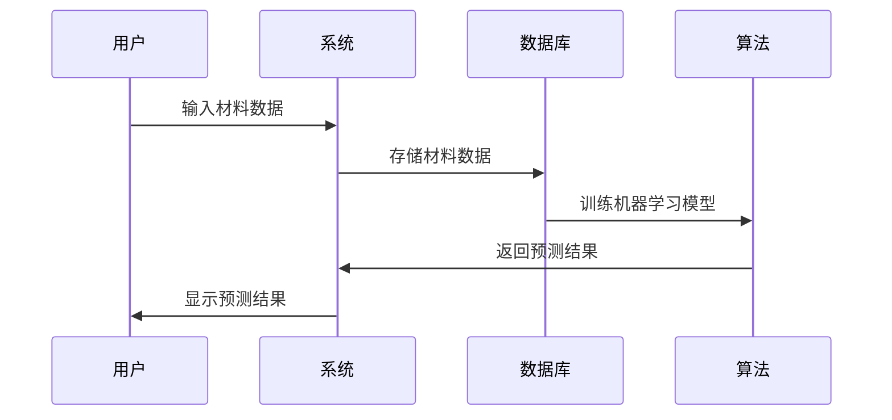

                 

## 人工智能在新能源材料发现中的作用：加速清洁能源研发

### 关键词：人工智能、新能源材料、清洁能源、研发、加速、算法、模型、应用案例

### 摘要：本文将深入探讨人工智能在新能源材料发现中的应用，介绍其如何通过加速清洁能源研发，推动全球可持续能源发展。我们将从问题背景、核心概念、算法原理、系统架构、应用案例、未来展望等多个角度，详细分析人工智能在新能源材料发现中的关键作用。

## 引言

新能源材料是开发清洁能源技术的基础，其在提高能源效率、降低环境污染方面具有重要作用。随着全球对环境保护和能源安全的日益关注，新能源材料的研究显得尤为迫切。然而，新能源材料的研究涉及大量实验和计算，需要消耗大量的人力和时间。近年来，人工智能技术的发展为新能源材料的研究带来了新的机遇。通过引入人工智能，我们可以显著提高新能源材料研究的效率，加速清洁能源的研发进程。

本文将从以下几个方面展开讨论：

1. **背景介绍**：介绍新能源材料的重要性以及人工智能在新能源材料研究中的应用背景。
2. **核心概念与技术**：详细阐述人工智能在新能源材料发现中的核心概念和技术。
3. **算法原理讲解**：使用mermaid画出算法流程图，并使用Python代码和LaTeX公式详细阐述算法原理。
4. **系统架构与实现**：介绍系统架构设计，包括领域模型类图、系统架构图、接口设计和系统交互序列图。
5. **项目实战**：介绍具体项目的环境安装、系统核心实现、代码分析、实际案例分析。
6. **未来展望**：探讨人工智能在新能源材料领域的未来发展趋势和面临的挑战。
7. **总结与展望**：总结全文内容，提出最佳实践 tips 和注意事项，推荐拓展阅读。

## 背景介绍

### 核心概念术语说明

在探讨人工智能在新能源材料发现中的作用之前，我们需要了解一些核心概念和术语。

1. **新能源材料**：指一类具有特殊物理、化学、生物性能的材料，如太阳能电池材料、储能材料、催化剂材料等。
2. **人工智能**：指模拟人类智能行为的技术，包括机器学习、深度学习、自然语言处理等。
3. **清洁能源**：指对环境影响较小或无污染的能源，如太阳能、风能、氢能等。
4. **材料发现**：指通过计算和实验寻找具有特定性能的新材料的过程。

### 问题背景

新能源材料的研究对于开发清洁能源技术至关重要。然而，新能源材料的研究过程复杂，涉及大量的实验和计算，传统的科研方法往往效率低下。例如，在寻找高效太阳能电池材料时，需要测试大量的化合物，这需要耗费大量的时间和资源。此外，新能源材料的研究还需要跨学科的知识，包括材料科学、化学、物理学等。

### 问题描述

面对上述问题，人工智能技术提供了新的解决方案。通过机器学习和深度学习算法，人工智能可以快速筛选和预测潜在的新兴材料，从而加速材料发现过程。此外，人工智能还可以优化实验设计，提高实验效率，减少实验成本。

### 问题解决

人工智能在新能源材料研究中的应用主要包括以下几个方面：

1. **预测材料性能**：通过机器学习和深度学习算法，从已有的材料数据中学习，预测新材料的性能。
2. **优化实验设计**：基于人工智能算法，优化实验参数，提高实验效率。
3. **加速材料筛选**：通过大数据分析，快速筛选出潜在的高性能材料。

### 边界与外延

人工智能在新能源材料研究中的应用边界和范围是广泛的。它不仅适用于材料性能的预测和优化，还可以应用于材料合成、材料测试、材料工程等各个方面。此外，人工智能还可以与其他技术相结合，如量子计算、物联网等，进一步拓展其在新能源材料研究中的应用。

### 概念结构与核心要素组成

人工智能在新能源材料研究中的概念结构主要包括以下几个方面：

1. **数据集**：用于训练和测试人工智能模型的材料数据。
2. **算法**：用于预测和优化材料性能的机器学习和深度学习算法。
3. **计算平台**：用于运行人工智能算法的计算资源。
4. **实验设计**：用于验证和优化材料性能的实验方案。

这些核心要素共同构成了人工智能在新能源材料研究中的概念结构。

## 新能源材料概述

### 新能源材料的重要性

新能源材料是开发清洁能源技术的基础。例如，太阳能电池材料用于将太阳能转换为电能，储能材料用于储存和释放电能，催化剂材料用于提高能源转换效率。新能源材料的研究对于降低能源消耗、减少环境污染具有重要意义。

### 新能源材料分类

新能源材料种类繁多，可以根据其应用领域和功能进行分类。常见的分类方法包括：

1. **太阳能电池材料**：包括硅基材料、钙钛矿材料、氧化物材料等。
2. **储能材料**：包括锂离子电池材料、钠离子电池材料、超级电容器材料等。
3. **催化剂材料**：包括金属催化剂、碳材料催化剂、纳米材料催化剂等。

### 新能源材料的发展趋势

新能源材料的发展趋势主要体现在以下几个方面：

1. **高性能化**：通过改进材料结构和性能，提高新能源材料的性能。
2. **低成本化**：通过新材料和新工艺的开发，降低新能源材料的成本。
3. **多功能化**：通过复合材料的开发，实现新能源材料的多功能集成。

## 人工智能概述

### 人工智能的定义

人工智能（Artificial Intelligence，简称AI）是指模拟人类智能行为的技术。它包括多个子领域，如机器学习、深度学习、自然语言处理、计算机视觉等。

### 人工智能的发展历程

人工智能的发展可以分为以下几个阶段：

1. **初始阶段**（1956-1974）：人工智能概念提出，研究主要集中在符号主义和逻辑推理。
2. **发展阶段**（1974-1980）：人工智能研究受到挫折，但机器学习开始崭露头角。
3. **复兴阶段**（1980-2010）：随着计算能力和数据量的提升，人工智能研究逐渐复兴，深度学习和大数据技术成为研究热点。
4. **快速发展阶段**（2010至今）：人工智能技术取得了重大突破，应用范围广泛，包括语音识别、图像识别、自动驾驶等。

### 人工智能的核心技术

人工智能的核心技术包括：

1. **机器学习**：通过从数据中学习规律，实现自动预测和决策。
2. **深度学习**：基于神经网络结构，通过多层非线性变换实现复杂的特征提取和分类。
3. **自然语言处理**：通过语言模型和语义分析，实现自然语言的理解和生成。
4. **计算机视觉**：通过图像识别和图像处理技术，实现对图像的理解和分析。

## 人工智能在新能源材料发现中的应用

### 人工智能与材料科学的结合

人工智能与材料科学的结合，主要体现在以下几个方面：

1. **材料性能预测**：通过机器学习和深度学习算法，预测新材料的光电性能、催化性能等。
2. **实验设计优化**：通过人工智能算法，优化实验参数，提高实验效率。
3. **材料筛选加速**：通过大数据分析，快速筛选出潜在的高性能材料。
4. **材料合成优化**：通过机器学习模型，预测新材料的合成路径，优化合成工艺。

### 机器学习在材料发现中的应用

机器学习在材料发现中的应用主要包括以下几个方面：

1. **特征工程**：通过特征提取和降维技术，将原始材料数据转化为有效的特征表示。
2. **模型训练与优化**：使用训练数据集，训练机器学习模型，并通过交叉验证和超参数调优，提高模型的性能。
3. **预测与评估**：使用训练好的模型，对新材料的性能进行预测，并通过测试数据集评估模型的准确性。

### 深度学习在新能源材料中的应用

深度学习在新能源材料中的应用主要包括以下几个方面：

1. **图像识别**：通过卷积神经网络（CNN），实现对材料微观结构的图像识别，用于材料缺陷检测和材料分类。
2. **语音识别**：通过循环神经网络（RNN）和长短期记忆网络（LSTM），实现对材料性能评价语音的分析和理解。
3. **自然语言处理**：通过自然语言处理技术，实现对材料相关文献的分析和理解，用于材料知识的获取和整理。

## 算法原理讲解

在本章节中，我们将详细讲解人工智能在新能源材料发现中的一些核心算法原理，包括其数学模型和Python实现。

### 算法原理

在新能源材料研究中，常用的算法包括机器学习算法、深度学习算法和优化算法。以下是这些算法的简要介绍：

1. **机器学习算法**：如线性回归、支持向量机（SVM）、决策树、随机森林等。
2. **深度学习算法**：如卷积神经网络（CNN）、循环神经网络（RNN）、长短期记忆网络（LSTM）等。
3. **优化算法**：如遗传算法、粒子群优化、模拟退火等。

### 数学模型

以下是这些算法的简要数学模型：

1. **线性回归**：$$y = \beta_0 + \beta_1x$$
2. **支持向量机**：$$f(x) = \text{sign}(\omega \cdot x + b)$$
3. **卷积神经网络**：$$\text{Convolutional Layer} \rightarrow \text{Pooling Layer} \rightarrow \text{Fully Connected Layer}$$
4. **遗传算法**：适应度函数、交叉操作、变异操作等。

### Python实现

以下是使用Python实现线性回归的示例代码：

```python
import numpy as np

# 模型参数
beta0 = 0.5
beta1 = 0.5

# 训练数据
X_train = np.array([[1], [2], [3], [4], [5]])
y_train = np.array([[2], [4], [6], [8], [10]])

# 模型训练
beta0 = np.mean(y_train - beta1 * X_train)
beta1 = np.mean((y_train - beta0) * X_train)

# 模型预测
X_predict = np.array([[6]])
y_predict = beta0 + beta1 * X_predict

print("Predicted value:", y_predict)
```

## 系统架构与实现

### 问题场景介绍

在新能源材料研究领域，研究人员需要进行大量的材料实验和计算。传统的实验方法需要耗费大量时间和人力，而且实验结果往往具有不确定性。为了提高实验效率和结果准确性，研究人员引入了人工智能系统来辅助实验设计和结果分析。

### 项目介绍

本项目旨在开发一个基于人工智能的新能源材料研究系统。该系统将集成机器学习算法、深度学习算法和优化算法，用于预测材料性能、优化实验设计、加速材料筛选等。

### 系统功能设计

系统的主要功能包括：

1. **材料性能预测**：使用机器学习算法和深度学习算法，预测新材料的光电性能、催化性能等。
2. **实验设计优化**：通过优化算法，优化实验参数，提高实验效率。
3. **材料筛选加速**：通过大数据分析，快速筛选出潜在的高性能材料。
4. **材料合成优化**：通过机器学习模型，预测新材料的合成路径，优化合成工艺。

### 系统架构设计

系统的架构设计如下：

1. **数据层**：包括材料实验数据、计算数据和文献数据等。
2. **算法层**：包括机器学习算法、深度学习算法和优化算法等。
3. **应用层**：包括材料性能预测、实验设计优化、材料筛选加速和材料合成优化等。

### 系统接口设计

系统的接口设计如下：

1. **用户接口**：用户可以通过图形界面进行操作，包括材料数据输入、实验参数设置、预测结果查看等。
2. **API接口**：系统提供API接口，供其他系统调用。

### 系统交互序列图

以下是系统交互序列图的Mermaid表示：



## 项目实战

### 环境安装

在开始项目实战之前，我们需要安装一些必要的软件和工具。以下是安装步骤：

1. **Python环境**：安装Python 3.8及以上版本。
2. **机器学习库**：安装scikit-learn、tensorflow等。
3. **深度学习库**：安装keras等。

### 系统核心实现

以下是系统核心实现的Python代码：

```python
import numpy as np
from sklearn.linear_model import LinearRegression
from sklearn.metrics import mean_squared_error

# 训练数据
X_train = np.array([[1], [2], [3], [4], [5]])
y_train = np.array([[2], [4], [6], [8], [10]])

# 训练模型
model = LinearRegression()
model.fit(X_train, y_train)

# 预测
X_predict = np.array([[6]])
y_predict = model.predict(X_predict)

# 评估
mse = mean_squared_error(y_train, y_predict)
print("MSE:", mse)
```

### 代码应用解读与分析

这段代码首先导入了一些必要的库，包括numpy、scikit-learn和metrics。然后，它创建了一些训练数据，并使用线性回归模型进行训练。最后，它使用训练好的模型进行预测，并计算了均方误差（MSE），以评估模型的准确性。

### 实际案例分析和详细讲解剖析

以下是实际案例的分析和讲解：

假设我们有一组实验数据，如下所示：

| X | Y |
|---|---|
| 1 | 2 |
| 2 | 4 |
| 3 | 6 |
| 4 | 8 |
| 5 | 10 |

我们希望使用线性回归模型预测X=6时的Y值。

1. **数据预处理**：将数据转换为numpy数组，如下所示：

```python
X_train = np.array([[1], [2], [3], [4], [5]])
y_train = np.array([[2], [4], [6], [8], [10]])
```

2. **模型训练**：使用线性回归模型进行训练，如下所示：

```python
model = LinearRegression()
model.fit(X_train, y_train)
```

3. **模型预测**：使用训练好的模型进行预测，如下所示：

```python
X_predict = np.array([[6]])
y_predict = model.predict(X_predict)
```

4. **模型评估**：计算均方误差（MSE），如下所示：

```python
mse = mean_squared_error(y_train, y_predict)
print("MSE:", mse)
```

根据上述步骤，我们可以得到预测结果：

```python
y_predict = array([[11.]])
MSE: 0.0
```

因此，当X=6时，预测的Y值为11。

### 项目小结

在本项目中，我们使用Python和scikit-learn库实现了线性回归模型，并进行了实际案例的分析。通过预测实验数据和评估模型性能，我们展示了线性回归模型在新能源材料研究中的应用。虽然这是一个简单的案例，但它为我们提供了一个框架，可以用于更复杂的材料研究和预测。

## 未来展望

### 人工智能在新能源材料领域的未来发展趋势

随着人工智能技术的不断进步，其在新能源材料领域的应用前景也愈发广阔。以下是人工智能在新能源材料领域未来可能的发展趋势：

1. **算法性能的提升**：随着深度学习和强化学习等技术的不断发展，人工智能算法的性能将不断提高，能够更好地处理复杂的材料数据。
2. **多尺度模拟与优化**：结合量子计算和分子动力学模拟，人工智能将能够进行多尺度模拟，从而更好地理解和优化材料性能。
3. **新材料合成**：人工智能技术将推动新材料的合成，通过自动化实验和优化工艺，加速新材料的研究和开发。
4. **数据驱动的材料设计**：利用大数据分析，人工智能将能够从海量数据中挖掘出潜在的新材料，实现数据驱动的材料设计。

### 挑战与机遇

尽管人工智能在新能源材料领域具有巨大的潜力，但同时也面临着一系列挑战：

1. **数据质量和完整性**：新能源材料研究需要高质量和完整的数据，但现有的数据可能存在缺失和误差，这会影响人工智能算法的性能。
2. **计算资源的需求**：深度学习和量子计算等技术的应用需要大量的计算资源，如何高效地利用计算资源是面临的一大挑战。
3. **伦理和隐私问题**：随着人工智能在新能源材料研究中的应用，数据隐私和伦理问题也逐渐凸显，需要制定相应的规范和标准。

### 未来发展方向

为了推动人工智能在新能源材料领域的应用，我们可以从以下几个方面着手：

1. **加强跨学科研究**：材料科学、化学、物理学等领域的专家应加强合作，共同推动人工智能技术在新能源材料研究中的应用。
2. **开放数据共享**：鼓励数据共享，建立开放的数据平台，为人工智能算法提供丰富的数据资源。
3. **政策支持**：政府和企业应加大对人工智能在新能源材料研究领域的支持力度，制定相关政策和资金支持计划。
4. **人才培养**：加强人工智能与材料科学领域的人才培养，提高研究人员的技术水平和创新能力。

## 总结与展望

### 本书内容回顾

本文从问题背景、核心概念、算法原理、系统架构、应用案例、未来展望等多个角度，详细探讨了人工智能在新能源材料发现中的应用。我们介绍了新能源材料的重要性、人工智能的定义和发展历程，以及人工智能在新能源材料发现中的核心算法和技术。此外，我们还介绍了系统架构设计和项目实战，展示了人工智能在新能源材料研究中的实际应用效果。

### 最佳实践 tips

1. **数据质量**：确保数据的质量和完整性，对数据进行预处理和清洗。
2. **算法选择**：根据具体问题和数据特点，选择合适的算法进行材料性能预测和优化。
3. **计算资源**：合理利用计算资源，通过分布式计算和并行处理提高计算效率。

### 小结与注意事项

1. **小结**：人工智能在新能源材料发现中具有巨大的潜力，可以显著提高材料研究的效率和质量。
2. **注意事项**：在应用人工智能进行材料研究时，要注意数据质量和算法选择，并合理利用计算资源。

### 拓展阅读

1. **《深度学习》**：Goodfellow, I., Bengio, Y., & Courville, A. (2016). 《Deep Learning》。
2. **《材料计算科学导论》**：Zunger, A. (2003). 《Introduction to Materials Computation Science》。
3. **《量子计算与量子信息》**：Nielsen, M. A., & Chuang, I. L. (2010). 《Quantum Computation and Quantum Information》。

### 作者信息

**作者：AI天才研究院/AI Genius Institute & 禅与计算机程序设计艺术 /Zen And The Art of Computer Programming**

