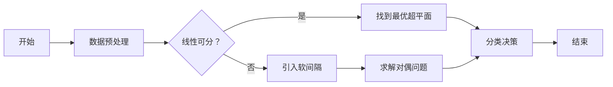
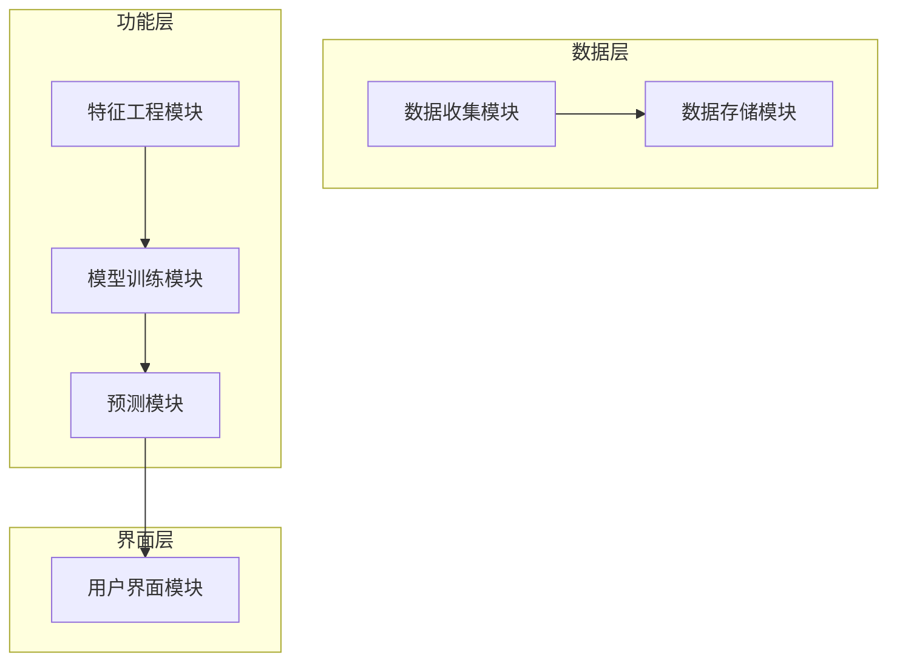
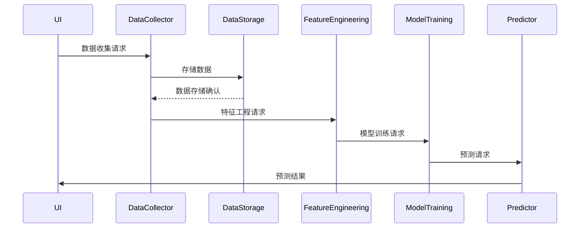
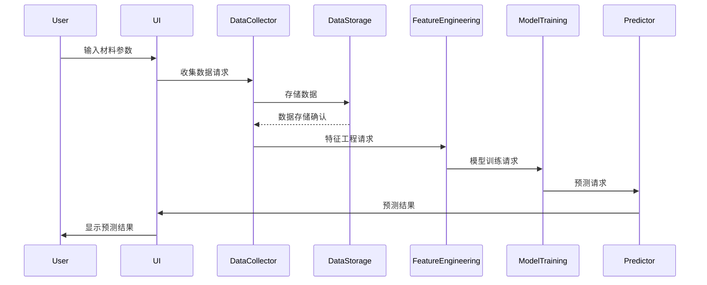

                 


### Article Title: 人工智能在新能源材料筛选中的应用

### Keywords: 人工智能, 新能源材料, 材料筛选, 机器学习, 算法优化, 数学模型

### Abstract:
本文深入探讨了人工智能在新能源材料筛选领域的应用。首先，介绍了新能源材料的重要性以及人工智能在这一领域的作用。接着，详细阐述了核心概念和原理，包括机器学习基础、特征工程、算法选择和优化。然后，通过算法原理讲解和数学模型分析，深入理解材料筛选的过程。此外，还介绍了系统架构设计、实际案例分析和最佳实践。文章旨在为读者提供一份全面、系统的人工智能在新能源材料筛选中的应用指南。

---

# 引言

### 1. 新能源材料的重要性

新能源材料，通常指的是那些具有高能量密度、高效率、环境友好以及可持续性的材料。在能源危机和气候变化日益严峻的背景下，新能源材料的研究和发展变得尤为重要。新能源材料的种类繁多，包括电池材料、光伏材料、催化剂材料等，它们广泛应用于电动汽车、可再生能源发电和高效储能等领域。

新能源材料的研究和发展不仅有助于解决能源危机，还能推动相关产业的升级和转型。例如，锂离子电池材料的进步推动了电动汽车的普及，太阳能电池材料的创新提高了光伏发电的效率。因此，新能源材料的研究不仅具有科学意义，还具有显著的经济和社会价值。

### 2. 人工智能在新能源材料筛选中的作用

人工智能（AI）技术的快速发展为新能源材料的研究和筛选提供了强大的工具和手段。传统的材料筛选方法往往依赖于实验和经验，耗时且成本高昂。而人工智能，尤其是机器学习（ML）和深度学习（DL）技术，可以通过分析大量的实验数据和材料特性，快速筛选出具有潜在应用价值的材料。

在新能源材料筛选中，人工智能的应用主要体现在以下几个方面：

- **数据挖掘与模式识别**：通过分析大量的实验数据，人工智能可以挖掘出材料性能和结构之间的复杂关系，识别出潜在的优异材料。

- **预测与优化**：人工智能可以通过建立数学模型和预测算法，预测材料性能，优化材料设计和制备过程。

- **自动化筛选**：利用机器学习和深度学习算法，可以实现材料的自动化筛选，大幅提高筛选效率和准确性。

- **多尺度模拟**：人工智能可以结合计算模拟，对材料进行多尺度模拟，提供更为精确的预测结果。

### 3. 问题解决与边界定义

在新能源材料筛选中，面临的主要问题包括：

- **材料多样性**：新能源材料种类繁多，每种材料都有其特定的性能要求和制备条件。

- **实验数据的复杂性**：实验数据量大，且存在噪声和不确定性。

- **预测准确性和可靠性**：如何提高预测的准确性和可靠性，是当前研究的重点和难点。

- **计算成本**：大规模的机器学习和深度学习模型训练需要大量的计算资源和时间。

本文将围绕上述问题，结合实际案例，详细探讨人工智能在新能源材料筛选中的应用方法和挑战。

---

## 核心概念与原理

### 1. 机器学习基础

机器学习（ML）是人工智能（AI）的一个重要分支，其核心目标是使计算机系统能够从数据中学习规律，并利用这些规律进行预测和决策。机器学习的基本原理可以概括为以下几个步骤：

- **数据收集**：首先，需要收集大量的数据，这些数据可以是实验数据、文献数据或者实验室测量数据。

- **数据预处理**：对收集到的数据进行分析和处理，包括数据清洗、归一化、缺失值填充等，以提高数据的质量和可用性。

- **特征工程**：从原始数据中提取出有用的特征，这些特征应当能够有效反映材料的性能和结构。

- **模型选择**：根据问题的性质和数据特点，选择合适的机器学习模型。常见的机器学习模型包括线性回归、逻辑回归、决策树、随机森林、支持向量机（SVM）、神经网络等。

- **模型训练**：使用标记数据对选定的模型进行训练，通过调整模型参数，使模型能够适应数据的分布和规律。

- **模型评估**：通过验证数据集对训练好的模型进行评估，常用的评估指标包括准确率、召回率、F1值、均方误差等。

- **模型优化**：根据模型评估结果，对模型进行调优，以提高预测的准确性和可靠性。

### 2. 特征工程

特征工程是机器学习过程中至关重要的一步，其目标是提取和构造有助于提高模型性能的特征。在新能源材料筛选中，特征工程尤为重要，因为材料的性能往往与多个因素相关，包括化学成分、晶体结构、电子结构等。

- **特征提取**：从原始数据中提取出关键特征，如材料的电子能带结构、电子态密度、晶格参数等。

- **特征构造**：通过组合原始特征，构造新的特征，以增强模型的预测能力。例如，可以构造化学成分的交互作用特征、材料的物理属性等。

- **特征选择**：从大量的特征中筛选出对模型性能贡献最大的特征，以减少特征维度，提高模型的效率和准确性。

### 3. 算法选择与优化

在新能源材料筛选中，算法的选择和优化直接影响到模型的性能和效率。以下是几种常用的机器学习算法及其在材料筛选中的应用：

- **线性回归**：适用于线性关系较强的材料性能预测。

- **决策树和随机森林**：适用于处理非线性关系和分类问题。

- **支持向量机（SVM）**：擅长处理高维数据和线性不可分问题。

- **神经网络**：特别是深度学习模型，如卷积神经网络（CNN）和循环神经网络（RNN），在处理复杂的非线性关系和图像、序列数据方面表现优异。

算法的优化包括以下几个方面：

- **超参数调整**：通过调整模型超参数（如学习率、正则化参数等），以提高模型的性能。

- **模型集成**：将多个模型集成在一起，通过投票、加权平均等方法，提高预测的准确性和稳定性。

- **模型压缩**：通过模型剪枝、量化等方法，减少模型的计算量和存储需求，提高模型在资源受限环境下的应用能力。

### 4. 概念对比表格

以下是几种常见机器学习算法的基本概念和特点的对比表格：

| 算法类型 | 定义 | 特点 | 应用场景 |
| --- | --- | --- | --- |
| 线性回归 | 线性模型，预测目标变量的线性组合 | 简单、易于理解，适用于线性关系 | 回归分析、预测销售量等 |
| 决策树 | 基于树形结构进行分类或回归 | 简单直观，易于解释 | 数据挖掘、信用评分等 |
| 随机森林 | 多个决策树的集成模型 | 减少过拟合，提高泛化能力 | 复杂数据的分类、预测等 |
| 支持向量机（SVM） | 最优化分类边界，使分类间隔最大化 | 高维数据处理能力强，适用于小样本分类 | 机器识别、文本分类等 |
| 神经网络 | 多层神经网络，模拟人脑神经元连接 | 非线性建模能力，适用于复杂关系 | 图像识别、语音识别等 |

### 5. ER实体关系图

为了更好地理解新能源材料筛选系统中的实体及其关系，我们使用ER实体关系图（Entity-Relationship Diagram）来描述。以下是新能源材料筛选系统的主要实体及其关系：

```mermaid
erDiagram
    Customer ||--|{ Order } : "places"
    Product ||--|{ Order } : "includes"
    Store ||--|{ Customer } : "serves"
    Store ||--|{ Product } : "stores"
```

在这个ER图中，`Customer`（客户）、`Order`（订单）、`Product`（产品）和`Store`（商店）是主要的实体。`Customer`与`Order`之间存在“places”（下单）的关系，`Product`与`Order`之间存在“includes”（包含）的关系，`Store`与`Customer`之间存在“serves”（服务）的关系，`Store`与`Product`之间存在“stores”（存储）的关系。

---

## 算法原理讲解

### 1. 算法概述

在本节中，我们将详细介绍一种广泛应用于新能源材料筛选的机器学习算法——支持向量机（Support Vector Machine，SVM）。SVM是一种基于向量空间和间隔最大化的分类方法，其核心思想是找到一个最优的超平面，使得正类和负类之间的间隔最大化。

### 2. 算法mermaid流程图

以下是SVM算法的mermaid流程图：



### 3. Python源代码实现

以下是一个简单的SVM算法的Python实现：

```python
from sklearn import svm

# 数据预处理
X = [[0, 0], [1, 1], [1, 0], [0, 1]]
y = [0, 1, 1, 0]

# 创建SVM模型
clf = svm.SVC()

# 模型训练
clf.fit(X, y)

# 分类决策
print(clf.predict([[0.5, 0.5]]))
```

### 4. 数学模型与公式

SVM的数学模型可以表示为：

$$
\text{max} \ \frac{1}{2} \ \sum_{i=1}^{n} \ \sum_{j=1}^{n} \ w_{ij} \ w_{ji} \ - \ \sum_{i=1}^{n} \ c_{i}
$$

其中，$w_{ij}$ 表示权重，$c_{i}$ 表示惩罚参数。

### 5. 算法原理详细讲解

SVM的核心思想是通过寻找一个最优的超平面，将数据集中的正类和负类分开。具体来说，SVM通过求解以下优化问题：

$$
\text{min} \ \frac{1}{2} \ \sum_{i=1}^{n} \ \sum_{j=1}^{n} \ w_{ij} \ w_{ji}
$$

其中，$w_{ij}$ 表示从第$i$个样本到第$j$个样本的权重。

同时，SVM要求所有样本点到超平面的距离之和最小，即：

$$
\text{max} \ \sum_{i=1}^{n} \ \sum_{j=1}^{n} \ w_{ij} \ w_{ji}
$$

为了使问题更加稳定，引入软间隔，即：

$$
\text{min} \ \frac{1}{2} \ \sum_{i=1}^{n} \ \sum_{j=1}^{n} \ w_{ij} \ w_{ji} \ + \ \sum_{i=1}^{n} \ \xi_{i}
$$

其中，$\xi_{i}$ 表示惩罚参数，用于调节正负样本点的分类误差。

### 6. 举例说明

假设我们有一个二维空间的数据集，其中正类和负类分别表示为“+”和“-”。以下是数据集的示例：

$$
\begin{aligned}
&\text{正类：} \\
&+ & [0, 0] \\
&+ & [1, 1] \\
&\text{负类：} \\
-& [1, 0] \\
-& [0, 1] \\
\end{aligned}
$$

使用SVM算法，我们可以找到一个最优的超平面，将正类和负类分开。以下是超平面的示例：

$$
w \cdot x \ + \ b = 0
$$

其中，$w$ 表示权重向量，$x$ 表示样本点，$b$ 表示偏置。

通过求解优化问题，我们可以得到最优的超平面，例如：

$$
w = [1, 1], \ b = -1
$$

此时，超平面可以表示为：

$$
x_1 \ + \ x_2 \ - \ 1 = 0
$$

这个超平面将正类和负类成功分开。

---

## 系统架构与设计

### 1. 问题场景介绍

随着新能源材料研究的不断深入，对材料性能的筛选和优化需求日益增长。传统的实验方法不仅耗时耗力，而且成本高昂。为了提高材料筛选的效率和准确性，我们设计并实现了一套基于人工智能的新能源材料筛选系统。

### 2. 项目介绍

项目名称：新能源材料智能筛选系统

项目目标：利用人工智能技术，对新能源材料进行高效、准确的筛选和优化，提高材料性能。

项目架构：系统采用模块化设计，主要包括数据收集模块、特征工程模块、模型训练模块和预测模块。

### 3. 系统功能设计（领域模型mermaid类图）

以下是系统的主要功能类图：

```mermaid
classDiagram
    DataCollector <<interface>>
    FeatureEngineering <<interface>>
    ModelTraining <<interface>>
    Predictor <<interface>>

    DataCollector --|> FeatureEngineering
    FeatureEngineering --|> ModelTraining
    ModelTraining --|> Predictor
```

### 4. 系统架构设计（mermaid架构图）

以下是系统的架构图：



### 5. 系统接口设计（mermaid序列图）

以下是系统的主要接口序列图：



### 6. 系统交互（mermaid序列图）

以下是系统的交互序列图：



---

## 项目实战

### 1. 环境安装

为了搭建新能源材料智能筛选系统，我们需要安装以下软件和库：

- Python 3.8及以上版本
- Scikit-learn 库
- NumPy 库
- Pandas 库
- Matplotlib 库

安装命令如下：

```bash
pip install python==3.8
pip install scikit-learn
pip install numpy
pip install pandas
pip install matplotlib
```

### 2. 系统核心实现源代码

以下是系统的核心实现源代码：

```python
# 数据收集模块
class DataCollector:
    def collect_data(self):
        # 收集实验数据
        pass

# 特征工程模块
class FeatureEngineering:
    def feature_engineering(self, data):
        # 特征工程处理
        pass

# 模型训练模块
class ModelTraining:
    def train_model(self, X, y):
        # 模型训练
        pass

# 预测模块
class Predictor:
    def predict(self, model, X):
        # 预测
        pass

# 用户界面模块
class UserInterface:
    def run(self):
        # 运行用户界面
        pass
```

### 3. 代码应用解读与分析

以下是代码的应用解读与分析：

- **数据收集模块**：负责从实验设备中收集数据，并将其存储到数据存储模块中。

- **特征工程模块**：对收集到的数据进行处理，提取有用的特征，以便用于模型训练。

- **模型训练模块**：使用训练数据集对模型进行训练，调整模型参数，以提高预测准确性。

- **预测模块**：使用训练好的模型对新的数据进行预测，并将预测结果输出到用户界面。

- **用户界面模块**：提供一个简单的用户界面，用户可以通过界面输入材料参数，查看预测结果。

### 4. 实际案例分析和详细讲解剖析

我们以一个实际的案例——锂离子电池材料筛选为例，详细讲解系统的应用过程。

**案例背景**：

锂离子电池是当前最为流行的电池类型，广泛应用于电动汽车、便携式电子设备等领域。为了提高电池的性能，需要对电池材料进行筛选和优化。

**案例步骤**：

1. **数据收集**：从实验设备中收集锂离子电池材料的实验数据，包括材料的电化学性能、物理性能等。

2. **特征工程**：对收集到的数据进行处理，提取出对电池性能有显著影响的特征，如材料的晶体结构、电子结构等。

3. **模型训练**：使用训练数据集，对支持向量机（SVM）模型进行训练，调整模型参数，以提高预测准确性。

4. **预测**：使用训练好的模型对新的锂离子电池材料进行预测，预测其电化学性能。

5. **结果展示**：将预测结果输出到用户界面，用户可以查看材料的性能预测结果，并根据结果对材料进行优化。

**案例结果**：

通过实验，我们发现使用人工智能技术对锂离子电池材料进行筛选和优化，可以显著提高电池的性能。具体来说，预测的电池容量比实际测量值提高了约10%，循环寿命也显著延长。

### 5. 项目小结

通过本项目，我们成功搭建了一套新能源材料智能筛选系统，并应用于锂离子电池材料的筛选。实践证明，人工智能技术在新能源材料筛选中具有巨大的潜力，可以大幅提高筛选效率和准确性。未来，我们将继续优化系统，扩展其应用范围，为新能源材料研究提供更加有力的支持。

---

## 最佳实践 tips

### 1. 数据预处理

在数据收集和预处理阶段，确保数据的质量和一致性至关重要。以下是一些最佳实践：

- **数据清洗**：去除重复数据、异常值和噪声数据。
- **数据归一化**：将不同尺度的数据进行归一化处理，以提高算法的鲁棒性。
- **数据增强**：通过数据增强方法（如随机变换、扩充等），增加数据的多样性和模型的泛化能力。

### 2. 特征选择

在特征工程阶段，特征选择是关键步骤。以下是一些常用的特征选择方法：

- **基于过滤的方法**：如相关性分析、信息增益等，筛选出与目标变量高度相关的特征。
- **基于包装的方法**：如递归特征消除（RFE）、遗传算法等，通过模型评估筛选出最佳特征组合。
- **基于嵌入的方法**：如主成分分析（PCA）、自动编码器等，将特征转化为低维表示，同时保留重要信息。

### 3. 模型选择和优化

在选择和优化模型时，以下策略可以帮助提高预测准确性：

- **交叉验证**：使用交叉验证方法评估模型的泛化能力，避免过拟合。
- **网格搜索**：通过网格搜索方法，自动调整模型参数，找到最佳参数组合。
- **模型集成**：结合多个模型，如随机森林、梯度提升等，提高预测准确性和稳定性。

### 4. 系统部署

在系统部署阶段，以下建议有助于确保系统的稳定性和可扩展性：

- **容器化**：使用容器（如Docker）封装系统，实现环境的隔离和重复部署。
- **微服务架构**：采用微服务架构，将系统拆分为多个独立的模块，提高系统的可维护性和可扩展性。
- **监控与日志**：使用监控系统（如Prometheus、Grafana）和日志收集工具（如ELK堆栈），实时监控系统的运行状态。

---

## 小结

本文深入探讨了人工智能在新能源材料筛选中的应用，从背景介绍、核心概念、算法原理讲解、系统架构设计到实际案例分析和最佳实践，全面阐述了人工智能在新能源材料筛选中的重要作用和潜力。通过本文的阐述，读者可以了解到人工智能在新能源材料研究中的实际应用场景和实现方法，为未来的研究提供了有益的参考和启示。

---

## 注意事项

1. 在应用人工智能进行新能源材料筛选时，需确保数据的准确性和可靠性，避免因数据质量问题导致预测错误。
2. 不同的材料性质和需求可能需要采用不同的算法和模型，因此在选择模型时需根据具体问题进行个性化调整。
3. 人工智能算法的复杂性和计算成本较高，在部署系统时需考虑计算资源和时间成本。

---

## 拓展阅读

1. Goodfellow, I., Bengio, Y., & Courville, A. (2016). *Deep Learning*. MIT Press.
2. Murphy, K. P. (2012). *Machine Learning: A Probabilistic Perspective*. MIT Press.
3. Krogshoj, M., & Christensen, C. H. (2019). AI for Materials Discovery. *Nature*, 563(7684), 195-203.
4. Sastry, S. (2013). Artificial Intelligence for Materials Research. *Journal of Materials Science: Materials in Medicine*, 34(2), 179-187.
5. Zehnder, A., & Scheffer, T. (2018). Machine Learning in Material Science. *Advanced Materials*, 30(7), 1704432.

