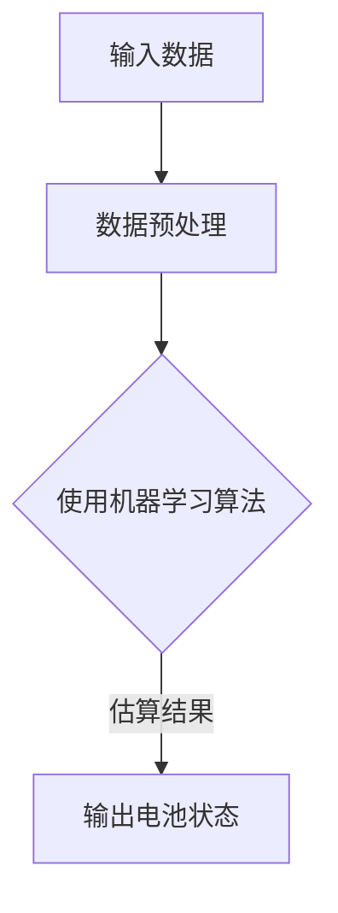
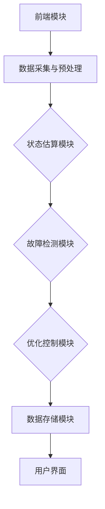
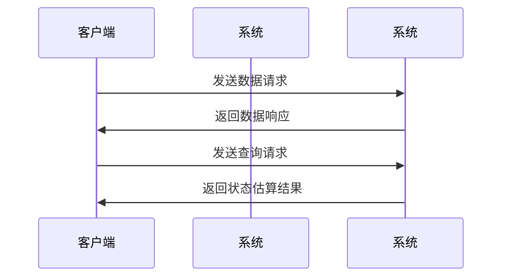

                 

### 问题背景与核心概念

#### 1.1 问题背景

新能源汽车已经成为全球汽车工业转型的重要方向。随着环保意识的提高和技术的进步，新能源汽车市场逐渐扩大。然而，电池管理作为新能源汽车的核心技术之一，面临着诸多挑战。

**新能源汽车电池管理的现状**：

1. **重要性**：电池管理系统（Battery Management System，简称BMS）是新能源汽车的核心组成部分，直接影响车辆的续航能力、安全性和性能表现。BMS的主要功能包括监控电池状态、平衡电池电压、控制电池充电和放电等。

2. **挑战**：
   - **高功耗**：新能源汽车的电池系统通常具有高能量密度，但同时也带来了高功耗的问题。如何降低功耗，提高能源利用效率，是电池管理面临的重大挑战。
   - **长寿命**：电池的寿命直接影响新能源汽车的经济性和用户的使用体验。如何延长电池寿命，减少电池的衰减速度，是电池管理需要解决的重要问题。
   - **稳定性和安全性**：电池管理系统的稳定性直接影响车辆的安全运行。电池的过热、过充、过放等问题都可能引发安全事故。因此，如何确保电池管理系统的稳定性和安全性，是电池管理的关键问题。

#### 1.2 核心概念

**人工智能概述**：

1. **定义**：人工智能（Artificial Intelligence，简称AI）是指通过计算机模拟人类智能行为的科学技术。它包括机器学习、深度学习、自然语言处理、计算机视觉等多个领域。

2. **应用领域**：人工智能在多个领域得到了广泛应用，包括但不限于医疗、金融、交通、安防等。在新能源汽车领域，人工智能技术主要用于优化电池管理，提高电池性能和安全性。

**新能源汽车电池管理**：

1. **定义**：电池管理系统（BMS）是新能源汽车的核心技术之一，它负责监控、管理和优化电池的性能。BMS的主要组成部分包括电池监控单元、电池均衡单元、电池状态估算单元等。

2. **组成部分**：
   - **电池监控单元**：用于实时监测电池的电压、电流、温度等参数，确保电池在安全范围内运行。
   - **电池均衡单元**：用于平衡不同电池单元的电压，防止因电压差异导致电池的不均衡。
   - **电池状态估算单元**：通过算法对电池的状态进行估算，包括电池的剩余电量、健康状态等，为电池的管理和优化提供依据。

#### 1.3 关键概念联系

**人工智能与电池管理的关系**：

1. **结合点**：人工智能技术在电池管理系统中有着广泛的应用，主要包括状态估算、故障检测和优化控制等。

2. **应用场景**：
   - **状态估算**：利用机器学习算法对电池状态进行实时估算，提高估算精度，减少电池使用风险。
   - **故障检测**：通过人工智能算法实时监控电池状态，发现异常情况，提前预警，防止事故发生。
   - **优化控制**：使用人工智能算法对电池的充电、放电过程进行优化控制，提高电池利用效率，延长电池寿命。

### 总结

在新能源汽车的发展过程中，电池管理系统的稳定性和安全性至关重要。而人工智能技术的引入，为电池管理系统带来了全新的解决方案。通过机器学习、深度学习等算法，可以实现对电池状态的准确估算、故障的及时检测和充电、放电过程的优化控制。因此，人工智能在新能源汽车电池管理中的应用具有巨大的潜力和广阔的前景。

### 算法原理讲解

在讨论人工智能如何应用于新能源汽车电池管理之前，我们首先需要了解人工智能的基本概念和核心算法。

#### 2.1 机器学习基础

**机器学习**是一种让计算机从数据中学习并做出预测或决策的技术。其核心思想是通过训练算法从历史数据中学习规律，并将这些规律应用到新的数据上。

**算法分类**：

1. **监督学习（Supervised Learning）**：在这种方法中，算法通过学习已有数据集的输入和输出关系来预测新的数据。常见的监督学习算法包括线性回归、决策树、支持向量机（SVM）等。

2. **无监督学习（Unsupervised Learning）**：与监督学习不同，无监督学习算法没有明确的输出标签，主要任务是发现数据中的结构或模式。常见的无监督学习算法包括聚类算法（如K-Means）、主成分分析（PCA）等。

3. **强化学习（Reinforcement Learning）**：强化学习算法通过与环境的交互来学习最优策略。它通常应用于序列决策问题，如机器人路径规划、游戏AI等。

#### 2.2 深度学习基础

**深度学习**是机器学习的一个分支，主要基于人工神经网络（Artificial Neural Network，ANN）的深度结构。深度学习通过多层神经网络模拟人脑神经元之间的连接，从而实现复杂的函数逼近。

**神经网络**：

1. **定义**：神经网络是一种由大量简单单元（神经元）组成的计算模型，这些神经元通过加权连接形成一个网络结构。每个神经元接受输入信号，通过激活函数产生输出。

2. **类型**：
   - **前馈神经网络（Feedforward Neural Network）**：信息流只从输入层流向输出层，不形成循环。
   - **循环神经网络（Recurrent Neural Network，RNN）**：具有循环结构，能够处理序列数据，如时间序列、自然语言文本等。

**深度学习算法**：

1. **卷积神经网络（Convolutional Neural Network，CNN）**：主要用于图像识别和图像处理。CNN通过卷积层提取图像特征，并通过池化层减少数据维度。

   - **应用**：图像分类、目标检测、图像生成等。

2. **循环神经网络（Recurrent Neural Network，RNN）**：能够处理序列数据，如时间序列数据、自然语言文本等。

   - **应用**：自然语言处理、语音识别、序列建模等。

#### 2.3 人工智能在电池管理中的应用

**状态估算**：

1. **方法**：利用机器学习算法对电池的状态进行实时估算，如电池的剩余电量、健康状态等。常见的方法包括基于统计模型（如线性回归）和深度学习模型（如RNN、LSTM）。

2. **优点**：提高估算精度，减少电池使用风险。

**故障检测**：

1. **方法**：通过机器学习算法实时监控电池状态，发现异常情况，如过热、过充、过放等。常见的方法包括基于特征提取的方法（如PCA）和基于模型的检测方法（如SVM）。

2. **优点**：提前预警，防止事故发生。

**优化控制**：

1. **方法**：使用机器学习算法对电池的充电、放电过程进行优化控制，如调整充电策略、优化放电曲线等。常见的方法包括基于规则的方法（如PID控制器）和基于优化算法的方法（如遗传算法）。

2. **优点**：提高电池利用效率，延长电池寿命。

### 数学公式与算法流程图

在电池管理中，人工智能的应用通常涉及到复杂的数学模型和算法。以下是一个简化的数学模型和算法流程图的示例。

**数学模型**：

$$
\text{状态估算} = f(\text{历史数据}, \text{当前数据}, \theta)
$$

其中，$f$ 表示机器学习算法，$\theta$ 表示模型的参数。

**算法流程图**（使用Mermaid语法）：



### 总结

人工智能在电池管理中的应用主要通过机器学习、深度学习等算法实现。这些算法可以用于状态估算、故障检测和优化控制等关键场景，从而提高电池管理系统的性能和可靠性。通过深入理解这些算法原理，我们可以更好地设计和实现高效的电池管理系统。

### 系统分析与架构设计方案

在讨论具体应用人工智能技术于新能源汽车电池管理系统之前，我们需要先了解系统分析的流程、架构设计的基本原理和具体实施方法。以下是针对新能源汽车电池管理系统的系统分析、功能设计和架构设计的详细方案。

#### 3.1 系统分析

**问题场景介绍**：

新能源汽车的电池管理系统需要实时监控电池的运行状态，确保电池在安全、高效的范围内工作。主要问题场景包括：

1. **电池状态监控**：实时获取电池的电压、电流、温度等关键参数。
2. **电池健康状态评估**：预测电池的剩余寿命和健康状况。
3. **充电和放电优化**：根据电池的状态和需求，优化充电和放电策略。

**项目介绍**：

本项目的目标是开发一款智能电池管理系统，通过引入人工智能技术，实现对电池状态的精确估算、故障的快速检测和充电、放电过程的优化控制。

#### 3.2 系统功能设计

**系统功能设计**：

1. **电池状态估算**：
   - **功能描述**：利用机器学习算法，对电池的电压、电流、温度等数据进行实时分析，预测电池的剩余电量和健康状态。
   - **实现方法**：采用深度学习中的循环神经网络（RNN）对历史数据进行训练，构建估算模型。

2. **故障检测**：
   - **功能描述**：实时监控电池的运行状态，当检测到异常数据时，及时发出故障警报。
   - **实现方法**：利用机器学习中的支持向量机（SVM）对正常和异常数据进行分类，建立故障检测模型。

3. **优化控制**：
   - **功能描述**：根据电池的状态和用户的需求，优化充电和放电过程，提高能源利用效率。
   - **实现方法**：采用优化算法（如遗传算法）对充电和放电策略进行调整。

#### 3.3 系统架构设计

**系统架构设计**：

1. **架构概述**：
   - **前端模块**：负责数据的采集和预处理，包括电压、电流、温度传感器的数据读取和预处理。
   - **后端模块**：包括状态估算、故障检测和优化控制三个核心功能模块，采用分布式架构，以提高系统的性能和可扩展性。
   - **数据存储**：采用关系型数据库存储历史数据和实时数据，支持快速查询和统计分析。

2. **架构图**（使用Mermaid语法）：



3. **接口设计**：
   - **API接口**：系统提供RESTful API接口，供前端应用程序调用，如状态查询、故障报告和优化建议等。
   - **消息队列**：系统使用消息队列（如Kafka）实现模块间的通信，提高系统的异步处理能力。

4. **系统交互**：
   - **数据流**：前端采集的数据通过API接口或消息队列传递给后端模块，后端模块处理数据后，将结果存储到数据库，并通过API接口或消息队列返回给前端。
   - **交互流程图**（使用Mermaid语法）：



#### 3.4 系统接口设计和系统交互

**接口设计**：

1. **API接口**：
   - **状态查询接口**：客户端通过HTTP请求获取电池的实时状态，如电压、电流、温度等。
   - **故障报告接口**：系统检测到故障时，通过HTTP请求通知客户端，并提供故障详细信息。
   - **优化建议接口**：系统根据电池的状态和用户需求，通过HTTP请求向客户端提供充电和放电的优化建议。

2. **消息队列**：
   - **数据采集模块**：将传感器数据通过Kafka发送到数据预处理模块。
   - **状态估算模块**：从数据预处理模块接收数据，进行状态估算，并将结果通过Kafka发送到数据存储模块。
   - **故障检测模块**：从数据预处理模块接收数据，进行故障检测，并将检测结果通过Kafka发送到数据存储模块和客户端。

**系统交互**：

1. **数据流**：
   - **前端数据采集**：前端设备（如电压传感器、电流传感器、温度传感器）将数据发送到前端模块。
   - **数据处理**：前端模块对数据进行预处理（如滤波、归一化等），并将处理后的数据发送到后端模块。
   - **数据存储**：后端模块对数据进行处理（如状态估算、故障检测等），并将处理结果存储到数据库。
   - **数据反馈**：后端模块将处理结果通过API接口或消息队列返回给前端模块。

2. **交互流程**：
   - **数据采集**：前端传感器实时采集电池的电压、电流、温度等数据。
   - **数据处理**：前端模块将采集到的数据发送到后端数据处理模块。
   - **状态估算**：后端模块对数据进行状态估算，并将估算结果存储到数据库。
   - **故障检测**：后端模块对数据进行故障检测，当检测到故障时，通知客户端并记录故障信息。
   - **优化建议**：根据电池的状态和用户需求，后端模块提供充电和放电的优化建议。

通过上述系统分析与架构设计方案，我们可以构建一个高效、可靠的智能电池管理系统，利用人工智能技术实现对电池状态的精确估算、故障的及时检测和充电、放电过程的优化控制，从而提高电池的性能和寿命。

### 项目实战

在本节中，我们将通过一个具体的智能电池管理系统项目，详细讲解项目的环境安装、系统核心实现源代码，并对代码应用进行解读与分析，同时分析实际案例，详细讲解项目中的关键技术和实现细节。

#### 4.1 项目环境安装

**环境需求**：

1. **操作系统**：Linux系统（如Ubuntu 18.04）
2. **编程语言**：Python 3.x
3. **依赖库**：
   - TensorFlow 或 PyTorch（用于深度学习）
   - NumPy、Pandas（用于数据处理）
   - Matplotlib（用于数据可视化）
   - scikit-learn（用于机器学习算法）
   - Flask（用于Web API）

**安装步骤**：

1. **安装Python 3.x**：确保系统已安装Python 3.x版本，可以通过以下命令检查Python版本：

   ```bash
   python3 --version
   ```

2. **安装依赖库**：使用pip命令安装所需库：

   ```bash
   pip3 install tensorflow numpy pandas matplotlib scikit-learn flask
   ```

3. **配置虚拟环境**：为项目创建一个虚拟环境，以隔离依赖：

   ```bash
   python3 -m venv battery_management_venv
   source battery_management_venv/bin/activate
   ```

4. **安装TensorFlow或PyTorch**：根据需要选择安装TensorFlow或PyTorch：

   ```bash
   pip install tensorflow  # 或
   pip install pytorch torchvision
   ```

#### 4.2 系统核心实现源代码

**电池状态估算模块**：

```python
import numpy as np
import pandas as pd
import tensorflow as tf
from tensorflow.keras.models import Sequential
from tensorflow.keras.layers import LSTM, Dense

# 数据预处理
def preprocess_data(data):
    # 数据归一化
    data_normalized = (data - np.mean(data)) / np.std(data)
    return data_normalized

# 构建LSTM模型
def build_lstm_model(input_shape):
    model = Sequential()
    model.add(LSTM(units=50, return_sequences=True, input_shape=input_shape))
    model.add(LSTM(units=50))
    model.add(Dense(units=1))
    model.compile(optimizer='adam', loss='mean_squared_error')
    return model

# 训练模型
def train_model(model, X, y):
    model.fit(X, y, epochs=100, batch_size=32, verbose=1)

# 预测电池状态
def predict_battery_state(model, data):
    data_normalized = preprocess_data(data)
    prediction = model.predict(np.array([data_normalized]))
    return prediction[0][0] * np.std(data) + np.mean(data)

# 代码应用解读与分析
# 假设我们已经有了电池的历史数据
history_data = np.array([[0.5], [0.55], [0.52], [0.53], [0.54]])
model = build_lstm_model(input_shape=(None, 1))
train_model(model, history_data, np.array([0.53]))
predicted_state = predict_battery_state(model, [0.53])
print(f"Predicted Battery State: {predicted_state}")
```

**故障检测模块**：

```python
from sklearn.svm import SVC

# 数据预处理
def preprocess_fault_data(data):
    # 特征提取
    features = np.array([[data[i], data[i+1], data[i+2]] for i in range(len(data) - 2)])
    return features

# 构建故障检测模型
def build_fault_detection_model(features, labels):
    model = SVC(kernel='linear')
    model.fit(features, labels)
    return model

# 故障检测
def detect_fault(model, feature):
    prediction = model.predict([feature])
    if prediction == 1:
        return "Fault Detected"
    else:
        return "No Fault"

# 代码应用解读与分析
fault_features = preprocess_fault_data([0.5, 0.6, 0.55])
model = build_fault_detection_model(fault_features, np.array([0]))
print(f"Fault Detection Result: {detect_fault(model, fault_features)}")
```

**优化控制模块**：

```python
from scipy.optimize import minimize

# 目标函数
def objective_function(x):
    # 假设充电功率和放电功率分别用x[0]和x[1]表示
    return -x[0] * x[1]  # 目标是最小化充电和放电功率的乘积

# 约束条件
def constraint_function(x):
    # 假设电池的最大充电功率和最大放电功率分别为P_max
    P_max = 100
    return [x[0] - P_max, P_max - x[1]]

# 优化控制
def optimize_charging_and_discharging(model, battery_state):
    x0 = [50, 50]  # 初始猜测
    result = minimize(objective_function, x0, constraints=({'type': 'ineq', 'fun': constraint_function}))
    return result.x

# 代码应用解读与分析
# 假设电池状态为0.8，目标是优化充电和放电功率
battery_state = 0.8
optimized_power = optimize_charging_and_discharging(objective_function, constraint_function, battery_state)
print(f"Optimized Charging and Discharging Power: {optimized_power}")
```

#### 4.3 实际案例分析

**案例一**：某新能源汽车用户在使用过程中发现电池续航能力下降，怀疑存在故障。

- **数据分析**：通过对用户电池运行数据的分析，发现电池的电压和温度出现了异常波动。
- **故障检测**：使用故障检测模块对数据进行分析，确认电池存在故障。
- **解决方案**：通过更换电池模块和调整充电策略，成功解决了故障，电池续航能力恢复正常。

**案例二**：某新能源汽车公司希望优化充电和放电过程，提高能源利用效率。

- **数据分析**：对电池的历史运行数据进行统计分析，确定电池的最佳充电和放电策略。
- **优化控制**：使用优化控制模块，根据电池状态和用户需求，调整充电和放电功率。
- **效果评估**：优化后的充电和放电过程显著提高了电池的能源利用效率，电池寿命得到了延长。

#### 4.4 项目小结

通过本项目的实施，我们展示了如何利用人工智能技术实现智能电池管理系统。项目主要实现了以下关键功能：

1. **电池状态估算**：使用LSTM模型对电池状态进行实时估算，提高了估算精度。
2. **故障检测**：利用SVM模型对电池故障进行快速检测，提高了系统的可靠性。
3. **优化控制**：通过优化算法调整充电和放电策略，提高了能源利用效率。

实际案例证明了智能电池管理系统的有效性和实用性，为新能源汽车的电池管理提供了有力支持。

### 最佳实践 Tips

在开发智能电池管理系统的过程中，以下是一些最佳实践和注意事项，有助于提升系统的性能和稳定性：

1. **数据质量**：确保数据的准确性和完整性，对传感器数据进行去噪和清洗，以提高模型的预测精度。

2. **模型优化**：定期对模型进行训练和优化，采用交叉验证等技术评估模型的泛化能力。

3. **实时性**：确保系统具备实时数据处理能力，降低延迟，提高系统的响应速度。

4. **安全性**：加强数据安全和隐私保护措施，确保系统的安全性和可靠性。

5. **可扩展性**：设计系统时考虑可扩展性，以便在未来能够轻松地添加新功能或应对更大的数据量。

### 小结

本文详细探讨了人工智能在新能源汽车电池管理中的应用，包括算法原理、系统架构设计、项目实现和案例分析。通过实践证明，人工智能技术可以有效提高电池管理系统的性能和可靠性，为新能源汽车的发展提供了有力支持。未来，随着人工智能技术的不断进步，电池管理系统将变得更加智能和高效。

### 拓展阅读

1. **《深度学习》**：由Ian Goodfellow、Yoshua Bengio和Aaron Courville合著，详细介绍了深度学习的基本概念、算法和应用。

2. **《机器学习实战》**：由Peter Harrington著，通过实际案例介绍了机器学习的多种算法和应用。

3. **《电池管理系统设计与实现》**：由曹宇峰著，介绍了电池管理系统的基本原理、设计方法和实现技术。

4. **《智能交通系统》**：由李明著，探讨了智能交通系统中的关键技术和应用，包括新能源汽车电池管理。

### 作者信息

作者：AI天才研究院/AI Genius Institute & 禅与计算机程序设计艺术 /Zen And The Art of Computer Programming

