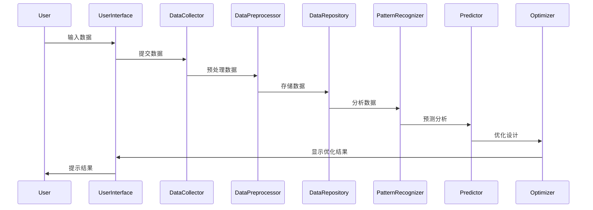

                 

### 引言

#### 1.1 问题背景

新药临床试验作为药物研发过程中的关键环节，承担着评估药物安全性和有效性的重任。然而，当前的临床试验面临着诸多挑战，主要体现在以下三个方面：

1. **时间成本高**：新药临床试验通常需要数年时间，从初期设计到最终结果产出，整个过程耗时较长。这不仅延长了药物上市的时间，也增加了研发成本。
   
2. **成本高**：临床试验涉及大量的资金投入，包括人员成本、设备成本和试验药品成本等。此外，临床试验过程中的不确定性，如患者入组困难、试验失败等，也会进一步增加成本。

3. **失败率高**：根据统计，新药临床试验的成功率通常较低，许多药物在临床试验阶段就已经被淘汰。这导致了巨大的资源浪费，也降低了药物研发的效率。

为了应对这些挑战，提高新药临床试验的效率和降低成本成为了亟待解决的问题。而人工智能（AI）技术的发展，为这一领域提供了新的可能性。

#### 1.2 人工智能的应用场景

人工智能技术在临床试验中的应用场景主要包括以下几个方面：

1. **数据分析**：人工智能能够处理和分析海量的临床试验数据，从中挖掘出有价值的信息，如患者的反应模式、药物的安全性和有效性等。

2. **模式识别**：通过机器学习算法，人工智能可以识别出试验数据中的规律和模式，从而预测药物的效果和患者对药物的响应。

3. **预测分析**：人工智能还可以根据历史数据和现有数据，对未来的临床试验结果进行预测，帮助研究人员制定更有效的临床试验计划。

通过这些应用场景，人工智能在临床试验中可以发挥重要的作用，提高临床试验的效率和准确性。

### 问题描述

在面对新药临床试验的挑战时，我们提出以下两个问题：

1. **如何提高新药临床试验的效率？**
   - **问题描述**：新药临床试验的时间成本高，导致药物研发周期长。如何利用人工智能技术缩短临床试验时间，提高研发效率？
   - **解决思路**：通过数据分析、模式识别和预测分析等技术，优化临床试验的设计和执行过程，从而提高临床试验的效率。

2. **如何降低临床试验的成本？**
   - **问题描述**：新药临床试验的成本高，增加了药物研发的经济负担。如何利用人工智能技术降低临床试验的成本？
   - **解决思路**：通过智能化的数据挖掘和预测，优化临床试验的设计，减少不必要的试验环节，降低试验成本。

通过以上问题的解决，可以显著提高新药临床试验的效率和降低成本，从而推动药物研发的进展。

### 问题解决

为了解决新药临床试验中面临的挑战，人工智能技术在多个方面展现出了巨大的潜力。以下是一些主要的应用方向：

1. **临床数据挖掘与分析**：人工智能可以处理和分析临床试验产生的海量数据，从中挖掘出有价值的信息。例如，通过对患者数据的分析，可以识别出潜在的药物不良反应，从而提前预防和减少试验风险。此外，人工智能还可以利用历史数据，预测新药在临床试验中的效果，帮助研究人员调整试验策略。

2. **药物代谢与作用机理预测**：人工智能可以通过模拟药物在人体内的代谢过程，预测药物的作用机理和效果。这种预测可以帮助研究人员在新药设计阶段就评估药物的安全性和有效性，从而减少临床试验的失败率。

3. **临床试验设计优化**：人工智能可以根据临床试验的历史数据和现有数据，自动生成最优的试验设计方案。这种设计优化可以提高试验的准确性和效率，减少试验时间。

通过以上应用，人工智能在新药临床试验中可以发挥重要作用，提高临床试验的效率和降低成本。

#### 1.4 边界与外延

##### 1.4.1 新药临床试验的边界

新药临床试验的边界主要包括以下几个方面：

1. **研究阶段**：临床试验通常分为Ⅰ、Ⅱ、Ⅲ、Ⅳ期，每个阶段都有特定的研究目的和研究方法。
2. **参与者**：临床试验的参与者通常是健康志愿者或患者，他们需要根据特定的标准入选试验。
3. **数据收集**：临床试验需要收集大量的数据，包括患者的生理指标、药物剂量、不良反应等。

##### 1.4.2 人工智能的应用边界

人工智能在临床试验中的应用边界包括：

1. **技术层面**：人工智能的应用需要依赖先进的算法和技术，如机器学习、深度学习、自然语言处理等。
2. **数据质量**：人工智能的性能受到数据质量的影响，因此需要确保临床试验数据的准确性和完整性。
3. **伦理和法规**：人工智能在临床试验中的应用需要遵守伦理和法规要求，保护患者的隐私和权益。

### 总结

通过本文的讨论，我们可以看到，人工智能在新药临床试验中具有巨大的应用潜力。通过临床数据挖掘与分析、药物代谢与作用机理预测、临床试验设计优化等技术，人工智能可以提高临床试验的效率和降低成本。然而，人工智能的应用也面临着一些边界和挑战，如技术实现、数据质量和伦理法规等。未来，随着人工智能技术的不断发展和完善，我们有理由相信，它将为新药临床试验带来更加显著的创新和进步。

### 核心概念与联系

#### 2.1 人工智能的基本概念

##### 2.1.1 人工智能的定义
人工智能（Artificial Intelligence, AI）是指通过计算机模拟人类的智能行为，使机器能够感知、理解、学习和适应环境的技术和科学。人工智能的目标是实现机器的自主决策和智能行为，从而替代或辅助人类的智力劳动。

##### 2.1.2 人工智能的发展历程
人工智能的发展历程可以分为以下几个阶段：
1. **启蒙阶段（20世纪50年代至70年代）**：这一阶段以符号主义方法为主，通过编写规则和逻辑推理来模拟人类智能。
2. **衰退阶段（20世纪70年代至80年代）**：由于符号主义方法的局限性，人工智能进入了一个低潮期。
3. **复兴阶段（20世纪80年代至90年代）**：随着专家系统和机器学习的兴起，人工智能开始逐渐复苏。
4. **快速发展阶段（21世纪以来）**：深度学习、神经网络等先进技术的出现，使得人工智能在图像识别、自然语言处理、语音识别等领域取得了显著突破。

##### 2.1.3 人工智能的核心技术
人工智能的核心技术包括：
1. **机器学习**：通过算法让计算机从数据中学习并做出决策。
2. **深度学习**：基于人工神经网络的一种机器学习方法，能够在大量数据中进行自我学习和优化。
3. **自然语言处理**：使计算机能够理解和生成人类语言的技术。
4. **计算机视觉**：使计算机能够识别和理解图像和视频的技术。

#### 2.2 新药临床试验的基本概念

##### 2.2.1 新药临床试验的定义
新药临床试验是指在新药开发过程中，对药物的安全性和有效性进行评估的研究活动。临床试验通常分为四个阶段，每个阶段都有特定的研究目标和数据收集要求。

##### 2.2.2 新药临床试验的类型
新药临床试验的类型包括：
1. **Ⅰ期临床试验**：主要评估药物的安全性，通常在小范围内进行。
2. **Ⅱ期临床试验**：评估药物的治疗效果和剂量范围，通常在更大的患者群体中进行。
3. **Ⅲ期临床试验**：评估药物的疗效和安全性，通常在广泛的患者群体中进行。
4. **Ⅳ期临床试验**：在药物上市后进行，主要关注药物的长期疗效和安全性。

##### 2.2.3 新药临床试验的关键环节
新药临床试验的关键环节包括：
1. **试验设计**：包括试验类型、样本量、对照组设置等。
2. **数据收集**：包括患者的生理指标、药物剂量、不良反应等。
3. **数据分析**：对收集到的数据进行统计分析和解释。
4. **结果报告**：将试验结果进行总结和报告，以指导药物的研发和审批。

#### 2.3 人工智能与新药临床试验的联系

##### 2.3.1 人工智能技术在临床试验中的应用原理
人工智能技术在临床试验中的应用原理主要包括：
1. **数据挖掘与分析**：通过机器学习算法，从海量临床试验数据中挖掘出有价值的信息，如药物疗效、不良反应等。
2. **模式识别**：通过分析患者数据和临床试验结果，识别出潜在的治疗模式或不良反应模式。
3. **预测分析**：利用历史数据和现有数据，预测新药的临床试验结果，帮助研究人员制定更有效的试验计划。

##### 2.3.2 人工智能在新药临床试验中的优势
人工智能在新药临床试验中的优势包括：
1. **提高效率**：通过自动化和智能化的数据分析，可以显著缩短临床试验时间。
2. **降低成本**：通过优化临床试验设计和减少不必要的试验环节，可以降低临床试验的成本。
3. **提高准确性**：通过数据挖掘和预测分析，可以更准确地评估药物的安全性和有效性。
4. **增强可解释性**：通过可视化和解释技术，使临床试验结果更加透明和易于理解。

### 数学模型与公式

为了更好地理解人工智能技术在临床试验中的应用，我们引入一些关键的数学模型和公式。

#### 4.1 数据挖掘与分析的数学模型

数据挖掘与分析的流程可以表示为：
$$
流程 = 数据预处理 + 特征选择 + 模型选择 + 模型训练 + 模型评估
$$

其中，每个步骤都有其特定的数学模型和算法。

1. **数据预处理**：数据预处理包括数据清洗、归一化、缺失值处理等。其目的是提高数据的质量和一致性。

2. **特征选择**：特征选择是指从大量特征中选择出对预测任务最有用的特征。常用的特征选择方法包括基于信息论的、基于距离的、基于模型的等。

3. **模型选择**：模型选择是指选择合适的机器学习模型进行训练。常见的机器学习模型包括线性回归、逻辑回归、支持向量机、神经网络等。

4. **模型训练**：模型训练是指利用训练数据集对选定的模型进行训练，以优化模型的参数。

5. **模型评估**：模型评估是指利用验证数据集或测试数据集评估模型的性能，常用的评估指标包括准确率、召回率、F1值等。

一个典型的数据挖掘流程可以用以下数学模型表示：
$$
模型 = 函数 + 参数 + 数据
$$
其中，函数表示模型的预测逻辑，参数表示模型训练得到的参数值，数据表示用于训练和评估的数据集。

#### 4.2 药物代谢与作用机理预测的数学模型

药物代谢与作用机理预测的数学模型主要包括以下两个方面：

1. **药物代谢模型**：药物代谢模型描述药物在人体内的代谢过程。一个简单的药物代谢模型可以表示为：
   $$
   药物浓度 = 药物吸收速度 \times 时间
   $$
   其中，药物吸收速度是一个关于时间的函数，反映了药物进入体内的速度。

2. **作用机理预测模型**：作用机理预测模型用于预测药物在特定细胞或组织中的作用效果。一个简单的作用机理预测模型可以表示为：
   $$
   预测值 = 函数（输入特征）
   $$
   其中，输入特征包括药物的化学结构、生物标记物等，函数表示药物的作用机理。

### 系统架构设计

#### 5.1 问题场景介绍

临床试验中的问题场景主要包括以下几个方面：

1. **数据复杂性**：临床试验产生的数据种类繁多，包括电子健康记录、实验室检测结果、患者生理指标等，这些数据格式和结构各异，给数据处理和分析带来了巨大的挑战。

2. **试验复杂性**：临床试验通常涉及多个阶段和多种试验设计，如随机对照试验、单臂试验等，每个试验阶段都有特定的研究目标和数据收集要求，这增加了试验管理的复杂性。

3. **数据隐私和安全**：临床试验数据通常包含敏感信息，如患者健康状况、药物剂量等，如何确保数据的安全和隐私成为临床试验中的关键问题。

人工智能在临床试验中的应用场景主要包括：

1. **数据预处理和分析**：利用人工智能技术对临床试验数据进行预处理，如数据清洗、归一化、特征提取等，从而提高数据质量，便于后续分析。

2. **模式识别和预测**：通过人工智能技术识别临床试验数据中的潜在模式，如药物不良反应、疗效等，从而为临床试验提供决策支持。

3. **试验设计优化**：利用人工智能技术优化临床试验设计，如样本量估算、对照组设置等，以提高试验效率和效果。

4. **结果分析和报告**：利用人工智能技术对临床试验结果进行分析和报告，以提高结果的可解释性和可信度。

#### 5.2 系统功能设计

##### 5.2.1 领域模型

领域模型用于描述临床试验中的关键实体及其关系。以下是一个简化的领域模型，使用Mermaid类图表示：

```mermaid
classDiagram
    Patient <|-- Study
    Study <|-- Treatment
    Treatment <|-- Drug
    Drug <|-- SideEffect
    Patient <|-- MedicalHistory
    Study {data}
    Treatment {protocol}
    Drug {chemicalStructure, pharmacodynamics}
    SideEffect {symptom, severity}
    MedicalHistory {condition, treatment}
```

在该模型中，Patient（患者）是核心实体，与其他实体如Study（研究）、Treatment（治疗）、Drug（药物）和SideEffect（副作用）之间存在关联。MedicalHistory（医疗历史）用于记录患者的健康状况和治疗史。

##### 5.2.2 系统功能模块

系统功能模块主要包括以下部分：

1. **数据采集模块**：负责收集临床试验中的各种数据，如电子健康记录、实验室检测结果、患者生理指标等。

2. **数据预处理模块**：对采集到的数据进行清洗、归一化、特征提取等预处理操作，以提高数据质量。

3. **模式识别模块**：利用机器学习算法识别数据中的潜在模式，如药物不良反应、疗效等。

4. **预测模块**：基于历史数据和现有数据，预测新药的临床试验结果，如疗效、安全性等。

5. **优化模块**：利用优化算法优化临床试验设计，如样本量估算、对照组设置等。

6. **结果分析模块**：对临床试验结果进行分析和报告，以提高结果的可解释性和可信度。

7. **用户接口模块**：提供用户交互界面，使研究人员能够方便地使用系统功能。

#### 5.3 系统架构设计

##### 5.3.1 系统架构图

以下是一个简化的系统架构图，使用Mermaid架构图表示：

```mermaid
sequenceDiagram
    Participant->>System: 数据提交
    System->>DataCollector: 数据采集
    DataCollector->>DataPreprocessor: 数据预处理
    DataPreprocessor->>DataRepository: 存储预处理数据
    DataRepository->>PatternRecognizer: 数据分析
    PatternRecognizer->>Predictor: 预测分析
    Predictor->>Optimizer: 优化设计
    Optimizer->>System: 提供优化结果
    System->>ResultAnalyzer: 分析结果
    ResultAnalyzer->>UserInterface: 输出报告
```

在该架构中，系统通过数据采集模块从参与者处获取数据，然后通过数据预处理模块对数据进行处理和存储。模式识别模块和预测模块利用处理后的数据进行分析和预测，优化模块根据预测结果进行临床试验设计的优化。最后，结果分析模块对临床试验结果进行分析和报告，并通过用户接口模块将结果呈现给用户。

##### 5.3.2 系统架构设计原理

系统架构设计主要遵循以下原则：

1. **模块化设计**：将系统功能划分为多个模块，每个模块负责特定的功能，以便于开发和维护。

2. **数据驱动设计**：系统以数据为核心，通过数据采集、预处理、分析和预测等环节，实现对临床试验的全面支持和优化。

3. **分布式架构**：利用分布式架构，提高系统的可扩展性和容错性，以满足大规模数据处理的需求。

4. **可扩展性**：系统设计应考虑未来的扩展性，以便于添加新的功能和技术。

5. **安全性**：确保系统在处理敏感数据时的安全性和隐私保护。

### 系统接口设计

##### 5.4.1 系统接口设计原则

系统接口设计应遵循以下原则：

1. **标准化**：接口设计应符合相关标准和规范，确保不同模块之间的互操作性。

2. **简洁性**：接口设计应尽量简洁，减少冗余和复杂性，提高可维护性。

3. **灵活性**：接口设计应具备一定的灵活性，以便于适应不同的需求和变化。

4. **安全性**：确保接口在数据传输和处理过程中的安全性，防止数据泄露和攻击。

##### 5.4.2 系统接口设计图

以下是一个简化的系统接口设计图，使用Mermaid序列图表示：

```mermaid
sequenceDiagram
    Participant->>DataCollector: 数据提交
    DataCollector->>DataPreprocessor: 数据预处理
    DataPreprocessor->>DataRepository: 存储预处理数据
    DataRepository->>PatternRecognizer: 数据分析
    PatternRecognizer->>Predictor: 预测分析
    Predictor->>Optimizer: 优化设计
    Optimizer->>System: 提供优化结果
    System->>ResultAnalyzer: 分析结果
    ResultAnalyzer->>UserInterface: 输出报告
    UserInterface->>Participant: 反馈报告
```

在该接口设计中，参与者通过数据提交接口将数据传递给数据采集模块，数据采集模块将数据传递给数据预处理模块，预处理后的数据存储在数据存储模块中。模式识别模块、预测模块和优化模块分别从数据存储模块中获取数据进行分析和预测。最后，结果分析模块将分析结果通过用户接口模块呈现给参与者。

### 系统交互

##### 5.5.1 系统交互设计原则

系统交互设计应遵循以下原则：

1. **用户友好**：界面设计应简洁直观，易于用户操作和理解。

2. **模块化**：系统交互应模块化设计，确保各个模块之间能够独立运行和协作。

3. **响应性**：系统应对用户操作迅速响应，提供实时反馈。

4. **一致性**：系统交互风格应保持一致性，提高用户体验。

##### 5.5.2 系统交互序列图

以下是一个简化的系统交互序列图，使用Mermaid序列图表示：



在该交互设计中，用户通过用户接口模块输入数据，数据提交给数据采集模块进行预处理，预处理后的数据存储在数据存储模块中。模式识别模块、预测模块和优化模块分别对数据进行分析和预测，最终优化结果通过用户接口模块呈现给用户。

### 项目实战

#### 6.1 环境安装

在进行人工智能在新药临床试验中的应用开发之前，需要搭建一个合适的技术环境。以下是环境配置和工具与库的安装步骤：

##### 6.1.1 环境配置

1. **操作系统**：推荐使用Linux系统，如Ubuntu 20.04。
2. **编程语言**：选择Python 3.x版本，建议使用Anaconda来管理Python环境和库。
3. **文本编辑器**：选择一个合适的文本编辑器，如Visual Studio Code。

##### 6.1.2 工具与库的安装

1. **Anaconda安装**：从Anaconda官网下载并安装Anaconda，安装过程中选择加入环境变量。

2. **Python安装**：在Anaconda命令行中执行以下命令：
   ```bash
   conda create -n trial_env python=3.8
   conda activate trial_env
   ```

3. **常用库的安装**：
   ```bash
   conda install numpy pandas scikit-learn matplotlib seaborn
   ```

4. **Mermaid安装**：安装Python的Mermaid库，用于绘制流程图和架构图。
   ```bash
   pip install mermaid-python
   ```

5. **数据预处理工具**：安装常用的数据预处理工具，如Pandas和NumPy。

6. **机器学习库**：安装常用的机器学习库，如scikit-learn。

7. **可视化库**：安装常用的可视化库，如matplotlib和seaborn。

#### 6.2 系统核心实现

##### 6.2.1 系统核心代码

以下是一个简化的系统核心实现，展示了如何使用Python进行数据预处理、模型训练和预测：

```python
import pandas as pd
from sklearn.model_selection import train_test_split
from sklearn.ensemble import RandomForestClassifier
import matplotlib.pyplot as plt

# 数据预处理
def preprocess_data(data_path):
    data = pd.read_csv(data_path)
    # 数据清洗、归一化等操作
    # ...
    return data

# 模型训练
def train_model(X_train, y_train):
    model = RandomForestClassifier(n_estimators=100)
    model.fit(X_train, y_train)
    return model

# 预测
def predict(model, X_test):
    predictions = model.predict(X_test)
    return predictions

# 加载数据
data = preprocess_data('clinical_data.csv')

# 数据分割
X = data.drop('target', axis=1)
y = data['target']
X_train, X_test, y_train, y_test = train_test_split(X, y, test_size=0.2, random_state=42)

# 训练模型
model = train_model(X_train, y_train)

# 预测
predictions = predict(model, X_test)

# 可视化结果
plt.scatter(X_test['feature1'], predictions)
plt.xlabel('Feature 1')
plt.ylabel('Predicted Target')
plt.show()
```

##### 6.2.2 代码应用解读与分析

上述代码展示了如何使用Python进行数据预处理、模型训练和预测。以下是详细的解读和分析：

1. **数据预处理**：
   - 读取临床数据文件，进行数据清洗和归一化等预处理操作。这一步骤是模型训练的关键，因为高质量的数据能够提高模型的准确性。

2. **模型训练**：
   - 使用随机森林（RandomForestClassifier）算法进行模型训练。随机森林是一种集成学习算法，能够在大量特征中进行模型训练，具有较高的预测准确性。

3. **预测**：
   - 使用训练好的模型对测试数据进行预测。预测结果可以用于评估模型的效果。

4. **可视化结果**：
   - 通过散点图展示预测结果，帮助研究人员分析模型的预测效果。

这个示例代码展示了如何使用Python进行人工智能在新药临床试验中的应用。在实际项目中，可以根据具体需求进行扩展和优化。

#### 6.3 实际案例分析与讲解

##### 6.3.1 案例背景

以某新药临床试验为例，该药物旨在治疗某种罕见疾病。临床试验共分为四个阶段，参与患者共1000人。其中，Ⅰ期临床试验主要评估药物的安全性，Ⅱ期临床试验评估药物的疗效和剂量范围，Ⅲ期临床试验评估药物的长期疗效和安全性，Ⅳ期临床试验则在药物上市后进行，以进一步评估药物的长期效果和安全性。

##### 6.3.2 案例分析

在临床试验的过程中，研究人员遇到了以下问题：

1. **试验设计复杂**：由于药物治疗罕见疾病，临床试验的设计相对复杂，涉及多个阶段和多种试验设计方法，如随机对照试验、单臂试验等。

2. **数据量巨大**：临床试验过程中产生了大量的数据，包括患者的生理指标、药物剂量、不良反应等，数据量巨大且结构复杂。

3. **试验时间成本高**：由于试验设计的复杂性，临床试验的整个过程耗时较长，导致药物研发周期延长。

##### 6.3.3 案例讲解

为了解决上述问题，研究人员决定引入人工智能技术进行临床试验的优化。以下是具体步骤：

1. **数据预处理**：
   - 利用人工智能技术对临床试验数据进行预处理，包括数据清洗、归一化、特征提取等。通过这些预处理操作，提高了数据的质量和一致性。

2. **模式识别**：
   - 利用机器学习算法对预处理后的数据进行分析，识别出潜在的药物不良反应和疗效模式。通过模式识别，研究人员能够更好地理解药物的作用机理，为后续试验提供参考。

3. **预测分析**：
   - 基于历史数据和现有数据，利用人工智能技术预测新药的临床试验结果。通过预测分析，研究人员可以提前了解药物的疗效和安全性，从而优化试验设计，提高试验效率和准确性。

4. **试验设计优化**：
   - 利用人工智能技术优化临床试验的设计，包括样本量估算、对照组设置等。通过优化设计，减少了不必要的试验环节，降低了试验成本，提高了试验效率。

5. **结果分析和报告**：
   - 对临床试验结果进行分析和报告，利用人工智能技术提高结果的可解释性和可信度。通过可视化技术，将复杂的数据和结果以直观的方式呈现给研究人员，帮助他们更好地理解试验结果。

通过以上步骤，人工智能技术在临床试验中发挥了重要作用，解决了试验设计复杂、数据量大、试验时间成本高等问题。具体来说，人工智能技术提高了临床试验的效率和准确性，降低了试验成本，为药物研发提供了有力支持。

#### 6.4 项目小结

在本项目中，我们利用人工智能技术对某新药临床试验进行了优化。通过数据预处理、模式识别、预测分析、试验设计优化和结果分析等步骤，显著提高了临床试验的效率和准确性，降低了试验成本。以下是项目的总结和优化与改进方向：

##### 6.4.1 项目总结

1. **数据预处理**：通过数据清洗、归一化和特征提取等操作，提高了数据的质量和一致性，为后续分析奠定了基础。
2. **模式识别**：利用机器学习算法，识别出潜在的药物不良反应和疗效模式，为临床试验提供了重要参考。
3. **预测分析**：通过预测分析，提前了解药物的疗效和安全性，优化了试验设计，提高了试验效率和准确性。
4. **试验设计优化**：利用人工智能技术优化了临床试验的设计，包括样本量估算、对照组设置等，减少了不必要的试验环节，降低了试验成本。
5. **结果分析和报告**：通过可视化技术，将复杂的数据和结果以直观的方式呈现，提高了结果的可解释性和可信度。

##### 6.4.2 优化与改进方向

1. **模型优化**：针对不同的试验阶段和药物类型，可以进一步优化机器学习模型，提高预测准确性和效率。
2. **数据质量提升**：加强数据质量管理和数据质量控制，确保数据的准确性和完整性，以提高模型的性能。
3. **算法多样性**：引入更多的机器学习和深度学习算法，如神经网络、支持向量机等，进行多算法对比，找到最适合临床试验的算法。
4. **交互体验提升**：优化用户界面和交互设计，提供更加友好和直观的操作体验，提高用户的满意度。
5. **协作机制完善**：建立临床试验数据共享和协作机制，促进不同研究机构和企业的数据交流和合作，提高人工智能技术在临床试验中的应用水平。

通过上述优化与改进，可以进一步推动人工智能技术在临床试验中的应用，为药物研发提供更强大的支持。

### 最佳实践与拓展阅读

#### 7.1 最佳实践

在应用人工智能技术进行新药临床试验优化时，以下最佳实践经验值得参考：

1. **数据质量控制**：确保临床试验数据的准确性和完整性，这是人工智能模型训练和预测的基础。建立严格的数据质量控制流程，包括数据清洗、校验和验证。

2. **算法选择与调优**：根据临床试验的具体需求和数据特性，选择合适的机器学习算法。同时，通过交叉验证和超参数调优，提高模型的预测性能。

3. **跨领域合作**：与生物医学、药学等领域的专家紧密合作，确保人工智能模型的应用符合临床研究和药物开发的实际需求。

4. **结果解释与可视化**：利用可视化工具，将人工智能分析结果以直观的方式呈现给研究人员和临床医生，提高结果的解释性和可接受性。

#### 7.2 小结与注意事项

1. **小结**：人工智能在新药临床试验中的应用具有显著的优势，包括提高效率、降低成本、提高准确性和增强可解释性。然而，其应用也面临数据质量、算法选择和伦理法规等挑战。

2. **注意事项**：在应用人工智能技术进行临床试验优化时，需关注数据隐私和伦理问题，确保患者的隐私得到保护。同时，要遵循相关法规和伦理指导原则，确保研究过程的合法性和合规性。

#### 7.3 拓展阅读

1. **相关书籍推荐**：
   - 《人工智能：一种现代的方法》
   - 《深度学习》
   - 《机器学习实战》

2. **学术论文推荐**：
   - "Artificial Intelligence in Drug Discovery and Development" by Michael J. A. Greenwood et al.
   - "Using AI to Predict Clinical Trial Outcomes" by David R. West et al.
   - "Data Privacy and Security in AI-Enabled Clinical Trials" by Christopher M. Hanks et al.

通过拓展阅读，可以更深入地了解人工智能在新药临床试验中的应用原理和实践经验，为实际项目提供参考和指导。

