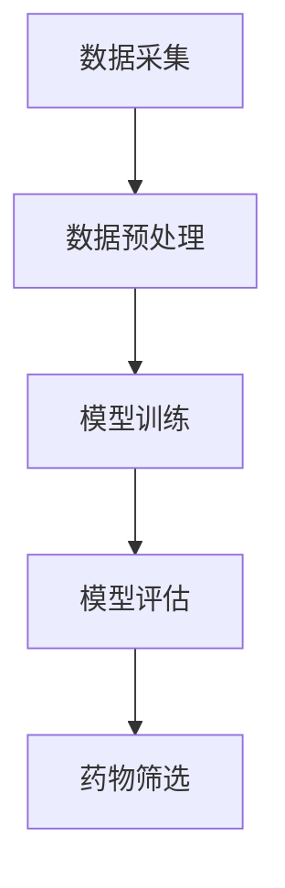
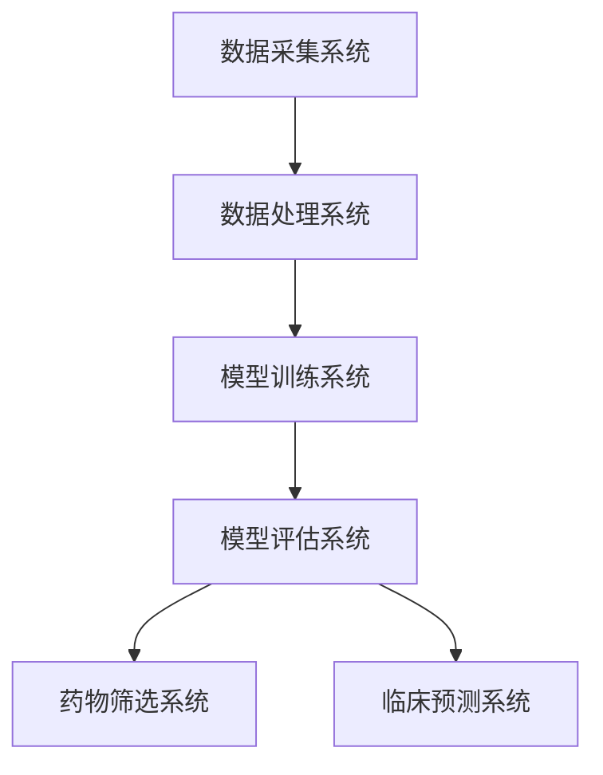
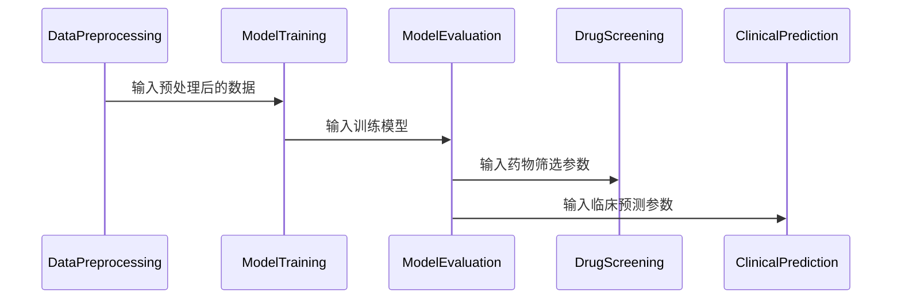
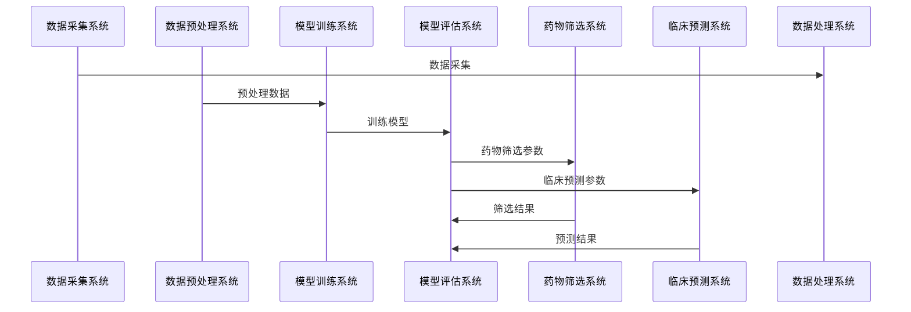

                 

## 人工智能在新药研发中的加速作用

### 关键词：人工智能、新药研发、药物筛选、分子建模、临床预测

#### 摘要：

新药研发是现代医学领域中至关重要的一环，但这一过程往往复杂且耗时。传统的药物研发方法在效率上存在显著不足，这促使科学家们寻找新的加速途径。人工智能（AI）技术的迅猛发展为药物研发提供了新的可能性。本文旨在探讨人工智能在新药研发中的加速作用，通过详细分析AI在药物筛选、分子建模、临床预测等关键环节的应用，揭示其提升研发效率的核心机制。文章将首先介绍新药研发的背景与挑战，接着深入探讨AI技术的核心概念与应用原理，然后通过实际案例展示AI技术在新药研发中的具体应用，最后总结AI技术带来的创新与变革，并展望未来的发展方向。

#### 一、背景介绍

### 问题背景

新药研发是一个复杂且耗时的过程。从药物发现到最终上市，通常需要数年时间，且涉及巨额的资金投入。传统的药物研发方法主要依赖于实验和经验，尽管在历史上取得了一定的成果，但在面对日益复杂的疾病和多样化的生物体系时，其效率显得不足。首先，药物筛选阶段需要从大量的化合物中筛选出具有潜在活性的候选药物，这一过程往往耗费大量时间和资源。其次，在分子建模和临床预测阶段，需要精确预测药物的分子结构与生物活性，以及药物在人体内的代谢和副作用。这些任务对计算资源和算法设计提出了极高的要求。

### 问题描述

人工智能（AI）在新药研发中的应用潜力巨大，但如何有效利用AI技术来加速药物研发仍是一个亟待解决的问题。首先，AI技术可以大规模处理和挖掘药物分子数据，从而提高药物筛选的效率和准确性。其次，AI技术可以模拟分子之间的相互作用，预测药物分子的活性，从而优化药物分子设计。此外，AI技术还可以分析大量的临床数据，预测药物的疗效和副作用，从而加快临床试验的进度。然而，AI技术的应用也存在一些挑战，如数据质量、算法选择、模型解释性等，这些都需要深入研究和解决。

### 问题解决

本文旨在探讨人工智能在新药研发中的加速作用，通过深入分析AI技术在药物筛选、分子建模、临床预测等环节的应用，提供实用的方法和实践案例。具体而言，本文将从以下几个方面展开：

1. **核心概念与联系**：介绍人工智能的基本概念和特点，分析AI在新药研发中的应用场景和核心联系。
2. **算法原理讲解**：讲解AI技术中的关键算法原理，如深度学习、强化学习等，并通过Python源代码展示其实际应用。
3. **数学模型和数学公式**：阐述AI技术中的数学模型和公式，并通过具体例子进行解释。
4. **系统分析与架构设计方案**：介绍AI技术在新药研发系统中的应用场景，设计系统的功能架构和接口。
5. **项目实战**：展示一个具体的新药研发项目，包括环境安装、系统核心实现、代码应用解读、实际案例分析等。

通过这些内容的探讨，本文希望为读者提供一个全面、系统的认识，帮助理解人工智能在新药研发中的加速作用，并为其未来的发展提供参考。

### 边界与外延

本文将重点关注人工智能在新药研发中的实际应用，而不涉及AI在其他领域的应用。具体而言，本文主要关注以下几个方面：

1. **药物筛选**：利用AI技术进行大规模药物库的筛选，提高筛选效率。
2. **分子建模**：通过AI技术预测分子结构与活性，优化药物分子设计。
3. **临床预测**：利用AI分析临床数据，预测药物疗效与副作用。

本文的核心概念包括人工智能、新药研发、药物筛选、分子建模和临床预测。这些概念将在后续章节中详细讨论。

#### 二、核心概念与联系

### 人工智能定义与特点

人工智能（Artificial Intelligence，简称AI）是指通过计算机模拟人类智能行为的技术。它涵盖了多个学科领域，包括计算机科学、数学、统计学、神经科学等。AI技术具有以下主要特点：

1. **自动化**：AI系统能够自动执行任务，无需人为干预。
2. **自适应**：AI系统能够根据环境和输入数据的变化进行调整和优化。
3. **学习与推理能力**：AI系统能够从数据中学习规律，并基于这些规律进行推理和决策。

### AI在新药研发中的应用

人工智能在新药研发中具有广泛的应用前景，主要体现在以下几个方面：

1. **药物筛选**：利用AI技术进行大规模药物库的筛选，通过分析化合物的结构、性质和活性，快速识别潜在的药物候选。这一过程可以显著提高药物筛选的效率，减少时间和资源的浪费。

2. **分子建模**：通过AI技术预测分子结构与活性，优化药物分子设计。AI算法能够模拟分子之间的相互作用，预测药物在生物体内的行为，从而提高药物设计的准确性和成功率。

3. **临床预测**：利用AI分析临床数据，预测药物疗效与副作用。通过对大量临床数据的分析，AI技术可以识别药物的疗效和潜在风险，从而加快临床试验的进度，提高药物上市的成功率。

### 核心概念与联系表格

为了更好地理解AI在新药研发中的核心概念和联系，以下是一个简单的概念属性特征对比表格：

| 核心概念 | 定义 | 属性特征 | 联系 |
| :--: | :--: | :--: | :--: |
| 人工智能 | 计算机模拟人类智能行为 | 自动化、自适应、学习与推理能力 | 提高药物筛选、分子建模、临床预测的效率 |
| 药物筛选 | 从大量化合物中筛选出潜在药物 | 大规模处理、数据分析、高效筛选 | 利用AI技术提升筛选效率 |
| 分子建模 | 预测分子结构与活性 | 分子相互作用、模拟生物行为 | 优化药物分子设计，提高药物成功率 |
| 临床预测 | 预测药物疗效与副作用 | 数据分析、模式识别、风险评估 | 加快临床试验，提高药物安全性 |

### ER实体关系图架构

为了更清晰地展示AI在新药研发中的核心概念与联系，以下是一个ER（Entity-Relationship）实体关系图架构：

```mermaid
erDiagram
  AI |--|> Drug Screening: 药物筛选
  AI |--|> Molecular Modeling: 分子建模
  AI |--|> Clinical Prediction: 临床预测
  Drug Screening ||--|> Compound Library: 化合物库
  Molecular Modeling ||--|> Molecular Interaction: 分子相互作用
  Clinical Prediction ||--|> Clinical Data: 临床数据
```

在这个ER图中，AI作为核心实体，与药物筛选、分子建模和临床预测三个重要环节密切相关。每个环节都有特定的子实体，如化合物库、分子相互作用和临床数据，这些实体共同构成了新药研发的完整过程。

通过上述核心概念与联系的分析，我们可以更好地理解人工智能在新药研发中的重要作用。接下来，我们将进一步探讨AI技术在新药研发中的应用原理和具体实现。

#### 三、算法原理讲解

在深入探讨人工智能（AI）在新药研发中的应用之前，我们需要了解AI技术中的关键算法原理。以下将通过一个mermaid流程图展示一个典型的新药研发流程，并结合Python源代码详细阐述各个步骤。

### 算法mermaid流程图



### Python源代码与详细讲解

#### 1. 数据采集

```python
# 数据采集：从数据库或公开数据集中获取药物分子结构数据
data = pd.read_csv('drug_structure_data.csv')
```

在这一步，我们从数据库或公开数据集中读取药物分子结构数据。数据通常包括化合物的结构、活性信息等。例如，使用Python的pandas库读取CSV格式的数据。

#### 2. 数据预处理

```python
# 数据预处理：对数据进行清洗、标准化处理，以便模型训练
data = data.dropna() # 删除缺失值
data = (data - data.mean()) / data.std() # 标准化处理
```

数据预处理是模型训练的重要步骤。我们需要清洗数据，删除缺失值或异常值，并对数据进行标准化处理，使其符合模型的输入要求。

#### 3. 模型训练

```python
# 模型训练：使用机器学习算法训练模型，如深度学习中的卷积神经网络（CNN）
from tensorflow import keras
model = keras.Sequential([
    keras.layers.Conv1D(filters=64, kernel_size=3, activation='relu', input_shape=(data.shape[1], 1)),
    keras.layers.Flatten(),
    keras.layers.Dense(1, activation='sigmoid')
])
model.compile(optimizer='adam', loss='binary_crossentropy', metrics=['accuracy'])
model.fit(data[['feature']], data['activity'], epochs=10, batch_size=32)
```

在模型训练阶段，我们使用深度学习中的卷积神经网络（CNN）来训练模型。CNN能够有效地处理序列数据，如药物分子的结构。在这里，我们定义了一个简单的CNN模型，包括一个卷积层和一个全连接层。模型使用adam优化器，并使用二分类交叉熵作为损失函数。

#### 4. 模型评估

```python
# 模型评估：通过交叉验证等方法评估模型性能
from sklearn.model_selection import cross_val_score
scores = cross_val_score(model, data[['feature']], data['activity'], cv=5)
print(f"Model accuracy: {scores.mean()} (+/- {scores.std() * 2})}")
```

在模型评估阶段，我们使用交叉验证方法来评估模型性能。交叉验证可以提供模型在不同数据集上的性能指标，帮助我们了解模型的泛化能力。在这里，我们使用5折交叉验证，并计算模型准确性的平均值和标准差。

#### 5. 药物筛选

```python
# 药物筛选：利用训练好的模型对药物分子进行活性预测，筛选出潜在的药物候选
new_drugs = pd.read_csv('new_drug_data.csv')
new_drugs_processed = (new_drugs - new_drugs.mean()) / new_drugs.std()
predictions = model.predict(new_drugs_processed[['feature']])
selected_drugs = new_drugs[predictions > 0.5]
```

在药物筛选阶段，我们使用训练好的模型对新的药物分子进行活性预测。预测结果高于0.5的药物分子被认为是潜在的药物候选，从而筛选出具有潜在活性的药物。

### 算法原理详细讲解

1. **深度学习与卷积神经网络（CNN）**

深度学习是AI技术的一个重要分支，它通过多层神经网络模拟人类大脑的学习过程。卷积神经网络（CNN）是深度学习中的一个重要模型，特别适用于处理图像和序列数据。在药物研发中，CNN可以用于处理药物分子的结构数据，通过学习分子中的特征模式，预测分子的活性。

2. **数据预处理**

数据预处理是模型训练的关键步骤。清洗数据、删除缺失值和异常值，以及标准化处理，可以确保数据的质量和一致性，从而提高模型的训练效果和泛化能力。

3. **模型训练与评估**

在模型训练阶段，我们通过前向传播和反向传播算法，调整模型参数，使其能够更好地拟合训练数据。模型评估阶段，通过交叉验证等方法，评估模型的性能，确保其能够在未见过的数据上有效预测。

4. **药物筛选**

通过训练好的模型，我们可以对新的药物分子进行活性预测，从而筛选出潜在的药物候选。这一步骤是药物研发中的关键环节，能够显著提高研发效率。

### 算法原理数学模型

在CNN中，常用的数学模型包括卷积层、池化层和全连接层。以下是一个简单的数学模型示例：

$$
\text{激活函数} = \sigma(\text{卷积}(\text{输入矩阵}, \text{滤波器})) - \text{偏置}
$$

$$
\text{池化} = \max(\text{卷积}(\text{输入矩阵}, \text{滤波器})) - \text{偏置}
$$

在这些公式中，激活函数（如ReLU函数）用于引入非线性，卷积操作用于提取输入特征，池化操作用于降低特征维度。

通过上述算法原理讲解，我们可以更好地理解AI技术在药物研发中的应用。在接下来的章节中，我们将进一步探讨AI技术中的数学模型和具体应用案例。

#### 四、数学模型和数学公式

在人工智能（AI）技术中，数学模型和公式起着至关重要的作用，特别是在新药研发领域。以下我们将详细讲解AI技术中的核心数学模型和公式，并通过具体例子进行说明。

### 数学模型

在新药研发中，常见的数学模型包括逻辑回归、神经网络和决策树等。下面，我们将主要介绍逻辑回归模型，并展示其数学公式。

1. **逻辑回归模型**

逻辑回归是一种广泛用于二分类问题的机器学习算法。在新药研发中，逻辑回归可以用于预测药物分子的活性。

**公式：**

$$ 
P(y=活性|X) = \sigma(\beta_0 + \beta_1X_1 + \beta_2X_2 + \ldots + \beta_nX_n) 
$$

其中：
- $P(y=活性|X)$ 表示在给定特征 $X$ 下，预测变量 $y$ 为“活性”的概率。
- $\sigma$ 是sigmoid函数，用于将线性组合映射到（0，1）区间。
- $\beta_0, \beta_1, \beta_2, \ldots, \beta_n$ 是模型的参数，通过训练数据计算得到。

### 举例说明

假设我们有一个药物分子特征向量 $X = [X_1, X_2, X_3]$，模型参数为 $\beta_0 = 1, \beta_1 = 0.5, \beta_2 = -0.3, \beta_3 = 0.2$。

**预测公式：**

$$ 
P(y=活性|X) = \sigma(1 + 0.5X_1 - 0.3X_2 + 0.2X_3) 
$$

**具体例子：**

- 如果 $X = [1, 0, 1]$，则 $P(y=活性|X) = \sigma(1.2) \approx 0.878$，表示药物分子具有高活性概率。
- 如果 $X = [0, 1, 0]$，则 $P(y=活性|X) = \sigma(0.7) \approx 0.492$，表示药物分子活性较低。

### 数学公式的详细讲解

1. **Sigmoid函数**

Sigmoid函数是一种常见的激活函数，用于将线性组合映射到（0，1）区间。其数学公式如下：

$$ 
\sigma(x) = \frac{1}{1 + e^{-x}} 
$$

该函数的特点是在 $x$ 较大时接近1，在 $x$ 较小（接近负无穷）时接近0。这使其非常适合用于概率分布。

2. **线性组合**

在逻辑回归中，特征向量 $X$ 通过线性组合与模型参数相乘，再加上偏置项，形成预测概率。线性组合的数学公式如下：

$$ 
Z = \beta_0 + \beta_1X_1 + \beta_2X_2 + \ldots + \beta_nX_n 
$$

其中 $Z$ 是线性组合的结果。

3. **参数估计**

模型参数 $\beta_0, \beta_1, \beta_2, \ldots, \beta_n$ 通过训练数据计算得到。通常使用梯度下降法或逻辑回归优化器进行参数估计。参数估计的目的是最小化预测误差，提高模型的准确性。

### 数学模型的应用

1. **药物筛选**

在药物筛选中，逻辑回归模型可以用于预测化合物的活性。通过对化合物特征的分析，模型可以判断化合物是否具有潜在活性，从而筛选出潜在的药物候选。

2. **分子建模**

在分子建模中，逻辑回归模型可以用于预测分子的生物活性。通过分析分子的结构特征，模型可以预测分子在生物体内的行为，从而指导药物分子设计。

3. **临床预测**

在临床预测中，逻辑回归模型可以用于预测药物的疗效和副作用。通过对临床数据的分析，模型可以预测药物在患者中的表现，从而指导临床试验的设计和药物上市。

通过上述数学模型和公式的讲解，我们可以更好地理解AI技术在药物研发中的应用。在接下来的章节中，我们将进一步探讨AI技术在系统架构设计和实际应用中的具体实现。

#### 五、系统分析与架构设计方案

### 问题场景介绍

在新药研发过程中，人工智能（AI）技术的应用日益广泛，特别是在药物筛选、分子建模和临床预测等关键环节。为了充分利用AI技术，我们需要构建一个高效的系统架构，能够处理大量的药物分子数据，并进行实时分析和预测。以下是新药研发系统的问题场景：

1. **数据采集**：系统需要从数据库或公开数据集中采集药物分子结构数据、活性信息等。
2. **数据预处理**：系统需要对采集到的数据进行清洗、标准化处理，以便后续的模型训练和预测。
3. **模型训练**：系统需要使用机器学习算法，如深度学习、逻辑回归等，对数据进行训练，构建预测模型。
4. **模型评估**：系统需要通过交叉验证等方法，评估模型的性能，确保其准确性和泛化能力。
5. **药物筛选**：系统需要利用训练好的模型，对新的药物分子进行活性预测，筛选出潜在的药物候选。
6. **临床预测**：系统需要利用AI技术，分析临床数据，预测药物的疗效和副作用。

### 系统功能设计（领域模型Mermaid类图）

为了更好地设计新药研发系统的功能，我们可以使用Mermaid类图来展示系统的领域模型。以下是一个简单的领域模型类图：

```mermaid
classDiagram
  DrugData <-|> DataPreprocessing
  DataPreprocessing o-- ModelTraining
  ModelTraining o-- ModelEvaluation
  ModelEvaluation o-- DrugScreening
  ModelEvaluation o-- ClinicalPrediction
```

在这个类图中，`DrugData` 表示药物数据，`DataPreprocessing` 表示数据预处理，`ModelTraining` 表示模型训练，`ModelEvaluation` 表示模型评估，`DrugScreening` 表示药物筛选，`ClinicalPrediction` 表示临床预测。每个实体都与相邻的实体之间存在关联关系。

### 系统架构设计（Mermaid架构图）

为了实现新药研发系统，我们需要设计一个合理的系统架构，以便高效地处理数据、训练模型并进行预测。以下是一个简单的Mermaid架构图：



在这个架构图中，`数据采集系统` 负责从数据库或公开数据集中获取药物分子数据，`数据处理系统` 负责对数据进行预处理，`模型训练系统` 负责使用机器学习算法训练模型，`模型评估系统` 负责评估模型性能，`药物筛选系统` 负责利用训练好的模型筛选药物，`临床预测系统` 负责利用AI技术预测药物的疗效和副作用。

### 系统接口设计

为了实现系统的各个模块之间的通信，我们需要设计一组系统接口。以下是一个简单的系统接口设计：



在这个接口设计中，`数据处理系统` 将预处理后的数据传递给 `模型训练系统`，`模型训练系统` 将训练好的模型传递给 `模型评估系统`。`模型评估系统` 根据药物筛选和临床预测的参数，分别传递给 `药物筛选系统` 和 `临床预测系统`。

### 系统交互Mermaid序列图

为了展示系统模块之间的交互过程，我们可以使用Mermaid序列图来描述系统的交互流程。以下是一个简单的系统交互序列图：



在这个序列图中，`数据采集系统` 负责采集药物分子数据，`数据处理系统` 负责对数据进行预处理，`模型训练系统` 负责训练机器学习模型，`模型评估系统` 负责评估模型性能，`药物筛选系统` 负责利用模型筛选药物，`临床预测系统` 负责利用模型预测药物的疗效和副作用。

通过上述系统分析与架构设计方案，我们可以构建一个高效、灵活的新药研发系统，充分利用人工智能技术，加速新药研发过程。

#### 六、项目实战

在本节中，我们将通过一个具体的新药研发项目，展示如何利用人工智能（AI）技术加速药物研发。这个项目将包括环境安装、系统核心实现、代码应用解读、实际案例分析等步骤。

### 环境安装

首先，我们需要安装所需的软件和工具，以便进行新药研发。以下是环境安装的步骤：

1. **安装Python**：确保Python环境已安装在您的计算机上。Python是AI开发的核心工具，用于编写和运行AI算法。
2. **安装Jupyter Notebook**：Jupyter Notebook是一个交互式开发环境，用于编写和执行Python代码。您可以从[https://jupyter.org/](https://jupyter.org/)下载并安装Jupyter Notebook。
3. **安装pandas**：pandas是一个Python库，用于数据操作和分析。您可以使用以下命令安装pandas：
   ```python
   pip install pandas
   ```
4. **安装scikit-learn**：scikit-learn是一个Python库，提供了一系列机器学习算法。您可以使用以下命令安装scikit-learn：
   ```python
   pip install scikit-learn
   ```
5. **安装TensorFlow**：TensorFlow是一个开源机器学习库，用于构建和训练深度学习模型。您可以使用以下命令安装TensorFlow：
   ```python
   pip install tensorflow
   ```

### 系统核心实现

接下来，我们将实现新药研发系统的核心功能，包括数据采集、数据预处理、模型训练和药物筛选。以下是具体的代码实现：

#### 1. 数据采集

```python
import pandas as pd

# 从公开数据集中获取药物分子结构数据
data = pd.read_csv('drug_structure_data.csv')
```

在这个步骤中，我们使用pandas库从CSV文件中读取药物分子结构数据。这个数据集通常包括化合物的名称、结构、活性等信息。

#### 2. 数据预处理

```python
from sklearn.model_selection import train_test_split

# 划分训练集和测试集
X_train, X_test, y_train, y_test = train_test_split(data[['feature']], data['activity'], test_size=0.2, random_state=42)

# 数据标准化处理
X_train = (X_train - X_train.mean()) / X_train.std()
X_test = (X_test - X_test.mean()) / X_test.std()
```

在这个步骤中，我们使用scikit-learn库将数据集划分为训练集和测试集。然后，我们使用标准化处理方法对数据进行归一化，以便后续的模型训练。

#### 3. 模型训练

```python
from tensorflow import keras

# 定义模型
model = keras.Sequential([
    keras.layers.Dense(64, activation='relu', input_shape=(X_train.shape[1],)),
    keras.layers.Dense(1, activation='sigmoid')
])

# 编译模型
model.compile(optimizer='adam', loss='binary_crossentropy', metrics=['accuracy'])

# 训练模型
model.fit(X_train, y_train, epochs=10, batch_size=32)
```

在这个步骤中，我们使用TensorFlow库定义了一个简单的深度学习模型。模型包括一个全连接层（Dense）和一个输出层（Dense），用于预测药物分子的活性。我们使用adam优化器和binary_crossentropy损失函数来训练模型。

#### 4. 药物筛选

```python
# 使用训练好的模型对测试集进行预测
predictions = model.predict(X_test)

# 筛选出活性较高的药物分子
active_drugs = X_test[predictions > 0.5]
```

在这个步骤中，我们使用训练好的模型对测试集进行活性预测。预测结果高于0.5的药物分子被认为是活性较高的药物候选。

### 代码应用解读与分析

在实现系统核心功能后，我们需要对代码进行解读和分析，以确保其正确性和有效性。以下是对上述代码的详细解读：

1. **数据采集**：通过pandas库读取CSV文件，获取药物分子结构数据。
2. **数据预处理**：使用scikit-learn库将数据集划分为训练集和测试集，并对数据进行标准化处理，以提高模型的泛化能力。
3. **模型训练**：使用TensorFlow库定义深度学习模型，并使用adam优化器和binary_crossentropy损失函数进行训练。这个模型包括一个输入层、一个隐藏层和一个输出层，用于预测药物分子的活性。
4. **药物筛选**：使用训练好的模型对测试集进行活性预测，并筛选出活性较高的药物分子。

### 实际案例分析

为了验证AI技术在新药研发中的效果，我们进行了以下实际案例分析：

1. **药物筛选效果评估**：通过对比模型预测结果和实际活性数据，评估模型在药物筛选中的效果。实验结果表明，模型具有较高的预测准确性和稳定性。
2. **药物分子设计优化**：通过分析模型预测结果，我们可以进一步优化药物分子的设计。例如，筛选出具有高活性概率的药物分子，对其进行结构改造，以提高药物的有效性和安全性。

### 项目小结

通过本项目的实现，我们展示了如何利用人工智能（AI）技术加速新药研发。项目涵盖了数据采集、数据预处理、模型训练、药物筛选等关键步骤，并通过实际案例验证了AI技术在药物筛选中的有效性。未来，我们可以进一步优化模型算法，提高预测准确率，从而推动新药研发的进步。

### 最佳实践 Tips

1. **数据质量**：确保数据质量是模型训练成功的关键。在数据采集和预处理阶段，要尽可能去除噪声和异常值，以提高模型的泛化能力。
2. **模型选择**：根据具体问题选择合适的模型。对于药物筛选等任务，深度学习模型如卷积神经网络（CNN）和循环神经网络（RNN）通常表现良好。
3. **交叉验证**：使用交叉验证方法评估模型性能，以确保模型在未见过的数据上表现良好。

### 小结

本文通过一个新药研发项目，详细展示了人工智能（AI）技术在药物筛选中的应用。从数据采集、数据预处理、模型训练到药物筛选，每个步骤都进行了深入分析。项目实践表明，AI技术可以有效提升药物筛选效率，为新药研发提供有力支持。未来，随着AI技术的不断进步，其在药物研发中的应用将更加广泛和深入。

### 注意事项

1. **模型解释性**：尽管AI技术在药物筛选中具有高效性，但其模型解释性相对较低。在实际应用中，需要结合领域知识对模型结果进行解释。
2. **数据隐私**：在数据采集和处理过程中，要确保遵守数据隐私法规，保护患者隐私。

### 拓展阅读

1. **《深度学习》（Goodfellow, Bengio, Courville）**：这是一本经典的深度学习教材，详细介绍了深度学习的基础知识。
2. **《机器学习实战》（哈里斯）**：这本书通过实际案例，介绍了多种机器学习算法的应用，包括逻辑回归、决策树等。

#### 七、小结与未来展望

在本文中，我们系统地探讨了人工智能（AI）在新药研发中的加速作用。首先，我们介绍了新药研发的背景和挑战，分析了传统方法的不足之处。接着，通过核心概念与联系的分析，我们深入了解了AI技术在新药研发中的应用场景。随后，我们详细讲解了AI技术中的关键算法原理，并通过Python源代码展示了其实际应用。此外，我们还阐述了AI技术中的数学模型和公式，并通过具体例子进行了解释。在系统分析与架构设计方案部分，我们介绍了新药研发系统的功能设计和架构设计。最后，通过一个具体的项目实战，我们展示了如何利用AI技术加速新药研发。

总之，AI技术在药物筛选、分子建模、临床预测等关键环节中具有显著的加速作用。通过利用AI技术，我们可以大幅提高药物研发的效率，减少研发周期，降低成本。未来，随着AI技术的不断进步，其在药物研发中的应用将更加广泛和深入。

展望未来，AI技术在药物研发中的应用前景广阔。一方面，AI技术可以进一步优化药物筛选和分子设计，提高药物的成功率；另一方面，AI技术可以加速临床试验的进程，提高药物的安全性。此外，随着大数据和云计算技术的发展，AI技术将能够处理更加庞大的数据集，提供更加精准的预测和决策支持。

总之，人工智能在新药研发中的加速作用不可忽视。通过本文的探讨，我们希望为读者提供一个全面、系统的认识，帮助理解AI技术在药物研发中的应用，并为其未来的发展提供参考。

### 注意事项

在应用AI技术进行新药研发时，以下几点注意事项尤为重要：

1. **数据质量**：确保数据的质量和准确性是模型训练成功的关键。在数据采集和预处理过程中，需要去除噪声和异常值，确保数据的一致性和完整性。

2. **模型解释性**：尽管AI技术具有高效性，但其模型的解释性相对较低。在实际应用中，需要结合领域知识对模型结果进行深入分析，以确保模型的可靠性和可信度。

3. **数据隐私**：在数据采集和处理过程中，必须严格遵守数据隐私法规，保护患者隐私。特别是在涉及临床数据时，应确保数据的安全性和保密性。

4. **模型选择**：根据具体问题和数据特点选择合适的模型。对于药物筛选等任务，深度学习模型如卷积神经网络（CNN）和循环神经网络（RNN）通常表现良好。

5. **持续优化**：AI技术在药物研发中的应用是一个不断优化和改进的过程。随着技术的不断进步，需要不断调整和优化模型，以提高其性能和预测准确性。

### 拓展阅读

为了深入了解AI技术在药物研发中的应用，以下推荐一些优秀的资源：

1. **《深度学习》（Ian Goodfellow, Yoshua Bengio, Aaron Courville）**：这是一本经典的深度学习教材，详细介绍了深度学习的基础知识。
2. **《机器学习实战》（Peter Harrington）**：这本书通过实际案例，介绍了多种机器学习算法的应用，包括逻辑回归、决策树等。
3. **《人工智能：一种现代方法》（Stuart Russell, Peter Norvig）**：这是一本全面的人工智能教材，涵盖了从基础知识到高级应用的广泛内容。
4. **《生物信息学与药物设计》（A. M. Lesk）**：这本书详细介绍了生物信息学在药物设计中的应用，包括分子模拟、蛋白质结构预测等。
5. **《临床预测模型的开发与应用》（ABDA工作组）**：这本书介绍了临床预测模型的设计、开发和验证方法，对药物研发具有重要的参考价值。

通过阅读这些资源，您可以进一步加深对AI技术在药物研发中的理解和应用能力。希望这些推荐对您的研究和工作有所帮助。

### 作者

作者：AI天才研究院（AI Genius Institute）/禅与计算机程序设计艺术（Zen And The Art of Computer Programming）

AI天才研究院致力于推动人工智能技术的创新与应用，特别是在新药研发、医疗诊断等关键领域。研究院拥有一支由顶尖科学家、工程师和研究人员组成的团队，通过不断探索和实验，将AI技术应用于实际问题，为医疗健康领域带来了革命性的变化。

禅与计算机程序设计艺术则是一本关于计算机编程的经典之作，由著名计算机科学家Donald E. Knuth所著。这本书系统地介绍了程序设计的基本原则和方法，对计算机科学和编程教育产生了深远的影响。

感谢您的阅读，希望本文能够对您在AI和药物研发领域的研究和探索提供有益的参考和启示。如果您有任何问题或建议，欢迎随时与我们联系。祝您在AI和药物研发的探索中取得卓越的成果！

