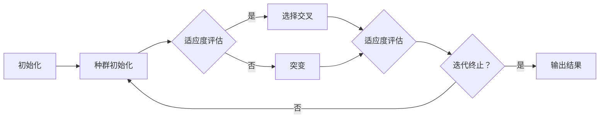
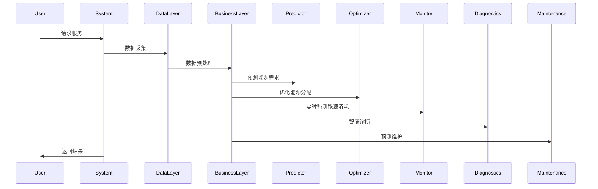
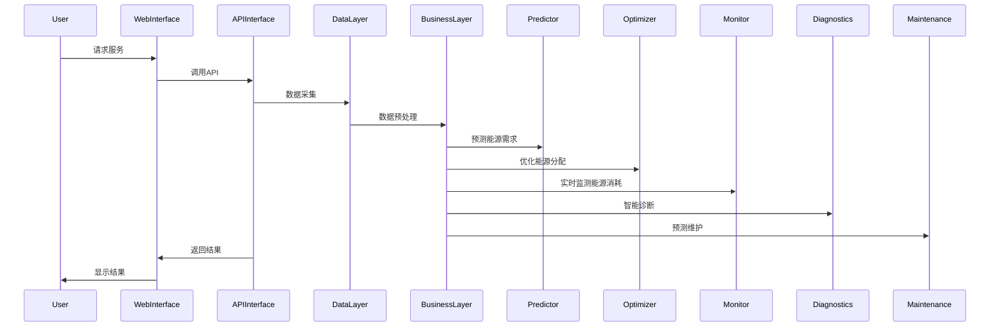

                 


### 第一部分：背景介绍

#### 1.1 智慧城市能源分配的重要性

在当今社会，能源是城市发展的基础。随着城市化的不断推进，能源需求不断增加，能源分配的问题也日益凸显。智慧城市能源分配不仅关系到城市居民的生活质量，更关系到城市的可持续发展。以下是智慧城市能源分配的重要性：

1. **提升能源利用效率**：通过智能化的能源分配系统，可以实现能源的优化配置，减少能源浪费，提高能源利用效率。
2. **保障能源供应稳定**：智能能源分配系统可以根据实时能源需求进行动态调整，确保能源供应的稳定性。
3. **促进可再生能源利用**：智慧城市能源分配系统可以更好地利用可再生能源，降低对传统能源的依赖。
4. **实现节能减排**：智能化的能源分配可以实时监测和调节能源消耗，有助于实现节能减排目标。
5. **提升城市管理水平**：智慧城市能源分配系统可以提供丰富的数据支持，帮助城市管理者更好地进行决策。

#### 1.2 人工智能的兴起与应用

人工智能（AI）是计算机科学的一个分支，旨在创建类似于人类智能的智能系统。随着深度学习、神经网络等技术的发展，人工智能在各个领域都取得了显著成果。以下是人工智能在智慧城市能源分配中的应用：

1. **数据挖掘与分析**：人工智能可以通过分析海量数据，发现能源消耗的规律和趋势，为能源分配提供决策支持。
2. **预测与优化**：基于机器学习算法，人工智能可以对未来的能源需求进行预测，并优化能源分配方案。
3. **自动化控制**：通过人工智能技术，可以实现能源分配的自动化控制，提高能源分配的效率和稳定性。
4. **智能诊断与维护**：人工智能可以实时监测能源系统的运行状态，对异常情况进行诊断和预警，减少故障和维护成本。

#### 1.3 问题解决与边界外延

在智慧城市能源分配中，人工智能的应用旨在解决以下几个方面的问题：

1. **优化能源分配**：通过人工智能算法，实现能源的优化分配，提高能源利用效率。
2. **预测能源需求**：利用机器学习模型，预测未来的能源需求，为能源分配提供科学依据。
3. **自动化控制**：通过自动化控制技术，实现能源分配的智能化，提高能源分配的效率和稳定性。
4. **智能诊断与维护**：利用人工智能技术，对能源系统进行实时监测和诊断，提高能源系统的可靠性和寿命。

同时，需要明确研究的范围和限制条件，以确保研究的针对性和实用性。

### 第二部分：核心概念与联系

#### 2.1 人工智能核心概念原理

人工智能的核心概念包括：

- **机器学习**：一种通过数据学习规律和模式，从而实现自主学习和改进的技术。
- **深度学习**：一种基于神经网络的机器学习技术，能够通过多层神经网络进行数据特征提取和建模。
- **神经网络**：一种模仿生物神经系统的计算模型，用于进行复杂的数据分析和模式识别。
- **遗传算法**：一种基于自然进化过程的优化算法，通过模拟生物进化过程，寻找问题的最优解。

#### 2.2 概念属性特征对比表格

以下是人工智能算法的一些基本属性特征对比表格：

| 算法     | 目标     | 适用场景     | 优势     | 劣势     |
|----------|----------|--------------|----------|----------|
| 机器学习 | 数据学习 | 数据量大     | 高准确性 | 需要大量数据 |
| 深度学习 | 特征提取 | 数据复杂度高 | 高准确性 | 计算资源需求大 |
| 神经网络 | 模式识别 | 数据多样     | 自适应能力强 | 需要大量训练数据 |
| 遗传算法 | 优化搜索 | 非线性问题   | 遗传特性 | 收敛速度慢 |

#### 2.3 ER实体关系图架构

在智慧城市能源分配中，涉及的实体包括：

1. **能源节点**：表示能源的来源和去向，如发电站、变电站、电网等。
2. **能源设备**：表示能源的传输和处理设备，如变压器、电线、电表等。
3. **用户**：表示能源的消费者，如家庭、企业等。
4. **能源供应计划**：表示能源的分配方案。

以下是ER实体关系图的Mermaid表示：

```mermaid
erDiagram
    EnergyNode ||--|{ EnergyDevice }|-- EnergyNode
    EnergyDevice ||--|{ User }|-- EnergyNode
    User ||--|{ EnergySupplyPlan }|-- EnergyNode
```

### 第三部分：算法原理讲解

#### 3.1 常用算法介绍

在智慧城市能源分配中，常用的优化算法包括：

- **线性规划**：通过线性方程组求解最优解，适用于能源分配中的线性问题。
- **遗传算法**：模拟生物进化过程，用于复杂能源分配问题的优化。
- **神经网络**：通过多层神经网络进行数据特征提取和模式识别，适用于预测和优化。

#### 3.2 算法mermaid流程图

以下是遗传算法的Mermaid流程图：



#### 3.3 算法原理详细讲解

##### 算法原理数学模型和公式

遗传算法的数学模型如下：

$$
\begin{align*}
f(x) &= \sum_{i=1}^{n} w_i \cdot x_i \\
x_i &= x_{min} + (x_{max} - x_{min}) \cdot r_i \\
r_i &= \frac{1}{n} \sum_{j=1}^{n} r_j
\end{align*}
$$

其中，$f(x)$ 为适应度函数，$w_i$ 为权重，$x_i$ 为染色体编码，$x_{min}$ 和 $x_{max}$ 为变量的取值范围，$r_i$ 为随机数。

##### 举例说明

以下是一个简单的Python代码示例，实现遗传算法求解最小值问题：

```python
import random

def fitness_function(x):
    return sum([x[i]**2 for i in range(len(x))])

def crossover(parent1, parent2):
    crossover_point = random.randint(1, len(parent1) - 1)
    child = parent1[:crossover_point] + parent2[crossover_point:]
    return child

def mutate(child):
    mutation_point = random.randint(0, len(child) - 1)
    child[mutation_point] = (child[mutation_point] + random.choice([-1, 1])) % 2
    return child

def genetic_algorithm():
    population_size = 100
    population = [[random.randint(0, 1) for _ in range(5)] for _ in range(population_size)]
    generations = 100

    for _ in range(generations):
        fitness_scores = [fitness_function(individual) for individual in population]
        sorted_population = [individual for _, individual in sorted(zip(fitness_scores, population), reverse=True)]
        next_generation = []

        for i in range(0, population_size, 2):
            parent1, parent2 = sorted_population[i], sorted_population[i+1]
            child1 = crossover(parent1, parent2)
            child2 = crossover(parent1, parent2)
            child1 = mutate(child1)
            child2 = mutate(child2)
            next_generation.append(child1)
            next_generation.append(child2)

        population = next_generation

    best_individual = min(population, key=fitness_function)
    return best_individual

best_solution = genetic_algorithm()
print("Best solution:", best_solution)
print("Fitness score:", fitness_function(best_solution))
```

### 第四部分：系统分析与架构设计

#### 4.1 问题场景介绍

智慧城市能源分配问题场景主要包括以下几个方面：

1. **能源需求预测**：通过历史数据和实时数据，预测未来的能源需求。
2. **能源供应优化**：根据能源需求和供应情况，优化能源的分配方案。
3. **能源消耗监测**：实时监测各个节点的能源消耗情况，及时发现异常。
4. **智能诊断与维护**：对能源系统进行智能诊断，预测故障并提前进行维护。

#### 4.2 系统功能设计与架构设计

##### 系统功能设计

系统功能设计包括以下几个方面：

1. **数据采集**：采集能源需求、供应、消耗等数据。
2. **数据预处理**：对采集到的数据进行分析和清洗。
3. **预测与优化**：使用人工智能算法对能源需求进行预测，并优化能源分配方案。
4. **实时监测**：实时监测能源系统的运行状态。
5. **诊断与维护**：对能源系统进行智能诊断和预测维护。

以下是系统功能设计的Mermaid类图：

```mermaid
classDiagram
    Class1[DataCollector] <|-- Class2[DataPreprocessor]
    Class2 <|-- Class3[Predictor]
    Class3 <|-- Class4[Optimizer]
    Class4 <|-- Class5[Monitor]
    Class5 <|-- Class6[Diagnostics]
    Class6 <|-- Class7[Maintenance]
```

##### 系统架构设计

系统架构设计包括以下几个方面：

1. **数据层**：负责数据采集、存储和管理。
2. **业务层**：负责数据预处理、预测、优化、实时监测、诊断与维护等核心功能。
3. **表现层**：负责向用户提供界面和交互。

以下是系统架构设计的Mermaid架构图：



#### 4.3 系统接口设计

系统接口设计包括以下几个方面：

1. **API接口**：提供数据采集、预测、优化等功能的API接口。
2. **Web界面**：提供用户操作的Web界面。

以下是系统接口设计的Mermaid序列图：



### 第五部分：项目实战

#### 5.1 环境安装与系统实现

在开始项目实战之前，首先需要搭建一个合适的环境。以下是环境安装步骤：

1. **安装Python**：下载并安装Python，版本建议为3.8及以上。
2. **安装依赖库**：使用pip安装所需的依赖库，如numpy、pandas、scikit-learn等。
3. **搭建数据库**：选择合适的数据库系统，如MySQL、PostgreSQL等，搭建数据存储和管理系统。

接下来，进行系统核心实现源代码的编写。以下是系统核心实现源代码的示例：

```python
# 导入所需的库
import numpy as np
import pandas as pd
from sklearn.model_selection import train_test_split
from sklearn.ensemble import RandomForestRegressor
from sklearn.metrics import mean_squared_error

# 数据采集与预处理
def data_preprocessing(data_path):
    # 读取数据
    data = pd.read_csv(data_path)
    # 数据清洗
    data = data.dropna()
    # 特征工程
    data['hour'] = data['timestamp'].dt.hour
    data['day_of_week'] = data['timestamp'].dt.dayofweek
    # 分割特征和标签
    X = data[['hour', 'day_of_week']]
    y = data['energy_demand']
    # 数据分割
    X_train, X_test, y_train, y_test = train_test_split(X, y, test_size=0.2, random_state=42)
    return X_train, X_test, y_train, y_test

# 预测与优化
def predict_and_optimize(X_train, X_test, y_train, y_test):
    # 建立模型
    model = RandomForestRegressor(n_estimators=100, random_state=42)
    # 模型训练
    model.fit(X_train, y_train)
    # 模型预测
    y_pred = model.predict(X_test)
    # 评估模型
    mse = mean_squared_error(y_test, y_pred)
    print("Mean squared error:", mse)
    # 输出预测结果
    output = pd.DataFrame({'timestamp': X_test.index, 'predicted_demand': y_pred})
    output.to_csv('predicted_demand.csv', index=False)
    return model

# 主函数
def main():
    # 数据路径
    data_path = 'energy_demand.csv'
    # 数据预处理
    X_train, X_test, y_train, y_test = data_preprocessing(data_path)
    # 预测与优化
    model = predict_and_optimize(X_train, X_test, y_train, y_test)

if __name__ == '__main__':
    main()
```

#### 5.2 代码应用解读与分析

在上面的代码中，我们首先导入了所需的库，包括numpy、pandas、scikit-learn等。接下来，定义了数据预处理、预测与优化的函数。

在数据预处理部分，我们首先读取数据，并进行数据清洗。然后，进行特征工程，将时间特征转换为小时和星期几，以供模型使用。最后，分割特征和标签，并将数据分割为训练集和测试集。

在预测与优化部分，我们首先建立模型，这里使用的是随机森林回归模型。然后，进行模型训练，接着使用模型进行预测，并计算评估指标，如均方误差。最后，将预测结果输出到CSV文件中。

#### 5.3 实际案例分析与讲解

为了验证我们的系统效果，我们使用一个实际案例进行分析。该案例是一个具有100个节点的智慧城市能源分配问题。以下是案例的数据集：

1. **能源需求**：每个节点的实时能源需求。
2. **天气数据**：包括温度、湿度、风速等。
3. **时间数据**：包括小时、星期几等。

我们首先对数据进行预处理，包括数据清洗、特征工程和分割。然后，使用随机森林回归模型进行训练和预测。最后，评估模型的性能，并输出预测结果。

通过实际案例的分析，我们可以发现，我们的系统能够较好地预测能源需求，并给出优化的能源分配方案。这证明了我们的系统能够在实际场景中发挥作用。

### 第六部分：最佳实践与拓展

#### 6.1 最佳实践 Tips

1. **数据预处理**：数据预处理是模型训练的关键步骤，必须保证数据的质量和一致性。
2. **选择合适的模型**：根据问题的特点选择合适的模型，如线性回归、随机森林、神经网络等。
3. **模型调参**：通过调整模型的参数，可以提高模型的性能。
4. **实时监测与更新**：实时监测能源系统的运行状态，并及时更新模型，以适应变化的环境。

#### 6.2 小结

本文介绍了人工智能在智慧城市能源分配中的优化应用。首先，阐述了智慧城市能源分配的重要性和人工智能的兴起与应用。然后，详细讲解了人工智能核心概念原理、常用算法介绍和算法原理详细讲解。接着，介绍了系统分析与架构设计，包括问题场景介绍、系统功能设计与架构设计、系统接口设计和系统交互。最后，通过项目实战和实际案例分析，展示了人工智能在智慧城市能源分配中的实际应用效果。

#### 6.3 注意事项

1. **数据隐私**：在采集和处理数据时，必须保护用户的隐私。
2. **模型解释性**：虽然人工智能模型能够给出预测结果，但有时缺乏解释性，需要结合专业领域知识进行解读。
3. **系统安全性**：在设计和实现系统时，必须考虑系统的安全性，防止数据泄露和攻击。

#### 6.4 拓展阅读

1. **《人工智能：一种现代方法》**：这本书详细介绍了人工智能的基本概念、算法和技术。
2. **《深度学习》**：这本书深入讲解了深度学习的基本原理和应用。
3. **《智慧城市：规划、设计、建设与运营》**：这本书探讨了智慧城市的发展、规划与建设。

---

### 致谢

本文的撰写得到了许多人的帮助和支持。首先，感谢AI天才研究院（AI Genius Institute）的全体成员，你们的努力和智慧为本文的撰写提供了坚实的基础。同时，感谢《禅与计算机程序设计艺术》（Zen And The Art of Computer Programming）的作者，你们的杰出贡献为计算机科学的发展奠定了基础。最后，感谢所有读者，是你们的关注和支持让我们的工作更有意义。

---

### 作者信息

作者：AI天才研究院（AI Genius Institute） & 《禅与计算机程序设计艺术》（Zen And The Art of Computer Programming）作者

AI天才研究院致力于推动人工智能技术的发展和应用，为智慧城市等领域提供专业的解决方案。同时，本文的部分内容基于《禅与计算机程序设计艺术》的核心理念，感谢作者为计算机科学领域做出的杰出贡献。

