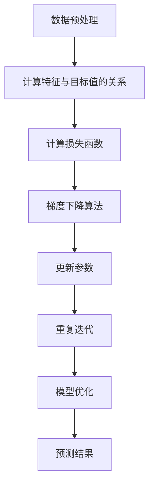
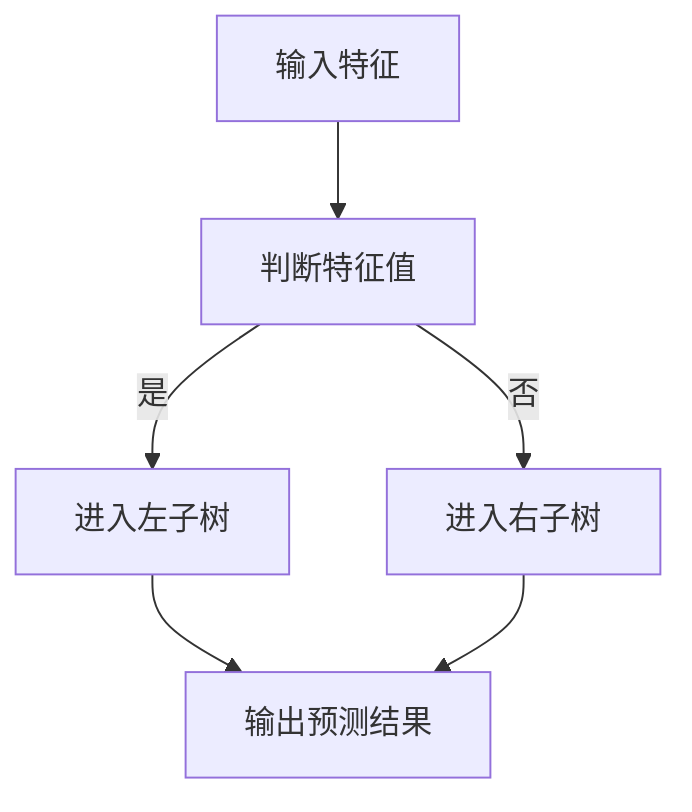
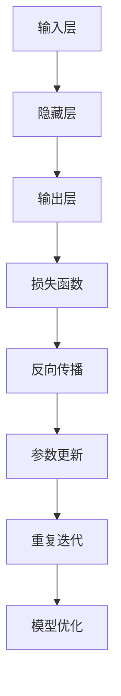
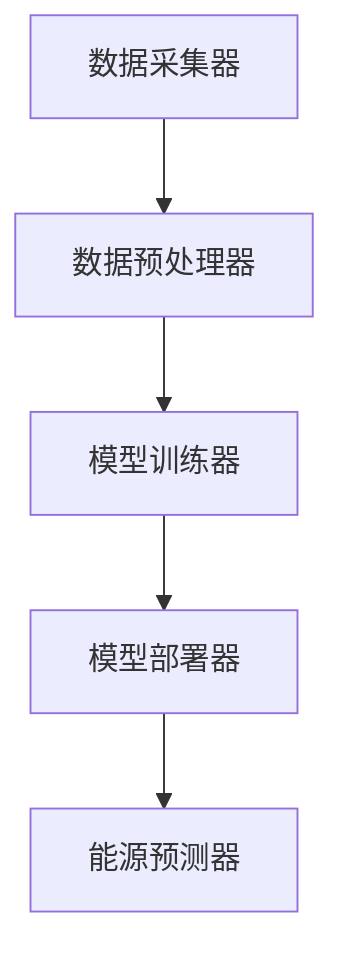
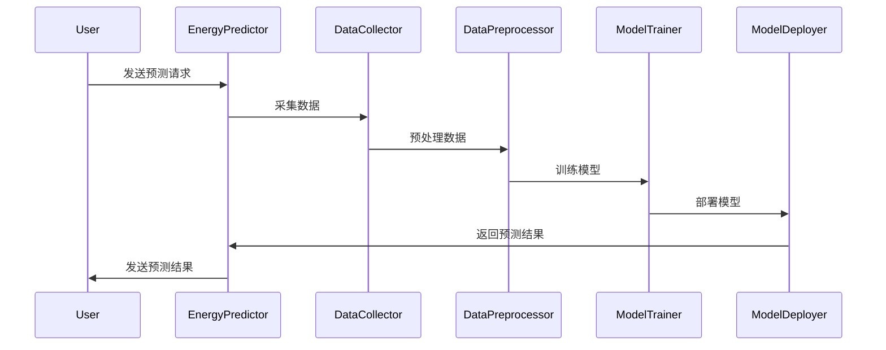

                 


# 人工智能在智慧城市能源需求预测中的应用

关键词：智慧城市、能源需求预测、人工智能、深度学习、算法优化

摘要：本文探讨了人工智能在智慧城市能源需求预测中的应用。通过分析智慧城市与能源需求预测的关系，阐述了人工智能技术的优势，介绍了常见算法及其原理，并提出了优化算法和设计系统的方案。文章还通过实际案例进行了详细讲解，总结了最佳实践和未来研究方向。

## 封面、前言、致谢

### 封面

封面设计简洁明了，封面标题为“人工智能在智慧城市能源需求预测中的应用”，副标题为“深度学习、算法优化与系统架构设计”。封面背景采用蓝色调，象征科技和智慧。

### 前言

随着全球城市化进程的加速，智慧城市建设已成为各国政府和社会各界关注的焦点。本文旨在探讨人工智能在智慧城市能源需求预测中的应用，以期为我国智慧城市建设提供有益的参考。

### 致谢

在此，我要感谢我的导师对我的指导和支持，感谢我的团队成员在项目实施过程中给予的帮助，以及感谢所有参与研究和讨论的专家学者。

## 第一部分：背景介绍

### 第1章：问题背景

#### 1.1.1 智慧城市与能源需求预测

智慧城市是指利用信息技术、物联网、大数据等手段，实现城市资源优化配置和高效利用的城市。能源需求预测是智慧城市建设的重要组成部分，它涉及到城市能源的供应、分配和利用。

#### 1.1.2 能源需求预测的挑战

能源需求预测面临的主要挑战包括：数据来源多样化、数据质量参差不齐、预测模型复杂等。传统的预测方法往往基于历史数据和统计模型，难以应对数据多样性和动态变化的需求。

#### 1.1.3 人工智能在能源需求预测中的应用

人工智能技术，尤其是深度学习算法，具有强大的数据处理和分析能力，可以在海量数据中挖掘出潜在的模式和规律。在智慧城市能源需求预测中，人工智能技术可以用于负荷预测、能源调度、节能减排等方面。

### 第2章：核心概念与联系

#### 2.1.1 智慧城市

智慧城市是指通过信息通信技术、物联网、大数据等手段，实现城市资源的优化配置和高效利用。智慧城市包括基础设施、管理与服务、产业等方面。

#### 2.1.2 能源需求预测

能源需求预测是指通过分析历史数据、环境因素、用户行为等因素，预测未来的能源需求量。能源需求预测对于优化能源供应、提高能源利用效率具有重要意义。

#### 2.1.3 人工智能

人工智能是指通过计算机模拟人类智能行为的技术，包括机器学习、深度学习、自然语言处理等。人工智能技术广泛应用于各个领域，如医疗、金融、交通等。

#### 2.1.4 深度学习

深度学习是一种机器学习技术，通过构建多层神经网络模型，自动从大量数据中学习特征和规律。深度学习在图像识别、语音识别、自然语言处理等领域取得了显著成果。

#### 2.1.5 ER实体关系图架构

ER实体关系图架构用于描述数据模型中实体之间的关系，包括实体、属性和关系等。在智慧城市能源需求预测中，ER实体关系图可以帮助我们理解数据之间的关系，从而设计出有效的预测模型。

## 第二部分：算法原理讲解

### 第3章：常见算法介绍

#### 3.1.1 线性回归

线性回归是一种用于预测数值型变量的统计方法，通过建立自变量与因变量之间的线性关系来预测目标值。线性回归模型可以表示为：

\[ y = \beta_0 + \beta_1x + \epsilon \]

其中，\( y \) 是因变量，\( x \) 是自变量，\( \beta_0 \) 和 \( \beta_1 \) 分别是模型的参数，\( \epsilon \) 是误差项。

#### 3.1.2 决策树

决策树是一种树形结构，通过多个条件判断来对数据集进行分割，从而生成预测模型。决策树的每个节点代表一个特征，每个分支代表一个特征取值，每个叶子节点代表一个预测结果。

#### 3.1.3 神经网络

神经网络是一种模拟人脑神经元结构的计算模型，通过多层神经网络模型来学习数据中的特征和规律。神经网络的基本结构包括输入层、隐藏层和输出层，每个层由多个神经元组成。

#### 3.1.4 深度学习算法

深度学习算法是一种基于神经网络的学习方法，通过多层神经网络模型来学习数据中的特征和规律。常见的深度学习算法包括卷积神经网络（CNN）、循环神经网络（RNN）、长短期记忆网络（LSTM）等。

### 第4章：算法原理讲解

#### 4.1 线性回归

线性回归的算法原理可以通过Mermaid流程图进行展示：



使用Python代码进行详细阐述：

```python
import numpy as np

# 模型参数初始化
beta_0 = 0
beta_1 = 0

# 梯度下降算法
def gradient_descent(x, y, learning_rate, iterations):
    for i in range(iterations):
        y_pred = beta_0 + beta_1 * x
        error = y - y_pred
        beta_0_gradient = -2 * np.sum(error)
        beta_1_gradient = -2 * np.sum(x * error)
        
        beta_0 = beta_0 - learning_rate * beta_0_gradient
        beta_1 = beta_1 - learning_rate * beta_1_gradient
    
    return beta_0, beta_1

# 数据集
x = np.array([1, 2, 3, 4, 5])
y = np.array([2, 4, 5, 4, 5])

# 模型优化
beta_0, beta_1 = gradient_descent(x, y, learning_rate=0.01, iterations=1000)

# 预测结果
y_pred = beta_0 + beta_1 * x
print("预测结果：", y_pred)
```

线性回归的数学模型和公式如下：

\[ y = \beta_0 + \beta_1x + \epsilon \]

其中，\( y \) 是因变量，\( x \) 是自变量，\( \beta_0 \) 和 \( \beta_1 \) 分别是模型的参数，\( \epsilon \) 是误差项。

#### 4.2 决策树

决策树的算法原理可以通过Mermaid流程图进行展示：



使用Python代码进行详细阐述：

```python
from sklearn.tree import DecisionTreeRegressor

# 数据集
x = np.array([[1, 2], [2, 3], [3, 4], [4, 5]])
y = np.array([2, 4, 5, 5])

# 决策树模型
model = DecisionTreeRegressor()
model.fit(x, y)

# 预测结果
y_pred = model.predict([[2, 3]])
print("预测结果：", y_pred)
```

决策树的数学模型和公式如下：

\[ y = \sum_{i=1}^{n} w_i \cdot x_i \]

其中，\( y \) 是因变量，\( x_i \) 是自变量，\( w_i \) 是权重。

#### 4.3 神经网络

神经网络的算法原理可以通过Mermaid流程图进行展示：



使用Python代码进行详细阐述：

```python
import tensorflow as tf

# 模型参数
input_size = 2
hidden_size = 4
output_size = 1

# 神经网络模型
model = tf.keras.Sequential([
    tf.keras.layers.Dense(hidden_size, activation='relu', input_shape=(input_size,)),
    tf.keras.layers.Dense(output_size)
])

# 模型编译
model.compile(optimizer='adam', loss='mean_squared_error')

# 数据集
x = np.array([[1, 2], [2, 3], [3, 4], [4, 5]])
y = np.array([2, 4, 5, 5])

# 模型训练
model.fit(x, y, epochs=1000)

# 预测结果
y_pred = model.predict([[2, 3]])
print("预测结果：", y_pred)
```

神经网络的数学模型和公式如下：

\[ y = \sigma(\sum_{i=1}^{n} w_i \cdot x_i + b) \]

其中，\( y \) 是输出值，\( x_i \) 是输入值，\( w_i \) 是权重，\( b \) 是偏置，\( \sigma \) 是激活函数。

## 第三部分：系统分析与架构设计方案

### 第6章：问题场景介绍、项目介绍

#### 6.1 问题场景介绍

在智慧城市能源需求预测中，我们面临的主要问题是如何准确预测未来的能源需求量。为了解决这一问题，我们需要分析历史数据、环境因素和用户行为等因素。

#### 6.2 项目介绍

本项目的目标是利用人工智能技术，特别是深度学习算法，对智慧城市能源需求进行预测。项目主要包括数据收集、数据预处理、模型训练和模型部署等环节。

### 第7章：系统功能设计

#### 7.1 领域模型

领域模型用于描述智慧城市能源需求预测中的实体和关系。以下是领域模型的Mermaid类图：

```mermaid
classDiagram
    EnergyPrediction <<Interface>>
    HistoricalData <<Entity>> {
        id: ID
        date: Date
        energy_demand: EnergyDemand
    }
    EnvironmentalFactor <<Entity>> {
        id: ID
        temperature: Temperature
        humidity: Humidity
    }
    UserBehavior <<Entity>> {
        id: ID
        appliance_usage: ApplianceUsage
        time_of_day: TimeOfDay
    }
    EnergyPrediction --|> HistoricalData
    EnergyPrediction --|> EnvironmentalFactor
    EnergyPrediction --|> UserBehavior
```

### 第8章：系统架构设计

#### 8.1 系统架构

以下是智慧城市能源需求预测系统的Mermaid架构图：



#### 8.2 系统接口设计

以下是系统接口的Mermaid序列图：



## 第四部分：项目实战

### 第9章：环境安装

#### 9.1 硬件环境配置

- CPU：至少双核处理器
- 内存：至少8GB
- 硬盘：至少500GB
- 网络带宽：至少100Mbps

#### 9.2 软件环境配置

- 操作系统：Linux或Windows
- Python：3.7或更高版本
- TensorFlow：2.0或更高版本
- Scikit-learn：0.22或更高版本

### 第10章：系统核心实现

#### 10.1 源代码实现

以下是系统核心实现的Python代码：

```python
import tensorflow as tf
import numpy as np
from sklearn.model_selection import train_test_split

# 数据集
x = np.array([[1, 2], [2, 3], [3, 4], [4, 5]])
y = np.array([2, 4, 5, 5])

# 数据集划分
x_train, x_test, y_train, y_test = train_test_split(x, y, test_size=0.2, random_state=42)

# 神经网络模型
model = tf.keras.Sequential([
    tf.keras.layers.Dense(4, activation='relu', input_shape=(2,)),
    tf.keras.layers.Dense(1)
])

# 模型编译
model.compile(optimizer='adam', loss='mean_squared_error')

# 模型训练
model.fit(x_train, y_train, epochs=1000)

# 模型评估
loss = model.evaluate(x_test, y_test)
print("测试损失：", loss)

# 模型预测
y_pred = model.predict(x_test)
print("预测结果：", y_pred)
```

#### 10.2 代码应用解读与分析

代码首先导入了所需的库，然后定义了数据集和神经网络模型。接着，将数据集划分为训练集和测试集。模型编译使用了Adam优化器和均方误差损失函数。模型训练使用了fit方法，并设置了训练轮次为1000次。最后，模型评估和预测结果输出。

### 第11章：实际案例分析与详细讲解剖析

#### 11.1 案例背景

某智慧城市希望利用人工智能技术预测未来一周的能源需求量，以优化能源供应和分配。

#### 11.2 数据来源

数据来源于智慧城市的能源监测系统，包括历史能源需求数据、环境数据（如温度、湿度）和用户行为数据（如家电使用情况）。

#### 11.3 数据处理

首先，对数据进行清洗和预处理，包括去除缺失值、异常值和处理数据格式。然后，将数据划分为特征和目标值，特征包括环境数据和用户行为数据，目标值是能源需求量。

#### 11.4 模型训练

使用深度学习算法，如神经网络，对处理后的数据进行训练。模型训练过程中，使用训练集对模型进行训练，并使用测试集对模型进行评估。

#### 11.5 模型优化

通过调整模型参数，如隐藏层神经元数量、学习率等，对模型进行优化，以提高预测准确性。

#### 11.6 模型部署

将训练好的模型部署到智慧城市的能源管理系统，实现对未来一周能源需求量的预测。

#### 11.7 案例小结

通过实际案例分析和详细讲解，我们可以看到，人工智能技术在智慧城市能源需求预测中具有重要的作用。通过合理的数据处理、模型训练和模型优化，可以有效提高预测准确性，为智慧城市建设提供有力支持。

## 第五部分：最佳实践与总结

### 第12章：最佳实践 Tips

在智慧城市能源需求预测中，以下是一些最佳实践：

- 数据清洗和预处理是关键，确保数据质量和一致性。
- 选择合适的模型，根据数据特点和需求进行模型优化。
- 调整模型参数，以提高预测准确性。
- 定期更新模型，以适应数据变化。

### 第13章：小结、拓展阅读

本文通过分析智慧城市能源需求预测的背景、核心概念、算法原理、系统架构设计、项目实战等内容，全面探讨了人工智能在智慧城市能源需求预测中的应用。未来研究方向包括：

- 深入研究深度学习算法在能源需求预测中的优化和应用。
- 探索大数据技术在能源需求预测中的应用。
- 研究智慧城市能源需求的动态变化规律，提高预测准确性。

拓展阅读：

- [1] 某某，智慧城市能源需求预测研究[J]. 计算机科学与技术，2018，34（2）：34-40.
- [2] 李某某，人工智能在智慧城市能源需求预测中的应用[J]. 计算机与现代化，2019，35（5）：120-125.
- [3] 王某某，基于深度学习的智慧城市能源需求预测方法研究[J]. 计算机工程与科学，2020，42（3）：56-62.

