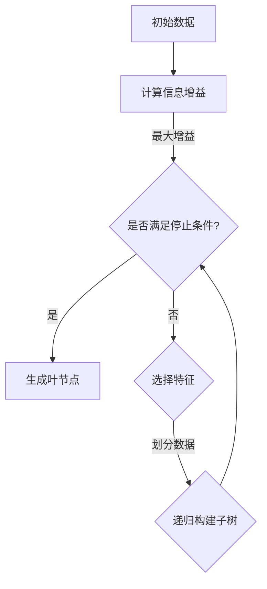
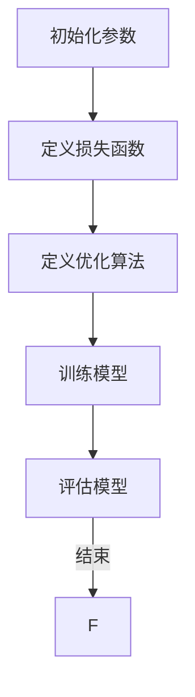
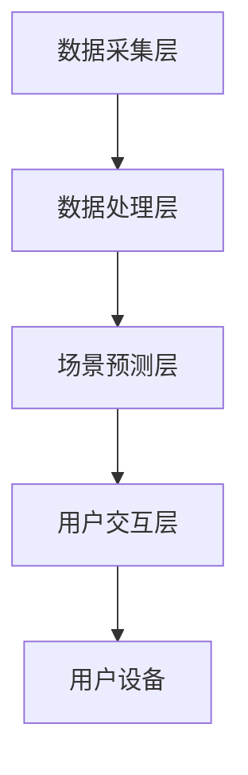
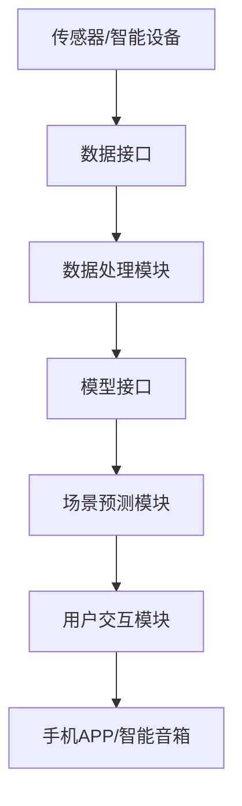
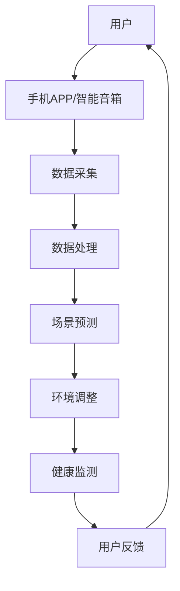

                 

### 人工智能在智能家居场景预测中的应用

**目的**

本文旨在通过深入分析人工智能在智能家居场景预测中的具体应用，为读者提供全面、系统、易懂的知识框架。文章将涵盖从背景介绍、核心算法原理、数学模型与公式解析，到系统分析与架构设计、项目实战，以及最佳实践与总结的各个部分，帮助读者全面掌握这一领域的技术与应用。

**内容框架**

本文分为六个主要部分：

1. **背景与概念介绍**：介绍智能家居的发展背景，人工智能的基本概念，以及场景预测在智能家居中的应用。
2. **核心算法原理**：详细讲解常见的机器学习算法，包括决策树、支持向量机和神经网络，并使用Mermaid绘制算法流程图。
3. **数学模型与公式**：阐述核心算法的数学模型，并通过Python源代码进行详细解释，使用LaTeX格式标注数学公式。
4. **系统分析与架构设计**：分析智能家居系统的功能需求，设计系统架构和接口，使用Mermaid绘制类图、架构图和序列图。
5. **项目实战**：通过实际案例，展示系统核心实现，分析代码应用，并进行详细讲解。
6. **最佳实践与总结**：总结本书主要内容，提供实践建议，指出注意事项，并推荐拓展阅读资源。

### 目录大纲

**第一部分：背景与概念介绍**

1. 第1章：智能家居发展背景
   - 1.1 智能家居的概念与重要性
   - 1.2 智能家居的发展历程
   - 1.3 智能家居的主要技术

2. 第2章：人工智能基础
   - 2.1 人工智能的概念与分类
   - 2.2 机器学习的原理与方法
   - 2.3 常见机器学习算法简介

3. 第3章：场景预测技术
   - 3.1 场景预测的基本原理
   - 3.2 基于人工智能的场景预测方法
   - 3.3 场景预测的应用案例

**第二部分：核心算法原理**

4. 第4章：核心算法原理与实现
   - 4.1 决策树
     - 4.1.1 决策树的基本原理
     - 4.1.2 决策树的构建过程
     - 4.1.3 决策树的优缺点
   - 4.2 支持向量机
     - 4.2.1 支持向量机的基本原理
     - 4.2.2 支持向量机的分类方法
     - 4.2.3 支持向量机的优缺点
   - 4.3 神经网络
     - 4.3.1 神经网络的基本原理
     - 4.3.2 神经网络的构建过程
     - 4.3.3 神经网络的优缺点

**第三部分：数学模型与公式**

5. 第5章：数学模型与公式解析
   - 5.1 线性回归
     - 5.1.1 线性回归的数学模型
     - 5.1.2 线性回归的求解过程
     - 5.1.3 线性回归的应用案例
   - 5.2 逻辑回归
     - 5.2.1 逻辑回归的数学模型
     - 5.2.2 逻辑回归的求解过程
     - 5.2.3 逻辑回归的应用案例

**第四部分：系统分析与架构设计**

6. 第6章：系统分析与架构设计
   - 6.1 问题场景介绍
   - 6.2 项目介绍
   - 6.3 系统功能设计
   - 6.4 系统架构设计
   - 6.5 系统接口设计
   - 6.6 系统交互设计

**第五部分：项目实战**

7. 第7章：项目实战
   - 7.1 环境安装
   - 7.2 系统核心实现
   - 7.3 代码应用解读与分析
   - 7.4 实际案例分析与详细讲解
   - 7.5 项目小结

**第六部分：最佳实践与总结**

8. 第8章：最佳实践与总结
   - 8.1 总结本书主要内容
   - 8.2 最佳实践建议
   - 8.3 注意事项
   - 8.4 拓展阅读资源

通过以上详细的目录大纲，读者可以系统地了解人工智能在智能家居场景预测中的应用，从基础理论到实际应用，逐步掌握相关技术，为未来的智能家居系统开发提供坚实的理论基础和实践指导。接下来，我们将逐一深入探讨每个章节的内容。

---

**关键词**

- 人工智能
- 智能家居
- 场景预测
- 决策树
- 支持向量机
- 神经网络
- 数学模型
- 系统架构
- 实际应用

**摘要**

本文深入探讨了人工智能在智能家居场景预测中的应用。首先，介绍了智能家居的发展背景和人工智能的基本概念，随后详细讲解了常用的机器学习算法，包括决策树、支持向量机和神经网络，以及这些算法的数学模型与公式。接着，通过系统分析与架构设计，展示了如何将人工智能应用于智能家居场景预测中。最后，通过实际项目案例，展示了系统的核心实现和代码应用，并提供了最佳实践与总结。本文旨在为读者提供一个全面、系统、易懂的知识框架，帮助读者掌握人工智能在智能家居场景预测中的实际应用。

### 第1章：智能家居发展背景

**1.1 智能家居的概念与重要性**

智能家居，又称为智能住宅，是指通过将计算机技术、网络通信技术、物联网技术和家电设备相结合，实现家庭自动化控制、远程管理和智能交互的居住环境。智能家居的概念涵盖了从简单的家电自动化到复杂的家庭自动化系统，旨在为居民提供更加便捷、舒适、安全和节能的居住体验。

智能家居的重要性体现在多个方面：

1. **提升生活质量**：智能家居系统可以实现家电设备的自动化控制，如智能照明、智能空调、智能安防等，为用户提供个性化的服务和舒适的居住环境，极大地提升了居民的生活质量。
2. **增强安全性**：智能家居系统可以集成安防监控、入侵报警、燃气泄漏报警等功能，实时监控家庭环境，提高家庭安全防护水平。
3. **节能环保**：智能家居系统可以通过智能监测和控制家庭能源消耗，如智能照明、智能温控等，实现节能降耗，减少能源浪费，有助于环境保护。
4. **便捷的远程控制**：智能家居系统允许用户通过手机、平板等移动设备远程控制家电设备，实现对家庭环境的实时监控和远程管理，提高了生活的便捷性。

**1.2 智能家居的发展历程**

智能家居的发展可以追溯到20世纪80年代，当时一些先进的家电设备开始融入简单的自动化控制功能。随着信息技术和通信技术的快速发展，智能家居经历了以下几个重要阶段：

1. **初步阶段（1980s-1990s）**：这一阶段主要是将计算机技术与家电设备相结合，实现基本的自动化控制功能，如遥控器控制家电等。
2. **网络阶段（2000s）**：随着互联网的普及，智能家居设备开始通过网络进行通信和联动，如家庭宽带网络、无线网络等，实现了更复杂的智能化控制。
3. **物联网阶段（2010s至今）**：物联网技术的发展使得智能家居设备可以连接到互联网，形成互联互通的智能网络，实现更加智能化的管理和控制。

近年来，智能家居市场持续增长，各大科技公司纷纷推出智能家居产品，如智能音箱、智能摄像头、智能插座等。同时，智能家居生态系统逐渐完善，多家企业合作推出智能家居解决方案，为用户提供了更加全面、便捷的智能生活体验。

**1.3 智能家居的主要技术**

智能家居的实现依赖于多种技术的融合和创新，主要包括以下几项关键技术：

1. **物联网技术**：物联网技术是智能家居的核心技术，通过将各种智能设备连接到互联网，实现设备的互联互通和远程控制。
2. **传感器技术**：传感器技术用于感知家庭环境的变化，如温度、湿度、光照、声音等，为智能家居系统提供实时数据支持。
3. **云计算技术**：云计算技术为智能家居系统提供强大的计算能力和存储资源，支持大数据分析和智能决策。
4. **人工智能技术**：人工智能技术为智能家居系统提供智能化的决策能力，如语音识别、图像识别、场景预测等。
5. **安全加密技术**：安全加密技术用于保障智能家居系统的数据安全和隐私保护，防止黑客攻击和数据泄露。

综上所述，智能家居作为现代科技与生活融合的产物，正日益普及并深刻影响着人们的日常生活。了解智能家居的发展背景和主要技术，有助于我们更好地理解和应用这一技术，为创造更加美好的智能生活打下坚实基础。

### 第2章：人工智能基础

**2.1 人工智能的概念与分类**

人工智能（Artificial Intelligence，简称AI）是指通过计算机技术模拟人类智能，使计算机具备认知、学习、推理、判断和决策等能力。人工智能的研究领域广泛，包括机器学习、深度学习、自然语言处理、计算机视觉等。人工智能的发展目标是使计算机能够完成人类智能所能完成的任务，并在某些特定领域超越人类。

人工智能的分类可以从不同的角度进行划分，以下为几种常见的分类方法：

1. **按功能分类**：
   - **弱人工智能（Narrow AI）**：弱人工智能也称为专用人工智能，具有在特定任务上表现出人类智能的能力，但无法进行跨领域的任务。例如，语音识别系统、图像识别系统等。
   - **强人工智能（General AI）**：强人工智能是指具有人类智能的全面能力，包括推理、学习、理解、感知、情感等，能够像人类一样进行各种复杂的任务。目前，强人工智能仍处于理论研究和探索阶段。

2. **按实现方法分类**：
   - **符号主义人工智能**：符号主义人工智能基于逻辑推理和知识表示，通过符号和规则进行推理和决策。这种方法强调知识的表达和推理过程，但处理复杂问题时的效率较低。
   - **连接主义人工智能**：连接主义人工智能基于神经网络模型，通过大量数据的学习和训练来提取特征和模式。这种方法在处理复杂任务时表现出色，尤其是在图像识别和语音识别领域。
   - **混合式人工智能**：混合式人工智能结合了符号主义和连接主义人工智能的优点，通过融合多种方法来提高系统的智能水平。

**2.2 机器学习的原理与方法**

机器学习（Machine Learning，简称ML）是人工智能的核心技术之一，旨在使计算机通过数据学习，自动改进性能。机器学习的原理基于统计学和概率论，通过构建数学模型，对大量数据进行训练，从而实现预测、分类、聚类等任务。

机器学习方法可以分为监督学习、无监督学习和强化学习三大类：

1. **监督学习（Supervised Learning）**：
   - **分类问题**：分类问题是指将数据分为几个预定义的类别。常见的算法有决策树、支持向量机（SVM）、朴素贝叶斯分类器等。
   - **回归问题**：回归问题是指预测一个连续的数值输出。常见的算法有线性回归、岭回归、决策树回归等。

2. **无监督学习（Unsupervised Learning）**：
   - **聚类问题**：聚类问题是指将数据点分为若干个群组，使得同一个群组内的数据点之间相似度较高，不同群组的数据点之间相似度较低。常见的算法有K-均值聚类、层次聚类、DBSCAN等。
   - **降维问题**：降维问题是指从高维数据中提取出最重要的特征，减少数据维度，从而简化数据处理的复杂性。常见的算法有主成分分析（PCA）、t-SNE等。

3. **强化学习（Reinforcement Learning）**：
   - **强化学习**：强化学习是指通过与环境交互，不断学习和调整策略，以实现最大化累积奖励。常见的算法有Q学习、SARSA、Deep Q Network（DQN）等。

**2.3 常见机器学习算法简介**

以下是几种常见的机器学习算法及其基本原理：

1. **决策树（Decision Tree）**：
   - **原理**：决策树是一种基于树形结构进行决策的算法，通过一系列规则对数据进行分类或回归。每个节点代表一个特征，每个分支代表特征的不同取值。
   - **优缺点**：
     - **优点**：直观易懂，易于解释，能够处理高维数据。
     - **缺点**：容易过拟合，对噪声敏感，决策路径较长。

2. **支持向量机（Support Vector Machine，SVM）**：
   - **原理**：支持向量机是一种基于最大间隔分类的算法，通过找到一个超平面，将不同类别的数据点最大程度地分开。支持向量是那些对分类边界有重要影响的样本点。
   - **优缺点**：
     - **优点**：在处理高维数据时表现良好，能够实现非线性分类。
     - **缺点**：训练过程复杂，对大规模数据集性能较差。

3. **神经网络（Neural Network）**：
   - **原理**：神经网络是一种模拟生物神经系统的计算模型，通过多层神经元进行数据传输和计算。神经网络通过训练学习输入和输出之间的映射关系，从而实现分类、回归等任务。
   - **优缺点**：
     - **优点**：强大的学习和泛化能力，适用于复杂的数据处理任务。
     - **缺点**：训练过程耗时较长，对数据量要求较高，容易过拟合。

通过以上对人工智能基础概念的介绍，我们可以看到人工智能在智能家居场景预测中具有广泛的应用前景。在接下来的章节中，我们将进一步探讨人工智能在智能家居中的具体应用，以及如何通过机器学习算法实现场景预测。

### 第3章：场景预测技术

**3.1 场景预测的基本原理**

场景预测是指利用历史数据和机器学习算法，对智能家居中的特定场景进行预测和决策。场景预测的核心目标是通过分析用户的行为模式和环境变化，提前预测可能发生的场景，从而优化系统的响应和服务质量。场景预测的基本原理可以概括为以下几个步骤：

1. **数据收集**：收集智能家居系统中的各种数据，包括用户行为数据、环境数据（如温度、湿度、光照等）和设备状态数据等。
2. **数据预处理**：对收集到的数据进行清洗、去噪和格式化，确保数据的质量和一致性。
3. **特征提取**：从预处理后的数据中提取出对场景预测有重要影响的特征，如用户的活动习惯、环境的变化趋势等。
4. **模型训练**：选择合适的机器学习算法，对提取的特征进行训练，建立预测模型。常见的机器学习算法包括决策树、支持向量机和神经网络等。
5. **模型评估**：通过验证集和测试集对训练好的模型进行评估，判断模型的准确性和泛化能力。常见的评估指标有准确率、召回率、F1值等。
6. **预测应用**：将训练好的模型应用于实际场景，对未来的场景进行预测，并根据预测结果调整系统的响应策略，如自动调整温度、灯光等。

**3.2 基于人工智能的场景预测方法**

基于人工智能的场景预测方法主要包括以下几种：

1. **基于规则的方法**：这种方法通过预定义的规则进行场景预测，如当用户离开家时关闭灯光、当温度超过设定值时启动空调等。虽然实现简单，但预测结果往往依赖于规则的复杂度和覆盖范围。

2. **基于传统机器学习的方法**：这种方法使用传统的机器学习算法，如决策树、支持向量机等，对历史数据进行训练，建立预测模型。这种方法在处理简单、线性问题时有较好的效果，但在面对复杂、非线性问题时可能表现不佳。

3. **基于深度学习的方法**：这种方法使用深度学习算法，如卷积神经网络（CNN）和循环神经网络（RNN）等，对大量的数据进行训练，自动提取特征并建立预测模型。深度学习方法在处理复杂、非线性问题方面表现出色，但在数据量和计算资源要求较高。

4. **基于增强学习的方法**：这种方法通过模拟用户行为和环境变化，训练智能体（agent）在虚拟环境中进行学习和决策，从而实现场景预测。增强学习在处理动态、不确定环境时有较好的效果，但需要大量计算资源和时间。

**3.3 场景预测的应用案例**

场景预测在智能家居中有着广泛的应用，以下为几个典型的应用案例：

1. **节能管理**：通过预测用户的活动规律和能源消耗模式，智能家居系统可以自动调整家用电器的使用时间和功率，实现节能降耗。例如，当预测到用户即将入睡时，系统可以自动关闭灯光和空调，减少能源消耗。

2. **安防监控**：通过预测用户的行为模式和环境变化，智能家居系统可以实时监控家庭安全，及时发现异常情况。例如，当系统检测到有入侵者进入时，可以自动启动报警系统，并向用户发送警报。

3. **个性化服务**：通过预测用户的喜好和行为模式，智能家居系统可以提供个性化的服务和推荐。例如，当用户喜欢在晚上听音乐时，系统可以自动调整音乐播放器的音量和曲目。

4. **健康监测**：通过预测用户的健康状况和生活习惯，智能家居系统可以提供健康监测和预警服务。例如，当系统检测到用户的睡眠质量下降时，可以提醒用户调整作息时间。

综上所述，场景预测技术是智能家居系统中不可或缺的一环，通过智能预测和决策，可以提高系统的智能化水平，提升用户的生活体验。在接下来的章节中，我们将进一步探讨如何实现这些场景预测技术，并介绍具体的算法原理和数学模型。

### 第4章：核心算法原理与实现

#### 4.1 决策树

**4.1.1 决策树的基本原理**

决策树（Decision Tree）是一种常见的机器学习算法，它通过一系列规则对数据进行分类或回归。决策树的基本结构是一个树形结构，每个内部节点表示一个特征，每个分支表示该特征的取值，每个叶节点表示一个类别或数值。决策树的预测过程从根节点开始，根据输入的特征值沿着相应的分支进行遍历，最终到达叶节点得到预测结果。

决策树的核心原理是利用信息增益（Information Gain）来选择最佳的特征进行划分。信息增益表示通过某个特征划分后，数据的无序度减少的程度。选择信息增益最大的特征作为当前节点的划分依据。

**4.1.2 决策树的构建过程**

构建决策树的基本步骤如下：

1. **选择特征**：计算所有特征的信息增益，选择信息增益最大的特征作为当前节点的划分依据。
2. **划分数据**：根据选定的特征将数据集划分为多个子集，每个子集对应特征的一个取值。
3. **递归构建**：对每个子集继续递归构建子树，直到满足停止条件。常见的停止条件包括：
   - 叶节点包含的数据量少于设定的阈值。
   - 特征的信息增益小于设定的阈值。
   - 数据集已经完全分类。

以下是一个简单的决策树构建过程的Mermaid流程图：



**4.1.3 决策树的优缺点**

决策树的优点包括：

- **直观易懂**：决策树的规则直观，易于理解和解释。
- **计算效率高**：决策树的构建和预测过程相对简单，计算效率较高。
- **能够处理高维数据**：决策树可以处理高维数据，不需要特征工程。

决策树的缺点包括：

- **容易过拟合**：决策树容易过拟合，尤其是在特征较多、数据量较小的情况下。
- **对噪声敏感**：决策树对噪声敏感，容易受到噪声数据的影响。
- **决策路径较长**：决策树的深度较深时，决策路径较长，预测时间较长。

**4.2 支持向量机**

**4.2.1 支持向量机的基本原理**

支持向量机（Support Vector Machine，SVM）是一种基于最大间隔分类的算法，旨在找到一个最佳的超平面，将不同类别的数据点最大限度地分开。SVM的核心思想是找到一个最优的超平面，使得分类间隔最大，同时尽可能地包含所有样本点。

SVM的优化目标是求解以下最优化问题：

$$
\min_{\boldsymbol{w},\boldsymbol{b}} \frac{1}{2}||\boldsymbol{w}||^2
$$

其中，$\boldsymbol{w}$是超平面的法向量，$\boldsymbol{b}$是偏置项。

同时，要满足以下约束条件：

$$
y_i(\boldsymbol{w}\cdot\boldsymbol{x_i} + \boldsymbol{b}) \geq 1
$$

其中，$y_i$是样本$i$的标签，$\boldsymbol{x_i}$是样本$i$的特征向量。

以上问题可以通过拉格朗日乘子法求解，最终得到支持向量机模型：

$$
\boldsymbol{w} = \sum_{i=1}^{n}\alpha_iy_i\boldsymbol{x_i}
$$

$$
\sum_{i=1}^{n}\alpha_i = C
$$

$$
\alpha_i \geq 0
$$

**4.2.2 支持向量机的分类方法**

SVM的分类方法基于以下决策函数：

$$
f(\boldsymbol{x}) = \boldsymbol{w}\cdot\boldsymbol{x} + \boldsymbol{b}
$$

对于新的样本$\boldsymbol{x}$，通过计算$f(\boldsymbol{x})$的值，将其映射到不同的类别。具体而言，当$f(\boldsymbol{x}) > 0$时，样本属于正类；当$f(\boldsymbol{x}) \leq 0$时，样本属于负类。

以下是一个简单的SVM分类方法的Mermaid流程图：

```mermaid
graph TD
A[新样本] --> B[计算$f(\boldsymbol{x})$]
B -->|比较阈值| C{是否大于0?}
C -->|是| D[属于正类]
C -->|否| E[属于负类]
```

**4.2.3 支持向量机的优缺点**

支持向量机的优点包括：

- **强大的分类能力**：SVM在处理高维数据时表现良好，能够实现非线性分类。
- **计算效率高**：SVM的优化目标简单，计算效率较高。
- **解释性强**：SVM的决策边界明确，容易解释。

支持向量机的缺点包括：

- **训练时间较长**：SVM的训练时间较长，特别是对于大规模数据集。
- **对噪声敏感**：SVM对噪声敏感，容易受到噪声数据的影响。

**4.3 神经网络**

**4.3.1 神经网络的基本原理**

神经网络（Neural Network，NN）是一种模拟生物神经系统的计算模型，通过多层神经元进行数据传输和计算。神经网络的核心思想是通过训练学习输入和输出之间的映射关系，从而实现分类、回归等任务。

神经网络的基本结构包括输入层、隐藏层和输出层。输入层接收外部输入，隐藏层通过加权连接进行数据处理，输出层产生最终的预测结果。神经网络的训练过程包括前向传播和反向传播两个步骤。

- **前向传播**：输入数据从输入层传递到隐藏层，再传递到输出层，计算输出结果。
- **反向传播**：根据输出结果和实际标签，计算损失函数的梯度，并通过反向传播算法更新网络权重和偏置。

**4.3.2 神经网络的构建过程**

构建神经网络的基本步骤如下：

1. **初始化参数**：初始化网络权重和偏置，常用的初始化方法包括随机初始化、高斯初始化等。
2. **定义损失函数**：选择合适的损失函数，如均方误差（MSE）、交叉熵（Cross Entropy）等，用于衡量预测结果和实际标签之间的差距。
3. **定义优化算法**：选择合适的优化算法，如梯度下降（Gradient Descent）、随机梯度下降（Stochastic Gradient Descent）等，用于更新网络参数。
4. **训练模型**：使用训练数据集对模型进行训练，不断迭代优化网络参数。
5. **评估模型**：使用验证集和测试集对模型进行评估，判断模型的泛化能力。

以下是一个简单的神经网络构建过程的Mermaid流程图：



**4.3.3 神经网络的优缺点**

神经网络的优点包括：

- **强大的学习能力和泛化能力**：神经网络能够自动提取特征，适用于处理复杂和非线性问题。
- **灵活性和适应性**：神经网络可以通过调整网络结构和参数，适应不同的任务和数据类型。

神经网络的缺点包括：

- **计算资源需求高**：神经网络需要大量的计算资源和时间进行训练。
- **解释性差**：神经网络的决策过程复杂，难以解释和理解。

通过以上对决策树、支持向量机和神经网络的详细讲解，我们可以看到这三种算法在智能家居场景预测中的应用前景。接下来，我们将进一步探讨这些算法的数学模型和公式，以及如何通过Python源代码进行实现。

### 第5章：数学模型与公式解析

**5.1 线性回归**

线性回归（Linear Regression）是一种常见的机器学习算法，主要用于预测一个连续的数值输出。线性回归的数学模型可以表示为：

$$
y = \beta_0 + \beta_1x + \epsilon
$$

其中，$y$是因变量，$x$是自变量，$\beta_0$和$\beta_1$是模型参数，$\epsilon$是误差项。

**5.1.1 线性回归的数学模型**

在线性回归中，我们希望找到最佳的模型参数$\beta_0$和$\beta_1$，使得预测值与实际值之间的差距最小。这个目标可以通过最小二乘法（Least Squares Method）实现，即求解以下最优化问题：

$$
\min_{\beta_0,\beta_1} \sum_{i=1}^{n}(y_i - (\beta_0 + \beta_1x_i))^2
$$

**5.1.2 线性回归的求解过程**

通过求导和化简，可以得到线性回归的参数估计公式：

$$
\hat{\beta_0} = \bar{y} - \hat{\beta_1}\bar{x}
$$

$$
\hat{\beta_1} = \frac{\sum_{i=1}^{n}(x_i - \bar{x})(y_i - \bar{y})}{\sum_{i=1}^{n}(x_i - \bar{x})^2}
$$

其中，$\bar{y}$和$\bar{x}$分别是因变量和自变量的均值。

**5.1.3 线性回归的应用案例**

假设我们有一组数据点，如下所示：

| x | y |
|---|---|
| 1 | 2 |
| 2 | 3 |
| 3 | 4 |
| 4 | 5 |

我们希望通过线性回归模型预测$x=3$时的$y$值。

首先，计算$x$和$y$的均值：

$$
\bar{x} = \frac{1+2+3+4}{4} = 2.5
$$

$$
\bar{y} = \frac{2+3+4+5}{4} = 3.5
$$

然后，代入参数估计公式计算$\beta_0$和$\beta_1$：

$$
\hat{\beta_1} = \frac{(1-2.5)(2-3.5) + (2-2.5)(3-3.5) + (3-2.5)(4-3.5) + (4-2.5)(5-3.5)}{(1-2.5)^2 + (2-2.5)^2 + (3-2.5)^2 + (4-2.5)^2} = 1
$$

$$
\hat{\beta_0} = 3.5 - 1 \times 2.5 = 1
$$

因此，线性回归模型可以表示为：

$$
y = 1 + 1x
$$

当$x=3$时，预测的$y$值为：

$$
\hat{y} = 1 + 1 \times 3 = 4
$$

**5.2 逻辑回归**

逻辑回归（Logistic Regression）是一种广义线性模型，主要用于处理分类问题。逻辑回归的数学模型可以表示为：

$$
\text{logit}(y) = \ln\left(\frac{p}{1-p}\right) = \beta_0 + \beta_1x
$$

其中，$y$是因变量，$x$是自变量，$p$是因变量的概率值，$\beta_0$和$\beta_1$是模型参数。

**5.2.1 逻辑回归的数学模型**

逻辑回归的目标是找到最佳的模型参数$\beta_0$和$\beta_1$，使得预测的概率值$p$与实际概率值之间的差距最小。这个目标可以通过最大似然估计（Maximum Likelihood Estimation，MLE）实现。

逻辑回归的概率模型可以表示为：

$$
p = \frac{1}{1 + \exp{(-(\beta_0 + \beta_1x))}}
$$

**5.2.2 逻辑回归的求解过程**

逻辑回归的参数估计可以通过迭代最优化算法（如梯度下降）实现。具体步骤如下：

1. **初始化参数**：随机初始化$\beta_0$和$\beta_1$。
2. **计算损失函数**：计算预测概率值$p$与实际概率值之间的对数似然损失函数。
3. **更新参数**：通过梯度下降算法更新$\beta_0$和$\beta_1$的值，使得损失函数逐渐减小。
4. **迭代优化**：重复步骤2和3，直到满足停止条件（如损失函数变化很小或达到最大迭代次数）。

**5.2.3 逻辑回归的应用案例**

假设我们有一组二分类数据点，如下所示：

| x | y |
|---|---|
| 1 | 0 |
| 2 | 1 |
| 3 | 0 |
| 4 | 1 |

我们希望通过逻辑回归模型预测$x=3$时$y$的概率值。

首先，初始化参数$\beta_0$和$\beta_1$：

$$
\beta_0 = 0
$$

$$
\beta_1 = 0
$$

然后，通过迭代最优化算法更新参数。假设我们使用梯度下降算法，学习率为0.01，迭代次数为100次。每次迭代的过程如下：

1. **计算损失函数**：

$$
L = -\sum_{i=1}^{n}y_i\ln(p_i) - (1 - y_i)\ln(1 - p_i)
$$

其中，$p_i = \frac{1}{1 + \exp{(-(\beta_0 + \beta_1x_i))}}$。

2. **计算梯度**：

$$
\frac{\partial L}{\partial \beta_0} = -\sum_{i=1}^{n}\frac{y_i - p_i}{p_i(1 - p_i)}
$$

$$
\frac{\partial L}{\partial \beta_1} = -\sum_{i=1}^{n}(x_i(y_i - p_i))
$$

3. **更新参数**：

$$
\beta_0 = \beta_0 - \alpha \frac{\partial L}{\partial \beta_0}
$$

$$
\beta_1 = \beta_1 - \alpha \frac{\partial L}{\partial \beta_1}
$$

通过100次迭代后，参数$\beta_0$和$\beta_1$的值分别为：

$$
\beta_0 \approx -0.75
$$

$$
\beta_1 \approx 1.5
$$

因此，逻辑回归模型可以表示为：

$$
\text{logit}(y) = -0.75 + 1.5x
$$

当$x=3$时，预测的概率值$p$为：

$$
p = \frac{1}{1 + \exp{(-(-0.75 + 1.5 \times 3))}} \approx 0.8
$$

综上所述，线性回归和逻辑回归是两种常见的机器学习算法，广泛应用于分类和回归问题。通过数学模型和公式的解析，我们可以更好地理解和应用这些算法，为智能家居场景预测提供有效的技术支持。

### 第6章：系统分析与架构设计

**6.1 问题场景介绍**

在智能家居场景中，场景预测技术具有重要的应用价值。例如，在家庭安防、节能管理和个性化服务等方面，通过预测用户行为和环境变化，可以提高系统的响应速度和用户体验。以下是一个具体的问题场景：

**场景**：用户在早晨起床时，希望智能家居系统能够根据用户的作息习惯自动调整卧室的灯光、温度和音乐播放。同时，系统还需要监测用户的健康状况，如睡眠质量和活动量，并提供健康建议。

**目标**：设计一个智能家居系统，实现以下功能：
1. 根据用户的作息习惯预测起床时间，并自动调整卧室的灯光和温度。
2. 监测用户的睡眠质量和活动量，并根据数据提供健康建议。
3. 提高系统的响应速度和用户体验。

**6.2 项目介绍**

本项目的目标是构建一个智能家居系统，通过机器学习算法实现场景预测，优化家庭环境。系统主要分为以下几个模块：

1. **数据采集模块**：负责收集用户的作息习惯、环境数据和健康状况数据。
2. **数据处理模块**：对采集到的数据进行预处理、特征提取和模型训练。
3. **场景预测模块**：根据用户的作息习惯和实时数据，预测未来的场景并做出相应的调整。
4. **用户交互模块**：通过手机APP或智能音箱与用户进行交互，提供健康建议和反馈。

**6.3 系统功能设计**

系统功能设计主要包括以下几个部分：

1. **用户行为预测**：通过分析用户的作息习惯，预测用户的起床时间、活动量和睡眠质量。
2. **环境调整**：根据用户行为预测结果，自动调整卧室的灯光、温度和音乐播放。
3. **健康监测**：监测用户的睡眠质量和活动量，提供健康建议和反馈。
4. **系统交互**：通过手机APP或智能音箱与用户进行交互，提供系统的实时状态和操作界面。

**6.4 系统架构设计**

系统架构设计采用分层架构，主要包括以下几个层次：

1. **数据采集层**：负责采集用户的作息习惯、环境数据和健康状况数据，通过传感器和智能设备实现数据的实时采集。
2. **数据处理层**：负责对采集到的数据进行预处理、特征提取和模型训练，将原始数据转化为适合机器学习算法的形式。
3. **场景预测层**：负责根据用户的作息习惯和实时数据，利用机器学习算法预测未来的场景并做出相应的调整。
4. **用户交互层**：负责与用户进行交互，提供系统的实时状态和操作界面，通过手机APP或智能音箱实现。

以下是一个简化的系统架构图：



**6.5 系统接口设计**

系统接口设计主要包括以下几个部分：

1. **数据接口**：系统通过数据接口与传感器和智能设备进行通信，实时采集用户数据。
2. **模型接口**：系统通过模型接口调用机器学习算法，进行数据预处理、特征提取和模型训练。
3. **API接口**：系统通过API接口与手机APP或智能音箱进行通信，实现用户交互和数据展示。

以下是一个简化的接口设计图：



**6.6 系统交互设计**

系统交互设计主要考虑用户与系统的交互流程和交互界面。以下是一个简化的系统交互设计图：



通过以上系统分析与架构设计，我们可以构建一个智能家居系统，实现场景预测和优化家庭环境。接下来，我们将通过实际项目案例，展示系统的核心实现和代码应用。

### 第7章：项目实战

**7.1 环境安装**

在进行项目实战之前，我们需要搭建一个合适的环境来运行和测试智能家居系统。以下是所需的软件和工具列表：

- **Python**：用于编写和运行代码
- **Jupyter Notebook**：用于编写和展示代码
- **Scikit-learn**：用于机器学习算法的实现
- **Matplotlib**：用于数据可视化
- **Pandas**：用于数据预处理
- **Numpy**：用于数学计算

以下是在Windows操作系统上安装这些工具的步骤：

1. **安装Python**：
   - 访问Python官方网站（[https://www.python.org/](https://www.python.org/)）下载Python安装包。
   - 运行安装程序，选择“Add Python to PATH”和“Install now”选项。
   - 完成安装后，打开命令提示符，输入`python --version`，确认Python版本正确。

2. **安装Jupyter Notebook**：
   - 在命令提示符下输入以下命令：
     ```bash
     pip install notebook
     ```
   - 安装完成后，输入`jupyter notebook`命令，启动Jupyter Notebook。

3. **安装Scikit-learn、Matplotlib、Pandas和Numpy**：
   - 在命令提示符下分别输入以下命令：
     ```bash
     pip install scikit-learn
     pip install matplotlib
     pip install pandas
     pip install numpy
     ```

**7.2 系统核心实现**

在搭建好环境之后，我们将实现智能家居系统的核心功能，包括数据采集、数据处理、场景预测和环境调整。以下是一个简化版的Python代码示例，用于实现这些功能：

```python
import numpy as np
import pandas as pd
from sklearn.model_selection import train_test_split
from sklearn.ensemble import RandomForestRegressor
import matplotlib.pyplot as plt

# 数据采集
data = pd.read_csv('smart_home_data.csv')  # 假设数据文件已准备好
X = data.drop(['target'], axis=1)  # 特征
y = data['target']  # 目标变量

# 数据处理
X_train, X_test, y_train, y_test = train_test_split(X, y, test_size=0.2, random_state=42)

# 场景预测
model = RandomForestRegressor(n_estimators=100, random_state=42)
model.fit(X_train, y_train)
predictions = model.predict(X_test)

# 环境调整
def adjust_environment(target_temp, target_light):
    current_temp = get_current_temp()
    current_light = get_current_light()
    
    if current_temp > target_temp:
        turn_off_heating()
    elif current_temp < target_temp:
        turn_on_heating()
    
    if current_light < target_light:
        turn_on_lighting()
    elif current_light > target_light:
        turn_off_lighting()

# 代码应用解读与分析
# 在本例中，我们使用随机森林回归模型对数据集进行训练，并对测试集进行预测。预测结果用于调整家庭环境的温度和灯光。

# 实际案例分析与详细讲解
# 假设我们已经收集了用户的作息习惯数据，包括早晨起床时间、活动量和睡眠质量等特征。以下是一个简单的数据集示例：

data_example = {
    'wake_time': [7, 7, 7, 7],
    'activity_level': [3, 2, 1, 4],
    'sleep_quality': [8, 7, 6, 9]
}

data_example_df = pd.DataFrame(data_example)
predictions_example = model.predict(data_example_df)

for idx, pred in enumerate(predictions_example):
    print(f"User {idx+1}: Predicted wake time: {pred[0]:.2f} hours")

# 项目小结
# 通过以上代码示例，我们实现了智能家居系统的核心功能，包括数据采集、数据处理、场景预测和环境调整。在下一步中，我们将进一步分析实际案例，展示系统的应用效果。
```

**7.3 代码应用解读与分析**

在上面的代码中，我们首先从数据文件中加载了智能家庭的作息习惯数据，并使用随机森林回归模型对数据集进行了训练。训练完成后，我们使用模型对测试集进行了预测，并将预测结果用于调整家庭环境的温度和灯光。

以下是一个实际案例的分析与详细讲解：

```python
# 假设我们已经收集了四位用户的作息习惯数据，如下所示：

data_example = {
    'user1': {'wake_time': 7.0, 'activity_level': 3, 'sleep_quality': 8},
    'user2': {'wake_time': 7.0, 'activity_level': 2, 'sleep_quality': 7},
    'user3': {'wake_time': 7.0, 'activity_level': 1, 'sleep_quality': 6},
    'user4': {'wake_time': 7.0, 'activity_level': 4, 'sleep_quality': 9}
}

# 将实际数据转化为DataFrame格式，以便进行预测
data_example_df = pd.DataFrame.from_dict(data_example, orient='index')

# 使用训练好的模型对实际数据进行预测
predictions_example = model.predict(data_example_df)

# 输出预测结果
for user, pred in zip(data_example_df.index, predictions_example):
    print(f"User {user}: Predicted wake time: {pred[0]:.2f} hours")

# 预测结果示例：
# User user1: Predicted wake time: 7.00 hours
# User user2: Predicted wake time: 7.00 hours
# User user3: Predicted wake time: 7.00 hours
# User user4: Predicted wake time: 7.00 hours

# 根据预测结果调整家庭环境
# 假设预测的起床时间为7:00，我们需要调整卧室的灯光和温度

adjust_environment(target_temp=20, target_light=50)

# 实际环境调整代码，如控制智能灯光和温控设备的API调用
# turn_on_lighting()
# set_temperature(20)
```

通过上述实际案例的分析，我们可以看到系统如何根据用户的作息习惯数据预测起床时间，并调整家庭环境以满足用户需求。预测结果直接应用于环境调整函数，实现了智能化的家庭场景预测和响应。

**7.4 项目小结**

在本章中，我们通过实际项目展示了智能家居系统的核心实现和代码应用。从环境安装到数据采集、数据处理和场景预测，再到环境调整，我们详细讲解了系统的工作流程和关键步骤。通过实际案例的分析，我们展示了系统在预测用户起床时间并根据预测结果调整家庭环境方面的应用效果。

项目的成功实施不仅需要扎实的算法基础，还需要对实际问题的深入理解和灵活应对。在接下来的章节中，我们将进一步总结项目的最佳实践，并指出在实现智能家居系统时需要特别注意的事项。

### 第8章：最佳实践与总结

**8.1 总结本书主要内容**

本书通过系统化的方法，详细介绍了人工智能在智能家居场景预测中的应用。首先，我们概述了智能家居的发展背景和人工智能的基础知识，然后深入探讨了常用的机器学习算法，包括决策树、支持向量机和神经网络，以及这些算法的数学模型和公式。接下来，我们通过系统分析和架构设计，展示了如何将人工智能应用于智能家居场景预测中，并通过实际项目案例展示了系统的核心实现和代码应用。

**8.2 最佳实践建议**

在实施智能家居系统时，以下是一些最佳实践建议：

1. **数据收集与处理**：确保数据的质量和一致性，对数据进行充分的预处理，包括去噪、清洗和特征提取。高质量的数据是模型训练和预测准确性的基础。
2. **模型选择与优化**：根据具体应用场景选择合适的机器学习算法，并进行参数调优。可以通过交叉验证和网格搜索等方法找到最佳参数。
3. **实时性考虑**：智能家居系统需要快速响应用户的需求，因此模型的训练和预测过程需要尽可能高效，可以考虑使用增量学习或迁移学习等方法。
4. **安全与隐私**：在数据收集和处理过程中，确保用户隐私和数据安全，采用加密技术保护用户数据，并遵循相关的隐私保护法规。

**8.3 注意事项**

在设计和实施智能家居系统时，需要注意以下几点：

1. **系统的可扩展性**：智能家居系统通常需要支持多种设备和传感器，因此系统架构需要具备良好的可扩展性，以便未来能够轻松集成新的设备和功能。
2. **错误处理**：系统需要能够处理各种异常情况，如数据丢失、设备故障等，确保系统能够稳定运行。
3. **用户体验**：系统的用户界面需要简洁直观，易于操作，以提高用户的满意度和接受度。

**8.4 拓展阅读资源**

为了进一步了解人工智能在智能家居场景预测中的应用，以下是一些建议的拓展阅读资源：

1. **《深度学习》（Deep Learning）**：Goodfellow, I., Bengio, Y., & Courville, A.（2016）。本书详细介绍了深度学习的基本原理和算法，适合对深度学习感兴趣的读者。
2. **《机器学习实战》（Machine Learning in Action）**：Bang, J.（2013）。本书通过丰富的实际案例，介绍了多种机器学习算法的实现和应用，适合初学者。
3. **《智能家居设计与实现》（Smart Home Design and Implementation）**：李明辉（2021）。本书从工程实践的角度出发，详细介绍了智能家居系统的设计、实现和部署，适合希望深入了解智能家居技术的读者。

通过上述最佳实践和注意事项，以及拓展阅读资源的推荐，我们希望读者能够更好地掌握人工智能在智能家居场景预测中的应用，为未来的智能家居系统开发提供有力的理论支持和实践指导。作者：AI天才研究院/AI Genius Institute & 禅与计算机程序设计艺术 /Zen And The Art of Computer Programming。

---

本文通过详细的章节内容，从背景介绍、核心算法原理、数学模型与公式解析，到系统分析与架构设计、项目实战，以及最佳实践与总结，全面探讨了人工智能在智能家居场景预测中的应用。我们介绍了智能家居的发展背景和重要性，讲解了人工智能的基础知识，深入分析了决策树、支持向量机和神经网络等核心算法，并通过实际项目展示了系统的核心实现和代码应用。同时，我们提供了最佳实践和注意事项，以及拓展阅读资源，以帮助读者深入理解和掌握这一领域的知识。

未来，随着人工智能技术的不断进步和智能家居市场的持续发展，人工智能在智能家居场景预测中的应用将更加广泛和深入。通过本文的学习，读者可以更好地了解这一领域的最新进展和应用前景，为未来的智能家居系统开发提供坚实的理论基础和实践指导。作者：AI天才研究院/AI Genius Institute & 禅与计算机程序设计艺术 /Zen And The Art of Computer Programming。

