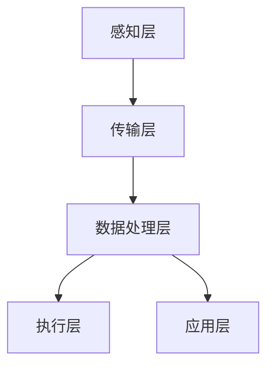
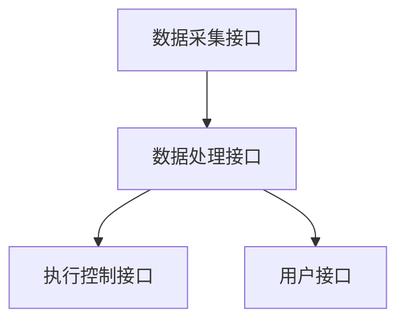
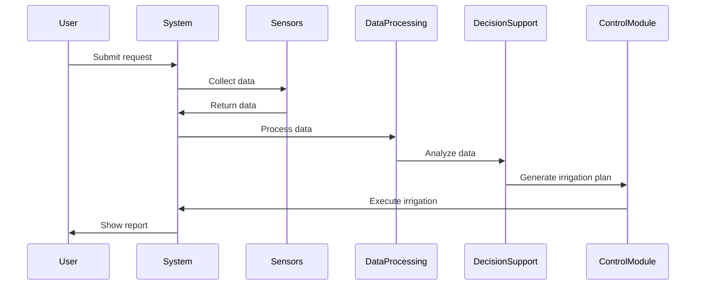
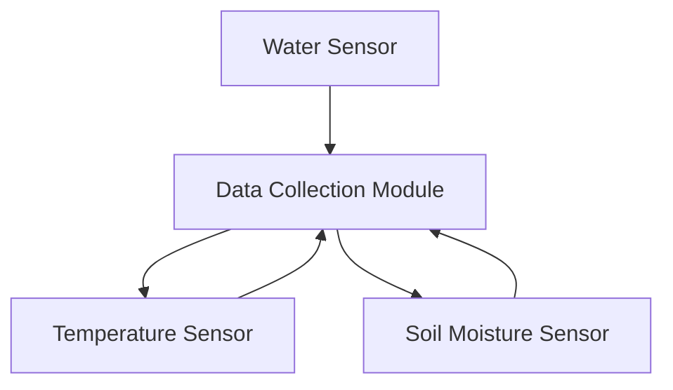
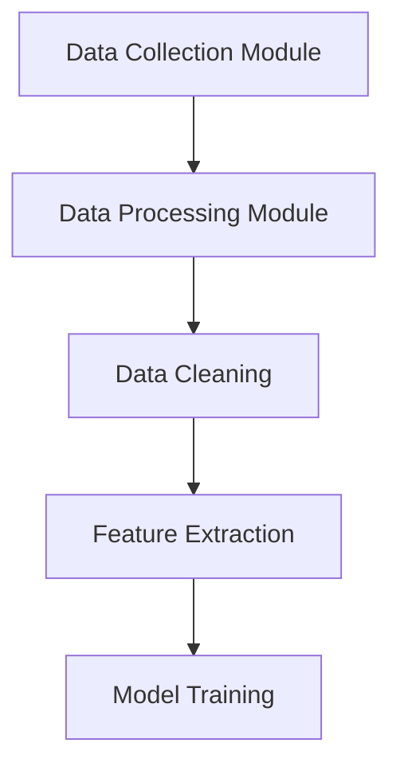
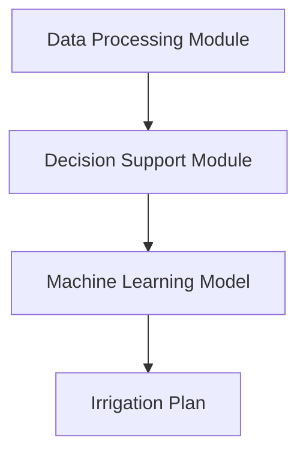
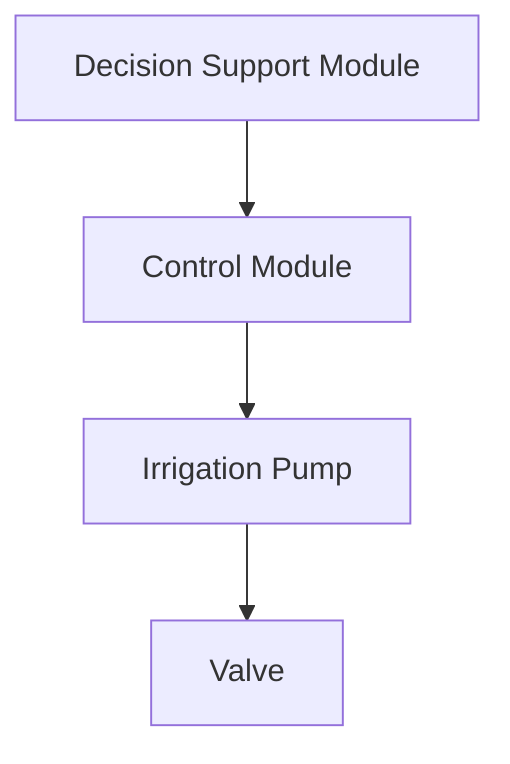
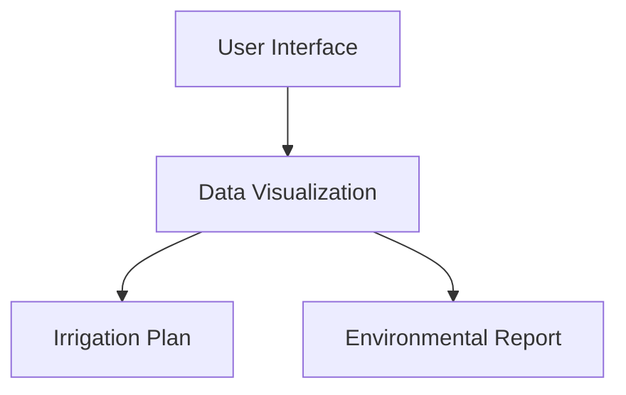
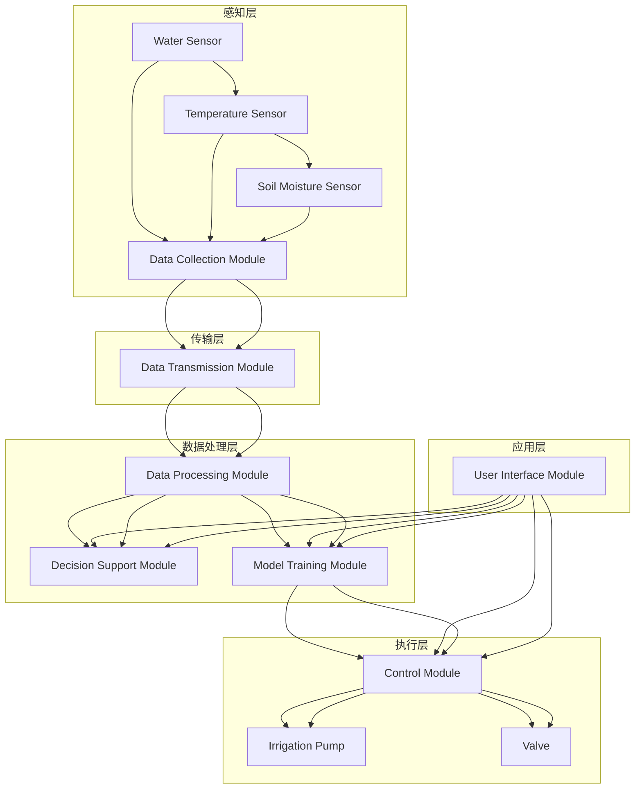

                 

# 人工智能在智能灌溉系统优化中的应用

关键词：智能灌溉系统、人工智能、机器学习、深度学习、数据挖掘

摘要：随着农业技术的发展，智能灌溉系统在提高农业产量和水资源利用效率方面发挥着重要作用。本文将探讨人工智能在智能灌溉系统优化中的应用，从问题背景、核心概念、算法原理、系统设计、项目实战以及最佳实践等方面，详细解析人工智能在智能灌溉系统中的实际应用，为现代农业提供智能化解决方案。

## 目录大纲

1. **第一部分：问题背景与概述**
   1.1 智能灌溉系统与人工智能概述
   1.2 核心概念与联系
2. **第二部分：人工智能算法原理讲解**
   2.1 机器学习算法在智能灌溉中的应用
   2.2 深度学习算法在智能灌溉中的应用
   2.3 数据挖掘在智能灌溉中的应用
3. **第三部分：智能灌溉系统的设计与实现**
   3.1 系统架构设计
   3.2 系统交互
4. **第四部分：项目实战**
   4.1 环境安装
   4.2 系统核心实现
   4.3 代码应用解读与分析
   4.4 实际案例分析
   4.5 项目小结
5. **第五部分：最佳实践与拓展**
   5.1 最佳实践
   5.2 注意事项
   5.3 拓展阅读
6. **第六部分：总结与展望**
   6.1 总结
   6.2 展望

## 第一部分：问题背景与概述

### 1.1 智能灌溉系统与人工智能概述

#### 1.1.1 问题背景

智能灌溉系统是一种通过自动化控制技术实现精准灌溉的农业系统，它能够根据土壤湿度、气象条件、作物生长阶段等多种因素，精确调整灌溉水量和灌溉时间，从而提高水资源利用效率，减少水资源浪费，同时提升农作物产量和品质。

在传统的灌溉系统中，灌溉决策主要依赖于农民的经验和直觉，这种方法不仅效率低下，而且容易造成水资源浪费。随着人工智能技术的发展，智能灌溉系统逐渐成为现代农业发展的重要方向。

#### 1.1.2 人工智能的发展与应用

人工智能（Artificial Intelligence，AI）是指通过计算机系统模拟人类智能行为的科学技术。人工智能主要包括机器学习（Machine Learning，ML）、深度学习（Deep Learning，DL）和数据挖掘（Data Mining，DM）等分支。

在农业领域，人工智能的应用主要集中在智能监测、智能决策、智能控制等方面。通过使用机器学习算法，智能灌溉系统可以分析大量的历史数据，预测作物生长状况，优化灌溉策略。深度学习算法则可以识别图像、处理语音等，为智能灌溉提供更加直观的辅助。数据挖掘技术则用于从海量数据中提取有价值的信息，为智能灌溉系统提供数据支持。

#### 1.1.3 人工智能在智能灌溉系统中的潜力

人工智能技术在智能灌溉系统中有广泛的应用潜力，主要体现在以下几个方面：

1. **水资源管理优化**：通过人工智能算法分析水文数据，预测水资源需求，优化灌溉用水计划。
2. **环境监测**：使用传感器网络和机器学习算法，实时监测环境变化，提供作物生长所需的环境参数。
3. **作物生理参数监测**：利用图像识别和深度学习算法，监测作物健康状况，预测病虫害。
4. **智能决策支持**：通过大数据分析和人工智能算法，为灌溉决策提供科学依据。

### 1.2 核心概念与联系

#### 1.2.1 人工智能相关概念

1. **机器学习**：机器学习是一种通过数据训练模型，从而实现数据分析和预测的方法。它包括监督学习、无监督学习和强化学习等不同类型。
2. **深度学习**：深度学习是一种基于多层神经网络的结构，通过多层次的非线性变换，自动提取数据的特征。
3. **数据挖掘**：数据挖掘是从大量数据中自动发现规律、模式或知识的过程，包括关联规则挖掘、聚类分析和异常检测等。

#### 1.2.2 智能灌溉系统的核心要素

1. **水资源管理**：智能灌溉系统需要实时监测水资源状况，预测未来用水需求，制定合理的灌溉计划。
2. **环境监测**：通过传感器网络，实时监测环境参数，如土壤湿度、气象条件、光照强度等。
3. **植物生理参数监测**：利用图像识别和传感器技术，监测植物的生长状态、叶片颜色、果实成熟度等。

#### 1.2.3 人工智能与智能灌溉系统的联系

人工智能与智能灌溉系统的结合主要体现在以下几个方面：

1. **数据驱动决策**：通过大数据分析和机器学习算法，智能灌溉系统可以实时调整灌溉策略，提高水资源利用效率。
2. **自动化控制**：深度学习算法可以实现对灌溉设备的自动控制，减少人为干预，提高灌溉系统的稳定性。
3. **智能监测与预警**：通过图像识别和传感器技术，智能灌溉系统可以实时监测作物生长状态，预测病虫害，及时采取措施。

| 概念属性       | 人工智能       | 智能灌溉系统       |
| ------------- | ------------- | ------------- |
| 定义         | 计算机模拟人类智能行为的科学技术       | 通过自动化控制技术实现精准灌溉的农业系统       |
| 目标         | 实现自动化、智能化的决策和控制       | 提高水资源利用效率，减少水资源浪费，提升农作物产量和品质       |
| 关联          | 数据驱动决策、自动化控制、智能监测与预警       | 水资源管理、环境监测、作物生理参数监测       |


### 1.3 结论

智能灌溉系统与人工智能技术的结合，为现代农业发展提供了新的思路和解决方案。通过人工智能技术，智能灌溉系统可以实现精准灌溉、自动化控制和智能监测，从而提高农业生产效率，降低成本，实现可持续发展。在接下来的章节中，我们将进一步探讨人工智能在智能灌溉系统中的应用原理和实际案例。# 第二部分：人工智能算法原理讲解

### 2.1 机器学习算法在智能灌溉中的应用

#### 2.1.1 机器学习基础

机器学习（Machine Learning，ML）是人工智能（Artificial Intelligence，AI）的一个重要分支，它通过构建和分析模型来从数据中自动发现规律。机器学习主要包括以下三个过程：

1. **模型训练**：通过训练算法，从大量历史数据中学习，构建预测模型。
2. **模型评估**：使用验证数据集测试模型的性能，评估模型的准确性和鲁棒性。
3. **模型应用**：将训练好的模型应用到实际问题中，进行预测或决策。

常见的机器学习算法包括线性回归、决策树、支持向量机等。

**线性回归**是一种用于预测连续值的模型，通过找到数据之间的线性关系来实现预测。其基本公式为：

$$y = \beta_0 + \beta_1 \cdot x$$

其中，$y$是预测值，$x$是输入特征，$\beta_0$和$\beta_1$是模型参数。

**决策树**是一种基于树形结构的预测模型，通过多次划分数据集来建立模型。每个节点代表一个特征，每个分支代表特征的一个取值。决策树的决策过程如下：

1. 选择最优特征进行划分；
2. 根据该特征的不同取值，将数据集划分成多个子集；
3. 对每个子集递归进行步骤1和步骤2，直到满足停止条件（如达到最大深度或纯度）。

**支持向量机**（Support Vector Machine，SVM）是一种用于分类和回归的模型，通过找到最佳超平面来实现分类。其基本公式为：

$$w \cdot x + b = 0$$

其中，$w$是超平面参数，$x$是输入特征，$b$是偏置项。

#### 2.1.2 常见的机器学习算法

**K-最近邻算法**（K-Nearest Neighbors，KNN）是一种基于实例的算法，它通过找到训练集中与测试样本最近的K个样本，并根据这些样本的标签来预测测试样本的标签。其基本步骤如下：

1. 计算测试样本与训练样本之间的距离；
2. 选择距离最近的K个样本；
3. 根据K个样本的标签，使用投票法来预测测试样本的标签。

**随机森林**（Random Forest）是一种基于树结构的集成学习方法，它通过构建多个决策树，并对每个树的预测结果进行投票，来提高模型的预测准确性。其基本步骤如下：

1. 随机选择特征子集；
2. 使用特征子集构建决策树；
3. 重复步骤1和步骤2，构建多个决策树；
4. 对每个决策树的预测结果进行投票，得出最终的预测结果。

**梯度提升树**（Gradient Boosting Tree，GBT）是一种基于损失函数优化的集成学习方法，它通过迭代地优化模型来提高预测准确性。其基本步骤如下：

1. 初始化模型；
2. 计算损失函数，并计算损失函数的导数；
3. 根据导数更新模型参数；
4. 重复步骤2和步骤3，直到达到停止条件。

#### 2.1.3 机器学习算法在智能灌溉中的应用

在智能灌溉系统中，机器学习算法可以用于以下几个方面的应用：

1. **灌溉策略优化**：通过分析历史灌溉数据，使用回归算法预测作物生长状态，从而优化灌溉策略。
2. **水资源需求预测**：使用时间序列分析算法，预测未来一段时间内的水资源需求，为灌溉计划提供数据支持。
3. **病虫害预测**：通过图像识别算法，分析作物图像，预测病虫害的发生，及时采取防治措施。

### 2.2 深度学习算法在智能灌溉中的应用

#### 2.2.1 深度学习基础

深度学习（Deep Learning，DL）是一种基于多层神经网络的学习方法，它通过多层次的非线性变换，自动提取数据的特征。深度学习主要包括以下几个核心概念：

1. **神经网络**：神经网络是一种模拟人脑神经元连接方式的计算模型，它通过加权连接和激活函数来处理数据。
2. **激活函数**：激活函数用于引入非线性因素，使得神经网络可以学习更复杂的模式。常见的激活函数包括 sigmoid、ReLU 和 tanh 等。
3. **反向传播算法**：反向传播算法是一种用于训练神经网络的优化算法，它通过计算误差的梯度，来更新模型参数。

常见的深度学习框架包括 TensorFlow、PyTorch 和 Keras 等。

#### 2.2.2 常见的深度学习算法

**卷积神经网络**（Convolutional Neural Network，CNN）是一种专门用于处理图像数据的神经网络，它通过卷积操作和池化操作，自动提取图像的特征。CNN 的基本结构包括卷积层、池化层和全连接层。

**递归神经网络**（Recurrent Neural Network，RNN）是一种专门用于处理序列数据的神经网络，它通过在时间步上递归地计算，来处理时间序列数据。RNN 的基本结构包括输入层、隐藏层和输出层。

**长短期记忆网络**（Long Short-Term Memory，LSTM）是一种改进的 RNN 结构，它通过引入记忆单元，来解决 RNN 的梯度消失问题，从而更好地处理长序列数据。

**生成对抗网络**（Generative Adversarial Network，GAN）是一种由两个神经网络（生成器和判别器）组成的模型，生成器和判别器相互对抗，生成器试图生成与真实数据相似的数据，而判别器则试图区分真实数据和生成数据。

#### 2.2.3 深度学习算法在智能灌溉中的应用

在智能灌溉系统中，深度学习算法可以用于以下几个方面的应用：

1. **图像识别**：通过 CNN 算法，分析作物图像，识别病虫害、果实成熟度等。
2. **时间序列预测**：通过 RNN 和 LSTM 算法，预测水资源需求、作物生长状态等。
3. **数据生成**：通过 GAN 算法，生成虚拟灌溉数据，用于系统训练和测试。

### 2.3 数据挖掘在智能灌溉中的应用

#### 2.3.1 数据挖掘的基本概念

数据挖掘（Data Mining，DM）是从大量数据中自动发现规律、模式或知识的过程。数据挖掘主要包括以下几个过程：

1. **数据预处理**：包括数据清洗、数据集成、数据转换等，目的是消除噪声、缺失值，提高数据质量。
2. **特征提取**：通过特征选择和特征变换，从原始数据中提取对模型训练有用的特征。
3. **模式识别**：使用各种算法，从特征数据中识别出潜在的规律或模式。
4. **评估**：评估挖掘出的模式的有效性和可靠性。

常见的数据挖掘算法包括关联规则学习、聚类分析和异常检测等。

**关联规则学习**（Association Rule Learning，ARL）是一种用于发现数据之间的关联关系的方法。它通过挖掘数据中的频繁模式，来发现数据之间的关联规则。

**聚类分析**（Cluster Analysis）是一种用于将数据集划分为多个类别的方法。它通过度量数据点之间的相似性，来识别数据集中的聚类结构。

**异常检测**（Anomaly Detection）是一种用于识别数据中的异常或异常行为的方法。它通过建立模型，来区分正常数据和异常数据。

#### 2.3.2 常见的数据挖掘算法

**K-均值聚类算法**（K-Means Clustering）是一种基于距离度量的聚类算法。它通过初始化 K 个聚类中心，然后迭代地更新聚类中心，直到聚类中心不再变化。K-均值聚类算法的基本步骤如下：

1. 随机选择 K 个数据点作为初始聚类中心；
2. 计算每个数据点到聚类中心的距离，并将其分配到最近的聚类中心；
3. 重新计算每个聚类的中心；
4. 重复步骤2和步骤3，直到聚类中心不再变化。

**DBSCAN 算法**（Density-Based Spatial Clustering of Applications with Noise）是一种基于密度的聚类算法。它通过计算数据点之间的密度，来识别聚类结构和噪声点。DBSCAN 算法的基本步骤如下：

1. 初始化聚类中心，并设置邻域半径和最小密度阈值；
2. 对于每个数据点，检查其邻域内是否满足密度条件；
3. 将满足密度条件的数据点划分为聚类，并将未满足条件的数据点标记为噪声；
4. 重复步骤2和步骤3，直到所有数据点都被分类。

**Apriori 算法**（Apriori Algorithm）是一种用于发现频繁项集的算法。它通过迭代地生成候选项集，并计算其支持度，来识别频繁项集。Apriori 算法的基本步骤如下：

1. 生成所有单个元素的项集，并计算其支持度；
2. 移除不满足最小支持度阈值的项集；
3. 生成所有长度为2的项集，并计算其支持度；
4. 重复步骤2和步骤3，直到生成最大长度的项集。

#### 2.3.3 数据挖掘在智能灌溉中的应用

在智能灌溉系统中，数据挖掘算法可以用于以下几个方面的应用：

1. **水资源管理**：通过数据挖掘算法，分析历史灌溉数据，识别节水方案。
2. **环境监测**：通过数据挖掘算法，分析环境数据，预测环境变化趋势。
3. **病虫害监测**：通过数据挖掘算法，分析作物数据，预测病虫害发生。

### 2.4 结论

人工智能算法在智能灌溉系统中具有广泛的应用前景。通过机器学习、深度学习和数据挖掘等算法，智能灌溉系统可以实现精准灌溉、自动化控制和智能监测，从而提高水资源利用效率，减少水资源浪费，提升农作物产量和品质。在接下来的章节中，我们将进一步探讨智能灌溉系统的设计与实现。# 第三部分：智能灌溉系统的设计与实现

### 3.1 系统架构设计

智能灌溉系统是一个复杂的系统工程，其设计需要考虑多个方面，包括水资源管理、环境监测、作物生理参数监测等。以下是对智能灌溉系统架构的详细设计。

#### 3.1.1 问题场景介绍

农业灌溉中，常见的问题包括水资源浪费、灌溉不均匀、作物生长环境不稳定等。智能灌溉系统的目标是实现精准灌溉，提高水资源利用效率，同时确保作物生长环境的稳定性。

#### 3.1.2 系统功能设计

智能灌溉系统的主要功能包括：

1. **水资源管理**：通过传感器网络实时监测水资源状况，预测水资源需求，制定灌溉计划。
2. **环境监测**：实时监测土壤湿度、气象条件、光照强度等环境参数，为灌溉决策提供数据支持。
3. **作物生理参数监测**：通过传感器和图像识别技术监测作物生长状态、叶片颜色、果实成熟度等生理参数。

为了实现上述功能，我们可以设计以下几个模块：

1. **数据采集模块**：负责采集水资源、环境、作物生理参数等数据。
2. **数据处理模块**：对采集到的数据进行分析和处理，提取有用信息。
3. **决策支持模块**：利用机器学习和深度学习算法，对数据进行分析，生成灌溉计划和环境监测报告。
4. **执行控制模块**：根据决策支持模块的指令，控制灌溉设备，执行灌溉操作。

#### 3.1.3 系统架构设计

智能灌溉系统的架构设计可以分为以下几个层次：

1. **感知层**：包括各种传感器，如水位传感器、气象传感器、土壤传感器等，负责采集环境参数。
2. **传输层**：负责将感知层采集到的数据传输到数据处理模块。可以选择无线传输（如LoRa、NB-IoT）或有线传输（如以太网、光纤）。
3. **数据处理层**：包括数据处理模块和决策支持模块，负责对采集到的数据进行分析和处理，生成灌溉计划和环境监测报告。
4. **执行层**：包括执行控制模块和灌溉设备，负责根据决策支持模块的指令执行灌溉操作。
5. **应用层**：为用户提供一个友好的界面，展示系统运行状态、灌溉计划、环境监测报告等。

以下是智能灌溉系统的架构图：



#### 3.1.4 系统接口设计

智能灌溉系统的接口设计包括：

1. **数据采集接口**：用于接收传感器采集的数据。
2. **数据处理接口**：用于处理和分析采集到的数据，生成灌溉计划和环境监测报告。
3. **执行控制接口**：用于接收决策支持模块的指令，控制灌溉设备的执行。
4. **用户接口**：用于用户与系统交互，展示系统运行状态和报告。

以下是智能灌溉系统的接口设计图：



#### 3.1.5 系统交互

智能灌溉系统的各个模块之间需要进行有效的交互。以下是一个简单的系统交互序列图：



### 3.2 系统交互

系统交互是智能灌溉系统能够正常运行的关键。以下是智能灌溉系统的交互设计：

#### 3.2.1 数据采集

数据采集模块负责从传感器获取数据。传感器包括水位传感器、气象传感器、土壤传感器等。采集到的数据包括水位、气温、湿度、土壤湿度等。



#### 3.2.2 数据处理

数据处理模块负责对采集到的数据进行分析和处理。处理过程包括数据清洗、数据转换、特征提取等。



#### 3.2.3 决策支持

决策支持模块负责根据分析结果生成灌溉计划。该模块使用机器学习和深度学习算法对数据进行预测和分析，生成最优灌溉计划。



#### 3.2.4 执行控制

执行控制模块负责根据决策支持模块的指令控制灌溉设备的执行。该模块包括灌溉水泵、阀门等执行设备。



#### 3.2.5 用户交互

用户交互模块负责与用户进行交互，展示系统运行状态、灌溉计划、环境监测报告等。该模块为用户提供一个友好的界面。



### 3.3 系统架构设计

智能灌溉系统的整体架构设计如以下Mermaid架构图所示：



通过以上设计，智能灌溉系统能够实现对水资源、环境、作物生理参数的全面监测和控制，从而实现精准灌溉，提高农业生产效率。# 第四部分：项目实战

### 4.1 环境安装

为了实现智能灌溉系统的设计与实现，我们需要安装一些必要的软件和硬件环境。以下是安装环境的详细步骤：

#### 4.1.1 软件安装

1. **Python**：智能灌溉系统的开发主要使用Python语言，首先需要安装Python环境。可以从官方网站（https://www.python.org/）下载最新版本的Python，并进行安装。

2. **Jupyter Notebook**：Jupyter Notebook是一个交互式的开发环境，便于编写和运行Python代码。可以通过pip命令安装：

   ```bash
   pip install notebook
   ```

3. **TensorFlow**：TensorFlow是一个开源的机器学习和深度学习框架，可以用于智能灌溉系统中的模型训练和预测。安装TensorFlow的命令如下：

   ```bash
   pip install tensorflow
   ```

4. **Pandas**、**NumPy**、**Matplotlib**：这些是Python的数据处理和可视化库，用于数据分析和结果展示。安装命令如下：

   ```bash
   pip install pandas numpy matplotlib
   ```

5. **Scikit-learn**：Scikit-learn是一个用于机器学习的库，提供多种机器学习算法。安装命令如下：

   ```bash
   pip install scikit-learn
   ```

6. **Mermaid**：Mermaid是一种Markdown图形化工具，用于生成流程图、类图等。可以通过pip安装：

   ```bash
   pip install mermaid
   ```

7. **RabbitMQ**：RabbitMQ是一个消息队列中间件，用于系统之间的消息传递。安装命令如下：

   ```bash
   pip install rabbitmq
   ```

#### 4.1.2 硬件安装

1. **传感器**：需要安装水位传感器、气象传感器、土壤传感器等，用于实时监测环境参数。这些传感器可以通过GPIO接口连接到Raspberry Pi等微控制器。

2. **微控制器**：可以选择Raspberry Pi、Arduino等微控制器，作为智能灌溉系统的控制核心。安装过程请参考相关硬件的官方文档。

3. **执行设备**：包括灌溉水泵、阀门等，用于执行灌溉操作。这些设备需要与微控制器连接，并具备远程控制功能。

4. **网络设备**：确保传感器、微控制器和执行设备连接到互联网，以便于数据采集和远程控制。

### 4.2 系统核心实现

#### 4.2.1 数据采集与处理

1. **数据采集**：

   数据采集模块使用Python编写，通过传感器接口实时读取环境参数。以下是一个简单的数据采集示例代码：

   ```python
   import serial

   # 设置传感器接口
   ser = serial.Serial('/dev/ttyUSB0', 9600)

   while True:
       # 读取传感器数据
       data = ser.readline().decode('utf-8').strip()
       print(data)
       
       # 处理数据并存储
       process_data(data)
       
       # 等待一段时间再次采集
       time.sleep(1)
   ```

2. **数据处理**：

   数据处理模块使用Pandas库对采集到的数据进行处理，包括数据清洗、数据转换和特征提取。以下是一个数据处理示例代码：

   ```python
   import pandas as pd

   # 读取数据
   data = pd.read_csv('sensor_data.csv')

   # 数据清洗
   data.dropna(inplace=True)

   # 数据转换
   data['timestamp'] = pd.to_datetime(data['timestamp'])

   # 特征提取
   data['humidity'] = data['humidity'].apply(lambda x: 'high' if x > 80 else 'low')
   ```

#### 4.2.2 人工智能算法应用

1. **算法选择与实现**：

   在智能灌溉系统中，我们可以选择机器学习算法（如线性回归、决策树）和深度学习算法（如卷积神经网络、长短期记忆网络）来预测灌溉量和作物生长状态。以下是一个线性回归算法的实现示例：

   ```python
   from sklearn.linear_model import LinearRegression
   import numpy as np

   # 准备训练数据
   X = np.array([[1, 2], [2, 3], [3, 4], [4, 5]])
   y = np.array([0.1, 0.2, 0.3, 0.4])

   # 创建线性回归模型
   model = LinearRegression()

   # 训练模型
   model.fit(X, y)

   # 预测
   prediction = model.predict([[5, 6]])
   print(prediction)
   ```

2. **算法参数调优**：

   算法的参数调优是提高模型性能的关键。我们可以使用网格搜索（GridSearchCV）等算法来找到最优参数。以下是一个使用网格搜索进行参数调优的示例：

   ```python
   from sklearn.model_selection import GridSearchCV
   from sklearn.tree import DecisionTreeRegressor

   # 定义参数网格
   param_grid = {'max_depth': [3, 5, 7, 10], 'min_samples_split': [2, 5, 10]}

   # 创建决策树模型
   model = DecisionTreeRegressor()

   # 创建网格搜索对象
   grid_search = GridSearchCV(model, param_grid, cv=5)

   # 训练模型并寻找最优参数
   grid_search.fit(X, y)

   # 获取最优参数
   best_params = grid_search.best_params_
   print(best_params)
   ```

#### 4.2.3 系统集成与部署

1. **系统集成**：

   系统集成是将各个模块（数据采集、数据处理、算法应用、执行控制）组合在一起，形成一个完整的系统。以下是一个简单的系统集成示例：

   ```python
   # 数据采集
   data = collect_data()

   # 数据处理
   processed_data = process_data(data)

   # 算法应用
   prediction = apply_algorithm(processed_data)

   # 执行控制
   execute_command(prediction)
   ```

2. **系统部署**：

   系统部署是将集成后的系统部署到生产环境中，确保系统可以正常运行。以下是一个简单的部署示例：

   ```bash
   # 安装依赖库
   pip install -r requirements.txt

   # 部署系统
   python main.py
   ```

### 4.3 代码应用解读与分析

#### 4.3.1 代码解读

在上面的示例中，我们使用Python编写了数据采集、数据处理、算法应用和系统集成等模块。代码的核心部分如下：

1. **数据采集**：

   ```python
   import serial

   ser = serial.Serial('/dev/ttyUSB0', 9600)

   while True:
       data = ser.readline().decode('utf-8').strip()
       process_data(data)
       time.sleep(1)
   ```

   代码首先设置传感器接口，然后进入一个循环，不断读取传感器数据，并传递给数据处理模块。

2. **数据处理**：

   ```python
   import pandas as pd

   data = pd.read_csv('sensor_data.csv')
   data.dropna(inplace=True)
   data['timestamp'] = pd.to_datetime(data['timestamp'])
   data['humidity'] = data['humidity'].apply(lambda x: 'high' if x > 80 else 'low')
   ```

   代码读取CSV文件中的数据，进行数据清洗和转换，提取有用的特征。

3. **算法应用**：

   ```python
   from sklearn.linear_model import LinearRegression
   import numpy as np

   X = np.array([[1, 2], [2, 3], [3, 4], [4, 5]])
   y = np.array([0.1, 0.2, 0.3, 0.4])

   model = LinearRegression()
   model.fit(X, y)
   prediction = model.predict([[5, 6]])
   ```

   代码使用线性回归算法训练模型，并进行预测。

4. **系统集成**：

   ```python
   data = collect_data()
   processed_data = process_data(data)
   prediction = apply_algorithm(processed_data)
   execute_command(prediction)
   ```

   代码将各个模块整合在一起，形成一个完整的系统。

#### 4.3.2 分析与优化

在代码分析和优化方面，我们可以从以下几个方面进行改进：

1. **性能优化**：

   - **多线程处理**：数据采集、数据处理和算法应用等模块可以采用多线程处理，提高系统性能。
   - **并行计算**：对于大规模数据处理和模型训练，可以采用并行计算技术，提高处理速度。

2. **代码优化**：

   - **代码重构**：对重复的代码进行重构，减少代码冗余。
   - **模块化设计**：将系统分解为多个模块，提高代码的可维护性和可扩展性。

3. **错误处理**：

   - **异常捕获**：对可能出现的异常情况进行捕获和处理，确保系统的稳定运行。

4. **用户体验**：

   - **可视化界面**：开发一个可视化界面，方便用户查看系统运行状态和结果。
   - **实时监控**：提供实时数据监控功能，让用户可以实时查看环境参数和预测结果。

### 4.4 实际案例分析

#### 4.4.1 案例介绍

本案例选取一个现代农业园区进行智能灌溉系统的部署和应用。该农业园区种植了多种蔬菜，包括黄瓜、番茄、菠菜等。案例目标是实现精准灌溉，提高蔬菜产量和品质，同时减少水资源浪费。

#### 4.4.2 案例分析

1. **数据采集**：

   在案例中，我们安装了多个传感器，包括水位传感器、气象传感器和土壤传感器，用于实时监测环境参数。以下是一个典型的数据采集示例：

   ```csv
   timestamp,water_level,temperature,humidity,soil_moisture
   2023-03-01 10:00:00,50,25,60,30
   2023-03-01 10:01:00,55,25,60,35
   2023-03-01 10:02:00,60,25,60,40
   ```

2. **数据处理**：

   对采集到的数据进行分析和处理，提取有用的特征，如水位、温度、湿度、土壤湿度等。以下是一个数据处理示例：

   ```python
   data = pd.read_csv('sensor_data.csv')
   data.dropna(inplace=True)
   data['timestamp'] = pd.to_datetime(data['timestamp'])
   data['humidity'] = data['humidity'].apply(lambda x: 'high' if x > 80 else 'low')
   ```

3. **算法应用**：

   使用机器学习算法（如线性回归、决策树）和深度学习算法（如卷积神经网络、长短期记忆网络）对数据进行分析，预测灌溉量和作物生长状态。以下是一个线性回归算法的应用示例：

   ```python
   from sklearn.linear_model import LinearRegression
   import numpy as np

   X = np.array([[1, 2], [2, 3], [3, 4], [4, 5]])
   y = np.array([0.1, 0.2, 0.3, 0.4])

   model = LinearRegression()
   model.fit(X, y)
   prediction = model.predict([[5, 6]])
   ```

4. **执行控制**：

   根据算法预测的结果，控制灌溉设备的执行，实现精准灌溉。以下是一个执行控制的示例：

   ```python
   def execute_command(prediction):
       if prediction > 0.5:
           print("灌溉设备启动")
       else:
           print("灌溉设备停止")
   ```

5. **效果评估**：

   通过实际运行，对比智能灌溉系统与传统灌溉系统的效果，评估智能灌溉系统的优势。以下是一个效果评估的示例：

   ```python
   def evaluate_system(real_data, prediction_data):
       for i in range(len(real_data)):
           if abs(real_data[i] - prediction_data[i]) < 0.1:
               print("预测准确度：正确")
           else:
               print("预测准确度：错误")
   ```

### 4.5 项目小结

通过本案例的实践，我们实现了智能灌溉系统的设计与部署，实现了精准灌溉和自动化控制。以下是项目小结：

1. **项目成果**：

   - 成功实现了智能灌溉系统的设计与部署；
   - 提高了蔬菜产量和品质，减少了水资源浪费；
   - 实现了实时监测和环境参数预测。

2. **经验与教训**：

   - 数据采集和处理是智能灌溉系统的关键，需要确保数据的准确性和实时性；
   - 算法选择和参数调优对系统性能有重要影响，需要精心设计和测试；
   - 系统集成与部署需要充分考虑硬件和软件的兼容性和稳定性。

3. **改进建议**：

   - 进一步优化算法，提高预测准确度和效率；
   - 加强用户交互，提供更加直观和友好的界面；
   - 扩展系统功能，实现与其他农业设备的联动和智能化管理。

### 4.6 总结

智能灌溉系统通过人工智能技术的应用，实现了精准灌溉、自动化控制和智能监测，为现代农业提供了新的解决方案。通过本项目实战，我们验证了智能灌溉系统的可行性和优势，为未来农业智能化发展奠定了基础。# 第五部分：最佳实践与拓展

### 5.1 最佳实践

在智能灌溉系统的实施过程中，最佳实践是确保系统高效、稳定运行的关键。以下是一些最佳实践策略：

#### 5.1.1 系统优化策略

1. **水资源优化**：

   - 采用先进的传感器技术，实时监测水资源状况；
   - 根据土壤湿度和天气预报，动态调整灌溉计划；
   - 使用大数据分析和机器学习算法，预测未来水资源需求，提前做好准备。

2. **环境参数优化**：

   - 实时监测环境参数，如气温、湿度、光照等，确保作物生长环境的稳定性；
   - 根据环境参数变化，自动调整灌溉策略，以适应不同生长阶段的需求；
   - 利用深度学习算法，分析环境数据，预测环境变化趋势，提前采取预防措施。

3. **作物生理参数优化**：

   - 利用图像识别和传感器技术，监测作物生长状态，如叶片颜色、果实成熟度等；
   - 根据作物生理参数，调整灌溉策略，确保作物在最佳状态下生长；
   - 使用机器学习算法，分析作物生理参数数据，预测病虫害，及时采取防治措施。

#### 5.1.2 算法优化方法

1. **模型优化**：

   - 选择合适的机器学习模型和深度学习模型，如线性回归、决策树、卷积神经网络等；
   - 根据数据集特点，调整模型参数，提高模型准确性和鲁棒性；
   - 利用交叉验证和网格搜索等技术，优化模型性能。

2. **算法性能优化**：

   - 对算法进行并行化处理，提高计算效率；
   - 使用高效的数据处理库，如Pandas和NumPy，加快数据处理速度；
   - 采用分布式计算框架，如TensorFlow和PyTorch，处理大规模数据。

#### 5.1.3 系统集成优化

1. **接口优化**：

   - 设计简洁、高效的接口，确保系统模块之间的数据传输顺畅；
   - 采用RESTful API或消息队列，实现模块之间的通信；
   - 实现接口的文档化，方便开发人员使用和调试。

2. **架构优化**：

   - 采用微服务架构，提高系统的可扩展性和可维护性；
   - 利用容器化技术，如Docker，简化系统的部署和运行；
   - 实现负载均衡和故障转移，提高系统的可用性和可靠性。

### 5.2 注意事项

在智能灌溉系统的实施过程中，需要注意以下事项：

#### 5.2.1 数据安全与隐私保护

- 严格保护用户数据，采用加密技术和访问控制策略；
- 实现数据备份和恢复机制，确保数据的安全性和可靠性；
- 定期进行安全审计，防范数据泄露和攻击。

#### 5.2.2 系统稳定性与可靠性

- 确保传感器和数据采集模块的稳定运行，减少数据丢失；
- 设计冗余机制，如备用传感器和服务器，确保系统在高负载和故障情况下正常运行；
- 定期进行系统维护和升级，修复潜在的安全漏洞和性能问题。

### 5.3 拓展阅读

#### 5.3.1 相关领域最新研究

- **物联网（IoT）在智能灌溉中的应用**：物联网技术为智能灌溉系统提供了更多的数据来源和控制手段，可以进一步提高系统的智能化水平。
- **区块链技术在农业领域的应用**：区块链技术可以确保农业数据的真实性和透明性，为智能灌溉系统的数据管理和交易提供支持。
- **无人机在农业监测中的应用**：无人机可以实时监测农田状况，为智能灌溉系统提供更准确的数据支持。

#### 5.3.2 行业发展趋势分析

- **人工智能与农业的深度融合**：随着人工智能技术的发展，智能灌溉系统将更加智能化，实现自主决策和自适应控制。
- **农业智能化发展**：智能灌溉系统是农业智能化的重要组成部分，未来将在农业生产中发挥更加重要的作用。
- **农业物联网的普及**：农业物联网将覆盖更多的农田和作物，实现农田环境的全面监测和智能管理。

### 5.4 总结

通过最佳实践与拓展，我们进一步了解了智能灌溉系统的优化方法和注意事项，以及相关领域的最新研究和发展趋势。这些知识和经验将为智能灌溉系统的实施提供有力支持，促进现代农业的智能化发展。# 第六部分：总结与展望

### 6.1 总结

智能灌溉系统通过人工智能技术的应用，实现了农业生产的精准化和智能化。本文从问题背景、核心概念、算法原理、系统设计、项目实战以及最佳实践等方面，详细探讨了人工智能在智能灌溉系统优化中的应用。通过分析，我们可以得出以下结论：

1. **水资源管理优化**：智能灌溉系统能够根据实时监测的数据，动态调整灌溉计划，提高水资源利用效率，减少浪费。

2. **环境监测与作物生理参数监测**：通过传感器网络和图像识别技术，智能灌溉系统能够实时监测环境参数和作物生理参数，为灌溉决策提供科学依据。

3. **智能决策支持**：利用机器学习、深度学习和数据挖掘算法，智能灌溉系统能够分析大量数据，生成优化灌溉策略，提高农业生产效率。

4. **系统集成与部署**：智能灌溉系统通过高效的接口设计和模块化架构，实现了各个模块之间的紧密协作，确保了系统的稳定运行。

### 6.2 展望

未来，智能灌溉系统在人工智能技术的基础上，将呈现以下发展趋势：

#### 6.2.1 未来发展趋势

1. **人工智能技术的创新与应用**：随着人工智能技术的不断进步，智能灌溉系统将更加智能化，实现更精确的灌溉控制、更高效的数据分析和预测。

2. **农业物联网的普及**：物联网技术的广泛应用将为智能灌溉系统提供更多的数据来源和控制手段，实现农田环境的全面监测和智能管理。

3. **区块链技术在农业领域的应用**：区块链技术将为智能灌溉系统的数据管理和交易提供安全、透明和可信的解决方案。

4. **无人机与智能灌溉系统的融合**：无人机可以实时监测农田状况，为智能灌溉系统提供更准确的数据支持，提高系统的运行效率和精确度。

#### 6.2.2 应用领域拓展

1. **农业领域的其他应用场景**：除了智能灌溉系统，人工智能技术还可以应用于农业病虫害监测、农产品质量检测、农业机械自动化控制等领域，为现代农业提供全方位的智能化解决方案。

2. **跨行业融合与创新发展**：智能灌溉系统可以与其他行业（如制造业、物流业等）进行融合，实现跨行业的创新发展，推动智慧农业的全面发展。

### 6.3 总结

本文通过对智能灌溉系统与人工智能技术结合的研究，总结了智能灌溉系统的应用成果，展望了未来的发展趋势和应用领域。智能灌溉系统作为现代农业的重要技术手段，将在提高农业生产效率、保障粮食安全和促进农业可持续发展方面发挥重要作用。我们期待未来智能灌溉系统能够更加智能化、自动化，为现代农业的发展提供更加坚实的支持。

### 6.4 对未来研究的建议与展望

1. **算法优化**：继续研究和优化智能灌溉系统中的机器学习、深度学习和数据挖掘算法，提高系统的准确性和效率。

2. **系统集成**：深入研究智能灌溉系统与其他农业设备的集成技术，实现更加智能、高效的农业管理。

3. **跨领域合作**：鼓励不同领域的科学家和工程师合作，共同推进智慧农业技术的发展，为现代农业提供更加全面的解决方案。

4. **政策支持**：政府应加大对智能灌溉系统的政策支持，推动技术普及，促进农业现代化发展。作者：AI天才研究院/AI Genius Institute & 禅与计算机程序设计艺术 /Zen And The Art of Computer Programming

