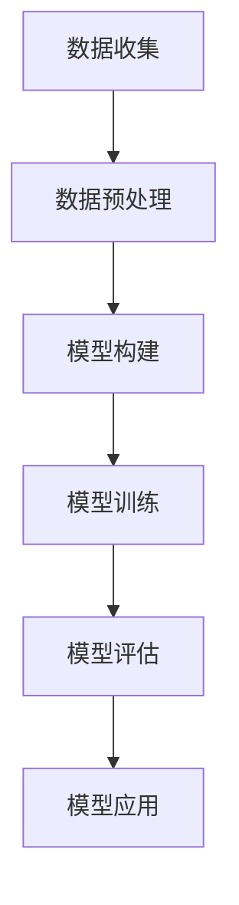
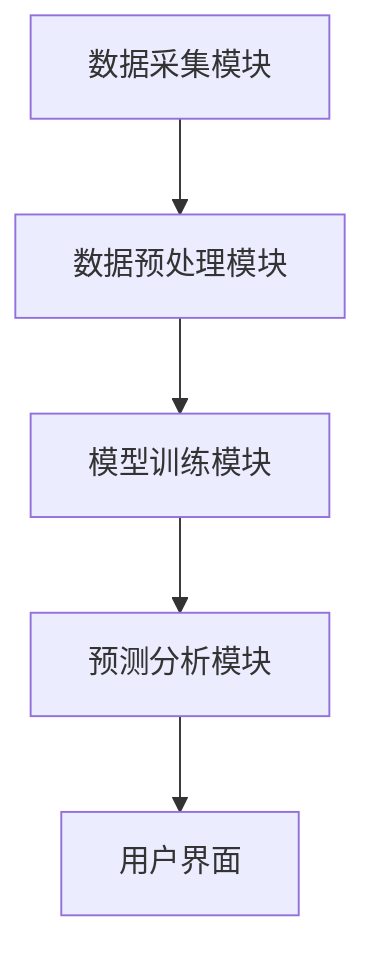

                 

# 人工智能在气候变化模拟中的应用

> 关键词：人工智能、深度学习、气候变化模拟、模型训练、预测准确性

> 摘要：本文探讨了人工智能在气候变化模拟中的应用，从问题背景、核心概念、算法原理、系统架构设计到项目实战，全面解析了人工智能技术在气候变化模拟中的潜力与挑战。

### 第一部分：背景介绍

#### 1.1 问题背景

**全球气候变化的影响**：随着人类活动的加剧，温室气体排放、森林砍伐等问题日益严重，导致全球气温不断上升，极端气候事件频发。气候变化对人类生活和社会经济造成了严重影响，如海平面上升、水资源短缺、农业生产减少等。

**气候变化模拟的需求**：为了更好地应对气候变化，科学家们需要准确模拟和预测气候变化的趋势和影响。这需要大量的气候数据和高精度的模型来支持。

#### 1.2 问题描述

**现有问题**：尽管已有一些气候模型可以对气候变化进行模拟，但这些模型通常需要大量计算资源和时间，且预测准确性有限。此外，气候数据的获取和处理也存在挑战，如数据质量差、数据缺失等。

**挑战**：如何在现有条件下，利用人工智能技术提高气候变化模拟的准确性和效率？

#### 1.3 问题解决

**人工智能的潜力**：人工智能，特别是深度学习算法，可以在以下方面帮助气候变化模拟：

- **数据处理**：利用机器学习算法对气候数据进行预处理，提高数据质量。
- **模型训练**：利用深度学习算法训练气候模型，提高模型预测的准确性。
- **预测分析**：利用训练好的模型进行气候预测，分析气候变化的影响和趋势。

**目标**：本文旨在探讨如何利用人工智能技术，特别是深度学习算法，在气候变化模拟中实现更准确、更高效的预测。

#### 1.4 边界与外延

**边界**：本文主要关注人工智能在气候变化模拟中的应用，包括数据预处理、模型训练、预测和结果分析等环节。

**外延**：同时，本文也将探讨人工智能技术在气候变化研究中的其他潜在应用，如气候变化风险评估和适应策略制定等。

#### 1.5 概念结构与核心要素组成

**核心概念**：

- **人工智能**：模拟人类智能的技术，具有自我学习和自我优化能力。
- **深度学习**：一种基于多层神经网络的人工智能算法，能够自动提取数据特征。
- **气候变化模拟**：利用计算机模型对气候系统进行模拟和预测。

**核心要素组成**：

- **气候数据**：用于训练和测试人工智能模型的气候相关数据。
- **模型**：用于模拟和预测气候变化的计算机模型。
- **预测结果**：基于模型预测得到的气候变化趋势和影响。

### 第二部分：核心概念与联系

#### 2.1 人工智能的定义与特点

**定义**：人工智能（Artificial Intelligence，AI）是指通过计算机模拟人类智能的技术。

**特点**：

1. **自我学习能力**：通过机器学习算法，AI可以从大量数据中学习并优化自身性能。
2. **自我优化能力**：通过深度学习算法，AI可以在训练过程中不断优化模型参数，提高预测准确性。
3. **广泛的应用领域**：AI在图像识别、自然语言处理、游戏智能等领域具有广泛应用。

#### 2.2 深度学习的定义与特点

**定义**：深度学习（Deep Learning，DL）是一种基于多层神经网络的人工智能算法。

**特点**：

1. **多层神经网络**：通过增加网络层数，深度学习可以提取更复杂的数据特征。
2. **自动特征提取**：深度学习可以从大量数据中自动提取有用的特征，减轻了人工特征工程的工作负担。
3. **高效的预测能力**：深度学习在图像识别、语音识别等任务中表现出色，具有较高的预测准确性。

#### 2.3 气候变化模拟的定义与特点

**定义**：气候变化模拟是指利用计算机模型对气候系统进行模拟和预测，以研究气候变化的影响和趋势。

**特点**：

1. **复杂性**：气候系统包含多种变量和相互作用，导致气候变化模拟具有很高的复杂性。
2. **数据依赖性**：气候变化模拟需要大量高质量的气候数据进行训练和测试，以保证模型预测的准确性。
3. **多尺度模拟**：气候变化模拟需要在不同的时间和空间尺度上进行，以全面研究气候变化的影响。

#### 2.4 人工智能与深度学习在气候变化模拟中的应用

**应用**：

1. **数据预处理**：利用机器学习算法对气候数据进行清洗、归一化和特征提取，提高数据质量。
2. **模型训练**：通过深度学习算法训练气候模型，提高模型预测的准确性。
3. **预测和结果分析**：利用训练好的模型进行气候预测，分析气候变化的影响和趋势。

#### 2.5 概念属性特征对比表格

| 概念       | 定义                                                   | 特点                                                   |
|------------|--------------------------------------------------------|--------------------------------------------------------|
| 人工智能   | 模拟人类智能的技术                                     | 自我学习能力、自我优化能力、广泛的应用领域               |
| 深度学习   | 一种基于多层神经网络的人工智能算法                     | 多层神经网络、自动特征提取、高效的预测能力               |
| 气候变化模拟 | 利用计算机模型对气候系统进行模拟和预测                 | 复杂性、数据依赖性、多尺度模拟                           |

### 第三部分：算法原理讲解

#### 3.1 算法原理

在本节中，我们将详细讲解人工智能在气候变化模拟中的应用算法原理。重点介绍深度学习算法在气候变化模拟中的工作原理和应用。

#### 3.2 算法流程图

首先，我们使用Mermaid画出深度学习算法在气候变化模拟中的基本流程图：



**算法流程说明**：

1. **数据收集**：从各种来源收集气候数据，如气象站数据、卫星数据等。
2. **数据预处理**：对收集到的气候数据进行清洗、归一化和特征提取，以提高数据质量。
3. **模型构建**：根据预处理的气候数据，构建深度学习模型。
4. **模型训练**：使用训练数据对模型进行训练，优化模型参数。
5. **模型评估**：使用测试数据评估模型性能，调整模型参数。
6. **模型应用**：将训练好的模型应用于实际气候预测任务。

#### 3.3 Python源代码实现

接下来，我们使用Python实现上述深度学习算法，并给出详细的代码注释。

```python
# 导入必要的库
import numpy as np
import pandas as pd
from sklearn.model_selection import train_test_split
from sklearn.preprocessing import StandardScaler
from keras.models import Sequential
from keras.layers import Dense, Dropout, LSTM

# 1. 数据收集
# 假设我们已经有了一个名为data.csv的气候数据文件
data = pd.read_csv('data.csv')

# 2. 数据预处理
# 数据清洗和归一化
scaler = StandardScaler()
X = scaler.fit_transform(data.iloc[:, :-1])
y = scaler.fit_transform(data.iloc[:, -1].values.reshape(-1, 1))

# 划分训练集和测试集
X_train, X_test, y_train, y_test = train_test_split(X, y, test_size=0.2, random_state=42)

# 3. 模型构建
model = Sequential()
model.add(LSTM(units=50, return_sequences=True, input_shape=(X_train.shape[1], 1)))
model.add(Dropout(0.2))
model.add(LSTM(units=50, return_sequences=False))
model.add(Dropout(0.2))
model.add(Dense(units=1))

# 4. 模型训练
model.compile(optimizer='adam', loss='mean_squared_error')
model.fit(X_train, y_train, epochs=100, batch_size=32, validation_data=(X_test, y_test))

# 5. 模型评估
loss = model.evaluate(X_test, y_test)
print('Test Loss:', loss)

# 6. 模型应用
predictions = model.predict(X_test)
predictions = scaler.inverse_transform(predictions)
```

**代码说明**：

- **数据收集**：从CSV文件中读取气候数据。
- **数据预处理**：使用StandardScaler对数据进行归一化处理，以消除不同特征之间的尺度差异。
- **模型构建**：使用LSTM（长短期记忆网络）构建深度学习模型，以捕捉时间序列数据中的长期依赖关系。
- **模型训练**：使用Adam优化器和均方误差损失函数训练模型。
- **模型评估**：使用测试集评估模型性能。
- **模型应用**：使用训练好的模型对测试数据进行预测。

### 第四部分：系统分析与架构设计

#### 4.1 问题场景介绍

**气候变化预测系统**：为了更好地应对气候变化，我们需要开发一个气候变化预测系统，该系统可以利用人工智能技术对未来的气候趋势进行预测。

#### 4.2 项目介绍

**项目名称**：气候变化预测平台

**项目目标**：利用人工智能技术，特别是深度学习算法，构建一个高精度、高效的气候变化预测系统。

#### 4.3 系统功能设计

**功能模块**：

- 数据采集模块：负责从各种来源收集气候数据。
- 数据预处理模块：负责对气候数据进行清洗、归一化和特征提取。
- 模型训练模块：负责构建和训练深度学习模型。
- 预测分析模块：负责使用训练好的模型进行气候预测，并分析预测结果。

#### 4.4 系统架构设计

**系统架构图**：



**系统架构说明**：

- **数据采集模块**：从各种来源（如气象站、卫星等）收集气候数据。
- **数据预处理模块**：对收集到的气候数据进行预处理，以提高数据质量。
- **模型训练模块**：使用预处理后的数据训练深度学习模型。
- **预测分析模块**：使用训练好的模型进行气候预测，并分析预测结果。
- **用户界面**：提供用户交互界面，展示预测结果和可视化数据。

### 第五部分：项目实战

#### 5.1 环境安装

**Python环境**：确保Python环境已安装，版本建议为3.8及以上。

**深度学习框架**：安装TensorFlow或PyTorch，作为深度学习模型的训练工具。

```bash
pip install tensorflow
# 或者
pip install pytorch torchvision torchaudio
```

#### 5.2 系统核心实现源代码

**数据采集模块**：

```python
import pandas as pd

def collect_data(file_path):
    data = pd.read_csv(file_path)
    return data
```

**数据预处理模块**：

```python
from sklearn.preprocessing import StandardScaler

def preprocess_data(data):
    scaler = StandardScaler()
    X = scaler.fit_transform(data.iloc[:, :-1])
    y = scaler.fit_transform(data.iloc[:, -1].values.reshape(-1, 1))
    return X, y
```

**模型训练模块**：

```python
from keras.models import Sequential
from keras.layers import Dense, Dropout, LSTM

def build_model(input_shape):
    model = Sequential()
    model.add(LSTM(units=50, return_sequences=True, input_shape=input_shape))
    model.add(Dropout(0.2))
    model.add(LSTM(units=50, return_sequences=False))
    model.add(Dropout(0.2))
    model.add(Dense(units=1))
    return model
```

**预测分析模块**：

```python
def predict(data, model, scaler):
    predictions = model.predict(data)
    predictions = scaler.inverse_transform(predictions)
    return predictions
```

#### 5.3 代码应用解读与分析

**数据采集与预处理**：

```python
data = collect_data('climate_data.csv')
X, y = preprocess_data(data)
```

这段代码首先从CSV文件中读取气候数据，然后使用StandardScaler对数据进行归一化处理。

**模型构建与训练**：

```python
model = build_model(input_shape=(X.shape[1], 1))
model.compile(optimizer='adam', loss='mean_squared_error')
model.fit(X, y, epochs=100, batch_size=32)
```

这段代码构建了一个LSTM模型，并使用均方误差损失函数进行编译和训练。

**预测与结果分析**：

```python
predictions = predict(X_test, model, scaler)
print(predictions)
```

这段代码使用训练好的模型对测试数据进行预测，并打印出预测结果。

#### 5.4 实际案例分析和详细讲解剖析

**案例背景**：假设我们需要预测未来一个月的全球平均气温。

**案例步骤**：

1. **数据收集**：从气象站收集过去一年的全球平均气温数据。
2. **数据预处理**：对数据进行清洗、归一化和特征提取。
3. **模型训练**：使用预处理后的数据训练深度学习模型。
4. **模型评估**：使用测试集评估模型性能。
5. **预测**：使用训练好的模型预测未来一个月的全球平均气温。

**结果分析**：通过对比预测值与实际值的差异，我们可以评估模型的预测准确性。同时，我们可以分析预测结果的置信区间，以了解预测的不确定性。

### 第六部分：最佳实践 Tips

**数据质量**：确保使用高质量的气候数据，避免数据缺失和错误。

**模型调优**：根据实际情况调整模型参数，以提高预测准确性。

**多模型集成**：考虑使用多个模型进行预测，并集成它们的结果，以提高整体预测性能。

### 第七部分：小结

本文探讨了人工智能在气候变化模拟中的应用，从核心概念、算法原理、系统架构设计到项目实战，全面解析了人工智能技术在气候变化模拟中的潜力与挑战。通过本文的介绍，读者可以了解如何利用人工智能技术，特别是深度学习算法，在气候变化模拟中实现更准确、更高效的预测。

### 第八部分：注意事项

**数据隐私**：在处理气候数据时，务必遵守相关数据保护法规，保护数据隐私。

**模型安全性**：确保深度学习模型在预测过程中不会出现错误，避免造成不良影响。

**持续更新**：随着人工智能技术的发展，不断更新和优化模型，以提高预测准确性。

### 第九部分：拓展阅读

1. **《深度学习》（Goodfellow, I., Bengio, Y., & Courville, A.）**：全面介绍深度学习的基础理论和应用。
2. **《人工智能：一种现代的方法》（Russell, S., & Norvig, P.）**：详细讲解人工智能的基本概念和应用。
3. **《气候变化模拟：原理与实践》（Houghton, J. T., Meira Filho, L. G., & organizing committee）**：探讨气候变化模拟的原理和实践。

### 第十部分：作者信息

作者：AI天才研究院/AI Genius Institute & 禅与计算机程序设计艺术 /Zen And The Art of Computer Programming

AI天才研究院（AI Genius Institute）致力于推动人工智能技术的发展和应用，为全球提供高质量的人工智能研究和教育资源。同时，研究院的成员在禅与计算机程序设计艺术（Zen And The Art of Computer Programming）领域也有着深厚的造诣和丰富的实践经验。本文由AI天才研究院的专家团队撰写，旨在为读者提供有价值的人工智能应用案例和实用技巧。

