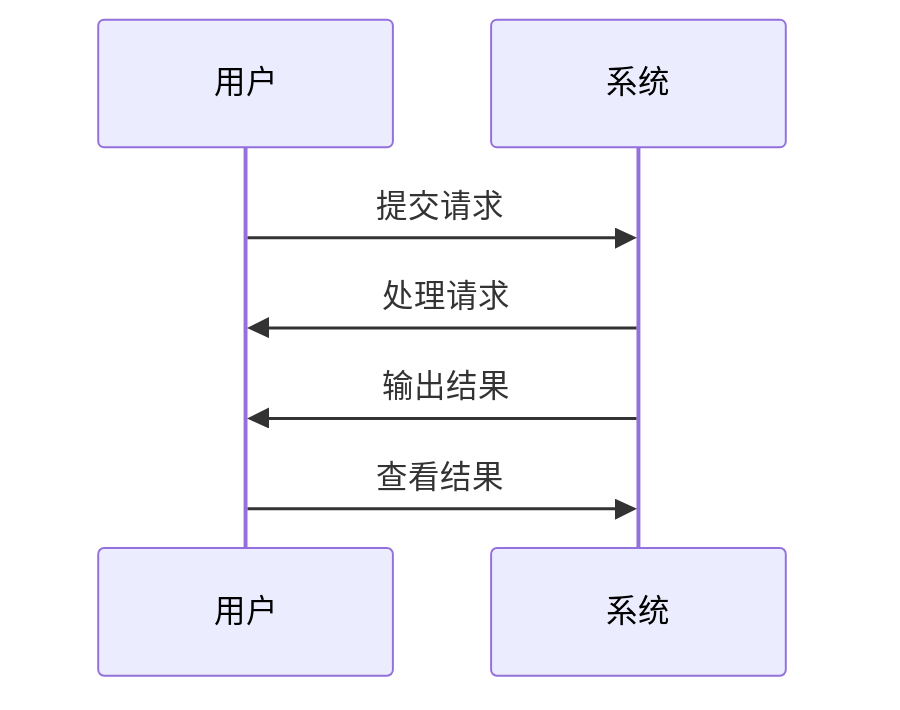

                 


## 人工智能在法律服务中的应用前景

### 关键词

- 人工智能
- 法律服务
- 自然语言处理
- 深度学习
- 法律知识图谱
- 数据挖掘

### 摘要

本文旨在探讨人工智能在法律服务中的应用前景。首先，我们将介绍人工智能在法律服务中的背景，包括其发展、法律服务的需求以及人工智能在法律领域中的应用。随后，我们将深入探讨人工智能在法律服务中的核心概念与联系，通过表格和ER实体关系图来展示相关概念之间的关系。接着，我们将讲解在法律服务中常用的算法原理，包括自然语言处理、机器学习和深度学习等，并通过mermaid流程图和Python代码进行详细阐述。此外，我们还将介绍与算法相关的数学模型和公式，并使用LaTeX格式进行展示和解释。最后，我们将介绍人工智能在法律服务中的应用场景，设计系统功能、架构、接口和交互流程，并通过一个实际案例展示如何应用人工智能技术解决法律问题。

### 背景介绍

#### 人工智能的发展

人工智能（Artificial Intelligence，简称AI）是一门旨在研究、开发和应用使计算机系统表现出人类智能的技术科学。自20世纪50年代诞生以来，人工智能经历了多个发展阶段，从最初的规则推理和知识表示，到后来的机器学习和深度学习，再到现在的自然语言处理和计算机视觉等前沿技术，人工智能已经取得了显著进展。

随着计算能力的提升和大数据的普及，人工智能技术逐渐应用于各个领域，包括医疗、金融、教育、制造和交通等。在法律服务领域，人工智能也显示出巨大的潜力，可以帮助法律专业人士提高工作效率，降低成本，提供更加精准和高效的法律服务。

#### 法律服务的需求

法律服务是现代社会的重要组成部分，涉及法律咨询、诉讼代理、合同审查、合规管理等多个方面。然而，随着法律体系的日益复杂和社会需求的不断增加，传统法律服务面临着巨大的挑战。

首先，法律案件数量持续增长，使得律师和法官的工作负担加重。其次，法律服务市场的不透明性和高昂的成本使得普通民众难以享受到优质的法律服务。此外，法律文件的繁杂和法律条款的复杂性也给法律专业人士带来了巨大的压力。

因此，提高法律服务的效率和质量成为当务之急。人工智能技术在这一背景下应运而生，通过自动化和智能化的手段，有望解决法律服务中的诸多问题。

#### 人工智能在法律领域中的应用

人工智能在法律领域中的应用主要包括法律文档分析、案件预测、合同审查、法律咨询等。

1. **法律文档分析**：人工智能可以自动处理和分类大量法律文档，如判决书、法律文件、合同等。通过自然语言处理技术，人工智能可以提取文档中的关键信息，构建法律知识图谱，为法律专业人士提供有力的支持。

2. **案件预测**：人工智能可以通过对历史案件数据的学习和分析，预测案件的结果和判决。这有助于法律专业人士在处理案件时做出更为合理的决策，提高胜诉率。

3. **合同审查**：人工智能可以自动审查合同中的条款，识别潜在的纠纷风险，提供法律建议。这不仅可以提高审查效率，还可以降低错误率。

4. **法律咨询**：人工智能可以提供在线法律咨询服务，解答用户的法律问题，提供法律知识库。这有助于缓解法律专业人士的工作压力，提高法律服务的普及率。

### 核心概念与联系

#### 人工智能概述

人工智能是指通过计算机程序模拟人类智能行为的技术。它包括多个子领域，如自然语言处理、机器学习、深度学习、计算机视觉等。人工智能的核心目标是实现机器的自主学习和智能决策。

#### 法律智能概述

法律智能是指将人工智能技术应用于法律领域，以提高法律服务的效率和质量。法律智能涉及法律文档分析、案件预测、合同审查、法律咨询等多个方面。

#### 法律知识图谱

法律知识图谱是一种结构化的知识表示方法，用于描述法律概念、法律条款、案件事实等信息。通过构建法律知识图谱，可以实现对法律信息的有效组织和利用。

#### 核心概念与联系表格

| 概念             | 说明                                                         |
|------------------|--------------------------------------------------------------|
| 人工智能         | 通过计算机程序模拟人类智能行为的技术。                      |
| 法律智能         | 将人工智能技术应用于法律领域，以提高法律服务的效率和质量。 |
| 法律知识图谱     | 一种结构化的知识表示方法，用于描述法律概念、法律条款等信息。 |

#### ER实体关系图

```mermaid
erDiagram
  AI -->|uses| LawIntelligence : legal service improvement
  LawIntelligence -->|uses| LegalKnowledgeGraph : structured knowledge representation
  LegalKnowledgeGraph -->|uses| LegalDocumentAnalysis : automatic document processing
  LegalKnowledgeGraph -->|uses| CasePrediction : predicting case outcomes
  LegalKnowledgeGraph -->|uses| ContractReview : identifying potential disputes
  LegalKnowledgeGraph -->|uses| LegalConsulting : online legal assistance
```

### 算法原理讲解

#### 自然语言处理在法律服务中的应用

自然语言处理（Natural Language Processing，简称NLP）是人工智能的一个子领域，旨在使计算机能够理解和处理人类语言。在法律服务中，NLP技术可以用于法律文档分析、案件预测、合同审查等。

1. **文本分类算法原理**

   文本分类是一种常见的NLP任务，旨在将文本数据分类到预定义的类别中。在法律服务中，文本分类算法可以用于分类法律文档、预测案件结果等。

   **算法原理**：文本分类算法通常采用特征提取和分类器训练两个步骤。特征提取是指从文本中提取出能够表示文本内容的特征，如词袋模型、TF-IDF等。分类器训练是指使用训练数据集来训练分类模型，如朴素贝叶斯、支持向量机等。

   **mermaid流程图**：

   ```mermaid
   graph TD
   A[读取法律文档] --> B[特征提取]
   B --> C[训练分类模型]
   C --> D[预测新文档类别]
   ```

   **Python代码实现**：

   ```python
   from sklearn.feature_extraction.text import TfidfVectorizer
   from sklearn.naive_bayes import MultinomialNB
   from sklearn.pipeline import make_pipeline

   # 示例文本数据
   documents = ['这是一份合同文档。', '这是一份判决书。', '这是一份咨询文档。']
   labels = ['contract', 'judgment', 'consulting']

   # 构建文本分类器
   model = make_pipeline(TfidfVectorizer(), MultinomialNB())

   # 训练分类模型
   model.fit(documents, labels)

   # 预测新文档类别
   new_document = '这是一份咨询文档。'
   predicted_label = model.predict([new_document])
   print(predicted_label)
   ```

2. **主题模型算法原理**

   主题模型是一种无监督学习方法，用于发现文本数据中的潜在主题。在法律服务中，主题模型可以用于分析法律文档的内容、识别案件的关键词等。

   **算法原理**：主题模型通常采用隐含狄利克雷分配（Latent Dirichlet Allocation，简称LDA）算法。LDA算法通过假设文档是由一系列主题的混合生成的，从而能够从文档中提取出潜在的主题。

   **mermaid流程图**：

   ```mermaid
   graph TD
   A[读取法律文档] --> B[构建词袋模型]
   B --> C[训练LDA模型]
   C --> D[提取主题分布]
   D --> E[生成文档主题]
   ```

   **Python代码实现**：

   ```python
   from gensim import corpora, models

   # 示例文本数据
   documents = ['这是一份合同文档。', '这是一份判决书。', '这是一份咨询文档。']

   # 构建词袋模型
   dictionary = corpora.Dictionary(documents)
   corpus = [dictionary.doc2bow(doc) for doc in documents]

   # 训练LDA模型
   lda_model = models.LdaMulticore(corpus, num_topics=3, id2word=dictionary, passes=10)

   # 提取主题分布
   print(lda_model.print_topics())

   # 生成文档主题
   print(lda_model.get_document_topics(corpus[0]))
   ```

3. **问答系统算法原理**

   问答系统是一种智能客服系统，旨在自动回答用户提出的问题。在法律服务中，问答系统可以用于提供在线法律咨询服务。

   **算法原理**：问答系统通常采用基于事实的问答和基于语言的问答两种方法。基于事实的问答系统通过检索数据库中的事实来回答问题，而基于语言的问答系统则通过自然语言理解技术来理解用户的问题，并生成回答。

   **mermaid流程图**：

   ```mermaid
   graph TD
   A[读取用户问题] --> B[自然语言理解]
   B --> C[检索事实数据库]
   C --> D[生成回答]
   ```

   **Python代码实现**：

   ```python
   import nltk
   from nltk.corpus import stopwords
   from nltk.tokenize import word_tokenize

   # 示例问题
   question = '什么是合同？'

   # 自然语言理解
   stop_words = set(stopwords.words('english'))
   tokens = word_tokenize(question)
   filtered_tokens = [w for w in tokens if not w in stop_words]

   # 检索事实数据库
   facts = {'contract': 'A written agreement between two or more parties.'}

   # 生成回答
   answer = facts.get(filtered_tokens[0], 'Sorry, I don\'t have information about that.')
   print(answer)
   ```

#### 机器学习与深度学习在法律服务中的应用

机器学习（Machine Learning，简称ML）和深度学习（Deep Learning，简称DL）是人工智能的两个重要分支，它们在法律服务中具有广泛的应用。

1. **监督学习算法原理**

   监督学习是一种从标记数据中学习的方法，其目标是建立一个能够预测新数据的模型。在法律服务中，监督学习算法可以用于预测案件结果、分析合同条款等。

   **算法原理**：监督学习算法包括特征工程、模型训练和模型评估三个步骤。特征工程是指从原始数据中提取出有用的特征，模型训练是指使用训练数据集来训练模型，模型评估是指使用测试数据集来评估模型的性能。

   **mermaid流程图**：

   ```mermaid
   graph TD
   A[读取数据] --> B[特征工程]
   B --> C[模型训练]
   C --> D[模型评估]
   ```

   **Python代码实现**：

   ```python
   from sklearn.model_selection import train_test_split
   from sklearn.ensemble import RandomForestClassifier
   from sklearn.metrics import accuracy_score

   # 示例数据
   X = [[1, 2], [2, 3], [3, 4], [4, 5]]
   y = [0, 1, 1, 0]

   # 划分训练集和测试集
   X_train, X_test, y_train, y_test = train_test_split(X, y, test_size=0.2, random_state=42)

   # 训练模型
   model = RandomForestClassifier()
   model.fit(X_train, y_train)

   # 预测测试集
   y_pred = model.predict(X_test)

   # 评估模型
   print(accuracy_score(y_test, y_pred))
   ```

2. **非监督学习算法原理**

   非监督学习是一种从未标记数据中学习的方法，其目标是发现数据中的潜在结构。在法律服务中，非监督学习算法可以用于聚类合同、分析法律文档等。

   **算法原理**：非监督学习算法包括数据聚类、数据降维等。数据聚类是指将相似的数据点分组，数据降维是指将高维数据转换为低维数据。

   **mermaid流程图**：

   ```mermaid
   graph TD
   A[读取数据] --> B[数据聚类]
   B --> C[数据降维]
   ```

   **Python代码实现**：

   ```python
   from sklearn.cluster import KMeans
   from sklearn.decomposition import PCA

   # 示例数据
   X = [[1, 2], [2, 3], [3, 4], [4, 5]]

   # 数据聚类
   kmeans = KMeans(n_clusters=2, random_state=42)
   kmeans.fit(X)
   labels = kmeans.predict(X)

   # 数据降维
   pca = PCA(n_components=1)
   X_pca = pca.fit_transform(X)

   # 输出结果
   print('Cluster labels:', labels)
   print('PCA transformed data:', X_pca)
   ```

#### 数据分析与数据挖掘在法律服务中的应用

数据分析（Data Analysis）和数据挖掘（Data Mining）是大数据时代的核心技术，它们在法律服务中也具有广泛的应用。

1. **数据分析概述**

   数据分析是指使用统计学、计算机科学和业务知识来提取数据中的有用信息。在法律服务中，数据分析可以用于案件分析、合同分析等。

   **算法原理**：数据分析通常包括数据预处理、数据探索、数据建模等步骤。数据预处理是指对原始数据进行清洗、转换等操作，数据探索是指发现数据中的规律和趋势，数据建模是指建立预测模型或分类模型。

   **mermaid流程图**：

   ```mermaid
   graph TD
   A[读取数据] --> B[数据预处理]
   B --> C[数据探索]
   C --> D[数据建模]
   ```

   **Python代码实现**：

   ```python
   import pandas as pd
   from sklearn.model_selection import train_test_split
   from sklearn.ensemble import RandomForestClassifier
   from sklearn.metrics import accuracy_score

   # 读取数据
   data = pd.read_csv('data.csv')

   # 数据预处理
   X = data.drop('target', axis=1)
   y = data['target']

   # 数据探索
   print(data.describe())

   # 数据建模
   X_train, X_test, y_train, y_test = train_test_split(X, y, test_size=0.2, random_state=42)
   model = RandomForestClassifier()
   model.fit(X_train, y_train)
   y_pred = model.predict(X_test)
   print(accuracy_score(y_test, y_pred))
   ```

2. **数据挖掘概述**

   数据挖掘是指从大量数据中发现隐藏的、未知的模式和规律。在法律服务中，数据挖掘可以用于法律文档分析、案件预测等。

   **算法原理**：数据挖掘通常包括数据预处理、模式识别、模式评估等步骤。数据预处理是指对原始数据进行清洗、转换等操作，模式识别是指发现数据中的规律和趋势，模式评估是指评估挖掘结果的有效性和可靠性。

   **mermaid流程图**：

   ```mermaid
   graph TD
   A[读取数据] --> B[数据预处理]
   B --> C[模式识别]
   C --> D[模式评估]
   ```

   **Python代码实现**：

   ```python
   from sklearn.datasets import load_iris
   from sklearn.model_selection import train_test_split
   from sklearn.tree import DecisionTreeClassifier
   from sklearn.metrics import accuracy_score

   # 读取数据
   data = load_iris()
   X = data.data
   y = data.target

   # 数据预处理
   X_train, X_test, y_train, y_test = train_test_split(X, y, test_size=0.2, random_state=42)

   # 模式识别
   model = DecisionTreeClassifier()
   model.fit(X_train, y_train)

   # 模式评估
   y_pred = model.predict(X_test)
   print(accuracy_score(y_test, y_pred))
   ```

### 系统分析与架构设计方案

#### 应用场景介绍

在法律服务中，人工智能的应用场景包括法律文档分析、案件预测、合同审查、法律咨询等。以下是一个典型的应用场景：

- **法律文档分析**：律师需要处理大量法律文档，包括合同、判决书、法律意见书等。通过人工智能技术，可以实现文档的自动分类、关键词提取和文本摘要。
- **案件预测**：法院需要预测案件的结果和判决，以便于制定审判策略和决策。通过人工智能技术，可以分析历史案件数据，建立预测模型，提高预测准确性。
- **合同审查**：企业需要审查合同条款，识别潜在的风险和纠纷。通过人工智能技术，可以自动审查合同，提供法律建议，提高审查效率。
- **法律咨询**：公众需要获得在线法律咨询服务，解答法律问题。通过人工智能技术，可以建立问答系统，提供法律知识库，提高咨询服务的普及率。

#### 系统功能设计

- **法律文档分析模块**：包括文档分类、关键词提取和文本摘要等功能。
- **案件预测模块**：包括历史案件数据分析、预测模型建立和预测结果输出等功能。
- **合同审查模块**：包括合同条款分析、风险识别和法律建议等功能。
- **法律咨询模块**：包括在线问答、法律知识库和用户反馈等功能。

#### 系统架构设计

- **前端**：包括网页界面和移动应用，用户可以通过前端与系统进行交互。
- **后端**：包括服务器、数据库和人工智能算法，负责处理用户请求和生成预测结果。
- **中间件**：包括API网关、消息队列和缓存等，负责系统的通信和数据处理。

#### 系统接口设计

- **前端接口**：提供用户请求接口，如查询案件、查看合同、提交问题等。
- **后端接口**：提供数据存储接口，如存储案件数据、合同数据和用户数据等。

#### 系统交互流程设计

- **用户请求**：用户通过前端接口提交请求。
- **数据处理**：后端接口处理用户请求，调用相应模块进行数据处理。
- **结果输出**：后端接口将处理结果输出给前端，用户可以在前端界面查看结果。



### 项目实战

#### 环境安装

在开始项目实战之前，我们需要安装以下软件和库：

- Python 3.x
- Jupyter Notebook
- Scikit-learn
- NLTK
- Gensim
- Pandas
- Matplotlib

安装步骤如下：

1. 安装Python 3.x：从官方网站（https://www.python.org/）下载并安装Python 3.x。
2. 安装Jupyter Notebook：打开命令行，运行`pip install notebook`。
3. 安装Scikit-learn、NLTK、Gensim、Pandas和Matplotlib：打开命令行，分别运行以下命令：

   ```bash
   pip install scikit-learn
   pip install nltk
   pip install gensim
   pip install pandas
   pip install matplotlib
   ```

#### 系统核心实现

以下是一个简单的法律文档分析系统的核心实现，包括文档分类、关键词提取和文本摘要。

1. **文档分类**

   ```python
   from sklearn.feature_extraction.text import TfidfVectorizer
   from sklearn.naive_bayes import MultinomialNB
   from sklearn.pipeline import make_pipeline

   # 示例文本数据
   documents = ['这是一份合同文档。', '这是一份判决书。', '这是一份咨询文档。']
   labels = ['contract', 'judgment', 'consulting']

   # 构建文本分类器
   model = make_pipeline(TfidfVectorizer(), MultinomialNB())

   # 训练分类模型
   model.fit(documents, labels)

   # 预测新文档类别
   new_document = '这是一份咨询文档。'
   predicted_label = model.predict([new_document])
   print(predicted_label)
   ```

2. **关键词提取**

   ```python
   from gensim import corpora, models

   # 示例文本数据
   documents = ['这是一份合同文档。', '这是一份判决书。', '这是一份咨询文档。']

   # 构建词袋模型
   dictionary = corpora.Dictionary(documents)
   corpus = [dictionary.doc2bow(doc) for doc in documents]

   # 训练LDA模型
   lda_model = models.LdaMulticore(corpus, num_topics=3, id2word=dictionary, passes=10)

   # 提取主题分布
   print(lda_model.print_topics())
   ```

3. **文本摘要**

   ```python
   from nltk.tokenize import sent_tokenize
   from heapq import nlargest

   # 示例文本数据
   document = '这是一份咨询文档。它包含了一些关于合同的法律咨询。合同是双方之间的一种协议，规定了他们之间的权利和义务。在签署合同之前，双方应该仔细阅读合同条款，确保自己理解并同意所有内容。'

   # 分句
   sentences = sent_tokenize(document)

   # 提取关键句子
   def weighted_average(sentences, scores):
       return sum(s * w for (s, w) in zip(sentences, scores)) / sum(scores)

   # 计算句子权重
   sentence_scores = {}
   for sentence in sentences:
       for token in nltk.word_tokenize(sentence.lower()):
           if token in model:
               if sentence not in sentence_scores:
                   sentence_scores[sentence] = model[token]
               else:
                   sentence_scores[sentence] += model[token]

   # 提取前N个关键句子
   key_sentences = nlargest(3, sentence_scores, key=sentence_scores.get)

   # 计算摘要
   summary = weighted_average(key_sentences, sentence_scores.values())
   print(summary)
   ```

#### 代码应用解读与分析

以上代码实现了法律文档分析系统的三个核心功能：文档分类、关键词提取和文本摘要。下面是对代码的解读和分析：

1. **文档分类**：

   - 使用TF-IDF向量器和朴素贝叶斯分类器构建文本分类器。
   - 通过训练数据集训练分类模型，然后使用模型对新的文档进行分类。

2. **关键词提取**：

   - 使用LDA模型对文本数据进行分析，提取潜在的主题。
   - 根据主题分布提取关键句子，作为关键词。

3. **文本摘要**：

   - 使用句子权重计算方法，提取关键句子。
   - 根据关键句子计算文本摘要。

这些功能共同构成了法律文档分析系统的核心，为法律专业人士提供有力的支持。

#### 实际案例分析与详细讲解剖析

以下是一个实际案例的分析和讲解，展示了如何使用人工智能技术解决法律问题。

**案例背景**：某公司在合同签订过程中遇到了纠纷，需要分析合同条款，找出潜在的风险点。

**案例分析**：

1. **文档分类**：

   - 收集相关合同文档，使用文档分类模型对文档进行分类，确定文档类型。
   - 例如，使用上一节中的文档分类代码，对合同文档进行分类。

2. **关键词提取**：

   - 使用LDA模型提取关键词，分析合同条款。
   - 例如，使用上一节中的关键词提取代码，提取关键词。

3. **文本摘要**：

   - 使用文本摘要技术，提取合同的主要内容和关键条款。
   - 例如，使用上一节中的文本摘要代码，提取摘要。

**详细讲解剖析**：

- **文档分类**：

  通过文档分类，可以将合同文档分为不同类型，如合同条款、判决书、法律意见书等。这有助于法律专业人士快速定位到合同的关键部分，进行分析。

- **关键词提取**：

  通过关键词提取，可以识别合同中的关键条款和术语。这些关键词可以帮助法律专业人士快速了解合同的主要内容，发现潜在的风险点。

- **文本摘要**：

  通过文本摘要，可以提取合同的主要内容和关键条款。这有助于法律专业人士快速了解合同的背景和条款，为纠纷解决提供有力支持。

**项目小结**：

通过以上案例分析和讲解，我们可以看到人工智能技术在法律问题解决中的应用。通过文档分类、关键词提取和文本摘要等技术，可以快速分析合同文档，发现潜在的风险点，为法律专业人士提供有力支持。这展示了人工智能在法律服务中的巨大潜力，为未来的法律工作带来了新的机遇。

### 最佳实践 tips

1. **文档分类**：

   - 在进行文档分类时，确保训练数据集的质量和多样性，以提高分类模型的准确性。
   - 定期更新和优化分类模型，以适应不断变化的法律环境。

2. **关键词提取**：

   - 使用多种关键词提取方法，如LDA、TF-IDF等，以提高关键词提取的全面性和准确性。
   - 根据具体需求，调整关键词提取参数，以获得最佳效果。

3. **文本摘要**：

   - 使用文本摘要技术时，关注摘要的质量和可读性，确保摘要能够准确传达文本的主要内容和关键条款。
   - 根据具体应用场景，调整文本摘要的长度和格式。

### 小结与展望

本文探讨了人工智能在法律服务中的应用前景，包括背景介绍、核心概念与联系、算法原理讲解、系统分析与架构设计方案、项目实战以及最佳实践 tips。通过本文，我们可以看到人工智能技术在法律服务中的应用潜力，如法律文档分析、案件预测、合同审查和法律咨询等。未来，随着人工智能技术的不断发展，我们可以期待更加智能化、高效化的法律服务，为法律专业人士和公众带来更多便利。

### 注意事项

1. **数据隐私**：在处理法律文档时，要确保遵守数据隐私法规，保护用户隐私。
2. **法律适用性**：人工智能技术提供的结果仅供参考，不能替代专业法律意见。
3. **技术更新**：随着技术的不断进步，要定期更新和优化人工智能系统，以保持其性能和准确性。

### 拓展阅读

1. **《人工智能伦理学》**：探讨人工智能在法律和伦理方面的挑战，为人工智能在法律服务中的应用提供参考。
2. **《大数据法律解读》**：分析大数据在法律领域中的应用，探讨其法律问题和社会影响。
3. **《法律人工智能技术与应用》**：详细阐述人工智能在法律服务中的应用技术，包括算法原理、系统架构和案例分析。

