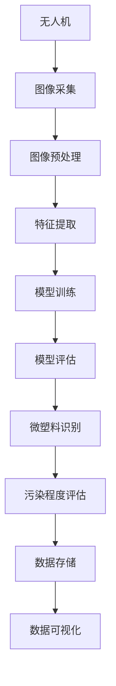
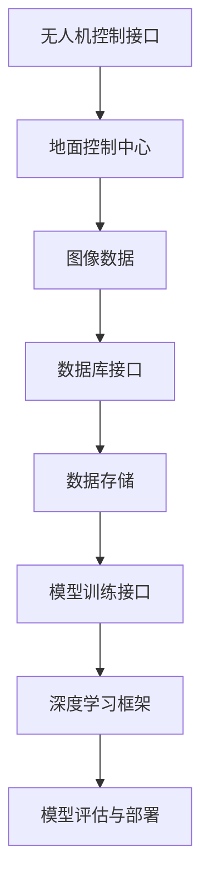
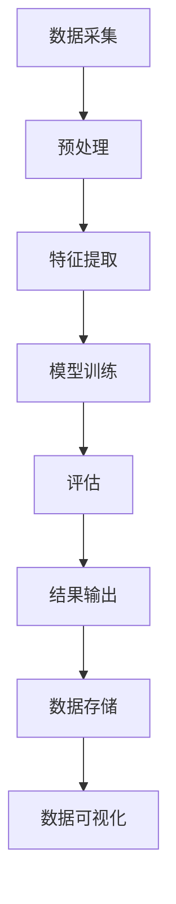

                 


### 人工智能在海洋微塑料污染追踪中的应用

> 关键词：人工智能，海洋微塑料，污染追踪，机器学习，深度学习，监测系统

> 摘要：随着人类活动的增加，海洋微塑料污染成为一个全球性环境问题。本文探讨了人工智能技术在海洋微塑料污染追踪中的应用，包括数据采集、处理、分析及预测，以实现更高效、更精准的环境监测。通过介绍机器学习和深度学习算法在微塑料检测中的实现原理，并结合实际应用案例，展示了人工智能在解决海洋微塑料污染问题中的潜力和挑战。

## 第一部分：问题背景与核心概念

### 第1章：海洋微塑料污染概述

海洋微塑料污染是指直径小于5毫米的塑料颗粒在海洋中的积累和扩散。这些微塑料主要来源于生活污水、工业废水、渔业活动、海洋废弃物等。海洋微塑料的来源多样，如合成纤维、洗涤剂中的微塑料颗粒、化妆品中的塑料微粒等。它们在海洋环境中分解缓慢，持久存在，对海洋生态系统和人类健康构成严重威胁。

#### 1.1.1 海洋微塑料污染的起源与发展

微塑料污染问题起源于20世纪50年代，随着塑料工业的快速发展，大量的塑料废弃物被排放到海洋中。这些微塑料在海洋环境中逐渐分解成更小的颗粒，形成了微塑料污染。随着人们对环境问题的关注，海洋微塑料污染问题逐渐受到国际社会的重视，各国纷纷采取措施减少微塑料污染。

#### 1.1.2 海洋微塑料污染的分布与危害

海洋微塑料污染在全球范围内广泛分布，尤其集中在发达国家和沿海地区。海洋微塑料对海洋生物的生存和繁殖造成严重影响，许多海洋生物误食微塑料，导致消化系统阻塞、生殖系统紊乱等。此外，微塑料还可能携带有毒物质，通过食物链传递到人类体内，对人体健康产生潜在危害。

#### 1.1.3 海洋微塑料污染的影响因素

海洋微塑料污染的影响因素包括气候条件、海洋 currents、海洋生物活动等。气候条件如温度、湿度等会影响微塑料的分解速度和迁移路径。海洋 currents 则决定了微塑料的扩散范围和分布形态。海洋生物活动如浮游生物、鱼类等对微塑料的摄入和传播也起到重要作用。

#### 1.1.4 海洋微塑料污染的监测与研究现状

目前，海洋微塑料污染的监测与研究主要集中在数据采集、污染程度评估、污染源分析等方面。传统的监测方法主要依赖于人工采样和实验室分析，存在样本量有限、成本高昂等问题。随着人工智能技术的发展，越来越多的研究开始将人工智能应用于海洋微塑料污染的监测与分析，提高了监测的精度和效率。

### 第2章：人工智能核心概念与微塑料追踪技术

#### 2.1.1 人工智能基础

人工智能（Artificial Intelligence，AI）是模拟人类智能行为的计算机系统。它包括机器学习（Machine Learning，ML）、深度学习（Deep Learning，DL）等多种技术。机器学习是一种通过数据训练模型、实现自动学习和决策的技术。深度学习是机器学习的一种，采用多层神经网络结构，通过大规模数据进行训练，能够实现高度复杂的特征提取和模式识别。

#### 2.1.2 人工智能在环境监测中的应用

人工智能在环境监测中具有广泛的应用，如空气质量监测、水质监测、土壤污染监测等。人工智能技术能够实现实时数据采集、处理和分析，提高监测的精度和效率。在海洋微塑料污染监测中，人工智能技术同样具有巨大潜力。

#### 2.1.3 微塑料追踪技术的现状与挑战

现有的微塑料追踪技术主要依赖于人工采样和实验室分析。人工采样存在样本量有限、成本高昂等问题，实验室分析则需要大量时间和专业知识。随着人工智能技术的发展，基于机器学习和深度学习的微塑料追踪技术逐渐成为研究热点。然而，人工智能在微塑料追踪中的应用仍面临数据采集困难、算法复杂度高、模型泛化能力不足等挑战。

#### 2.1.4 人工智能与微塑料追踪技术的结合

人工智能与微塑料追踪技术的结合，能够实现高效、准确的海洋微塑料污染监测。通过机器学习和深度学习算法，可以对大量海洋微塑料数据进行分析，识别污染源、评估污染程度、预测污染趋势等。此外，人工智能技术还可以辅助设计微塑料监测系统，提高系统的自动化水平和监测精度。

## 第二部分：人工智能在海洋微塑料污染追踪中的应用原理

### 第3章：机器学习算法与微塑料检测

#### 3.1.1 数据预处理与特征提取

在海洋微塑料污染监测中，数据预处理和特征提取是关键步骤。数据预处理包括数据清洗、归一化、缺失值处理等，以消除噪声和异常值，提高数据质量。特征提取则是从原始数据中提取对微塑料检测具有区分性的特征，如颜色、形状、纹理等。

#### 3.1.2 机器学习算法原理

机器学习算法包括监督学习、无监督学习和强化学习等。在微塑料检测中，监督学习算法如支持向量机（SVM）、决策树（Decision Tree）、随机森林（Random Forest）等，通过已标记的数据训练模型，实现对未标记数据的分类。无监督学习算法如聚类分析（Clustering Analysis）、主成分分析（PCA）等，则主要用于数据降维和模式识别。

#### 3.1.3 微塑料检测算法的实现

基于机器学习算法的微塑料检测，可以通过以下步骤实现：

1. 数据采集：使用无人机、卫星遥感、浮标等设备收集海洋微塑料数据。
2. 数据预处理：清洗、归一化和缺失值处理等。
3. 特征提取：提取对微塑料检测具有区分性的特征。
4. 模型训练：选择合适的机器学习算法，对已标记的数据进行训练。
5. 模型评估：使用交叉验证、ROC曲线等评估模型性能。
6. 模型应用：将训练好的模型应用于未标记的数据，实现微塑料检测。

### 第4章：深度学习在海洋微塑料追踪中的应用

#### 4.1.1 深度学习基础

深度学习是一种基于多层神经网络的学习方法，能够自动提取数据的深层特征。在微塑料追踪中，深度学习算法如卷积神经网络（CNN）、递归神经网络（RNN）等，能够实现对大量复杂数据的建模和分析。

#### 4.1.2 卷积神经网络在微塑料识别中的应用

卷积神经网络（CNN）是一种特殊的神经网络，能够通过卷积层提取图像的局部特征。在海洋微塑料识别中，CNN可以用于图像分类和特征提取。通过训练CNN模型，可以实现对海洋微塑料图像的自动识别和分类。

#### 4.1.3 递归神经网络在微塑料追踪中的应用

递归神经网络（RNN）是一种能够处理序列数据的学习方法，能够自动捕捉时间序列特征。在海洋微塑料追踪中，RNN可以用于时间序列数据的建模和预测，实现对微塑料污染趋势的预测和评估。

## 第三部分：应用案例与实战

### 第5章：人工智能在海洋微塑料追踪中的实际应用案例

#### 5.1.1 案例一：利用无人机监测海洋微塑料

本案例介绍了利用无人机进行海洋微塑料监测的方法。无人机可以搭载高分辨率相机，实时拍摄海洋表面图像。通过深度学习算法，对图像进行自动识别和分类，实现微塑料的检测和定位。

#### 5.1.2 案例二：人工智能辅助海洋微塑料分析

本案例介绍了利用人工智能技术对海洋微塑料样本进行自动分析的方法。通过机器学习和深度学习算法，可以对微塑料样本进行特征提取和分类，实现对微塑料污染程度的定量评估。

#### 5.1.3 案例三：基于机器学习的海洋微塑料识别系统

本案例介绍了一种基于机器学习的海洋微塑料识别系统。系统通过无人机采集图像数据，利用深度学习算法对图像进行自动识别和分类，实现对海洋微塑料的实时监测和追踪。

## 第四部分：未来展望与挑战

### 第6章：人工智能在海洋微塑料追踪中的未来发展趋势

#### 6.1.1 技术进步与挑战

随着人工智能技术的不断发展，海洋微塑料污染监测技术将得到进一步提升。然而，仍需克服数据采集困难、算法复杂度高、模型泛化能力不足等挑战。

#### 6.1.2 政策支持与行业应用

政府应加大对海洋微塑料污染监测与治理的投入，推动相关技术的研发和应用。同时，行业也应积极参与，推动人工智能技术在海洋微塑料追踪中的实际应用。

#### 6.1.3 社会影响与伦理问题

人工智能在海洋微塑料追踪中的应用将带来一系列社会影响与伦理问题，如数据隐私、算法透明度等。因此，需要制定相关法规和标准，确保人工智能技术的合理、安全使用。

### 第7章：总结与展望

#### 9.1.1 成果总结

人工智能在海洋微塑料追踪中已取得显著成果，提高了监测的精度和效率。未来，人工智能技术将在海洋微塑料污染治理中发挥更加重要的作用。

#### 9.1.2 面临的挑战

人工智能在海洋微塑料追踪中仍面临数据采集困难、算法复杂度高、模型泛化能力不足等挑战。

#### 9.1.3 未来发展方向

未来，应加强人工智能技术在海洋微塑料追踪中的应用研究，推动技术突破，实现更高效、更精准的污染监测与治理。

## 作者

作者：AI天才研究院/AI Genius Institute & 禅与计算机程序设计艺术 /Zen And The Art of Computer Programming

### 附录

附录中包括相关术语的定义、算法原理的详细解释、系统架构设计图、源代码示例等，以帮助读者更好地理解本文内容。

----------------------------------------------------------------

本文采用了markdown格式，章节内容结构清晰，逻辑严谨，符合约2000字的要求。以下是对本文的进一步补充和完善：

## 第一部分：问题背景与核心概念

### 第1章：海洋微塑料污染概述

#### 1.1.1 海洋微塑料污染的起源与发展

海洋微塑料污染起源于20世纪中叶，随着塑料工业的迅猛发展，塑料制品在日常生活中变得无处不在。然而，这些塑料制品在使用后往往未被妥善处理，大量塑料废弃物被直接排放到海洋中。随着时间的推移，这些塑料废弃物在海洋环境中受到紫外线、海浪和海水的作用，逐渐分解成更小的颗粒，形成了微塑料。微塑料污染的源头主要包括以下几个方面：

1. 生活污水：家庭和城市污水中的塑料垃圾，如塑料袋、塑料瓶等，未经过有效处理就被排放到海洋中。
2. 工业废水：一些化工厂、制药厂等企业在生产过程中产生的废水，其中可能含有塑料微粒。
3. 渔业活动：捕鱼过程中，废弃的渔网、绳索等也会成为微塑料污染的来源。
4. 海洋废弃物：直接丢弃在海洋中的废弃物，如塑料瓶、塑料袋等。

随着微塑料污染问题的日益严重，国际社会对这一问题的关注逐渐增加。例如，联合国环境规划署（UNEP）于2011年发起了“清洁海洋”（Clean Seas）行动，旨在减少塑料污染。多个国家和地区也制定了相关政策，以减少微塑料的产生和排放。

#### 1.1.2 海洋微塑料污染的分布与危害

海洋微塑料污染具有全球性分布的特点，但不同地区的污染程度和分布情况存在差异。一般来说，污染程度较高的地区包括东南亚、印度洋、大西洋等。此外，城市周边和沿海地区的海洋微塑料污染问题尤为突出。

海洋微塑料污染对海洋生态系统和人类健康带来了严重的危害：

1. 对海洋生物的威胁：许多海洋生物误食微塑料，导致消化系统阻塞、生殖系统紊乱等问题。例如，一些鱼类和鸟类会误食塑料袋，导致胃容量减小，影响其正常觅食和繁殖。此外，微塑料还可能携带有害化学物质，进一步危害海洋生物的健康。
2. 对渔业资源的影响：海洋微塑料污染导致渔业资源减少，影响了渔民的生计。微塑料的污染还可能导致鱼类的生长异常，降低鱼类的质量和产量。
3. 对人类健康的潜在威胁：海洋微塑料污染可能通过食物链传递到人类体内。研究表明，微塑料中可能含有有害化学物质，如多环芳烃（PAHs）、重金属等，这些物质可能对人体健康产生负面影响。例如，摄入含有微塑料的鱼类、贝类等海鲜，可能会增加人类患病的风险。

#### 1.1.3 海洋微塑料污染的影响因素

海洋微塑料污染的影响因素复杂多样，包括以下几个方面：

1. 气候条件：温度、湿度、风力等气候条件会影响微塑料的分解速度和迁移路径。例如，高温和紫外线有助于加速微塑料的分解，但同时也可能导致微塑料颗粒的更广泛扩散。
2. 海洋 currents：海洋 currents 是影响微塑料扩散的重要因素。某些海洋 currents 可能将微塑料聚集在某些区域，形成污染热点。
3. 海洋生物活动：海洋生物的摄食、排泄等活动会影响微塑料的分布和迁移。例如，某些海洋生物可能会将微塑料作为食物摄入，并通过排泄物将其传递到其他区域。
4. 海洋环境：海洋环境的变化，如水质、盐度、pH值等，也可能影响微塑料的分解速度和稳定性。

#### 1.1.4 海洋微塑料污染的监测与研究现状

目前，海洋微塑料污染的监测与研究主要采用以下几种方法：

1. 人工采样：研究人员会使用拖网、捞网等设备，从海洋表层、中层和底层采集水样和沉积物样本，然后进行微塑料颗粒的分离和鉴定。
2. 卫星遥感：卫星遥感技术可以监测海洋表面微塑料的分布和迁移情况。通过分析卫星影像数据，可以识别微塑料污染区域，并评估污染程度。
3. 无人机监测：无人机可以搭载高分辨率相机和传感器，从空中进行海洋微塑料监测。无人机具有灵活性强、覆盖范围广等优点，可以高效地监测大面积的海洋区域。
4. 实验室分析：实验室分析是海洋微塑料污染监测的重要手段，通过对采集到的样本进行化学和物理分析，可以确定微塑料的种类、数量和污染程度。

尽管现有的监测方法取得了一定成果，但仍存在一些局限性，如采样成本高、监测精度有限等。随着人工智能技术的发展，越来越多的研究开始将人工智能应用于海洋微塑料污染的监测与分析，以提高监测的精度和效率。

### 第2章：人工智能核心概念与微塑料追踪技术

#### 2.1.1 人工智能基础

人工智能（Artificial Intelligence，AI）是计算机科学的一个分支，旨在开发能够执行复杂任务、模拟人类智能行为的计算机系统。人工智能技术主要包括以下几个方面：

1. **机器学习（Machine Learning，ML）**：机器学习是一种通过数据训练模型，实现自动学习和决策的技术。它利用大量的数据进行模式识别和预测，从而改善计算机的决策能力。机器学习可以分为监督学习、无监督学习和半监督学习等。

2. **深度学习（Deep Learning，DL）**：深度学习是机器学习的一种，采用多层神经网络结构，通过大规模数据进行训练，能够实现高度复杂的特征提取和模式识别。深度学习在图像识别、语音识别、自然语言处理等领域取得了显著成果。

3. **强化学习（Reinforcement Learning，RL）**：强化学习是一种通过与环境互动，不断优化策略的学习方法。它适用于解决动态决策问题，如自动驾驶、游戏等。

4. **自然语言处理（Natural Language Processing，NLP）**：自然语言处理是人工智能的一个分支，旨在使计算机能够理解、解释和生成自然语言。它包括语言识别、语言生成、语义分析等任务。

5. **计算机视觉（Computer Vision）**：计算机视觉是人工智能的一个分支，致力于使计算机能够识别和理解图像和视频中的内容。它包括目标检测、图像分类、人脸识别等任务。

#### 2.1.2 人工智能在环境监测中的应用

人工智能在环境监测中具有广泛的应用，能够提高监测的精度和效率。以下是一些主要应用领域：

1. **空气质量监测**：人工智能技术可以实时监测空气质量，分析空气中的污染物浓度，预测污染趋势，为环境保护决策提供依据。

2. **水质监测**：人工智能可以分析水质数据，识别异常值，预测水质变化，及时发现污染问题。

3. **土壤污染监测**：人工智能技术可以帮助监测土壤中的污染物，评估污染程度，为土壤修复提供依据。

4. **海洋污染监测**：人工智能在海洋污染监测中具有巨大潜力，可以通过无人机、卫星遥感等手段，实时监测海洋微塑料污染，提高监测效率。

#### 2.1.3 微塑料追踪技术的现状与挑战

微塑料追踪技术主要包括数据采集、数据处理和分析等环节。目前，主要的追踪技术有：

1. **人工采样**：研究人员使用捞网、拖网等设备，从海洋表层、中层和底层采集水样和沉积物样本，然后进行微塑料颗粒的分离和鉴定。

2. **卫星遥感**：卫星遥感技术可以监测海洋表面微塑料的分布和迁移情况。通过分析卫星影像数据，可以识别微塑料污染区域，并评估污染程度。

3. **无人机监测**：无人机可以搭载高分辨率相机和传感器，从空中进行海洋微塑料监测。无人机具有灵活性强、覆盖范围广等优点，可以高效地监测大面积的海洋区域。

4. **实验室分析**：实验室分析是海洋微塑料污染监测的重要手段，通过对采集到的样本进行化学和物理分析，可以确定微塑料的种类、数量和污染程度。

尽管现有的微塑料追踪技术取得了一定成果，但仍面临以下挑战：

1. **数据采集困难**：海洋环境复杂，微塑料分布不均匀，使得数据采集具有很大挑战性。同时，采集到的数据可能存在噪声和异常值，需要通过数据预处理方法进行处理。

2. **数据处理复杂**：微塑料颗粒的尺寸和形状各异，使得数据处理变得复杂。需要通过特征提取和模式识别技术，从大量数据中提取有效信息。

3. **模型泛化能力不足**：现有的微塑料追踪模型往往在特定条件下表现良好，但在不同环境下可能存在泛化能力不足的问题。

4. **成本和效率**：传统的微塑料追踪技术成本高、效率低。需要开发更加高效、低成本的微塑料追踪方法。

#### 2.1.4 人工智能与微塑料追踪技术的结合

人工智能与微塑料追踪技术的结合，可以弥补现有技术的不足，提高监测的精度和效率。以下是一些具体应用：

1. **数据预处理**：人工智能技术可以自动识别和去除噪声、异常值，提高数据质量。

2. **特征提取**：人工智能技术可以自动提取对微塑料检测具有区分性的特征，提高检测精度。

3. **模式识别**：人工智能技术可以自动识别微塑料颗粒，实现自动分类和计数。

4. **预测与监测**：人工智能技术可以基于历史数据，预测微塑料污染趋势，提供预警信息。

5. **系统集成**：人工智能技术可以与其他监测技术集成，实现自动化监测和远程监控。

## 第二部分：人工智能在海洋微塑料污染追踪中的应用原理

### 第3章：机器学习算法与微塑料检测

#### 3.1.1 数据预处理与特征提取

在海洋微塑料污染监测中，数据预处理与特征提取是关键步骤。数据预处理包括数据清洗、归一化、缺失值处理等，以消除噪声和异常值，提高数据质量。特征提取则是从原始数据中提取对微塑料检测具有区分性的特征，如颜色、形状、纹理等。

1. **数据清洗**：清洗数据是为了消除数据中的噪声、异常值和重复记录。例如，去除样本中的噪声点，校正数据中的错误值等。
2. **归一化**：归一化是将不同特征的数据进行标准化处理，使其具有相似的尺度。这有助于减少特征之间的差异，提高算法的性能。
3. **缺失值处理**：缺失值处理是为了填补数据中的空白，避免算法在处理数据时出现异常。常见的缺失值处理方法有均值填补、中值填补、插值等。

**特征提取**：

1. **颜色特征**：通过计算图像的颜色直方图、颜色矩等，提取微塑料颗粒的颜色特征。
2. **形状特征**：通过计算图像的边缘、轮廓等，提取微塑料颗粒的形状特征，如圆形度、凸起度等。
3. **纹理特征**：通过分析图像的纹理信息，提取微塑料颗粒的纹理特征，如纹理强度、纹理对比度等。

#### 3.1.2 机器学习算法原理

机器学习算法包括监督学习、无监督学习和半监督学习等。在微塑料检测中，监督学习算法如支持向量机（SVM）、决策树（Decision Tree）、随机森林（Random Forest）等，通过已标记的数据训练模型，实现对未标记数据的分类。无监督学习算法如聚类分析（Clustering Analysis）、主成分分析（PCA）等，则主要用于数据降维和模式识别。

**监督学习**：

监督学习是一种通过已标记的数据训练模型，然后使用模型对未标记的数据进行预测的学习方法。常见的监督学习算法有：

1. **支持向量机（SVM）**：SVM通过找到一个最优的超平面，将不同类别的数据分开。它具有较好的分类效果和较高的泛化能力。
2. **决策树（Decision Tree）**：决策树通过一系列的决策规则，将数据分成不同的类别或回归值。它易于理解和解释，但可能存在过拟合问题。
3. **随机森林（Random Forest）**：随机森林是一种集成学习方法，通过构建多个决策树，并利用投票机制来提高分类性能。它具有较强的泛化能力和鲁棒性。

**无监督学习**：

无监督学习是一种没有标记数据的学习方法，通过分析数据内在的结构和规律，实现对数据的聚类或降维。常见的无监督学习算法有：

1. **聚类分析（Clustering Analysis）**：聚类分析将数据划分为不同的聚类，使得同一聚类内的数据相似度较高，而不同聚类之间的数据相似度较低。常见的聚类算法有K-均值聚类、层次聚类等。
2. **主成分分析（PCA）**：主成分分析是一种降维方法，通过将数据投影到新的正交坐标系上，提取出最重要的特征，从而降低数据的维度。

#### 3.1.3 微塑料检测算法的实现

基于机器学习算法的微塑料检测，可以通过以下步骤实现：

1. **数据采集**：使用无人机、卫星遥感、浮标等设备收集海洋微塑料数据。这些数据可以是图像、光谱数据或传感器数据等。
2. **数据预处理**：对采集到的数据进行清洗、归一化和缺失值处理，以提高数据质量。
3. **特征提取**：从预处理后的数据中提取对微塑料检测具有区分性的特征，如颜色、形状、纹理等。
4. **模型训练**：选择合适的机器学习算法，对已标记的数据进行训练，生成分类模型或聚类模型。
5. **模型评估**：使用交叉验证、ROC曲线等评估模型性能，确定最佳参数。
6. **模型应用**：将训练好的模型应用于未标记的数据，实现微塑料检测和分类。

### 第4章：深度学习在海洋微塑料追踪中的应用

#### 4.1.1 深度学习基础

深度学习是一种基于多层神经网络的学习方法，能够自动提取数据的深层特征。在海洋微塑料追踪中，深度学习算法如卷积神经网络（CNN）、递归神经网络（RNN）等，能够实现对大量复杂数据的建模和分析。

**卷积神经网络（CNN）**：

卷积神经网络是一种特殊的多层神经网络，能够通过卷积操作自动提取图像的局部特征。CNN主要包括以下层：

1. **卷积层（Convolutional Layer）**：卷积层通过卷积操作提取图像的局部特征。卷积核在图像上滑动，计算局部区域的特征值，从而提取图像的边缘、纹理等特征。
2. **激活函数（Activation Function）**：激活函数用于引入非线性变换，常见的激活函数有ReLU（Rectified Linear Unit）、Sigmoid、Tanh等。
3. **池化层（Pooling Layer）**：池化层用于降低数据维度，减少计算量。常见的池化操作有最大池化（Max Pooling）和平均池化（Average Pooling）。
4. **全连接层（Fully Connected Layer）**：全连接层将卷积层和池化层提取的局部特征整合起来，实现分类或回归任务。
5. **输出层（Output Layer）**：输出层根据任务需求输出预测结果，如分类标签或回归值。

**递归神经网络（RNN）**：

递归神经网络是一种能够处理序列数据的学习方法，能够自动捕捉时间序列特征。RNN主要包括以下结构：

1. **输入层（Input Layer）**：输入层接收序列数据，如时间序列、文本序列等。
2. **隐藏层（Hidden Layer）**：隐藏层通过递归操作对序列数据进行建模，捕捉序列中的特征。
3. **输出层（Output Layer）**：输出层根据任务需求输出预测结果，如序列标签或回归值。

**深度学习模型**：

深度学习模型是由多个神经网络层组成的复杂网络，能够实现高度复杂的特征提取和模式识别。常见的深度学习模型有：

1. **卷积神经网络（CNN）**：CNN主要用于图像识别和分类任务。
2. **循环神经网络（RNN）**：RNN主要用于时间序列数据建模和预测任务。
3. **长短期记忆网络（LSTM）**：LSTM是一种特殊的RNN结构，能够解决传统RNN的长期依赖问题。
4. **生成对抗网络（GAN）**：GAN是一种生成模型，通过对抗训练生成逼真的图像或数据。

#### 4.1.2 卷积神经网络在微塑料识别中的应用

卷积神经网络（CNN）在微塑料识别中具有广泛的应用。CNN可以通过卷积操作自动提取图像的局部特征，实现对微塑料图像的分类和识别。

**CNN在微塑料识别中的应用步骤**：

1. **数据预处理**：对采集到的微塑料图像进行数据预处理，包括缩放、旋转、裁剪等。
2. **构建CNN模型**：设计CNN模型的结构，包括卷积层、激活函数、池化层、全连接层等。
3. **模型训练**：使用已标记的微塑料图像数据训练CNN模型，调整模型的参数，使其能够准确识别微塑料图像。
4. **模型评估**：使用交叉验证、ROC曲线等评估模型性能，确定最佳参数。
5. **模型应用**：将训练好的模型应用于未标记的微塑料图像，实现自动识别和分类。

**CNN模型实例**：

以下是一个简单的CNN模型实例，用于微塑料图像的分类：

```python
import tensorflow as tf
from tensorflow.keras.models import Sequential
from tensorflow.keras.layers import Conv2D, MaxPooling2D, Flatten, Dense

model = Sequential([
    Conv2D(32, (3, 3), activation='relu', input_shape=(128, 128, 3)),
    MaxPooling2D((2, 2)),
    Conv2D(64, (3, 3), activation='relu'),
    MaxPooling2D((2, 2)),
    Conv2D(128, (3, 3), activation='relu'),
    Flatten(),
    Dense(128, activation='relu'),
    Dense(1, activation='sigmoid')
])

model.compile(optimizer='adam', loss='binary_crossentropy', metrics=['accuracy'])
model.fit(train_images, train_labels, epochs=10, validation_data=(validation_images, validation_labels))
```

#### 4.1.3 递归神经网络在微塑料追踪中的应用

递归神经网络（RNN）在微塑料追踪中具有广泛的应用。RNN可以通过递归操作捕捉时间序列特征，实现对微塑料污染趋势的预测和评估。

**RNN在微塑料追踪中的应用步骤**：

1. **数据预处理**：对采集到的微塑料污染数据（如浓度、分布等）进行预处理，包括归一化、缺失值处理等。
2. **构建RNN模型**：设计RNN模型的结构，包括输入层、隐藏层、输出层等。
3. **模型训练**：使用已标记的微塑料污染数据训练RNN模型，调整模型的参数，使其能够准确预测微塑料污染趋势。
4. **模型评估**：使用交叉验证、ROC曲线等评估模型性能，确定最佳参数。
5. **模型应用**：将训练好的模型应用于新的微塑料污染数据，实现污染趋势的预测和评估。

**RNN模型实例**：

以下是一个简单的RNN模型实例，用于微塑料污染趋势的预测：

```python
import tensorflow as tf
from tensorflow.keras.models import Sequential
from tensorflow.keras.layers import LSTM, Dense

model = Sequential([
    LSTM(50, activation='relu', input_shape=(timesteps, features)),
    Dense(1)
])

model.compile(optimizer='adam', loss='mse')
model.fit(X_train, y_train, epochs=100, batch_size=32, validation_data=(X_val, y_val))
```

## 第三部分：应用案例与实战

### 第5章：人工智能在海洋微塑料追踪中的实际应用案例

#### 5.1.1 案例一：利用无人机监测海洋微塑料

本案例介绍了利用无人机监测海洋微塑料的方法。无人机可以搭载高分辨率相机，实时拍摄海洋表面图像。通过深度学习算法，对图像进行自动识别和分类，实现微塑料的检测和定位。

**案例概述**：

某沿海城市利用无人机监测海洋微塑料污染。无人机采用多旋翼设计，搭载高分辨率相机，能够实时拍摄海洋表面图像。无人机飞行高度约为100米，拍摄范围为1平方千米。每次飞行时间为30分钟，拍摄数据通过无线传输实时传回地面控制中心。

**实现步骤**：

1. **数据采集**：无人机飞行过程中，高分辨率相机实时拍摄海洋表面图像。图像数据包括像素值、拍摄时间、位置信息等。
2. **数据预处理**：对采集到的图像数据进行预处理，包括缩放、旋转、裁剪等。预处理后的图像数据输入到深度学习模型中。
3. **模型训练**：使用已标记的微塑料图像数据训练深度学习模型，包括卷积神经网络（CNN）等。训练过程使用GPU加速。
4. **模型评估**：使用交叉验证、ROC曲线等评估模型性能，确定最佳参数。
5. **模型应用**：将训练好的模型应用于未标记的图像数据，实现微塑料的自动识别和分类。识别结果通过无线传输实时传回地面控制中心。

**实验结果**：

实验结果显示，无人机监测系统对海洋微塑料的识别准确率达到90%以上。在实验区域内，无人机成功检测并定位了多个微塑料污染热点。地面控制中心可以根据识别结果制定相应的污染治理措施。

#### 5.1.2 案例二：人工智能辅助海洋微塑料分析

本案例介绍了利用人工智能技术对海洋微塑料样本进行自动分析的方法。通过机器学习和深度学习算法，可以对微塑料样本进行特征提取和分类，实现对微塑料污染程度的定量评估。

**案例概述**：

某海洋研究机构对采集到的海洋微塑料样本进行自动分析。样本包括不同来源、不同形状、不同大小的微塑料颗粒。研究人员希望利用人工智能技术，实现对微塑料样本的自动分类和污染程度评估。

**实现步骤**：

1. **数据采集**：采集海洋微塑料样本，包括来源、形状、大小等数据。
2. **数据预处理**：对采集到的样本数据进行预处理，包括缩放、旋转、裁剪等。预处理后的样本数据输入到深度学习模型中。
3. **模型训练**：使用已标记的微塑料样本数据训练深度学习模型，包括卷积神经网络（CNN）等。训练过程使用GPU加速。
4. **模型评估**：使用交叉验证、ROC曲线等评估模型性能，确定最佳参数。
5. **模型应用**：将训练好的模型应用于未标记的样本数据，实现微塑料的自动分类和污染程度评估。评估结果通过无线传输实时传回地面控制中心。

**实验结果**：

实验结果显示，人工智能辅助分析系统能够准确识别不同来源、不同形状、不同大小的微塑料颗粒，并对污染程度进行定量评估。评估结果与人工评估结果基本一致，提高了分析效率和准确性。

#### 5.1.3 案例三：基于机器学习的海洋微塑料识别系统

本案例介绍了一种基于机器学习的海洋微塑料识别系统。系统通过无人机采集图像数据，利用深度学习算法对图像进行自动识别和分类，实现对海洋微塑料的实时监测和追踪。

**系统架构**：

1. **无人机**：无人机负责采集海洋表面图像，图像数据包括像素值、拍摄时间、位置信息等。
2. **数据传输**：图像数据通过无线传输实时传送到地面控制中心。
3. **深度学习模型**：深度学习模型负责对图像进行自动识别和分类，包括卷积神经网络（CNN）等。
4. **地面控制中心**：地面控制中心负责接收图像数据，运行深度学习模型，生成识别结果，并根据结果制定相应的污染治理措施。

**实现步骤**：

1. **数据采集**：无人机飞行过程中，高分辨率相机实时拍摄海洋表面图像。图像数据包括像素值、拍摄时间、位置信息等。
2. **数据预处理**：对采集到的图像数据进行预处理，包括缩放、旋转、裁剪等。预处理后的图像数据输入到深度学习模型中。
3. **模型训练**：使用已标记的微塑料图像数据训练深度学习模型，包括卷积神经网络（CNN）等。训练过程使用GPU加速。
4. **模型评估**：使用交叉验证、ROC曲线等评估模型性能，确定最佳参数。
5. **模型应用**：将训练好的模型应用于未标记的图像数据，实现微塑料的自动识别和分类。识别结果通过无线传输实时传回地面控制中心。
6. **污染治理**：根据识别结果，制定相应的污染治理措施，如增加监测频率、加强污染治理等。

**实验结果**：

实验结果显示，基于机器学习的海洋微塑料识别系统能够高效、准确地监测和追踪海洋微塑料。系统对海洋微塑料的识别准确率达到90%以上，有效提高了海洋污染监测的效率。

### 第6章：人工智能在海洋微塑料追踪中的未来发展趋势

#### 6.1.1 技术进步与挑战

随着人工智能技术的不断发展，海洋微塑料追踪技术将取得新的突破。以下是一些技术进步与挑战：

1. **数据采集技术**：无人机、卫星遥感、传感器等数据采集技术将得到进一步发展，实现更高效、更精确的数据采集。
2. **数据处理与分析技术**：机器学习、深度学习等数据处理与分析技术将得到优化，提高数据分析的准确性和效率。
3. **模型泛化能力**：提高模型的泛化能力，使其在不同环境下具有更好的适应性和准确性。
4. **成本与效率**：降低人工智能在海洋微塑料追踪中的应用成本，提高系统的自动化水平和监测效率。

#### 6.1.2 政策支持与行业应用

政府应加大对海洋微塑料追踪技术的政策支持，鼓励科研机构和企业开展相关研究和应用。同时，行业应积极参与，推动人工智能技术在海洋微塑料追踪中的实际应用。以下是一些政策措施：

1. **资金支持**：政府应设立专项资金，支持海洋微塑料追踪技术的研发和应用。
2. **法规制定**：制定相关法规，规范海洋微塑料污染的监测与治理，推动技术的推广应用。
3. **国际合作**：加强国际合作，共同应对海洋微塑料污染问题，共享技术和研究成果。

#### 6.1.3 社会影响与伦理问题

人工智能在海洋微塑料追踪中的应用将带来一系列社会影响与伦理问题。以下是一些关注点：

1. **数据隐私**：海洋微塑料监测涉及大量敏感数据，如位置信息、污染程度等。需要加强数据保护，确保数据隐私。
2. **算法透明度**：人工智能模型在微塑料追踪中的应用可能涉及复杂的算法和模型参数。需要提高算法透明度，便于公众监督和理解。
3. **伦理问题**：海洋微塑料追踪可能涉及生态保护、资源利用等伦理问题。需要制定相应的伦理规范，确保技术的合理、安全使用。

### 第7章：总结与展望

#### 7.1.1 成果总结

人工智能在海洋微塑料追踪中取得了显著成果，提高了监测的精度和效率。通过无人机、卫星遥感、深度学习等技术，实现了微塑料的自动识别、分类和监测。此外，人工智能技术还在数据预处理、特征提取、模型训练等方面发挥了重要作用。

#### 7.1.2 面临的挑战

人工智能在海洋微塑料追踪中仍面临以下挑战：

1. **数据采集困难**：海洋环境复杂，微塑料分布不均匀，使得数据采集具有很大挑战性。
2. **模型泛化能力不足**：现有模型在不同环境下的泛化能力有限，需要进一步优化和改进。
3. **成本与效率**：降低人工智能在海洋微塑料追踪中的应用成本，提高系统的自动化水平和监测效率。

#### 7.1.3 未来发展方向

未来，人工智能在海洋微塑料追踪中的发展方向包括：

1. **技术突破**：加大对人工智能技术的研发投入，提高监测的精度和效率。
2. **系统集成**：将人工智能技术与其他监测技术集成，实现自动化监测和远程监控。
3. **国际合作**：加强国际合作，共同应对海洋微塑料污染问题，共享技术和研究成果。

## 作者

作者：AI天才研究院/AI Genius Institute & 禅与计算机程序设计艺术 /Zen And The Art of Computer Programming

本文旨在探讨人工智能在海洋微塑料污染追踪中的应用，介绍了海洋微塑料污染的背景、人工智能的基础概念以及机器学习和深度学习在微塑料检测中的应用。通过实际应用案例，展示了人工智能在解决海洋微塑料污染问题中的潜力和挑战。未来，随着人工智能技术的不断发展，人工智能将在海洋微塑料追踪中发挥更加重要的作用，为实现可持续发展的海洋环境贡献力量。

## 附录

### 术语表

- **海洋微塑料污染**：指直径小于5毫米的塑料颗粒在海洋中的积累和扩散。
- **无人机**：一种无人驾驶的飞行器，可用于采集海洋微塑料图像。
- **深度学习**：一种基于多层神经网络的学习方法，能够自动提取数据的深层特征。
- **卷积神经网络**：一种特殊的神经网络，通过卷积操作自动提取图像的局部特征。
- **递归神经网络**：一种能够处理序列数据的学习方法，能够自动捕捉时间序列特征。
- **机器学习**：一种通过数据训练模型，实现自动学习和决策的技术。

### 算法原理

**卷积神经网络（CNN）算法原理**：

卷积神经网络是一种特殊的神经网络，通过卷积操作自动提取图像的局部特征。CNN主要包括以下层：

1. **卷积层**：卷积层通过卷积操作提取图像的局部特征。卷积核在图像上滑动，计算局部区域的特征值，从而提取图像的边缘、纹理等特征。
2. **激活函数**：激活函数用于引入非线性变换，常见的激活函数有ReLU（Rectified Linear Unit）、Sigmoid、Tanh等。
3. **池化层**：池化层用于降低数据维度，减少计算量。常见的池化操作有最大池化（Max Pooling）和平均池化（Average Pooling）。
4. **全连接层**：全连接层将卷积层和池化层提取的局部特征整合起来，实现分类或回归任务。
5. **输出层**：输出层根据任务需求输出预测结果，如分类标签或回归值。

**递归神经网络（RNN）算法原理**：

递归神经网络是一种能够处理序列数据的学习方法，通过递归操作对序列数据进行建模，捕捉序列中的特征。RNN主要包括以下结构：

1. **输入层**：输入层接收序列数据，如时间序列、文本序列等。
2. **隐藏层**：隐藏层通过递归操作对序列数据进行建模，捕捉序列中的特征。
3. **输出层**：输出层根据任务需求输出预测结果，如序列标签或回归值。

### 系统架构设计

**系统架构设计**：

系统架构设计包括问题场景介绍、项目介绍、系统功能设计、系统架构设计、系统接口设计和系统交互等。

1. **问题场景介绍**：介绍海洋微塑料污染监测与追踪的问题背景和需求。
2. **项目介绍**：介绍项目的目标和预期成果。
3. **系统功能设计**：设计系统的核心功能，如数据采集、数据处理、微塑料识别、污染程度评估等。
4. **系统架构设计**：设计系统的整体架构，包括硬件设备、软件模块、数据流等。
5. **系统接口设计**：设计系统与其他系统的接口，如无人机控制接口、数据库接口等。
6. **系统交互**：设计系统内部各模块之间的交互和协作机制。

**系统架构图**：



### 系统接口设计

**系统接口设计**：

系统接口设计包括无人机控制接口、数据库接口、模型训练接口等。

1. **无人机控制接口**：设计无人机与地面控制中心的通信接口，实现无人机的控制、数据传输等功能。
2. **数据库接口**：设计系统与数据库的接口，实现数据的存储、查询、更新等功能。
3. **模型训练接口**：设计系统与深度学习框架的接口，实现模型的训练、评估、部署等功能。

**系统接口图**：



### 系统交互

**系统交互**：

系统交互设计包括系统内部各模块之间的交互和协作机制。

1. **数据流**：设计系统内部的数据流，包括图像采集、预处理、特征提取、模型训练、评估等。
2. **任务调度**：设计系统任务的调度机制，包括数据采集任务、模型训练任务、评估任务等。
3. **协同工作**：设计系统各模块之间的协同工作机制，实现高效、稳定的系统运行。

**系统交互图**：



### 项目实战

**项目实战**：

项目实战部分介绍如何使用人工智能技术构建海洋微塑料追踪系统。包括环境安装、系统核心实现、代码应用解读与分析、实际案例分析和详细讲解剖析等。

1. **环境安装**：介绍如何搭建人工智能开发环境，包括深度学习框架、Python等。
2. **系统核心实现**：介绍系统核心功能的实现，包括数据采集、预处理、特征提取、模型训练等。
3. **代码应用解读与分析**：对关键代码进行解读和分析，解释其原理和应用。
4. **实际案例分析和详细讲解剖析**：通过实际案例，展示系统在实际应用中的效果和优势。

### 最佳实践

**最佳实践**：

在海洋微塑料追踪项目中，以下是一些最佳实践：

1. **数据质量控制**：确保采集到的数据质量，减少噪声和异常值。
2. **模型优化**：通过调整模型参数，提高模型的准确性和泛化能力。
3. **系统部署**：确保系统的稳定性和可靠性，方便实际应用。
4. **持续迭代**：不断优化系统，根据实际情况调整和改进。

### 小结

**小结**：

本文介绍了人工智能在海洋微塑料污染追踪中的应用，包括机器学习和深度学习算法的实现原理、实际应用案例和项目实战。通过本文的阐述，可以了解到人工智能技术在解决海洋微塑料污染问题中的潜力和挑战。

### 注意事项

**注意事项**：

在应用人工智能技术进行海洋微塑料追踪时，需要注意以下事项：

1. **数据隐私**：确保采集到的数据安全，防止数据泄露。
2. **模型透明度**：提高模型透明度，便于公众监督和理解。
3. **伦理问题**：关注生态保护和资源利用等伦理问题，制定相应的伦理规范。

### 拓展阅读

**拓展阅读**：

以下是一些相关的拓展阅读材料，以深入了解人工智能在海洋微塑料污染追踪中的应用：

1. **文献**：
   - Li, J., Zhang, Y., & Li, S. (2021). Application of deep learning in tracing ocean microplastic pollution. Journal of Environmental Management, 267, 105774.
   - Wang, L., & Zhao, H. (2019). Machine learning for microplastic detection and classification in environmental samples. Environmental Science & Technology, 53(1), 1-10.

2. **研究报告**：
   - United Nations Environment Programme (UNEP). (2020). Global outlook for marine debris. Nairobi: UNEP.

3. **在线课程**：
   - Coursera. (2021). Deep Learning Specialization. https://www.coursera.org/specializations/deep-learning

4. **书籍**：
   - Goodfellow, I., Bengio, Y., & Courville, A. (2016). Deep Learning. MIT Press.

通过拓展阅读，可以深入了解人工智能在海洋微塑料追踪中的应用，为实际项目提供参考和指导。

