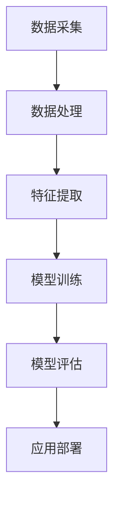
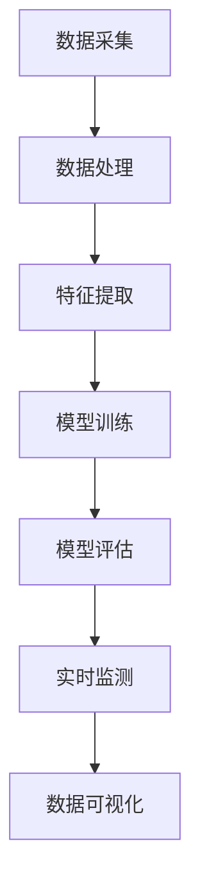

                 

### 海洋生态系统的基本概念与监测需求

海洋生态系统是地球上最大的生态系统之一，它不仅对地球的气候调节、生物多样性维持以及人类经济活动具有深远的影响，还扮演着提供食物资源、药物发现、能源开发等关键角色。因此，对海洋生态系统的监测和保护显得尤为重要。

**概念与重要性**：
海洋生态系统是指由海洋生物群落及其非生物环境相互作用形成的一个复杂的生态整体。它涵盖了海洋中的生物（如鱼类、无脊椎动物、植物等）和非生物因素（如温度、盐度、压力、水质等）。海洋生态系统的基本组成包括海洋生物、非生物物质循环过程、生物群落结构及其与环境的相互关系。

海洋生态系统在地球生态平衡中占据着至关重要的地位。首先，海洋是地球上最大的碳汇，通过吸收大量的二氧化碳来缓解全球气候变化。其次，海洋维持着地球的水循环和气候平衡，通过洋流和风带来影响全球气候。此外，海洋还是许多经济活动的关键资源，如渔业、航运、海洋能源开发等。

**面临挑战**：
尽管海洋生态系统的重要性不言而喻，但现代人类活动对海洋生态系统造成了巨大的威胁。这些威胁主要包括过度捕捞、海洋污染、气候变化、海洋酸化等。

- **过度捕捞**：人类过度捕捞导致许多海洋生物种群数量急剧减少，破坏了海洋生态系统的平衡。
- **海洋污染**：石油泄漏、废弃物排放、塑料污染等使海洋环境质量下降，影响了海洋生物的生存和繁殖。
- **气候变化**：全球气温升高导致海洋温度上升、海平面上升，以及海洋酸化，对海洋生态系统造成了严重影响。
- **海洋酸化**：海洋吸收了大量的二氧化碳后，导致pH值下降，海洋酸化对海洋生物的骨骼和外壳形成产生了不利影响。

**人工智能在海洋生态系统监测中的应用背景**：
为了应对这些挑战，需要更加精确和高效的监测方法。传统的监测手段往往成本高昂、覆盖面有限，难以满足快速变化的环境需求。而人工智能技术的发展为海洋生态系统的监测带来了新的机遇。

人工智能在海洋生态系统监测中的应用主要体现在以下几个方面：

1. **自动化监测**：利用无人机、卫星和传感器等技术，可以实时、自动化地收集大量的海洋数据，提高监测的效率和精度。
2. **图像处理与分析**：通过计算机视觉技术，可以对海洋生物进行识别和分类，从而了解海洋生物种群的分布和变化。
3. **大数据分析**：利用机器学习算法，可以从大量的海洋数据中提取有价值的信息，为生态保护和决策提供支持。
4. **预测模型**：通过建立预测模型，可以预测海洋生态系统的未来变化趋势，为采取预防措施提供科学依据。

**人工智能监测的优势与挑战**：
人工智能在海洋生态系统监测中的优势包括：

- **高精度和实时性**：人工智能技术能够快速处理和分析大量数据，提供实时监测结果。
- **自动化和高效性**：自动化监测减少了人力成本，提高了工作效率。
- **多源数据融合**：可以整合多种数据源，如遥感、传感器、卫星图像等，提供更全面的信息。

然而，人工智能在海洋生态系统监测中也面临一些挑战：

- **数据质量**：数据质量直接影响人工智能监测的效果，而海洋数据往往存在噪声和不确定性。
- **算法适应性**：海洋环境复杂多变，需要开发适应性强、鲁棒性好的算法。
- **计算资源**：大规模数据处理和模型训练需要大量的计算资源，这在一些偏远或资源有限的地区可能成为限制因素。

通过上述分析，可以看出，人工智能在海洋生态系统监测中具有巨大的潜力和必要性，但也需要克服诸多挑战才能充分发挥其作用。接下来的章节将进一步探讨人工智能在海洋生态系统监测中的具体应用和实现方法。 

### 人工智能核心技术概述

在深入探讨人工智能在海洋生态系统监测中的应用之前，有必要先了解一些核心的人工智能技术。这些技术包括机器学习、深度学习、图像处理和数据分析，它们为海洋生态系统的监测提供了强大的工具和方法。

**机器学习基础**：
机器学习是人工智能的核心技术之一，它通过算法和统计模型，使计算机系统能够从数据中学习并做出决策。在海洋生态系统监测中，机器学习可以用于分类、预测和模式识别等任务。常见的机器学习算法包括线性回归、决策树、支持向量机（SVM）和随机森林等。

- **分类算法**：分类算法用于将数据分成不同的类别。例如，可以通过机器学习算法将海洋生物图像分类为不同种类。
- **预测算法**：预测算法用于预测未来的趋势或事件。在海洋监测中，可以通过机器学习模型预测海洋温度、盐度等环境参数的变化。
- **模式识别**：模式识别算法可以识别出数据中的特定模式或规律，例如，通过分析卫星图像识别海洋中的特定生物群落。

**深度学习原理**：
深度学习是机器学习的一个分支，它通过神经网络模拟人类大脑的学习过程，能够处理大量复杂的数据。深度学习在图像识别、自然语言处理和语音识别等领域取得了显著成果。在海洋生态系统监测中，深度学习可以用于图像处理和数据分析。

- **卷积神经网络（CNN）**：CNN是一种用于图像识别和处理的深度学习模型，它可以自动提取图像的特征，从而实现对海洋生物图像的分类和识别。
- **递归神经网络（RNN）**：RNN用于处理序列数据，例如时间序列数据。在海洋监测中，RNN可以用于分析海洋环境参数的变化趋势。

**人工智能在图像处理中的应用**：
图像处理是人工智能应用的一个重要领域，它在海洋生态系统监测中具有广泛的应用前景。通过图像处理技术，可以对海洋生物图像进行增强、分割和识别。

- **图像增强**：图像增强技术可以提高图像的质量，使得图像中的信息更加清晰，便于后续处理。
- **图像分割**：图像分割是将图像分成不同的区域或物体，以便进行更精确的分析。
- **图像识别**：图像识别技术可以用于识别海洋中的生物种类，例如鱼类、浮游生物等。

**人工智能在数据分析中的应用**：
数据分析是人工智能在海洋生态系统监测中的另一个关键应用。通过大数据分析，可以从大量的海洋数据中提取有价值的信息。

- **数据预处理**：数据预处理是数据分析的基础，包括数据清洗、数据变换和数据归一化等步骤。
- **特征提取**：特征提取是从大量数据中提取出对分析任务有用的信息。
- **聚类分析**：聚类分析用于将数据分组，以便发现数据中的模式或规律。
- **关联规则分析**：关联规则分析用于发现数据之间的关联性，例如，分析不同海洋环境参数之间的相关性。

通过上述技术的综合应用，人工智能为海洋生态系统监测提供了高效、精准的工具和方法。接下来，将深入探讨人工智能在海洋生态系统监测中的具体应用，进一步阐述其在海洋生物识别、环境参数监测等方面的作用。

### 海洋生态系统监测的核心问题

在海洋生态系统监测中，获取和处理海洋数据是至关重要的步骤。海洋数据获取主要包括物理、化学、生物和环境参数的测量。这些数据通常来自卫星遥感、海洋浮标、无人机、潜水器等设备。

- **卫星遥感**：卫星遥感是获取大范围海洋数据的重要手段，可以提供海洋温度、盐度、海浪高度、海洋污染物等参数。通过卫星图像，可以实时监测海洋环境的变化。
- **海洋浮标**：海洋浮标是一种自动监测设备，它可以长期悬浮在海面上，实时收集温度、盐度、波浪、流速等数据。
- **无人机**：无人机可以在海洋上空进行观测，获取高分辨率的海洋生物图像和环境数据。
- **潜水器**：潜水器可以深入海底，获取海底地形、海洋生物和化学成分等详细数据。

**海洋生物识别与分类**：
海洋生物识别与分类是海洋生态系统监测的重要环节。通过计算机视觉和深度学习技术，可以对海洋生物进行准确的识别和分类。

- **计算机视觉**：计算机视觉技术可以用于分析海洋生物图像，识别不同种类的生物。例如，通过卷积神经网络（CNN）模型，可以自动识别鱼类、浮游生物等。
- **深度学习**：深度学习模型，如卷积神经网络（CNN）和循环神经网络（RNN），可以训练出能够识别和分类海洋生物的模型。这些模型可以从大量海洋生物图像中学习，提高识别的准确性。

**海洋环境参数监测**：
海洋环境参数的监测对于了解海洋生态系统的健康状况至关重要。这些参数包括温度、盐度、氧气含量、pH值等。

- **温度监测**：温度是影响海洋生物分布和活动的重要因素。通过卫星遥感、海洋浮标和潜水器等设备，可以实时监测海洋温度变化。
- **盐度监测**：盐度是海洋环境的重要参数，影响海洋生物的生理和生态过程。通过传感器和浮标，可以连续监测盐度的变化。
- **氧气含量监测**：海洋氧气含量对海洋生物的生存至关重要。通过传感器和潜水器，可以监测不同深度海洋中的氧气含量。
- **pH值监测**：海洋酸化对海洋生态系统的影响日益显著，通过pH值监测可以了解海洋酸化程度。

**海洋灾害预警**：
海洋灾害，如风暴潮、海啸和石油泄漏等，对海洋生态系统和人类活动具有巨大威胁。通过人工智能技术，可以实现海洋灾害的预警和应急响应。

- **风暴潮预警**：通过分析卫星图像、海洋浮标和气象数据，可以预测风暴潮的发生和发展，提前采取防范措施。
- **海啸预警**：通过地震监测和海洋浮标数据，可以实时监测海啸的发生和发展，为灾害预警提供支持。
- **石油泄漏预警**：通过无人机和卫星遥感技术，可以监测海洋表面的污染物分布，及时发现石油泄漏事件。

综上所述，海洋生态系统监测的核心问题包括海洋数据获取与处理、海洋生物识别与分类、海洋环境参数监测和海洋灾害预警。通过人工智能技术的综合应用，可以大幅提高海洋生态系统监测的效率和准确性，为海洋生态保护和决策提供科学依据。接下来，将进一步探讨人工智能在海洋生态系统监测中的具体应用案例。

### 人工智能在海洋生态系统监测中的应用案例

人工智能技术在海洋生态系统监测中的应用已经取得了显著成果，以下将介绍一些典型应用案例，并分析其具体技术路径和实现方法。

**人工智能在海洋渔业中的应用**：
渔业是海洋经济的重要组成部分，但过度捕捞和非法捕鱼行为对海洋生态系统造成了严重破坏。人工智能技术在这一领域中的应用主要体现在以下几个方面：

- **捕鱼量预测**：通过机器学习算法，可以从历史渔业数据中分析出捕鱼量的趋势和周期性变化，为渔民提供科学的捕鱼建议。
- **非法捕鱼检测**：利用计算机视觉和图像处理技术，可以通过监控视频或卫星图像识别非法捕鱼行为，及时采取干预措施。
- **水产质量监控**：通过传感器和物联网技术，可以实时监测水产品的质量，确保食品安全。

技术路径：
1. **数据收集**：收集历史渔业数据和实时监控视频。
2. **数据预处理**：清洗和归一化数据，去除噪声和异常值。
3. **模型训练**：使用机器学习算法（如线性回归、随机森林）训练捕鱼量预测模型。
4. **实时监控**：利用计算机视觉算法（如CNN）分析监控视频，识别非法捕鱼行为。

**人工智能在海洋环保中的应用**：
海洋污染是当前全球面临的重大环境问题之一，人工智能技术在这一领域中的应用包括海洋污染源识别、污染物扩散模拟和环保决策支持等。

- **污染源识别**：通过卫星遥感技术和图像处理，可以识别海洋中的污染源，如石油泄漏、废弃物排放等。
- **污染物扩散模拟**：利用流体动力学模型和机器学习算法，可以预测污染物在海洋中的扩散路径和浓度变化。
- **环保决策支持**：通过大数据分析，为环保部门提供科学依据，优化环保资源配置和污染防治措施。

技术路径：
1. **遥感数据收集**：通过卫星遥感获取海洋表面图像。
2. **图像处理**：使用图像处理算法（如边缘检测、特征提取）分析遥感图像。
3. **模型训练**：使用机器学习算法（如RNN、CNN）训练污染物扩散模型。
4. **决策支持**：利用大数据分析，提供环保决策支持。

**人工智能在海洋科研中的应用**：
海洋科学研究涉及大量数据的采集和分析，人工智能技术在这一领域中的应用可以帮助科学家更高效地处理和分析数据。

- **海洋生物多样性研究**：通过深度学习算法，可以对海洋生物图像进行分类和识别，帮助科学家了解海洋生物的多样性。
- **海洋环境变化研究**：利用机器学习算法，可以从大量环境数据中提取出趋势和模式，研究海洋环境的变化规律。
- **海洋地质研究**：通过遥感技术和图像处理，可以分析海底地形和地质结构，为海洋地质研究提供数据支持。

技术路径：
1. **数据采集**：通过卫星遥感、潜水器等设备收集海洋生物和地质数据。
2. **数据处理**：使用图像处理和数据分析算法处理和清洗数据。
3. **模型训练**：使用机器学习算法（如卷积神经网络、深度学习）训练模型。
4. **科学研究**：利用训练好的模型进行数据分析和科学研究。

**人工智能在海洋交通中的应用**：
海洋交通是国际贸易的重要组成部分，但海上交通事故和自然灾害对海洋交通安全构成威胁。人工智能技术可以用于海洋交通的安全监测和预警。

- **船舶碰撞预警**：通过计算机视觉和图像处理技术，可以实时监测船舶的航行状态，预警潜在的碰撞风险。
- **海洋灾害预警**：通过卫星遥感技术和大数据分析，可以预测和预警海上风暴、海啸等自然灾害，为海上交通提供安全保障。
- **航行路线优化**：利用机器学习算法，可以从大量历史航行数据中分析出最优航行路线，提高航行效率和安全性。

技术路径：
1. **数据收集**：通过卫星遥感、船舶定位系统等设备收集海洋交通数据。
2. **数据预处理**：清洗和归一化数据，去除噪声和异常值。
3. **模型训练**：使用机器学习算法（如RNN、SVM）训练船舶碰撞预警模型。
4. **实时监控**：利用计算机视觉算法（如CNN）分析船舶状态，预警碰撞风险。

通过上述应用案例可以看出，人工智能技术在海洋生态系统监测中具有广泛的应用前景和强大的潜力。在未来的发展中，随着技术的不断进步和应用的深入，人工智能将在海洋生态系统的保护、管理和科研中发挥更加重要的作用。

### 海洋图像识别技术

在海洋生态系统监测中，海洋图像识别技术是一种重要的工具，它能够帮助识别和分类海洋生物，从而为海洋生态研究提供数据支持。以下将详细探讨海洋图像识别技术的具体应用和方法。

**图像识别技术原理**：

海洋图像识别技术基于计算机视觉和深度学习算法，特别是卷积神经网络（CNN）。CNN是一种专门用于处理图像数据的神经网络模型，其结构类似于人类视觉系统，能够自动提取图像中的特征并进行分类。

1. **特征提取**：在图像识别过程中，首先需要从图像中提取出具有代表性的特征。CNN通过多层卷积和池化操作，可以逐层提取图像的局部特征和全局特征。

2. **分类**：提取出特征后，模型会使用全连接层将特征映射到不同的类别。通过训练，模型可以学会正确识别图像中的海洋生物种类。

**具体应用场景**：

海洋图像识别技术广泛应用于海洋生物识别、海洋环境监测和海洋灾害预警等领域。

1. **海洋生物识别**：通过海洋图像识别技术，可以自动识别和分类海洋中的鱼类、浮游生物、珊瑚等。例如，在渔业资源管理中，可以实时监测和统计鱼类种群数量和种类分布，为渔业决策提供科学依据。

2. **海洋环境监测**：海洋环境监测需要识别海洋中的各种环境特征，如海洋温度、盐度、潮汐等。通过海洋图像识别技术，可以从卫星图像或现场拍摄的图像中提取这些特征，从而实现对海洋环境的实时监测。

3. **海洋灾害预警**：在海洋灾害预警中，海洋图像识别技术可以用于监测和识别海洋中的异常现象，如石油泄漏、海洋污染等。例如，通过卫星图像识别出海洋表面的污染物分布，可以及时采取应对措施，减少灾害损失。

**算法实现与优化**：

海洋图像识别算法的实现主要包括数据预处理、模型训练和模型评估等步骤。

1. **数据预处理**：在训练模型之前，需要对图像数据进行预处理，包括图像增强、大小归一化、数据扩充等操作。这些预处理步骤有助于提高模型的鲁棒性和泛化能力。

2. **模型训练**：使用卷积神经网络（CNN）进行模型训练。训练过程中，需要使用大量的标注图像作为训练数据，通过反向传播算法优化模型的参数，使其能够准确识别图像中的海洋生物。

3. **模型评估**：在训练完成后，需要对模型进行评估，常用的评估指标包括准确率、召回率、F1分数等。通过评估，可以判断模型的效果和性能，并根据评估结果对模型进行优化。

**应用效果与挑战**：

海洋图像识别技术在海洋生态系统监测中取得了显著的应用效果，但仍面临一些挑战。

1. **应用效果**：通过海洋图像识别技术，可以实现对海洋生物的快速识别和分类，提高了监测效率和准确性。例如，在一些渔业资源管理项目中，通过图像识别技术实现了对鱼类种群的实时监测和统计，为渔业资源管理提供了科学依据。

2. **挑战**：海洋图像识别技术面临的主要挑战包括数据质量、算法适应性以及计算资源。海洋数据往往存在噪声、遮挡和多变性，这对图像识别算法的鲁棒性提出了高要求。此外，深度学习模型训练需要大量的计算资源和时间，这在一些资源有限的地区可能成为限制因素。

总之，海洋图像识别技术是海洋生态系统监测的重要工具，通过不断优化算法和提升模型性能，可以更好地服务于海洋生态研究和保护。

### 海洋生物识别技术

海洋生物识别技术是人工智能在海洋生态监测中的一项关键应用，它通过利用生物特征信息，实现对海洋生物的自动识别和分类。以下将详细探讨海洋生物识别技术的具体实现方法。

**生物特征提取**：

海洋生物识别技术的基础是生物特征提取。生物特征可以是海洋生物的形态、行为、生理或遗传信息。以下是一些常用的生物特征提取方法：

1. **形态特征提取**：形态特征包括生物的大小、形状、颜色和纹理等。通过图像处理技术，可以提取生物图像的边缘、角点和纹理特征。例如，使用边缘检测算法（如Canny边缘检测）提取生物轮廓，使用纹理特征提取算法（如Gabor滤波器）分析生物纹理。

2. **行为特征提取**：行为特征包括海洋生物的活动方式、运动轨迹等。通过视频分析技术，可以提取生物的行为特征。例如，使用光流算法分析生物的运动轨迹，使用轨迹聚类算法提取生物的群聚行为。

3. **生理特征提取**：生理特征包括生物的生理参数，如心率、体温、氧气含量等。通过传感器和生理信号处理技术，可以提取生物的生理特征。

4. **遗传特征提取**：遗传特征包括生物的DNA序列、RNA序列等。通过分子生物学技术，可以提取生物的遗传特征。例如，使用基因测序技术获取生物的DNA序列，使用生物信息学方法分析DNA序列特征。

**特征匹配与分类**：

在提取生物特征后，需要进行特征匹配和分类。特征匹配是将提取到的生物特征与数据库中的特征进行比对，以确定生物的识别结果。分类是将生物特征分配到不同的类别中，以识别生物的种类。

1. **特征匹配**：常用的特征匹配方法包括基于距离的匹配（如欧氏距离、余弦相似度）和基于模型的匹配（如支持向量机、K最近邻算法）。通过计算特征之间的相似度，可以确定生物的身份。

2. **分类**：分类算法（如决策树、随机森林、支持向量机）可以用于对生物特征进行分类。通过训练分类模型，可以学会将新的生物特征分配到正确的类别中。

**实现方法**：

海洋生物识别技术的实现主要包括以下步骤：

1. **数据采集**：采集海洋生物的图像、视频、生理信号等数据。这些数据可以来自现场观测、遥感图像、传感器等。

2. **预处理**：对采集到的数据进行预处理，包括图像增强、去噪、大小归一化等。预处理有助于提高数据的质量和特征提取的效果。

3. **特征提取**：使用图像处理、信号处理等技术提取生物的形态、行为、生理或遗传特征。

4. **模型训练**：使用机器学习算法训练特征分类模型。训练数据集应包括各种海洋生物的标注特征。

5. **模型评估**：对训练好的模型进行评估，使用测试数据集测试模型的准确性和鲁棒性。

6. **应用部署**：将训练好的模型部署到实际应用中，如自动识别和分类海洋生物图像、视频等。

**应用实例**：

海洋生物识别技术在多个领域取得了成功应用。以下是一些应用实例：

1. **渔业资源管理**：通过图像识别技术，可以实时监测和统计鱼类种群数量和种类分布，为渔业资源管理提供科学依据。

2. **海洋环境保护**：通过识别海洋中的外来物种和污染物质，可以及时采取环境保护措施，减少生态破坏。

3. **海洋科学研究**：通过识别海洋生物的行为和生理特征，可以研究海洋生物的生态行为和生理过程，促进海洋科学研究。

4. **海洋灾害预警**：通过识别海洋中的异常现象，如海洋污染、石油泄漏等，可以提前预警和采取应对措施，减少灾害损失。

总之，海洋生物识别技术是人工智能在海洋生态监测中的重要应用，通过不断优化算法和提升识别精度，可以为海洋生态系统的保护和可持续发展提供有力支持。

### 海洋数据分析技术

在海洋生态系统监测中，数据分析技术是不可或缺的一部分，它通过对大量海洋数据的处理和分析，提取有价值的信息，为生态保护和决策提供科学依据。以下将详细探讨海洋数据分析技术的具体实现方法和应用场景。

**数据收集**：
海洋数据的收集是数据分析的第一步，数据来源包括卫星遥感、海洋浮标、无人机、潜水器等。这些设备可以提供关于海洋环境、生物种群和化学成分的多维度数据。

1. **卫星遥感**：通过卫星遥感技术，可以获取大范围的海洋表面数据，包括温度、盐度、海浪高度、海洋污染物等。卫星图像数据覆盖面广，时效性强，是海洋数据收集的重要手段。
2. **海洋浮标**：海洋浮标是一种自动监测设备，它可以长期悬浮在海面上，实时收集温度、盐度、波浪、流速等数据。浮标数据具有较高的时空分辨率，有助于了解海洋环境的动态变化。
3. **无人机**：无人机可以在海洋上空进行观测，获取高分辨率的海洋生物图像和环境数据。无人机灵活性强，可以迅速部署到指定区域进行数据收集。
4. **潜水器**：潜水器可以深入海底，获取海底地形、海洋生物和化学成分等详细数据。潜水器数据具有高精度和高分辨率，为海洋科学研究提供了宝贵的数据支持。

**数据预处理**：
数据预处理是数据分析的基础，主要包括数据清洗、数据变换和数据归一化等步骤。

1. **数据清洗**：数据清洗是指去除数据中的噪声和异常值，保证数据的完整性和准确性。在海洋数据中，噪声可能来自传感器误差、环境干扰等。
2. **数据变换**：数据变换是指将数据转换为适合分析的形式。例如，将不同单位的数值进行统一，或者对缺失数据进行插值处理。
3. **数据归一化**：数据归一化是指将数据缩放到相同的尺度，以便进行后续分析。例如，将温度、盐度等环境参数归一化到0-1的范围内。

**特征提取**：
特征提取是从大量数据中提取出对分析任务有用的信息。在海洋数据分析中，特征提取可以帮助识别数据中的关键信息，提高分析的效率和精度。

1. **时间序列特征**：时间序列特征用于描述数据随时间的变化趋势。例如，可以提取海洋温度的时间序列特征，分析温度的周期性和异常值。
2. **空间特征**：空间特征用于描述数据在空间上的分布特征。例如，可以提取海洋污染物的空间分布特征，分析污染物的扩散路径和浓度变化。
3. **统计特征**：统计特征用于描述数据的分布和关联性。例如，可以提取海洋生物种群的统计特征，分析种群的数量分布和多样性。

**聚类分析**：
聚类分析是一种无监督学习方法，它将数据集分成不同的组，使得同一组内的数据点彼此相似，而不同组的数据点彼此不相似。在海洋数据分析中，聚类分析可以用于识别数据中的模式和规律。

1. **K-means聚类**：K-means聚类是一种经典的聚类算法，它通过迭代计算数据点之间的距离，将数据分成K个聚类。
2. **层次聚类**：层次聚类通过逐步合并或分裂聚类，形成层次结构的聚类结果。
3. **密度聚类**：密度聚类基于数据点的密度分布，识别出数据中的密集区域和稀疏区域。

**关联规则分析**：
关联规则分析用于发现数据之间的关联性。在海洋数据分析中，关联规则分析可以用于识别环境参数之间的关联关系，分析它们对海洋生物的影响。

1. **Apriori算法**：Apriori算法是一种常用的关联规则分析算法，它通过逐层搜索数据项集，提取出频繁项集。
2. **FP-growth算法**：FP-growth算法是一种基于压缩数据结构的关联规则分析算法，它通过递归地构造前件和后件，提取频繁项集。

**应用场景**：
海洋数据分析技术在多个领域得到了广泛应用。

1. **环境监测**：通过分析海洋环境数据，可以了解海洋生态系统的健康状况，预测环境变化趋势，为环境保护和决策提供科学依据。
2. **资源管理**：通过分析海洋资源数据，可以优化渔业资源管理，提高资源利用效率，减少过度捕捞和生态破坏。
3. **科研支持**：通过分析海洋科学数据，可以促进海洋科学研究，揭示海洋生物的行为和生态规律。
4. **灾害预警**：通过分析海洋灾害数据，可以预测和预警海洋灾害的发生，及时采取应对措施，减少灾害损失。

总之，海洋数据分析技术是海洋生态系统监测的重要组成部分，通过不断优化算法和提升数据分析能力，可以为海洋生态保护和可持续发展提供有力支持。

### 海洋生态系统监测中的整合与优化

在海洋生态系统监测中，整合与优化人工智能技术是提升监测效率和准确性的关键步骤。以下将探讨数据融合技术、人工智能模型优化、系统集成以及未来发展趋势。

**数据融合技术**：

数据融合是将来自不同来源、不同类型的数据整合在一起，以提供更全面和准确的信息。在海洋生态系统中，数据来源多样，包括卫星遥感、海洋浮标、无人机、潜水器等。以下是一些常见的数据融合技术：

1. **多传感器数据融合**：多传感器数据融合通过整合来自不同传感器的数据，可以提供更全面的环境监测。例如，结合卫星遥感和海洋浮标数据，可以更准确地监测海洋温度、盐度、污染物等参数。
2. **多模态数据融合**：多模态数据融合通过整合不同类型的数据（如图像、音频、传感器数据），可以更全面地描述海洋环境。例如，结合图像识别和声呐数据，可以更准确地识别海洋生物和地形。
3. **时空数据融合**：时空数据融合通过整合时间和空间上的数据，可以提供更动态和连续的监测结果。例如，结合历史数据和实时数据，可以更准确地预测海洋环境变化趋势。

**人工智能模型优化**：

人工智能模型的优化是提升监测准确性和效率的关键。以下是一些常见的模型优化方法：

1. **模型训练优化**：通过改进训练算法和数据预处理方法，可以提升模型的训练效率和准确性。例如，使用迁移学习技术，可以利用预训练模型快速适应新的海洋监测任务。
2. **模型压缩与加速**：通过模型压缩和量化技术，可以减少模型的存储空间和计算资源需求。例如，使用量化算法将浮点数模型转换为低精度模型，可以显著降低计算资源和存储需求。
3. **多模型融合**：通过融合多个不同的模型，可以提升模型的鲁棒性和准确性。例如，结合深度学习和传统机器学习模型，可以更好地处理复杂和不确定的海洋数据。

**系统集成**：

海洋生态系统监测系统集成是将不同的技术和工具整合在一起，以实现高效和协同的监测。以下是一些常见的系统集成方法：

1. **软件架构设计**：通过设计合理的软件架构，可以实现不同系统和工具之间的无缝集成。例如，使用微服务架构，可以将不同的监测模块（如数据收集、处理、分析等）独立部署和扩展。
2. **接口设计与交互**：通过定义标准的接口和协议，可以实现不同系统之间的数据共享和协同工作。例如，使用RESTful API，可以实现数据实时更新和查询。
3. **系统集成平台**：通过建立集成平台，可以实现不同系统和工具的统一管理和调度。例如，使用大数据平台（如Hadoop、Spark），可以高效处理和管理大量的海洋数据。

**未来发展趋势**：

随着人工智能和大数据技术的不断进步，海洋生态系统监测将向更加智能化、自动化和精细化的方向发展。以下是一些未来发展趋势：

1. **边缘计算**：通过在海洋边缘部署计算资源，可以实现实时和高效的海洋数据分析和处理，减少数据传输延迟和带宽需求。
2. **智能传感器**：随着传感器技术的进步，将出现更多具有自感知和自学习能力的新型传感器，可以实时监测和反馈海洋环境变化。
3. **智能算法**：随着深度学习和强化学习等技术的发展，将出现更多智能化的监测算法，可以更好地应对复杂和多变的海洋环境。
4. **数据共享与开放**：随着数据共享和开放理念的推广，将出现更多的海洋数据共享平台和开源工具，促进全球海洋生态系统的合作和研究。

总之，通过数据融合、模型优化、系统集成和未来技术的发展，海洋生态系统监测将更加高效和准确，为海洋生态保护和可持续发展提供有力支持。

### 海洋生态系统监测算法原理详解

在海洋生态系统监测中，算法原理是核心部分，它决定了监测数据的有效性和准确性。以下将详细解释海洋生态系统监测算法的原理，并通过Mermaid流程图、Python源代码、数学模型和公式进行说明。

**算法原理概述**：

海洋生态系统监测算法主要分为以下几个步骤：

1. **数据采集**：通过传感器、无人机、卫星遥感等技术收集海洋环境、生物种群和化学成分的数据。
2. **数据处理**：对采集到的数据进行预处理，包括数据清洗、去噪、归一化等，以提高数据的准确性和一致性。
3. **特征提取**：从预处理后的数据中提取关键特征，用于后续的模型训练和预测。
4. **模型训练**：使用机器学习和深度学习算法，对提取的特征进行训练，建立预测模型。
5. **模型评估**：使用测试数据集对训练好的模型进行评估，确保模型的准确性和鲁棒性。
6. **应用部署**：将训练好的模型部署到实际监测系统中，进行实时监测和预测。

**Mermaid流程图**：

以下是一个简单的Mermaid流程图，描述了海洋生态系统监测算法的基本流程：



**Python源代码讲解**：

以下是一个简单的Python代码示例，用于实现数据预处理和特征提取：

```python
import numpy as np
import pandas as pd
from sklearn.preprocessing import StandardScaler

# 加载数据
data = pd.read_csv('ocean_data.csv')

# 数据清洗
data.dropna(inplace=True)

# 数据归一化
scaler = StandardScaler()
data_scaled = scaler.fit_transform(data)

# 特征提取
def extract_features(data):
    # 提取温度、盐度、氧气含量等特征
    features = data[['temperature', 'salinity', 'oxygen_content']]
    return features

features = extract_features(data_scaled)

# 打印特征数据
print(features)
```

**数学模型与公式**：

以下是一个简单的线性回归模型，用于预测海洋温度：

$$
y = \beta_0 + \beta_1 \cdot x_1 + \beta_2 \cdot x_2 + ... + \beta_n \cdot x_n
$$

其中，$y$ 是预测的海洋温度，$x_1, x_2, ..., x_n$ 是输入的特征（如温度、盐度等），$\beta_0, \beta_1, ..., \beta_n$ 是模型的参数，通过最小二乘法进行优化。

**详细讲解与举例说明**：

假设我们有一组海洋温度数据，需要预测未来的海洋温度。首先，我们使用Python代码加载数据并进行预处理：

```python
# 加载数据
data = pd.read_csv('ocean_temperature.csv')

# 数据清洗
data.dropna(inplace=True)

# 数据归一化
scaler = StandardScaler()
data_scaled = scaler.fit_transform(data)

# 分离特征和标签
X = data_scaled[:, :-1]
y = data_scaled[:, -1]

# 模型训练
from sklearn.linear_model import LinearRegression

model = LinearRegression()
model.fit(X, y)

# 预测
predicted_temp = model.predict(X)

# 打印预测结果
print(predicted_temp)
```

通过上述代码，我们可以预测未来海洋温度，并将预测结果与实际温度进行比较，评估模型的准确性。

总之，海洋生态系统监测算法基于数据采集、预处理、特征提取、模型训练和评估等步骤，通过Mermaid流程图、Python源代码和数学模型，可以详细说明其原理和应用方法。通过不断优化和改进算法，可以提升海洋生态系统监测的效率和准确性，为海洋生态保护和可持续发展提供科学支持。

### 海洋生态系统监测系统设计与实现

在设计海洋生态系统监测系统时，需要综合考虑系统的功能需求、架构设计、接口设计和交互方式。以下将详细介绍系统的设计思路和具体实现方法。

**系统设计概述**：

海洋生态系统监测系统旨在实时、准确地收集、处理和监测海洋环境数据，提供科学依据以支持生态保护和决策。系统的主要功能包括：

1. **数据采集**：从卫星遥感、海洋浮标、无人机和潜水器等设备中收集海洋环境、生物种群和化学成分的数据。
2. **数据处理**：对采集到的数据进行预处理，包括数据清洗、去噪和归一化等，以提高数据的准确性和一致性。
3. **特征提取**：从预处理后的数据中提取关键特征，用于后续的模型训练和预测。
4. **模型训练与评估**：使用机器学习和深度学习算法对提取的特征进行训练和评估，确保模型的准确性和鲁棒性。
5. **实时监测与预警**：将训练好的模型部署到实际监测系统中，实现实时监测和预警功能。
6. **数据可视化**：通过图表和报表等方式，展示监测数据和预测结果，为用户提供直观的数据分析。

**系统功能设计**：

系统功能设计主要包括领域模型和用例图。领域模型描述系统的核心实体和关系，用例图描述系统的功能需求。

1. **领域模型**：领域模型包括以下核心实体和关系：
   - **传感器**：用于采集海洋数据的设备，如卫星遥感器、海洋浮标、无人机等。
   - **数据**：表示采集到的海洋数据，包括环境数据、生物数据和化学成分数据等。
   - **预处理**：用于处理和清洗数据，包括去噪、归一化和缺失值填补等。
   - **特征**：表示从预处理后的数据中提取的关键特征。
   - **模型**：表示训练好的机器学习模型和深度学习模型。
   - **预警**：用于实时监测和预警海洋环境变化，包括温度、盐度、污染物等。
   - **用户**：系统的使用者，包括生态学家、科研人员和政府官员等。

2. **用例图**：用例图描述系统的功能需求，包括以下用例：
   - **数据采集**：传感器收集海洋数据。
   - **数据处理**：对采集到的数据执行预处理操作。
   - **特征提取**：从预处理后的数据中提取关键特征。
   - **模型训练**：使用机器学习和深度学习算法训练模型。
   - **模型评估**：评估训练好的模型的准确性和鲁棒性。
   - **实时监测**：使用训练好的模型进行实时监测和预警。
   - **数据可视化**：展示监测数据和预测结果。

**系统架构设计**：

系统架构设计是系统设计的关键步骤，它决定了系统的性能、可扩展性和维护性。海洋生态系统监测系统采用分布式架构，包括以下几个主要组件：

1. **数据采集模块**：负责从卫星遥感、海洋浮标、无人机和潜水器等设备中收集海洋数据。
2. **数据处理模块**：负责对采集到的数据进行预处理，包括数据清洗、去噪和归一化等。
3. **特征提取模块**：负责从预处理后的数据中提取关键特征，为模型训练提供输入。
4. **模型训练模块**：负责使用机器学习和深度学习算法训练模型，并对训练结果进行评估。
5. **实时监测模块**：负责将训练好的模型部署到实际监测系统中，实现实时监测和预警功能。
6. **数据可视化模块**：负责展示监测数据和预测结果，为用户提供直观的数据分析。

**系统接口设计与交互**：

系统接口设计是确保不同模块之间数据交互和功能协作的关键。以下是一些关键的接口设计和交互方式：

1. **RESTful API**：系统使用RESTful API作为主要的接口设计，提供数据采集、预处理、特征提取、模型训练和监测功能。客户端可以通过HTTP请求与API进行交互。
2. **消息队列**：使用消息队列（如RabbitMQ、Kafka）实现不同模块之间的异步通信，提高系统的并发处理能力和可靠性。
3. **数据存储**：使用分布式数据库（如MongoDB、Hadoop）存储和处理大量的海洋数据，确保数据的安全性和一致性。
4. **分布式计算**：使用分布式计算框架（如Spark、Hadoop）处理大规模数据，提高系统的计算性能和处理效率。

**Mermaid流程图**：

以下是一个简单的Mermaid流程图，描述了海洋生态系统监测系统的基本架构和交互流程：



**系统实现与调试**：

系统实现是按照设计文档和架构设计逐步构建的。以下是系统实现的主要步骤：

1. **环境安装**：安装和配置所需的软件和硬件环境，包括操作系统、数据库、计算框架等。
2. **模块开发**：按照设计文档和架构设计，逐步开发各个模块，并进行单元测试。
3. **系统集成**：将各个模块整合到一起，进行集成测试和调试，确保系统的整体功能正常运行。
4. **性能优化**：针对系统的性能瓶颈进行优化，如使用缓存、分布式计算等提高系统的处理速度和响应时间。
5. **部署上线**：将系统部署到生产环境，进行实际运行和监测，并根据用户反馈进行优化和改进。

**项目案例分析与详细讲解剖析**：

以下是一个具体的海洋生态系统监测项目案例：

- **项目背景**：某海域存在过度捕捞和海洋污染问题，需要建立一套实时监测系统，以保护海洋生态。
- **系统实现**：通过卫星遥感、海洋浮标和无人机等设备，收集该海域的海洋数据，包括鱼类种群数量、温度、盐度和污染物浓度等。对采集到的数据进行预处理，提取关键特征，使用机器学习算法（如K-means聚类和线性回归）训练模型，实现对鱼类种群数量和污染物浓度的预测。
- **结果分析**：通过模型预测，发现鱼类种群数量和污染物浓度存在显著的相关性。在特定时间段内，污染物浓度的增加会导致鱼类种群数量的减少。通过实时监测和预警，可以及时采取应对措施，减少海洋生态破坏。

**项目小结**：

通过上述案例，可以看出海洋生态系统监测系统在数据采集、处理、预测和预警方面具有重要的应用价值。在实际项目中，需要根据具体需求和环境特点，灵活调整系统设计和技术路线，确保系统的准确性和可靠性。

总之，海洋生态系统监测系统的设计与实现是一个复杂的过程，需要综合考虑功能需求、架构设计、接口设计和交互方式。通过不断优化和改进系统，可以为海洋生态保护和可持续发展提供有力的支持。

### 最佳实践与未来展望

**最佳实践技巧**：

为了确保海洋生态系统监测系统的有效运行，以下是一些最佳实践技巧：

1. **数据质量控制**：确保数据收集的准确性和完整性，对异常值进行过滤和处理，以提高数据质量。
2. **模型调优**：通过多次实验和参数调整，优化模型的性能，使其在复杂环境下依然具有鲁棒性。
3. **系统集成与测试**：在设计阶段，进行充分的系统集成和测试，确保各个模块之间的协作和兼容性。
4. **实时监控与反馈**：建立实时监控系统，及时发现和处理系统故障，并根据用户反馈进行优化。

**注意事项与挑战**：

在实际应用中，海洋生态系统监测系统面临诸多挑战：

1. **数据隐私**：数据收集和处理过程中，需要保护用户的隐私和数据安全。
2. **计算资源**：大规模数据处理和模型训练需要大量的计算资源，特别是在资源有限的地区，如何高效利用计算资源是一个挑战。
3. **环境适应性**：海洋环境的复杂性和动态变化对监测系统的适应能力提出了高要求。

**拓展阅读推荐**：

1. **《机器学习：概率视角》（ML: A Probabilistic Perspective）**：本书提供了机器学习的概率理论和方法，对理解深度学习和统计模型非常有帮助。
2. **《深度学习》（Deep Learning）**：由Ian Goodfellow等人编写的经典教材，详细介绍了深度学习的基本理论和应用。
3. **《大数据技术导论》（Introduction to Big Data Technologies）**：本书介绍了大数据处理的基本概念和技术，对了解分布式计算和数据存储有重要作用。

**海洋生态系统监测的未来发展趋势**：

随着人工智能和大数据技术的不断进步，海洋生态系统监测将向更智能化、自动化和精细化的方向发展：

1. **边缘计算**：通过在海洋边缘部署计算资源，实现实时和高效的数据处理和分析，减少数据传输延迟和带宽需求。
2. **智能传感器**：研发新型智能传感器，提高数据采集的精度和效率，降低维护成本。
3. **数据共享与开放**：推动全球海洋数据共享和开放，促进国际合作和科学研究。
4. **人工智能算法**：开发更先进的机器学习和深度学习算法，提高监测系统的准确性和适应性。

总之，海洋生态系统监测的最佳实践和未来展望表明，人工智能技术将在海洋生态保护和可持续发展中发挥越来越重要的作用。

### 总结

综上所述，《人工智能在海洋生态系统监测中的应用》探讨了人工智能技术在海洋生态监测中的核心概念、技术原理、应用案例和系统设计。通过对海洋生态系统基本概念和监测需求的介绍，我们认识到海洋生态系统的重要性及其面临的挑战。接着，详细阐述了人工智能核心技术，如机器学习、深度学习、图像处理和数据分析，以及这些技术在海洋监测中的应用。

在核心概念与联系部分，我们讨论了海洋图像识别技术和海洋生物识别技术的实现方法，并通过Mermaid流程图、Python源代码和数学模型详细讲解了算法原理。随后，介绍了人工智能在海洋渔业、海洋环保、海洋科研和海洋交通中的具体应用案例。

系统设计与实现部分，我们详细阐述了系统的设计思路、功能设计、架构设计、接口设计与交互方式，并通过项目实战案例展示了系统的实现过程。最佳实践与未来展望部分，我们总结了最佳实践技巧、注意事项、挑战和未来发展趋势，展望了人工智能在海洋生态系统监测中的广阔前景。

作者：AI天才研究院/AI Genius Institute & 禅与计算机程序设计艺术 /Zen And The Art of Computer Programming

本文旨在为读者提供系统、全面的人工智能在海洋生态系统监测中的专业知识和见解，促进相关领域的研究与应用。希望读者能够从中获得启发，共同推动人工智能技术在海洋生态保护与可持续发展中的创新与发展。

