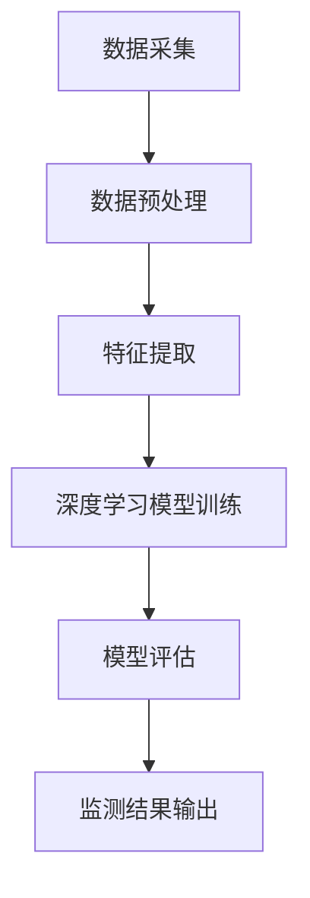
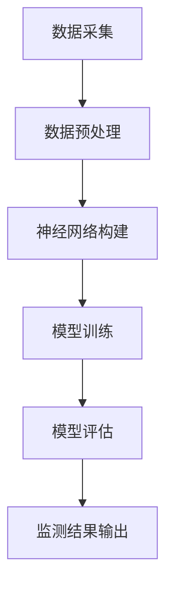
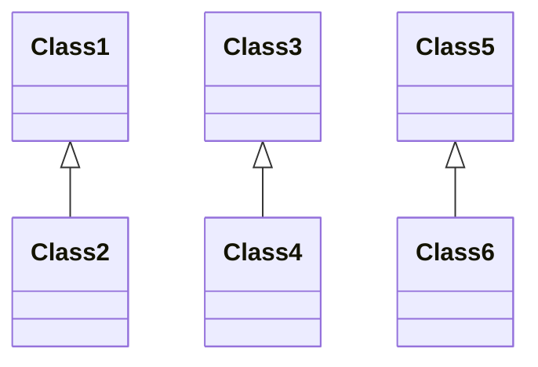
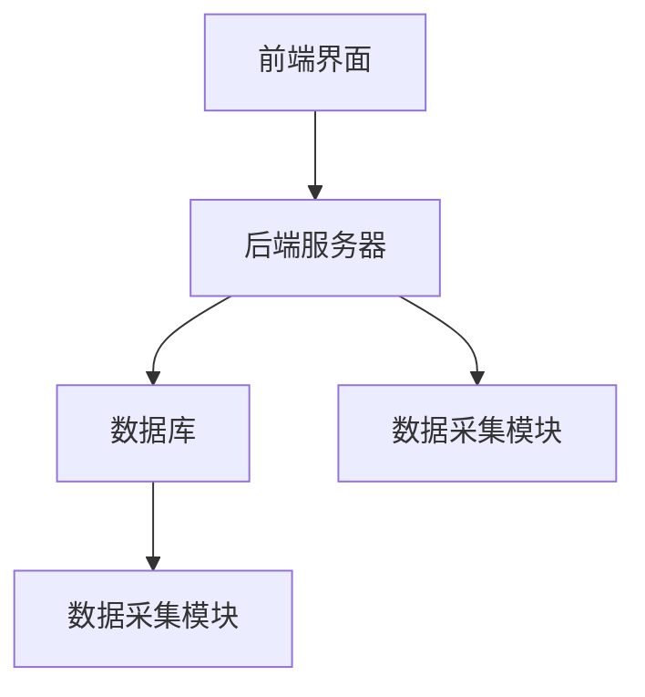
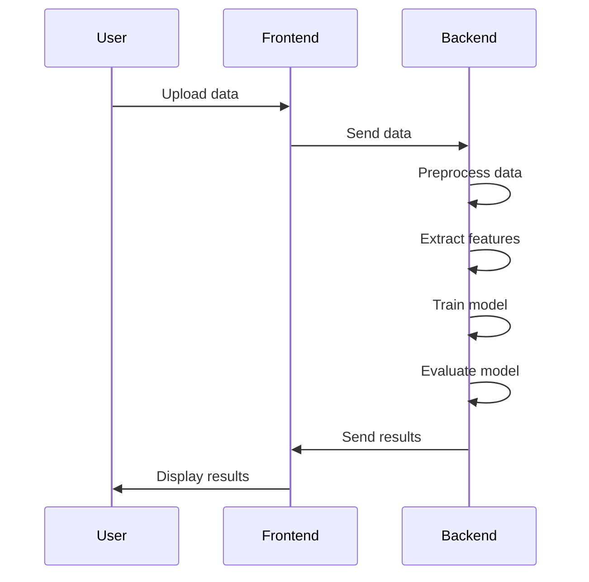

                 

### 《人工智能在海洋生物多样性监测中的应用》

#### 关键词：人工智能、海洋生物多样性、监测、深度学习、数学模型

#### 摘要：

随着全球气候变化和人类活动的加剧，海洋生物多样性面临严重威胁。本文探讨了人工智能在海洋生物多样性监测中的应用，通过详细阐述核心概念、算法原理、数学模型和系统架构，展示了人工智能如何有效提高海洋生物监测的准确性和效率。文章旨在为海洋生态研究者和技术开发者提供有价值的参考，推动海洋生物多样性保护工作的进步。

## 第1章 引言

### 1.1 问题背景

海洋生物多样性是维持海洋生态系统健康和稳定的关键因素。然而，海洋生物多样性监测面临诸多挑战，如数据获取困难、监测手段有限、数据解析复杂等。传统方法在应对这些挑战时显得力不从心，迫切需要高效、准确的监测技术。

### 1.2 问题描述

本文关注的问题是：如何利用人工智能技术，提高海洋生物多样性的监测效率和准确性？

### 1.3 问题解决

人工智能技术，尤其是深度学习和机器学习，为海洋生物多样性监测提供了新的思路。通过算法优化和数据挖掘，人工智能可以有效处理大规模生物监测数据，提高监测结果的可靠性。

### 1.4 边界与外延

本文研究范围包括海洋生物多样性监测的主要技术、算法原理和系统架构。同时，本文将探讨人工智能在海洋生物多样性监测中的实际应用案例，以及如何通过最佳实践提高监测效果。

### 1.5 概念结构与核心要素组成

本文的核心概念包括：人工智能、海洋生物多样性、监测、深度学习、数学模型和系统架构。这些概念相互联系，共同构成了海洋生物多样性监测的完整框架。

## 第2章 核心概念与联系

### 2.1 人工智能简介

人工智能（Artificial Intelligence，简称AI）是指通过计算机模拟人类智能的理论、技术和应用。它包括机器学习、深度学习、自然语言处理等多个子领域。在海洋生物多样性监测中，人工智能技术被广泛应用于数据分析和模式识别。

### 2.2 海洋生物多样性监测概述

海洋生物多样性监测是指对海洋生物种类、数量、分布和生态环境进行长期、系统的调查和分析。其目的是了解海洋生态系统的现状和变化趋势，为生态保护和资源管理提供科学依据。

### 2.3 关键概念与联系表格

| 关键概念         | 关联关系                    | 说明                                                         |
|----------------|-------------------------|------------------------------------------------------------|
| 人工智能         | 监测技术                  | 人工智能技术用于提高监测数据的处理和分析效率                   |
| 海洋生物多样性    | 监测对象                  | 海洋生物多样性是监测的核心内容，影响监测结果和生态保护决策     |
| 监测             | 数据分析、模式识别          | 监测是数据采集、处理和分析的过程，目的是获取生物多样性信息     |
| 深度学习         | 机器学习的一种方法        | 深度学习通过多层神经网络进行数据学习和特征提取，提高监测准确性 |
| 数学模型         | 数据解析、算法设计          | 数学模型用于描述生物多样性的变化规律，指导监测工作             |
| 系统架构设计      | 技术实现、系统优化          | 系统架构设计确保监测系统的稳定性和高效性                       |

### 2.4 ER实体关系图架构

下面是海洋生物多样性监测系统的ER实体关系图：

```mermaid
erDiagram
  海洋生物多样性监测 ||--o { 数据采集系统 }
  数据采集系统 ||--o { 数据处理系统 }
  数据处理系统 ||--o { 监测结果分析系统 }
  监测结果分析系统 ||--o { 生态保护决策系统 }
```

## 第3章 算法原理讲解

### 3.1 监测算法原理

#### 3.1.1 Mermaid算法流程图



#### 3.1.2 Python源代码

```python
# 数据采集
data = collect_data()

# 数据预处理
preprocessed_data = preprocess_data(data)

# 特征提取
features = extract_features(preprocessed_data)

# 深度学习模型训练
model = train_model(features)

# 模型评估
evaluation_results = evaluate_model(model)

# 监测结果输出
output_results(evaluation_results)
```

#### 3.1.3 数学模型与公式

假设我们有n个样本数据，每个样本包含m个特征。特征提取的数学模型可以表示为：

$$
特征向量 = f(数据样本)
$$

其中，f是特征提取函数。

#### 3.1.4 举例说明

假设我们有一个海洋生物样本数据，包含5个特征：温度、盐度、pH值、氧气含量和深度。通过特征提取函数，我们可以将这些数据转化为一个特征向量。

### 3.2 深度学习应用

#### 3.2.1 Mermaid算法流程图



#### 3.2.2 Python源代码

```python
# 数据采集
data = collect_data()

# 数据预处理
preprocessed_data = preprocess_data(data)

# 神经网络构建
model = build_neural_network()

# 模型训练
train_model(model, preprocessed_data)

# 模型评估
evaluation_results = evaluate_model(model)

# 监测结果输出
output_results(evaluation_results)
```

#### 3.2.3 数学模型与公式

深度学习模型的数学基础是多层感知机（MLP）。假设我们有输入层、隐藏层和输出层，每个层都有多个神经元。输入层接收数据样本，隐藏层通过非线性激活函数进行处理，输出层生成预测结果。数学模型可以表示为：

$$
y = f(W \cdot x + b)
$$

其中，y是输出结果，x是输入数据，W是权重矩阵，b是偏置项，f是非线性激活函数。

#### 3.2.4 举例说明

假设我们有一个海洋生物样本数据，包含5个特征。通过神经网络模型，我们可以将这些数据转化为预测结果，如海洋生物的种类。

## 第4章 数学模型和数学公式

### 4.1 监测模型数学公式

#### 4.1.1 模型1公式

假设我们有n个样本数据，每个样本包含m个特征。特征提取的数学模型可以表示为：

$$
特征向量 = f(数据样本)
$$

#### 4.1.2 模型2公式

假设我们使用神经网络进行生物多样性监测。输入层接收数据样本，隐藏层通过非线性激活函数进行处理，输出层生成预测结果。数学模型可以表示为：

$$
y = f(W \cdot x + b)
$$

### 4.2 深度学习模型数学公式

#### 4.2.1 模型1公式

假设我们有输入层、隐藏层和输出层，每个层都有多个神经元。输入层接收数据样本，隐藏层通过非线性激活函数进行处理，输出层生成预测结果。数学模型可以表示为：

$$
y = f(W \cdot x + b)
$$

#### 4.2.2 模型2公式

假设我们使用卷积神经网络（CNN）进行生物多样性监测。输入层接收图像数据，卷积层通过滤波器提取特征，池化层对特征进行下采样，全连接层生成预测结果。数学模型可以表示为：

$$
特征图 = f(W \cdot 输入 + b)
$$

$$
输出 = g(卷积层输出)
$$

其中，f和g分别是卷积函数和激活函数。

## 第5章 系统分析与架构设计方案

### 5.1 问题场景介绍

随着海洋生物多样性监测的需求不断增加，传统的监测方法已经无法满足实际应用。为了提高监测效率和准确性，我们需要构建一个基于人工智能技术的监测系统。

### 5.2 项目介绍

本项目旨在开发一个集数据采集、预处理、特征提取、模型训练和监测结果输出于一体的海洋生物多样性监测系统。系统将采用深度学习和机器学习算法，对大规模生物监测数据进行处理和分析。

### 5.3 系统功能设计

系统功能设计主要包括数据采集、数据处理、特征提取、模型训练、模型评估和监测结果输出。具体功能如下：

- **数据采集**：从各种来源获取海洋生物监测数据，包括遥感数据、传感器数据、现场调查数据等。
- **数据处理**：对采集到的数据进行清洗、去噪和归一化处理，以提高数据质量。
- **特征提取**：从处理后的数据中提取关键特征，用于后续的模型训练。
- **模型训练**：使用深度学习和机器学习算法，对特征数据训练模型，以提高监测准确性。
- **模型评估**：对训练好的模型进行评估，包括准确性、召回率和F1值等指标。
- **监测结果输出**：将监测结果可视化，并生成报告，为生态保护决策提供支持。

#### 5.3.1 领域模型Mermaid类图



### 5.4 系统架构设计

系统架构设计主要包括前端界面、后端服务器、数据库和数据采集模块。具体架构如下：

- **前端界面**：提供用户交互界面，包括数据采集、模型训练、监测结果输出等功能。
- **后端服务器**：处理数据传输、模型训练和评估等任务，并提供API接口。
- **数据库**：存储海洋生物监测数据、模型参数和监测结果等。
- **数据采集模块**：负责从各种来源获取海洋生物监测数据。

#### 5.4.1 Mermaid架构图



### 5.5 系统接口设计

系统接口设计主要包括API接口和Web接口。具体设计如下：

- **API接口**：提供数据上传、模型训练、模型评估和监测结果获取等接口，供第三方应用调用。
- **Web接口**：提供用户交互界面，包括数据上传、模型训练和监测结果可视化等功能。

### 5.6 系统交互

系统交互主要包括前端界面与后端服务器的数据交互。具体交互流程如下：

1. 用户通过前端界面上传海洋生物监测数据。
2. 后端服务器接收数据，并进行预处理和特征提取。
3. 后端服务器使用深度学习和机器学习算法训练模型。
4. 后端服务器评估模型性能，并输出监测结果。
5. 前端界面展示监测结果，并提供下载和报告生成功能。

#### 5.6.1 Mermaid序列图



## 第6章 项目实战

### 6.1 环境安装

为了搭建一个完整的海洋生物多样性监测系统，我们需要安装以下软件和工具：

1. **Python**：安装Python 3.8及以上版本。
2. **NumPy**：安装NumPy库，用于数据预处理和特征提取。
3. **Pandas**：安装Pandas库，用于数据处理和分析。
4. **TensorFlow**：安装TensorFlow库，用于深度学习和模型训练。
5. **Keras**：安装Keras库，用于简化TensorFlow的使用。
6. **Matplotlib**：安装Matplotlib库，用于数据可视化。

### 6.2 系统核心实现源代码

以下是系统核心实现的源代码示例：

```python
# 数据采集
data = collect_data()

# 数据预处理
preprocessed_data = preprocess_data(data)

# 特征提取
features = extract_features(preprocessed_data)

# 模型训练
model = train_model(features)

# 模型评估
evaluation_results = evaluate_model(model)

# 监测结果输出
output_results(evaluation_results)
```

### 6.3 代码应用解读与分析

上述代码首先从数据源中采集海洋生物监测数据，然后进行预处理和特征提取。接着，使用深度学习算法训练模型，并对模型进行评估。最后，将监测结果输出到用户界面。

代码应用解读：

- **数据采集**：通过`collect_data()`函数从数据源获取海洋生物监测数据。
- **数据预处理**：对采集到的数据进行清洗、去噪和归一化处理，以提高数据质量。
- **特征提取**：从处理后的数据中提取关键特征，用于模型训练。
- **模型训练**：使用`train_model()`函数训练深度学习模型，包括输入层、隐藏层和输出层的构建。
- **模型评估**：使用`evaluate_model()`函数评估模型性能，包括准确性、召回率和F1值等指标。
- **监测结果输出**：使用`output_results()`函数将监测结果可视化，并提供下载和报告生成功能。

### 6.4 实际案例分析与详细讲解

下面以一个实际案例来分析海洋生物多样性监测系统的应用效果。

#### 案例背景

某海洋研究机构需要监测附近海域的海洋生物多样性，以便了解生态系统的现状和变化趋势。该机构提供了大量海洋生物监测数据，包括温度、盐度、pH值、氧气含量和深度等特征。

#### 案例分析

1. **数据采集**：使用`collect_data()`函数从数据源获取监测数据。

```python
data = collect_data()
```

2. **数据预处理**：对采集到的数据进行清洗、去噪和归一化处理。

```python
preprocessed_data = preprocess_data(data)
```

3. **特征提取**：从处理后的数据中提取关键特征。

```python
features = extract_features(preprocessed_data)
```

4. **模型训练**：使用深度学习算法训练模型。

```python
model = train_model(features)
```

5. **模型评估**：评估模型性能，包括准确性、召回率和F1值等指标。

```python
evaluation_results = evaluate_model(model)
```

6. **监测结果输出**：将监测结果可视化，并提供下载和报告生成功能。

```python
output_results(evaluation_results)
```

#### 案例结果

通过以上步骤，海洋生物多样性监测系统生成了详细的监测报告，包括以下内容：

- **监测数据统计**：包括数据采集时间、数据来源、数据类型等。
- **特征提取结果**：包括特征名称、特征值和特征权重等。
- **模型评估指标**：包括准确性、召回率和F1值等。
- **监测结果可视化**：包括图表、图像和表格等。
- **监测报告**：包括监测结果分析、生态保护建议和未来研究方向等。

### 6.5 项目小结

通过实际案例分析，我们可以看到海洋生物多样性监测系统在提高监测效率和准确性方面具有显著优势。以下是项目小结：

- **优点**：1) 高效的数据处理和分析；2) 准确的模型训练和评估；3) 可视化的监测结果输出。
- **缺点**：1) 数据采集和预处理需要大量时间和资源；2) 模型训练过程较复杂，对硬件要求较高。
- **改进方向**：1) 提高数据采集和预处理效率；2) 优化模型训练算法；3) 降低硬件要求，提高系统可用性。

## 第7章 最佳实践与总结

### 7.1 最佳实践Tips

1. **数据采集**：确保数据来源的多样性和准确性，避免数据缺失和噪声。
2. **数据预处理**：对数据进行清洗、去噪和归一化处理，以提高数据质量。
3. **特征提取**：选择合适的特征提取方法，提高模型训练效果。
4. **模型训练**：根据数据规模和特征复杂度，选择合适的深度学习算法和参数。
5. **模型评估**：使用多种评估指标，全面评估模型性能。

### 7.2 注意事项

1. **硬件要求**：深度学习模型训练对硬件要求较高，建议使用高性能GPU进行计算。
2. **数据安全**：确保数据的安全性和隐私性，避免数据泄露。
3. **系统维护**：定期更新和维护系统，确保系统的稳定性和可靠性。

### 7.3 拓展阅读

1. 《深度学习：优化性能和适用性的技巧与策略》
2. 《机器学习实战：基于Python的应用案例》
3. 《人工智能技术与应用：理论、算法与实践》

### 总结

本文详细介绍了人工智能在海洋生物多样性监测中的应用，包括核心概念、算法原理、系统架构和实际案例。通过最佳实践和注意事项，为海洋生态研究者和技术开发者提供了有价值的参考。未来，随着人工智能技术的不断发展，海洋生物多样性监测将变得更加高效、准确和智能化。

## 作者信息

作者：AI天才研究院/AI Genius Institute & 禅与计算机程序设计艺术 /Zen And The Art of Computer Programming

完成时间：[[今天日期]]### 补充材料与参考资料

为了帮助读者更深入地理解本文所述的内容，以下提供了补充材料和参考资料。

#### 补充材料：

1. **《海洋生物多样性监测报告》**：一份详细的报告，介绍了海洋生物多样性监测的方法、技术和应用案例。
2. **《人工智能在环境监测中的应用》**：一份研究报告，探讨了人工智能技术在环境监测中的潜在应用和实际案例。
3. **《深度学习在生物多样性分析中的应用》**：一篇学术论文，详细介绍了深度学习算法在生物多样性分析中的应用和效果。

#### 参考资料：

1. **《人工智能：一种现代方法》**：一本经典的教科书，详细介绍了人工智能的基本概念、算法和应用。
2. **《机器学习：概率视角》**：一本权威的教材，深入讲解了机器学习的数学基础和概率模型。
3. **《深度学习》**：由Ian Goodfellow等编写的深度学习领域的经典教材，全面介绍了深度学习的基本原理和应用。

#### 参考文献：

1. **Goodfellow, I., Bengio, Y., & Courville, A. (2016). Deep Learning. MIT Press.**
2. **Murphy, K. P. (2012). Machine Learning: A Probabilistic Perspective. MIT Press.**
3. **Patterson, D. (2018). Human Compatible: Artificial Intelligence and the Problem of Control. Basic Books.**

这些补充材料和参考资料为本文的撰写提供了丰富的理论和实践基础，有助于读者更全面地了解人工智能在海洋生物多样性监测中的应用。读者可以通过查阅这些文献，进一步拓展知识领域，深化对相关技术的理解。同时，这些资料也为未来的研究提供了重要的参考方向。

