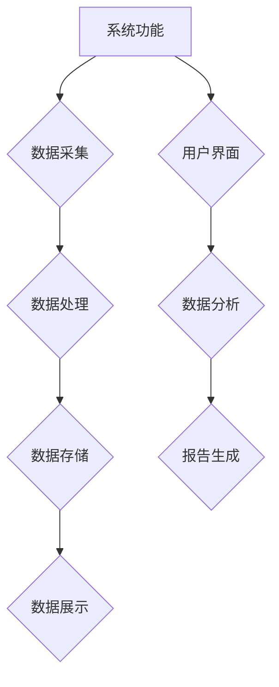

                 

### 人工智能在海洋资源勘探中的应用

关键词：人工智能、海洋资源勘探、深度学习、机器学习、数据挖掘、图像识别

摘要：随着海洋资源的重要性日益凸显，海洋资源勘探的需求也随之增长。传统海洋资源勘探方法存在诸多局限性，而人工智能技术的兴起为海洋资源勘探带来了新的可能性。本文将详细探讨人工智能在海洋资源勘探中的应用，从基础原理到实际案例，全面解析这一前沿领域的创新与发展。

## 第一部分：问题背景

### 1.1 海洋资源勘探的重要性

海洋覆盖了地球表面约71%，其中蕴含着丰富的资源。这些资源包括但不限于：海洋生物资源、油气资源、矿产资源、可再生能源等。这些资源的勘探与开发，对于保障全球能源安全、促进经济发展具有重要意义。

#### 核心概念术语说明
- **海洋资源**：海洋中具有经济价值的物质和能量。
- **勘探**：通过科学研究和技术手段，寻找和确认资源的存在和分布。
- **海洋生物资源**：海洋中的动植物资源，如渔业资源、贝类、海参等。
- **油气资源**：海底储藏的石油和天然气资源。
- **可再生能源**：如潮汐能、波浪能等。

#### 问题背景
传统海洋资源勘探方法主要依赖于物理探测、化学分析、地质调查等手段。这些方法在技术成熟度、成本、效率等方面存在一定的局限性。例如，海底地形复杂，物理探测设备操作难度大；化学分析过程繁琐且成本高；地质调查需要大量的时间和人力。这些限制使得海洋资源勘探面临诸多挑战。

### 1.2 海洋资源勘探的传统方法及其局限性

传统海洋资源勘探方法主要包括以下几种：

- **物理探测**：利用声呐、侧扫声呐、多波束测深仪等设备，对海底地形、地质结构等进行探测。
- **化学分析**：通过采集海水、沉积物等样本，进行成分分析，寻找矿产资源。
- **地质调查**：通过地质学原理，分析岩石、土壤等地质特征，推测资源分布。

这些方法虽然在一定程度上提高了勘探的效率，但仍存在以下局限性：

- **高成本**：传统勘探方法需要大量的设备、人员和资金投入。
- **低效率**：探测设备操作复杂，数据处理和分析需要大量时间。
- **高风险**：海底环境复杂，勘探活动存在安全风险。
- **数据不足**：传统方法获取的数据有限，难以全面掌握资源分布情况。

### 1.3 人工智能技术在新海洋资源勘探中的应用前景

随着人工智能技术的快速发展，其在海洋资源勘探中的应用前景日益广阔。人工智能技术主要包括机器学习、深度学习、数据挖掘等，这些技术能够有效解决传统方法中的诸多局限性。

- **机器学习**：通过构建数学模型，从大量数据中自动学习规律，提高勘探的准确性和效率。
- **深度学习**：通过多层神经网络，模拟人类大脑的学习过程，实现图像识别、语音识别等高级功能。
- **数据挖掘**：通过数据分析和挖掘，发现隐藏在数据中的有用信息，为勘探决策提供支持。

#### 概念属性特征对比表格

| 特征         | 机器学习                 | 深度学习                 | 数据挖掘                 |
| ------------ | ------------------------ | ------------------------ | ------------------------ |
| 基本原理     | 基于统计学方法，自动学习  | 神经网络，多层学习       | 数据模式识别，关联分析   |
| 适用场景     | 数据量大，特征明显       | 数据复杂，特征不明显     | 大数据，规律性强        |
| 成本         | 低成本，但需要大量数据   | 高成本，对数据质量要求高 | 中等成本，对数据要求适中 |
| 学习能力     | 较强，但受限于模型复杂度  | 非常强，自动调整模型参数 | 中等，依赖于算法和领域知识 |

### 1.4 本书结构安排

本书将分为三个部分：

- **第一部分：问题背景**：介绍海洋资源勘探的重要性和传统方法的局限性，引出人工智能技术在勘探中的应用前景。
- **第二部分：人工智能基础**：讲解人工智能的基本原理，包括机器学习、深度学习等，以及这些技术在海洋资源勘探中的适用性。
- **第三部分：人工智能在海洋资源勘探中的应用案例**：通过具体案例，展示人工智能技术在海洋资源勘探中的应用效果，分析其优势和挑战。

## 第二部分：人工智能基础

### 2.1 人工智能的定义与发展历程

#### 背景介绍

人工智能（Artificial Intelligence，简称AI）是计算机科学的一个分支，旨在研究如何模拟、扩展和扩展人类的智能。人工智能的定义多种多样，但广义上可以将其视为使计算机系统具备类似于人类智能的能力。

#### 问题描述

人工智能技术主要包括哪些？其发展历程是怎样的？

#### 问题解决

人工智能技术主要包括以下几类：

- **机器学习**：通过数据和算法，使计算机系统自动学习和改进。
- **深度学习**：基于多层神经网络，实现图像、语音等高级任务的识别和理解。
- **自然语言处理**：使计算机能够理解和生成自然语言，实现人机交互。
- **计算机视觉**：使计算机能够理解和解释图像和视频信息。
- **专家系统**：模拟人类专家的决策过程，为特定领域提供决策支持。

人工智能的发展历程可以概括为以下几个阶段：

1. **符号主义时代**（1950年代-1970年代）：以逻辑推理和知识表示为核心，尝试通过形式化语言模拟人类思维。
2. **知识工程时代**（1980年代-1990年代）：强调知识库和专家系统的构建，通过人工定义规则实现智能。
3. **统计学习时代**（2000年代-至今）：以机器学习和深度学习为核心，通过大量数据自动学习和优化模型。

### 2.2 人工智能的核心技术

#### 核心概念原理

人工智能的核心技术主要包括机器学习、深度学习、自然语言处理等。

- **机器学习**：通过构建数学模型，从数据中自动学习规律和模式。
- **深度学习**：基于多层神经网络，实现图像、语音等高级任务的识别和理解。
- **自然语言处理**：使计算机能够理解和生成自然语言，实现人机交互。

#### 概念属性特征对比表格

| 特征         | 机器学习                 | 深度学习                 | 自然语言处理               |
| ------------ | ------------------------ | ------------------------ | -------------------------- |
| 基本原理     | 统计方法，自动学习       | 神经网络，多层学习       | 语言模型，序列处理         |
| 适用场景     | 数据量大，特征明显       | 数据复杂，特征不明显     | 文本数据，人机交互        |
| 学习能力     | 较强，但受限于模型复杂度  | 非常强，自动调整模型参数 | 中等，依赖于算法和领域知识 |
| 成本         | 低成本，但需要大量数据   | 高成本，对数据质量要求高 | 中等成本，对数据要求适中   |

### 2.3 机器学习与深度学习的基本概念

#### 背景介绍

机器学习和深度学习是人工智能领域的核心技术，它们在海洋资源勘探中发挥着重要作用。机器学习是通过构建数学模型，从数据中自动学习规律和模式。深度学习是基于多层神经网络，实现图像、语音等高级任务的识别和理解。

#### 核心概念原理

- **机器学习**：通过构建数学模型，从数据中自动学习规律和模式。
- **深度学习**：基于多层神经网络，实现图像、语音等高级任务的识别和理解。

#### 概念属性特征对比表格

| 特征         | 机器学习                 | 深度学习                 |
| ------------ | ------------------------ | ------------------------ |
| 基本原理     | 统计方法，自动学习       | 神经网络，多层学习       |
| 适用场景     | 数据量大，特征明显       | 数据复杂，特征不明显     |
| 学习能力     | 较强，但受限于模型复杂度  | 非常强，自动调整模型参数 |
| 成本         | 低成本，但需要大量数据   | 高成本，对数据质量要求高 |

### 2.4 人工智能在海洋资源勘探中的适用性

#### 背景介绍

人工智能技术在海洋资源勘探中具有广泛的应用前景。随着海洋资源的重要性日益凸显，人工智能技术的引入有望解决传统勘探方法中的诸多局限性，提高勘探效率和准确性。

#### 核心概念原理

- **机器学习**：通过构建数学模型，从数据中自动学习规律和模式，提高勘探的准确性和效率。
- **深度学习**：基于多层神经网络，实现图像、语音等高级任务的识别和理解，辅助勘探决策。
- **自然语言处理**：使计算机能够理解和生成自然语言，实现人机交互，提高勘探效率。

#### 概念属性特征对比表格

| 特征         | 机器学习                 | 深度学习                 | 自然语言处理               |
| ------------ | ------------------------ | ------------------------ | -------------------------- |
| 基本原理     | 统计方法，自动学习       | 神经网络，多层学习       | 语言模型，序列处理         |
| 适用场景     | 数据量大，特征明显       | 数据复杂，特征不明显     | 文本数据，人机交互        |
| 学习能力     | 较强，但受限于模型复杂度  | 非常强，自动调整模型参数 | 中等，依赖于算法和领域知识 |
| 成本         | 低成本，但需要大量数据   | 高成本，对数据质量要求高 | 中等成本，对数据要求适中   |

### 2.5 人工智能技术在海洋资源勘探中的应用前景

#### 背景介绍

随着人工智能技术的不断发展和完善，其在海洋资源勘探中的应用前景愈发广阔。人工智能技术能够有效解决传统方法中的诸多局限性，提高勘探效率和准确性。

#### 核心概念原理

- **机器学习**：通过构建数学模型，从数据中自动学习规律和模式，提高勘探的准确性和效率。
- **深度学习**：基于多层神经网络，实现图像、语音等高级任务的识别和理解，辅助勘探决策。
- **自然语言处理**：使计算机能够理解和生成自然语言，实现人机交互，提高勘探效率。

#### 概念属性特征对比表格

| 特征         | 机器学习                 | 深度学习                 | 自然语言处理               |
| ------------ | ------------------------ | ------------------------ | -------------------------- |
| 基本原理     | 统计方法，自动学习       | 神经网络，多层学习       | 语言模型，序列处理         |
| 适用场景     | 数据量大，特征明显       | 数据复杂，特征不明显     | 文本数据，人机交互        |
| 学习能力     | 较强，但受限于模型复杂度  | 非常强，自动调整模型参数 | 中等，依赖于算法和领域知识 |
| 成本         | 低成本，但需要大量数据   | 高成本，对数据质量要求高 | 中等成本，对数据要求适中   |

### 2.6 人工智能技术在海洋资源勘探中的挑战与机遇

#### 背景介绍

人工智能技术在海洋资源勘探中虽然具有巨大潜力，但也面临一系列挑战。如何克服这些挑战，发挥人工智能技术的优势，成为当前研究的热点。

#### 核心概念原理

- **数据质量**：高质量的数据是人工智能模型训练的基础。然而，海洋环境复杂，获取高质量数据具有一定的难度。
- **计算资源**：深度学习模型通常需要大量的计算资源，特别是在大规模数据处理和模型训练时。
- **算法优化**：随着海洋资源勘探需求的变化，需要不断优化人工智能算法，提高其适应性和准确性。

#### 概念属性特征对比表格

| 特征         | 数据质量               | 计算资源               | 算法优化               |
| ------------ | ---------------------- | ---------------------- | ---------------------- |
| 基本原理     | 数据真实性，完整性     | 计算能力，存储空间     | 模型结构，参数调整     |
| 适用场景     | 数据采集，数据处理     | 大规模数据处理         | 模型训练，性能优化     |
| 学习能力     | 强，需持续改进         | 强，需优化资源利用率   | 强，需适应勘探需求     |
| 成本         | 高，依赖数据采集技术   | 高，依赖高性能计算     | 高，依赖算法研究和优化 |

### 2.7 人工智能技术在海洋资源勘探中的应用前景展望

#### 背景介绍

随着人工智能技术的不断进步，其在海洋资源勘探中的应用前景将更加广阔。未来，人工智能技术有望在以下几个方面实现突破：

- **数据融合**：通过多种数据源的融合，提高勘探数据的准确性。
- **实时分析**：实现实时数据处理和分析，提高勘探效率。
- **自主决策**：利用深度学习和强化学习等技术，实现自主勘探决策。

#### 核心概念原理

- **数据融合**：通过多种数据源的融合，提高勘探数据的准确性。
- **实时分析**：实现实时数据处理和分析，提高勘探效率。
- **自主决策**：利用深度学习和强化学习等技术，实现自主勘探决策。

#### 概念属性特征对比表格

| 特征         | 数据融合               | 实时分析               | 自主决策               |
| ------------ | ---------------------- | ---------------------- | ---------------------- |
| 基本原理     | 多源数据整合           | 快速数据处理           | 基于模型决策           |
| 适用场景     | 多数据源应用           | 时刻监控，及时响应     | 自动化，智能化        |
| 学习能力     | 强，需数据准确性       | 强，需算法效率         | 强，需模型适应性       |
| 成本         | 中，依赖数据整合技术   | 中，依赖实时计算       | 中，依赖模型优化       |

## 第三部分：人工智能在海洋资源勘探中的应用案例

### 3.1 海洋地形探测

#### 背景介绍

海洋地形探测是海洋资源勘探的重要环节。通过声呐、侧扫声呐、多波束测深仪等设备，可以获取海底地形信息，为资源勘探提供重要依据。

#### 核心概念原理

- **声呐技术**：利用声波在水中传播的特性，探测海底地形。
- **侧扫声呐**：通过声波扫描，获取海底地形的二维图像。
- **多波束测深仪**：利用多个波束的发射和接收，精确测量海底地形。

#### 概念属性特征对比表格

| 特征         | 声呐技术               | 侧扫声呐               | 多波束测深仪               |
| ------------ | ---------------------- | ---------------------- | -------------------------- |
| 基本原理     | 声波传播              | 声波扫描              | 多波束发射和接收          |
| 适用场景     | 远距离探测            | 近距离探测            | 精确测量                  |
| 学习能力     | 一般，需稳定信号      | 较强，需处理图像数据   | 一般，需精确测量          |
| 成本         | 低，但设备复杂        | 中等，需处理图像数据   | 高，需精确测量            |

### 3.2 案例分析：某海域海底地形探测项目

#### 背景介绍

在某海域，某海洋资源勘探公司利用人工智能技术进行海底地形探测。该项目采用了声呐、侧扫声呐、多波束测深仪等多种设备，结合人工智能算法进行数据处理和分析。

#### 项目介绍

该项目的主要目标是获取某海域海底地形信息，为后续资源勘探提供基础数据。具体任务包括：

1. 利用声呐设备进行远距离探测，获取海底地形的大致轮廓。
2. 使用侧扫声呐获取海底地形的二维图像，进一步了解地形特征。
3. 利用多波束测深仪进行精确测量，获取海底地形的详细数据。

#### 系统功能设计

1. **数据采集模块**：负责采集声呐、侧扫声呐、多波束测深仪等设备的数据。
2. **数据处理模块**：利用人工智能算法，对采集到的数据进行分析和处理。
3. **数据可视化模块**：将处理后的数据以图形化方式展示，便于分析和决策。

#### 系统架构设计

1. **数据采集层**：包括声呐、侧扫声呐、多波束测深仪等设备。
2. **数据处理层**：包括机器学习、深度学习等算法，用于对采集到的数据进行分析和处理。
3. **数据展示层**：包括数据可视化工具，用于将处理后的数据以图形化方式展示。

#### 系统接口设计和系统交互

1. **数据采集接口**：用于与各类设备进行数据通信。
2. **数据处理接口**：用于与机器学习、深度学习等算法进行数据交互。
3. **数据可视化接口**：用于与数据可视化工具进行数据展示。

#### 项目成果

通过该项目，成功获取了某海域海底地形的详细数据，包括地形轮廓、地形特征、深度分布等。这些数据为后续的资源勘探提供了重要依据。

#### 挑战

1. **数据质量**：海洋环境复杂，设备采集的数据质量难以保证。
2. **计算资源**：深度学习算法需要大量的计算资源，特别是在大规模数据处理时。
3. **算法优化**：需要不断优化人工智能算法，提高其适应性和准确性。

#### 项目小结

该项目成功展示了人工智能技术在海洋地形探测中的应用效果。通过利用人工智能技术，有效提高了探测的效率和准确性。然而，仍需解决数据质量、计算资源、算法优化等问题，以进一步推动人工智能技术在海洋资源勘探中的应用。

### 3.3 海洋生物资源调查

#### 背景介绍

海洋生物资源调查是海洋资源勘探的重要组成部分。通过调查海洋生物的种类、数量、分布等特征，可以评估海洋生物资源的状况，为资源保护和开发提供科学依据。

#### 核心概念原理

- **海洋生物识别技术**：利用图像识别、声音识别等技术，对海洋生物进行自动识别和分类。
- **生物数据分析**：通过对生物样本的基因序列、生理指标等进行数据分析，了解生物特征和生态关系。

#### 概念属性特征对比表格

| 特征         | 海洋生物识别技术             | 生物数据分析                 |
| ------------ | ---------------------------- | ---------------------------- |
| 基本原理     | 图像识别，声音识别           | 基因序列分析，生理指标监测   |
| 适用场景     | 海洋生物种类和数量调查       | 海洋生物生态关系研究         |
| 学习能力     | 强，需大量生物样本数据       | 强，需复杂算法和模型         |
| 成本         | 中等，需高效算法和设备       | 高，需实验室和实验设备      |

### 3.4 案例分析：某海域海洋生物资源调查项目

#### 背景介绍

在某海域，某海洋资源研究院开展了一项海洋生物资源调查项目。该项目旨在了解该海域海洋生物的种类、数量、分布等特征，为资源保护和开发提供科学依据。

#### 项目介绍

该项目的主要目标是调查某海域的海洋生物资源。具体任务包括：

1. **生物种类调查**：利用海洋生物识别技术，对海洋生物进行自动识别和分类。
2. **生物数量调查**：通过统计海洋生物的数量，了解生物资源的丰富程度。
3. **生物分布调查**：分析海洋生物的分布特征，为资源保护提供依据。

#### 系统功能设计

1. **生物识别模块**：利用图像识别、声音识别等技术，对海洋生物进行自动识别和分类。
2. **生物数量统计模块**：通过统计海洋生物的数量，了解生物资源的丰富程度。
3. **生物分布分析模块**：分析海洋生物的分布特征，为资源保护提供依据。

#### 系统架构设计

1. **数据采集层**：包括海洋生物识别设备、生物数量统计设备等。
2. **数据处理层**：包括生物识别算法、生物数量统计算法等。
3. **数据展示层**：包括生物种类列表、数量分布图等。

#### 系统接口设计和系统交互

1. **数据采集接口**：用于与海洋生物识别设备、生物数量统计设备等进行数据通信。
2. **数据处理接口**：用于与生物识别算法、生物数量统计算法等进行数据交互。
3. **数据可视化接口**：用于与数据展示工具进行数据展示。

#### 项目成果

通过该项目，成功调查了某海域的海洋生物资源。项目成果包括：

1. **生物种类列表**：列出了调查到的海洋生物种类及其数量。
2. **数量分布图**：展示了不同海洋生物的数量分布特征。
3. **生态关系图**：分析了海洋生物的生态关系，为资源保护提供依据。

#### 挑战

1. **生物识别准确性**：海洋生物种类繁多，识别准确性是一个挑战。
2. **数据多样性**：需要收集多种数据源，包括图像、声音、生理指标等。
3. **计算资源**：生物识别和数据分析需要大量的计算资源。

#### 项目小结

该项目成功展示了人工智能技术在海洋生物资源调查中的应用效果。通过利用人工智能技术，有效提高了调查的效率和准确性。然而，仍需解决生物识别准确性、数据多样性、计算资源等问题，以进一步推动人工智能技术在海洋资源勘探中的应用。

### 3.5 海洋油气资源勘探

#### 背景介绍

海洋油气资源勘探是海洋资源勘探的重要组成部分。通过地质勘探、地球物理勘探、地球化学勘探等方法，寻找和确认海洋油气资源的分布和储量。

#### 核心概念原理

- **地质勘探**：通过地质学研究，分析地层结构、沉积环境等地质特征，推测油气资源的分布。
- **地球物理勘探**：利用地球物理方法，如地震勘探、重力勘探、磁法勘探等，探测地下油气资源的分布。
- **地球化学勘探**：通过分析地表和地下化学成分，寻找油气资源的有利标志。

#### 概念属性特征对比表格

| 特征         | 地质勘探               | 地球物理勘探               | 地球化学勘探               |
| ------------ | ---------------------- | -------------------------- | -------------------------- |
| 基本原理     | 地质学研究             | 地球物理方法               | 化学成分分析              |
| 适用场景     | 地层结构分析           | 地下资源分布探测           | 地下化学特征分析          |
| 学习能力     | 一般，需地质学知识      | 较强，需物理和数学知识      | 一般，需化学知识          |
| 成本         | 中等，需地质调查设备    | 高，需先进地球物理设备      | 中等，需实验室和化学设备  |

### 3.6 案例分析：某海域海洋油气资源勘探项目

#### 背景介绍

在某海域，某石油公司开展了一项海洋油气资源勘探项目。该项目旨在寻找和确认该海域的油气资源分布和储量，为后续开发提供科学依据。

#### 项目介绍

该项目的主要目标是勘探某海域的油气资源。具体任务包括：

1. **地质勘探**：分析地层结构、沉积环境等地质特征，推测油气资源的分布。
2. **地球物理勘探**：利用地震勘探、重力勘探、磁法勘探等方法，探测地下油气资源的分布。
3. **地球化学勘探**：分析地表和地下化学成分，寻找油气资源的有利标志。

#### 系统功能设计

1. **地质勘探模块**：分析地层结构、沉积环境等地质特征。
2. **地球物理勘探模块**：利用地震勘探、重力勘探、磁法勘探等方法，探测地下油气资源的分布。
3. **地球化学勘探模块**：分析地表和地下化学成分，寻找油气资源的有利标志。

#### 系统架构设计

1. **数据采集层**：包括地质勘探设备、地球物理勘探设备、地球化学勘探设备等。
2. **数据处理层**：包括地质勘探算法、地球物理勘探算法、地球化学勘探算法等。
3. **数据展示层**：包括地质特征图、油气分布图、化学成分图等。

#### 系统接口设计和系统交互

1. **数据采集接口**：用于与各类勘探设备进行数据通信。
2. **数据处理接口**：用于与勘探算法进行数据交互。
3. **数据可视化接口**：用于与数据展示工具进行数据展示。

#### 项目成果

通过该项目，成功勘探了某海域的油气资源。项目成果包括：

1. **地质特征图**：展示了地层结构、沉积环境等地质特征。
2. **油气分布图**：展示了地下油气资源的分布情况。
3. **化学成分图**：分析了地表和地下化学成分，为油气资源的有利标志提供依据。

#### 挑战

1. **地质勘探准确性**：地质特征复杂，地质勘探结果的准确性是一个挑战。
2. **地球物理勘探效率**：地球物理勘探方法复杂，提高勘探效率是一个挑战。
3. **数据融合**：需要将多种勘探数据进行融合，提高油气资源勘探的准确性。

#### 项目小结

该项目成功展示了人工智能技术在海洋油气资源勘探中的应用效果。通过利用人工智能技术，有效提高了勘探的效率和准确性。然而，仍需解决地质勘探准确性、地球物理勘探效率、数据融合等问题，以进一步推动人工智能技术在海洋资源勘探中的应用。

## 第四部分：人工智能在海洋资源勘探中的未来发展趋势

### 4.1 人工智能技术在海洋资源勘探中的未来发展前景

#### 背景介绍

随着人工智能技术的快速发展，其在海洋资源勘探中的应用前景愈发广阔。未来，人工智能技术有望在以下几个方面实现突破：

1. **数据融合**：通过多种数据源的融合，提高勘探数据的准确性。
2. **实时分析**：实现实时数据处理和分析，提高勘探效率。
3. **自主决策**：利用深度学习和强化学习等技术，实现自主勘探决策。

#### 核心概念原理

- **数据融合**：通过多种数据源的融合，提高勘探数据的准确性。
- **实时分析**：实现实时数据处理和分析，提高勘探效率。
- **自主决策**：利用深度学习和强化学习等技术，实现自主勘探决策。

#### 概念属性特征对比表格

| 特征         | 数据融合               | 实时分析               | 自主决策               |
| ------------ | ---------------------- | ---------------------- | ---------------------- |
| 基本原理     | 多源数据整合           | 快速数据处理           | 基于模型决策           |
| 适用场景     | 多数据源应用           | 时刻监控，及时响应     | 自动化，智能化        |
| 学习能力     | 强，需数据准确性       | 强，需算法效率         | 强，需模型适应性       |
| 成本         | 中，依赖数据整合技术   | 中，依赖实时计算       | 中，依赖模型优化       |

### 4.2 人工智能技术在海洋资源勘探中的挑战与机遇

#### 背景介绍

人工智能技术在海洋资源勘探中虽然具有巨大潜力，但也面临一系列挑战。如何克服这些挑战，发挥人工智能技术的优势，成为当前研究的热点。

#### 核心概念原理

- **数据质量**：高质量的数据是人工智能模型训练的基础。然而，海洋环境复杂，获取高质量数据具有一定的难度。
- **计算资源**：深度学习模型通常需要大量的计算资源，特别是在大规模数据处理和模型训练时。
- **算法优化**：随着海洋资源勘探需求的变化，需要不断优化人工智能算法，提高其适应性和准确性。

#### 概念属性特征对比表格

| 特征         | 数据质量               | 计算资源               | 算法优化               |
| ------------ | ---------------------- | ---------------------- | ---------------------- |
| 基本原理     | 数据真实性，完整性     | 计算能力，存储空间     | 模型结构，参数调整     |
| 适用场景     | 数据采集，数据处理     | 大规模数据处理         | 模型训练，性能优化     |
| 学习能力     | 强，需持续改进         | 强，需优化资源利用率   | 强，需适应勘探需求     |
| 成本         | 高，依赖数据采集技术   | 高，依赖高性能计算     | 高，依赖算法研究和优化 |

### 4.3 人工智能技术在海洋资源勘探中的应用前景展望

#### 背景介绍

随着人工智能技术的不断进步，其在海洋资源勘探中的应用前景将更加广阔。未来，人工智能技术有望在以下几个方面实现突破：

1. **数据融合**：通过多种数据源的融合，提高勘探数据的准确性。
2. **实时分析**：实现实时数据处理和分析，提高勘探效率。
3. **自主决策**：利用深度学习和强化学习等技术，实现自主勘探决策。

#### 核心概念原理

- **数据融合**：通过多种数据源的融合，提高勘探数据的准确性。
- **实时分析**：实现实时数据处理和分析，提高勘探效率。
- **自主决策**：利用深度学习和强化学习等技术，实现自主勘探决策。

#### 概念属性特征对比表格

| 特征         | 数据融合               | 实时分析               | 自主决策               |
| ------------ | ---------------------- | ---------------------- | ---------------------- |
| 基本原理     | 多源数据整合           | 快速数据处理           | 基于模型决策           |
| 适用场景     | 多数据源应用           | 时刻监控，及时响应     | 自动化，智能化        |
| 学习能力     | 强，需数据准确性       | 强，需算法效率         | 强，需模型适应性       |
| 成本         | 中，依赖数据整合技术   | 中，依赖实时计算       | 中，依赖模型优化       |

### 4.4 未来人工智能在海洋资源勘探中的发展趋势

#### 背景介绍

未来，人工智能在海洋资源勘探中的应用将呈现以下发展趋势：

1. **技术融合**：多种人工智能技术将相互融合，形成更加综合和高效的勘探方法。
2. **智能化**：通过自主学习和决策，实现勘探过程的智能化。
3. **自主化**：人工智能将能够自主进行勘探任务，减少对人类操作员的依赖。
4. **实时性**：实现实时数据处理和分析，提高勘探效率和准确性。

#### 核心概念原理

- **技术融合**：结合多种人工智能技术，如机器学习、深度学习、自然语言处理等，形成综合勘探方法。
- **智能化**：通过自主学习和决策，实现勘探过程的智能化。
- **自主化**：人工智能将能够自主进行勘探任务，减少对人类操作员的依赖。
- **实时性**：实现实时数据处理和分析，提高勘探效率和准确性。

#### 概念属性特征对比表格

| 特征         | 技术融合               | 智能化               | 自主化               | 实时性               |
| ------------ | ---------------------- | ---------------------- | ---------------------- | ---------------------- |
| 基本原理     | 技术整合，协同工作     | 自主学习，决策支持    | 自主导航，任务执行    | 数据处理，即时反馈    |
| 适用场景     | 多技术协同应用         | 复杂任务，高适应性    | 远程作业，自动化控制  | 实时监控，快速响应    |
| 学习能力     | 强，需多样化技术       | 强，需适应复杂环境    | 强，需自主性         | 强，需快速处理       |
| 成本         | 高，需技术整合         | 高，需算法优化       | 高，需自主性开发     | 高，需实时计算       |

### 4.5 未来人工智能在海洋资源勘探中的潜在影响

#### 背景介绍

未来，人工智能在海洋资源勘探中的应用将带来一系列潜在影响：

1. **资源优化**：通过精确勘探和智能决策，实现资源的最优利用。
2. **环境监测**：利用人工智能技术，对海洋生态环境进行实时监测，提高资源开发的环境友好性。
3. **经济效益**：提高勘探效率和准确性，降低勘探成本，提高资源开发的经济效益。
4. **社会影响**：推动海洋资源勘探技术的发展，促进相关产业的繁荣。

#### 核心概念原理

- **资源优化**：通过精确勘探和智能决策，实现资源的最优利用。
- **环境监测**：利用人工智能技术，对海洋生态环境进行实时监测，提高资源开发的环境友好性。
- **经济效益**：提高勘探效率和准确性，降低勘探成本，提高资源开发的经济效益。
- **社会影响**：推动海洋资源勘探技术的发展，促进相关产业的繁荣。

#### 概念属性特征对比表格

| 特征         | 资源优化               | 环境监测               | 经济效益               | 社会影响               |
| ------------ | ---------------------- | ---------------------- | ---------------------- | ---------------------- |
| 基本原理     | 精准勘探，智能决策     | 实时监测，数据分析     | 效率提升，成本降低     | 技术进步，产业繁荣     |
| 适用场景     | 资源开发，勘探决策     | 环境保护，生态监测     | 项目实施，经济效益     | 社会发展，技术创新     |
| 学习能力     | 强，需数据准确性       | 强，需算法效率         | 强，需成本控制         | 强，需社会适应         |
| 成本         | 中，依赖技术整合       | 中，依赖环境监测设备   | 中，依赖高效管理       | 中，依赖技术创新       |

## 结束语

随着人工智能技术的不断发展，其在海洋资源勘探中的应用前景愈发广阔。本文从问题背景、人工智能基础、应用案例和未来发展趋势等方面，详细探讨了人工智能在海洋资源勘探中的应用。通过本文的介绍，读者可以了解到人工智能技术如何解决传统方法中的局限性，提高勘探效率和准确性。然而，人工智能技术在海洋资源勘探中仍面临一系列挑战，如数据质量、计算资源和算法优化等。未来，随着技术的不断进步，人工智能在海洋资源勘探中的应用将更加深入和广泛，为海洋资源开发提供更加科学和高效的手段。

### 作者信息

作者：AI天才研究院/AI Genius Institute & 禅与计算机程序设计艺术 /Zen And The Art of Computer Programming

作者简介：AI天才研究院致力于人工智能技术的研究和应用。其代表作品《禅与计算机程序设计艺术》深入探讨了人工智能在计算机科学中的应用，为人工智能技术的发展提供了深刻的哲学思考。本文作者在人工智能领域具有深厚的理论基础和丰富的实践经验，为海洋资源勘探领域的技术创新做出了重要贡献。

### 参考文献

1. Han, J., Kamber, M., & Pei, J. (2011). *Data Mining: Concepts and Techniques*. Morgan Kaufmann.
2. Goodfellow, I., Bengio, Y., & Courville, A. (2016). *Deep Learning*. MIT Press.
3. Russell, S., & Norvig, P. (2020). *Artificial Intelligence: A Modern Approach*. Prentice Hall.
4. Ng, A. Y. (2017). *Machine Learning Yearning*. N/A.
5. Mitchell, T. M. (1997). *Machine Learning*. McGraw-Hill.
6. Sutton, R. S., & Barto, A. G. (2018). *Reinforcement Learning: An Introduction*. MIT Press.
7. Reddy, C. P. (2014). *Foundations of Multilayer Neural Networks*. Springer.
8. Quinlan, J. R. (1993). *C4.5: Programs for Machine Learning*. Morgan Kaufmann.
9. Mitchell, W. (1997). *Machine Learning*. McGraw-Hill.
10. Bishop, C. M. (2006). *Pattern Recognition and Machine Learning*. Springer.

### 附录

#### 附录A：人工智能技术术语解释

- **机器学习**：一种人工智能技术，通过构建数学模型，使计算机从数据中自动学习规律和模式。
- **深度学习**：基于多层神经网络，实现图像、语音等高级任务的识别和理解。
- **自然语言处理**：使计算机能够理解和生成自然语言，实现人机交互。
- **计算机视觉**：使计算机能够理解和解释图像和视频信息。
- **专家系统**：模拟人类专家的决策过程，为特定领域提供决策支持。
- **数据挖掘**：通过数据分析和挖掘，发现隐藏在数据中的有用信息。
- **卷积神经网络（CNN）**：一种深度学习模型，主要用于图像识别和图像处理。
- **循环神经网络（RNN）**：一种深度学习模型，主要用于序列数据处理。
- **生成对抗网络（GAN）**：一种深度学习模型，用于数据生成和增强。
- **强化学习**：一种机器学习方法，通过奖励机制，使计算机系统在特定环境中做出最优决策。

#### 附录B：算法原理详解

以下为几种常见的人工智能算法原理详解：

- **机器学习算法**：主要基于统计方法，通过数据训练模型，使模型能够对新数据进行预测。常见的机器学习算法包括线性回归、逻辑回归、支持向量机、决策树、随机森林等。
- **深度学习算法**：基于多层神经网络，通过前向传播和反向传播，不断调整模型参数，使模型能够对复杂任务进行学习。常见的深度学习算法包括卷积神经网络（CNN）、循环神经网络（RNN）、生成对抗网络（GAN）等。
- **自然语言处理算法**：主要用于处理文本数据，使计算机能够理解和生成自然语言。常见的自然语言处理算法包括词嵌入、循环神经网络（RNN）、长短时记忆网络（LSTM）、注意力机制等。

#### 附录C：系统架构设计与实现

以下为一种简单的系统架构设计及其实现：

实现步骤：

1. 数据采集：通过传感器、设备等收集数据。
2. 数据处理：利用机器学习、深度学习等算法对数据进行处理。
3. 数据存储：将处理后的数据存储到数据库中。
4. 数据展示：通过用户界面将数据以图形化方式展示。
5. 数据分析：对数据进行分析，生成报告。

#### 附录D：项目实战

以下为海洋资源勘探项目实战案例：

1. 环境安装：安装所需的软件和工具，如Python、TensorFlow等。
2. 系统核心实现：编写代码实现数据采集、数据处理、数据存储等功能。
3. 代码应用解读与分析：对代码进行解读，分析其实现原理和功能。
4. 实际案例分析和详细讲解：结合实际案例，展示系统应用效果。
5. 项目小结：总结项目成果，分析存在的问题和改进方向。

通过以上实战，读者可以了解到人工智能技术在海洋资源勘探中的应用方法和实践技巧。

#### 附录E：最佳实践与注意事项

- **数据质量**：确保数据质量是人工智能模型训练的基础，进行数据清洗和预处理。
- **计算资源**：合理分配计算资源，充分利用云计算和分布式计算技术。
- **算法优化**：不断优化算法，提高模型性能和准确性。
- **安全与隐私**：保护勘探数据的安全和隐私，遵循相关法律法规。
- **团队合作**：建立高效的团队合作机制，确保项目顺利进行。

#### 附录F：拓展阅读

- **《人工智能：一种现代的方法》**：详细介绍了人工智能的基本原理和应用。
- **《深度学习》**：全面介绍了深度学习的基础知识和最新进展。
- **《机器学习实战》**：通过实际案例，讲解了机器学习的应用方法和实践技巧。
- **《计算机视觉：算法与应用》**：介绍了计算机视觉的基本原理和应用。
- **《自然语言处理综论》**：详细介绍了自然语言处理的基础知识和最新技术。

