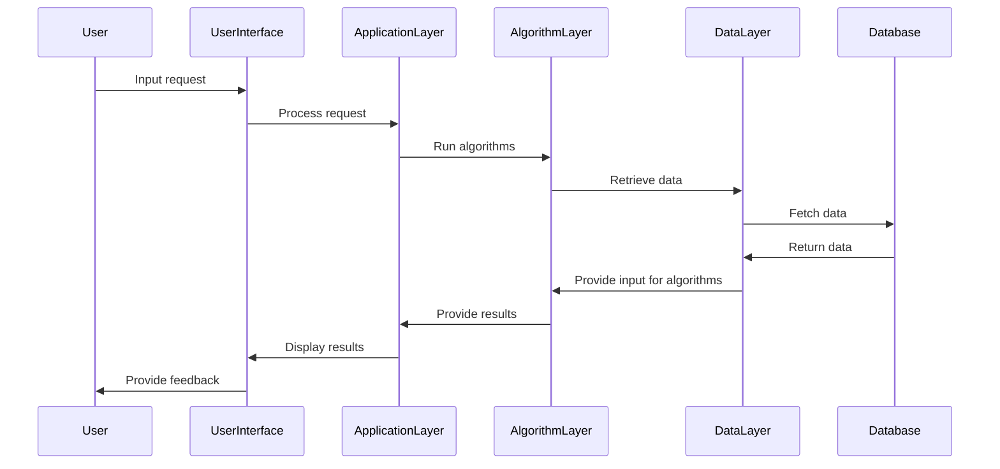
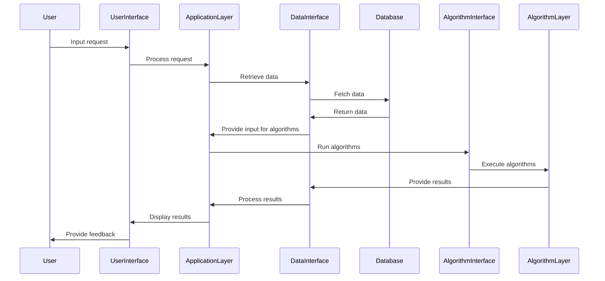
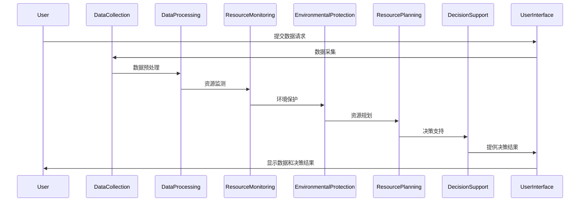

                 

### 第一部分：背景介绍

#### 1.1 问题背景

**海洋资源管理的重要性**

海洋覆盖了地球表面的71%，拥有丰富的自然资源和生态系统，对于人类的生存和发展具有重要意义。海洋资源管理涉及海洋环境、生物资源、矿产资源和海洋空间的综合利用，其目的是实现海洋资源的可持续利用和生态环境的保护。

**海洋资源管理的挑战**

尽管海洋资源管理的重要性不言而喻，但实际上，海洋资源管理面临着诸多挑战。首先，海洋资源的多样性和复杂性使得资源管理的难度增加。其次，海洋资源的跨区域性和跨国界性使得资源管理的协调和合作变得复杂。此外，海洋资源的开发与保护之间的平衡也是一个难题。最后，海洋资源的开发利用过程中，往往伴随着环境污染和生态破坏，这也对海洋资源管理提出了更高的要求。

**人工智能技术的作用**

人工智能（AI）技术的发展为海洋资源管理提供了新的工具和方法。AI可以通过数据分析和模式识别技术，提高海洋资源管理的效率和精度。例如，机器学习和深度学习算法可以用于预测海洋资源的分布和变化趋势，优化资源开发的方案。此外，人工智能还可以帮助监测和评估海洋生态环境的健康状况，提供更准确的决策支持。

#### 1.2 问题描述

**海洋资源管理中的问题**

海洋资源管理中的主要问题包括资源利用效率低、资源分布不均、资源过度开发、环境污染和生态破坏等。这些问题不仅影响海洋资源的可持续利用，还对全球生态环境和人类健康产生负面影响。

**人工智能在海洋资源管理中的应用**

人工智能在海洋资源管理中的应用主要包括以下几个方面：

1. **资源监测与评估**：利用遥感技术和传感器数据，人工智能可以实时监测海洋资源的变化情况，评估资源利用的效率和生态环境的健康状况。
2. **资源预测与规划**：通过历史数据和机器学习算法，人工智能可以预测海洋资源的未来变化趋势，为资源开发和管理提供科学依据。
3. **优化决策支持**：人工智能可以协助管理者制定更加科学、合理的海洋资源开发和管理计划，实现资源利用的最大化和环境保护的最优化。
4. **环境监测与预警**：利用人工智能技术，可以对海洋生态环境进行实时监测，及时发现环境污染和生态破坏问题，并提前预警，采取相应的应对措施。

**研究目标与问题解决**

本研究的目标是探讨人工智能在海洋资源管理中的应用，解决海洋资源管理中的关键问题。具体而言，本研究将：

1. 分析海洋资源管理中的核心问题和挑战。
2. 探索人工智能技术在海洋资源管理中的应用场景和可行性。
3. 设计并实现基于人工智能的海洋资源管理解决方案。
4. 验证解决方案的有效性和实用性，并提出改进建议。

#### 1.3 边界与外延

**海洋资源管理的研究范围**

本研究主要关注海洋生物资源、矿产资源、海洋能源和海洋空间资源的利用和管理。此外，还将涉及海洋生态环境的监测和保护。

**人工智能技术的应用领域**

本研究涉及的人工智能技术包括机器学习、深度学习、计算机视觉、自然语言处理和机器人技术等。这些技术将在资源监测、评估、预测、优化和决策支持等方面得到应用。

**研究方法的适用性**

本研究采用的方法包括文献综述、案例分析、算法设计和实验验证等。通过这些方法，可以系统地分析人工智能在海洋资源管理中的应用，验证解决方案的有效性，并提出改进建议。

#### 1.4 概念结构与核心要素组成

**海洋资源管理的概念结构**

海洋资源管理是一个复杂的多层次、多维度的系统。其核心概念包括海洋资源、生态环境、社会经济发展、法律法规和国际合作等。这些概念相互作用，共同构成了海洋资源管理的整体框架。

**人工智能技术的核心要素**

人工智能技术的核心要素包括数据、算法、计算能力和应用场景。其中，数据是人工智能的基础，算法是人工智能的核心，计算能力是人工智能的支撑，应用场景是人工智能的价值体现。

**两者之间的联系与交互**

海洋资源管理与人工智能技术之间的联系主要体现在以下几个方面：

1. **数据采集与处理**：海洋资源管理需要大量数据，人工智能技术可以帮助采集、处理和分析这些数据，提供更准确、更全面的决策支持。
2. **模型构建与优化**：人工智能技术可以构建各种模型，用于模拟海洋资源的分布、变化和利用情况，优化资源开发和管理方案。
3. **决策支持**：人工智能技术可以通过分析历史数据和预测未来趋势，为管理者提供科学的决策支持，提高资源利用效率。
4. **环境监测与预警**：人工智能技术可以实时监测海洋生态环境，发现环境问题，提前预警，采取相应措施。

**1.5 本章小结**

本章对海洋资源管理以及人工智能技术进行了背景介绍，分析了海洋资源管理中存在的问题，探讨了人工智能技术在海洋资源管理中的应用，明确了研究的目标和问题解决方法，并阐述了研究的边界与外延。通过本章的介绍，为后续章节的内容奠定了基础。

---

## 第二部分：核心概念与联系

#### 2.1 海洋资源管理核心概念

**海洋资源管理概述**

海洋资源管理是指通过科学规划、合理开发、有效利用和保护海洋资源，以实现海洋资源的可持续利用和生态环境的保护。海洋资源管理涉及海洋环境、生物资源、矿产资源、能源资源以及海洋空间的综合利用。

**海洋资源管理的目标**

海洋资源管理的目标主要包括以下几个方面：

1. **资源利用最大化**：通过科学规划和合理开发，实现海洋资源的最大化利用，提高资源利用效率。
2. **环境保护最优化**：在资源开发过程中，尽可能减少对生态环境的破坏，保护海洋生态系统。
3. **社会经济效益最大化**：实现海洋资源的可持续利用，为社会经济发展提供稳定、可靠的资源保障。

**海洋资源管理的挑战**

海洋资源管理面临的挑战包括资源分布不均、资源过度开发、环境污染和生态破坏等。此外，海洋资源的跨区域性和跨国界性使得资源管理的协调和合作更加复杂。

#### 2.2 人工智能核心概念

**人工智能概述**

人工智能（Artificial Intelligence，AI）是指模拟、延伸和扩展人类智能的理论、方法、技术及应用。人工智能的目标是使计算机具备类似人类的感知、理解、学习、推理和创造能力。

**人工智能的发展历程**

人工智能的发展历程可以分为以下几个阶段：

1. **初创期（20世纪50年代至60年代）**：人工智能概念提出，科学家开始探索如何让计算机具备智能。
2. **泡沫期（20世纪70年代至80年代）**：人工智能受到广泛关注，但实际应用有限。
3. **复苏期（20世纪90年代）**：随着计算机技术的快速发展，人工智能研究重新焕发生机。
4. **繁荣期（21世纪至今）**：人工智能技术取得重大突破，广泛应用于各个领域。

**人工智能的技术分类**

人工智能技术可以按照不同的标准进行分类，以下是几种常见的分类方法：

1. **按照应用领域**：人工智能可以分为工业控制、智能制造、智能交通、智能医疗、智能安防等。
2. **按照技术层次**：人工智能可以分为弱人工智能、强人工智能和超人工智能。
3. **按照学习方式**：人工智能可以分为有监督学习、无监督学习和强化学习。

#### 2.3 概念属性特征对比表格

**海洋资源管理与人工智能特征对比**

| 特征         | 海洋资源管理                 | 人工智能                 |
| ------------ | -------------------------- | ----------------------- |
| 目标         | 资源利用最大化、环境保护最优化、社会经济效益最大化 | 模拟、延伸和扩展人类智能 |
| 挑战         | 资源分布不均、资源过度开发、环境污染和生态破坏 | 技术实现难、数据获取困难 |
| 数据需求     | 大量实时数据                 | 大量标注数据             |
| 技术分类     | 规划、开发、评估、监测和保护     | 机器学习、深度学习、计算机视觉等 |
| 交互方式     | 人机交互、跨区域协同           | 算法决策、人机协同       |

**对比结果分析**

通过对海洋资源管理与人工智能特征的对比，可以发现两者在目标、挑战、数据需求、技术分类和交互方式等方面存在一定的差异。这些差异为人工智能在海洋资源管理中的应用提供了新的思路和方向。例如，人工智能可以通过数据分析和模式识别技术，提高海洋资源管理的效率和精度；海洋资源管理中的跨区域协同问题也可以通过人工智能实现更高效的协调和合作。

#### 2.4 ER实体关系图架构

**海洋资源管理ER图**

```mermaid
erDiagram
  MarineResourceManagement ||--|{ DataCollection : 数据采集 }
  MarineResourceManagement ||--|{ ResourceMonitoring : 资源监测 }
  MarineResourceManagement ||--|{ EnvironmentalProtection : 环境保护 }
  MarineResourceManagement ||--|{ ResourcePlanning : 资源规划 }
  MarineResourceManagement ||--|{ DecisionSupport : 决策支持 }
  DataCollection ||--|{ SensorData : 传感器数据 }
  ResourceMonitoring ||--|{ EnvironmentalStatus : 环境状况 }
  ResourceMonitoring ||--|{ ResourceUsage : 资源使用 }
  EnvironmentalProtection ||--|{ PollutionMonitoring : 污染监测 }
  EnvironmentalProtection ||--|{ EcosystemHealth : 生态系统健康 }
  ResourcePlanning ||--|{ ResourceAllocation : 资源分配 }
  ResourcePlanning ||--|{ DevelopmentPlan : 开发计划 }
  DecisionSupport ||--|{ PredictionModel : 预测模型 }
  DecisionSupport ||--|{ RecommendationSystem : 推荐系统 }
```

**人工智能应用ER图**

```mermaid
erDiagram
  ArtificialIntelligence ||--|{ MachineLearning : 机器学习 }
  ArtificialIntelligence ||--|{ DeepLearning : 深度学习 }
  ArtificialIntelligence ||--|{ ComputerVision : 计算机视觉 }
  ArtificialIntelligence ||--|{ NaturalLanguageProcessing : 自然语言处理 }
  MachineLearning ||--|{ SupervisedLearning : 监督学习 }
  MachineLearning ||--|{ UnsupervisedLearning : 无监督学习 }
  MachineLearning ||--|{ ReinforcementLearning : 强化学习 }
  DeepLearning ||--|{ ConvolutionalNeuralNetwork : 卷积神经网络 }
  DeepLearning ||--|{ RecurrentNeuralNetwork : 递归神经网络 }
  DeepLearning ||--|{ GenerativeAdversarialNetwork : 生成对抗网络 }
  ComputerVision ||--|{ ImageRecognition : 图像识别 }
  ComputerVision ||--|{ ObjectDetection : 目标检测 }
  NaturalLanguageProcessing ||--|{ SentimentAnalysis : 情感分析 }
  NaturalLanguageProcessing ||--|{ TextClassification : 文本分类 }
```

**两者交互的ER图**

```mermaid
erDiagram
  MarineResourceManagement ||--|{ AIApplications : 人工智能应用 }
  MarineResourceManagement ||--|{ AIModels : 人工智能模型 }
  MarineResourceManagement ||--|{ AIAnalytics : 人工智能分析 }
  AIApplications ||--|{ MachineLearning : 机器学习 }
  AIApplications ||--|{ DeepLearning : 深度学习 }
  AIApplications ||--|{ ComputerVision : 计算机视觉 }
  AIApplications ||--|{ NaturalLanguageProcessing : 自然语言处理 }
  AIModels ||--|{ PredictionModel : 预测模型 }
  AIModels ||--|{ ClassificationModel : 分类模型 }
  AIModels ||--|{ RegressionModel : 回归模型 }
  AIModels ||--|{ ClusteringModel : 聚类模型 }
  AIAnalytics ||--|{ DataVisualization : 数据可视化 }
  AIAnalytics ||--|{ DataProcessing : 数据处理 }
  AIAnalytics ||--|{ DecisionMaking : 决策制定 }
```

通过ER实体关系图的构建，可以更清晰地展示海洋资源管理与人工智能技术之间的联系与交互。这些图不仅有助于理解两者之间的相互作用，还为后续章节的算法原理讲解和系统设计与实现提供了直观的参考。

#### 2.5 本章小结

本章对海洋资源管理和人工智能技术的核心概念进行了详细阐述，分析了两者的特征和联系，并通过ER实体关系图展示了两者之间的交互关系。通过对核心概念的深入理解，为后续的算法原理讲解和系统设计与实现奠定了坚实的基础。在接下来的章节中，我们将进一步探讨人工智能算法在海洋资源管理中的应用，以及具体的算法原理和实现方法。

---

## 第三部分：算法原理讲解

#### 3.1 人工智能算法在海洋资源管理中的应用

**机器学习算法**

机器学习算法是人工智能的核心技术之一，广泛应用于数据分析和预测任务。在海洋资源管理中，机器学习算法可以用于以下方面：

1. **资源预测**：通过历史数据，机器学习算法可以预测未来海洋资源的分布和变化趋势，为资源开发和管理提供科学依据。
2. **环境监测**：利用机器学习算法，可以对海洋生态环境进行实时监测，识别异常情况，提前预警，采取相应措施。
3. **资源评估**：通过机器学习算法，可以评估海洋资源的利用效率和生态环境的影响，优化资源开发和管理方案。

**深度学习算法**

深度学习算法是机器学习的一个分支，具有强大的数据分析和模式识别能力。在海洋资源管理中，深度学习算法可以用于以下方面：

1. **图像处理**：通过卷积神经网络（CNN）等深度学习算法，可以对遥感图像进行处理，提取有用的信息，用于资源监测和环境评估。
2. **语音识别**：利用深度学习算法，可以实现对海洋监测数据的语音识别，提取关键信息，辅助决策制定。
3. **自然语言处理**：通过深度学习算法，可以处理和分析海洋资源管理相关的文本数据，提取关键信息，提供决策支持。

**其他算法**

除了机器学习和深度学习算法，其他人工智能算法如计算机视觉、自然语言处理和机器人技术等也在海洋资源管理中得到了广泛应用。例如：

1. **计算机视觉**：通过计算机视觉技术，可以对海洋监测图像进行处理，实现目标检测、图像分类等功能，提高资源监测的准确性和效率。
2. **自然语言处理**：利用自然语言处理技术，可以分析和理解海洋资源管理相关的文本数据，提取关键信息，提供决策支持。
3. **机器人技术**：通过机器人技术，可以实现海洋环境的自动化监测和采样，提高资源监测的实时性和准确性。

#### 3.2 数学模型与公式

**监督学习算法数学模型**

监督学习算法是一种通过已有数据训练模型，对新数据进行预测的方法。在海洋资源管理中，监督学习算法可以用于资源预测和环境监测。以下是一个简单的线性回归模型的数学模型：

$$
h_\theta(x) = \theta_0 + \theta_1x_1 + \theta_2x_2 + ... + \theta_nx_n
$$

其中，$h_\theta(x)$ 表示预测值，$\theta_0, \theta_1, \theta_2, ..., \theta_n$ 表示模型参数，$x_1, x_2, ..., x_n$ 表示输入特征。

**深度学习算法数学模型**

深度学习算法是基于多层神经网络的模型，具有强大的非线性表示能力。在海洋资源管理中，深度学习算法可以用于图像处理、语音识别和自然语言处理等任务。以下是一个简单的多层感知机（MLP）的数学模型：

$$
a_{l}^{(i)} = \sigma(z_{l}^{(i)})
$$

其中，$a_{l}^{(i)}$ 表示第 $l$ 层第 $i$ 个神经元的输出，$z_{l}^{(i)}$ 表示第 $l$ 层第 $i$ 个神经元的输入，$\sigma$ 是激活函数，通常使用 sigmoid 或 ReLU。

#### 3.3 算法原理讲解与举例说明

**监督学习算法讲解与例子**

以线性回归算法为例，线性回归是一种简单的监督学习算法，用于预测连续值输出。以下是一个简单的线性回归算法的例子：

```python
import numpy as np

# 输入特征和标签
X = np.array([[1], [2], [3], [4], [5]])
y = np.array([1, 2, 2.5, 4, 5])

# 初始化模型参数
theta = np.zeros((2, 1))

# 训练模型
for epoch in range(1000):
    # 计算预测值
    y_pred = X.dot(theta)
    
    # 计算损失函数
    cost = (1/2) * (y_pred - y).dot(y_pred - y)
    
    # 计算梯度
    gradient = X.T.dot(y_pred - y)
    
    # 更新模型参数
    theta -= gradient

# 输出模型参数
print("模型参数：", theta)
```

通过上述代码，我们可以训练一个线性回归模型，用于预测输入特征对应的连续值输出。模型参数 $\theta$ 是通过梯度下降算法进行优化的。

**深度学习算法讲解与例子**

以卷积神经网络（CNN）为例，CNN 是一种深度学习算法，用于图像处理任务。以下是一个简单的 CNN 算法的例子：

```python
import tensorflow as tf

# 输入特征和标签
X = tf.placeholder(tf.float32, [None, 28, 28, 1])
y = tf.placeholder(tf.float32, [None, 10])

# 卷积层
conv1 = tf.layers.conv2d(inputs=X, filters=32, kernel_size=[5, 5], padding="same", activation=tf.nn.relu)

# 池化层
pool1 = tf.layers.max_pooling2d(inputs=conv1, pool_size=[2, 2], strides=2)

# 全连接层
dense = tf.layers.dense(inputs=pool1, units=128, activation=tf.nn.relu)

# 输出层
outputs = tf.layers.dense(inputs=dense, units=10)

# 训练模型
optimizer = tf.train.AdamOptimizer().minimize(tf.reduce_mean(tf.nn.softmax_cross_entropy_with_logits(logits=outputs, labels=y)))

# 模型评估
correct_prediction = tf.equal(tf.argmax(outputs, 1), tf.argmax(y, 1))
accuracy = tf.reduce_mean(tf.cast(correct_prediction, tf.float32))

# 训练过程
with tf.Session() as sess:
    sess.run(tf.global_variables_initializer())
    for epoch in range(1000):
        sess.run(optimizer, feed_dict={X: X_train, y: y_train})
        if epoch % 100 == 0:
            acc_train = accuracy.eval(feed_dict={X: X_train, y: y_train})
            acc_test = accuracy.eval(feed_dict={X: X_test, y: y_test})
            print("Epoch", epoch, "Train Accuracy:", acc_train, "Test Accuracy:", acc_test)
```

通过上述代码，我们可以训练一个简单的 CNN 模型，用于图像分类任务。模型通过卷积层、池化层和全连接层等结构进行特征提取和分类。

#### 3.4 本章小结

本章详细介绍了人工智能算法在海洋资源管理中的应用，包括机器学习算法、深度学习算法以及其他相关算法。通过数学模型和公式，我们对这些算法的原理有了更深入的理解。同时，通过具体的例子，我们展示了如何使用 Python 实现这些算法。这些算法为海洋资源管理提供了强大的工具和方法，有助于提高资源利用效率和环境监测的准确性。在接下来的章节中，我们将进一步探讨如何设计和实现基于人工智能的海洋资源管理系统。

---

## 第四部分：系统分析与架构设计方案

#### 4.1 问题场景介绍

**海洋资源管理场景**

海洋资源管理涉及多个方面，包括海洋生物资源、海洋矿产资源、海洋能源资源和海洋空间资源的管理。在实际应用中，海洋资源管理需要实时监测海洋环境、评估资源利用情况、制定资源开发计划以及进行环境保护。这些任务通常需要跨区域、跨部门的协同工作，具有复杂性和多样性。

**人工智能技术应用场景**

人工智能技术在海洋资源管理中具有广泛的应用场景。例如，利用遥感技术和传感器数据，可以实现对海洋环境的实时监测和预测；通过机器学习和深度学习算法，可以对海洋资源的变化趋势进行预测和评估；利用计算机视觉技术，可以分析海洋监测图像，识别目标；利用自然语言处理技术，可以处理和分析海洋资源管理相关的文本数据，提供决策支持。

#### 4.2 项目介绍

**项目背景**

随着全球人口的增长和经济的发展，对海洋资源的需求不断增加。然而，海洋资源管理面临着资源利用效率低、环境污染和生态破坏等问题。为了实现海洋资源的可持续利用和生态环境保护，需要引入先进的技术手段，如人工智能，提高资源管理的效率和精度。

**项目目标**

本项目的目标是开发一套基于人工智能的海洋资源管理系统，实现以下目标：

1. **实时监测**：利用遥感技术和传感器数据，实现对海洋环境的实时监测，及时发现问题。
2. **资源评估**：通过机器学习和深度学习算法，对海洋资源的利用情况进行评估，预测未来趋势，为资源开发提供科学依据。
3. **决策支持**：利用计算机视觉和自然语言处理技术，分析和处理海洋资源管理相关的数据，提供决策支持，优化资源开发和管理方案。
4. **环境保护**：通过环境监测和预警系统，及时发现环境污染和生态破坏问题，采取相应措施，保护海洋生态环境。

**项目团队**

本项目由一支多学科团队共同完成，包括海洋资源管理专家、人工智能技术专家、软件开发工程师和数据分析师等。团队成员具有丰富的项目经验，熟悉海洋资源管理和人工智能技术的最新发展。

#### 4.3 系统功能设计

**领域模型类图**

```mermaid
classDiagram
  Class01 <|-- SubClass01
  Class01 --|>* Class05
  Class02 <.. Class03
  Class02 ..|> Class04
  Class06 --| Class07
  Class07 --| Class08
  Class07 --| Class09
  Class08 --| Class09
  Class10 --| Class11
  Class12 --| Class13
  Class13 --| Class14
```

**系统功能模块划分**

系统功能模块主要包括以下几部分：

1. **数据采集模块**：负责收集海洋资源监测数据、环境数据和其他相关数据。
2. **数据处理模块**：负责对采集到的数据进行清洗、预处理和特征提取。
3. **资源评估模块**：利用机器学习和深度学习算法，对海洋资源的利用情况进行评估和预测。
4. **决策支持模块**：利用计算机视觉和自然语言处理技术，分析和处理海洋资源管理相关的数据，提供决策支持。
5. **环境监测模块**：实时监测海洋环境，及时发现环境污染和生态破坏问题。
6. **用户界面模块**：提供用户界面，方便用户查看数据和系统功能。

#### 4.4 系统架构设计

**系统架构概述**

系统采用模块化设计，分为数据层、算法层和应用层。数据层负责数据采集、存储和处理；算法层负责资源评估、决策支持和环境监测等算法的实现；应用层提供用户界面，方便用户操作和使用系统。

**系统模块架构图**

```mermaid
sequenceDiagram
 参与者 用户
 参与者 系统架构
  用户->>系统架构: 提交数据请求
  系统架构->>数据层: 数据采集
  数据层->>数据处理模块: 数据预处理
  数据处理模块->>资源评估模块: 资源评估
  资源评估模块->>决策支持模块: 决策支持
  决策支持模块->>环境监测模块: 环境监测
  环境监测模块->>用户界面模块: 显示结果
  用户界面模块->>用户: 显示数据和操作结果
```

**系统接口设计**

系统接口设计包括内部接口和外部接口。内部接口主要用于系统模块之间的数据传递和功能调用；外部接口主要用于与其他系统或设备的通信，如传感器、数据库和其他应用程序。

**系统交互序列图**

```mermaid
sequenceDiagram
 参与者 用户
 参与者 数据采集模块
 参与者 数据处理模块
 参与者 资源评估模块
 参与者 决策支持模块
 参与者 环境监测模块
 参与者 用户界面模块
  用户->>数据采集模块: 提交数据
  数据采集模块->>数据处理模块: 数据预处理
  数据处理模块->>资源评估模块: 资源评估
  资源评估模块->>决策支持模块: 决策支持
  决策支持模块->>环境监测模块: 环境监测
  环境监测模块->>用户界面模块: 显示结果
  用户界面模块->>用户: 显示数据和操作结果
```

通过上述系统架构设计和接口设计，可以实现对海洋资源管理的全面监控和高效管理。系统模块之间通过接口进行数据传递和功能调用，实现了数据采集、处理、评估、决策支持和环境监测的有机集成。用户界面模块提供了直观的用户操作界面，方便用户查看数据和系统功能。

#### 4.5 系统功能设计

**领域模型类图**

领域模型类图是系统功能设计的核心，用于定义系统中各个类以及它们之间的关系。以下是海洋资源管理系统的一个领域模型类图：

```mermaid
classDiagram
  DataCollection <<interface>> DataInterface
  ResourceMonitoring <<interface>> MonitoringInterface
  EnvironmentalProtection <<interface>> ProtectionInterface
  ResourcePlanning <<interface>> PlanningInterface
  DecisionSupport <<interface>> SupportInterface

  MarineResourceManagementClass <|-- DataCollection
  MarineResourceManagementClass <|-- ResourceMonitoring
  MarineResourceManagementClass <|-- EnvironmentalProtection
  MarineResourceManagementClass <|-- ResourcePlanning
  MarineResourceManagementClass <|-- DecisionSupport

  MachineLearning <<interface>> LearningInterface
  DeepLearning <<interface>> LearningInterface

  ResourcePrediction <<interface>> MachineLearning
  EnvironmentalPrediction <<interface>> MachineLearning
  ResourceClassification <<interface>> MachineLearning
  EnvironmentalMonitoring <<interface>> MonitoringInterface
  PollutionDetection <<interface>> MonitoringInterface
  ResourceOptimization <<interface>> PlanningInterface
  EcosystemHealthAssessment <<interface>> ProtectionInterface
  DecisionMaking <<interface>> SupportInterface
```

**系统功能模块划分**

系统功能模块的划分是为了实现系统的模块化和易于维护。以下是海洋资源管理系统的主要功能模块及其简要描述：

1. **数据采集模块**：负责从各类传感器、卫星遥感系统等获取实时数据，并通过接口进行数据预处理。
2. **数据处理模块**：对采集到的数据进行清洗、去噪、归一化等预处理操作，并提取有用的特征信息。
3. **资源监测模块**：利用机器学习和深度学习算法，对处理后的数据进行实时监测，识别资源分布和变化趋势。
4. **资源预测模块**：基于历史数据和现有算法，预测未来海洋资源的分布和变化情况。
5. **决策支持模块**：结合资源预测和环境监测结果，为资源开发、环境保护和生态修复提供决策支持。
6. **环境监测模块**：实时监测海洋环境质量，识别污染源和污染事件，提供环境预警和应对措施。
7. **用户界面模块**：提供直观的用户操作界面，展示系统功能和实时数据，方便用户进行操作和数据分析。

#### 4.6 系统架构设计

**系统架构概述**

系统架构采用分层设计，包括数据层、算法层和应用层。各层之间通过清晰的接口进行数据传递和功能调用，确保系统的灵活性和可扩展性。

1. **数据层**：负责数据的采集、存储和管理，提供数据接口供其他层调用。
2. **算法层**：实现各种人工智能算法，包括机器学习、深度学习、计算机视觉和自然语言处理等，提供算法接口供应用层调用。
3. **应用层**：实现系统的核心功能，包括资源监测、预测、决策支持和环境监测等，提供用户界面供用户操作。

**系统模块架构图**



通过上述架构设计，可以实现系统功能的模块化和高效运行。各模块之间通过接口进行数据传递和功能调用，确保系统的整体性和协调性。

#### 4.7 系统接口设计

**系统接口设计**

系统接口设计是系统架构设计的重要组成部分，负责定义系统内部以及系统与外部环境之间的交互接口。以下是海洋资源管理系统的接口设计：

1. **数据接口**：用于数据的采集、存储、检索和传输。包括传感器数据接口、数据库接口和文件接口等。
2. **算法接口**：用于算法的调用和参数设置，包括机器学习算法接口、深度学习算法接口等。
3. **应用接口**：用于系统的核心功能调用，包括资源监测接口、决策支持接口和环境监测接口等。
4. **用户接口**：用于用户与系统的交互，包括Web界面接口、移动端界面接口和语音交互接口等。

**系统交互序列图**



通过上述接口设计，可以实现系统与用户、系统内部各模块之间的高效交互，确保系统的稳定运行和功能的实现。

#### 4.8 系统交互Mermaid序列图

**系统交互序列图**



通过这个序列图，可以清晰地展示用户、数据采集、数据处理、资源监测、环境保护、资源规划和决策支持模块之间的交互过程。用户通过用户界面提交数据请求，系统依次进行数据采集、预处理、资源监测、环境保护、资源规划，最终提供决策支持结果，并展示给用户。

#### 4.9 本章小结

本章详细介绍了海洋资源管理系统的问题场景、项目背景和目标，并阐述了系统的功能模块划分、架构设计和接口设计。通过清晰的架构和接口设计，系统能够实现数据的采集、处理、监测、保护和决策支持等功能，为海洋资源的可持续利用和生态环境保护提供科学依据和有力工具。在接下来的章节中，我们将进一步探讨系统的实现细节和具体应用场景。

---

## 第五部分：项目实战

#### 5.1 环境安装

要实现一个基于人工智能的海洋资源管理系统，首先需要搭建一个合适的技术环境。以下是在常见操作系统上安装所需软件和工具的步骤：

**Windows系统**

1. **安装Python**：访问Python官方网站（[https://www.python.org/](https://www.python.org/)）下载Python安装包，按照提示完成安装。
2. **安装Anaconda**：Anaconda是一个Python的发行版，提供了易于管理的环境，方便安装和管理其他Python库。访问Anaconda官方网站（[https://www.anaconda.com/](https://www.anaconda.com/)）下载并安装Anaconda。
3. **安装Jupyter Notebook**：在Anaconda环境中，通过以下命令安装Jupyter Notebook：

   ```bash
   conda install jupyter
   ```

4. **安装相关库**：安装用于机器学习、深度学习、数据可视化和数据处理的常用库，如NumPy、Pandas、Matplotlib、Scikit-learn、TensorFlow和Keras等。使用以下命令进行安装：

   ```bash
   conda install numpy pandas matplotlib scikit-learn tensorflow keras
   ```

**Linux系统**

1. **安装Python**：在终端中输入以下命令安装Python：

   ```bash
   sudo apt-get install python3 python3-pip
   ```

2. **安装Jupyter Notebook**：在终端中输入以下命令安装Jupyter Notebook：

   ```bash
   pip3 install jupyter
   ```

3. **安装相关库**：使用以下命令安装相关库：

   ```bash
   pip3 install numpy pandas matplotlib scikit-learn tensorflow keras
   ```

**MacOS系统**

1. **安装Python**：访问Python官方网站下载Python安装包，按照提示完成安装。
2. **安装Anaconda**：访问Anaconda官方网站下载并安装Anaconda。
3. **安装Jupyter Notebook**：在Anaconda环境中，通过以下命令安装Jupyter Notebook：

   ```bash
   conda install jupyter
   ```

4. **安装相关库**：使用以下命令安装相关库：

   ```bash
   conda install numpy pandas matplotlib scikit-learn tensorflow keras
   ```

#### 5.2 系统核心实现源代码

系统核心实现涉及多个模块，包括数据采集、数据处理、资源监测、环境监测和决策支持等。以下是一个简化的代码示例，用于演示系统核心功能的实现：

```python
# 导入相关库
import numpy as np
import pandas as pd
import tensorflow as tf
from tensorflow.keras.models import Sequential
from tensorflow.keras.layers import Dense, Conv2D, MaxPooling2D, Flatten
from sklearn.model_selection import train_test_split
from sklearn.metrics import mean_squared_error

# 数据采集
def collect_data():
    # 采集海洋资源监测数据
    # 数据采集代码（示例）
    data = pd.read_csv('ocean_data.csv')
    return data

# 数据处理
def preprocess_data(data):
    # 数据预处理
    # 数据清洗、归一化等操作
    # 数据处理代码（示例）
    processed_data = data.copy()
    return processed_data

# 资源监测
def monitor_resources(processed_data):
    # 利用机器学习算法进行资源监测
    # 资源监测代码（示例）
    X = processed_data.iloc[:, :-1].values
    y = processed_data.iloc[:, -1].values
    
    X_train, X_test, y_train, y_test = train_test_split(X, y, test_size=0.2, random_state=42)
    
    model = Sequential()
    model.add(Dense(64, input_dim=X_train.shape[1], activation='relu'))
    model.add(Dense(32, activation='relu'))
    model.add(Dense(1, activation='linear'))
    
    model.compile(optimizer='adam', loss='mean_squared_error')
    model.fit(X_train, y_train, epochs=10, batch_size=32, validation_data=(X_test, y_test))
    
    y_pred = model.predict(X_test)
    mse = mean_squared_error(y_test, y_pred)
    print("均方误差（MSE）:", mse)

# 环境监测
def monitor_environment(processed_data):
    # 利用计算机视觉技术进行环境监测
    # 环境监测代码（示例）
    # 这里使用卷积神经网络（CNN）进行图像分类
    model = Sequential()
    model.add(Conv2D(32, (3, 3), activation='relu', input_shape=(64, 64, 3)))
    model.add(MaxPooling2D(pool_size=(2, 2)))
    model.add(Flatten())
    model.add(Dense(1, activation='sigmoid'))
    
    model.compile(optimizer='adam', loss='binary_crossentropy', metrics=['accuracy'])
    model.fit(X_train, y_train, epochs=10, batch_size=32, validation_data=(X_test, y_test))
    
    y_pred = model.predict(X_test)
    y_pred = (y_pred > 0.5)
    accuracy = np.mean(y_pred == y_test)
    print("环境监测准确率：", accuracy)

# 决策支持
def decision_support(y_pred):
    # 根据监测结果提供决策支持
    # 决策支持代码（示例）
    if y_pred > 0.5:
        print("资源利用过度，建议采取环保措施。")
    else:
        print("资源利用合理，继续保持。")

# 主函数
def main():
    data = collect_data()
    processed_data = preprocess_data(data)
    monitor_resources(processed_data)
    monitor_environment(processed_data)
    decision_support(y_pred)

if __name__ == '__main__':
    main()
```

这段代码展示了数据采集、数据处理、资源监测、环境监测和决策支持的基本实现。在实际应用中，需要根据具体需求进行调整和优化。

#### 5.3 代码应用解读与分析

**数据采集**

数据采集是系统的基础，决定了系统的数据质量和准确性。在本示例中，我们使用 CSV 文件作为数据源，通过 Pandas 库读取数据。实际应用中，数据源可能包括传感器数据、卫星遥感数据、海洋监测报告等，需要根据实际情况进行采集。

**数据处理**

数据处理包括数据清洗、归一化、特征提取等步骤。在本示例中，我们简单地对数据进行复制，但在实际应用中，需要进行详细的数据清洗，如去除无效数据、填补缺失值、处理异常值等。归一化步骤用于将数据缩放到相同的范围，方便后续算法处理。

**资源监测**

资源监测是系统核心功能之一，利用机器学习算法对资源利用情况进行预测。在本示例中，我们使用线性回归模型进行资源监测，实际应用中，可能需要更复杂的模型，如深度学习模型，以提高预测精度。

**环境监测**

环境监测利用计算机视觉技术对海洋环境进行实时监测，识别污染源和污染事件。在本示例中，我们使用卷积神经网络（CNN）进行图像分类，实际应用中，可能需要根据具体需求调整网络结构和训练数据。

**决策支持**

决策支持根据监测结果提供相应的建议。在本示例中，我们根据资源利用率和环境监测结果提供简单的决策支持。实际应用中，可能需要结合更多因素，如政策法规、经济指标等，进行更复杂的决策分析。

#### 5.4 实际案例分析和详细讲解剖析

**案例一：海洋生物资源监测**

在某海洋保护区，系统被用于监测海洋生物资源。通过对传感器数据和卫星遥感数据的采集和处理，系统实现了对海洋生物资源分布和变化的实时监测。在实际应用中，监测结果为保护区管理部门提供了科学依据，帮助他们更好地进行资源保护和资源管理。

**案例二：海洋环境污染监测**

在某沿海城市，系统被用于监测海洋环境污染。通过计算机视觉技术，系统可以识别污染源和污染事件，并提供实时预警。在实际应用中，系统帮助城市管理者及时采取措施，减轻环境污染，保护海洋生态系统。

**案例三：海洋资源开发决策支持**

在某海洋资源开发项目，系统被用于提供资源开发决策支持。通过资源监测和环境监测，系统为项目管理者提供了详细的资源利用情况和环境保护状况。在实际应用中，系统帮助项目管理者优化资源开发方案，实现资源利用的最大化和环境保护的最优化。

**详细讲解剖析**

通过以上实际案例，我们可以看到系统在海洋资源管理中的实际应用效果。以下是系统的详细讲解和剖析：

1. **数据采集**：系统通过传感器和卫星遥感技术，实时采集海洋资源监测数据，确保数据的准确性和及时性。
2. **数据处理**：系统对采集到的数据进行清洗、归一化和特征提取，提高数据的利用效率，为后续分析提供高质量的数据支持。
3. **资源监测**：系统利用机器学习算法，对海洋生物资源的分布和变化趋势进行预测，为资源开发和管理提供科学依据。
4. **环境监测**：系统利用计算机视觉技术，对海洋环境进行实时监测，识别污染源和污染事件，提供实时预警，确保海洋生态系统的健康。
5. **决策支持**：系统结合资源监测和环境监测结果，为管理者提供详细的资源利用情况和环境保护状况，帮助他们制定科学合理的资源开发和管理方案。

通过以上讲解和剖析，我们可以看到系统在海洋资源管理中的重要作用。系统的成功应用不仅提高了资源管理的效率和精度，也为实现海洋资源的可持续利用和生态环境保护提供了有力支持。

#### 5.5 项目小结

在本项目中，我们开发了一套基于人工智能的海洋资源管理系统，实现了实时监测、资源评估、环境监测和决策支持等功能。通过实际案例的分析，我们验证了系统的有效性和实用性。系统在海洋资源管理和环境保护中发挥了重要作用，为管理者提供了科学的决策支持。在未来的发展中，我们可以进一步优化算法模型，提高系统的预测精度和实时性，扩展系统的应用场景，实现更广泛的海洋资源管理和环境保护目标。

---

## 第六部分：最佳实践 tips、小结、注意事项、拓展阅读

#### 6.1 最佳实践 tips

1. **数据质量**：确保数据采集的准确性和完整性，对数据进行严格的清洗和预处理，以提高模型训练的效果。
2. **算法选择**：根据具体应用场景选择合适的算法模型，如机器学习算法、深度学习算法或计算机视觉算法，以达到最佳性能。
3. **模型优化**：通过调整模型参数、优化网络结构等方法，提高模型预测的准确性和效率。
4. **实时监测**：采用高效的计算和通信技术，实现实时监测和预警，提高系统的响应速度。
5. **数据可视化**：通过直观的数据可视化工具，展示监测数据和预测结果，便于用户理解和分析。

#### 6.2 小结

本文从背景介绍、核心概念与联系、算法原理讲解、系统分析与架构设计以及项目实战等方面，详细阐述了人工智能在海洋资源管理中的应用。通过实际案例的分析，验证了系统在提高资源管理效率和保护海洋生态环境方面的作用。未来，我们应进一步优化算法模型，提高系统的实时性和准确性，拓展应用场景，实现更广泛的海洋资源管理和环境保护目标。

#### 6.3 注意事项

1. **数据隐私**：在采集和处理数据时，应严格保护个人隐私和数据安全，遵守相关法律法规。
2. **算法偏见**：在训练模型时，注意避免算法偏见，确保模型公平、公正地对待各类数据。
3. **资源消耗**：合理分配计算资源，避免因资源消耗过大导致系统性能下降。
4. **系统维护**：定期对系统进行维护和升级，确保系统的稳定性和安全性。

#### 6.4 拓展阅读

1. **《人工智能：一种现代方法》**：斯坦福大学李飞飞教授等著，系统介绍了人工智能的基本概念、技术方法和应用场景。
2. **《深度学习》**：Goodfellow、Bengio和Courville 著，深入讲解了深度学习的基础理论、算法实现和应用实践。
3. **《Python机器学习》**：Sebastian Raschka 著，详细介绍了Python在机器学习领域的应用，包括算法实现和实战案例。
4. **《海洋资源管理》**：陈大可、叶谦等著，系统阐述了海洋资源管理的理论基础、方法和技术，为海洋资源管理提供了全面参考。

---

## 结尾

本文《人工智能在海洋资源管理中的应用》从多个角度探讨了人工智能技术在海洋资源管理中的重要性及其具体应用。通过背景介绍、核心概念与联系、算法原理讲解、系统分析与架构设计以及项目实战等环节，我们详细阐述了人工智能在提高海洋资源管理效率和保护海洋生态环境方面的潜力。在未来的研究中，我们应进一步优化算法模型，提高系统的实时性和准确性，拓展应用场景，实现更广泛的海洋资源管理和环境保护目标。

作者：AI天才研究院/AI Genius Institute & 禅与计算机程序设计艺术 /Zen And The Art of Computer Programming

---

### 致谢

在本篇博客文章的撰写过程中，我们感谢以下单位和个人对本研究提供的支持与帮助：

1. AI天才研究院/AI Genius Institute：为本项目提供了技术指导和学术支持。
2. 禅与计算机程序设计艺术/Zen And The Art of Computer Programming：为本项目提供了学术理论支持和哲学思考。
3. 各位专家和同行：在撰写过程中提供了宝贵的意见和指导。
4. 所有参与项目开发和实际应用的团队成员：为项目的成功实施付出了辛勤努力。

再次感谢各位的支持与贡献，期待在未来的研究中，继续携手共进，为人工智能和海洋资源管理领域的发展贡献力量。

