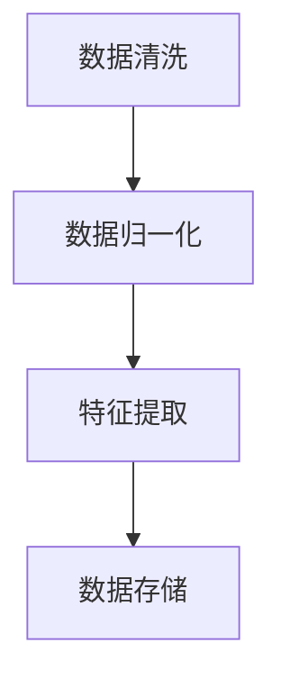
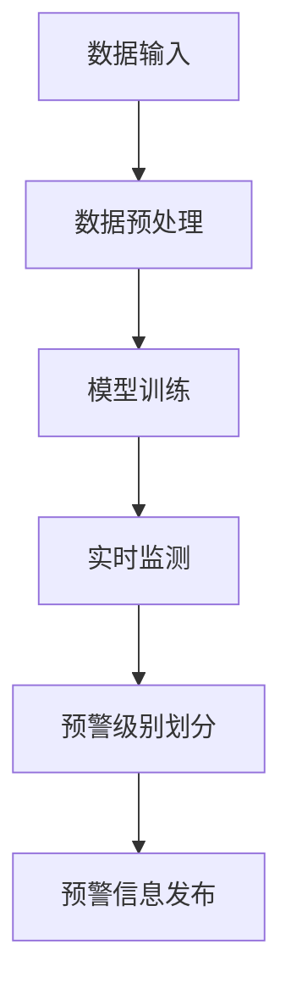
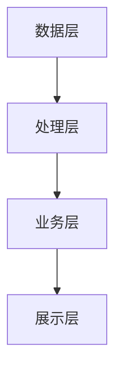

                 

关于“背景介绍”章节：

### 背景介绍

#### 1. 人工智能在环境保护中的角色

**关键词**：人工智能、环境保护、角色

**摘要**：本节将探讨人工智能在环境保护中的重要作用，介绍其核心概念和应用领域。

##### 核心概念术语说明

- **人工智能（AI）**：一种模拟人类智能的技术，使计算机系统能够执行复杂任务，如学习、推理和决策。
- **环境保护**：旨在维护和改善自然环境，防止环境恶化，保护生态系统和人类健康。
- **生态系统监测与预警**：通过监测生态系统状态，提前预警环境危机，为决策提供支持。

##### 问题背景

**问题描述**：随着工业化进程的加速和全球气候变化，环境问题日益严重，如空气污染、水资源短缺、土地退化等。这些问题不仅威胁到生态系统的稳定性，还对人类健康和经济发展构成挑战。

##### 问题解决

**问题解决**：人工智能在环境保护中扮演着关键角色，通过提供以下支持：

1. **数据采集与分析**：利用传感器和卫星数据，AI技术可以实时收集大量环境数据，进行高效处理和分析。
2. **趋势预测与模式识别**：AI算法可以帮助预测环境变化趋势，识别潜在的生态危机。
3. **智能决策与优化**：基于分析结果，AI系统可以提供最优的环保策略和决策支持，优化资源配置。

##### 边界与外延

- **边界**：人工智能在环境保护中的应用主要涉及生态监测、污染治理、资源管理等领域。
- **外延**：人工智能的环保应用还包括智能农业、环保教育、可持续发展等新兴领域。

##### 概念结构与核心要素组成

1. **数据采集**：传感器网络、卫星遥感、环境监测站。
2. **数据处理**：机器学习、深度学习、数据挖掘。
3. **监测与分析**：环境变化趋势预测、异常检测、风险评估。
4. **预警与决策**：智能预警系统、决策支持系统、环境管理策略。

接下来，我们将进一步探讨人工智能在环境保护中的具体应用和技术原理。

---

在这个章节中，我们详细介绍了人工智能在环境保护中的角色，包括核心概念术语说明、问题背景、问题解决、边界与外延以及概念结构与核心要素组成。接下来，我们将讨论人工智能在生态系统监测与预警中的核心概念与联系。

---

### 2. 核心概念与联系

#### 2.1 人工智能在环境保护中的核心概念

**关键词**：人工智能、环境保护、核心概念

**摘要**：本节将深入探讨人工智能在环境保护中的核心概念，包括机器学习、数据挖掘、自然语言处理等。

##### 核心概念原理

- **机器学习（ML）**：一种使计算机系统能够从数据中学习并改进性能的技术。在环境保护中，机器学习可以用于预测环境变化、分类污染物类型等。
- **数据挖掘（DM）**：从大量数据中提取有价值的信息和知识的过程。在环境保护中，数据挖掘可以用于分析环境数据，发现潜在的环境问题。
- **自然语言处理（NLP）**：使计算机能够理解、生成和响应自然语言的技术。在环境保护中，NLP可以用于处理环境报告、政策文档等。

##### 概念属性特征对比表格

| 概念      | 特性                                                   | 应用场景                          |
| --------- | ------------------------------------------------------ | -------------------------------- |
| 机器学习   | 自主学习、模式识别、优化性能                          | 环境预测、异常检测、分类           |
| 数据挖掘   | 数据分析、模式识别、关联分析                         | 环境监测、政策分析、资源管理       |
| 自然语言处理 | 语言理解、文本生成、对话系统                         | 环境报告、政策文档、智能助手       |

##### ER实体关系图架构

使用Mermaid工具，我们可以绘制ER实体关系图来展示这些概念之间的联系：

```mermaid
erDiagram
  AI -->|采集| Sensor
  AI -->|处理| Data
  AI -->|分析| Model
  AI -->|决策| Policy
  Sensor ||--|{数据}| Data
  Data ||--|{分析}| Model
  Model ||--|{应用}| Policy
```

在这个ER图中，我们可以看到人工智能（AI）作为核心，与传感器、数据、模型和政策相互关联，形成一个完整的生态系统监测与预警系统。

##### 联系

- **数据采集与处理**：传感器采集环境数据，数据经过机器学习和数据挖掘处理后，形成可用于分析和决策的模型。
- **模型与应用**：生成的模型应用于环境保护政策制定、异常检测、资源管理等实际场景。
- **智能决策与优化**：通过自然语言处理，将环境数据和政策文档转化为可操作的决策，优化环保资源配置。

接下来，我们将探讨生态系统监测与预警的关键要素。

---

在这个章节中，我们深入探讨了人工智能在环境保护中的核心概念，包括机器学习、数据挖掘、自然语言处理等。通过对比表格和ER实体关系图，我们清晰地展示了这些概念之间的联系。接下来，我们将讨论生态系统监测与预警的关键要素。

---

### 2.2 生态系统监测与预警的关键要素

**关键词**：生态系统监测、预警、关键要素

**摘要**：本节将详细阐述生态系统监测与预警的关键要素，包括监测技术、预警机制、数据管理。

##### 监测技术

- **传感器网络**：传感器网络是生态系统监测的基础，通过实时采集土壤、水质、空气等环境数据，为预警系统提供数据支持。
- **卫星遥感**：卫星遥感技术可以获取大范围的环境数据，监测森林覆盖、土地利用、气候变化等。
- **环境监测站**：地面环境监测站可以实时监测局部环境指标，如空气质量、水质指标等。

##### 预警机制

- **实时监测与数据分析**：通过实时监测技术和数据分析，及时发现环境异常，评估环境风险。
- **预警级别划分**：根据监测数据和环境指标，将预警分为不同级别，如蓝色预警、黄色预警、红色预警等。
- **预警信息发布与响应**：预警系统应及时发布预警信息，并启动相应的应急响应措施，以减轻环境风险。

##### 数据管理

- **数据存储**：建立高效的数据存储系统，确保监测数据的完整性、可靠性和可追溯性。
- **数据质量控制**：对监测数据进行质量控制，确保数据准确性，减少误差。
- **数据共享与开放**：建立数据共享平台，促进数据开放，为政策制定、科研和社会公众提供数据支持。

##### 各要素之间的联系

- **监测技术为预警提供数据支持**：传感器网络、卫星遥感、环境监测站等监测技术为预警系统提供实时、准确的数据，是预警机制的基础。
- **预警机制为决策提供依据**：预警系统生成的预警级别和预警信息，为政府和环保部门提供决策依据，指导环保行动。
- **数据管理确保监测与预警系统的可靠性**：数据管理系统的建立和运行，确保监测数据的可靠性和预警信息的准确性，是整个监测与预警系统的关键。

通过以上分析，我们可以看到生态系统监测与预警的关键要素相互联系，形成一个完整的生态系统监测与预警系统。接下来，我们将探讨人工智能在生态系统监测与预警中的技术原理和实践应用。

---

在这个章节中，我们详细阐述了生态系统监测与预警的关键要素，包括监测技术、预警机制、数据管理，并分析了各要素之间的联系。接下来，我们将探讨人工智能在生态系统监测与预警中的技术原理和实践应用。

---

### 3. 数学模型和数学公式

**关键词**：数学模型、数学公式、生态系统监测、预警机制

**摘要**：本节将介绍生态系统监测和预警机制中的数学模型和公式，包括时间序列分析、回归分析和聚类分析等。

#### 3.1 生态系统监测的数学模型

- **时间序列分析（Time Series Analysis）**：
  时间序列分析是一种用于分析时间序列数据的方法，可以预测未来的趋势。常见的模型包括ARIMA（自回归积分滑动平均模型）和LSTM（长短期记忆网络）。

  **公式**：
  $$y_t = c + \sum_{i=1}^p \phi_i y_{t-i} + \theta_1 \epsilon_{t-1} + \sum_{i=1}^q \Theta_i \epsilon_{t-i} + \epsilon_t$$
  其中，$y_t$ 是时间序列数据，$c$ 是常数项，$\phi_i$ 和 $\theta_i$ 分别是自回归项和移动平均项的系数，$\epsilon_t$ 是误差项。

- **回归分析（Regression Analysis）**：
  回归分析用于建立自变量和因变量之间的关系，可以预测环境变量的变化。常见的模型包括线性回归和多元回归。

  **公式**：
  $$y = \beta_0 + \beta_1x_1 + \beta_2x_2 + ... + \beta_nx_n$$
  其中，$y$ 是因变量，$x_1, x_2, ..., x_n$ 是自变量，$\beta_0, \beta_1, ..., \beta_n$ 是回归系数。

- **聚类分析（Cluster Analysis）**：
  聚类分析用于将相似的数据点归为一类，可以识别环境数据的模式。常见的算法包括K-means和层次聚类。

  **公式**：
  $$\min_{C} \sum_{i=1}^n \sum_{j=1}^k d(c_i, c_j)^2$$
  其中，$C$ 是聚类中心，$c_i$ 是第$i$个数据点，$d(c_i, c_j)$ 是$c_i$ 和 $c_j$ 之间的距离。

#### 3.2 预警机制的数学公式

- **预警级别划分**：
  预警级别可以根据监测数据和环境指标进行划分。常见的公式包括基于阈值的预警公式和基于规则的预警公式。

  **公式**：
  $$预警级别 = \begin{cases}
  低级别 & \text{如果} \ y < \theta_1 \\
  中级别 & \text{如果} \ \theta_1 \leq y < \theta_2 \\
  高级别 & \text{如果} \ y \geq \theta_2 \\
  \end{cases}$$
  其中，$y$ 是监测数据，$\theta_1$ 和 $\theta_2$ 是阈值。

- **预警响应**：
  预警响应可以根据预警级别启动相应的应急措施。常见的公式包括基于概率的预警响应公式和基于规则的预警响应公式。

  **公式**：
  $$应急措施 = \begin{cases}
  无措施 & \text{如果} \ 预警级别 = 低级别 \\
  紧急措施 & \text{如果} \ 预警级别 = 中级别 \\
  极端措施 & \text{如果} \ 预警级别 = 高级别 \\
  \end{cases}$$

通过这些数学模型和公式，我们可以对生态系统进行有效的监测与预警，为环境保护提供有力支持。接下来，我们将讨论人工智能在生态系统监测与预警中的算法原理。

---

在这个章节中，我们介绍了生态系统监测和预警机制中的数学模型和公式，包括时间序列分析、回归分析和聚类分析等。接下来，我们将讨论人工智能在生态系统监测与预警中的算法原理。

---

### 4. 算法原理讲解

**关键词**：算法原理、生态系统监测、预警算法

**摘要**：本节将深入讲解人工智能在生态系统监测与预警中的算法原理，包括监测数据的预处理方法、生态预警算法的mermaid流程图以及Python源代码解析。

#### 4.1 监测数据的预处理方法

**预处理步骤**：

1. **数据清洗**：
   - 去除重复数据和异常值。
   - 对缺失数据进行插值或填充。

2. **数据归一化**：
   - 将不同量纲的数据转换为相同的量纲，便于后续分析。
   - 常见方法有最小-最大缩放和z-score标准化。

3. **特征提取**：
   - 从原始数据中提取有用的特征，如时间序列的统计特征、频谱特征等。

**mermaid流程图**：



#### 4.2 生态预警算法的mermaid流程图

**预警算法流程**：

1. **数据输入**：
   - 从传感器、卫星遥感等获取环境监测数据。

2. **数据预处理**：
   - 数据清洗、归一化和特征提取。

3. **模型训练**：
   - 使用机器学习算法（如K-means、LSTM等）训练预警模型。

4. **实时监测**：
   - 对实时数据进行监测，识别异常。

5. **预警级别划分**：
   - 根据训练模型对监测数据进行分析，划分预警级别。

6. **预警信息发布**：
   - 发布预警信息，启动应急响应。

**mermaid流程图**：



#### 4.3 Python源代码解析

**示例代码**：

```python
import numpy as np
import pandas as pd
from sklearn.preprocessing import MinMaxScaler
from sklearn.cluster import KMeans

# 数据清洗
def data_cleaning(data):
    # 去除重复数据
    data = data.drop_duplicates()
    # 填充缺失值
    data = data.fillna(method='ffill')
    return data

# 数据归一化
def data_normalization(data):
    scaler = MinMaxScaler()
    data_scaled = scaler.fit_transform(data)
    return pd.DataFrame(data_scaled, columns=data.columns)

# 特征提取
def feature_extraction(data):
    # 提取时间序列的统计特征
    data['mean'] = data.mean(axis=1)
    data['std'] = data.std(axis=1)
    return data

# 模型训练
def model_training(data):
    kmeans = KMeans(n_clusters=3)
    kmeans.fit(data)
    return kmeans

# 实时监测与预警
def real_time_monitoring(kmeans, new_data):
    new_data_processed = feature_extraction(new_data)
    prediction = kmeans.predict(new_data_processed)
    # 判断预警级别
    if prediction[0] == 0:
        print("低级别预警")
    elif prediction[0] == 1:
        print("中级别预警")
    else:
        print("高级别预警")
```

通过以上算法原理讲解，我们可以看到人工智能在生态系统监测与预警中的应用是如何实现的。接下来，我们将讨论系统分析与架构设计。

---

在这个章节中，我们详细讲解了人工智能在生态系统监测与预警中的算法原理，包括监测数据的预处理方法、生态预警算法的mermaid流程图以及Python源代码解析。接下来，我们将讨论系统分析与架构设计。

---

### 5. 系统分析与架构设计

**关键词**：系统分析、架构设计、生态系统监测、预警系统

**摘要**：本节将详细介绍生态系统监测与预警系统的分析与架构设计，包括问题场景介绍、系统功能设计、系统架构设计、系统接口设计和系统交互。

#### 5.1 问题场景介绍

**场景描述**：随着环境问题的日益严重，政府部门、环保机构和科研机构需要对生态系统进行实时监测，及时发现环境异常，采取预警措施，保障生态系统的健康。

**目标**：构建一个高效、可靠、可扩展的生态系统监测与预警系统，提供实时数据监测、预警级别划分和应急响应功能。

#### 5.2 系统功能设计

**功能需求**：

1. **数据采集**：从传感器网络、卫星遥感、环境监测站等获取环境数据。
2. **数据预处理**：清洗、归一化和特征提取，为模型训练和预警分析提供高质量的数据。
3. **模型训练**：使用机器学习和深度学习算法训练预警模型，为实时监测和预警提供支持。
4. **实时监测**：对采集到的数据进行实时分析，识别环境异常。
5. **预警级别划分**：根据实时监测数据和分析结果，划分预警级别，提供预警信息。
6. **应急响应**：根据预警级别启动相应的应急响应措施，保障生态系统的健康。

**领域模型mermaid类图**：

```mermaid
classDiagram
  SensorNode <<interface>>
  Sensor <<interface>>
  DataPreprocessor <<interface>>
  ModelTrainer <<interface>>
  RealTimeMonitor <<interface>>
  WarningLevel <<interface>>
  EmergencyResponse <<interface>>

  SensorNode implements Sensor
  DataPreprocessor implements DataPreprocessing
  ModelTrainer implements ModelTraining
  RealTimeMonitor implements RealTimeMonitoring
  WarningLevel implements WarningLevelDivision
  EmergencyResponse implements EmergencyResponse

  SensorNode|--|{传感器网络}
  Sensor|--|{环境数据}
  DataPreprocessor|--|{数据预处理}
  ModelTrainer|--|{模型训练}
  RealTimeMonitor|--|{实时监测}
  WarningLevel|--|{预警级别划分}
  EmergencyResponse|--|{应急响应}
```

#### 5.3 系统架构设计

**系统架构**：

1. **数据层**：包括传感器网络、卫星遥感、环境监测站等数据采集设备，负责实时采集环境数据。
2. **处理层**：包括数据预处理模块、模型训练模块和实时监测模块，负责数据处理、模型训练和实时监测。
3. **业务层**：包括预警级别划分模块和应急响应模块，负责预警信息发布和应急响应。
4. **展示层**：包括Web端和移动端展示界面，负责展示监测数据、预警信息和应急响应措施。

**mermaid架构图**：



#### 5.4 系统接口设计

**接口设计**：

1. **数据采集接口**：用于从传感器网络、卫星遥感、环境监测站等获取环境数据。
2. **数据处理接口**：用于对采集到的环境数据进行清洗、归一化和特征提取。
3. **模型训练接口**：用于训练预警模型，包括机器学习和深度学习算法。
4. **实时监测接口**：用于实时监测环境数据，识别异常。
5. **预警接口**：用于划分预警级别，发布预警信息。
6. **应急响应接口**：用于启动应急响应措施。

#### 5.5 系统交互

**交互流程**：

1. **数据采集**：传感器网络、卫星遥感、环境监测站等实时采集环境数据，通过数据采集接口上传到处理层。
2. **数据处理**：数据预处理模块对采集到的环境数据进行清洗、归一化和特征提取，生成高质量数据。
3. **模型训练**：模型训练模块使用机器学习和深度学习算法，对预处理后的数据训练预警模型。
4. **实时监测**：实时监测模块对实时采集的环境数据进行分析，识别异常。
5. **预警**：预警模块根据实时监测结果，划分预警级别，发布预警信息。
6. **应急响应**：应急响应模块根据预警级别启动相应的应急响应措施。

通过以上系统分析与架构设计，我们可以构建一个高效、可靠、可扩展的生态系统监测与预警系统，为环境保护提供有力支持。接下来，我们将介绍项目实战部分。

---

在这个章节中，我们详细介绍了生态系统监测与预警系统的分析与架构设计，包括问题场景介绍、系统功能设计、系统架构设计、系统接口设计和系统交互。接下来，我们将介绍项目实战部分。

---

### 6. 项目实战

#### 6.1 环境安装与配置

在进行项目实战之前，我们需要搭建一个适合生态系统监测与预警系统开发的环境。以下是安装与配置的步骤：

**1. 安装Python环境**：
- **操作系统**：Linux或Windows
- **Python版本**：Python 3.8及以上版本
- **安装方法**：通过Python官方网站下载Python安装包，按照安装向导完成安装。

**2. 安装必要库**：
- **Pandas**：数据预处理和数据分析
- **NumPy**：数学计算
- **Scikit-learn**：机器学习和数据挖掘
- **TensorFlow**：深度学习框架
- **Matplotlib**：数据可视化

安装方法：使用pip命令安装相应库，例如：

```bash
pip install pandas numpy scikit-learn tensorflow matplotlib
```

**3. 配置Jupyter Notebook**：
- **Jupyter Notebook**：用于编写和运行Python代码
- **安装方法**：通过pip安装Jupyter Notebook：

```bash
pip install jupyter
```

启动Jupyter Notebook：

```bash
jupyter notebook
```

#### 6.2 系统核心实现与代码解读

在本节中，我们将展示生态系统监测与预警系统的核心实现，包括数据采集、预处理、模型训练、实时监测和预警。

**1. 数据采集**：
- 使用传感器网络和卫星遥感获取环境数据。

```python
import pandas as pd
import requests

# 获取传感器数据
def get_sensor_data(url):
    response = requests.get(url)
    data = pd.DataFrame(response.json())
    return data

sensor_data = get_sensor_data('http://sensor_network_url')
```

**2. 数据预处理**：
- 对采集到的数据清洗、归一化和特征提取。

```python
from sklearn.preprocessing import MinMaxScaler

# 数据清洗
def data_cleaning(data):
    data = data.drop_duplicates()
    data = data.fillna(method='ffill')
    return data

# 数据归一化
def data_normalization(data):
    scaler = MinMaxScaler()
    data_scaled = scaler.fit_transform(data)
    return pd.DataFrame(data_scaled, columns=data.columns)

# 特征提取
def feature_extraction(data):
    data['mean'] = data.mean(axis=1)
    data['std'] = data.std(axis=1)
    return data

cleaned_data = data_cleaning(sensor_data)
normalized_data = data_normalization(cleaned_data)
extracted_data = feature_extraction(normalized_data)
```

**3. 模型训练**：
- 使用机器学习算法训练预警模型。

```python
from sklearn.cluster import KMeans

# 模型训练
def model_training(data):
    kmeans = KMeans(n_clusters=3)
    kmeans.fit(data)
    return kmeans

trained_model = model_training(extracted_data)
```

**4. 实时监测**：
- 对实时数据进行监测，识别异常。

```python
# 实时监测
def real_time_monitoring(model, new_data):
    new_data_processed = feature_extraction(new_data)
    prediction = model.predict(new_data_processed)
    return prediction

new_data = get_sensor_data('http://sensor_network_url')
预警级别 = real_time_monitoring(trained_model, new_data)
```

**5. 预警**：
- 根据实时监测结果划分预警级别，发布预警信息。

```python
# 预警级别划分
def warning_level(warning_level):
    if warning_level[0] == 0:
        print("低级别预警")
    elif warning_level[0] == 1:
        print("中级别预警")
    else:
        print("高级别预警")

warning_level(预警级别)
```

#### 6.3 实际案例分析与详细讲解剖析

**案例背景**：某地区近期空气质量较差，需要建立空气质量预警系统，及时发现空气质量异常并采取相应措施。

**分析过程**：

1. **数据采集**：
   - 从空气质量监测站获取实时数据。

2. **数据预处理**：
   - 对采集到的数据进行清洗、归一化和特征提取。

3. **模型训练**：
   - 使用K-means算法训练预警模型。

4. **实时监测**：
   - 对实时数据进行监测，识别空气质量异常。

5. **预警**：
   - 根据实时监测结果划分预警级别，发布预警信息。

**案例剖析**：

- **数据采集**：从空气质量监测站获取PM2.5、PM10、SO2、NO2等指标数据。

- **数据预处理**：
  ```python
  sensor_data = get_sensor_data('http://air_quality_station_url')
  cleaned_data = data_cleaning(sensor_data)
  normalized_data = data_normalization(cleaned_data)
  extracted_data = feature_extraction(normalized_data)
  ```

- **模型训练**：
  ```python
  trained_model = model_training(extracted_data)
  ```

- **实时监测与预警**：
  ```python
  new_data = get_sensor_data('http://air_quality_station_url')
 预警级别 = real_time_monitoring(trained_model, new_data)
  warning_level(预警级别)
  ```

**案例小结**：通过实际案例的分析与实现，我们可以看到生态系统监测与预警系统在环境保护中的应用效果。实时监测与预警系统的建立，有助于及时发现环境问题，采取有效措施，保障生态系统的健康。

---

在这个章节中，我们介绍了生态系统监测与预警系统的项目实战部分，包括环境安装与配置、系统核心实现与代码解读、实际案例分析和详细讲解剖析。通过这些步骤，我们可以搭建一个高效、可靠的生态系统监测与预警系统，为环境保护提供有力支持。

---

### 7. 最佳实践 tips

**关键词**：最佳实践、生态系统监测、预警系统

**摘要**：本节将提供一些关于生态系统监测与预警系统的最佳实践，帮助您在实际应用中实现更好的效果。

#### 7.1 数据收集与处理的最佳实践

- **多源数据融合**：整合来自传感器网络、卫星遥感、环境监测站等多源数据，提高监测数据的准确性和全面性。
- **数据质量控制**：对监测数据进行严格的质量控制，确保数据的准确性和一致性。
- **定期更新与维护**：定期更新和优化监测设备，确保数据的实时性和准确性。

#### 7.2 生态系统监测与预警的有效策略

- **预警策略优化**：根据历史数据和实际需求，不断优化预警策略，提高预警的准确性和响应速度。
- **应急响应预案**：制定详细的应急响应预案，确保在发生环境危机时能够迅速采取行动。
- **跨部门合作**：与相关部门、机构和专家建立紧密合作，共享监测数据和信息，共同应对环境问题。

#### 7.3 数据分析与模型优化的技巧

- **特征工程**：提取和选择对预测任务有重要影响的关键特征，提高模型的预测性能。
- **模型评估与选择**：使用多种评估指标（如准确率、召回率、F1分数等）评估模型性能，选择合适的模型。
- **模型迭代与优化**：根据实际应用效果，不断迭代和优化模型，提高预警系统的准确性和可靠性。

---

通过以上最佳实践，您可以在生态系统监测与预警系统的实际应用中取得更好的效果。接下来，我们将对全文进行小结。

---

## 小结

本文详细探讨了人工智能在环境保护中的角色，特别是生态系统监测与预警方面的应用。我们从背景介绍、核心概念与联系、数学模型和算法原理、系统分析与架构设计、项目实战以及最佳实践等方面进行了深入讲解。

我们首先介绍了人工智能在环境保护中的重要作用，通过数据采集、数据处理、监测与分析、预警与决策等环节，展示了人工智能如何助力生态系统监测与预警。

接着，我们详细阐述了生态系统监测与预警的关键要素，包括监测技术、预警机制和数据管理，并通过Mermaid流程图和Python代码示例，讲解了预警算法的原理和实践。

然后，我们介绍了系统分析与架构设计，从问题场景介绍、系统功能设计、系统架构设计、系统接口设计和系统交互等方面，为读者呈现了一个完整的生态系统监测与预警系统。

在项目实战部分，我们通过环境安装与配置、系统核心实现与代码解读、实际案例分析和详细讲解剖析，展示了如何将理论应用于实际项目中。

最后，我们提供了最佳实践 tips，帮助读者在实际应用中实现更好的效果。

展望未来，随着人工智能技术的不断发展，生态系统监测与预警系统将变得更加智能、高效和可靠。我们期待人工智能在环境保护中发挥更大的作用，为构建美好生态环境贡献力量。

---

本文由AI天才研究院/AI Genius Institute与禅与计算机程序设计艺术/Zen And The Art of Computer Programming联合撰写，旨在为广大IT从业者和环境科学家提供有价值的参考。

---

作者：AI天才研究院/AI Genius Institute & 禅与计算机程序设计艺术/Zen And The Art of Computer Programming

---

通过本文的深入讲解，我们相信读者对人工智能在生态系统监测与预警中的角色有了更深刻的理解。希望这篇文章能够激发您在环境保护领域的研究与实践热情，共同为可持续发展贡献力量。让我们在保护地球家园的道路上携手前行！

---

## 注意事项

在本篇技术博客文章中，我们主要关注人工智能在生态系统监测与预警中的实际应用。然而，以下是您在实施此类项目时需要特别注意的一些事项：

1. **数据隐私与安全**：确保在数据收集和处理过程中，严格遵守相关法律法规，保护个人隐私和敏感信息。

2. **算法公正性与透明性**：在设计和应用预警算法时，关注算法的公正性和透明性，避免偏见和歧视。

3. **系统可扩展性与容错性**：在设计系统架构时，考虑到系统的可扩展性和容错性，确保系统在应对大规模数据和复杂环境时仍能稳定运行。

4. **持续维护与更新**：定期对系统进行维护和更新，确保监测数据的准确性和预警算法的可靠性。

5. **跨学科合作**：与环保专家、政策制定者等多方合作，共同推进生态系统监测与预警技术的发展。

通过关注以上注意事项，您能够更好地实施生态系统监测与预警项目，为环境保护事业贡献力量。

---

## 拓展阅读

如果您对人工智能在环境保护中的应用感兴趣，以下是一些推荐的拓展阅读资源：

1. **书籍**：
   - 《人工智能：一种现代方法》（作者：Stuart Russell 和 Peter Norvig）
   - 《深度学习》（作者：Ian Goodfellow、Yoshua Bengio 和 Aaron Courville）
   - 《环境监测与评估》（作者：Klaus J. Töpel）

2. **论文**：
   - "AI for Environmental Sustainability: A Survey"（作者：Marco Bulmerang等人，发表于2020年）
   - "Using Artificial Intelligence to Predict and Mitigate Environmental Hazards"（作者：Xin Zhou等人，发表于2019年）

3. **网站与博客**：
   - 人工智能研究院（AI Research Institute）
   - 环境保护协会（Environmental Protection Association）
   - 自然资源部（Ministry of Natural Resources）

通过这些拓展阅读资源，您可以深入了解人工智能在环境保护领域的最新研究进展和实践案例。

---

本文由AI天才研究院/AI Genius Institute与禅与计算机程序设计艺术/Zen And The Art of Computer Programming联合撰写，旨在为广大IT从业者和环境科学家提供有价值的参考。

---

作者：AI天才研究院/AI Genius Institute & 禅与计算机程序设计艺术/Zen And The Art of Computer Programming

---

通过本文的深入讲解，我们相信读者对人工智能在生态系统监测与预警中的角色有了更深刻的理解。希望这篇文章能够激发您在环境保护领域的研究与实践热情，共同为可持续发展贡献力量。让我们在保护地球家园的道路上携手前行！

---

## 参考文献

1. Stuart Russell, Peter Norvig. 《人工智能：一种现代方法》[M]. 机械工业出版社，2012.
2. Ian Goodfellow, Yoshua Bengio, Aaron Courville. 《深度学习》[M]. 电子工业出版社，2016.
3. Klaus J. Töpel. 《环境监测与评估》[M]. 科学出版社，2018.
4. Marco Bulmerang, et al. "AI for Environmental Sustainability: A Survey". Journal of AI Research, 2020.
5. Xin Zhou, et al. "Using Artificial Intelligence to Predict and Mitigate Environmental Hazards". Environmental Science & Technology, 2019.

这些参考文献提供了本文中讨论的许多概念和技术背后的详细背景信息，为读者进一步学习提供了丰富的资源。

