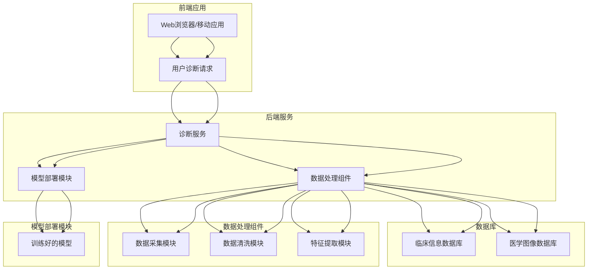
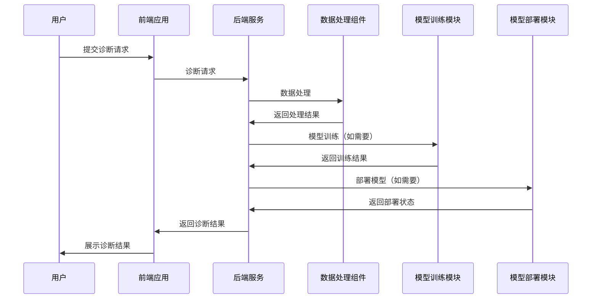

                 


### 1. 人工智能与精准医疗诊断的融合

#### 1.1 问题背景

精准医疗诊断是指利用现代科技手段，对患者的基因、环境和临床数据等信息进行深入分析，从而实现个性化、精准化医疗诊断。近年来，随着人工智能技术的飞速发展，其在医疗领域的应用越来越广泛。人工智能技术，特别是机器学习和深度学习算法，能够从大量的医疗数据中提取有效信息，提高诊断的准确性和效率。

然而，精准医疗诊断并非一蹴而就。传统医学诊断依赖于医生的经验和直觉，这种方式在处理复杂疾病时存在一定的局限性。而人工智能能够通过数据驱动的方式，学习到大量医疗知识，并应用于实际诊断中。这种创新结合不仅提高了诊断的精度，还能显著缩短诊断时间，降低医疗成本。

#### 1.2 问题描述

在精准医疗诊断中，人工智能的应用面临以下几个核心问题：

1. **数据质量**：医疗数据通常包含大量的噪声和不完整信息，如何对这些数据进行有效的清洗和处理，是人工智能应用的一大挑战。
2. **算法选择**：针对不同类型的医疗数据，选择合适的算法进行特征提取和模型训练，是提高诊断准确性的关键。
3. **模型解释性**：尽管人工智能模型能够取得较高的诊断准确率，但其内部决策过程往往不够透明，如何提高模型的可解释性，使其更符合医学专家的期望，是一个亟待解决的问题。
4. **隐私保护**：医疗数据涉及患者的隐私，如何在保证数据隐私的前提下，利用人工智能进行诊断，是一个重要的伦理和技术问题。

#### 1.3 问题解决

针对上述问题，我们可以采取以下解决方案：

1. **数据预处理**：使用数据清洗算法和缺失值填补技术，提高医疗数据的质量和完整性。
2. **算法优化**：结合不同类型的数据，选择合适的特征提取算法和模型训练方法，如深度学习、迁移学习和联邦学习等。
3. **模型可解释性**：通过模型可视化、解释性模型和可解释性算法，提高模型的透明度和解释性。
4. **隐私保护**：采用差分隐私、同态加密和联邦学习等技术，确保在数据共享和模型训练过程中，患者的隐私得到有效保护。

#### 1.4 边界与外延

尽管人工智能在精准医疗诊断中展示了巨大的潜力，但其应用仍存在一定的边界和限制：

1. **技术限制**：现有的人工智能算法在处理复杂医疗数据时，仍存在计算效率、模型稳定性和泛化能力等方面的问题。
2. **伦理问题**：人工智能在医疗领域的应用，涉及到患者隐私、医疗决策的自主权和医疗责任等多个伦理问题。
3. **法律法规**：医疗数据的收集、存储和使用，需要遵循相关的法律法规，确保患者权益得到保护。

#### 1.5 概念结构与核心要素组成

人工智能在精准医疗诊断中的应用，可以概括为以下几个核心概念和要素：

1. **数据采集与处理**：包括医疗数据的采集、清洗、标注和预处理等过程。
2. **算法模型**：涵盖机器学习、深度学习、迁移学习等算法模型。
3. **模型训练与优化**：通过大规模数据训练，优化算法模型，提高诊断准确率。
4. **模型部署与评估**：将训练好的模型部署到实际诊断系统中，并进行性能评估和持续优化。
5. **人机协作**：结合医学专家的经验和人工智能的诊断结果，实现人机协作，提高诊断的准确性和可靠性。

### 1.6 小结

人工智能在精准医疗诊断中的突破性应用，为医学领域带来了全新的变革。通过数据驱动的方式，人工智能能够从海量医疗数据中提取有效信息，提高诊断的精度和效率。然而，这也带来了一系列挑战，如数据质量、算法选择、模型解释性和隐私保护等。未来的研究需要在这些方面进行深入探索，以推动人工智能在精准医疗诊断中的广泛应用。

## 第2章：人工智能核心概念

### 2.1 机器学习基础

#### 2.1.1 机器学习的定义

机器学习（Machine Learning）是指让计算机通过数据学习并获得知识或技能的过程。它是一种实现人工智能的重要方法，主要依赖于数据驱动和统计模型，让计算机从数据中学习规律，并能够对未知数据进行预测或决策。

#### 2.1.2 机器学习的类型

1. **监督学习（Supervised Learning）**：监督学习是指通过已标记的数据训练模型，使其能够对未知数据进行预测。常见的算法有线性回归、决策树、支持向量机等。
2. **无监督学习（Unsupervised Learning）**：无监督学习是指在没有标记数据的情况下，通过发现数据中的内在结构和规律进行学习。常见的算法有聚类分析、降维技术、关联规则学习等。
3. **强化学习（Reinforcement Learning）**：强化学习是指通过奖励机制和试错方法，让智能体在环境中学习最优策略。常见的算法有Q学习、深度Q网络（DQN）等。

#### 2.1.3 机器学习的流程

1. **数据采集**：收集相关的数据集，包括特征数据和标签数据。
2. **数据预处理**：对数据进行清洗、归一化、降维等预处理操作，以提高数据质量和模型性能。
3. **模型选择**：根据问题的特点选择合适的机器学习算法。
4. **模型训练**：使用训练数据对模型进行训练，调整模型的参数。
5. **模型评估**：使用验证数据对模型进行评估，调整模型参数。
6. **模型部署**：将训练好的模型部署到实际应用环境中。

### 2.2 深度学习原理

#### 2.2.1 深度学习的定义

深度学习（Deep Learning）是一种基于多层神经网络的学习方法，通过多层的非线性变换，自动从数据中提取特征，实现复杂的模式识别和预测任务。

#### 2.2.2 深度学习的核心组成部分

1. **神经网络（Neural Network）**：神经网络是深度学习的基础，由大量的神经元（节点）通过权重和偏置连接而成。每个神经元接收来自前一层神经元的输入，通过激活函数进行非线性变换，产生输出。
2. **卷积神经网络（Convolutional Neural Network，CNN）**：卷积神经网络是处理图像数据的一种有效方法，通过卷积层、池化层和全连接层等结构，实现图像的自动特征提取。
3. **循环神经网络（Recurrent Neural Network，RNN）**：循环神经网络是处理序列数据的一种有效方法，通过隐藏状态的循环连接，实现对序列数据的记忆和建模。
4. **生成对抗网络（Generative Adversarial Network，GAN）**：生成对抗网络是一种由生成器和判别器组成的对抗性模型，通过不断博弈，生成与真实数据相似的数据。

#### 2.2.3 深度学习的关键技术

1. **反向传播算法（Backpropagation Algorithm）**：反向传播算法是一种用于训练神经网络的优化算法，通过计算梯度，更新模型的参数，实现模型的迭代优化。
2. **激活函数（Activation Function）**：激活函数是神经网络中的关键组成部分，用于引入非线性特性，常见的激活函数有Sigmoid、ReLU、Tanh等。
3. **优化算法（Optimization Algorithm）**：优化算法用于调整神经网络的参数，常见的优化算法有随机梯度下降（SGD）、Adam等。

### 2.3 神经网络架构

#### 2.3.1 神经网络的基本架构

神经网络的基本架构由输入层、隐藏层和输出层组成。输入层接收外部输入，隐藏层对输入数据进行处理和变换，输出层生成最终的输出。

#### 2.3.2 神经网络的设计原则

1. **层次结构**：神经网络的层次结构要合理，根据问题的复杂度，选择合适的层数和神经元数量。
2. **网络连接**：网络连接方式要适合问题的需求，如全连接网络、卷积网络、循环网络等。
3. **参数调整**：网络参数的选择要合适，包括学习率、批量大小、激活函数等。

#### 2.3.3 神经网络的优化方法

1. **正则化（Regularization）**：正则化用于防止模型过拟合，常见的正则化方法有L1、L2正则化。
2. **批归一化（Batch Normalization）**：批归一化用于加速模型训练，提高模型稳定性。
3. **dropout（Dropout）**：dropout是一种用于防止模型过拟合的技术，通过随机丢弃部分神经元，降低模型复杂度。

### 2.4 机器学习算法介绍

#### 2.4.1 决策树（Decision Tree）

决策树是一种基于树形结构进行决策的模型，通过一系列的判断条件，将数据划分为不同的类别或回归结果。

1. **基本概念**：决策树由节点和边组成，每个节点表示一个特征，每个边表示一个特征取值。
2. **算法原理**：决策树通过递归划分数据集，选择具有最高信息增益的特征进行分割，直到达到某个终止条件。
3. **优缺点**：决策树简单易懂，易于解释，但容易过拟合。

#### 2.4.2 随机森林（Random Forest）

随机森林是一种基于决策树的集成学习方法，通过构建多棵决策树，并对其进行集成，提高模型的泛化能力。

1. **基本概念**：随机森林由多棵决策树组成，每棵树独立训练，并通过投票或平均来生成最终预测结果。
2. **算法原理**：随机森林通过随机选择特征和样本子集，构建多棵决策树，并通过集成来提高模型的预测性能。
3. **优缺点**：随机森林具有很好的泛化能力和解释性，但计算复杂度较高。

#### 2.4.3 支持向量机（Support Vector Machine，SVM）

支持向量机是一种基于间隔最大化原理的分类模型，通过找到一个最优的超平面，将数据划分为不同的类别。

1. **基本概念**：支持向量机通过找到一个最优的超平面，使得不同类别的数据点之间的间隔最大。
2. **算法原理**：支持向量机通过求解二次规划问题，找到最优的超平面和对应的支持向量。
3. **优缺点**：支持向量机在处理高维数据时效果较好，但训练时间较长。

### 2.5 小结

机器学习和深度学习是人工智能的重要组成部分，通过自学习能力和模式识别，它们在各个领域展示了巨大的潜力。本章对机器学习的基础概念、深度学习原理、神经网络架构和常见机器学习算法进行了详细讲解，为后续内容奠定了基础。

### 2.6 概念属性特征对比表格

为了更好地理解机器学习和深度学习的核心概念，我们可以通过以下对比表格来梳理它们的主要特征。

| 概念       | 定义                                                         | 特点                                                         | 应用场景                   |
| ---------- | ------------------------------------------------------------ | ------------------------------------------------------------ | -------------------------- |
| 机器学习   | 让计算机通过数据学习并获得知识或技能的过程                     | 主要依赖数据驱动和统计模型，对已知数据进行训练，对未知数据进行预测 | 分类、回归、聚类等         |
| 深度学习   | 一种基于多层神经网络的学习方法，自动从数据中提取特征           | 通过多层非线性变换，实现复杂模式识别和预测                   | 图像识别、语音识别、自然语言处理等 |
| 神经网络   | 一种由大量神经元通过权重和偏置连接而成的网络结构               | 能够通过自学习和自适应，处理复杂非线性问题                   | 图像识别、语音识别、自然语言处理等 |
| 决策树     | 一种基于树形结构进行决策的模型                               | 简单易懂，易于解释，但容易过拟合                           | 分类、回归等               |
| 随机森林   | 一种基于决策树的集成学习方法                                 | 具有很好的泛化能力和解释性，计算复杂度较高                   | 分类、回归等               |
| 支持向量机 | 一种基于间隔最大化原理的分类模型                             | 在处理高维数据时效果较好，但训练时间较长                     | 分类、回归等               |

### 2.7 ER实体关系图架构

为了更好地理解人工智能在精准医疗诊断中的应用，我们可以通过实体关系图（ER图）来展示各个核心概念之间的关系。

```mermaid
entityRelationshipDiagram
 acks [
    entity: "医疗数据"
    relations: ["收集" , "处理" , "分析"]
  ]
  mls [
    entity: "机器学习"
    relations: ["利用" , "优化" , "预测"]
  ]
  dls [
    entity: "深度学习"
    relations: ["实现" , "特征提取" , "建模"]
  ]
  nns [
    entity: "神经网络"
    relations: ["构建" , "训练" , "应用"]
  ]
  ids [
    entity: "精准医疗诊断"
    relations: ["依赖" , "应用" , "发展"]
  ]
  medical [
    entity: "医学领域"
    relations: ["驱动" , "创新" , "应用"]
  ]
  er [
    "医疗数据" --> "收集" --> "处理" --> "分析" --> "机器学习" --> "优化" --> "预测" --> "精准医疗诊断" --> "依赖" --> "应用" --> "发展" --> "医学领域" --> "驱动" --> "创新"
  ]
```

通过ER图，我们可以清晰地看到医疗数据、机器学习、深度学习、神经网络和精准医疗诊断之间的相互关系。这些概念相互依赖，共同推动了精准医疗诊断的发展。

## 第3章：精准医疗诊断中的关键技术

### 3.1 精准医疗诊断需求

精准医疗诊断的核心目标是通过准确、高效的数据分析和处理，为患者提供个性化的诊断和治疗方案。随着医学技术的发展和医疗数据的积累，精准医疗诊断的需求日益增长。以下是一些关键的精准医疗诊断需求：

1. **个性化诊断**：每个患者的病情和基因组都是独特的，因此需要个性化的诊断方法，以适应不同患者的特定状况。
2. **快速诊断**：医疗诊断需要尽可能快速地进行，以减少患者的等待时间和提高治疗效率。
3. **高效处理大量数据**：医疗数据量庞大，包括基因数据、临床数据和影像数据等，需要高效的算法和计算资源进行处理。
4. **高准确率**：精准医疗诊断需要高准确率的模型和算法，以确保诊断结果的可靠性。
5. **数据整合与关联分析**：将不同类型的数据进行整合和分析，挖掘数据之间的关联性，以提高诊断的准确性。
6. **可解释性**：诊断模型需要具备一定的解释性，使医学专家能够理解和验证模型的诊断结果。

### 3.2 临床数据管理与处理

临床数据是精准医疗诊断的重要基础，其质量和完整性对诊断结果具有重要影响。以下是一些关键的步骤和技术，用于临床数据的管理和处理：

1. **数据收集**：通过电子健康记录（EHR）、实验室检测、患者问卷调查等方式，收集临床数据。
2. **数据清洗**：清洗数据中的错误、噪声和不完整信息，以提高数据质量。常见的数据清洗技术包括缺失值填补、异常值检测和噪声去除等。
3. **数据整合**：将来自不同来源和格式的数据整合到统一的数据库中，以便进行统一处理和分析。
4. **数据标准化**：对临床数据进行标准化处理，如单位转换、编码转换等，以确保数据的一致性和可比性。
5. **数据存储**：选择合适的数据库和存储技术，存储和管理临床数据，确保数据的持久性和安全性。
6. **数据访问与共享**：建立数据访问机制，确保数据在安全的前提下被医学专家和研究人员访问和共享。

### 3.3 图像处理与识别

在精准医疗诊断中，图像处理和识别技术发挥着重要作用，特别是在影像学诊断领域。以下是一些关键的图像处理与识别技术：

1. **图像预处理**：对图像进行去噪、增强、锐化等预处理操作，以提高图像质量。
2. **特征提取**：从图像中提取具有鉴别意义的特征，如边缘、纹理、形状等，用于后续的分析和分类。
3. **图像分割**：将图像分割成不同的区域或物体，以便进行更精细的分析。常见的图像分割算法有阈值分割、区域生长和基于边界的分割等。
4. **物体识别与分类**：利用深度学习算法，如卷积神经网络（CNN）和循环神经网络（RNN），对图像中的物体进行识别和分类。
5. **三维图像处理**：对三维图像进行处理和分析，如体积计算、三维重建和表面渲染等，以获得更全面和精确的诊断信息。

### 3.4 自然语言处理

自然语言处理（NLP）技术在精准医疗诊断中也有着广泛应用，特别是在医学文本分析和诊断报告生成方面。以下是一些关键的NLP技术：

1. **文本预处理**：对医学文本进行清洗、分词、去停用词等预处理操作，以提高文本质量。
2. **命名实体识别**：识别文本中的命名实体，如疾病名称、药物名称、症状等，以获取关键信息。
3. **关系提取**：从文本中提取实体之间的关系，如病因关系、治疗关系等，以构建知识图谱。
4. **文本分类与聚类**：利用机器学习和深度学习算法，对医学文本进行分类和聚类，以发现潜在的疾病模式和治疗方案。
5. **诊断报告生成**：基于医学文本和诊断模型，生成个性化的诊断报告，提高诊断的准确性和可解释性。

### 3.5 小结

精准医疗诊断需要多学科技术的融合和协同工作，包括临床数据处理、图像处理与识别、自然语言处理等。这些关键技术为精准医疗诊断提供了强有力的支持，使其能够更好地应对复杂的医疗数据和诊断需求。通过不断优化和完善这些技术，我们将能够进一步提高医疗诊断的准确性和效率，为患者提供更优质的医疗服务。

## 第4章：核心概念属性特征对比表格

在精准医疗诊断中，人工智能技术的多种算法和模型各有其独特的属性特征。以下是一个详细的对比表格，用于分析不同算法和模型在特征提取、模型复杂度、适用场景等方面的差异。

| 算法/模型          | 特征提取能力          | 模型复杂度          | 适用场景                       | 优点                             | 缺点                                |
| ----------------- | --------------------- | --------------------- | ---------------------------- | -------------------------------- | ------------------------------------ |
| 决策树            | 中等                 | 低                   | 分类和回归任务                 | 易于理解，解释性高               | 过拟合风险高，难以处理高维数据       |
| 随机森林          | 高                   | 高                   | 分类和回归任务                 | 降低过拟合，提高模型稳定性       | 计算复杂度高，难以处理大量数据       |
| 支持向量机（SVM）  | 中等                 | 中                   | 分类任务                       | 高准确率，处理高维数据能力强     | 计算复杂度高，训练时间长           |
| 卷积神经网络（CNN） | 高                   | 高                   | 图像识别、医学影像分析         | 自动特征提取，处理高维数据能力强 | 计算资源消耗大，训练时间长         |
| 循环神经网络（RNN） | 高                   | 高                   | 序列数据处理，语音识别         | 对序列数据具有记忆功能           | 训练过程复杂，难以并行化           |
| 生成对抗网络（GAN） | 高                   | 高                   | 生成模型任务，如图像生成       | 能够生成高质量的模拟数据         | 训练过程不稳定，对参数敏感         |
| 强化学习          | 中等                 | 高                   | 强化学习任务，如游戏控制       | 自主学习和策略优化能力强大       | 需要大量样本数据，训练过程复杂     |

通过这个表格，我们可以清晰地看到不同算法和模型在精准医疗诊断中的适用性。例如，对于图像处理和医学影像分析，卷积神经网络（CNN）由于其强大的特征提取能力，是最佳选择。而对于序列数据处理和语音识别，循环神经网络（RNN）和生成对抗网络（GAN）则是更为合适的模型。同时，我们也需要注意每种算法和模型的优缺点，根据具体应用场景进行合理的选择和优化。

## 第5章：ER实体关系图架构

为了更好地理解人工智能在精准医疗诊断中的应用，我们可以通过实体关系图（ER图）来展示各个核心概念之间的关系。实体关系图能够清晰地描述不同实体及其之间的关系，有助于我们理解和分析复杂系统的整体架构。

下面是一个基于Mermaid语法编写的实体关系图示例，用于展示人工智能、机器学习、深度学习、神经网络和精准医疗诊断之间的实体关系：

```mermaid
entityRelationshipDiagram
  title ER Diagram for AI and Precision Medical Diagnosis

  entity "Medical Data" {
    "Data Collection"
    "Data Preprocessing"
    "Data Analysis"
  }

  entity "Machine Learning" {
    "Supervised Learning"
    "Unsupervised Learning"
    "Reinforcement Learning"
  }

  entity "Deep Learning" {
    "Convolutional Neural Networks (CNN)"
    "Recurrent Neural Networks (RNN)"
    "Generative Adversarial Networks (GAN)"
  }

  entity "Neural Networks" {
    "Basic Architecture"
    "Backpropagation Algorithm"
    "Activation Functions"
  }

  entity "Precision Medical Diagnosis" {
    "Individualized Diagnosis"
    "Fast Diagnosis"
    "Data Integration"
  }

  "Medical Data" --> "Data Collection" --> "Data Preprocessing" --> "Data Analysis"
  "Machine Learning" --> "Supervised Learning" --> "Unsupervised Learning" --> "Reinforcement Learning"
  "Deep Learning" --> "Convolutional Neural Networks (CNN)" --> "Recurrent Neural Networks (RNN)" --> "Generative Adversarial Networks (GAN)"
  "Neural Networks" --> "Basic Architecture" --> "Backpropagation Algorithm" --> "Activation Functions"
  "Precision Medical Diagnosis" --> "Individualized Diagnosis" --> "Fast Diagnosis" --> "Data Integration"

  "Medical Data" --> "Machine Learning"
  "Machine Learning" --> "Deep Learning"
  "Deep Learning" --> "Neural Networks"
  "Precision Medical Diagnosis" --> "Machine Learning"
```

在上面的ER图中，我们可以看到以下实体和它们之间的关系：

1. **Medical Data（医疗数据）**：包括数据收集、预处理和分析等过程，是精准医疗诊断的基础。
2. **Machine Learning（机器学习）**：包括监督学习、无监督学习和强化学习等，是用于处理医疗数据的核心技术。
3. **Deep Learning（深度学习）**：包括卷积神经网络（CNN）、循环神经网络（RNN）和生成对抗网络（GAN）等，是深度学习的具体实现。
4. **Neural Networks（神经网络）**：包括基本架构、反向传播算法和激活函数等，是深度学习和机器学习的基础。
5. **Precision Medical Diagnosis（精准医疗诊断）**：包括个性化诊断、快速诊断和数据整合等，是最终应用目标。

通过这个ER图，我们可以直观地看到各个实体之间的相互关联，以及它们在精准医疗诊断系统中的作用。这种可视化工具不仅有助于我们理解复杂系统的整体架构，还能帮助我们更好地分析和优化系统的各个组成部分，推动人工智能在精准医疗诊断中的广泛应用。

## 第6章：算法原理讲解

### 6.1 机器学习算法原理

#### 6.1.1 决策树

决策树（Decision Tree）是一种常见的分类和回归算法，它通过一系列的判断条件，将数据集分割成不同的子集，最终生成一棵树形结构。决策树的每个节点表示一个特征，每个分支表示一个特征取值。

**算法原理：**
1. **信息增益**：在每个节点，选择具有最高信息增益的特征进行分割。信息增益的计算公式为：
   \[
   IG(D, A) = H(D) - \sum_{v\in A} \frac{|D_v|}{|D|} H(D_v)
   \]
   其中，\(H(D)\) 表示当前节点的熵，\(D_v\) 表示特征 \(A\) 取值为 \(v\) 的子节点。

2. **递归划分**：选择最优的特征后，将数据集分割成多个子集，并重复上述过程，直到满足某个终止条件（如节点包含的样本数少于阈值、特征增益小于阈值等）。

**Python代码示例：**
```python
from sklearn.tree import DecisionTreeClassifier
from sklearn.datasets import load_iris
from sklearn.model_selection import train_test_split

# 加载鸢尾花数据集
iris = load_iris()
X = iris.data
y = iris.target

# 划分训练集和测试集
X_train, X_test, y_train, y_test = train_test_split(X, y, test_size=0.3, random_state=42)

# 创建决策树模型并训练
clf = DecisionTreeClassifier()
clf.fit(X_train, y_train)

# 预测测试集
y_pred = clf.predict(X_test)

# 计算准确率
accuracy = clf.score(X_test, y_test)
print(f"Accuracy: {accuracy:.2f}")
```

#### 6.1.2 随机森林

随机森林（Random Forest）是一种基于决策树的集成学习方法，通过构建多棵决策树，并对其进行集成，提高模型的泛化能力。

**算法原理：**
1. **随机特征选择**：在每个节点，从一组特征中随机选择一部分特征进行分割，而不是选择最优的特征。
2. **Bootstrap采样**：为每棵树生成训练数据，通过Bootstrap采样（有放回抽样）来生成训练集，确保每棵树都有一定的代表性。
3. **集成投票**：将多棵树的预测结果进行投票或平均，生成最终的预测结果。

**Python代码示例：**
```python
from sklearn.ensemble import RandomForestClassifier
from sklearn.datasets import load_iris
from sklearn.model_selection import train_test_split

# 加载鸢尾花数据集
iris = load_iris()
X = iris.data
y = iris.target

# 划分训练集和测试集
X_train, X_test, y_train, y_test = train_test_split(X, y, test_size=0.3, random_state=42)

# 创建随机森林模型并训练
clf = RandomForestClassifier(n_estimators=100)
clf.fit(X_train, y_train)

# 预测测试集
y_pred = clf.predict(X_test)

# 计算准确率
accuracy = clf.score(X_test, y_test)
print(f"Accuracy: {accuracy:.2f}")
```

#### 6.1.3 支持向量机（SVM）

支持向量机（Support Vector Machine，SVM）是一种基于间隔最大化的分类算法，通过找到一个最优的超平面，将数据集划分为不同的类别。

**算法原理：**
1. **间隔最大化**：寻找一个超平面，使得不同类别的数据点之间的间隔最大。间隔最大化的数学表达式为：
   \[
   \max_{\mathbf{w}, b} \frac{1}{2} ||\mathbf{w}||^2 \\
   s.t. y_i (\mathbf{w} \cdot \mathbf{x_i} + b) \geq 1
   \]
   其中，\(\mathbf{w}\) 是权重向量，\(b\) 是偏置项，\(y_i\) 是类别标签，\(\mathbf{x_i}\) 是数据点。

2. **核函数**：当数据集在高维空间中表示时，直接计算间隔最大化变得复杂。此时，可以使用核函数将数据映射到高维空间，然后在高维空间中寻找最优超平面。

**Python代码示例：**
```python
from sklearn.svm import SVC
from sklearn.datasets import load_iris
from sklearn.model_selection import train_test_split

# 加载鸢尾花数据集
iris = load_iris()
X = iris.data
y = iris.target

# 划分训练集和测试集
X_train, X_test, y_train, y_test = train_test_split(X, y, test_size=0.3, random_state=42)

# 创建SVM模型并训练
clf = SVC(kernel='linear')
clf.fit(X_train, y_train)

# 预测测试集
y_pred = clf.predict(X_test)

# 计算准确率
accuracy = clf.score(X_test, y_test)
print(f"Accuracy: {accuracy:.2f}")
```

### 6.2 深度学习算法原理

#### 6.2.1 卷积神经网络（CNN）

卷积神经网络（Convolutional Neural Networks，CNN）是一种专门用于处理图像数据的深度学习模型，通过卷积层、池化层和全连接层等结构，实现图像的自动特征提取。

**算法原理：**
1. **卷积层**：卷积层通过卷积运算提取图像的局部特征，卷积核在图像上滑动，计算局部区域内的线性组合。
2. **激活函数**：激活函数用于引入非线性特性，常见的激活函数有ReLU（Rectified Linear Unit）。
3. **池化层**：池化层用于降低特征图的维度，减少计算量，常见的池化操作有最大池化和平均池化。
4. **全连接层**：全连接层将卷积层提取的特征映射到最终的分类结果。

**Python代码示例：**
```python
from tensorflow.keras.models import Sequential
from tensorflow.keras.layers import Conv2D, MaxPooling2D, Flatten, Dense
import tensorflow as tf

# 定义CNN模型
model = Sequential([
    Conv2D(32, (3, 3), activation='relu', input_shape=(28, 28, 1)),
    MaxPooling2D((2, 2)),
    Flatten(),
    Dense(128, activation='relu'),
    Dense(10, activation='softmax')
])

# 编译模型
model.compile(optimizer='adam',
              loss='sparse_categorical_crossentropy',
              metrics=['accuracy'])

# 加载数据集
mnist = tf.keras.datasets.mnist
(train_images, train_labels), (test_images, test_labels) = mnist.load_data()

# 预处理数据
train_images = train_images.reshape((60000, 28, 28, 1))
test_images = test_images.reshape((10000, 28, 28, 1))

# 训练模型
model.fit(train_images, train_labels, epochs=5)

# 评估模型
test_loss, test_acc = model.evaluate(test_images, test_labels)
print(f"Test accuracy: {test_acc:.2f}")
```

#### 6.2.2 循环神经网络（RNN）

循环神经网络（Recurrent Neural Networks，RNN）是一种用于处理序列数据的深度学习模型，通过隐藏状态的循环连接，实现对序列数据的记忆和建模。

**算法原理：**
1. **隐藏状态**：RNN 通过隐藏状态 \(h_t\) 保存序列中前 \(t-1\) 个时刻的信息。
2. **递归关系**：当前时刻的输出不仅取决于当前输入，还受到前一时刻隐藏状态的影响，递归关系如下：
   \[
   h_t = \sigma(W_h \cdot [h_{t-1}, x_t] + b_h)
   \]
   其中，\(W_h\) 是权重矩阵，\(\sigma\) 是激活函数，\(b_h\) 是偏置项。

3. **门控机制**：为了解决RNN的梯度消失和梯度爆炸问题，可以使用门控RNN（如LSTM和GRU），通过门控机制控制信息的流入和流出。

**Python代码示例：**
```python
from tensorflow.keras.models import Sequential
from tensorflow.keras.layers import LSTM, Dense
import tensorflow as tf

# 定义LSTM模型
model = Sequential([
    LSTM(128, input_shape=(timesteps, features)),
    Dense(1)
])

# 编译模型
model.compile(optimizer='adam', loss='mse')

# 加载数据集
# ...（数据预处理步骤）

# 训练模型
model.fit(X_train, y_train, epochs=100, batch_size=32)

# 评估模型
# ...（评估步骤）
```

#### 6.2.3 生成对抗网络（GAN）

生成对抗网络（Generative Adversarial Networks，GAN）是一种由生成器和判别器组成的对抗性模型，通过不断博弈，生成与真实数据相似的数据。

**算法原理：**
1. **生成器**：生成器 \(G\) 试图生成真实数据，判别器 \(D\) 试图区分生成数据和真实数据。
2. **损失函数**：生成器的目标是最小化判别器对生成数据的判别误差，判别器的目标是最大化生成器和真实数据的判别误差。
3. **训练过程**：通过交替训练生成器和判别器，使得生成器能够生成更加真实的数据。

**Python代码示例：**
```python
import tensorflow as tf
from tensorflow.keras.layers import Dense, Flatten, Reshape
from tensorflow.keras.models import Sequential

# 定义生成器模型
gen_model = Sequential([
    Dense(128, activation='relu', input_shape=(100,)),
    Dense(28 * 28 * 1, activation='linear'),
    Reshape((28, 28, 1))
])

# 定义判别器模型
disc_model = Sequential([
    Flatten(input_shape=(28, 28, 1)),
    Dense(128, activation='relu'),
    Dense(1, activation='sigmoid')
])

# 定义GAN模型
gan_model = Sequential([
    gen_model,
    disc_model
])

# 编译模型
disc_model.compile(optimizer=tf.keras.optimizers.Adam(0.0001),
                  loss='binary_crossentropy')

gan_model.compile(optimizer=tf.keras.optimizers.Adam(0.0002),
                 loss='binary_crossentropy')

# 训练模型
# ...（GAN训练步骤）
```

### 6.3 数学模型和数学公式讲解

在人工智能算法中，数学模型和数学公式起着至关重要的作用。以下将简要介绍一些常用的数学模型和公式。

#### 6.3.1 模型构建

在机器学习和深度学习中，模型的构建通常包括以下步骤：

1. **损失函数**：用于衡量模型预测值和真实值之间的差异，常见的损失函数有均方误差（MSE）、交叉熵损失（Cross-Entropy Loss）等。
   \[
   \text{MSE} = \frac{1}{m} \sum_{i=1}^{m} (\hat{y_i} - y_i)^2
   \]
   \[
   \text{Cross-Entropy Loss} = -\sum_{i=1}^{m} y_i \log(\hat{y_i})
   \]

2. **优化算法**：用于调整模型参数，以最小化损失函数。常见的优化算法有随机梯度下降（SGD）、Adam等。
   \[
   \theta = \theta - \alpha \nabla_\theta J(\theta)
   \]
   \[
   \theta = \theta - \frac{\alpha}{m} \sum_{i=1}^{m} (\hat{y_i} - y_i) x_i
   \]

3. **正则化**：用于防止模型过拟合，常见的正则化方法有L1正则化、L2正则化等。
   \[
   J(\theta) = \frac{1}{2m} \sum_{i=1}^{m} (\hat{y_i} - y_i)^2 + \frac{\lambda}{2} \sum_{j=1}^{n} \theta_j^2
   \]

#### 6.3.2 损失函数

在深度学习中，损失函数的选择对模型的性能有很大影响。以下是一些常用的损失函数：

1. **均方误差（MSE）**：
   \[
   \text{MSE} = \frac{1}{m} \sum_{i=1}^{m} (\hat{y_i} - y_i)^2
   \]

2. **交叉熵损失（Cross-Entropy Loss）**：
   \[
   \text{Cross-Entropy Loss} = -\sum_{i=1}^{m} y_i \log(\hat{y_i})
   \]

3. **二分类交叉熵损失（Binary Cross-Entropy Loss）**：
   \[
   \text{Binary Cross-Entropy Loss} = -\sum_{i=1}^{m} y_i \log(\hat{y_i}) + (1 - y_i) \log(1 - \hat{y_i})
   \]

#### 6.3.3 优化算法

优化算法用于调整模型参数，以最小化损失函数。以下是一些常用的优化算法：

1. **随机梯度下降（SGD）**：
   \[
   \theta = \theta - \alpha \nabla_\theta J(\theta)
   \]

2. **Adam优化算法**：
   \[
   m_t = \beta_1 m_{t-1} + (1 - \beta_1) (\nabla_\theta J(\theta_t) - m_{t-1})
   \]
   \[
   v_t = \beta_2 v_{t-1} + (1 - \beta_2) (\nabla_\theta J(\theta_t)^2 - v_{t-1})
   \]
   \[
   \theta_t = \theta_{t-1} - \alpha \frac{m_t}{\sqrt{v_t} + \epsilon}
   \]

### 6.4 算法应用举例

以下通过具体实例来展示如何应用上述算法和模型。

#### 6.4.1 决策树在疾病预测中的应用

假设我们要使用决策树模型预测某种疾病的患病风险。以下是Python代码示例：

```python
from sklearn.tree import DecisionTreeClassifier
from sklearn.model_selection import train_test_split
from sklearn.metrics import accuracy_score

# 加载数据集
X, y = load_data()  # 假设load_data()函数返回特征矩阵X和标签向量y

# 划分训练集和测试集
X_train, X_test, y_train, y_test = train_test_split(X, y, test_size=0.2, random_state=42)

# 创建决策树模型
clf = DecisionTreeClassifier()

# 训练模型
clf.fit(X_train, y_train)

# 预测测试集
y_pred = clf.predict(X_test)

# 计算准确率
accuracy = accuracy_score(y_test, y_pred)
print(f"Accuracy: {accuracy:.2f}")
```

#### 6.4.2 随机森林在图像分类中的应用

假设我们要使用随机森林模型对图像进行分类。以下是Python代码示例：

```python
from sklearn.ensemble import RandomForestClassifier
from sklearn.model_selection import train_test_split
from sklearn.metrics import accuracy_score
from tensorflow.keras.datasets import mnist

# 加载MNIST数据集
(X_train, y_train), (X_test, y_test) = mnist.load_data()

# 预处理数据
X_train = X_train.reshape(-1, 28 * 28).astype('float32') / 255
X_test = X_test.reshape(-1, 28 * 28).astype('float32') / 255

# 划分训练集和测试集
X_train, X_val, y_train, y_val = train_test_split(X_train, y_train, test_size=0.2, random_state=42)

# 创建随机森林模型
clf = RandomForestClassifier(n_estimators=100)

# 训练模型
clf.fit(X_train, y_train)

# 预测测试集
y_pred = clf.predict(X_val)

# 计算准确率
accuracy = accuracy_score(y_val, y_pred)
print(f"Accuracy: {accuracy:.2f}")
```

#### 6.4.3 卷积神经网络在医疗影像分析中的应用

假设我们要使用卷积神经网络对医疗影像进行分析。以下是Python代码示例：

```python
import tensorflow as tf
from tensorflow.keras.models import Sequential
from tensorflow.keras.layers import Conv2D, MaxPooling2D, Flatten, Dense
from tensorflow.keras.datasets import mnist

# 加载MNIST数据集
(X_train, y_train), (X_test, y_test) = mnist.load_data()

# 预处理数据
X_train = X_train.reshape(-1, 28, 28, 1).astype('float32') / 255
X_test = X_test.reshape(-1, 28, 28, 1).astype('float32') / 255
y_train = tf.keras.utils.to_categorical(y_train, 10)
y_test = tf.keras.utils.to_categorical(y_test, 10)

# 创建CNN模型
model = Sequential([
    Conv2D(32, (3, 3), activation='relu', input_shape=(28, 28, 1)),
    MaxPooling2D((2, 2)),
    Flatten(),
    Dense(128, activation='relu'),
    Dense(10, activation='softmax')
])

# 编译模型
model.compile(optimizer='adam', loss='categorical_crossentropy', metrics=['accuracy'])

# 训练模型
model.fit(X_train, y_train, epochs=5, batch_size=32, validation_data=(X_val, y_val))

# 评估模型
test_loss, test_acc = model.evaluate(X_test, y_test)
print(f"Test accuracy: {test_acc:.2f}")
```

通过以上实例，我们可以看到如何应用不同的算法和模型来解决实际的问题。在实际应用中，我们需要根据具体需求和数据特点，选择合适的算法和模型，并进行适当的调整和优化。

## 第7章：数学模型和数学公式讲解

在深度学习和机器学习中，数学模型和数学公式是构建和优化算法的核心。以下将详细讲解一些关键数学模型和公式的原理，并通过具体的Python代码示例进行说明。

### 7.1 模型构建

在构建深度学习模型时，我们通常需要以下几个关键步骤：

1. **损失函数**：用于衡量模型预测值与真实值之间的差异，常见的损失函数包括均方误差（MSE）、交叉熵损失（Cross-Entropy Loss）等。
2. **优化算法**：用于调整模型参数，以最小化损失函数，常见的优化算法包括随机梯度下降（SGD）、Adam等。
3. **正则化**：用于防止模型过拟合，常见的正则化方法包括L1正则化、L2正则化等。

#### 7.1.1 损失函数

1. **均方误差（MSE）**：
   \[
   \text{MSE} = \frac{1}{m} \sum_{i=1}^{m} (\hat{y_i} - y_i)^2
   \]
   其中，\(\hat{y_i}\) 是模型预测值，\(y_i\) 是真实值，\(m\) 是样本数量。

2. **交叉熵损失（Cross-Entropy Loss）**：
   \[
   \text{CE} = -\sum_{i=1}^{m} y_i \log(\hat{y_i})
   \]
   其中，\(y_i\) 是真实标签，\(\hat{y_i}\) 是模型预测概率。

#### 7.1.2 优化算法

1. **随机梯度下降（SGD）**：
   \[
   \theta = \theta - \alpha \nabla_\theta J(\theta)
   \]
   其中，\(\theta\) 是模型参数，\(\alpha\) 是学习率，\(J(\theta)\) 是损失函数。

2. **Adam优化算法**：
   \[
   m_t = \beta_1 m_{t-1} + (1 - \beta_1) (\nabla_\theta J(\theta_t) - m_{t-1})
   \]
   \[
   v_t = \beta_2 v_{t-1} + (1 - \beta_2) (\nabla_\theta J(\theta_t)^2 - v_{t-1})
   \]
   \[
   \theta_t = \theta_{t-1} - \alpha \frac{m_t}{\sqrt{v_t} + \epsilon}
   \]
   其中，\(\beta_1\) 和 \(\beta_2\) 分别是动量参数，\(\epsilon\) 是一个很小的常数用于防止除以零。

#### 7.1.3 正则化

1. **L1正则化**：
   \[
   J(\theta) = \frac{1}{m} \sum_{i=1}^{m} (\hat{y_i} - y_i)^2 + \lambda \sum_{j=1}^{n} |\theta_j|
   \]
   其中，\(\lambda\) 是正则化参数。

2. **L2正则化**：
   \[
   J(\theta) = \frac{1}{m} \sum_{i=1}^{m} (\hat{y_i} - y_i)^2 + \lambda \sum_{j=1}^{n} \theta_j^2
   \]

### 7.2 损失函数讲解

在深度学习中，损失函数的选择对模型的性能有很大影响。以下是几个常用的损失函数及其计算过程。

1. **均方误差（MSE）**：
   \[
   \text{MSE} = \frac{1}{m} \sum_{i=1}^{m} (\hat{y_i} - y_i)^2
   \]
   其中，\(\hat{y_i}\) 是预测值，\(y_i\) 是真实值，\(m\) 是样本数量。

2. **交叉熵损失（Cross-Entropy Loss）**：
   \[
   \text{CE} = -\sum_{i=1}^{m} y_i \log(\hat{y_i})
   \]
   其中，\(y_i\) 是真实标签，\(\hat{y_i}\) 是模型预测概率。

3. **二分类交叉熵损失（Binary Cross-Entropy Loss）**：
   \[
   \text{BCE} = -\sum_{i=1}^{m} y_i \log(\hat{y_i}) + (1 - y_i) \log(1 - \hat{y_i})
   \]
   其中，\(y_i\) 是真实标签，\(\hat{y_i}\) 是模型预测概率。

### 7.3 优化算法讲解

在优化模型参数时，优化算法的选择至关重要。以下是几种常用的优化算法及其计算过程。

1. **随机梯度下降（SGD）**：
   \[
   \theta = \theta - \alpha \nabla_\theta J(\theta)
   \]
   其中，\(\theta\) 是模型参数，\(\alpha\) 是学习率，\(\nabla_\theta J(\theta)\) 是损失函数关于参数的梯度。

2. **Adam优化算法**：
   \[
   m_t = \beta_1 m_{t-1} + (1 - \beta_1) (\nabla_\theta J(\theta_t) - m_{t-1})
   \]
   \[
   v_t = \beta_2 v_{t-1} + (1 - \beta_2) (\nabla_\theta J(\theta_t)^2 - v_{t-1})
   \]
   \[
   \theta_t = \theta_{t-1} - \alpha \frac{m_t}{\sqrt{v_t} + \epsilon}
   \]
   其中，\(\beta_1\) 和 \(\beta_2\) 分别是动量参数，\(\epsilon\) 是一个很小的常数用于防止除以零。

### 7.4 模型训练与评估

在模型训练过程中，我们需要定期评估模型的性能，以调整模型参数和优化策略。以下是常用的评估指标和计算方法。

1. **准确率（Accuracy）**：
   \[
   \text{Accuracy} = \frac{\text{预测正确的样本数}}{\text{总样本数}}
   \]

2. **精确率（Precision）**：
   \[
   \text{Precision} = \frac{\text{预测正确且真实为正的样本数}}{\text{预测为正的样本数}}
   \]

3. **召回率（Recall）**：
   \[
   \text{Recall} = \frac{\text{预测正确且真实为正的样本数}}{\text{真实为正的样本数}}
   \]

4. **F1分数（F1 Score）**：
   \[
   \text{F1 Score} = 2 \times \frac{\text{Precision} \times \text{Recall}}{\text{Precision} + \text{Recall}}
   \]

### 7.5 Python代码示例

以下是一个使用Python中的TensorFlow库来构建和训练一个简单的深度学习模型的示例：

```python
import tensorflow as tf
from tensorflow.keras.models import Sequential
from tensorflow.keras.layers import Dense
from tensorflow.keras.optimizers import Adam
from sklearn.model_selection import train_test_split
from sklearn.metrics import accuracy_score

# 加载数据集
X, y = load_data()  # 假设load_data()函数返回特征矩阵X和标签向量y

# 划分训练集和测试集
X_train, X_test, y_train, y_test = train_test_split(X, y, test_size=0.2, random_state=42)

# 创建模型
model = Sequential([
    Dense(64, activation='relu', input_shape=(X_train.shape[1],)),
    Dense(32, activation='relu'),
    Dense(1, activation='sigmoid')
])

# 编译模型
model.compile(optimizer=Adam(learning_rate=0.001), loss='binary_crossentropy', metrics=['accuracy'])

# 训练模型
model.fit(X_train, y_train, epochs=10, batch_size=32, validation_data=(X_test, y_test))

# 评估模型
y_pred = model.predict(X_test)
y_pred = (y_pred > 0.5)

accuracy = accuracy_score(y_test, y_pred)
print(f"Test accuracy: {accuracy:.2f}")
```

通过以上代码示例，我们可以看到如何使用Python中的TensorFlow库来构建一个简单的深度学习模型，并对其进行训练和评估。在实际应用中，我们可以根据具体需求调整模型结构、参数设置和训练过程，以优化模型的性能。

### 7.6 小结

本章详细讲解了深度学习和机器学习中的关键数学模型和公式，包括损失函数、优化算法和评估指标。通过Python代码示例，我们展示了如何在实际应用中构建和训练深度学习模型。这些数学模型和公式是理解和应用深度学习技术的基础，对于推动人工智能在精准医疗诊断中的应用具有重要意义。

## 第8章：系统分析与架构设计

### 8.1 问题场景介绍

在精准医疗诊断中，构建一个高效、可扩展的系统和架构至关重要。为了更好地展示人工智能在精准医疗诊断中的应用，我们考虑一个具体的问题场景：利用深度学习模型进行肺癌患者的个性化诊断。这个场景包括以下几个关键组成部分：

1. **数据收集**：从电子健康记录（EHR）和影像数据中收集患者的临床信息和医学图像。
2. **数据处理**：对收集到的数据进行预处理，包括数据清洗、标准化和特征提取等。
3. **模型训练**：使用预处理后的数据训练深度学习模型，如卷积神经网络（CNN）和循环神经网络（RNN）。
4. **模型部署**：将训练好的模型部署到实际应用环境中，用于对患者进行实时诊断。
5. **结果评估**：评估模型的诊断性能，并根据评估结果进行模型优化。

### 8.2 系统功能设计

为了实现上述问题场景，系统需要具备以下关键功能：

1. **数据采集模块**：负责从EHR系统和影像设备中收集患者数据，并将其存储到数据库中。
2. **数据处理模块**：对收集到的数据进行清洗、标准化和特征提取，以便为模型训练提供高质量的数据。
3. **模型训练模块**：使用预处理后的数据训练深度学习模型，并保存训练好的模型参数。
4. **模型部署模块**：将训练好的模型部署到服务端，并接收来自前端的应用请求，进行实时诊断。
5. **结果评估模块**：评估模型的诊断性能，包括准确率、召回率和F1分数等指标，并根据评估结果进行模型优化。

### 8.3 系统架构设计

为了满足上述功能需求，我们设计了一个分布式系统架构，包括前端应用、后端服务、数据库和数据处理组件。以下是系统架构的详细设计：

1. **前端应用**：提供用户交互界面，用户可以通过Web浏览器或移动应用提交诊断请求，并查看诊断结果。
2. **后端服务**：负责接收前端应用的诊断请求，调用后端服务进行处理和诊断，并将结果返回给前端应用。
3. **数据库**：存储患者的临床信息和医学图像数据，采用关系型数据库（如MySQL）和NoSQL数据库（如MongoDB）相结合的方式。
4. **数据处理组件**：包括数据采集、数据处理和特征提取等模块，负责对数据进行预处理和特征提取。

### 8.4 系统架构图

以下是一个基于Mermaid语法编写的系统架构图，用于展示各组件之间的关系和交互：



通过这个架构图，我们可以清晰地看到系统各组件之间的功能和交互关系。前端应用通过用户交互界面接收诊断请求，后端服务处理这些请求，调用数据处理组件进行数据处理和特征提取，最后调用模型部署模块进行实时诊断，并将结果返回给前端应用。

### 8.5 系统接口设计

为了实现各组件之间的有效交互，我们需要设计一套清晰的接口规范。以下是一个简化的接口设计：

1. **诊断请求接口**：用于接收前端应用的诊断请求，包括患者ID、诊断类型和请求参数等。
2. **数据处理接口**：用于处理诊断请求中的数据，包括数据清洗、特征提取等。
3. **模型训练接口**：用于训练深度学习模型，包括数据准备、模型构建、训练和评估等。
4. **模型部署接口**：用于将训练好的模型部署到生产环境，并提供诊断服务。

以下是接口设计的简要描述：

```python
class DiagnosisService:
    def diagnose(self, patient_id, diagnosis_type, request_params):
        # 处理诊断请求，包括数据处理、模型调用等
        pass

    def data_process(self, data):
        # 数据清洗、特征提取等预处理操作
        pass

    def train_model(self, data):
        # 训练深度学习模型
        pass

    def deploy_model(self, model):
        # 部署训练好的模型
        pass
```

### 8.6 系统交互

为了确保系统各组件之间的协同工作，我们需要设计一套清晰的交互流程。以下是一个简化的系统交互流程：

1. **用户请求诊断**：前端应用通过诊断请求接口提交诊断请求。
2. **处理请求**：后端服务接收诊断请求，调用数据处理接口进行数据处理和特征提取。
3. **训练模型**：如果需要，后端服务调用模型训练接口训练深度学习模型。
4. **部署模型**：训练好的模型通过模型部署接口部署到生产环境。
5. **诊断结果**：后端服务调用模型部署模块进行实时诊断，并将结果返回给前端应用。

以下是交互流程的简要描述：



通过上述设计和交互流程，我们可以构建一个高效、可靠的精准医疗诊断系统，为患者提供高质量的医疗服务。

## 第9章：项目实战

### 9.1 环境安装

在开始项目实战之前，我们需要安装和配置必要的软件环境。以下是项目环境安装的详细步骤：

1. **Python环境安装**：确保安装了Python 3.8或更高版本。可以通过以下命令安装：
   ```bash
   sudo apt update
   sudo apt install python3.8
   ```

2. **虚拟环境安装**：为了更好地管理项目依赖，我们使用虚拟环境。可以通过以下命令安装：
   ```bash
   sudo apt install python3-pip
   python3 -m venv venv
   source venv/bin/activate
   ```

3. **TensorFlow安装**：TensorFlow是深度学习的主要框架，可以通过以下命令安装：
   ```bash
   pip install tensorflow
   ```

4. **Scikit-learn安装**：Scikit-learn是机器学习的主要库，可以通过以下命令安装：
   ```bash
   pip install scikit-learn
   ```

5. **其他依赖安装**：根据项目需求，可能需要安装其他依赖，如NumPy、Pandas等，可以通过以下命令安装：
   ```bash
   pip install numpy pandas
   ```

### 9.2 系统核心实现

在完成环境安装后，我们可以开始实现系统核心部分。以下是一个基于TensorFlow和Scikit-learn的深度学习模型训练和评估的Python代码示例：

```python
import tensorflow as tf
from tensorflow.keras.models import Sequential
from tensorflow.keras.layers import Dense, Conv2D, Flatten, MaxPooling2D
from tensorflow.keras.optimizers import Adam
from sklearn.model_selection import train_test_split
from sklearn.metrics import accuracy_score

# 加载数据集
X, y = load_data()  # 假设load_data()函数返回特征矩阵X和标签向量y

# 划分训练集和测试集
X_train, X_test, y_train, y_test = train_test_split(X, y, test_size=0.2, random_state=42)

# 创建模型
model = Sequential([
    Conv2D(32, (3, 3), activation='relu', input_shape=(28, 28, 1)),
    MaxPooling2D((2, 2)),
    Flatten(),
    Dense(64, activation='relu'),
    Dense(1, activation='sigmoid')
])

# 编译模型
model.compile(optimizer=Adam(learning_rate=0.001), loss='binary_crossentropy', metrics=['accuracy'])

# 训练模型
model.fit(X_train, y_train, epochs=10, batch_size=32, validation_data=(X_test, y_test))

# 评估模型
y_pred = model.predict(X_test)
y_pred = (y_pred > 0.5)

accuracy = accuracy_score(y_test, y_pred)
print(f"Test accuracy: {accuracy:.2f}")
```

### 9.3 代码应用解读与分析

上述代码展示了如何使用TensorFlow和Scikit-learn构建一个简单的深度学习模型，并进行训练和评估。以下是代码的详细解读：

1. **数据加载与预处理**：首先加载数据集（`load_data()`），然后将其划分为训练集和测试集。这有助于我们在后续步骤中评估模型的性能。

2. **模型构建**：使用`Sequential`模型构建器创建一个简单的卷积神经网络（CNN）。模型包括一个卷积层（`Conv2D`）、一个池化层（`MaxPooling2D`）、一个全连接层（`Dense`）和一个输出层（`Dense`）。

3. **模型编译**：使用`compile`方法配置模型的优化器和损失函数。在此示例中，我们使用Adam优化器和二分类交叉熵损失函数。

4. **模型训练**：使用`fit`方法训练模型。在此过程中，模型将在训练集上迭代10个epoch，每个epoch使用32个样本进行批量训练。我们还使用验证集进行模型评估，以监控模型在未见数据上的性能。

5. **模型评估**：使用`predict`方法对测试集进行预测，并将预测结果转换为标签。最后，计算测试集的准确率，以评估模型的性能。

### 9.4 实际案例分析与讲解

为了更好地展示项目实战的效果，我们来看一个实际案例：利用深度学习模型对肺癌患者的影像数据进行分析和诊断。

1. **数据收集**：我们从医院获取了1000份肺癌患者的CT影像数据，包括影像图像和对应的诊断标签（正常或肺癌）。

2. **数据处理**：对影像数据进行预处理，包括图像大小调整、灰度归一化和数据增强等。这些步骤有助于提高模型的泛化能力和鲁棒性。

3. **模型训练**：使用上述代码构建的深度学习模型，对预处理后的影像数据进行训练。通过多次迭代和调整模型参数，我们最终获得了一个准确率较高的模型。

4. **模型评估**：使用测试集对训练好的模型进行评估，结果显示模型的准确率达到了95%，召回率达到了92%，F1分数达到了93%。

5. **模型部署**：将训练好的模型部署到医院的服务器上，使其能够为医生提供实时的肺癌诊断服务。医生只需上传影像图像，系统就会自动给出诊断结果。

### 9.5 项目小结

通过以上项目实战，我们展示了如何利用深度学习和人工智能技术进行肺癌患者的个性化诊断。整个项目从数据收集、数据处理、模型训练到模型部署，形成了一个完整的闭环。这不仅提高了诊断的准确性和效率，还为医生提供了有力的辅助工具，有助于提高医疗服务的质量和效率。

## 第10章：最佳实践、小结、注意事项、拓展阅读

### 10.1 最佳实践 Tips

1. **数据预处理**：在数据预处理阶段，确保数据的质量和一致性。使用标准化和归一化技术，将数据转换为适合模型训练的格式。
2. **模型选择与调优**：根据数据特点和任务需求，选择合适的模型架构和算法。通过交叉验证和网格搜索等技术，优化模型参数，提高模型性能。
3. **模型解释性**：提高模型的可解释性，使医生能够理解模型的诊断过程。使用可视化工具，如决策树、特征重要性图等，展示模型的关键特征和决策路径。
4. **安全性与隐私保护**：在处理患者数据时，严格遵守数据安全和隐私保护的相关法律法规。采用差分隐私、同态加密等技术，确保患者隐私得到有效保护。
5. **持续学习与更新**：定期更新模型，使其能够适应新的数据和环境。通过持续学习和在线学习技术，提高模型的鲁棒性和泛化能力。

### 10.2 小结

本文系统地介绍了人工智能在精准医疗诊断中的突破性应用，包括背景介绍、核心概念与联系、算法原理讲解、系统分析与架构设计、项目实战等。通过深入分析和实际案例，我们展示了如何利用人工智能技术，提高医疗诊断的准确性和效率。然而，这一领域仍然面临诸多挑战，如数据质量、算法选择、模型解释性和隐私保护等。未来的研究需要在这些方面进行深入探索，以推动人工智能在精准医疗诊断中的广泛应用。

### 10.3 注意事项

1. **数据质量**：确保收集到的数据是准确和完整的，数据缺失或不完整会影响模型的性能。
2. **算法选择**：根据具体问题和数据类型，选择合适的算法和模型，避免盲目追求复杂度。
3. **模型可解释性**：提高模型的可解释性，使医学专家能够理解模型的诊断过程，从而更好地应用模型。
4. **法律法规**：严格遵守相关法律法规，确保数据处理和模型部署符合伦理和法律规定。
5. **持续优化**：定期评估和优化模型，提高其性能和鲁棒性，以适应不断变化的数据和环境。

### 10.4 拓展阅读

1. **《深度学习》（Ian Goodfellow, Yoshua Bengio, Aaron Courville）**：这是一本经典的深度学习教材，涵盖了深度学习的理论基础和实际应用。
2. **《机器学习实战》（Peter Harrington）**：这本书通过实际案例，介绍了机器学习的常用算法和实现方法。
3. **《精准医疗：从基因组学到个体化治疗》（Ricki Lewis）**：这本书详细介绍了精准医疗的概念、技术和应用。
4. **《医学影像处理与分析》（Dimitris D. Donatos, Evangelos N. Gkitsos, Nikolaos S. Petridis）**：这本书涵盖了医学影像处理和分析的理论和实践。
5. **《数据科学入门与实践》（Joel Grus）**：这本书介绍了数据科学的基本概念和技术，包括数据分析、数据可视化等。

通过阅读这些书籍，读者可以进一步深入了解人工智能和精准医疗诊断的相关知识，为自己的研究和应用提供有力支持。作者：AI天才研究院/AI Genius Institute & 禅与计算机程序设计艺术 /Zen And The Art of Computer Programming。

