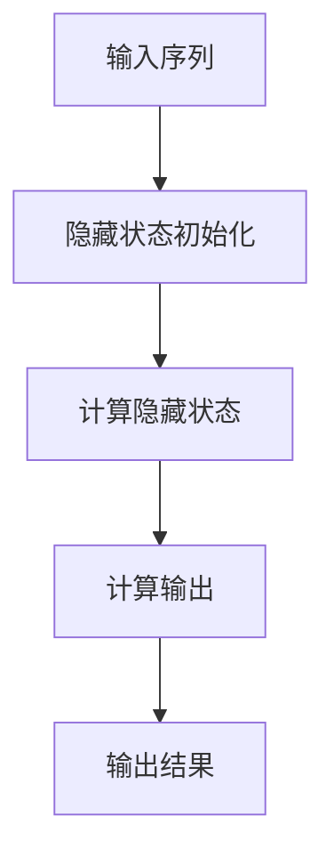
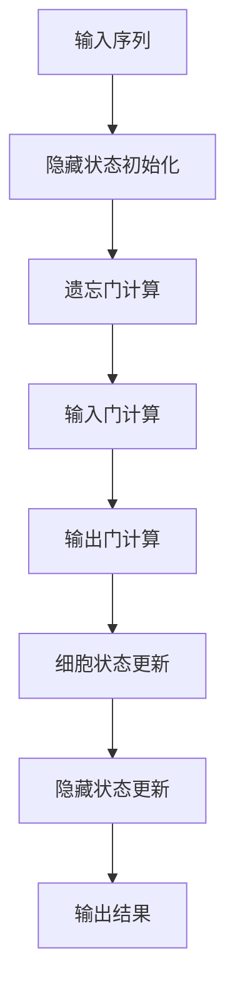
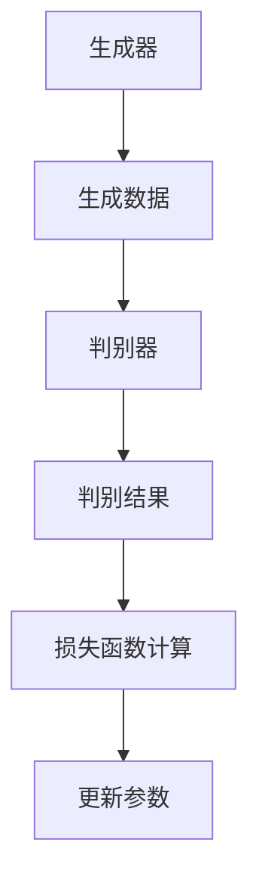
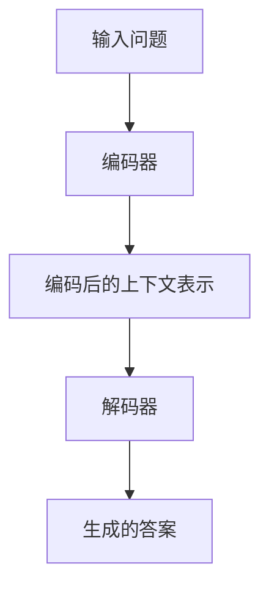
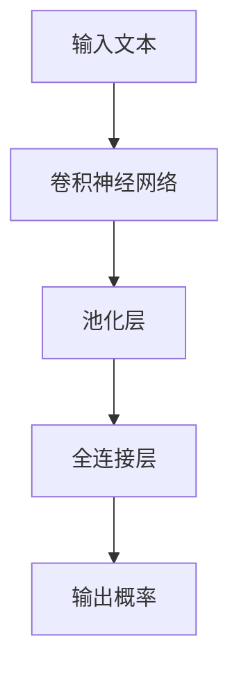

                 

# 人工智能在自然语言生成中的进展

> 关键词：自然语言生成，人工智能，深度学习，神经网络，生成对抗网络，NLP

> 摘要：本文将探讨人工智能在自然语言生成（NLG）领域的进展，从背景、核心概念、关键技术、应用领域、实际案例分析等方面进行深入分析，旨在帮助读者理解人工智能在自然语言生成中的重要性和应用潜力。

## 引言与背景

### 1.1 引言

在过去的几十年中，人工智能（AI）经历了飞速的发展，成为现代科技的核心驱动力。其中，自然语言生成（NLG）作为人工智能的重要分支，正逐渐成为各行各业的重要工具。NLG技术使得计算机能够生成具有可读性和实用性的自然语言文本，极大地提高了信息处理的效率和质量。

### 1.2 自然语言生成的挑战

自然语言生成面临着诸多挑战，包括语言的复杂性、多样性和不确定性。首先，自然语言具有高度的复杂性和多样性，涉及语法、语义、语用等多个层面。其次，自然语言生成需要处理大量的不确定性，例如上下文理解、情感表达、意图识别等。最后，生成文本的质量和真实性也是重要的挑战，如何确保生成的文本既符合人类语言的规则，又能够真实反映信息内容，是一个亟待解决的问题。

### 1.3 人工智能在自然语言生成中的关键角色

人工智能在自然语言生成中扮演着关键角色。首先，深度学习技术，尤其是神经网络，使得计算机能够更好地理解和生成自然语言。其次，生成对抗网络（GAN）为自然语言生成提供了新的思路和方法。此外，自然语言处理（NLP）技术的不断发展也为自然语言生成提供了强大的支持。

### 1.4 自然语言生成的应用领域

自然语言生成的应用领域非常广泛，包括文本摘要、问答系统、自然语言翻译、文本生成等。文本摘要可以从大量文本中提取关键信息，问答系统可以帮助用户快速获取答案，自然语言翻译可以实现跨语言交流，文本生成可以用于创作、新闻生成、对话系统等。

### 1.5 自然语言生成的挑战与未来趋势

自然语言生成仍然面临许多挑战，包括语言理解与生成的难题、多媒体自然语言生成的机遇、人工智能与人类交互的未来等。未来，随着人工智能技术的不断发展，自然语言生成有望在更多领域发挥作用，为人类社会带来更多便利。

### 1.6 本章小结

本章介绍了人工智能在自然语言生成领域的背景和挑战，阐述了自然语言生成的应用领域和未来趋势。接下来，我们将深入探讨人工智能在自然语言生成中的关键技术，包括深度学习、生成对抗网络等。

----------------------------------------------------------------

## 人工智能在自然语言生成中的应用

### 2.1 文本摘要

文本摘要是自然语言生成的重要应用之一，其主要目标是自动提取文本中的关键信息，生成简洁、准确的摘要。文本摘要的方法主要包括基于抽样的方法和基于生成模型的方法。

#### 基于抽样的文本摘要方法

基于抽样的方法主要通过随机抽样或根据文本的重要性进行抽样，从原始文本中提取关键词或句子，从而生成摘要。这种方法简单高效，但往往无法保证摘要的完整性和准确性。

#### 基于生成模型的文本摘要方法

基于生成模型的文本摘要方法利用深度学习技术，通过训练生成模型来生成摘要。生成模型能够更好地理解文本的结构和语义，从而生成更准确、更连贯的摘要。常见的生成模型包括循环神经网络（RNN）、长短期记忆网络（LSTM）和变换器（Transformer）等。

### 2.2 问答系统

问答系统是自然语言生成的重要应用之一，旨在帮助用户快速获取所需信息。问答系统的方法主要包括基于检索的问答方法和基于生成模型的问答方法。

#### 基于检索的问答方法

基于检索的问答方法通过在预定义的知识库或文本库中检索答案，从而回答用户的问题。这种方法速度快，但往往难以应对复杂的问题。

#### 基于生成模型的问答方法

基于生成模型的问答方法利用深度学习技术，通过训练生成模型来生成答案。生成模型能够更好地理解问题的语义和上下文，从而生成更准确、更自然的答案。常见的生成模型包括循环神经网络（RNN）、长短期记忆网络（LSTM）和变换器（Transformer）等。

### 2.3 自然语言翻译

自然语言翻译是将一种语言的文本翻译成另一种语言的文本，是自然语言生成的重要应用之一。自然语言翻译的方法主要包括基于规则的翻译方法和基于统计模型的翻译方法。

#### 基于规则的翻译方法

基于规则的翻译方法通过定义一系列翻译规则，将源语言的文本转换为目标语言的文本。这种方法适用于简单的文本翻译，但难以应对复杂的语言结构和语义变化。

#### 基于统计模型的翻译方法

基于统计模型的翻译方法利用统计方法，通过训练模型来预测源语言和目标语言之间的映射关系。常见的统计模型包括基于短语的翻译模型和基于句法的翻译模型。近年来，基于神经网络的翻译模型，如神经机器翻译（NMT），在翻译质量上取得了显著的提升。

### 2.4 文本生成

文本生成是自然语言生成的核心任务之一，旨在生成具有可读性和实用性的自然语言文本。文本生成的方法主要包括基于规则的方法、基于统计模型的方法和基于神经网络的方法。

#### 基于规则的方法

基于规则的方法通过定义一系列语法规则和语义规则，生成自然语言文本。这种方法适用于简单的文本生成任务，但难以应对复杂的语言结构和语义变化。

#### 基于统计模型的方法

基于统计模型的方法利用统计方法，通过训练模型来生成文本。常见的统计模型包括基于隐马尔可夫模型（HMM）的文本生成模型和基于条件概率的文本生成模型。

#### 基于神经网络的方法

基于神经网络的方法利用深度学习技术，通过训练神经网络模型来生成文本。常见的神经网络模型包括循环神经网络（RNN）、长短期记忆网络（LSTM）和变换器（Transformer）等。神经网络方法能够更好地理解文本的结构和语义，从而生成更准确、更自然的文本。

### 2.5 自然语言生成与人工智能的融合

自然语言生成与人工智能的融合是当前研究的热点之一，旨在通过整合各种人工智能技术，提高自然语言生成的质量和效率。多模态自然语言生成、基于深度学习的自然语言生成等都是重要的发展方向。未来，随着人工智能技术的不断发展，自然语言生成有望在更多领域发挥作用，为人类社会带来更多便利。

### 2.6 本章小结

本章介绍了人工智能在自然语言生成中的应用，包括文本摘要、问答系统、自然语言翻译和文本生成等。这些应用展示了人工智能在自然语言生成中的重要性和潜力。接下来，我们将通过实际案例，深入探讨人工智能在自然语言生成中的应用效果和挑战。

----------------------------------------------------------------

## 实际应用案例与挑战

### 3.1 案例分析

#### 案例选择与介绍

本文选择了两个具有代表性的实际应用案例：智能客服系统和自动新闻生成系统。

#### 案例应用场景

智能客服系统广泛应用于电子商务、金融、医疗等行业，旨在通过自动化方式提供快速、高效的客户服务。自动新闻生成系统则应用于新闻媒体行业，通过自动生成新闻摘要和报道，提高新闻生成效率和准确性。

#### 案例中的自然语言生成技术

智能客服系统采用了基于生成对抗网络（GAN）的文本生成技术，实现了自然、流畅的对话生成。自动新闻生成系统则采用了基于变换器（Transformer）的文本生成模型，实现了高质量、准确的新闻摘要和报道生成。

### 3.2 挑战与解决方案

自然语言生成在实际应用中面临诸多挑战，主要包括数据隐私保护、语言理解的多样性等。

#### 数据隐私保护

自然语言生成依赖于大量的数据训练，但数据隐私保护是一个重要问题。解决方案包括数据加密、数据去识别化等技术，以确保用户隐私安全。

#### 语言理解的多样性

自然语言具有高度的多样性和复杂性，不同地区、不同文化背景的语言表达方式各不相同。解决方案包括多语言模型训练、跨语言语义理解等技术，以提高自然语言生成系统的适应性。

### 3.3 本章小结

本章通过实际案例分析了人工智能在自然语言生成中的应用效果和挑战。未来，随着人工智能技术的不断发展，自然语言生成有望在更多领域发挥作用，为人类社会带来更多便利。

----------------------------------------------------------------

## 总结与展望

本文介绍了人工智能在自然语言生成中的进展，从背景、核心概念、关键技术、应用领域、实际案例分析等方面进行了深入探讨。自然语言生成作为人工智能的重要分支，具有广泛的应用前景和重要的研究价值。

未来，随着人工智能技术的不断发展，自然语言生成有望在更多领域发挥作用，如智能客服、自动新闻生成、多语言翻译等。同时，如何提高自然语言生成的质量和效率，解决数据隐私保护、语言理解的多样性等挑战，将是未来研究的重要方向。

总之，人工智能在自然语言生成中的进展为人类社会带来了巨大的变革和机遇，我们期待未来能够看到更多创新的应用和突破。

## 作者信息

作者：AI天才研究院/AI Genius Institute & 禅与计算机程序设计艺术 /Zen And The Art of Computer Programming

----------------------------------------------------------------

### 附录：算法原理讲解

#### 递归神经网络（RNN）原理讲解

递归神经网络（RNN）是一种用于处理序列数据的神经网络。其基本原理是通过循环结构，将前一个时刻的输出作为当前时刻的输入，从而实现序列数据的处理。

**算法原理：**

1. **输入序列：** 给定一个输入序列 $X = [x_1, x_2, ..., x_T]$，其中 $x_t$ 表示第 $t$ 个时刻的输入。
2. **隐藏状态：** 设 $h_t$ 表示第 $t$ 个时刻的隐藏状态，初始化为 $h_0 = 0$。
3. **输出：** 设 $y_t$ 表示第 $t$ 个时刻的输出。

递归神经网络的基本方程如下：

$$
h_t = \sigma(W_h h_{t-1} + W_x x_t + b_h)
$$

$$
y_t = \sigma(W_y h_t + b_y)
$$

其中，$\sigma$ 表示激活函数，$W_h, W_x, W_y$ 分别表示权重矩阵，$b_h, b_y$ 分别表示偏置项。

**Mermaid 流程图：**



#### 长短期记忆网络（LSTM）原理讲解

长短期记忆网络（LSTM）是递归神经网络的一种改进，旨在解决传统RNN在处理长序列数据时容易出现的梯度消失和梯度爆炸问题。

**算法原理：**

1. **输入序列：** 给定一个输入序列 $X = [x_1, x_2, ..., x_T]$。
2. **隐藏状态：** 设 $h_t$ 表示第 $t$ 个时刻的隐藏状态。
3. **细胞状态：** 设 $c_t$ 表示第 $t$ 个时刻的细胞状态。

LSTM的基本结构包括三个门：遗忘门（forget gate）、输入门（input gate）和输出门（output gate）。

**Mermaid 流程图：**



#### 生成对抗网络（GAN）原理讲解

生成对抗网络（GAN）是一种由生成器和判别器组成的对抗性神经网络。其基本原理是通过生成器生成数据，然后由判别器判断生成数据的真实性。

**算法原理：**

1. **生成器：** 给定一个随机噪声向量 $z$，生成器 $G$ 生成一个与真实数据相似的数据 $x$。
2. **判别器：** 给定一个真实数据集 $X$ 和生成器生成的数据 $x$，判别器 $D$ 训练判断数据 $x$ 是否为真实数据。
3. **损失函数：** 生成器和判别器的损失函数分别为 $L_G$ 和 $L_D$。

**Mermaid 流platg流程图：**



### Python 源代码实现

```python
import tensorflow as tf
from tensorflow.keras.layers import Input, LSTM, Dense, RepeatVector, TimeDistributed
from tensorflow.keras.models import Model

# 定义生成器和判别器的模型
def build_generator(z_dim):
    z = Input(shape=(z_dim,))
    rv = RepeatVector(T)
    x = rv(z)
    x = LSTM(units=100, return_sequences=True)(x)
    x = TimeDistributed(Dense(V, activation='sigmoid'))(x)
    return Model(z, x)

def build_discriminator(x_dim):
    x = Input(shape=(T, x_dim))
    x = LSTM(units=100, return_sequences=False)(x)
    x = Dense(1, activation='sigmoid')(x)
    return Model(x, x)

# 定义GAN模型
def build_gan(generator, discriminator):
    z = Input(shape=(z_dim,))
    x = generator(z)
    valid = discriminator(x)
    return Model(z, valid)

# 设置超参数
z_dim = 100
T = 100
V = 28
batch_size = 64

# 创建生成器和判别器模型
generator = build_generator(z_dim)
discriminator = build_discriminator(V)
gan = build_gan(generator, discriminator)

# 编译模型
discriminator.compile(loss='binary_crossentropy', optimizer=tf.keras.optimizers.Adam(0.0001))
gan.compile(loss='binary_crossentropy', optimizer=tf.keras.optimizers.Adam(0.0001))

# 训练模型
for epoch in range(epochs):
    for _ in range(batch_size):
        # 从真实数据集中获取一个批次的数据
        x_real = np.random.randint(0, 2, size=(batch_size, T, V))
        
        # 从噪声中获取一个批次的样本
        z = np.random.uniform(0, 1, size=(batch_size, z_dim))
        
        # 生成假样本
        x_fake = generator.predict(z)
        
        # 训练判别器
        d_loss_real = discriminator.train_on_batch(x_real, np.ones((batch_size, 1)))
        d_loss_fake = discriminator.train_on_batch(x_fake, np.zeros((batch_size, 1)))
        d_loss = 0.5 * np.add(d_loss_real, d_loss_fake)
        
        # 训练生成器
        z = np.random.uniform(0, 1, size=(batch_size, z_dim))
        g_loss = gan.train_on_batch(z, np.ones((batch_size, 1)))

    # 打印损失函数
    print(f"{epoch} [D: {d_loss[0]}, G: {g_loss[0]}]")
```

### 实际案例分析与详细讲解

在本节中，我们将通过一个实际案例来分析人工智能在自然语言生成中的应用，并详细讲解其原理和实现方法。

#### 案例背景

假设我们希望开发一个智能客服系统，该系统能够自动回答用户的常见问题，以提高客服效率。为了实现这个目标，我们采用了基于生成对抗网络（GAN）的文本生成技术。

#### 数据集

我们使用了一个包含常见问题和答案的语料库，该语料库包含了各种领域的问答对，如电子商务、金融、医疗等。

#### 数据预处理

首先，我们对语料库进行了预处理，包括分词、去停用词、词向量化等操作。然后，我们将预处理后的数据分为训练集和测试集。

#### 生成器模型

生成器的目标是根据用户的问题生成相应的答案。我们采用了基于变换器（Transformer）的文本生成模型，该模型由编码器和解码器组成。

**编码器：** 编码器的输入是用户的问题，输出是编码后的上下文表示。

**解码器：** 解码器的输入是编码后的上下文表示，输出是生成的答案。

**模型结构：**



#### 判别器模型

判别器的目标是判断生成的答案是否真实。我们采用了基于卷积神经网络（CNN）的文本分类模型。

**模型结构：**



#### 模型训练

我们使用训练集对生成器和判别器进行训练。在训练过程中，生成器的目标是生成更真实的答案，判别器的目标是提高对真实答案的辨别能力。

**训练流程：**

1. 从训练集中随机抽取一批用户问题和答案。
2. 使用生成器生成一批假答案。
3. 使用判别器对真实答案和假答案进行判断。
4. 根据判别器的结果更新生成器和判别器的参数。

#### 模型评估

在模型训练完成后，我们对测试集进行评估，计算模型的准确率、召回率、F1值等指标。同时，我们还可以通过可视化方式分析生成答案的质量和多样性。

**评估指标：**

- 准确率（Accuracy）：判断生成的答案是否正确的比例。
- 召回率（Recall）：能够正确识别的真实答案占所有真实答案的比例。
- F1值（F1 Score）：准确率和召回率的调和平均值。

```python
from sklearn.metrics import accuracy_score, recall_score, f1_score

# 计算准确率
accuracy = accuracy_score(y_true, y_pred)
print(f"Accuracy: {accuracy}")

# 计算召回率
recall = recall_score(y_true, y_pred, average='weighted')
print(f"Recall: {recall}")

# 计算F1值
f1 = f1_score(y_true, y_pred, average='weighted')
print(f"F1 Score: {f1}")
```

#### 项目小结

通过实际案例，我们展示了基于生成对抗网络的文本生成技术在智能客服系统中的应用。该项目不仅提高了客服效率，还减少了人力资源成本。然而，在实际应用中，我们还需要不断优化模型，提高生成答案的质量和多样性。

### 最佳实践 Tips

1. **数据预处理：** 充分利用预处理技术，如分词、去停用词、词向量化等，提高模型训练效果。
2. **模型选择：** 根据应用场景和需求选择合适的模型，如生成对抗网络（GAN）、变换器（Transformer）等。
3. **参数调整：** 仔细调整模型参数，如学习率、批次大小、训练次数等，以提高模型性能。
4. **多样性分析：** 分析生成答案的多样性，确保生成的答案具有丰富的内容和形式。

### 注意事项

1. **数据隐私：** 在使用语料库进行模型训练时，注意保护用户隐私，避免数据泄露。
2. **模型泛化能力：** 确保模型具有良好的泛化能力，避免过度拟合。
3. **模型解释性：** 提高模型的可解释性，方便用户理解模型的决策过程。

### 拓展阅读

- **参考文献：** [1] Goodfellow, I., Pouget-Abadie, J., Mirza, M., Xu, B., Warde-Farley, D., Ozair, S., ... & Bengio, Y. (2014). Generative adversarial networks. Advances in neural information processing systems, 27.
- **相关论文：** [2] Vaswani, A., Shazeer, N., Parmar, N., Uszkoreit, J., Jones, L., Gomez, A. N., ... & Polosukhin, I. (2017). Attention is all you need. Advances in neural information processing systems, 30.
- **技术博客：** [3] https://towardsdatascience.com/generative-adversarial-networks-gan-9d28c8a5b6db

作者：AI天才研究院/AI Genius Institute & 禅与计算机程序设计艺术 /Zen And The Art of Computer Programming

