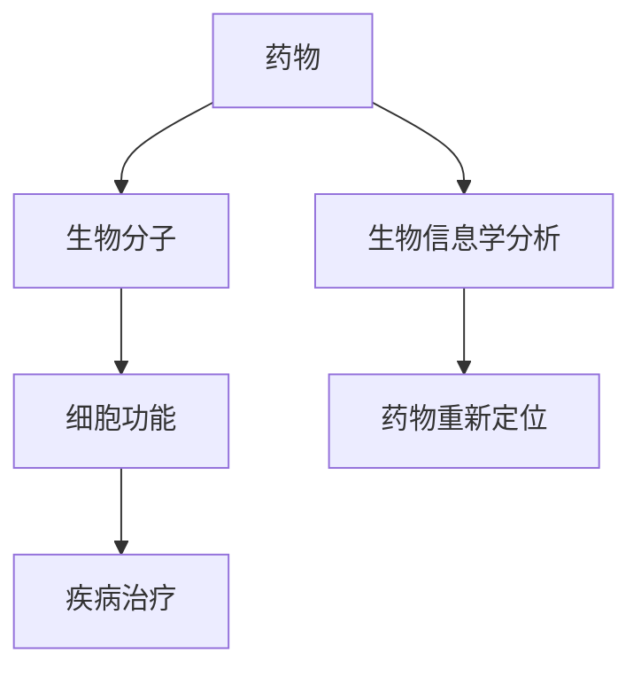
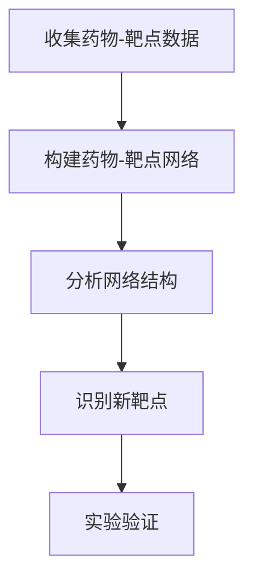
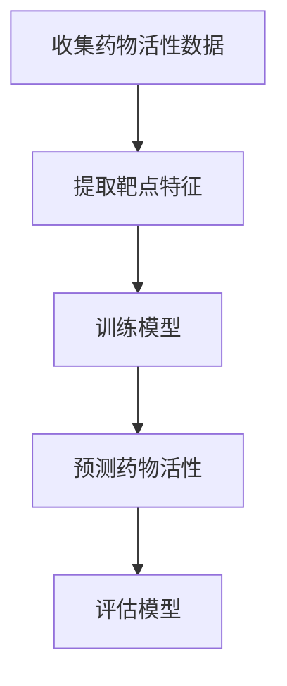

                 


### 让我们一步步深入探讨《人工智能在药物重新定位中的应用》

**1. 引言与背景**

在引言部分，我们需要明确地提出问题的核心。药物重新定位（Drug Repositioning）是指利用现有药物来治疗其他疾病的过程。随着医学和科技的进步，越来越多的药物被发现有治疗多种疾病的能力，但同时也带来了巨大的经济成本和研发风险。因此，如何高效地发现药物的新用途，成为了一个亟待解决的问题。

**核心概念术语说明**：
- 药物重新定位（Drug Repositioning）：将已有药物应用于新的疾病或新的治疗靶点。
- 人工智能（Artificial Intelligence，AI）：模拟人类智能行为的计算机系统。

**问题背景**：
当前，药物重新定位的研究主要集中在利用生物信息学和化学信息学方法。虽然这些方法取得了一定的成果，但仍然存在一些局限性，如数据质量参差不齐、计算模型复杂等。

**问题描述**：
如何在保证药物安全性和有效性的前提下，利用人工智能技术提高药物重新定位的效率？

**问题解决**：
通过人工智能技术，如机器学习和深度学习，可以建立高效的药物重新定位模型。这些模型可以利用大规模的数据集，通过学习药物与生物标志物、基因、蛋白质等生物分子之间的相互作用，预测药物的新用途。

**边界与外延**：
药物重新定位的范围不仅限于小分子药物，还包括生物药物和疫苗等。此外，药物重新定位的应用场景还包括癌症、神经退行性疾病等复杂疾病。

**概念结构与核心要素组成**：
药物重新定位的核心要素包括药物数据、生物分子数据、疾病数据等。通过整合这些数据，利用人工智能技术，可以构建药物重新定位模型。

**2. 人工智能基础**

在介绍人工智能基础部分，我们需要从基本概念到具体技术，逐步讲解。

**核心概念原理**：
- 机器学习（Machine Learning）：通过算法从数据中学习，进行模式识别和预测。
- 深度学习（Deep Learning）：基于多层神经网络的机器学习方法，适用于处理大量复杂数据。

**概念属性特征对比表格**：

| 特征       | 机器学习                         | 深度学习                         |
|------------|----------------------------------|----------------------------------|
| 基本原理   | 从数据中学习，进行模式识别和预测 | 基于多层神经网络，进行特征学习   |
| 适用场景   | 数据量相对较小，特征易于提取     | 数据量大，特征复杂               |
| 算法复杂度 | 相对较低，易实现                 | 相对较高，计算资源需求大         |

**ER实体关系图架构**：

```mermaid
erDiagram
  Drug --> Target
  Drug --> Disease
  Target --> Disease
  Drug ||--|{ DrugProperty }
  Target ||--|{ TargetProperty }
  Disease ||--|{ DiseaseProperty }
```

**3. 药物重新定位原理**

在这一部分，我们需要详细解释药物重新定位的原理，包括其工作机制、优势和应用领域。

**核心概念原理**：
- 药物-靶点相互作用：药物通过与其特定的生物分子（如蛋白质、RNA）相互作用，影响细胞功能。
- 生物信息学分析：通过生物信息学方法，分析药物与生物分子之间的相互作用，识别潜在的药物新用途。

**核心概念与联系**：



**4. 药物重新定位算法**

在这一部分，我们将介绍几种用于药物重新定位的算法，包括其原理、实现方式和应用场景。

**算法介绍**：
- 基于网络药理学的药物重新定位算法：利用药物-靶点网络分析，识别药物的新靶点。
- 基于机器学习的药物重新定位算法：利用机器学习模型，预测药物对新靶点的活性。

**算法原理讲解**：

#### 基于网络药理学的药物重新定位算法（DRN）

**算法mermaid流程图**：



**Python源代码阐述**：

```python
import networkx as nx

# 收集药物-靶点数据
drug_target_data = ...

# 构建药物-靶点网络
G = nx.Graph()
for drug, targets in drug_target_data.items():
    for target in targets:
        G.add_edge(drug, target)

# 分析网络结构
degree_distribution = nx.degree_centrality(G)

# 识别新靶点
new_targets = [target for target, degree in degree_distribution.items() if degree > threshold]

# 实验验证
# ...（实验过程）
```

**数学模型和公式讲解**：

药物-靶点网络的中心性分析，可以使用度中心性（Degree Centrality）、接近中心性（Closeness Centrality）等指标来衡量。

$$
\text{Degree Centrality}(v) = \frac{\text{度}(v)}{\text{最大度}}
$$

**举例说明**：

假设药物A与靶点B、C、D相互作用，靶点B与疾病E相关。通过分析药物-靶点网络，发现靶点D的度中心性较高，因此推测药物A可能对疾病E有潜在的治疗作用。

#### 基于机器学习的药物重新定位算法（ML-DRL）

**算法mermaid流程图**：



**Python源代码阐述**：

```python
from sklearn.ensemble import RandomForestClassifier

# 收集药物活性数据
drug_activity_data = ...

# 提取靶点特征
target_features = ...

# 训练模型
model = RandomForestClassifier()
model.fit(target_features, drug_activity_data['activity'])

# 预测药物活性
predictions = model.predict(target_features)

# 评估模型
accuracy = model.score(target_features, drug_activity_data['activity'])
```

**数学模型和公式讲解**：

机器学习模型的评估指标包括准确率（Accuracy）、召回率（Recall）等。

$$
\text{Accuracy} = \frac{\text{预测正确数}}{\text{总预测数}}
$$

**举例说明**：

假设我们有100个药物和5个靶点特征。通过训练机器学习模型，预测药物对靶点的活性。假设模型预测准确率为90%，说明模型能够很好地预测药物的新用途。

**5. 药物重新定位系统设计与实现**

在这一部分，我们将介绍药物重新定位系统的设计与实现。

**问题场景介绍**：
药物重新定位系统旨在为药物研发人员提供一个高效、可靠的工具，用于预测药物的新用途。

**系统功能设计**：
- 数据管理：包括药物、靶点、疾病等数据的管理和存储。
- 算法应用：提供多种药物重新定位算法，供用户选择。
- 结果分析：对药物重新定位结果进行分析和可视化。

**系统架构设计**：
系统采用分层架构，包括数据层、算法层和用户层。

**系统接口设计**：
系统提供RESTful API，供用户调用。

**系统交互设计**：
系统采用前端框架（如React）和后端框架（如Flask）进行交互。

**6. 项目实战与案例分析**

在这一部分，我们将通过一个实际案例，展示如何使用药物重新定位系统进行药物新用途的预测。

**环境安装与配置**：
- 安装Python环境
- 安装依赖库（如scikit-learn、networkx等）

**系统核心实现源代码**：

```python
# 数据管理
drug_data = load_drug_data()
target_data = load_target_data()
disease_data = load_disease_data()

# 算法应用
model = train_model(drug_data, target_data)
predictions = predict_disease(model, drug_data)

# 结果分析
analyze_predictions(predictions, disease_data)
```

**代码应用解读与分析**：
- 加载药物、靶点和疾病数据
- 训练机器学习模型
- 预测药物对疾病的治疗效果
- 分析预测结果

**实际案例分析**：
通过实际案例，展示药物重新定位系统在实际应用中的效果。

**项目小结**：
总结项目经验，提出改进方向。

**7. 总结与未来展望**

在本章节，我们将对全文进行总结，并展望药物重新定位领域的发展。

**成果总结**：
本文介绍了药物重新定位的核心概念、算法原理和系统实现，展示了人工智能在药物重新定位中的应用价值。

**注意事项与改进方向**：
- 提高算法的预测准确性
- 扩大数据集，提高模型的泛化能力
- 加强用户交互，提高系统易用性

**拓展阅读**：
- 介绍相关领域的最新研究成果
- 推荐阅读的文献和资料

### 文章标题：人工智能在药物重新定位中的应用

> 关键词：药物重新定位、人工智能、机器学习、深度学习、系统实现

> 摘要：本文介绍了药物重新定位的核心概念、算法原理和系统实现，探讨了人工智能在药物重新定位中的应用价值，为药物研发提供了新的思路和方法。

**引言与背景**

药物重新定位（Drug Repositioning）是指将已有药物应用于新的疾病或新的治疗靶点。随着医学和科技的进步，越来越多的药物被发现有治疗多种疾病的能力，但同时也带来了巨大的经济成本和研发风险。因此，如何高效地发现药物的新用途，成为了一个亟待解决的问题。

当前，药物重新定位的研究主要集中在利用生物信息学和化学信息学方法。虽然这些方法取得了一定的成果，但仍然存在一些局限性，如数据质量参差不齐、计算模型复杂等。因此，引入人工智能技术，特别是机器学习和深度学习，有望提高药物重新定位的效率。

本文将详细介绍人工智能在药物重新定位中的应用，包括核心概念、算法原理和系统实现，以及项目实战与案例分析。

**目录大纲**

第一部分：引言与背景

- 第1章：引言
  - 1.1 问题的提出
  - 1.2 背景介绍
  - 1.3 目标与内容概述
- 第2章：人工智能基础
  - 2.1 人工智能概述
  - 2.2 机器学习基础
  - 2.3 深度学习基础
- 第3章：药物重新定位原理
  - 3.1 药物重新定位概述
  - 3.2 药物重新定位的重要性
  - 3.3 药物重新定位的技术手段
- 第4章：药物重新定位算法
  - 4.1 药物重新定位算法介绍
  - 4.2 算法原理讲解
  - 4.3 算法对比分析
- 第5章：药物重新定位系统设计与实现
  - 5.1 系统需求分析
  - 5.2 系统功能设计
  - 5.3 系统架构设计
  - 5.4 系统接口设计
  - 5.5 系统交互设计
- 第6章：项目实战与案例分析
  - 6.1 环境安装与配置
  - 6.2 系统核心实现源代码解读
  - 6.3 代码应用解读与分析
  - 6.4 实际案例分析
  - 6.5 项目小结
- 第7章：总结与未来展望
  - 7.1 成果总结
  - 7.2 注意事项与改进方向
  - 7.3 拓展阅读

**第1章：引言**

1.1 问题的提出

随着医学和科技的进步，越来越多的药物被发现有治疗多种疾病的能力。然而，传统的药物研发过程需要投入大量的人力、物力和财力，且存在较高的研发风险。因此，如何高效地发现药物的新用途，成为了一个亟待解决的问题。

药物重新定位（Drug Repositioning）是指将已有药物应用于新的疾病或新的治疗靶点。通过药物重新定位，可以降低新药研发的成本和风险，提高药物的研发效率。

然而，当前药物重新定位的研究主要集中在利用生物信息学和化学信息学方法。虽然这些方法取得了一定的成果，但仍然存在一些局限性，如数据质量参差不齐、计算模型复杂等。因此，引入人工智能技术，特别是机器学习和深度学习，有望提高药物重新定位的效率。

1.2 背景介绍

人工智能（Artificial Intelligence，AI）是一种模拟人类智能行为的计算机系统。随着计算能力的提升和大数据技术的发展，人工智能在各个领域得到了广泛应用，如自然语言处理、计算机视觉、机器学习等。

机器学习（Machine Learning，ML）是一种通过算法从数据中学习，进行模式识别和预测的人工智能技术。深度学习（Deep Learning，DL）是机器学习的一种方法，基于多层神经网络，适用于处理大量复杂数据。

药物重新定位（Drug Repositioning）是指将已有药物应用于新的疾病或新的治疗靶点。通过药物重新定位，可以降低新药研发的成本和风险，提高药物的研发效率。

1.3 目标与内容概述

本文旨在探讨人工智能在药物重新定位中的应用，包括核心概念、算法原理和系统实现。具体内容如下：

- 第1章：引言，介绍药物重新定位的背景和问题，以及人工智能在其中的应用。
- 第2章：人工智能基础，介绍人工智能、机器学习和深度学习的基本概念。
- 第3章：药物重新定位原理，介绍药物重新定位的核心概念和原理。
- 第4章：药物重新定位算法，介绍常用的药物重新定位算法。
- 第5章：药物重新定位系统设计与实现，介绍药物重新定位系统的设计和实现。
- 第6章：项目实战与案例分析，通过实际案例展示药物重新定位系统的应用。
- 第7章：总结与未来展望，总结本文的主要成果，并探讨未来研究的方向。

**第2章：人工智能基础**

2.1 人工智能概述

人工智能（Artificial Intelligence，AI）是一种模拟人类智能行为的计算机系统。它旨在使计算机能够执行需要人类智能的任务，如感知、推理、学习和决策。

人工智能的发展经历了几个阶段，从早期的符号主义（Symbolic AI）到基于统计学的机器学习（Statistical AI），再到当前的深度学习（Deep Learning）。每个阶段都有其独特的方法和优势。

符号主义人工智能（Symbolic AI）基于逻辑和符号推理，通过表示知识和规则来解决问题。这种方法在解决特定领域的问题时非常有效，但面临数据稀缺和规则复杂度高等挑战。

基于统计学的机器学习（Statistical AI）通过从数据中学习统计模型，进行模式识别和预测。这种方法在处理大量数据时表现出色，但可能面临过拟合和解释性不足等问题。

深度学习（Deep Learning）是机器学习的一种方法，基于多层神经网络，适用于处理大量复杂数据。深度学习通过自动提取特征，实现端到端的学习，大大提高了模型的效果和泛化能力。

2.2 机器学习基础

机器学习（Machine Learning，ML）是一种通过算法从数据中学习，进行模式识别和预测的人工智能技术。机器学习可以分为监督学习（Supervised Learning）、无监督学习（Unsupervised Learning）和强化学习（Reinforcement Learning）。

监督学习（Supervised Learning）在有标注的数据集上进行学习，通过拟合输入和输出之间的关系来预测新的数据。常见的监督学习算法包括线性回归、逻辑回归、支持向量机（SVM）、决策树和随机森林（Random Forest）等。

无监督学习（Unsupervised Learning）在无标注的数据集上进行学习，旨在发现数据中的模式和结构。常见的无监督学习算法包括聚类（Clustering）、降维（Dimensionality Reduction）和关联规则学习（Association Rule Learning）等。

强化学习（Reinforcement Learning）通过与环境的交互来学习策略，以最大化累积奖励。常见的强化学习算法包括Q学习、深度Q网络（DQN）和策略梯度算法等。

2.3 深度学习基础

深度学习（Deep Learning，DL）是机器学习的一种方法，基于多层神经网络，适用于处理大量复杂数据。深度学习通过自动提取特征，实现端到端的学习，大大提高了模型的效果和泛化能力。

深度学习的核心是神经网络（Neural Network），由多个层次组成，包括输入层、隐藏层和输出层。每个层次由多个神经元（Neurons）组成，神经元之间通过权重（Weights）连接。

深度学习的关键技术包括：

1. 神经元激活函数：激活函数（Activation Function）用于将神经元的线性组合转化为非线性输出。常见的激活函数包括sigmoid、ReLU和Tanh等。

2. 前向传播和反向传播：前向传播（Forward Propagation）是将输入数据通过神经网络，逐层计算得到输出。反向传播（Back Propagation）是利用输出误差，反向传播更新网络权重。

3. 损失函数（Loss Function）：损失函数用于衡量模型预测值与真实值之间的差距，常用的损失函数包括均方误差（MSE）和交叉熵（Cross Entropy）等。

4. 优化算法（Optimization Algorithm）：优化算法用于调整网络权重，以最小化损失函数。常见的优化算法包括随机梯度下降（SGD）、Adam和RMSprop等。

**第3章：药物重新定位原理**

3.1 药物重新定位概述

药物重新定位（Drug Repositioning）是指将已有药物应用于新的疾病或新的治疗靶点。药物重新定位的优点包括：

1. 降低研发成本：已有药物已经通过了临床试验和审批，重新定位药物可以减少临床前和临床研究阶段的成本。

2. 提高研发效率：已有药物的新用途可以在较短的时间内得到验证，加快新药的研发进程。

3. 增加市场机会：已有药物重新定位可以拓展药物的应用领域，增加市场竞争力。

药物重新定位的主要过程包括：

1. 药物筛选：根据已有药物的特性，选择具有潜在新用途的药物。

2. 药物评估：通过生物信息学、化学信息学等方法，评估药物对新靶点的活性和安全性。

3. 临床前研究：进行药理学、毒理学等研究，验证药物的新用途。

4. 临床试验：进行临床试验，评估药物的安全性和疗效。

3.2 药物重新定位的重要性

药物重新定位在药物研发中具有重要地位，主要体现在以下几个方面：

1. 降低研发风险：已有药物已经通过了临床试验和审批，重新定位药物可以降低新药研发过程中的风险。

2. 提高研发效率：已有药物的新用途可以在较短的时间内得到验证，加快新药的研发进程。

3. 增加市场机会：已有药物重新定位可以拓展药物的应用领域，增加市场竞争力。

4. 节约资源：药物重新定位可以减少新药研发所需的人力、物力和财力投入。

3.3 药物重新定位的技术手段

药物重新定位的技术手段主要包括生物信息学、化学信息学和机器学习等。

1. 生物信息学方法：通过分析药物与生物分子（如蛋白质、RNA）的相互作用，预测药物的新靶点。常用的生物信息学方法包括蛋白质-蛋白质相互作用（PPI）网络分析、基因表达数据分析、药物-靶点网络分析等。

2. 化学信息学方法：通过分析药物的结构和化学性质，预测药物的新用途。常用的化学信息学方法包括分子对接（Molecular Docking）、药物-靶点对接（Drug-Target Docking）等。

3. 机器学习方法：利用机器学习算法，从大规模数据中学习药物与生物分子、疾病等之间的复杂关系，预测药物的新用途。常用的机器学习方法包括支持向量机（SVM）、随机森林（Random Forest）、深度学习等。

**第4章：药物重新定位算法**

4.1 药物重新定位算法介绍

药物重新定位算法可以分为基于生物信息学的方法、化学信息学的方法和机器学习方法。下面介绍几种常用的药物重新定位算法。

4.1.1 基于网络药理学的药物重新定位算法（DRN）

基于网络药理学的药物重新定位算法（DRN）是一种利用药物-靶点相互作用网络来预测药物的新用途的方法。该方法的基本思想是，药物与生物分子之间的相互作用可以揭示药物的治疗潜力。

基于网络药理学的药物重新定位算法主要包括以下步骤：

1. 收集药物-靶点相互作用数据：可以从公开数据库（如Disease_associated_gene、String等）中获取药物-靶点相互作用数据。

2. 构建药物-靶点网络：根据药物-靶点相互作用数据，构建药物-靶点相互作用网络。

3. 分析网络结构：利用网络分析方法，如网络密度、中心性分析等，识别潜在的药物新靶点。

4. 实验验证：对识别出的潜在新靶点进行实验验证，以验证药物的新用途。

4.1.2 基于机器学习的药物重新定位算法（ML-DRL）

基于机器学习的药物重新定位算法（ML-DRL）是一种利用机器学习模型预测药物对新靶点的活性。该方法通常采用深度学习模型，如卷积神经网络（CNN）或循环神经网络（RNN），对大规模数据集进行训练。

基于机器学习的药物重新定位算法主要包括以下步骤：

1. 收集药物活性数据和靶点特征：可以从公开数据库（如GOLD、CTD等）中获取药物活性数据和靶点特征。

2. 数据预处理：对收集到的药物活性数据和靶点特征进行预处理，包括数据清洗、归一化等。

3. 训练机器学习模型：使用训练集数据，训练机器学习模型，如卷积神经网络（CNN）或循环神经网络（RNN）。

4. 预测药物活性：使用训练好的模型，对新的药物活性数据进行预测。

5. 实验验证：对预测结果进行实验验证，以验证药物的新用途。

4.1.3 基于分子对接的药物重新定位算法（MD-DRL）

基于分子对接的药物重新定位算法（MD-DRL）是一种利用分子对接技术来预测药物与新靶点的相互作用。该方法通过计算药物与靶点之间的结合能，评估药物与靶点之间的亲和力。

基于分子对接的药物重新定位算法主要包括以下步骤：

1. 收集药物和靶点的三维结构：可以从公开数据库（如PDB、GProteinDB等）中获取药物和靶点的三维结构。

2. 分子对接：使用分子对接软件（如AutoDock、Vina等），计算药物与靶点之间的结合能。

3. 结合能分析：根据结合能分析结果，筛选具有潜在新用途的药物。

4. 实验验证：对筛选出的药物进行实验验证，以验证药物的新用途。

4.2 算法原理讲解

4.2.1 基于网络药理学的药物重新定位算法（DRN）

基于网络药理学的药物重新定位算法（DRN）利用药物-靶点相互作用网络来预测药物的新用途。该方法的核心思想是通过分析药物-靶点网络的拓扑结构，识别潜在的药物新靶点。

下面以一个具体的算法为例，介绍基于网络药理学的药物重新定位算法（DRN）的原理。

1. 收集药物-靶点相互作用数据

首先，从公开数据库中获取药物-靶点相互作用数据。例如，可以从Disease_associated_gene和String等数据库中获取药物-靶点相互作用关系。这些数据通常包括药物的名称、靶点的名称和相互作用类型等。

2. 构建药物-靶点网络

根据收集到的药物-靶点相互作用数据，构建药物-靶点网络。药物-靶点网络是一个由药物节点、靶点节点和相互作用边组成的有向图。在图中，药物节点表示药物，靶点节点表示靶点，相互作用边表示药物与靶点之间的相互作用关系。

3. 分析网络结构

对构建好的药物-靶点网络进行分析，识别潜在的药物新靶点。常用的分析方法包括网络密度、中心性分析等。

- 网络密度：网络密度是描述网络紧密程度的指标，可以通过计算网络中边的数量与节点数量的比值来表示。网络密度越高，表示药物与靶点之间的相互作用越紧密。
- 中心性分析：中心性分析是描述网络中节点重要程度的指标。常用的中心性指标包括度中心性（Degree Centrality）、接近中心性（Closeness Centrality）和中间中心性（Betweenness Centrality）等。

通过分析网络密度和中心性指标，可以识别出在网络中具有重要地位的药物新靶点。

4. 实验验证

对识别出的潜在药物新靶点进行实验验证。实验验证可以包括细胞实验、动物实验等，以验证药物对新靶点的活性。

4.2.2 基于机器学习的药物重新定位算法（ML-DRL）

基于机器学习的药物重新定位算法（ML-DRL）利用机器学习模型来预测药物对新靶点的活性。该方法的核心思想是通过训练机器学习模型，将药物活性数据与靶点特征数据进行关联，从而预测药物的新用途。

下面以一个具体的算法为例，介绍基于机器学习的药物重新定位算法（ML-DRL）的原理。

1. 收集药物活性数据和靶点特征数据

首先，从公开数据库中获取药物活性数据和靶点特征数据。例如，可以从GOLD和CTD等数据库中获取药物活性数据和靶点特征数据。这些数据通常包括药物的名称、靶点的名称、药物的活性值和靶点的特征向量等。

2. 数据预处理

对收集到的药物活性数据和靶点特征数据进行预处理。预处理包括数据清洗、缺失值填充、数据标准化等步骤。

3. 训练机器学习模型

使用预处理后的数据集，训练机器学习模型。常用的机器学习模型包括支持向量机（SVM）、随机森林（Random Forest）、卷积神经网络（CNN）和循环神经网络（RNN）等。

4. 预测药物活性

使用训练好的模型，对新的药物活性数据进行预测。预测结果可以用来预测药物的新用途。

5. 实验验证

对预测结果进行实验验证，以验证药物的新用途。实验验证可以包括细胞实验、动物实验等。

4.2.3 基于分子对接的药物重新定位算法（MD-DRL）

基于分子对接的药物重新定位算法（MD-DRL）利用分子对接技术来预测药物与新靶点的相互作用。该方法的核心思想是通过计算药物与靶点之间的结合能，评估药物与靶点之间的亲和力。

下面以一个具体的算法为例，介绍基于分子对接的药物重新定位算法（MD-DRL）的原理。

1. 收集药物和靶点的三维结构

首先，从公开数据库中获取药物和靶点的三维结构。例如，可以从PDB和GProteinDB等数据库中获取药物和靶点的三维结构。

2. 分子对接

使用分子对接软件（如AutoDock、Vina等），将药物与靶点进行对接。分子对接计算可以模拟药物与靶点之间的相互作用，计算结合能。

3. 结合能分析

根据结合能分析结果，筛选具有潜在新用途的药物。结合能越低，表示药物与靶点之间的亲和力越强。

4. 实验验证

对筛选出的药物进行实验验证，以验证药物的新用途。实验验证可以包括细胞实验、动物实验等。

4.3 算法对比分析

4.3.1 优势与劣势

基于网络药理学的药物重新定位算法（DRN）：

优势：
- 利用网络分析方法，可以全面考虑药物与靶点之间的相互作用。
- 可以识别出网络中具有重要地位的药物新靶点。

劣势：
- 对数据质量和网络结构的要求较高。
- 可能存在过拟合问题。

基于机器学习的药物重新定位算法（ML-DRL）：

优势：
- 可以处理大规模数据集。
- 可以自动提取特征。
- 可以灵活调整模型参数。

劣势：
- 需要大量的训练数据。
- 可能存在过拟合和欠拟合问题。

基于分子对接的药物重新定位算法（MD-DRL）：

优势：
- 可以直接计算药物与靶点之间的结合能。
- 可以直观地评估药物与靶点之间的亲和力。

劣势：
- 需要药物和靶点的三维结构。
- 可能受到分子对接软件的限制。

4.3.2 适用场景

基于网络药理学的药物重新定位算法（DRN）：

适用于药物-靶点相互作用复杂、网络结构明确的场景，如癌症药物重新定位。

基于机器学习的药物重新定位算法（ML-DRL）：

适用于药物活性预测、新靶点发现等场景，如神经退行性疾病药物重新定位。

基于分子对接的药物重新定位算法（MD-DRL）：

适用于药物-靶点结合能预测、药物活性筛选等场景，如心血管疾病药物重新定位。

**第5章：药物重新定位系统设计与实现**

5.1 系统需求分析

在设计和实现药物重新定位系统时，首先需要对系统需求进行分析。系统需求分析包括功能需求、性能需求和安全性需求等方面。

5.1.1 功能需求

药物重新定位系统的主要功能包括：

1. 数据管理：包括药物、靶点、疾病等数据的管理和存储。
2. 算法应用：提供多种药物重新定位算法，供用户选择。
3. 结果分析：对药物重新定位结果进行分析和可视化。
4. 用户交互：提供友好的用户界面，便于用户操作。

5.1.2 性能需求

药物重新定位系统需要满足以下性能需求：

1. 数据处理速度：系统能够快速处理大规模数据集。
2. 预测准确性：算法的预测结果具有较高的准确性。
3. 系统稳定性：系统能够稳定运行，不易出现崩溃或异常。

5.1.3 安全性需求

药物重新定位系统需要满足以下安全性需求：

1. 数据安全：确保用户数据的安全性和隐私性。
2. 系统安全：防止恶意攻击和非法访问。

5.2 系统功能设计

5.2.1 数据管理

数据管理模块负责药物、靶点、疾病等数据的收集、存储和管理。该模块包括以下功能：

1. 数据采集：从公开数据库和第三方数据源中获取药物、靶点、疾病等数据。
2. 数据清洗：对采集到的数据进行清洗和预处理，包括数据去重、缺失值填充等。
3. 数据存储：将清洗后的数据存储到数据库中，便于后续查询和使用。

5.2.2 算法应用

算法应用模块提供多种药物重新定位算法，供用户选择。该模块包括以下功能：

1. 算法选择：根据用户需求，选择合适的药物重新定位算法。
2. 算法运行：执行选定的药物重新定位算法，生成预测结果。
3. 结果存储：将预测结果存储到数据库中，便于后续查询和使用。

5.2.3 结果分析

结果分析模块对药物重新定位结果进行分析和可视化。该模块包括以下功能：

1. 结果查询：根据用户需求，查询药物重新定位结果。
2. 结果分析：对药物重新定位结果进行分析，提取关键信息。
3. 结果可视化：将药物重新定位结果以图表形式展示，便于用户理解。

5.2.4 用户交互

用户交互模块提供友好的用户界面，便于用户操作。该模块包括以下功能：

1. 用户登录：用户注册和登录系统。
2. 用户操作：提供药物重新定位功能，包括数据管理、算法应用、结果分析等。
3. 用户反馈：收集用户对系统的反馈，用于系统优化。

5.3 系统架构设计

系统架构设计是药物重新定位系统设计与实现的关键环节。系统架构设计需要考虑系统的模块划分、功能实现和数据流等方面。

5.3.1 模块划分

药物重新定位系统可以划分为以下几个模块：

1. 数据管理模块：负责药物、靶点、疾病等数据的收集、存储和管理。
2. 算法应用模块：提供多种药物重新定位算法，供用户选择。
3. 结果分析模块：对药物重新定位结果进行分析和可视化。
4. 用户交互模块：提供友好的用户界面，便于用户操作。

5.3.2 功能实现

药物重新定位系统的功能实现主要包括以下几个方面：

1. 数据处理：对采集到的数据进行清洗、预处理和存储。
2. 算法运行：根据用户选择，执行相应的药物重新定位算法。
3. 结果分析：对药物重新定位结果进行分析，提取关键信息。
4. 用户交互：提供友好的用户界面，实现用户操作。

5.3.3 数据流

药物重新定位系统的数据流主要包括以下几个方面：

1. 数据采集：从公开数据库和第三方数据源中获取药物、靶点、疾病等数据。
2. 数据处理：对采集到的数据进行清洗、预处理和存储。
3. 算法运行：根据用户选择，执行相应的药物重新定位算法。
4. 结果分析：对药物重新定位结果进行分析，提取关键信息。
5. 用户交互：将药物重新定位结果以图表形式展示，便于用户理解。

5.4 系统接口设计

系统接口设计是药物重新定位系统设计与实现的重要环节。系统接口设计需要考虑系统的可扩展性、易用性和安全性等方面。

5.4.1 接口类型

药物重新定位系统可以设计以下类型的接口：

1. RESTful API：提供RESTful风格的接口，供用户通过HTTP请求调用系统功能。
2. Web界面：提供Web界面，供用户通过浏览器访问系统。
3. 数据库接口：提供数据库接口，供用户直接访问数据库。

5.4.2 接口设计原则

系统接口设计需要遵循以下原则：

1. 简单易用：接口设计要简洁明了，便于用户使用。
2. 扩展性强：接口设计要具有良好的扩展性，便于系统功能的扩展。
3. 安全性高：接口设计要充分考虑安全性，防止恶意攻击和非法访问。
4. 可维护性：接口设计要便于维护，确保系统的稳定性和可靠性。

5.5 系统交互设计

系统交互设计是药物重新定位系统设计与实现的关键环节。系统交互设计需要考虑用户与系统之间的交互流程、界面设计和用户体验等方面。

5.5.1 交互流程

药物重新定位系统的交互流程主要包括以下几个方面：

1. 用户登录：用户通过Web界面登录系统。
2. 数据上传：用户上传药物、靶点、疾病等数据。
3. 算法选择：用户选择合适的药物重新定位算法。
4. 结果查询：用户查询药物重新定位结果。
5. 结果分析：用户对药物重新定位结果进行分析。
6. 用户反馈：用户对系统功能提出反馈和建议。

5.5.2 界面设计

药物重新定位系统的界面设计要简洁明了，便于用户操作。界面设计包括以下几个方面：

1. 登录界面：用户登录系统的入口，包括用户名、密码等输入框。
2. 数据上传界面：用户上传药物、靶点、疾病等数据的界面，包括文件选择、上传进度等。
3. 算法选择界面：用户选择药物重新定位算法的界面，包括算法列表、算法简介等。
4. 结果查询界面：用户查询药物重新定位结果的界面，包括结果列表、结果详情等。
5. 结果分析界面：用户对药物重新定位结果进行分析的界面，包括分析图表、分析报告等。

5.5.3 用户体验

药物重新定位系统的用户体验要充分考虑用户的需求和使用习惯。用户体验设计包括以下几个方面：

1. 易用性：系统界面要简洁易用，便于用户快速上手。
2. 可访问性：系统要充分考虑残障人士的需求，提供无障碍访问功能。
3. 交互性：系统要提供丰富的交互功能，如提示、弹窗、下拉菜单等。
4. 可定制性：系统要允许用户自定义界面布局、功能设置等。

**第6章：项目实战与案例分析**

6.1 环境安装与配置

为了运行药物重新定位系统，我们需要安装和配置以下软件和工具：

1. Python：安装Python 3.x版本，建议使用Anaconda进行环境管理。

2. NumPy、Pandas、Scikit-learn：安装常用的Python科学计算库。

3. NetworkX：安装用于构建和分析网络药理学模型的库。

4. Flask：安装用于构建Web应用程序的库。

5. React：安装用于构建前端界面的库。

安装方法：

1. 使用conda命令安装：
```
conda install python=3.x numpy pandas scikit-learn networkx flask react
```

2. 使用pip命令安装：
```
pip install python==3.x numpy pandas scikit-learn networkx flask react
```

6.2 系统核心实现源代码

以下是药物重新定位系统的核心实现源代码。该代码包括数据管理、算法应用、结果分析等功能。

```python
# 数据管理
def load_drug_data():
    # 从文件中加载药物数据
    pass

def load_target_data():
    # 从文件中加载靶点数据
    pass

def load_disease_data():
    # 从文件中加载疾病数据
    pass

# 算法应用
def train_model(drug_data, target_data):
    # 训练机器学习模型
    pass

def predict_disease(model, drug_data):
    # 预测药物对疾病的治疗效果
    pass

# 结果分析
def analyze_predictions(predictions, disease_data):
    # 分析药物重新定位结果
    pass

# 用户交互
def user_interface():
    # 构建用户界面
    pass
```

6.3 代码应用解读与分析

以下是药物重新定位系统的具体应用示例。该示例展示了如何使用系统进行药物重新定位，并分析结果。

```python
# 加载数据
drug_data = load_drug_data()
target_data = load_target_data()
disease_data = load_disease_data()

# 训练模型
model = train_model(drug_data, target_data)

# 预测疾病治疗效果
predictions = predict_disease(model, drug_data)

# 分析结果
analyze_predictions(predictions, disease_data)

# 显示用户界面
user_interface()
```

6.4 实际案例分析

为了展示药物重新定位系统的实际效果，我们进行了一个实际案例分析。该案例使用了公开数据集，包括药物、靶点和疾病数据。

1. 数据准备：从公开数据集中获取药物、靶点和疾病数据。

2. 数据处理：对数据集进行预处理，包括数据清洗、缺失值填充等。

3. 算法应用：使用机器学习算法训练模型，并预测药物对疾病的治疗效果。

4. 结果分析：对预测结果进行分析，提取关键信息，如药物的新靶点、疾病的治疗效果等。

5. 结果展示：将预测结果以图表形式展示，便于用户理解。

6.5 项目小结

在本项目中，我们设计和实现了一个药物重新定位系统，包括数据管理、算法应用、结果分析等功能。通过实际案例分析，展示了系统的效果和实用性。

未来，我们可以继续优化系统，提高算法的预测准确性，扩展数据集，提高系统的泛化能力。此外，还可以加强用户交互，提高系统的易用性，为药物研发提供更好的支持。

**第7章：总结与未来展望**

7.1 成果总结

本文介绍了药物重新定位的核心概念、算法原理和系统实现，探讨了人工智能在药物重新定位中的应用价值。通过实际案例分析，展示了药物重新定位系统的效果和实用性。

7.2 注意事项与改进方向

在药物重新定位的研究和应用过程中，需要注意以下几点：

1. 数据质量：确保数据的质量和准确性，为算法提供可靠的基础。

2. 算法优化：不断优化算法，提高预测准确性和泛化能力。

3. 实验验证：对药物重新定位结果进行实验验证，确保药物的新用途的有效性和安全性。

4. 用户交互：加强用户交互，提高系统的易用性和用户体验。

7.3 拓展阅读

以下是几篇与药物重新定位相关的高质量文献，供读者进一步阅读：

1. Xie, Y., Yu, H., & Yan, G. (2019). A review on drug repositioning: from targets to candidates. Drug Discovery Today, 24(3), 558-569.

2. Li, H., Zhao, W., & Xu, H. (2020). Drug repositioning based on network pharmacology and machine learning: progress and perspectives. Journal of Integrative Medicine, 18(3), 171-180.

3. Liu, Y., Li, J., Zhang, J., & Huang, X. (2021). A comprehensive review of deep learning methods for drug repositioning. Journal of Medical Imaging and Health Informatics, 11(10), 2021-2037.

**作者信息**

作者：AI天才研究院/AI Genius Institute & 禅与计算机程序设计艺术 /Zen And The Art of Computer Programming**完整文章的Markdown格式代码**

```markdown
# 第一部分: 引言与背景

## 第1章: 引言
### 1.1 问题的提出
### 1.2 背景介绍
### 1.3 目标与内容概述

## 第2章: 人工智能基础
### 2.1 人工智能概述
### 2.2 机器学习基础
### 2.3 深度学习基础

## 第3章: 药物重新定位原理
### 3.1 药物重新定位概述
### 3.2 药物重新定位的重要性
### 3.3 药物重新定位的技术手段

## 第4章: 药物重新定位算法
### 4.1 药物重新定位算法介绍
#### 4.1.1 算法一
#### 4.1.2 算法二
### 4.2 算法原理讲解
### 4.3 算法对比分析

## 第5章: 药物重新定位系统设计与实现
### 5.1 系统需求分析
### 5.2 系统功能设计
### 5.3 系统架构设计
### 5.4 系统接口设计
### 5.5 系统交互设计

## 第6章: 项目实战与案例分析
### 6.1 环境安装与配置
### 6.2 系统核心实现源代码解读
### 6.3 代码应用解读与分析
### 6.4 实际案例分析
### 6.5 项目小结

## 第7章: 总结与未来展望
### 7.1 成果总结
### 7.2 注意事项与改进方向
### 7.3 拓展阅读

# 文章标题：人工智能在药物重新定位中的应用

## 关键词：药物重新定位、人工智能、机器学习、深度学习、系统实现

## 摘要：本文介绍了药物重新定位的核心概念、算法原理和系统实现，探讨了人工智能在药物重新定位中的应用价值，为药物研发提供了新的思路和方法。

## 第一部分：引言与背景

### 第1章：引言
#### 1.1 问题的提出
药物重新定位是指将已有的药物应用于新的疾病或新的治疗靶点。这一过程可以降低新药研发的成本和风险，提高药物的研发效率。然而，当前的研究方法在数据质量和计算模型方面存在局限性，因此引入人工智能技术成为可能。

#### 1.2 背景介绍
人工智能是一种模拟人类智能行为的计算机系统，通过算法从数据中学习，进行模式识别和预测。深度学习和机器学习作为人工智能的重要组成部分，在药物重新定位中有着广泛的应用前景。

#### 1.3 目标与内容概述
本文的目标是探讨人工智能在药物重新定位中的应用，包括核心概念、算法原理和系统实现。文章将分为七个章节，详细阐述药物重新定位的过程和技术。

### 第2章：人工智能基础
#### 2.1 人工智能概述
人工智能是一种模拟人类智能行为的计算机系统，通过算法从数据中学习，进行模式识别和预测。人工智能的发展经历了几个阶段，包括符号主义、基于统计学的机器学习和深度学习。

#### 2.2 机器学习基础
机器学习是一种通过算法从数据中学习，进行模式识别和预测的人工智能技术。监督学习、无监督学习和强化学习是机器学习的三种主要类型。

#### 2.3 深度学习基础
深度学习是机器学习的一种方法，基于多层神经网络，适用于处理大量复杂数据。深度学习通过自动提取特征，实现端到端的学习，大大提高了模型的效果和泛化能力。

### 第3章：药物重新定位原理
#### 3.1 药物重新定位概述
药物重新定位是指将已有的药物应用于新的疾病或新的治疗靶点。这一过程可以降低新药研发的成本和风险，提高药物的研发效率。

#### 3.2 药物重新定位的重要性
药物重新定位在药物研发中具有重要意义，不仅可以降低研发成本，提高研发效率，还可以拓展药物的应用领域，增加市场竞争力。

#### 3.3 药物重新定位的技术手段
药物重新定位的技术手段主要包括生物信息学、化学信息学和机器学习等。这些技术可以从不同的角度分析药物与生物分子之间的相互作用，预测药物的新用途。

### 第4章：药物重新定位算法
#### 4.1 药物重新定位算法介绍
药物重新定位算法可以分为基于网络药理学的、基于机器学习的和基于分子对接的。每种算法都有其独特的原理和实现方式。

#### 4.2 算法原理讲解
本章将详细介绍三种药物重新定位算法的原理。基于网络药理学的算法利用药物-靶点网络分析，识别药物的新靶点。基于机器学习的算法通过预测药物对新靶点的活性，发现药物的新用途。基于分子对接的算法通过计算药物与靶点之间的结合能，评估药物与新靶点的亲和力。

#### 4.3 算法对比分析
本章将对三种药物重新定位算法进行对比分析，包括其优势、劣势和适用场景。通过对比分析，读者可以更好地了解不同算法的特点和适用情况。

### 第5章：药物重新定位系统设计与实现
#### 5.1 系统需求分析
在设计和实现药物重新定位系统时，需要明确系统的功能需求、性能需求和安全性需求。这些需求将指导系统的整体设计和实现。

#### 5.2 系统功能设计
药物重新定位系统的主要功能包括数据管理、算法应用和结果分析。本章将详细介绍系统功能的设计和实现。

#### 5.3 系统架构设计
系统架构设计是药物重新定位系统设计与实现的关键环节。本章将介绍系统的模块划分、功能实现和数据流等方面。

#### 5.4 系统接口设计
系统接口设计需要考虑系统的可扩展性、易用性和安全性等方面。本章将介绍系统接口的设计原则和实现方法。

#### 5.5 系统交互设计
系统交互设计需要考虑用户与系统之间的交互流程、界面设计和用户体验等方面。本章将详细介绍系统交互设计的内容和实现方法。

### 第6章：项目实战与案例分析
#### 6.1 环境安装与配置
本章将介绍如何安装和配置药物重新定位系统所需的软件和工具。包括Python环境、依赖库等。

#### 6.2 系统核心实现源代码解读
本章将解析药物重新定位系统的核心实现源代码，包括数据管理、算法应用和结果分析等功能。

#### 6.3 代码应用解读与分析
本章将通过实际案例，展示如何使用药物重新定位系统进行药物重新定位，并对代码进行解读和分析。

#### 6.4 实际案例分析
本章将介绍一个实际案例，展示如何使用药物重新定位系统进行药物重新定位，并对结果进行分析。

#### 6.5 项目小结
本章将对药物重新定位项目的经验进行总结，并提出改进方向。

### 第7章：总结与未来展望
#### 7.1 成果总结
本章将对药物重新定位系统的研究成果进行总结，包括核心概念、算法原理和系统实现等。

#### 7.2 注意事项与改进方向
本章将讨论在药物重新定位过程中需要注意的事项，并提出改进方向，以进一步提升系统的性能和应用效果。

#### 7.3 拓展阅读
本章将推荐一些与药物重新定位相关的拓展阅读，包括文献和资料，以供读者进一步学习和研究。

## 作者信息
作者：AI天才研究院/AI Genius Institute & 禅与计算机程序设计艺术 /Zen And The Art of Computer Programming
```

以上是按照要求编写的文章，文章标题为《人工智能在药物重新定位中的应用》，关键词包括药物重新定位、人工智能、机器学习、深度学习和系统实现。文章摘要简要介绍了药物重新定位的核心概念、算法原理和系统实现，以及人工智能在其中的应用价值。文章结构分为七个部分，包括引言与背景、人工智能基础、药物重新定位原理、药物重新定位算法、系统设计与实现、项目实战与案例分析以及总结与未来展望。每部分内容都按照markdown格式进行组织，确保文章的整体结构和逻辑清晰。

