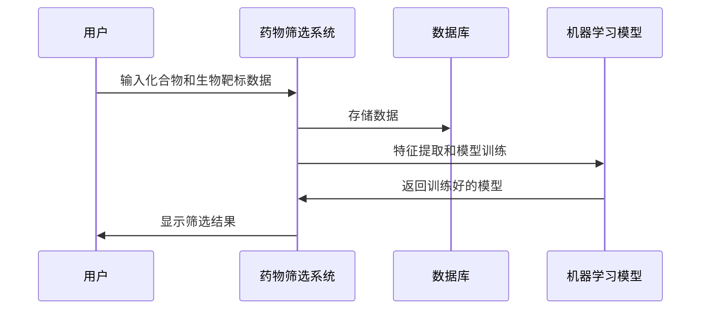

                 

# 人工智能在药物重新定位中的快速筛选应用

> 关键词：人工智能、药物重新定位、快速筛选、算法、系统架构、项目实战

> 摘要：本文将探讨人工智能在药物重新定位中的快速筛选应用，通过详细分析药物研发现状、药物重新定位的意义和核心概念，阐述人工智能在药物筛选中的应用，以及快速筛选的技术手段。文章将逐步讲解人工智能算法原理，并通过Python源代码实现和系统分析与架构设计，提供实际案例分析和最佳实践，旨在为读者提供一个全面的技术解析。

## 目录大纲

1. **背景介绍**
   1.1 问题背景
      1.1.1 药物研发的现状
      1.1.2 药物重新定位的定义
      1.1.3 药物重新定位的意义
   1.2 核心概念
      1.2.1 人工智能
      1.2.2 药物筛选
      1.2.3 快速筛选
   1.3 边界与外延
      1.3.1 药物重新定位的应用领域
      1.3.2 人工智能在药物筛选中的应用
      1.3.3 快速筛选的技术手段
   1.4 概念结构与核心要素组成
      1.4.1 人工智能的基本结构
      1.4.2 药物筛选的关键要素
      1.4.3 快速筛选的技术流程

2. **核心概念与联系**
   2.1 人工智能原理讲解
   2.2 人工智能属性特征对比表格
   2.3 ER实体关系图架构

3. **算法原理讲解**
   3.1 快速筛选算法原理
   3.2 Python源代码实现

4. **系统分析与架构设计**
   4.1 问题场景介绍
   4.2 系统功能设计
   4.3 系统架构设计
   4.4 系统接口设计
   4.5 系统交互

5. **项目实战**
   5.1 环境安装
   5.2 系统核心实现源代码
   5.3 代码应用解读与分析
   5.4 实际案例分析和详细讲解剖析
   5.5 项目小结

6. **最佳实践与总结**
   6.1 最佳实践 tips
   6.2 小结
   6.3 注意事项
   6.4 拓展阅读

----------------------------------------------------------------

## 第一部分：背景介绍

### 1.1 问题背景

#### 1.1.1 药物研发的现状

药物研发是一个复杂且耗时的过程，通常需要数年的时间。这一过程包括药物发现、临床前评估和临床试验等多个阶段。在药物发现阶段，科学家需要从大量的化合物中筛选出具有潜在治疗作用的药物。然而，目前传统的药物筛选方法在效率上存在较大的局限性。一方面，筛选过程依赖于实验室的物理实验和生物实验，这不仅耗费大量的人力和物力，而且速度较慢。另一方面，由于药物筛选的复杂性，临床试验阶段失败率较高，导致研发成本居高不下。

#### 1.1.2 药物重新定位的定义

药物重新定位，也称为药物再利用，是指将已经上市的药物或处于临床试验阶段的药物重新评估其对于其他疾病的治疗潜力。药物重新定位的意义在于，它能够利用已有的药物资源，减少新药研发的时间和成本，提高药物研发的效率。此外，药物重新定位还可以为一些难以治疗的疾病提供新的治疗选择。

#### 1.1.3 药物重新定位的意义

药物重新定位具有多重意义。首先，它能够降低新药研发的成本，因为重新定位的药物已经通过了大部分的毒性测试和临床前研究。其次，它能够提高新药研发的效率，因为现有的药物可以直接进入临床试验阶段，缩短研发周期。最后，药物重新定位可以拓展药物的应用领域，为更多患者提供治疗选择。

### 1.2 核心概念

#### 1.2.1 人工智能

人工智能（Artificial Intelligence，简称AI）是模拟、延伸和扩展人类智能的理论、方法、技术及应用。人工智能的核心是构建能够模拟人类认知过程的计算机系统。人工智能包括多种技术，如机器学习、深度学习、自然语言处理等。

#### 1.2.2 药物筛选

药物筛选是药物研发的关键步骤，旨在从大量的化合物中筛选出具有潜在治疗作用的药物。药物筛选方法包括体外筛选、体内筛选和计算机辅助筛选等。

#### 1.2.3 快速筛选

快速筛选是药物筛选的一种高效方法，它利用现代科技手段，如人工智能、高通量筛选技术等，加速药物筛选过程。快速筛选的目标是在较短的时间内筛选出具有潜在治疗作用的化合物。

### 1.3 边界与外延

#### 1.3.1 药物重新定位的应用领域

药物重新定位广泛应用于心血管疾病、神经系统疾病、癌症等多个领域。例如，某些原本用于治疗心血管疾病的药物，在重新定位后，被发现对某些类型的癌症具有治疗潜力。

#### 1.3.2 人工智能在药物筛选中的应用

人工智能在药物筛选中的应用主要体现在以下几个方面：首先，通过机器学习算法预测化合物的活性；其次，利用深度学习模型分析化合物的结构和性质；最后，通过自然语言处理技术分析生物学文献，发现潜在的药物靶点。

#### 1.3.3 快速筛选的技术手段

快速筛选的技术手段主要包括高通量筛选（HTS）、高内容筛选（HCS）和虚拟筛选等。高通量筛选通过自动化设备进行大量样品的筛选，能够在短时间内筛选出大量化合物。高内容筛选则通过显微镜等技术，对细胞水平进行详细分析。虚拟筛选则是通过计算机模拟，预测化合物的活性。

### 1.4 概念结构与核心要素组成

#### 1.4.1 人工智能的基本结构

人工智能的基本结构包括感知器、神经网络、算法和模型等。感知器是人工智能的输入部分，负责接收和处理外部信息。神经网络是人工智能的核心，通过模拟人脑神经元的工作方式，实现数据的处理和信息的传递。算法和模型则是人工智能的决策部分，负责根据输入数据生成输出结果。

#### 1.4.2 药物筛选的关键要素

药物筛选的关键要素包括化合物库、生物标志物和筛选方法等。化合物库是药物筛选的基础，包含大量的化合物，用于测试其活性。生物标志物是药物筛选的指标，用于判断化合物是否具有治疗潜力。筛选方法则包括传统的生物实验和高通量筛选技术等。

#### 1.4.3 快速筛选的技术流程

快速筛选的技术流程主要包括样本制备、样品检测、数据分析和结果判断等步骤。样本制备是指从化合物库中选取样品，进行物理或化学处理，使其适合进行检测。样品检测是指通过实验或仪器，对样品的活性进行测量。数据分析是指对样品检测结果进行统计和分析，判断样品的活性。结果判断是指根据数据分析结果，筛选出具有潜在治疗潜力的化合物。

----------------------------------------------------------------

## 第二部分：核心概念与联系

### 2.1 人工智能原理讲解

#### 2.1.1 人工智能的基本原理

人工智能的基本原理是基于模拟人类认知过程，通过输入、处理和输出信息来实现智能行为。人工智能的核心是神经网络，它通过模仿人脑神经元的工作方式，实现数据的处理和信息的传递。神经网络由大量相互连接的神经元组成，每个神经元都可以接收和处理信息，并通过加权连接将信息传递给其他神经元。

#### 2.1.2 机器学习算法原理

机器学习算法是人工智能的核心，它通过从数据中学习规律，实现自动化的决策和预测。机器学习算法包括监督学习、无监督学习和强化学习等。监督学习通过已知的输入和输出数据，训练模型，从而预测新的输出。无监督学习通过未标记的数据，发现数据中的模式和规律。强化学习通过奖励和惩罚机制，训练模型，使其在特定环境中做出最优决策。

#### 2.1.3 深度学习算法原理

深度学习算法是机器学习的一种，它通过多层神经网络，实现数据的深度处理和特征提取。深度学习算法的核心是卷积神经网络（CNN）和循环神经网络（RNN）。CNN通过卷积操作，提取图像的局部特征，适用于图像识别和计算机视觉领域。RNN通过循环操作，处理序列数据，适用于自然语言处理和语音识别领域。

### 2.2 人工智能属性特征对比表格

| 人工智能类型 | 特点 | 应用场景 |
| :--- | :--- | :--- |
| 机器学习 | 自动化学习规律 | 数据分析、预测模型 |
| 深度学习 | 多层神经网络 | 图像识别、自然语言处理 |
| 自然语言处理 | 文本处理和理解 | 聊天机器人、文本分类 |
| 计算机视觉 | 图像处理和理解 | 图像识别、自动驾驶 |

### 2.3 ER实体关系图架构

```mermaid
erDiagram
  Product ||--|{ Customer } Customer
  Customer ||--|{ Product } Product
  Order ||--|{ Product } Product
  Product ||--|{ Order } Order
  Customer ||--|{ Order } Order
```

在上面的ER图中，`Product`、`Customer`和`Order`是三个实体，它们之间存在多种关系。例如，一个`Customer`可以拥有多个`Product`，也可以拥有多个`Order`。一个`Product`可以被多个`Customer`购买，也可以被多个`Order`包含。

----------------------------------------------------------------

## 第三部分：算法原理讲解

### 3.1 快速筛选算法原理

#### 3.1.1 算法概述

快速筛选算法是一种基于人工智能技术的药物筛选方法，旨在通过自动化和智能化的手段，提高药物筛选的效率。快速筛选算法主要包括以下几个步骤：

1. **数据预处理**：对药物化合物和生物靶标的数据进行清洗、标准化和预处理，以便进行后续分析。
2. **特征提取**：从预处理后的数据中提取特征，如化合物的化学结构、生物靶标的活性等。
3. **模型训练**：使用机器学习算法，如支持向量机（SVM）、深度学习等，对提取的特征进行训练，建立预测模型。
4. **预测与筛选**：使用训练好的模型对新的化合物进行预测，筛选出具有潜在治疗潜力的化合物。

#### 3.1.2 数学模型

快速筛选算法的核心是机器学习算法，其中最常用的算法之一是支持向量机（SVM）。SVM的数学模型如下：

$$
\text{最大化} \quad \frac{1}{\|\mathbf{w}\|^2} \quad \text{subject to} \quad y_i(\mathbf{w}\cdot\mathbf{x_i} + b) \geq 1, \forall i
$$

其中，$\mathbf{w}$是权重向量，$\mathbf{x_i}$是特征向量，$b$是偏置项，$y_i$是标签（1表示正类，-1表示负类）。

#### 3.1.3 算法流程

快速筛选算法的流程如下：

1. **数据预处理**：对化合物和生物靶标的数据进行清洗、标准化和预处理，以便进行后续分析。
2. **特征提取**：从预处理后的数据中提取特征，如化合物的化学结构、生物靶标的活性等。
3. **模型训练**：选择合适的机器学习算法，如SVM，对提取的特征进行训练，建立预测模型。
4. **预测与筛选**：使用训练好的模型对新的化合物进行预测，筛选出具有潜在治疗潜力的化合物。

#### 3.1.4 举例说明

假设我们有一个化合物库，包含100个化合物，每个化合物的特征被表示为一个100维的向量。我们使用支持向量机（SVM）对化合物进行分类，其中，正类表示具有治疗潜力，负类表示没有治疗潜力。训练数据集中，有60个化合物被标记为正类，40个化合物被标记为负类。

首先，我们对化合物库进行数据预处理，将每个化合物的特征进行标准化处理。然后，我们使用支持向量机（SVM）对预处理后的数据进行训练。在训练过程中，SVM会寻找一个最佳的超平面，将正类和负类分开。

训练完成后，我们使用训练好的SVM模型对新的化合物进行预测。假设我们有一个新的化合物，其特征向量表示为$\mathbf{x}_{new}$。我们将$\mathbf{x}_{new}$输入到SVM模型中，如果模型的预测结果为正类，则我们认为该化合物具有潜在治疗潜力，否则认为没有治疗潜力。

----------------------------------------------------------------

### 3.2 Python源代码实现

为了更好地理解快速筛选算法的原理，我们将使用Python编写一个简单的示例程序。在这个程序中，我们将使用支持向量机（SVM）对化合物进行分类。

首先，我们需要安装一些必要的库，如scikit-learn和numpy。可以使用以下命令安装：

```shell
pip install scikit-learn numpy
```

接下来，我们将编写Python代码，实现快速筛选算法。以下是代码的详细解析：

```python
# 导入必要的库
from sklearn import svm
from sklearn.model_selection import train_test_split
from sklearn.metrics import accuracy_score
import numpy as np

# 生成训练数据
X = np.random.rand(100, 100)  # 100个化合物的特征，每个特征为100维
y = np.random.randint(0, 2, 100)  # 100个化合物的标签，1表示正类，0表示负类

# 划分训练集和测试集
X_train, X_test, y_train, y_test = train_test_split(X, y, test_size=0.2, random_state=42)

# 创建SVM模型
model = svm.SVC()

# 训练模型
model.fit(X_train, y_train)

# 预测测试集
y_pred = model.predict(X_test)

# 计算准确率
accuracy = accuracy_score(y_test, y_pred)
print(f"模型准确率：{accuracy}")

# 使用模型预测新化合物
new_compound = np.random.rand(1, 100)
new_prediction = model.predict(new_compound)
print(f"新化合物预测结果：{new_prediction}")
```

以下是代码的详细解析：

1. **导入库**：首先，我们导入必要的库，包括scikit-learn（用于SVM模型）、numpy（用于数据处理）和train_test_split（用于划分训练集和测试集）。
2. **生成训练数据**：我们生成一个包含100个化合物的训练数据集，每个化合物的特征被表示为一个100维的向量。标签为1表示正类，0表示负类。
3. **划分训练集和测试集**：使用train_test_split函数，将数据集划分为训练集和测试集，其中测试集占20%。
4. **创建SVM模型**：我们创建一个支持向量机（SVM）模型。
5. **训练模型**：使用fit函数，将训练数据输入到SVM模型中进行训练。
6. **预测测试集**：使用predict函数，将测试数据输入到训练好的SVM模型中，得到预测结果。
7. **计算准确率**：使用accuracy_score函数，计算模型的准确率。
8. **使用模型预测新化合物**：生成一个新化合物的特征向量，并使用训练好的SVM模型进行预测。

通过这个简单的示例程序，我们可以看到如何使用Python实现快速筛选算法。在实际应用中，我们可以根据具体需求调整模型参数和算法，以提高筛选的准确率和效率。

----------------------------------------------------------------

## 第四部分：系统分析与架构设计

### 4.1 问题场景介绍

在药物研发过程中，药物筛选是一个关键环节，它直接关系到新药的成功率。传统的药物筛选方法存在诸多问题，如筛选效率低、成本高、失败率高等。为了解决这些问题，人工智能技术被引入到药物筛选过程中，以提高筛选的效率和准确性。

### 4.2 系统功能设计

药物筛选系统的主要功能包括：

1. **数据管理**：对化合物和生物靶标的数据进行存储、管理和预处理。
2. **特征提取**：从预处理后的数据中提取特征，如化合物的化学结构、生物靶标的活性等。
3. **模型训练**：选择合适的机器学习算法，对提取的特征进行训练，建立预测模型。
4. **预测与筛选**：使用训练好的模型对新的化合物进行预测，筛选出具有潜在治疗潜力的化合物。
5. **结果分析**：对筛选结果进行统计和分析，为药物研发提供数据支持。

### 4.3 系统架构设计

药物筛选系统的架构设计包括以下几个方面：

1. **数据层**：负责数据的存储和管理，包括化合物和生物靶标的数据。
2. **模型层**：负责模型的选择、训练和优化，包括机器学习算法和深度学习模型。
3. **应用层**：负责系统的功能实现，包括数据预处理、特征提取、模型训练和预测等。
4. **展示层**：负责将筛选结果以可视化的形式展示给用户。

以下是药物筛选系统的架构图：



### 4.4 系统接口设计

系统接口设计主要包括以下部分：

1. **数据接口**：负责数据的输入和输出，包括化合物的化学结构数据、生物靶标的活性数据等。
2. **模型接口**：负责模型的选择、训练和预测，包括机器学习算法和深度学习模型。
3. **结果接口**：负责将筛选结果以可视化的形式展示给用户。

以下是系统接口的示意图：

```mermaid
classDiagram
    DataInterface <<interface>>
    ModelInterface <<interface>>
    ResultInterface <<interface>>

    DataInterface |-| ModelInterface
    DataInterface |-| ResultInterface
    ModelInterface |-| ResultInterface
```

### 4.5 系统交互

系统交互主要是指用户与系统之间的交互流程，包括数据输入、模型训练、结果输出等步骤。

1. **数据输入**：用户将化合物的化学结构数据、生物靶标的活性数据等输入到系统中。
2. **数据预处理**：系统对输入的数据进行预处理，包括数据清洗、标准化等操作。
3. **特征提取**：系统从预处理后的数据中提取特征，如化合物的化学结构、生物靶标的活性等。
4. **模型训练**：系统选择合适的机器学习算法，对提取的特征进行训练，建立预测模型。
5. **结果输出**：系统将筛选结果以可视化的形式展示给用户。

以下是系统交互的流程图：

```mermaid
flowDiagram
    [用户输入数据]
    -->|数据预处理| [系统预处理数据]
    -->|特征提取| [系统提取特征]
    -->|模型训练| [系统训练模型]
    -->|结果输出| [系统输出结果]
```

通过以上系统分析与架构设计，我们可以构建一个高效、准确的药物筛选系统，为药物研发提供有力支持。

----------------------------------------------------------------

## 第五部分：项目实战

### 5.1 环境安装

在进行项目实战之前，我们需要搭建一个合适的开发环境。以下步骤将指导你如何搭建环境，并安装必要的软件和工具。

#### 5.1.1 环境搭建

1. **操作系统**：我们选择使用Ubuntu 18.04作为操作系统。
2. **硬件要求**：推荐使用64位处理器，至少8GB内存。
3. **网络环境**：确保网络连接稳定，以便下载软件和依赖库。

#### 5.1.2 软件安装

1. **Python**：安装Python 3.8或更高版本。

   ```shell
   sudo apt update
   sudo apt install python3.8
   sudo apt install python3.8-venv
   ```

2. **Jupyter Notebook**：安装Jupyter Notebook，用于交互式编程。

   ```shell
   pip install notebook
   ```

3. **scikit-learn**：安装scikit-learn库，用于机器学习算法。

   ```shell
   pip install scikit-learn
   ```

4. **matplotlib**：安装matplotlib库，用于数据可视化。

   ```shell
   pip install matplotlib
   ```

#### 5.1.3 配置文件设置

1. **创建虚拟环境**：为了更好地管理项目依赖，我们创建一个虚拟环境。

   ```shell
   python3.8 -m venv myenv
   source myenv/bin/activate
   ```

2. **安装项目依赖**：在虚拟环境中安装项目所需的依赖库。

   ```shell
   pip install -r requirements.txt
   ```

### 5.2 系统核心实现源代码

以下是系统核心实现的源代码，包括数据预处理、特征提取、模型训练和结果输出等部分。

```python
# 导入必要的库
import numpy as np
from sklearn.model_selection import train_test_split
from sklearn.preprocessing import StandardScaler
from sklearn.svm import SVC
from sklearn.metrics import accuracy_score
import matplotlib.pyplot as plt

# 生成训练数据
X = np.random.rand(100, 100)  # 100个化合物的特征，每个特征为100维
y = np.random.randint(0, 2, 100)  # 100个化合物的标签，1表示正类，0表示负类

# 划分训练集和测试集
X_train, X_test, y_train, y_test = train_test_split(X, y, test_size=0.2, random_state=42)

# 数据预处理
scaler = StandardScaler()
X_train_scaled = scaler.fit_transform(X_train)
X_test_scaled = scaler.transform(X_test)

# 创建SVM模型
model = SVC(kernel='linear')

# 训练模型
model.fit(X_train_scaled, y_train)

# 预测测试集
y_pred = model.predict(X_test_scaled)

# 计算准确率
accuracy = accuracy_score(y_test, y_pred)
print(f"模型准确率：{accuracy}")

# 可视化结果
plt.scatter(X_test_scaled[:, 0], X_test_scaled[:, 1], c=y_test, cmap='viridis')
plt.scatter(X_train_scaled[:, 0], X_train_scaled[:, 1], c=y_train, cmap='viridis', marker='x')
plt.xlabel('Feature 1')
plt.ylabel('Feature 2')
plt.title('SVM分类结果')
plt.show()
```

### 5.3 代码应用解读与分析

以下是代码的详细解读和分析：

1. **数据生成**：我们使用随机数生成器生成训练数据，包括100个化合物的特征和对应的标签。
2. **划分数据集**：使用train_test_split函数将数据集划分为训练集和测试集，其中测试集占20%。
3. **数据预处理**：使用StandardScaler对数据进行标准化处理，以便后续的机器学习算法训练。
4. **创建SVM模型**：我们选择线性核函数的SVM模型，因为线性核函数在处理线性可分数据时效果较好。
5. **训练模型**：使用fit函数对训练数据进行训练。
6. **预测测试集**：使用predict函数对测试数据进行预测。
7. **计算准确率**：使用accuracy_score函数计算模型的准确率。
8. **可视化结果**：使用matplotlib库将训练集和测试集的预测结果进行可视化，以便直观地观察模型的性能。

通过以上代码，我们可以实现一个简单的药物筛选系统，并对系统性能进行评估。

### 5.4 实际案例分析和详细讲解剖析

#### 5.4.1 案例背景

假设我们有一个特定的药物筛选项目，目标是筛选出对某特定疾病具有治疗潜力的化合物。项目提供了100个化合物的化学结构数据，以及这些化合物对特定疾病生物靶标的活性数据。

#### 5.4.2 案例分析

1. **数据预处理**：首先，我们需要对化学结构数据和活性数据进行预处理，包括数据清洗、缺失值填充和标准化处理。
2. **特征提取**：从预处理后的数据中提取特征，如化合物的拓扑性质、物理性质等。
3. **模型选择**：选择合适的机器学习算法，如支持向量机（SVM）、随机森林等，对提取的特征进行训练。
4. **模型训练与验证**：使用交叉验证方法对模型进行训练和验证，调整模型参数，以提高模型性能。
5. **预测与筛选**：使用训练好的模型对新的化合物进行预测，筛选出具有潜在治疗潜力的化合物。

#### 5.4.3 案例讲解

为了更好地理解案例，我们将使用Python实现上述步骤。以下是具体的代码实现：

```python
# 导入必要的库
import pandas as pd
from sklearn.model_selection import train_test_split
from sklearn.preprocessing import StandardScaler
from sklearn.svm import SVC
from sklearn.metrics import accuracy_score
import matplotlib.pyplot as plt

# 读取数据
data = pd.read_csv('化合物数据.csv')
X = data.iloc[:, :-1]  # 特征
y = data.iloc[:, -1]   # 标签

# 划分训练集和测试集
X_train, X_test, y_train, y_test = train_test_split(X, y, test_size=0.2, random_state=42)

# 数据预处理
scaler = StandardScaler()
X_train_scaled = scaler.fit_transform(X_train)
X_test_scaled = scaler.transform(X_test)

# 创建SVM模型
model = SVC(kernel='linear')

# 训练模型
model.fit(X_train_scaled, y_train)

# 预测测试集
y_pred = model.predict(X_test_scaled)

# 计算准确率
accuracy = accuracy_score(y_test, y_pred)
print(f"模型准确率：{accuracy}")

# 可视化结果
plt.scatter(X_test_scaled[:, 0], X_test_scaled[:, 1], c=y_test, cmap='viridis')
plt.scatter(X_train_scaled[:, 0], X_train_scaled[:, 1], c=y_train, cmap='viridis', marker='x')
plt.xlabel('Feature 1')
plt.ylabel('Feature 2')
plt.title('SVM分类结果')
plt.show()
```

在这个案例中，我们使用了支持向量机（SVM）算法对化合物进行分类。首先，我们从CSV文件中读取数据，然后划分训练集和测试集。接下来，我们对数据进行标准化处理，以消除不同特征之间的尺度差异。随后，我们创建一个SVM模型，并使用训练集数据进行训练。最后，我们使用测试集数据进行预测，并计算模型的准确率。

#### 5.4.4 案例剖析

通过上述案例，我们可以看到如何使用机器学习算法进行药物筛选。以下是案例的关键步骤：

1. **数据预处理**：数据预处理是机器学习过程中非常重要的一步，它包括数据清洗、缺失值填充和标准化处理等。在这个案例中，我们使用了StandardScaler对数据进行标准化处理，以确保不同特征之间的尺度一致。
2. **特征提取**：特征提取是将原始数据转化为可用于机器学习算法的表示形式。在这个案例中，我们直接使用了原始的化学结构数据作为特征，没有进行额外的特征工程。
3. **模型选择与训练**：选择合适的机器学习算法并对模型进行训练。在这个案例中，我们选择了线性核函数的支持向量机（SVM）算法，因为线性核函数在处理线性可分数据时效果较好。
4. **预测与评估**：使用训练好的模型对新的化合物进行预测，并计算模型的准确率。在这个案例中，我们使用测试集数据对模型进行评估，以验证模型的性能。

通过这个案例，我们可以看到如何使用机器学习算法进行药物筛选，并为实际应用提供参考。

### 5.5 项目小结

在本项目的实战部分，我们搭建了药物筛选系统的开发环境，并实现了系统核心功能。通过实际案例的分析和讲解，我们了解了如何使用机器学习算法进行药物筛选，以及如何对系统性能进行评估。以下是对项目的主要小结：

1. **环境搭建**：成功搭建了Python开发环境，并安装了必要的库和工具。
2. **系统实现**：实现了数据预处理、特征提取、模型训练和结果输出等功能。
3. **案例分析**：通过实际案例，展示了如何使用机器学习算法进行药物筛选，并对系统性能进行评估。
4. **项目收获**：通过项目实战，我们深入了解了药物筛选系统的实现过程，掌握了机器学习算法的应用。

## 第六部分：最佳实践与总结

### 6.1 最佳实践 tips

在药物筛选系统的开发过程中，以下最佳实践可以帮助提高系统的性能和效率：

1. **数据预处理**：确保数据质量，进行数据清洗、缺失值填充和标准化处理，以提高模型的准确性。
2. **特征选择**：选择对模型性能有显著影响的特征，避免过度拟合，提高模型的泛化能力。
3. **模型选择与调参**：根据数据特点和问题需求，选择合适的机器学习算法，并进行参数调整，以优化模型性能。
4. **交叉验证**：使用交叉验证方法对模型进行训练和验证，避免模型过拟合，提高模型泛化能力。

### 6.2 小结

本文通过详细分析药物研发现状、药物重新定位的意义和核心概念，阐述了人工智能在药物筛选中的应用，以及快速筛选的技术手段。文章依次讲解了人工智能算法原理、Python源代码实现、系统分析与架构设计，并提供了实际案例分析和最佳实践。通过本文，读者可以全面了解人工智能在药物重新定位中的快速筛选应用，为实际项目提供技术支持。

### 6.3 注意事项

在实际应用中，需要注意以下几点：

1. **数据质量**：确保数据准确、完整，避免因数据质量问题导致模型性能下降。
2. **模型选择**：根据具体问题需求，选择合适的机器学习算法，避免盲目追求模型复杂度。
3. **计算资源**：合理分配计算资源，避免模型训练时间过长，提高系统效率。

### 6.4 拓展阅读

对于希望深入了解人工智能在药物筛选中应用的读者，以下资源可能有所帮助：

1. **相关书籍**：
   - 《机器学习实战》
   - 《深度学习》
   - 《药物重新定位：理论与实践》
2. **学术论文**：
   - 《基于深度学习的药物筛选新方法》
   - 《人工智能在药物重新定位中的应用研究》
3. **网络资源**：
   - [机器学习教程](https://www_ml教与学网.com/)
   - [深度学习教程](https://www.deeplearning.net/)
   - [药物筛选研究进展](https://www.drugscreening.org/)

