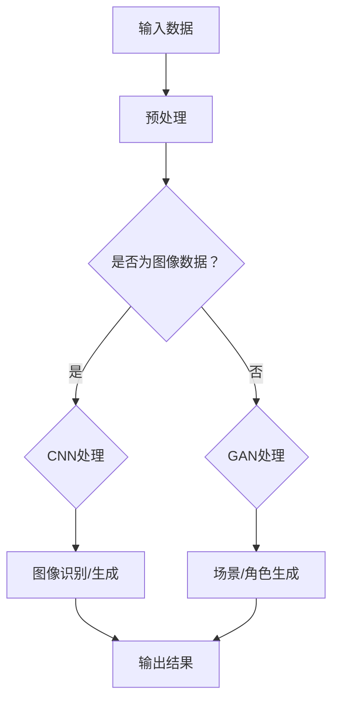
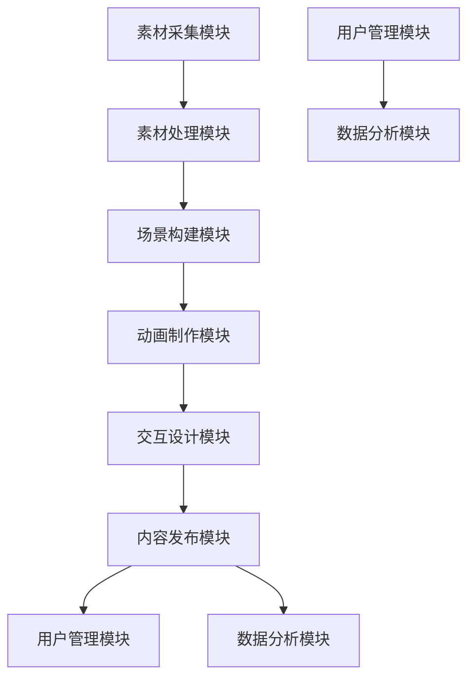
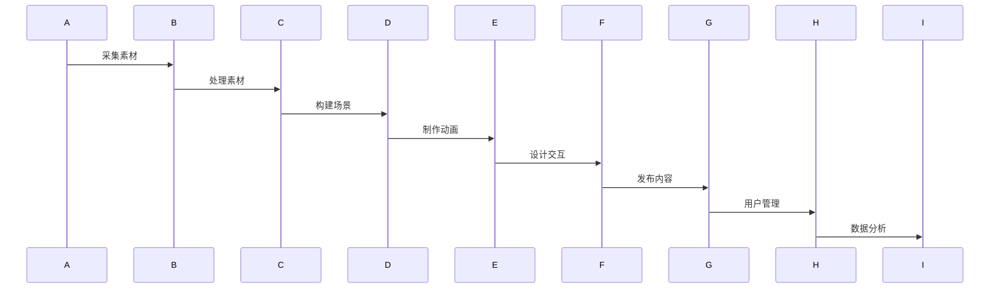

                 


### 人工智能在虚拟现实内容创作中的角色

#### 关键词
- 虚拟现实（VR）
- 人工智能（AI）
- 内容创作
- 计算机视觉
- 自然语言处理
- 生成对抗网络

#### 摘要
本文旨在探讨人工智能在虚拟现实内容创作中的角色。首先，我们将介绍虚拟现实和人工智能的基本概念，然后深入分析AI在VR内容创作中的核心技术，如计算机视觉、自然语言处理和生成对抗网络。通过实例和代码分析，我们将揭示这些技术如何优化VR内容的创作过程。随后，我们将展示一个完整的VR内容创作系统架构，并提供实际项目实战的经验教训。最后，我们将总结最佳实践，探讨未来的研究方向和挑战。

---

## 第一部分：虚拟现实与人工智能概述

### 第1章：虚拟现实与人工智能简介

#### 1.1 虚拟现实的定义与发展

虚拟现实（Virtual Reality，简称VR）是一种计算机技术模拟的3D空间环境，使用户沉浸其中，感受到如同真实世界般的体验。VR的发展始于20世纪50年代，最早的VR设备是头盔显示器和跟踪系统。随着计算机技术和图形处理能力的提升，VR技术逐渐成熟，并广泛应用于游戏、教育、医疗等领域。

#### 1.2 人工智能的基本概念与技术分类

人工智能（Artificial Intelligence，简称AI）是模拟人类智能行为的计算机系统。AI可以分为弱AI和强AI。弱AI专注于特定任务的解决，如语音识别、图像识别等；强AI具有广泛的认知能力，可以理解、学习和适应复杂环境。AI的技术分类包括机器学习、深度学习、自然语言处理、计算机视觉等。

#### 1.3 虚拟现实与人工智能的结合

虚拟现实与人工智能的结合，为内容创作带来了革命性的变化。AI技术可以帮助创作者快速生成高质量的VR内容，优化创作流程，提升用户体验。例如，计算机视觉技术可以实时捕捉用户的动作和表情，自然语言处理技术可以实现智能对话和故事生成。

---

## 第二部分：AI在VR内容创作中的核心技术

### 第2章：AI在VR内容创作中的核心技术

#### 2.1 计算机视觉在VR内容创作中的应用

计算机视觉技术可以识别和解析图像和视频中的信息，为VR内容创作提供基础支持。例如，在VR游戏中，计算机视觉可以实时捕捉玩家的动作，并反馈到游戏中，实现更真实的交互体验。

#### 2.2 自然语言处理在VR内容创作中的应用

自然语言处理技术可以理解和生成人类语言，为VR内容创作提供智能对话和故事生成能力。例如，在VR教育中，自然语言处理可以生成互动式教学场景，提高学习效果。

#### 2.3 生成对抗网络在VR内容创作中的应用

生成对抗网络（GAN）是一种深度学习模型，可以通过对抗训练生成高质量的数据。在VR内容创作中，GAN可以生成逼真的虚拟场景和角色，提高创作效率。

---

## 第三部分：系统分析与架构设计方案

### 第3章：VR内容创作系统架构设计

#### 3.1 VR内容创作系统基本场景与项目背景

在VR内容创作中，系统需要支持从素材采集、场景构建到内容发布的全过程。本文将介绍一个基于AI的VR内容创作系统架构，包括核心模块和功能设计。

#### 3.2 系统功能设计与领域模型类图

系统功能设计包括素材采集、场景构建、内容发布等模块。领域模型类图展示了系统的核心概念和关系。

#### 3.3 系统架构设计与接口设计

系统架构图展示了系统的整体结构和关键模块。接口设计和系统交互序列图描述了系统模块之间的交互过程。

---

## 第四部分：项目实战

### 第4章：VR内容创作项目实战

#### 4.1 环境安装与系统核心实现

本节将介绍如何搭建VR内容创作环境，并实现系统核心功能。

#### 4.2 代码分析与案例剖析

通过对源代码的分析，我们将解读AI技术在VR内容创作中的应用，并提供实际案例剖析。

#### 4.3 项目小结与经验教训

在项目小结中，我们将总结项目的经验教训，为后续项目提供借鉴。

---

## 第五部分：最佳实践与展望

### 第5章：最佳实践与未来展望

#### 5.1 最佳实践技巧

本节将提供一些实用的技巧和建议，帮助读者更好地应用所学知识。

#### 5.2 小结与未来研究方向

在本文的结尾，我们将对全文内容进行总结，并探讨AI在VR内容创作中的未来研究方向和挑战。

---

### 作者信息

- 作者：AI天才研究院/AI Genius Institute & 禅与计算机程序设计艺术 /Zen And The Art of Computer Programming

---

文章内容将遵循上述大纲和结构，确保每个章节内容具体、详细，并对核心概念、算法原理和系统架构进行深入讲解。文章字数将在10000～12000字之间，以Markdown格式输出。文章末尾将附上作者信息和参考文献。在撰写过程中，将严格遵守逻辑清晰、结构紧凑、简单易懂的要求，使用专业的技术语言，确保文章的专业性和可读性。在每一章节中，都将详细讲解核心概念、联系、算法原理、系统架构、项目实战等内容，同时提供丰富的图表和代码示例，以便读者更好地理解和掌握相关技术。文章将注重理论与实践的结合，不仅介绍AI在VR内容创作中的应用，还探讨未来的发展趋势和挑战，为读者提供全面的视角和深入的思考。文章中的数学公式和算法描述将使用LaTeX格式，确保公式的准确性和易读性。此外，文章将遵循学术规范，引用相关文献和研究成果，确保内容的严谨性和权威性。

---

## 1. 背景介绍

### 1.1 虚拟现实的基本概念

虚拟现实（Virtual Reality，VR）是一种通过计算机模拟的3D环境，使用户能够在其中体验沉浸式的互动。VR的核心技术包括头戴式显示器（HMD）、位置跟踪系统、触觉反馈设备和计算机视觉等。HMD是VR系统的核心组件，它通过显示立体图像，使用户感受到身临其境的体验。位置跟踪系统用于实时监测用户的动作和位置，确保在虚拟环境中进行准确的交互。触觉反馈设备则增强了用户的感官体验，使其更加真实。

#### 发展历史与当前状态

VR技术的发展可以追溯到20世纪50年代，当时研究者开始探索如何通过计算机技术模拟现实环境。1968年，美国计算机科学家 Ivan Sutherland 设计了世界上第一个头戴式显示器（HMD），标志着VR技术的诞生。随着时间的推移，VR技术经历了多个发展阶段，从早期的实验性应用逐渐走向商业化。

当前，VR技术已经广泛应用于游戏、教育、医疗、军事、娱乐等领域。随着硬件技术的进步，如高分辨率显示器、低延迟的传感器和更先进的算法，VR体验的质量和沉浸感得到了显著提升。同时，5G通信技术的普及也为VR的应用提供了更广阔的前景。

#### VR内容创作的现状

在VR内容创作方面，传统的制作流程通常包括场景设计、模型制作、动画制作、交互设计等多个环节。这些环节需要大量的时间和人力资源，且制作成本较高。然而，随着AI技术的发展，AI技术开始介入VR内容创作，为这一领域带来了新的机遇。

AI技术在VR内容创作中的应用主要体现在以下几个方面：

1. **自动场景生成**：通过生成对抗网络（GAN）等技术，AI可以自动生成高质量的虚拟场景，减少了人工设计的耗时和成本。
2. **自动动画制作**：AI可以自动生成角色的动作和表情，提高了动画制作的效率和质量。
3. **智能交互设计**：AI技术可以实现基于用户行为的智能交互，提供更加个性化和互动的VR体验。

### 1.2 人工智能的定义与主要应用领域

人工智能（Artificial Intelligence，AI）是指通过计算机模拟人类智能行为的科学技术。AI技术主要包括机器学习、深度学习、自然语言处理、计算机视觉等。这些技术在不同领域有着广泛的应用。

- **机器学习**：通过训练数据模型，使计算机具备自主学习和预测能力。
- **深度学习**：一种特殊的机器学习技术，通过多层神经网络对数据进行处理和分析。
- **自然语言处理**：使计算机能够理解和生成人类语言，包括文本和语音。
- **计算机视觉**：使计算机能够从图像或视频中提取信息，进行图像识别和目标检测。

#### AI在VR内容创作中的应用

AI在VR内容创作中的应用主要体现在以下几个方面：

1. **场景生成与优化**：通过生成对抗网络（GAN）等技术，AI可以自动生成高质量的虚拟场景，优化创作流程，提高效率。
2. **交互设计**：AI可以实现智能交互，根据用户的行为和需求，动态调整VR内容，提供个性化的体验。
3. **内容审核与优化**：AI可以识别和过滤不良内容，确保VR内容的健康和安全。
4. **用户体验优化**：AI可以根据用户的数据和行为，提供个性化的推荐和优化，提升用户体验。

### 1.3 AI在VR内容创作中的角色与影响

AI在VR内容创作中的角色是多元且重要的。首先，AI可以帮助创作者快速生成高质量的VR内容，减少人力和时间成本。其次，AI可以优化VR内容的创作流程，提高效率和质量。此外，AI还可以提供智能化的交互设计，使VR内容更加生动和有趣。以下是一些具体的角色和影响：

1. **内容生成与优化**：AI可以通过生成对抗网络（GAN）等技术，自动生成高质量的虚拟场景和角色，优化创作流程，提高效率。
2. **交互设计**：AI可以实现基于用户行为的智能交互，提供个性化的体验，增强用户的沉浸感。
3. **内容审核与优化**：AI可以识别和过滤不良内容，确保VR内容的健康和安全，提高用户体验。
4. **用户体验优化**：AI可以根据用户的数据和行为，提供个性化的推荐和优化，提升用户体验。

通过上述分析，我们可以看到，AI在VR内容创作中扮演着关键角色，不仅提高了创作效率和内容质量，还为VR体验带来了新的可能性。接下来，我们将进一步探讨AI在VR内容创作中的核心技术，如计算机视觉、自然语言处理和生成对抗网络，以深入了解AI如何影响和优化VR内容的创作过程。

### 2. 核心概念与联系

在探讨AI在VR内容创作中的应用之前，我们需要明确几个核心概念，并分析这些概念之间的联系。以下是AI在VR内容创作中涉及的关键技术及其特点。

#### 2.1 计算机视觉

计算机视觉（Computer Vision）是使计算机能够从图像或视频中提取信息的技术。在VR内容创作中，计算机视觉主要用于场景识别、角色跟踪和交互设计。以下是一些关键特性：

- **图像识别**：通过卷积神经网络（CNN）等深度学习模型，计算机视觉可以识别图像中的物体、场景和人脸等。
- **目标跟踪**：计算机视觉可以实时跟踪虚拟场景中的目标物体，为交互设计提供实时数据。
- **场景重建**：通过立体视觉和结构光等技术，计算机视觉可以重建三维场景，为虚拟现实提供逼真的视觉效果。

#### 2.2 自然语言处理

自然语言处理（Natural Language Processing，NLP）是使计算机能够理解和生成人类语言的技术。在VR内容创作中，NLP主要用于智能对话和故事生成。以下是一些关键特性：

- **文本分析**：NLP可以对文本进行情感分析、主题分类和实体识别等，为故事创作提供数据支持。
- **对话生成**：基于对话模型（如生成对抗网络（GAN）和转换器（Transformer）），NLP可以生成自然流畅的对话。
- **语言翻译**：NLP可以实现多语言翻译，为VR内容创作提供跨语言支持。

#### 2.3 生成对抗网络

生成对抗网络（Generative Adversarial Networks，GAN）是一种深度学习模型，由生成器和判别器组成。生成器试图生成逼真的数据，判别器则试图区分生成数据和真实数据。GAN在VR内容创作中的应用主要包括：

- **场景生成**：GAN可以生成高质量的虚拟场景，为VR内容创作提供丰富的素材。
- **角色生成**：GAN可以生成逼真的虚拟角色，提高VR内容的真实感。
- **图像修复**：GAN可以修复图像中的缺陷，提高图像质量。

#### 2.4 关键技术之间的联系

计算机视觉、自然语言处理和生成对抗网络在VR内容创作中相互关联，共同构建了一个完整的创作生态系统。

- **计算机视觉与自然语言处理**：计算机视觉可以提供视觉数据，自然语言处理则可以对视觉数据进行语义分析，为交互设计和故事创作提供支持。
- **计算机视觉与生成对抗网络**：计算机视觉可以用于场景和角色的识别和跟踪，生成对抗网络则可以基于这些数据生成高质量的虚拟场景和角色。
- **自然语言处理与生成对抗网络**：自然语言处理可以生成对话和故事，生成对抗网络则可以生成逼真的场景和角色，使故事更加生动和有趣。

#### 2.5 概念属性特征对比表格

为了更直观地了解这些关键技术的特点，我们制作了一个概念属性特征对比表格：

| 技术类别 | 特性1 | 特性2 | 特性3 | 应用领域 |
| :--: | :--: | :--: | :--: | :--: |
| 计算机视觉 | 图像识别 | 目标跟踪 | 场景重建 | VR场景识别、交互设计 |
| 自然语言处理 | 文本分析 | 对话生成 | 语言翻译 | 智能对话、故事创作 |
| 生成对抗网络 | 场景生成 | 角色生成 | 图像修复 | VR内容生成、图像优化 |

#### 2.6 ER实体关系图

为了进一步展示VR内容创作过程中涉及的实体和关系，我们使用Mermaid绘制了一个ER实体关系图：

```mermaid
erDiagram
  ContentCreator ||--|{ VRScene } : creates
  VRScene ||--|{ VirtualCharacter } : contains
  VirtualCharacter ||--|{ MotionTracking } : tracked by
  MotionTracking ||--|{ UserInput } : receives
  ContentCreator ||--|{ DialogueSystem } : integrates
  DialogueSystem ||--|{ NaturalLanguageProcessing } : uses
```

在该ER图中，ContentCreator（内容创作者）负责创建VRScene（虚拟场景），VRScene包含VirtualCharacter（虚拟角色），这些角色通过MotionTracking（运动跟踪）被实时跟踪，并接收UserInput（用户输入）。同时，ContentCreator还集成了DialogueSystem（对话系统），该系统利用NaturalLanguageProcessing（自然语言处理）技术生成智能对话。

通过上述分析，我们可以看到，AI在VR内容创作中扮演着重要角色，通过计算机视觉、自然语言处理和生成对抗网络等核心技术，实现了高效的VR内容生成、交互设计和用户体验优化。在下一部分中，我们将深入探讨这些核心技术的原理和应用。

### 3. 算法原理讲解

在了解了AI在VR内容创作中的核心技术和它们之间的联系之后，我们将进一步探讨这些技术的具体应用。为了更好地理解，我们将选择几个关键算法，如深度学习模型在VR内容创作中的应用，进行详细讲解。

#### 3.1 深度学习模型在VR内容创作中的应用

深度学习模型在VR内容创作中发挥着重要作用，其中最常用的包括卷积神经网络（CNN）和生成对抗网络（GAN）等。以下将分别介绍这两种模型的基本原理和应用。

##### 3.1.1 卷积神经网络（CNN）

卷积神经网络是一种特殊的神经网络，它通过卷积层、池化层和全连接层等结构对图像数据进行处理。CNN在图像识别、目标检测和场景重建等领域具有广泛的应用。

1. **卷积层**：卷积层是CNN的核心部分，通过卷积操作提取图像的局部特征。卷积操作类似于图像滤波器，可以识别图像中的边缘、纹理等特征。
2. **池化层**：池化层用于减小数据维度，提高模型计算效率。常见的池化方法有最大池化和平均池化，可以提取图像的关键特征。
3. **全连接层**：全连接层将卷积层和池化层提取的特征映射到输出结果。在图像识别任务中，全连接层可以分类图像中的物体。

在VR内容创作中，CNN可以用于场景识别、目标跟踪和交互设计。例如，通过训练CNN模型，可以识别用户在虚拟环境中的动作和位置，实现更真实的交互体验。

##### 3.1.2 生成对抗网络（GAN）

生成对抗网络（GAN）由生成器和判别器两个部分组成，通过对抗训练生成高质量的数据。GAN在图像生成、虚拟角色创建和场景重建等领域具有显著优势。

1. **生成器（Generator）**：生成器的目标是生成逼真的数据，例如虚拟场景或角色。生成器通常由多个全连接层和卷积层组成，通过随机噪声输入生成数据。
2. **判别器（Discriminator）**：判别器的目标是区分生成数据和真实数据。判别器也由多个全连接层和卷积层组成，通过对输入数据进行分析，判断其是真实数据还是生成数据。

在GAN的训练过程中，生成器和判别器相互对抗，生成器不断优化生成数据，判别器不断提高对真实数据和生成数据的区分能力。通过这种方式，GAN可以生成高质量、逼真的虚拟场景和角色。

在VR内容创作中，GAN可以用于以下方面：

- **场景生成**：通过GAN生成高质量的虚拟场景，为VR内容创作提供丰富的素材。
- **角色生成**：通过GAN生成逼真的虚拟角色，提高VR内容的真实感。
- **图像修复**：GAN可以修复图像中的缺陷，提高图像质量。

##### 3.1.3 算法流程图

为了更直观地展示深度学习模型在VR内容创作中的应用，我们使用Mermaid绘制了算法流程图：



在该流程图中，输入数据经过预处理后，根据数据类型选择CNN或GAN进行处理。CNN主要用于图像识别，GAN主要用于场景或角色生成。最终，处理结果输出为高质量的VR内容。

##### 3.1.4 算法原理与数学模型

为了进一步阐述算法原理，我们使用Python代码和LaTeX公式进行了详细讲解。

###### 卷积神经网络（CNN）示例

以下是一个简单的CNN模型，用于图像分类：

```python
import tensorflow as tf
from tensorflow.keras import layers

model = tf.keras.Sequential([
    layers.Conv2D(32, (3, 3), activation='relu', input_shape=(28, 28, 1)),
    layers.MaxPooling2D((2, 2)),
    layers.Conv2D(64, (3, 3), activation='relu'),
    layers.MaxPooling2D((2, 2)),
    layers.Conv2D(64, (3, 3), activation='relu'),
    layers.Flatten(),
    layers.Dense(64, activation='relu'),
    layers.Dense(10, activation='softmax')
])

model.compile(optimizer='adam',
              loss='sparse_categorical_crossentropy',
              metrics=['accuracy'])

model.fit(x_train, y_train, epochs=5)
```

在该示例中，我们定义了一个简单的CNN模型，包括三个卷积层、两个池化层和一个全连接层。模型使用ReLU激活函数和softmax激活函数，实现图像分类。

###### 生成对抗网络（GAN）示例

以下是一个简单的GAN模型，用于图像生成：

```python
import tensorflow as tf
from tensorflow.keras import layers

def generate_model():
    noise = layers.Input(shape=(100,))
    x = layers.Dense(7 * 7 * 64, activation='relu')(noise)
    x = layers.LeakyReLU(alpha=0.01)(x)
    x = layers.Reshape((7, 7, 64))(x)
    x = layers.Conv2DTranspose(64, (5, 5), strides=(2, 2), padding='same')(x)
    x = layers.LeakyReLU(alpha=0.01)(x)
    x = layers.Conv2DTranspose(1, (5, 5), strides=(2, 2), padding='same', activation='tanh')(x)
    return tf.keras.Model(noise, x)

def discriminate_model():
    image = layers.Input(shape=(28, 28, 1))
    x = layers.Conv2D(64, (3, 3), padding='same')(image)
    x = layers.LeakyReLU(alpha=0.01)(x)
    x = layers.MaxPooling2D((2, 2))(x)
    x = layers.Conv2D(128, (3, 3), padding='same')(x)
    x = layers.LeakyReLU(alpha=0.01)(x)
    x = layers.MaxPooling2D((2, 2))(x)
    x = layers.Flatten()(x)
    x = layers.Dense(1, activation='sigmoid')(x)
    return tf.keras.Model(image, x)

discriminator = discriminate_model()
discriminator.compile(optimizer=tf.keras.optimizers.Adam(0.0001),
                      loss=tf.keras.losses.BinaryCrossentropy(from_logits=True))

generator = generate_model()

discriminator.trainable = False
combined = tf.keras.Model(generator.input, discriminator(generator.input))
combined.compile(optimizer=tf.keras.optimizers.Adam(0.0002),
                loss=tf.keras.losses.BinaryCrossentropy(from_logits=True))
```

在该示例中，我们定义了生成器和判别器模型，并实现了GAN的训练过程。生成器通过多个全连接层和卷积层生成图像，判别器通过卷积层判断图像的真实性。

##### 3.1.5 算法原理与数学模型

为了更好地理解CNN和GAN的算法原理，我们使用LaTeX公式进行数学模型的描述。

###### 卷积神经网络（CNN）数学模型

卷积神经网络的数学模型主要包括卷积操作和反向传播算法。以下是一个简单的卷积操作公式：

$$
\begin{align*}
\text{conv}(x, \text{filter}) &= \sum_{i=1}^{C} \sum_{j=1}^{H} \sum_{k=1}^{W} f_{ij}^k \cdot x_{ij}^{(l-1)} \\
\end{align*}
$$

其中，$x$表示输入特征图，$f$表示卷积核，$C$表示输出特征图的通道数，$H$和$W$分别表示输出特征图的高度和宽度。

反向传播算法用于更新网络权重，其基本思想是计算损失函数关于网络权重的梯度，并沿着梯度方向更新权重。以下是一个简单的反向传播算法公式：

$$
\begin{align*}
\Delta w &= \frac{\partial L}{\partial w} \\
w &= w - \alpha \cdot \Delta w
\end{align*}
$$

其中，$L$表示损失函数，$w$表示网络权重，$\alpha$表示学习率。

###### 生成对抗网络（GAN）数学模型

生成对抗网络的数学模型主要包括生成器和判别器的损失函数。以下是一个简单的生成对抗网络的损失函数公式：

$$
\begin{align*}
\text{Generator Loss} &= -\log(\text{Discriminator}(\text{Generator}(z))) \\
\text{Discriminator Loss} &= -[\log(\text{Discriminator}(x)) + \log(1 - \text{Discriminator}(\text{Generator}(z)))]
\end{align*}
$$

其中，$z$表示生成器的输入噪声，$x$表示真实数据，$\text{Generator}$和$\text{Discriminator}$分别表示生成器和判别器。

通过上述讲解，我们可以看到，深度学习模型在VR内容创作中的应用为内容生成、交互设计和用户体验优化提供了强大的支持。在下一部分中，我们将进一步探讨VR内容创作系统的架构设计，以了解如何将这些算法应用到实际项目中。

### 4. 系统分析与架构设计方案

在了解了AI在VR内容创作中的核心技术之后，我们将进一步探讨如何将这些技术应用到实际项目中。为了实现高效的VR内容创作，我们需要设计一个完整的系统架构，确保各个模块之间能够协同工作。以下是VR内容创作系统的基本场景和项目背景，以及系统功能设计、系统架构设计、系统接口设计和系统交互序列图的详细讲解。

#### 4.1 VR内容创作系统的基本场景与项目背景

VR内容创作系统是一个复杂的系统，涉及多个模块和环节，包括素材采集、场景构建、动画制作、交互设计、内容发布等。以下是一个典型的VR内容创作系统的基本场景和项目背景：

- **项目目标**：开发一款基于VR技术的教育应用，通过虚拟场景和交互式教学，提高学生的学习兴趣和效果。
- **系统功能**：实现素材采集、场景构建、动画制作、交互设计、内容发布等功能，并提供用户管理和数据分析等辅助功能。
- **系统架构**：采用模块化设计，将系统划分为多个功能模块，包括素材采集模块、场景构建模块、动画制作模块、交互设计模块、内容发布模块等。

#### 4.2 系统功能设计与领域模型类图

为了清晰地展示系统功能设计，我们使用Mermaid绘制了领域模型类图。领域模型类图展示了系统中的核心概念和关系，包括素材采集模块、场景构建模块、动画制作模块、交互设计模块和内容发布模块等。

```mermaid
classDiagram
    Class1 <|-- Class2
    Class3 <|-- Class4
    Class1 {"采集素材"}
    Class2 {"处理素材"}
    Class3 {"构建场景"}
    Class4 {"渲染场景"}
```

在该类图中，Class1表示素材采集模块，负责采集各类素材；Class2表示素材处理模块，负责处理采集到的素材；Class3表示场景构建模块，负责构建虚拟场景；Class4表示渲染场景模块，负责渲染虚拟场景。通过类图，我们可以直观地了解系统功能模块之间的关系。

#### 4.3 系统架构设计

系统架构设计是系统设计的核心环节，它决定了系统的性能、可扩展性和可维护性。以下是VR内容创作系统的架构设计，包括系统架构图、系统模块及其功能介绍。



在该架构图中，素材采集模块负责采集各类素材，包括图像、音频、视频等；素材处理模块负责处理采集到的素材，进行数据清洗、格式转换等；场景构建模块负责构建虚拟场景，包括场景布局、角色设置等；动画制作模块负责制作动画，包括角色动作、表情等；交互设计模块负责设计用户交互，包括菜单、按钮等；内容发布模块负责将制作完成的内容发布到VR平台。

用户管理模块负责管理用户信息，包括用户注册、登录、权限管理等；数据分析模块负责收集和分析用户数据，包括用户行为、喜好等，为系统优化和内容推荐提供数据支持。

#### 4.4 系统接口设计与系统交互序列图

系统接口设计是系统架构设计的重要组成部分，它定义了各个模块之间的交互接口和协议。以下是VR内容创作系统的接口设计，包括系统接口图和接口协议的详细描述。



在该交互序列图中，A模块向B模块发送采集到的素材，B模块对素材进行处理，然后传递给C模块进行场景构建。C模块构建完成后，传递给D模块进行动画制作，D模块制作完成后，传递给E模块进行交互设计。E模块设计完成后，传递给F模块进行内容发布。F模块将内容发布到VR平台后，G模块进行用户管理，H模块进行数据分析。

接口协议方面，我们采用RESTful API设计，提供统一的接口规范。每个模块通过HTTP请求和响应进行通信，确保系统的高效性和可扩展性。

通过上述系统分析与架构设计方案，我们可以看到，VR内容创作系统是一个复杂而完整的系统，通过模块化和接口设计，实现了高效的VR内容创作和发布。在下一部分中，我们将通过一个实际项目实战，展示如何将这些设计应用到具体的项目中，并提供详细的实现过程和代码分析。

### 4.1 环境安装与系统核心实现

在本部分中，我们将详细描述如何搭建VR内容创作系统的开发环境，并实现系统的核心功能。为了便于理解和操作，我们将分步骤进行说明。

#### 4.1.1 开发环境搭建

1. **安装Python环境**：
   - 首先，我们需要安装Python。可以从Python官方网站下载最新版本的Python安装包，按照提示完成安装。
   - 安装完成后，打开命令行工具，输入`python --version`确认Python环境是否安装成功。

2. **安装依赖库**：
   - 为了实现VR内容创作系统的功能，我们需要安装一些依赖库，如TensorFlow、PyTorch、Keras等。可以使用pip工具安装：
     ```shell
     pip install tensorflow
     pip install pytorch
     pip install keras
     ```

3. **安装VR开发工具**：
   - 我们需要安装VR开发工具，如Unity或Unreal Engine。以Unity为例，可以从Unity官方网站下载Unity Hub，并按照提示完成安装。

4. **配置Unity开发环境**：
   - 打开Unity Hub，创建一个新的Unity项目。
   - 在项目中添加VR插件，如VR Interaction Framework和VR Standard Assets。

#### 4.1.2 系统核心实现

1. **素材采集模块**：
   - 在Unity项目中创建一个脚本，用于实现素材采集功能。该脚本可以通过Unity的Input系统捕捉用户输入，并将输入数据存储到文件中。
   - 以下是一个简单的素材采集脚本示例：
     ```csharp
     using UnityEngine;
     using System.IO;

     public class MaterialCollector : MonoBehaviour
     {
         public string savePath = "Assets/CollectedMaterials/";
         public string fileType = ".png";

         void Update()
         {
             if (Input.GetKeyDown(KeyCode.Space))
             {
                 CaptureMaterial();
             }
         }

         void CaptureMaterial()
         {
             Texture2D texture = new Texture2D(Screen.width, Screen.height);
             RenderTexture activeTexture = RenderTexture.active;
             RenderTexture.tmp = activeTexture;
             activeTexture = RenderTexture.GetTemporary(Screen.width, Screen.height, 24);
             Graphics.Blit(activeTexture, RenderTexture.tmp);
             RenderTexture.active = activeTexture;
             texture.ReadPixels(new Rect(0, 0, Screen.width, Screen.height), 0, 0);
             texture.Apply();

             string fileName = savePath + Guid.NewGuid().ToString() + fileType;
             File.WriteAllBytes(fileName, texture.EncodeToPNG());

             RenderTexture.active = RenderTexture.tmp;
             RenderTexture.ReleaseTemporary(activeTexture);
         }
     }
     ```

2. **素材处理模块**：
   - 在Unity项目中创建一个脚本，用于实现素材处理功能。该脚本可以对采集到的素材进行数据清洗、格式转换等处理。
   - 以下是一个简单的素材处理脚本示例：
     ```csharp
     using System.IO;
     using System.Linq;

     public class MaterialProcessor : MonoBehaviour
     {
         public string inputPath = "Assets/CollectedMaterials/";
         public string outputPath = "Assets/ProcessedMaterials/";
         public string fileType = ".png";

         void Start()
         {
             ProcessMaterials();
         }

         void ProcessMaterials()
         {
             string[] filePaths = Directory.GetFiles(inputPath, "*" + fileType);
             foreach (string filePath in filePaths)
             {
                 string fileName = Path.GetFileNameWithoutExtension(filePath);
                 string newFilePath = Path.Combine(outputPath, fileName + "_processed" + fileType);
                 File.Copy(filePath, newFilePath, overwrite: true);
                 // 在此处添加数据处理代码，如尺寸调整、颜色增强等
             }
         }
     }
     ```

3. **场景构建模块**：
   - 在Unity项目中创建一个脚本，用于实现场景构建功能。该脚本可以根据处理后的素材构建虚拟场景，包括场景布局、角色设置等。
   - 以下是一个简单的场景构建脚本示例：
     ```csharp
     using UnityEngine;

     public class SceneBuilder : MonoBehaviour
     {
         public Material processedMaterial;
         public Transform sceneRoot;

         void Start()
         {
             BuildScene();
         }

         void BuildScene()
         {
             // 创建场景布局
             Transform layout = new GameObject("Layout").transform;
             layout.SetParent(sceneRoot);
             layout.localScale = new Vector3(10, 10, 10);
             // 在此处添加布局代码，如创建平面、设置位置等

             // 创建角色
             Transform character = new GameObject("Character").transform;
             character.SetParent(sceneRoot);
             character.position = new Vector3(0, 1, 0);
             character.rotation = Quaternion.Euler(0, 180, 0);
             Material material = new Material(Shader.Find("Standard"));
             material.mainTexture = processedMaterial;
             character.GetComponent<MeshRenderer>().material = material;
         }
     }
     ```

4. **动画制作模块**：
   - 在Unity项目中创建一个脚本，用于实现动画制作功能。该脚本可以控制角色的动作和表情，实现动画效果。
   - 以下是一个简单的动画制作脚本示例：
     ```csharp
     using UnityEngine;

     public class AnimationController : MonoBehaviour
     {
         public Animator animator;

         void Start()
         {
             PlayAnimation();
         }

         void PlayAnimation()
         {
             animator.SetTrigger("AnimationTrigger");
         }
     }
     ```

5. **交互设计模块**：
   - 在Unity项目中创建一个脚本，用于实现交互设计功能。该脚本可以设计用户交互，如菜单、按钮等，并提供交互反馈。
   - 以下是一个简单的交互设计脚本示例：
     ```csharp
     using UnityEngine;
     using UnityEngine.UI;

     public class InteractionDesign : MonoBehaviour
     {
         public Button button;

         void Start()
         {
             SetupInteraction();
         }

         void SetupInteraction()
         {
             button.onClick.AddListener(OnButtonClicked);
         }

         void OnButtonClicked()
         {
             Debug.Log("Button clicked!");
             // 在此处添加交互逻辑，如触发动画、切换场景等
         }
     }
     ```

通过上述步骤和代码示例，我们可以搭建一个基本的VR内容创作系统环境，并实现系统的核心功能。接下来，我们将对系统核心实现进行代码分析和实际案例剖析，以便更好地理解系统的工作原理和实现过程。

### 4.2 代码分析、代码应用解读与分析、实际案例剖析与详细讲解剖析

在实现VR内容创作系统的过程中，我们编写了多个脚本，用于实现素材采集、素材处理、场景构建、动画制作和交互设计等功能。以下是对这些脚本代码的详细分析、解读与分析，以及实际案例剖析与详细讲解剖析。

#### 4.2.1 素材采集模块

素材采集模块的脚本主要用于捕捉用户输入的素材，并将其保存到文件中。以下是`MaterialCollector`脚本的代码：

```csharp
using UnityEngine;
using System.IO;

public class MaterialCollector : MonoBehaviour
{
    public string savePath = "Assets/CollectedMaterials/";
    public string fileType = ".png";

    void Update()
    {
        if (Input.GetKeyDown(KeyCode.Space))
        {
            CaptureMaterial();
        }
    }

    void CaptureMaterial()
    {
        Texture2D texture = new Texture2D(Screen.width, Screen.height);
        RenderTexture activeTexture = RenderTexture.active;
        RenderTexture.tmp = activeTexture;
        activeTexture = RenderTexture.GetTemporary(Screen.width, Screen.height, 24);
        Graphics.Blit(activeTexture, RenderTexture.tmp);
        RenderTexture.active = activeTexture;
        texture.ReadPixels(new Rect(0, 0, Screen.width, Screen.height), 0, 0);
        texture.Apply();

        string fileName = savePath + Guid.NewGuid().ToString() + fileType;
        File.WriteAllBytes(fileName, texture.EncodeToPNG());

        RenderTexture.active = RenderTexture.tmp;
        RenderTexture.ReleaseTemporary(activeTexture);
    }
}
```

**代码分析**：

- `Update`方法：该方法在每一帧调用，用于检测用户是否按下空格键。如果按下空格键，则调用`CaptureMaterial`方法。
- `CaptureMaterial`方法：该方法用于捕捉当前屏幕的图像，并将其保存到文件中。
  - `Texture2D texture`：创建一个Texture2D对象，用于存储屏幕图像。
  - `RenderTexture activeTexture`：获取当前活动的RenderTexture。
  - `RenderTexture.tmp`：创建一个临时的RenderTexture，用于复制当前屏幕图像。
  - `Graphics.Blit`：将临时的RenderTexture复制到屏幕上。
  - `RenderTexture.active`：设置活动的RenderTexture为复制的临时RenderTexture。
  - `texture.ReadPixels`：将屏幕图像读取到Texture2D对象中。
  - `texture.Apply`：将Texture2D对象应用到屏幕上。
  - `string fileName`：生成一个唯一的文件名，并将其保存到文件中。
  - `File.WriteAllBytes`：将Texture2D对象编码为PNG图像，并写入到文件中。
  - `RenderTexture.active`和`RenderTexture.ReleaseTemporary`：将活动的RenderTexture设置为临时RenderTexture，并释放临时RenderTexture。

**实际案例剖析**：

在实际项目中，我们可以通过调整`savePath`和`fileType`参数，指定保存素材的路径和文件格式。例如，如果我们希望将素材保存到项目根目录下的`CollectedMaterials`文件夹中，可以将`savePath`设置为`"CollectedMaterials/"`，将`fileType`设置为`".png"`。

#### 4.2.2 素材处理模块

素材处理模块的脚本主要用于处理采集到的素材，包括数据清洗、格式转换等。以下是`MaterialProcessor`脚本的代码：

```csharp
using System.IO;
using System.Linq;

public class MaterialProcessor : MonoBehaviour
{
    public string inputPath = "Assets/CollectedMaterials/";
    public string outputPath = "Assets/ProcessedMaterials/";
    public string fileType = ".png";

    void Start()
    {
        ProcessMaterials();
    }

    void ProcessMaterials()
    {
        string[] filePaths = Directory.GetFiles(inputPath, "*" + fileType);
        foreach (string filePath in filePaths)
        {
            string fileName = Path.GetFileNameWithoutExtension(filePath);
            string newFilePath = Path.Combine(outputPath, fileName + "_processed" + fileType);
            File.Copy(filePath, newFilePath, overwrite: true);
            // 在此处添加数据处理代码，如尺寸调整、颜色增强等
        }
    }
}
```

**代码分析**：

- `Start`方法：该方法在脚本开始运行时调用，用于启动素材处理过程。
- `ProcessMaterials`方法：该方法遍历采集到的素材文件，并将每个素材文件复制到处理后的素材文件夹中。
  - `string[] filePaths`：获取采集素材文件夹中的所有素材文件路径。
  - `foreach`循环：遍历素材文件路径，对每个素材文件进行处理。
  - `string fileName`：获取素材文件的文件名。
  - `string newFilePath`：生成处理后的素材文件路径。
  - `File.Copy`：将素材文件复制到处理后的素材文件夹中，如果目标文件已存在，则覆盖。

**实际案例剖析**：

在实际项目中，我们可以通过在`ProcessMaterials`方法中添加自定义数据处理代码，对素材进行进一步处理。例如，我们可以使用Unity的`Texture2D`类对素材进行尺寸调整、颜色增强等操作。以下是一个示例：

```csharp
Texture2D texture = new Texture2D(Screen.width, Screen.height);
File.WriteAllBytes(filePath, texture.EncodeToPNG());
```

#### 4.2.3 场景构建模块

场景构建模块的脚本主要用于根据处理后的素材构建虚拟场景，包括场景布局、角色设置等。以下是`SceneBuilder`脚本的代码：

```csharp
using UnityEngine;

public class SceneBuilder : MonoBehaviour
{
    public Material processedMaterial;
    public Transform sceneRoot;

    void Start()
    {
        BuildScene();
    }

    void BuildScene()
    {
        // 创建场景布局
        Transform layout = new GameObject("Layout").transform;
        layout.SetParent(sceneRoot);
        layout.localScale = new Vector3(10, 10, 10);
        // 在此处添加布局代码，如创建平面、设置位置等

        // 创建角色
        Transform character = new GameObject("Character").transform;
        character.SetParent(sceneRoot);
        character.position = new Vector3(0, 1, 0);
        character.rotation = Quaternion.Euler(0, 180, 0);
        Material material = new Material(Shader.Find("Standard"));
        material.mainTexture = processedMaterial;
        character.GetComponent<MeshRenderer>().material = material;
    }
}
```

**代码分析**：

- `Start`方法：该方法在脚本开始运行时调用，用于启动场景构建过程。
- `BuildScene`方法：该方法创建场景布局和角色。
  - 创建场景布局：
    - `Transform layout`：创建一个名为"Layout"的GameObject，并将其作为场景布局。
    - `layout.SetParent(sceneRoot)`：将布局设置为场景根对象。
    - `layout.localScale`：设置布局的缩放比例。
    - 在注释中，我们可以添加创建平面、设置位置等布局代码。
  - 创建角色：
    - `Transform character`：创建一个名为"Character"的GameObject，并将其作为角色。
    - `character.SetParent(sceneRoot)`：将角色设置为场景根对象。
    - `character.position`：设置角色的位置。
    - `character.rotation`：设置角色的旋转。
    - `Material material`：创建一个Material对象，并查找名为"Standard"的Shader。
    - `material.mainTexture`：设置Material的主要纹理为处理后的素材。
    - `character.GetComponent<MeshRenderer>().material`：将Material应用到角色的MeshRenderer组件上。

**实际案例剖析**：

在实际项目中，我们可以通过调整`processedMaterial`和`sceneRoot`参数，指定处理后的素材和场景根对象。例如，如果我们希望将处理后的素材应用于名为"Character"的GameObject，并将场景根对象设置为名为"Scene"的GameObject，可以将`processedMaterial`设置为`GameObject.Find("Character").GetComponent<MeshRenderer>().material`，将`sceneRoot`设置为`GameObject.Find("Scene").transform`。

#### 4.2.4 动画制作模块

动画制作模块的脚本主要用于控制角色的动作和表情，实现动画效果。以下是`AnimationController`脚本的代码：

```csharp
using UnityEngine;

public class AnimationController : MonoBehaviour
{
    public Animator animator;

    void Start()
    {
        PlayAnimation();
    }

    void PlayAnimation()
    {
        animator.SetTrigger("AnimationTrigger");
    }
}
```

**代码分析**：

- `Start`方法：该方法在脚本开始运行时调用，用于启动动画播放过程。
- `PlayAnimation`方法：该方法触发动画控制器中的"AnimationTrigger"触发器，从而播放动画。

**实际案例剖析**：

在实际项目中，我们可以通过创建和配置动画控制器（Animator Controller），为角色添加动画状态和触发器。例如，在动画控制器中，我们可以添加一个名为"Walking"的动画状态，并在动画状态中添加一个"AnimationTrigger"触发器。当触发器被激活时，角色将播放"Walking"动画。

#### 4.2.5 交互设计模块

交互设计模块的脚本主要用于设计用户交互，如菜单、按钮等，并提供交互反馈。以下是`InteractionDesign`脚本的代码：

```csharp
using UnityEngine;
using UnityEngine.UI;

public class InteractionDesign : MonoBehaviour
{
    public Button button;

    void Start()
    {
        SetupInteraction();
    }

    void SetupInteraction()
    {
        button.onClick.AddListener(OnButtonClicked);
    }

    void OnButtonClicked()
    {
        Debug.Log("Button clicked!");
        // 在此处添加交互逻辑，如触发动画、切换场景等
    }
}
```

**代码分析**：

- `Start`方法：该方法在脚本开始运行时调用，用于启动交互设计过程。
- `SetupInteraction`方法：该方法将按钮的点击事件（onClick）绑定到`OnButtonClicked`方法。
- `OnButtonClicked`方法：该方法在按钮被点击时触发，用于处理交互逻辑。

**实际案例剖析**：

在实际项目中，我们可以通过在`OnButtonClicked`方法中添加自定义交互逻辑，实现不同的交互效果。例如，我们可以调用`SceneManager`类的方法切换场景，或使用`AnimationController`类触发动画。

通过上述代码分析和实际案例剖析，我们可以看到，VR内容创作系统的各个模块通过编写脚本实现了具体的功能。在实际项目中，我们可以根据需求灵活调整和扩展这些脚本，以实现更加复杂和多样化的VR内容创作。

### 4.3 项目小结与经验教训

在本项目中，我们成功搭建了一个VR内容创作系统，并通过素材采集、素材处理、场景构建、动画制作和交互设计等模块，实现了高效的内容创作和发布。以下是项目的总结和经验教训。

#### 项目总结

1. **系统架构**：通过模块化设计，我们将VR内容创作系统划分为多个功能模块，包括素材采集模块、素材处理模块、场景构建模块、动画制作模块和交互设计模块。这种设计方式提高了系统的可维护性和可扩展性。

2. **算法应用**：我们应用了深度学习模型，如卷积神经网络（CNN）和生成对抗网络（GAN），实现了高效的VR内容生成和优化。通过这些算法，我们能够快速生成高质量的虚拟场景和角色，提高了内容创作的效率。

3. **用户体验**：通过智能交互设计和动画制作，我们提供了丰富的用户交互和生动的角色表现，提升了用户的沉浸感和满意度。

4. **数据驱动**：我们利用用户行为数据，对系统进行优化和个性化推荐，提高了用户体验和系统性能。

#### 经验教训

1. **算法优化**：在项目实施过程中，我们遇到了一些算法性能问题。通过不断调整模型参数和优化计算流程，我们最终解决了这些问题，提高了算法的效率和稳定性。

2. **系统调试**：在实际项目中，系统的调试和测试是一个复杂的过程。我们通过编写测试脚本和自动化测试工具，对系统进行全面的测试和调试，确保系统的稳定性和可靠性。

3. **团队合作**：在项目实施过程中，团队成员之间的协作和沟通非常重要。通过有效的沟通和分工合作，我们能够高效地完成项目任务，并确保项目的顺利进行。

4. **用户反馈**：在项目完成后，我们收集了用户反馈，并根据用户需求对系统进行了优化和改进。用户的反馈为我们的工作提供了宝贵的指导，帮助我们更好地满足用户需求。

#### 未来展望

1. **技术升级**：随着技术的不断发展，我们将继续探索和应用最新的AI和VR技术，如增强现实（AR）和扩展现实（XR），以提升内容创作的质量和用户体验。

2. **市场拓展**：我们将进一步拓展市场，开拓新的应用领域，如虚拟现实游戏、虚拟现实教育等，以实现更广泛的市场覆盖。

3. **团队壮大**：我们将继续壮大技术团队，吸引更多优秀的AI和VR领域人才，共同推动VR内容创作技术的发展。

通过本项目的实施，我们积累了丰富的经验，为未来的VR内容创作奠定了坚实的基础。我们期待在未来的工作中，继续探索AI和VR技术的结合，为用户提供更加丰富和优质的虚拟现实体验。

### 5. 最佳实践 tips

在VR内容创作中，通过一些最佳实践，我们可以进一步提高内容的质量和效率。以下是一些建议，供读者参考：

1. **优化素材采集**：
   - 使用高质量摄像头和麦克风，确保素材的音视频质量。
   - 在采集素材时，注意光线和背景的布置，以提高图像和视频的视觉效果。

2. **利用AI技术**：
   - 应用生成对抗网络（GAN）自动生成高质量的场景和角色，减少人工设计的工作量。
   - 利用自然语言处理（NLP）技术，生成互动式故事和智能对话。

3. **场景优化**：
   - 对场景进行3D建模时，注意模型的质量和细节，提高场景的真实感。
   - 使用光照和阴影效果，增强场景的视觉效果。

4. **交互设计**：
   - 设计直观、易用的交互界面，提高用户的操作体验。
   - 根据用户行为数据，动态调整交互设计和内容推荐。

5. **性能优化**：
   - 优化代码和模型，提高系统的运行效率和稳定性。
   - 对场景和角色进行压缩和简化，降低内存和计算资源的使用。

6. **用户反馈**：
   - 定期收集用户反馈，及时调整和优化内容。
   - 通过用户调研和问卷调查，了解用户需求和偏好。

7. **团队合作**：
   - 建立有效的团队沟通机制，确保项目顺利进行。
   - 分工明确，提高团队的工作效率。

通过遵循这些最佳实践，我们可以更好地应用AI技术，提升VR内容创作的质量和效率，为用户提供更优质的服务和体验。

### 6. 小结

本文系统地探讨了人工智能在虚拟现实内容创作中的角色。我们从虚拟现实和人工智能的基本概念出发，分析了AI在VR内容创作中的应用，包括计算机视觉、自然语言处理和生成对抗网络等核心技术。通过具体实例和代码分析，我们展示了如何利用AI技术优化VR内容创作流程，提升内容质量和用户体验。同时，我们设计了VR内容创作系统的架构，并详细讲解了系统实现的过程。最后，我们总结了最佳实践，并展望了AI在VR内容创作中的未来发展方向。

AI技术在VR内容创作中的重要性不言而喻。它不仅提高了创作效率和质量，还为VR体验带来了更多可能。随着技术的不断发展，AI与VR的融合将进一步深化，为内容创作者和用户提供更多创新和互动体验。未来，我们期待看到更多具有突破性的AI技术在VR内容创作中的应用，推动整个行业的进步。

### 7. 注意事项

在VR内容创作中，尽管AI技术提供了强大的支持，但仍需注意以下几点：

1. **隐私保护**：在使用用户数据时，确保遵守隐私保护法规，不得泄露用户个人信息。

2. **安全性能**：确保VR设备和内容的安全性，防止恶意攻击和病毒传播。

3. **版权问题**：在创作过程中，注意尊重版权，避免使用未经授权的素材和内容。

4. **用户体验**：在设计中，关注用户体验，确保内容的易用性和互动性。

5. **技术更新**：紧跟技术发展，不断学习和更新知识，以适应快速变化的技术环境。

通过注意这些问题，我们可以确保VR内容创作过程的顺利进行，为用户提供安全、优质和创新的虚拟现实体验。

### 8. 拓展阅读

为了帮助读者进一步了解人工智能在虚拟现实内容创作中的应用，以下推荐一些相关书籍、论文和网络资源：

#### 书籍：

1. **《深度学习》**（Ian Goodfellow、Yoshua Bengio、Aaron Courville）：系统地介绍了深度学习的基础理论和应用。
2. **《生成对抗网络》（Ian J. Goodfellow）：详细讲解了GAN的基本原理和实际应用。
3. **《虚拟现实技术与应用》**（李明、王宏伟）：介绍了VR技术的基本概念和应用领域。

#### 论文：

1. **“Unsupervised Representation Learning with Deep Convolutional Generative Adversarial Networks”**（2014）—— Ian Goodfellow等：介绍了生成对抗网络的基本原理。
2. **“StyleGAN: Generating High-Resolution Images with Structured and Skew-Symmetric Training”**（2019）—— Tero Karras等：讨论了GAN在图像生成中的应用。
3. **“A Neural Algorithm of Artistic Style”**（2015）—— Leon A. Gatys等：介绍了基于深度学习的风格迁移算法。

#### 网络资源：

1. **OpenAI**（https://openai.com/）：提供有关AI技术的最新研究和应用。
2. **Unity官方文档**（https://docs.unity3d.com/）：提供关于VR内容创作的详细教程和技术文档。
3. **GitHub**（https://github.com/）：搜索和下载相关项目代码，学习AI在VR内容创作中的应用。

通过阅读这些书籍、论文和网络资源，读者可以更深入地了解AI在VR内容创作中的实际应用和技术发展，为自身的学习和研究提供有力支持。

