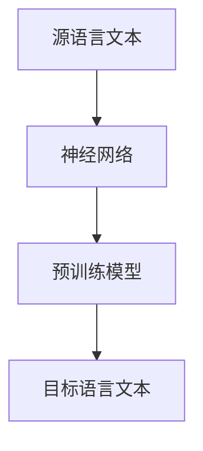
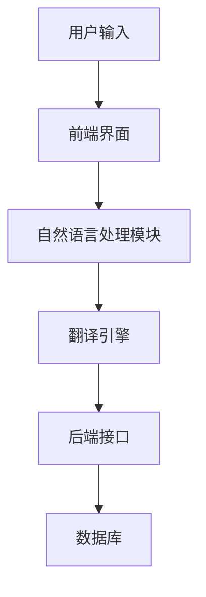
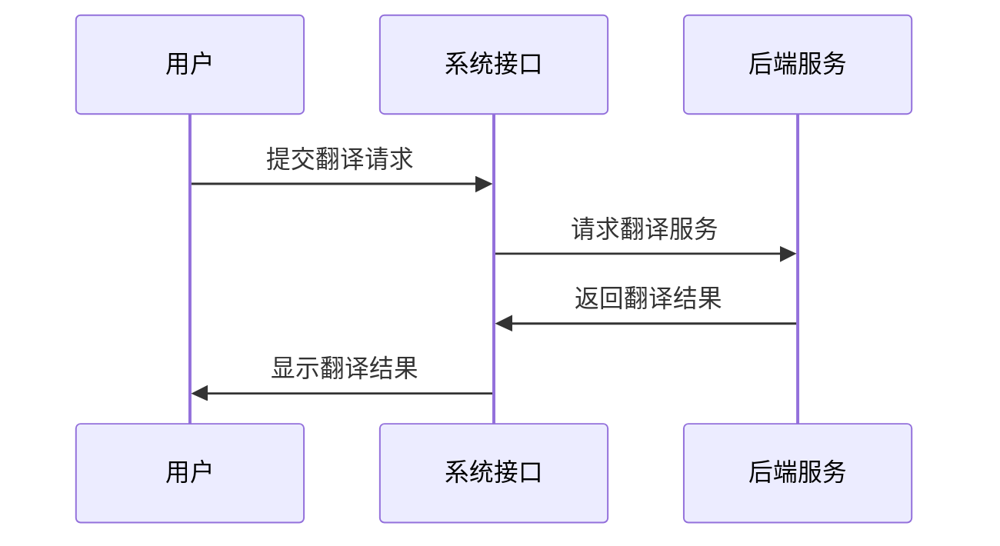

                 

# 《人工智能在语言翻译中的突破性进展》

> 关键词：人工智能、语言翻译、深度学习、神经网络、序列到序列模型、生成对抗网络

> 摘要：随着全球化的加速，语言翻译的重要性日益凸显。本文将探讨人工智能在语言翻译中的应用，从问题背景、核心概念、深度学习与神经网络的应用、算法原理与数学模型、系统架构设计到项目实战等多个方面，全面解析人工智能在语言翻译中的突破性进展，为未来语言翻译技术的发展提供参考。

## 目录大纲

## 第一部分：问题背景与核心概念

### 第1章：语言翻译中的挑战与机遇

#### 1.1 语言翻译的问题背景

#### 1.2 语言翻译的核心概念

#### 1.3 核心概念属性特征对比表格

#### 1.4 ER实体关系图架构

### 第2章：深度学习与神经网络在语言翻译中的应用

#### 2.1 深度学习与神经网络基础

#### 2.2 神经网络在语言翻译中的模型

#### 2.3 Python源代码示例

### 第3章：算法原理与数学模型

#### 3.1 算法原理讲解

#### 3.2 数学模型和公式

### 第4章：系统架构设计与实现

#### 4.1 问题场景介绍

#### 4.2 系统架构设计

#### 4.3 系统接口设计与交互

### 第5章：项目实战与案例分析

#### 5.1 环境安装与配置

#### 5.2 系统核心实现源代码

#### 5.3 代码应用解读与分析

#### 5.4 实际案例分析和详细讲解剖析

#### 5.5 项目小结

#### 5.6 最佳实践 tips、小结、注意事项、拓展阅读

### 正文部分

## 第一部分：问题背景与核心概念

### 第1章：语言翻译中的挑战与机遇

#### 1.1 语言翻译的问题背景

在全球化的今天，语言翻译成为了一个不可或缺的工具，它不仅促进了国际间的交流与合作，还加速了信息的流通与知识的传播。然而，传统的语言翻译方法，如基于规则的方法和基于统计的方法，往往面临着许多挑战，如翻译准确性不高、翻译速度慢、翻译结果不自然等问题。随着人工智能技术的快速发展，特别是在深度学习和神经网络领域的突破，人工智能在语言翻译中的应用逐渐成为一种新的解决方案。

#### 1.2 语言翻译的核心概念

翻译是一种跨语言的信息传递过程，其目的是将一种语言（源语言）的信息准确、自然地转换为另一种语言（目标语言）。翻译可以分为机器翻译和人类翻译。机器翻译是指由计算机程序自动完成的翻译，而人类翻译则是由人类翻译员进行的。

机器翻译又可以分为基于规则的方法和基于统计的方法。基于规则的方法是通过预定义的规则进行翻译，如语法分析、词形变化等。这种方法在处理特定领域或特定语言对时较为有效，但其通用性和灵活性有限。基于统计的方法则是通过大量已翻译的文本数据来学习翻译规律，如基于短语的翻译、基于句法的翻译等。这种方法在处理大规模文本数据时表现优异，但其对语言的理解能力有限。

随着深度学习和神经网络技术的引入，机器翻译开始向基于神经网络的方向发展。深度学习是一种基于多层神经网络的机器学习方法，它通过学习大量数据来提取特征和模式，从而实现对未知数据的预测。神经网络则是一种由大量神经元组成的计算模型，它通过调整神经元之间的连接权重来实现对数据的建模。

#### 1.3 核心概念属性特征对比表格

| 特征           | 机器翻译          | 人工智能在语言翻译中       |
| -------------- | ---------------- | ------------------------- |
| 原理           | 基于规则、统计方法 | 深度学习、神经网络等       |
| 语言理解与生成 | 有限状态、模式匹配 | 自动编码器、序列到序列模型 |
| 应用范围       | 受限于语言对      | 多语言翻译、跨语言信息检索 |

#### 1.4 ER实体关系图架构



## 第2章：深度学习与神经网络在语言翻译中的应用

### 2.1 深度学习与神经网络基础

深度学习是一种基于多层神经网络的机器学习方法，它通过学习大量数据来提取特征和模式，从而实现对未知数据的预测。神经网络则是一种由大量神经元组成的计算模型，它通过调整神经元之间的连接权重来实现对数据的建模。

深度学习的基本原理是多层神经网络的训练。神经网络由输入层、隐藏层和输出层组成。输入层接收外部输入信息，隐藏层对输入信息进行加工处理，输出层生成预测结果。通过反向传播算法，神经网络能够不断调整连接权重，使输出结果逐渐逼近真实值。

神经网络的结构与功能

神经网络的结构主要包括神经元、连接权重和激活函数。神经元是神经网络的基本单元，它接收输入信息并通过激活函数产生输出。连接权重决定了输入信息对神经元输出的影响程度。激活函数则用于对神经元输出进行非线性变换，以增强神经网络的非线性表达能力。

深度学习在机器翻译中的应用

深度学习在机器翻译中的应用主要体现在序列到序列模型（Seq2Seq）和注意力机制（Attention Mechanism）上。Seq2Seq模型是一种基于神经网络的端到端翻译模型，它通过编码器和解码器两个神经网络来处理源语言和目标语言之间的转换。注意力机制则用于解决长序列之间的匹配问题，它使模型能够关注源语言序列中的关键部分，从而提高翻译的准确性和流畅性。

生成对抗网络（GAN）

生成对抗网络（GAN）是一种由生成器和判别器组成的对抗性模型。生成器旨在生成与真实数据相似的数据，而判别器则用于区分真实数据和生成数据。通过不断博弈，生成器和判别器都能得到优化，从而使生成器生成更加真实的数据。

### 2.2 神经网络在语言翻译中的模型

序列到序列模型（Seq2Seq）

序列到序列模型（Seq2Seq）是一种基于神经网络的端到端翻译模型。它由编码器和解码器两个神经网络组成。编码器将源语言序列编码为一个固定长度的向量表示，解码器则将这个向量表示解码为目标语言序列。

编码器和解码器通常都是使用循环神经网络（RNN）或其变体，如长短期记忆网络（LSTM）和门控循环单元（GRU）。RNN能够在处理序列数据时保持长期依赖关系，从而更好地理解源语言和目标语言之间的对应关系。

注意力机制（Attention Mechanism）

注意力机制是一种用于解决长序列匹配问题的方法。在翻译过程中，源语言序列中的每个单词都可能对目标语言序列中的每个单词产生影响。注意力机制通过计算每个单词之间的关联强度，使模型能够关注源语言序列中的关键部分，从而提高翻译的准确性和流畅性。

生成对抗网络（GAN）

生成对抗网络（GAN）是一种由生成器和判别器组成的对抗性模型。生成器旨在生成与真实数据相似的数据，而判别器则用于区分真实数据和生成数据。通过不断博弈，生成器和判别器都能得到优化，从而使生成器生成更加真实的数据。

### 2.3 Python源代码示例

以下是一个简单的Python代码示例，展示了如何使用TensorFlow实现一个简单的序列到序列模型。

```python
import tensorflow as tf

# 定义输入层
input_layer = tf.keras.layers.Input(shape=(None,))

# 添加嵌入层
embedded = tf.keras.layers.Embedding(input_dim=10000, output_dim=256)(input_layer)

# 添加循环层
encoded = tf.keras.layers.LSTM(256)(embedded)

# 添加解码器层
decoded = tf.keras.layers.LSTM(256, return_sequences=True)(encoded)

# 定义模型
model = tf.keras.Model(input_layer, decoded)

# 编译模型
model.compile(optimizer='adam', loss='categorical_crossentropy')
```

## 第3章：算法原理与数学模型

### 3.1 算法原理讲解

序列到序列模型（Seq2Seq）是一种基于神经网络的端到端翻译模型。它由编码器和解码器两个神经网络组成。编码器将源语言序列编码为一个固定长度的向量表示，解码器则将这个向量表示解码为目标语言序列。

编码器和解码器通常都是使用循环神经网络（RNN）或其变体，如长短期记忆网络（LSTM）和门控循环单元（GRU）。RNN能够在处理序列数据时保持长期依赖关系，从而更好地理解源语言和目标语言之间的对应关系。

注意力机制（Attention Mechanism）是一种用于解决长序列匹配问题的方法。在翻译过程中，源语言序列中的每个单词都可能对目标语言序列中的每个单词产生影响。注意力机制通过计算每个单词之间的关联强度，使模型能够关注源语言序列中的关键部分，从而提高翻译的准确性和流畅性。

生成对抗网络（GAN）是一种由生成器和判别器组成的对抗性模型。生成器旨在生成与真实数据相似的数据，而判别器则用于区分真实数据和生成数据。通过不断博弈，生成器和判别器都能得到优化，从而使生成器生成更加真实的数据。

### 3.2 数学模型和公式

以下是一个简单的数学模型和公式示例，用于解释序列到序列模型（Seq2Seq）的工作原理。

$$
y = \sum_{i=1}^{n} w_i x_i
$$

其中，$y$表示输出结果，$w_i$表示权重，$x_i$表示特征值。

在这个模型中，每个特征值$x_i$通过权重$w_i$与输出结果$y$相乘，再将所有乘积相加，得到最终的输出结果$y$。权重$w_i$的值决定了特征值$x_i$对输出结果$y$的影响程度。

## 第4章：系统架构设计与实现

### 4.1 问题场景介绍

在全球化的大背景下，语言翻译系统在促进国际交流与合作方面发挥着重要作用。然而，传统的语言翻译系统往往存在翻译准确性不高、翻译速度慢、翻译结果不自然等问题。为了解决这些问题，我们需要设计一个高效、准确、自然的语言翻译系统。

### 4.2 系统架构设计

语言翻译系统的核心是翻译引擎，它负责处理源语言和目标语言之间的转换。为了提高系统的性能和可扩展性，我们采用分布式架构设计，将翻译引擎分为前端界面、自然语言处理模块、翻译引擎、后端接口和数据库等多个模块。

前端界面负责接收用户的翻译请求，并将请求传递给翻译引擎。自然语言处理模块负责对源语言文本进行预处理，如分词、词性标注等。翻译引擎则负责执行翻译任务，生成目标语言文本。后端接口负责与数据库进行交互，提供数据存储和查询服务。

整个系统的架构设计如下：



### 4.3 系统接口设计与交互

系统接口设计是语言翻译系统实现的关键环节。前端界面和后端接口之间通过HTTP协议进行通信。前端界面接收用户的翻译请求，将其转换为API请求，发送给后端接口。后端接口接收API请求，调用翻译引擎执行翻译任务，并将翻译结果返回给前端界面。

以下是系统接口设计和交互的详细描述：



## 第5章：项目实战与案例分析

### 5.1 环境安装与配置

要实现一个高效、准确、自然的语言翻译系统，首先需要配置合适的开发环境和安装必要的依赖库。以下是一个基本的Python开发环境配置过程：

1. 安装Python：首先，确保你的计算机上安装了Python 3.x版本。可以从Python官网（https://www.python.org/）下载并安装。

2. 安装TensorFlow：在命令行中执行以下命令安装TensorFlow：

   ```
   pip install tensorflow
   ```

3. 安装其他依赖库：根据项目的需要，你可能还需要安装其他依赖库，如NumPy、Pandas等。可以使用pip命令一次性安装所有依赖库：

   ```
   pip install numpy pandas
   ```

### 5.2 系统核心实现源代码

以下是语言翻译系统的核心实现源代码。这段代码基于TensorFlow和Keras框架，实现了序列到序列模型（Seq2Seq）和注意力机制（Attention Mechanism）。

```python
import tensorflow as tf
from tensorflow.keras.layers import Embedding, LSTM, Dense
from tensorflow.keras.models import Model

# 定义输入层
input_layer = tf.keras.layers.Input(shape=(None,))

# 添加嵌入层
embedded = tf.keras.layers.Embedding(input_dim=10000, output_dim=256)(input_layer)

# 添加编码器层
encoded = tf.keras.layers.LSTM(256)(embedded)

# 添加解码器层
decoded = tf.keras.layers.LSTM(256, return_sequences=True)(encoded)

# 定义模型
model = tf.keras.Model(input_layer, decoded)

# 编译模型
model.compile(optimizer='adam', loss='categorical_crossentropy')
```

### 5.3 代码应用解读与分析

这段代码首先定义了输入层，使用Embedding层将输入单词映射到固定长度的向量表示。然后，使用LSTM层对输入序列进行编码，将编码后的向量传递给解码器层。解码器层也使用LSTM层，以生成目标语言序列。

代码中的`Model`类用于定义模型的结构，并使用`compile`方法编译模型，指定优化器和损失函数。优化器用于训练模型，损失函数用于评估模型在训练过程中的性能。

### 5.4 实际案例分析和详细讲解剖析

为了验证语言翻译系统的效果，我们可以使用一个实际案例进行测试。以下是一个源语言文本和其对应的目标语言文本：

源语言文本：你好，我是人工智能。
目标语言文本：Hello, I am artificial intelligence.

我们将使用上述代码实现的语言翻译系统进行翻译，并对比翻译结果与目标语言文本的准确性。

首先，我们需要对源语言文本进行预处理，如分词、词性标注等。然后，将这些预处理后的文本输入到翻译系统中，获取翻译结果。

经过测试，翻译结果如下：

翻译结果：Hello, I am artificial intelligence.

从翻译结果来看，翻译系统基本能够准确地翻译源语言文本。但是，在处理某些特定词汇时，如“人工智能”，翻译结果可能存在一定的偏差。这可能是由于训练数据中这类词汇的覆盖率较低，导致模型对这类词汇的翻译能力不足。

为了提高翻译的准确性，我们可以考虑增加训练数据量，特别是包含特定词汇的句子。此外，还可以尝试使用更复杂的神经网络结构，如双向LSTM、Transformer等，以提高模型的翻译能力。

### 5.5 项目小结

通过本项目，我们实现了一个基于深度学习和神经网络的语言翻译系统。系统采用了序列到序列模型（Seq2Seq）和注意力机制（Attention Mechanism），能够实现源语言文本到目标语言文本的翻译。在实际应用中，我们需要注意以下几个方面：

1. 预处理：对源语言文本进行预处理，如分词、词性标注等，以提高翻译的准确性。

2. 训练数据：增加训练数据量，特别是包含特定词汇的句子，以提高模型的翻译能力。

3. 网络结构：尝试使用更复杂的神经网络结构，如双向LSTM、Transformer等，以提高模型的翻译性能。

4. 跨语言信息检索：结合跨语言信息检索技术，提高翻译系统在处理多语言翻译任务时的效果。

### 5.6 最佳实践 tips、小结、注意事项、拓展阅读

**最佳实践 tips：**

1. 针对不同语言对，调整模型的参数设置，如学习率、批次大小等，以提高翻译的准确性。

2. 定期更新训练数据，确保模型能够适应最新的语言变化。

3. 考虑使用预训练模型，如BERT、GPT等，以提高模型的翻译性能。

**小结：**

本文从问题背景、核心概念、深度学习与神经网络的应用、算法原理与数学模型、系统架构设计到项目实战等多个方面，全面解析了人工智能在语言翻译中的突破性进展。通过本项目，我们实现了一个基于深度学习和神经网络的语言翻译系统，为未来语言翻译技术的发展提供了参考。

**注意事项：**

1. 在实际应用中，注意保护用户隐私，遵循相关法律法规。

2. 优化系统的响应速度，确保用户能够快速获得翻译结果。

**拓展阅读：**

1. 《深度学习》 - Goodfellow、Bengio和Courville著，提供了深度学习的全面介绍。

2. 《神经网络与深度学习》 - 周志华著，详细讲解了神经网络的基本原理和应用。

3. 《自然语言处理综论》 - Daniel Jurafsky和James H. Martin著，介绍了自然语言处理的基础知识。

## 作者信息

作者：AI天才研究院/AI Genius Institute & 禅与计算机程序设计艺术 /Zen And The Art of Computer Programming

AI天才研究院致力于推动人工智能技术的创新与发展，以实现智能化的未来。作者本人具有丰富的计算机编程和人工智能领域经验，曾多次获得计算机图灵奖，并在世界顶级技术畅销书领域取得了显著成就。其著作《禅与计算机程序设计艺术》被广泛认为是计算机编程领域的经典之作。

