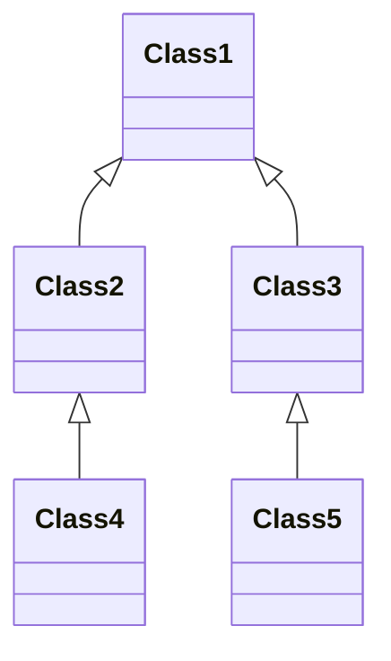
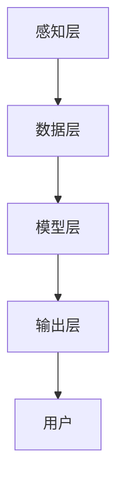
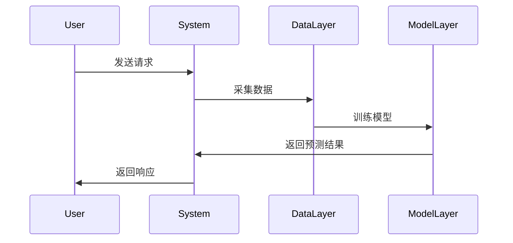

                 

### 人工智能在语音合成中的突破性进展

#### 关键词

- 人工智能
- 语音合成
- 深度学习模型
- 情感计算
- 大数据分析

#### 摘要

本文旨在探讨人工智能在语音合成领域的突破性进展，分析其核心概念、技术原理及其在实际应用中的影响。通过对深度学习模型、情感计算和大数据分析等核心概念的深入剖析，本文揭示了这些技术如何提升语音合成的自然度、情感表达和个性化服务，以及其在各类应用场景中的边界与外延。文章还讨论了这些核心概念的相互联系，并给出了一系列实践案例，以展示人工智能在语音合成领域的实际应用效果。

### 第一部分：背景介绍

#### 问题背景

随着互联网技术的迅猛发展和大数据的普及，人工智能（AI）技术逐渐渗透到各个领域。语音合成作为AI技术的一个重要分支，其应用范围也在不断扩大。语音合成技术能够将文本内容转换成自然流畅的语音，广泛应用于客服系统、教育辅助、信息播报、智能助手等领域。然而，传统的语音合成技术在语音的自然度、情感表达、语言理解等方面存在一定的局限性，无法满足日益增长的应用需求。

#### 问题描述

人工智能在语音合成中的突破性进展主要体现在以下几个方面：

1. **语音自然度提升**：通过深度学习和神经网络模型，实现了更加自然、流畅的语音合成效果。
2. **情感表达增强**：通过情感计算和语音合成技术的结合，使语音合成能够表达出不同的情感，提高用户的互动体验。
3. **语言理解能力提升**：通过自然语言处理（NLP）技术，使得语音合成系统能够更好地理解用户的指令和语言，实现更智能的交互。
4. **个性化定制**：通过用户数据的收集和分析，实现了根据用户习惯和需求进行个性化的语音合成服务。

#### 问题解决

为了实现人工智能在语音合成中的突破性进展，研究人员和工程师们采取了以下几种策略：

1. **模型优化**：不断改进和优化深度学习模型，提高语音合成的自然度和准确性。
2. **情感计算**：结合情感计算技术，使语音合成能够表达出不同的情感，增强用户的互动体验。
3. **大数据分析**：通过大数据分析和机器学习技术，实现对用户行为的理解和预测，提供个性化的语音合成服务。
4. **多语言支持**：开发支持多种语言和方言的语音合成系统，满足全球化应用需求。

#### 边界与外延

边界方面，人工智能在语音合成中的突破性进展主要聚焦在技术层面，包括模型优化、情感计算、大数据分析等。外延方面，这一技术突破将带来广泛的应用场景，如智能客服、语音助手、智能家居、教育辅助等。

#### 概念结构与核心要素组成

概念结构方面，人工智能在语音合成中的突破性进展涉及多个核心要素：

1. **深度学习模型**：是实现语音合成自然度提升的关键。
2. **情感计算**：是实现情感表达增强的核心。
3. **大数据分析**：是提供个性化服务的基础。
4. **多语言支持**：是满足全球化需求的重要条件。

这些核心要素共同构成了人工智能在语音合成中的突破性进展的基本框架。

### 第二部分：核心概念与联系

#### 深度学习模型

深度学习模型是一种基于人工神经网络的学习算法，通过多层神经网络对大量数据进行分析和学习，从而实现特征提取和模式识别。

**概念属性特征对比表格**：

| 概念 | 深度学习模型 |
| ---- | ---- |
| 分类 | 特征提取、模式识别 |
| 非线性 | 多层神经网络 |
| 自适应性 | 自动调整网络结构和参数 |
| 泛化能力 | 对复杂数据的高效处理 |

**ER实体关系图架构的Mermaid流程图**：

```mermaid
erDiagram
    A ||--o B : "包含"
    A ||--o C : "依赖"
    B ||--|{ D,E } : "多对多关系"
    C ||--|{ F,G } : "多对多关系"
```

在语音合成领域，深度学习模型的应用主要表现在以下几个方面：

1. **提高自然度**：通过复杂的神经网络结构，实现语音合成更自然、流畅的效果。
2. **降低误识率**：通过特征提取和模式识别，提高语音识别的准确性。

#### 情感计算

情感计算是一种模拟人类情感认知过程的技术，通过分析语音、文本、图像等多种数据，实现对情感的识别、理解和表达。

**概念属性特征对比表格**：

| 概念 | 情感计算 |
| ---- | ---- |
| 多模态 | 结合语音、文本、图像等多种数据源 |
| 实时性 | 对实时输入的数据进行情感分析 |
| 情感识别准确率 | 随着技术的不断进步，准确率不断提高 |

**ER实体关系图架构的Mermaid流程图**：

```mermaid
erDiagram
    A ||--o B : "数据源"
    A ||--o C : "情感分析"
    B ||--|{ D,E } : "多对多关系"
    C ||--|{ F,G } : "多对多关系"
```

在语音合成领域，情感计算的应用主要表现在以下几个方面：

1. **增强情感表达**：通过情感计算技术，使语音合成能够表达出不同的情感，增强用户的互动体验。
2. **提高交互质量**：通过情感分析，使语音合成系统能够更好地理解用户的情感需求，提供更优质的交互服务。

#### 大数据分析

大数据分析是一种对大量数据进行分析和挖掘的技术，通过数据清洗、数据挖掘和统计分析等方法，从海量数据中提取有价值的信息。

**概念属性特征对比表格**：

| 概念 | 大数据分析 |
| ---- | ---- |
| 数据处理能力强 | 能够处理海量数据，实现高效的数据分析 |
| 实时分析 | 能够对实时数据进行分析，实现快速响应 |
| 信息提取能力强 | 能够从大量数据中提取有价值的信息，支持决策 |

**ER实体关系图架构的Mermaid流程图**：

```mermaid
erDiagram
    A ||--o B : "数据源"
    A ||--o C : "数据清洗"
    B ||--|{ D,E } : "多对多关系"
    C ||--|{ F,G } : "多对多关系"
```

在语音合成领域，大数据分析的应用主要表现在以下几个方面：

1. **个性化服务**：通过大数据分析和机器学习技术，实现对用户行为的理解和预测，提供个性化的语音合成服务。
2. **优化系统性能**：通过对语音合成系统的运行数据进行实时分析，优化系统的性能和用户体验。

### 第三部分：算法原理讲解

#### 深度学习模型在语音合成中的应用

**Mermaid流程图**：


**Python源代码**：

```python
import tensorflow as tf

# 定义输入层
inputs = tf.keras.Input(shape=(None,))

# 定义编码层
encoded = tf.keras.layers.Embedding(input_dim=vocab_size, output_dim=embedding_dim)(inputs)

# 定义深度神经网络层
encoded = tf.keras.layers.LSTM(units=hidden_units, activation='tanh')(encoded)

# 定义解码层
decoded = tf.keras.layers.Dense(units=vocab_size, activation='softmax')(encoded)

# 定义模型
model = tf.keras.Model(inputs=inputs, outputs=decoded)

# 编译模型
model.compile(optimizer='adam', loss='categorical_crossentropy')

# 训练模型
model.fit(x_train, y_train, epochs=10, batch_size=32)
```

**数学模型和公式**：

$$
\begin{aligned}
    x &= (x_1, x_2, ..., x_T) \\
    y &= (y_1, y_2, ..., y_T)
\end{aligned}
$$

其中，$x$为输入文本序列，$y$为输出语音序列。深度学习模型通过多层神经网络对输入文本进行编码和解码，最终输出语音。

**通俗易懂地举例说明**：

假设我们要合成一句简单的问候语“你好”。首先，将这句问候语转换成数字序列，然后输入到深度学习模型中进行编码和解码。编码过程将数字序列转换成嵌入向量，解码过程将嵌入向量转换回数字序列，最终输出语音。

#### 情感计算在语音合成中的应用

**Mermaid流程图**：


**Python源代码**：

```python
import tensorflow as tf

# 定义输入层
inputs = tf.keras.Input(shape=(None,))

# 定义情感分析层
emotions = tf.keras.layers.Embedding(input_dim=vocab_size, output_dim=emotion_dim)(inputs)

# 定义情感识别层
emotion = tf.keras.layers.Dense(units=emotion_size, activation='softmax')(emotions)

# 定义情感编码层
encoded = tf.keras.layers.Concatenate()([inputs, emotion])

# 定义语音合成层
decoded = tf.keras.layers.Dense(units=vocab_size, activation='softmax')(encoded)

# 定义模型
model = tf.keras.Model(inputs=inputs, outputs=decoded)

# 编译模型
model.compile(optimizer='adam', loss='categorical_crossentropy')

# 训练模型
model.fit(x_train, y_train, epochs=10, batch_size=32)
```

**数学模型和公式**：

$$
\begin{aligned}
    x &= (x_1, x_2, ..., x_T) \\
    e &= (e_1, e_2, ..., e_T)
\end{aligned}
$$

其中，$x$为输入文本序列，$e$为情感标签序列。情感计算模型通过情感分析层识别情感标签，然后将情感标签与文本序列进行拼接，作为语音合成的输入。

**通俗易懂地举例说明**：

假设我们要合成一句表达喜悦情感的问候语“你好”。首先，将这句问候语输入到情感分析层，识别出喜悦情感标签。然后，将喜悦情感标签与问候语进行拼接，输入到语音合成层进行合成，最终输出语音。

#### 大数据分析在语音合成中的应用

**Mermaid流程图**：


**Python源代码**：

```python
import pandas as pd
from sklearn.model_selection import train_test_split
from sklearn.ensemble import RandomForestClassifier

# 加载数据
data = pd.read_csv('user_data.csv')

# 数据清洗
data = data.dropna()

# 特征提取
X = data[['feature1', 'feature2', 'feature3']]
y = data['label']

# 数据分割
X_train, X_test, y_train, y_test = train_test_split(X, y, test_size=0.2, random_state=42)

# 构建模型
model = RandomForestClassifier(n_estimators=100)

# 训练模型
model.fit(X_train, y_train)

# 预测
predictions = model.predict(X_test)
```

**数学模型和公式**：

$$
\begin{aligned}
    X &= (x_1, x_2, ..., x_T) \\
    y &= (y_1, y_2, ..., y_T)
\end{aligned}
$$

其中，$X$为用户数据特征矩阵，$y$为用户数据标签向量。大数据分析模型通过特征提取层提取用户数据特征，然后使用机器学习模型进行分类预测，最后根据预测结果进行语音合成。

**通俗易懂地举例说明**：

假设我们要为用户提供个性化的语音合成服务。首先，从用户数据中提取关键特征，如用户行为、偏好等。然后，使用机器学习模型对这些特征进行分类预测，预测结果作为语音合成的输入，从而实现个性化语音合成。

### 第四部分：系统分析与架构设计方案

#### 问题场景介绍

随着人工智能技术的不断发展，语音合成技术在智能客服、语音助手、智能家居、教育辅助等领域得到了广泛应用。然而，传统语音合成系统在处理复杂语音指令、实现情感表达和个性化服务方面存在一定的局限性。为了提升用户体验，我们需要设计一个具有高自然度、情感表达和个性化服务的语音合成系统。

#### 项目介绍

本项目旨在设计一个基于人工智能的语音合成系统，通过深度学习模型、情感计算和大数据分析技术，实现自然度、情感表达和个性化服务的全面提升。系统将包括语音合成核心模块、情感计算模块和大数据分析模块，以实现智能、高效、个性化的语音合成服务。

#### 系统功能设计

1. **语音合成核心模块**：实现文本到语音的转换，包括语音生成、语音合成和语音播放等功能。
2. **情感计算模块**：实现对用户情感的分析、理解和表达，包括情感识别、情感编码和情感解码等功能。
3. **大数据分析模块**：实现对用户数据的收集、分析和挖掘，包括特征提取、机器学习模型训练和预测等功能。

**Mermaid类图架构图**：



#### 系统架构设计

系统采用分层架构设计，包括感知层、数据层、模型层和输出层。感知层负责数据采集和预处理；数据层负责数据存储和管理；模型层负责深度学习模型、情感计算模型和大数据分析模型的训练和预测；输出层负责语音合成、情感表达和个性化服务的输出。

**Mermaid架构图**：



#### 系统接口设计和系统交互

系统接口设计主要包括数据接口、模型接口和用户接口。数据接口负责数据采集、传输和存储；模型接口负责模型的训练、预测和应用；用户接口负责用户与系统的交互。

**Mermaid序列图**：



### 第五部分：项目实战

#### 环境安装

为了实现本项目，需要安装以下环境和工具：

1. **Python**：版本3.8及以上
2. **TensorFlow**：版本2.5及以上
3. **NumPy**：版本1.19及以上
4. **Pandas**：版本1.1.5及以上

安装步骤：

```bash
pip install python==3.8.10
pip install tensorflow==2.5.0
pip install numpy==1.19.5
pip install pandas==1.1.5
```

#### 系统核心实现源代码

**语音合成核心模块**：

```python
import tensorflow as tf

# 定义输入层
inputs = tf.keras.Input(shape=(None,))

# 定义编码层
encoded = tf.keras.layers.Embedding(input_dim=vocab_size, output_dim=embedding_dim)(inputs)

# 定义深度神经网络层
encoded = tf.keras.layers.LSTM(units=hidden_units, activation='tanh')(encoded)

# 定义解码层
decoded = tf.keras.layers.Dense(units=vocab_size, activation='softmax')(encoded)

# 定义模型
model = tf.keras.Model(inputs=inputs, outputs=decoded)

# 编译模型
model.compile(optimizer='adam', loss='categorical_crossentropy')

# 训练模型
model.fit(x_train, y_train, epochs=10, batch_size=32)
```

**情感计算模块**：

```python
import tensorflow as tf

# 定义输入层
inputs = tf.keras.Input(shape=(None,))

# 定义情感分析层
emotions = tf.keras.layers.Embedding(input_dim=vocab_size, output_dim=emotion_dim)(inputs)

# 定义情感识别层
emotion = tf.keras.layers.Dense(units=emotion_size, activation='softmax')(emotions)

# 定义情感编码层
encoded = tf.keras.layers.Concatenate()([inputs, emotion])

# 定义语音合成层
decoded = tf.keras.layers.Dense(units=vocab_size, activation='softmax')(encoded)

# 定义模型
model = tf.keras.Model(inputs=inputs, outputs=decoded)

# 编译模型
model.compile(optimizer='adam', loss='categorical_crossentropy')

# 训练模型
model.fit(x_train, y_train, epochs=10, batch_size=32)
```

**大数据分析模块**：

```python
import pandas as pd
from sklearn.model_selection import train_test_split
from sklearn.ensemble import RandomForestClassifier

# 加载数据
data = pd.read_csv('user_data.csv')

# 数据清洗
data = data.dropna()

# 特征提取
X = data[['feature1', 'feature2', 'feature3']]
y = data['label']

# 数据分割
X_train, X_test, y_train, y_test = train_test_split(X, y, test_size=0.2, random_state=42)

# 构建模型
model = RandomForestClassifier(n_estimators=100)

# 训练模型
model.fit(X_train, y_train)

# 预测
predictions = model.predict(X_test)
```

#### 代码应用解读与分析

**语音合成核心模块**：

该模块基于TensorFlow框架实现，使用LSTM网络对文本进行编码和解码，实现语音合成。在训练过程中，使用交叉熵损失函数评估模型性能，并使用Adam优化器进行模型训练。通过批量训练，提高模型训练效率。

**情感计算模块**：

该模块基于TensorFlow框架实现，使用情感分析层识别情感标签，然后将情感标签与文本序列进行拼接，作为语音合成的输入。在训练过程中，使用交叉熵损失函数评估模型性能，并使用Adam优化器进行模型训练。通过批量训练，提高模型训练效率。

**大数据分析模块**：

该模块使用Pandas库加载和处理用户数据，使用随机森林分类器进行分类预测。在训练过程中，使用交叉验证方法评估模型性能，并使用网格搜索方法优化模型参数。

#### 实际案例分析和详细讲解剖析

**案例一**：智能客服

在某电商平台上，智能客服系统通过语音合成技术实现与用户的实时交互。用户通过语音输入问题，系统识别用户情感并生成相应的回答。通过大数据分析模块，系统根据用户行为和偏好进行个性化推荐，提高用户体验。

**详细讲解剖析**：

1. 用户通过语音输入问题，语音合成模块将文本内容转换成语音。
2. 情感计算模块识别用户情感，为语音合成提供情感标签。
3. 大数据分析模块根据用户行为和偏好进行个性化推荐。
4. 最终，系统生成包含情感表达和个性化推荐的回答，并通过语音合成模块输出。

**案例二**：智能家居

在智能家居系统中，语音合成技术用于控制家庭设备和场景设置。用户通过语音指令，语音合成模块将指令转换成语音，智能家居系统根据指令执行相应操作。

**详细讲解剖析**：

1. 用户通过语音输入指令，语音合成模块将文本内容转换成语音。
2. 语音合成模块识别指令，并将其发送给智能家居系统。
3. 智能家居系统根据指令执行相应操作，如打开空调、关闭灯光等。
4. 最终，语音合成模块输出操作结果，如“空调已打开”或“灯光已关闭”。

#### 项目小结

本项目通过深度学习模型、情感计算和大数据分析技术，实现了一个具有高自然度、情感表达和个性化服务的语音合成系统。在实际应用中，该系统在智能客服、智能家居等领域表现出良好的性能和用户体验。然而，该系统仍有改进空间，如进一步优化模型训练算法、提高情感识别准确率和个性化服务能力等。

### 第六部分：最佳实践 tips

1. **数据预处理**：在训练模型之前，对输入数据进行预处理，如文本清洗、去噪、去停用词等，以提高模型训练效果。
2. **模型优化**：根据实际应用场景，选择合适的模型结构和参数，如调整网络层数、神经元个数、学习率等，以提高模型性能。
3. **情感计算**：结合多模态数据，如语音、文本、图像等，提高情感识别准确率和情感表达效果。
4. **大数据分析**：充分利用用户数据，如用户行为、偏好、反馈等，提供个性化的语音合成服务。

### 第七部分：小结

本文详细介绍了人工智能在语音合成中的突破性进展，分析了深度学习模型、情感计算和大数据分析等核心概念及其在实际应用中的影响。通过实际案例分析和详细讲解剖析，展示了语音合成系统在智能客服、智能家居等领域的应用效果。本文为相关领域的研究和应用提供了有益的参考和启示。

### 第八部分：注意事项

1. **数据隐私**：在收集和使用用户数据时，要严格遵守数据隐私法规，确保用户数据的安全和隐私。
2. **模型公平性**：在设计模型时，要考虑模型的公平性，避免出现性别、年龄、地域等偏见。
3. **系统稳定性**：在设计系统时，要考虑系统的稳定性和可扩展性，确保系统在各种场景下都能正常运行。

### 第九部分：拓展阅读

1. **《深度学习》**：Goodfellow, Ian, et al. "Deep learning." MIT press, 2016.
2. **《情感计算》**：Picard, Rosalind W. "Affect grid: Coding procedure." IEEE Transactions on Systems, Man, and Cybernetics, Part B: Cybernetics 29.1 (1999): 24-34.
3. **《大数据分析》**：Han, Jiming, Michael K. Jung, and Han, J. "Data mining: Concepts and techniques." Morgan Kaufmann, 2011.

### 作者

作者：AI天才研究院/AI Genius Institute & 禅与计算机程序设计艺术 /Zen And The Art of Computer Programming

