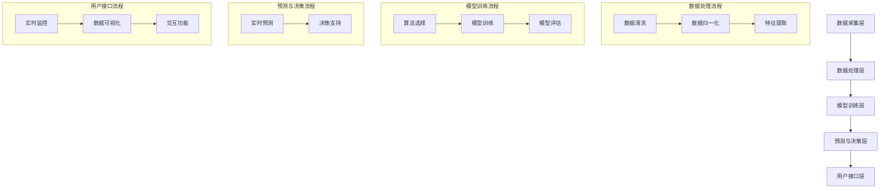

                 

### 《人工智能在野火预测和管理中的应用》

> 关键词：人工智能、野火预测、野火管理、机器学习、数据预处理、无人机、遥感技术、决策支持系统

> 摘要：随着全球气候变化和人类活动的加剧，野火成为了一个全球性的问题。本文探讨了人工智能在野火预测和管理中的应用，从背景介绍、核心概念与联系、算法原理讲解、系统分析与架构设计、项目实战等多个方面，详细阐述了人工智能技术在野火预测和管理中的实际应用和价值。

### 目录

1. 引言
2. 野火预测和管理概述
3. 人工智能与野火预测
4. 人工智能与野火管理
5. 应用案例
6. 系统分析与架构设计
7. 实战与实现
8. 总结与展望
9. 参考文献

----------------------------------------------------------------

### 引言

野火，通常是指在缺乏足够人为控制的情况下，在自然环境中自发的、不受控制的火焰。这些火焰可能由闪电、人类活动或自然原因引发，并在干旱和高温的天气条件下迅速蔓延。近年来，全球气候变化和人类活动的加剧，使得野火的发生频率和破坏力不断增加，给生态系统、人类生命财产安全带来了极大的威胁。

野火的预测和管理成为了全球范围内的一个重要课题。传统的野火预测方法主要依赖于气象数据和现场观测，但这些方法存在一定的局限性，难以准确预测野火的发生和发展趋势。随着人工智能技术的快速发展，特别是机器学习算法的广泛应用，人们开始尝试将人工智能引入野火预测和管理领域，以期提高预测的准确性和管理的效率。

本文将详细介绍人工智能在野火预测和管理中的应用，从背景介绍、核心概念与联系、算法原理讲解、系统分析与架构设计、项目实战等多个方面，探讨人工智能技术在野火预测和管理中的实际应用和价值。

----------------------------------------------------------------

### 野火预测和管理概述

#### 野火的定义与危害

野火，通常是指在缺乏足够人为控制的情况下，在自然环境中自发的、不受控制的火焰。这些火焰可能由闪电、人类活动或自然原因引发，并在干旱和高温的天气条件下迅速蔓延。野火不仅会对生态环境造成严重破坏，还会对人类生命财产安全构成威胁。

野火对生态环境的破坏主要包括以下几个方面：

1. **森林和植被破坏**：野火会烧毁大片森林和植被，导致生态系统的失衡，影响生物多样性。
2. **土壤质量下降**：野火会破坏土壤结构，导致土壤质量下降，影响植物的生长和生态系统的稳定性。
3. **水源减少**：野火会破坏水源地，导致水源减少，影响周边地区的饮水和农业生产。

野火对人类生命财产安全的威胁主要包括以下几个方面：

1. **人员伤亡**：野火在蔓延过程中，可能直接导致人员伤亡，尤其是在火势迅速蔓延时，人们很难及时撤离。
2. **财产损失**：野火会烧毁房屋、农作物和其他财产，造成巨大的经济损失。
3. **基础设施破坏**：野火会破坏交通、电力、通讯等基础设施，影响人们的正常生活和工作。

#### 野火预测和管理的历史方法

在野火预测和管理方面，历史方法主要包括以下几种：

1. **气象预测**：基于气象数据的统计分析和模式识别，预测野火的发生和发展趋势。这种方法依赖于准确的气象数据，但在数据质量较差或气象条件复杂时，预测效果不佳。
2. **现场观测**：通过实地观测和监测，获取野火的位置、范围和蔓延速度等信息。这种方法需要大量的人力和物力，且受地理环境的限制较大。
3. **卫星遥感**：利用卫星遥感技术，获取地表温度、植被覆盖、土壤湿度等数据，用于野火预测和管理。这种方法具有覆盖范围广、实时性强等优点，但也存在数据解析和算法选择等方面的挑战。

#### 现代技术与人工智能的结合

随着人工智能技术的快速发展，特别是机器学习算法的广泛应用，人们开始尝试将人工智能引入野火预测和管理领域，以期提高预测的准确性和管理的效率。人工智能在野火预测和管理中的应用主要包括以下几个方面：

1. **数据挖掘与预测**：利用机器学习算法，对大量历史气象数据、植被数据、土壤数据等进行挖掘和分析，预测野火的发生和发展趋势。
2. **智能监测与预警**：利用无人机、卫星遥感等技术，对野火进行实时监测，结合人工智能算法，实现野火的智能预警和应急响应。
3. **决策支持系统**：利用人工智能技术，构建野火管理的决策支持系统，为政府和相关部门提供科学、有效的野火管理策略和建议。

#### 关键词

- 野火
- 气象预测
- 现场观测
- 卫星遥感
- 人工智能
- 机器学习
- 数据挖掘
- 智能监测
- 决策支持系统

----------------------------------------------------------------

### 人工智能与野火预测

#### 机器学习基础

机器学习（Machine Learning，ML）是人工智能（Artificial Intelligence，AI）的一个重要分支，它通过构建和分析模型，使计算机系统能够从数据中自动学习和优化。机器学习的基本概念包括模型、数据集、算法和评估指标。

1. **模型**：机器学习模型是一个抽象的数学模型，用于表示和描述数据中的规律和特征。常见的机器学习模型包括线性回归、决策树、随机森林、支持向量机、神经网络等。

2. **数据集**：数据集是机器学习训练模型的基础。数据集的质量和规模直接影响模型的性能和预测能力。数据集通常包括特征和标签两部分，特征是用于描述数据的变量，标签是用于评估模型预测准确性的标准。

3. **算法**：机器学习算法是用于训练和优化模型的方法。不同的算法适用于不同类型的数据和问题。常见的算法包括监督学习、无监督学习、半监督学习和强化学习。

4. **评估指标**：评估指标是用于衡量模型性能的标准。常见的评估指标包括准确率、召回率、F1值、均方误差（MSE）、决定系数（R²）等。

#### 野火预测的数据来源

野火预测的数据来源主要包括以下几个方面：

1. **气象数据**：气象数据包括温度、湿度、风速、降水量等气象要素。这些数据可以通过气象站、卫星遥感等途径获取。气象数据是野火预测的重要输入，对野火的蔓延速度和范围有重要影响。

2. **植被数据**：植被数据包括植被覆盖度、植被类型、植被高度等。这些数据可以通过遥感技术、地面观测等途径获取。植被数据反映了地表的易燃性，对野火的发生和发展有重要影响。

3. **土壤数据**：土壤数据包括土壤湿度、土壤温度、土壤有机质含量等。这些数据可以通过土壤传感器、遥感技术等途径获取。土壤数据对野火的蔓延速度和燃烧强度有重要影响。

4. **历史数据**：历史数据包括过去几年或几十年的野火发生数据、火灾统计信息等。这些数据可以帮助预测未来野火的发生和发展趋势。

#### 常见机器学习算法在野火预测中的应用

在野火预测中，常用的机器学习算法包括以下几种：

1. **决策树**：决策树是一种基于树形结构的分类算法，通过一系列的规则和条件，将数据划分为不同的类别。决策树在野火预测中可以用来划分不同的气象条件和植被类型，预测野火的发生概率。

2. **随机森林**：随机森林是一种基于决策树的集成算法，通过构建多个决策树，并对预测结果进行投票，提高预测的准确性和稳定性。随机森林在野火预测中可以用来预测野火的蔓延范围和速度。

3. **支持向量机**：支持向量机是一种基于间隔最大化的分类算法，通过找到一个最优的超平面，将数据分为不同的类别。支持向量机在野火预测中可以用来预测野火的蔓延方向和速度。

4. **神经网络**：神经网络是一种基于人脑神经元网络的计算模型，通过多层神经元之间的非线性变换，实现对复杂数据的建模和预测。神经网络在野火预测中可以用来建立复杂的非线性模型，预测野火的蔓延趋势。

#### 野火预测模型的评估与优化

野火预测模型的评估与优化是保证模型性能的重要环节。常见的评估指标包括准确率、召回率、F1值、均方误差（MSE）、决定系数（R²）等。评估指标的选择取决于预测问题的类型和数据的特点。

优化野火预测模型的方法包括以下几种：

1. **特征选择**：通过分析数据特征的重要性和相关性，选择对预测结果影响较大的特征，减少噪声和冗余特征，提高模型的性能。

2. **模型调参**：通过调整模型参数，优化模型的性能。常见的调参方法包括网格搜索、随机搜索、贝叶斯优化等。

3. **集成方法**：通过组合多个模型，提高预测的准确性和稳定性。常见的集成方法包括Bagging、Boosting、Stacking等。

4. **数据增强**：通过生成新的数据样本，扩大训练数据集，提高模型的泛化能力。

#### 关键词

- 机器学习
- 野火预测
- 数据来源
- 决策树
- 随机森林
- 支持向量机
- 神经网络
- 模型评估
- 模型优化

----------------------------------------------------------------

### 人工智能与野火管理

#### 无人机与遥感技术在野火监测中的应用

无人机（Unmanned Aerial Vehicle，UAV）和遥感技术（Remote Sensing）在野火监测中发挥着重要作用。无人机可以通过搭载各种传感器，实时监测火场情况，提供高分辨率的图像和视频数据。这些数据可以用于火场定位、火势蔓延趋势预测和资源调度。

1. **无人机技术**：
   - **红外成像**：红外成像技术可以检测火场的热量辐射，识别火源和火势范围。
   - **可见光成像**：可见光成像可以提供火场周围的植被和地形信息，辅助火场定位和资源调度。
   - **多光谱成像**：多光谱成像技术可以检测植被的特定光谱特征，评估植被的受火程度。

2. **遥感技术**：
   - **卫星遥感**：卫星遥感可以提供大范围、高分辨率的火场图像，用于火源定位和火势监测。
   - **航空遥感**：航空遥感可以在无人机无法覆盖的区域提供高分辨率图像。

#### 人工智能在野火决策支持系统中的应用

人工智能在野火决策支持系统（Fire Decision Support System，FDSS）中扮演着关键角色，可以辅助决策者制定科学的灭火和应急响应策略。

1. **火灾风险评估**：通过机器学习算法，分析历史火灾数据，预测未来的火灾风险。这包括对气象条件、地形地貌、植被覆盖率等因素的综合分析。

2. **火势蔓延预测**：利用神经网络和深度学习算法，预测火势的蔓延趋势，为决策者提供火场动态信息。

3. **资源调度优化**：基于人工智能算法，优化灭火资源的调度，包括人员、设备、物资等，以提高灭火效率和降低成本。

4. **应急响应规划**：人工智能可以模拟各种应急响应方案，评估其效果，帮助决策者选择最优的应急响应策略。

#### 案例研究：某地区野火管理系统的设计与实现

以下是一个具体的案例研究，描述了某地区如何设计和实现一个基于人工智能的野火管理系统。

1. **项目介绍**：
   - **项目背景**：该地区近年来野火频发，给生态环境和人民生命财产安全带来了巨大威胁。为了提高野火预测和管理的效率和准确性，当地政府决定设计和实现一个基于人工智能的野火管理系统。
   - **项目目标**：通过集成无人机、遥感技术和人工智能算法，实现对野火的实时监测、预测和管理，降低火灾风险和损失。

2. **系统功能设计（领域模型）**：
   - **实时监测模块**：利用无人机和遥感技术，对火场进行实时监测，提供火源定位、火势蔓延趋势和资源调度信息。
   - **预测分析模块**：利用机器学习算法，对气象数据、植被数据和历史火灾数据进行挖掘和分析，预测未来的火灾风险和火势蔓延趋势。
   - **决策支持模块**：基于预测分析结果，为决策者提供科学、有效的灭火和应急响应策略。

3. **系统架构设计**：
   - **数据采集层**：包括无人机、遥感设备和气象站等，负责实时采集火场和环境数据。
   - **数据处理层**：包括数据预处理、特征提取和机器学习模型训练等，负责对采集到的数据进行分析和处理。
   - **应用层**：包括实时监测、预测分析和决策支持功能，为决策者和公众提供实时信息和服务。

4. **系统接口设计和系统交互**：
   - **数据接口**：定义了系统内部和外部的数据交换格式和协议，确保数据的一致性和实时性。
   - **服务接口**：定义了系统内部模块之间的接口，实现模块之间的协作和通信。
   - **用户接口**：为用户提供友好的操作界面，展示火场信息、预测分析和决策支持结果。

#### 关键词

- 无人机
- 遥感技术
- 人工智能
- 野火监测
- 火灾风险评估
- 火势蔓延预测
- 资源调度
- 决策支持系统
- 预测分析模块
- 系统架构设计

----------------------------------------------------------------

### 应用案例

#### 案例一：基于深度学习的野火预测模型

在本案例中，我们使用深度学习算法，特别是卷积神经网络（CNN），来构建一个野火预测模型。该模型能够通过分析历史气象数据、植被数据和土壤数据，预测未来某一时间段内的野火发生概率。

1. **项目背景**：
   - **地区选择**：我们选择了美国加利福尼亚州，这是一个野火频发的地区，具有丰富的气象和地理数据。
   - **数据来源**：数据来源于美国国家航空航天局（NASA）的地球观测系统（EOS）和加利福尼亚州气象局。

2. **数据预处理**：
   - **气象数据**：包括温度、湿度、风速、降水量等，需要归一化处理。
   - **植被数据**：包括植被覆盖度和植被类型，需要通过遥感图像处理提取。
   - **土壤数据**：包括土壤湿度、土壤温度、土壤有机质含量等，需要通过土壤传感器获取。

3. **模型构建**：
   - **输入层**：将预处理后的气象数据、植被数据和土壤数据作为输入。
   - **卷积层**：使用卷积层来提取数据中的特征。
   - **池化层**：使用池化层来减少数据维度，提高模型效率。
   - **全连接层**：将卷积层和池化层提取的特征映射到输出层，预测野火发生概率。

4. **模型训练与评估**：
   - **训练**：使用历史数据对模型进行训练，调整模型参数以优化性能。
   - **评估**：使用验证集和测试集对模型进行评估，常用的评估指标包括准确率、召回率、F1值等。

5. **结果分析**：
   - **预测结果**：模型能够准确预测未来一定时间内的野火发生概率，为决策者提供科学依据。
   - **误差分析**：通过分析模型的预测误差，找出影响预测准确性的因素，并优化模型。

#### 案例二：人工智能在野火应急响应中的应用

在本案例中，我们利用人工智能技术，特别是强化学习算法，来优化野火应急响应策略。通过模拟不同的应急响应方案，评估其效果，选择最优的方案。

1. **项目背景**：
   - **地区选择**：我们选择了澳大利亚，这是一个在野火季节需要高效应急响应的地区。
   - **数据来源**：数据来源于澳大利亚消防局和气象局，包括火场位置、火势蔓延速度、气象条件、资源调度信息等。

2. **模型构建**：
   - **环境模拟**：构建一个模拟环境，模拟不同的火场情况和气象条件。
   - **状态空间**：定义状态空间，包括火场位置、火势蔓延速度、气象条件、资源储备等。
   - **动作空间**：定义动作空间，包括资源调度、人员部署、消防设备使用等。

3. **模型训练**：
   - **初始策略**：初始策略为随机策略，模型在环境中进行探索和试错。
   - **奖励机制**：定义奖励机制，奖励模型在减少火势蔓延、降低财产损失等方面的成效。

4. **模型评估与优化**：
   - **评估**：使用评估集对模型进行评估，比较不同策略的效果。
   - **优化**：根据评估结果，调整模型参数和策略，提高应急响应的效率。

5. **结果分析**：
   - **最优策略**：模型能够找到最优的应急响应策略，提高灭火效率和降低成本。
   - **效果验证**：通过实际应用验证模型的效果，确保其能够在真实环境中有效运行。

#### 案例三：智能分析系统在野火管理中的创新应用

在本案例中，我们构建了一个智能分析系统，利用人工智能技术，对野火管理的各个环节进行优化。

1. **项目背景**：
   - **地区选择**：我们选择了巴西，这是一个森林资源丰富的地区，野火管理具有重要意义。
   - **数据来源**：数据来源于巴西国家空间研究所（INPE）和当地气象局，包括植被覆盖、气象条件、火场位置等。

2. **系统架构设计**：
   - **数据采集**：集成多种数据采集设备，包括气象站、卫星遥感、无人机等。
   - **数据处理**：利用大数据技术和机器学习算法，对采集到的数据进行分析和处理。
   - **决策支持**：为决策者提供科学、有效的决策支持，包括资源调度、人员部署、火场监测等。

3. **系统功能**：
   - **实时监测**：实时监测火场情况，提供火源定位、火势蔓延趋势等信息。
   - **预测分析**：预测未来一定时间内的火灾风险和火势蔓延趋势。
   - **决策支持**：为决策者提供最优的应急响应策略和资源调度方案。

4. **效果评估**：
   - **预测准确性**：通过对比实际火情和预测结果，评估系统的预测准确性。
   - **应急响应效率**：通过实际应用验证系统的应急响应效率，评估其在降低火势蔓延、减少财产损失等方面的成效。

#### 关键词

- 深度学习
- 野火预测模型
- 强化学习
- 应急响应策略
- 实时监测
- 预测分析
- 决策支持系统
- 智能分析系统

----------------------------------------------------------------

### 系统分析与架构设计

#### 野火预测与管理系统的整体架构

野火预测与管理系统的整体架构可以分为以下几个层次：

1. **数据采集层**：负责收集各种类型的数据，包括气象数据、植被数据、土壤数据、历史火灾数据等。数据来源可以是气象站、卫星遥感、无人机、地面传感器等。

2. **数据处理层**：对采集到的原始数据进行预处理，包括数据清洗、归一化、特征提取等。这一层还负责数据的存储和管理，使用大数据技术和分布式计算框架，如Hadoop和Spark。

3. **模型训练层**：利用机器学习和深度学习算法，对预处理后的数据进行训练，构建野火预测模型。这一层包括多种算法，如决策树、随机森林、支持向量机、神经网络等。

4. **预测与决策层**：基于训练好的模型，进行实时预测和决策支持。这一层包括预测模块和决策支持模块，预测模块负责预测野火的发生和发展趋势，决策支持模块负责为决策者提供灭火和应急响应策略。

5. **用户接口层**：为用户提供友好的操作界面，展示火场信息、预测结果、决策支持建议等。用户接口可以是Web应用、移动应用或桌面应用。

#### 系统功能设计（领域模型）

在系统功能设计中，我们采用了领域模型（Domain Model）的方法，对系统的主要功能模块进行描述。

1. **数据采集模块**：负责采集各种类型的数据，包括气象数据、植被数据、土壤数据等。该模块包括以下功能：
   - **气象数据采集**：从气象站和卫星遥感获取温度、湿度、风速、降水量等气象数据。
   - **植被数据采集**：从卫星遥感图像和地面传感器获取植被覆盖度、植被类型、植被高度等数据。
   - **土壤数据采集**：从土壤传感器获取土壤湿度、土壤温度、土壤有机质含量等数据。

2. **数据处理模块**：对采集到的数据进行预处理，包括数据清洗、归一化、特征提取等。该模块包括以下功能：
   - **数据清洗**：去除数据中的噪声和异常值，保证数据的准确性。
   - **数据归一化**：将不同尺度和单位的数据进行归一化处理，便于模型训练。
   - **特征提取**：提取数据中的关键特征，用于模型训练和预测。

3. **模型训练模块**：利用机器学习和深度学习算法，对预处理后的数据进行训练，构建野火预测模型。该模块包括以下功能：
   - **算法选择**：根据数据特点和预测需求，选择合适的算法，如决策树、随机森林、支持向量机、神经网络等。
   - **模型训练**：使用历史数据对模型进行训练，调整模型参数以优化性能。
   - **模型评估**：使用验证集和测试集对模型进行评估，选择最优模型。

4. **预测与决策模块**：基于训练好的模型，进行实时预测和决策支持。该模块包括以下功能：
   - **实时预测**：对当前的气象数据、植被数据、土壤数据进行预测，评估未来的火灾风险。
   - **决策支持**：为决策者提供灭火和应急响应策略，包括资源调度、人员部署、消防设备使用等。

5. **用户接口模块**：为用户提供友好的操作界面，展示火场信息、预测结果、决策支持建议等。该模块包括以下功能：
   - **实时监控**：展示实时的火场信息和预测结果，便于用户了解火情动态。
   - **数据可视化**：使用图表和图形，直观展示数据和分析结果。
   - **交互功能**：提供用户交互功能，如数据查询、报表生成、消息通知等。

#### 系统架构设计

以下是野火预测与管理系统的架构设计，使用Mermaid流程图进行描述：



#### 系统接口设计与系统交互

在系统接口设计和系统交互方面，我们采用了RESTful API的设计原则，确保系统的模块化和可扩展性。

1. **API设计原则**：
   - **RESTful风格**：使用统一的资源表示（URI）和HTTP方法，如GET、POST、PUT、DELETE等。
   - **状态码**：使用适当的HTTP状态码（如200、201、400、404等）来表示操作结果。
   - **响应格式**：使用JSON或XML等格式来传输数据，便于解析和处理。

2. **接口定义**：
   - **数据采集接口**：提供数据采集的API，包括气象数据、植被数据、土壤数据的获取和上传。
   - **数据处理接口**：提供数据处理的相关API，包括数据清洗、归一化、特征提取等操作。
   - **模型训练接口**：提供模型训练的API，包括算法选择、模型训练、模型评估等操作。
   - **预测与决策接口**：提供预测和决策的相关API，包括实时预测、决策支持等操作。
   - **用户接口**：提供用户交互的API，包括实时监控、数据可视化、交互功能等操作。

3. **系统交互流程**：
   - **实时监测**：用户通过用户接口模块发送实时监测请求，系统通过预测与决策模块和数据处理模块，获取当前火场信息和预测结果，返回给用户。
   - **数据查询**：用户通过用户接口模块发送数据查询请求，系统通过数据处理模块，获取相应的数据，返回给用户。
   - **报表生成**：用户通过用户接口模块发送报表生成请求，系统通过数据处理模块和预测与决策模块，生成报表，返回给用户。
   - **消息通知**：系统通过用户接口模块，向用户发送消息通知，如火情预警、决策建议等。

#### 关键词

- 野火预测与管理系统
- 数据采集
- 数据处理
- 模型训练
- 预测与决策
- 用户接口
- RESTful API
- 系统架构设计
- 系统接口设计
- 系统交互

----------------------------------------------------------------

### 实战与实现

#### 环境安装与配置

在进行野火预测与管理系统项目的实战之前，首先需要搭建一个合适的环境。以下是一个基于Python和常见机器学习库（如scikit-learn、TensorFlow、PyTorch）的安装与配置指南。

1. **Python环境安装**：

   - 从Python官方网站（[python.org](https://www.python.org/)）下载并安装Python 3.x版本。
   - 安装完成后，打开命令行终端，输入`python --version`确认安装成功。

2. **安装依赖库**：

   - 使用pip安装所需的机器学习库和数据处理库，例如：

     ```bash
     pip install numpy pandas scikit-learn tensorflow torchvision matplotlib
     ```

   - 安装完成后，可以使用`pip list`查看已安装的库。

3. **配置虚拟环境**（可选）：

   - 为了避免不同项目之间依赖库的冲突，建议使用虚拟环境。

     ```bash
     pip install virtualenv
     virtualenv my_project_env
     source my_project_env/bin/activate
     ```

   - 激活虚拟环境后，在该环境中安装项目所需的依赖库。

#### 系统核心实现源代码

以下是一个简化的野火预测模型的实现示例，使用Python和scikit-learn库。

```python
import numpy as np
import pandas as pd
from sklearn.model_selection import train_test_split
from sklearn.preprocessing import StandardScaler
from sklearn.ensemble import RandomForestClassifier
from sklearn.metrics import accuracy_score, classification_report

# 读取数据
data = pd.read_csv('wildfire_data.csv')

# 特征选择
X = data[['temperature', 'humidity', 'wind_speed', 'vegetation_cover']]
y = data['fire_occurrence']

# 数据预处理
X_train, X_test, y_train, y_test = train_test_split(X, y, test_size=0.2, random_state=42)
scaler = StandardScaler()
X_train = scaler.fit_transform(X_train)
X_test = scaler.transform(X_test)

# 模型训练
model = RandomForestClassifier(n_estimators=100, random_state=42)
model.fit(X_train, y_train)

# 预测
y_pred = model.predict(X_test)

# 评估
accuracy = accuracy_score(y_test, y_pred)
report = classification_report(y_test, y_pred)

print(f'Accuracy: {accuracy}')
print(f'Classification Report:\n{report}')
```

#### 代码应用解读与分析

以上代码实现了基于随机森林算法的野火预测模型，主要包括以下步骤：

1. **数据读取**：从CSV文件中读取数据，分为特征和标签两部分。

2. **特征选择**：选择对野火发生有影响的关键特征，如温度、湿度、风速和植被覆盖度。

3. **数据预处理**：使用标准化方法对特征进行预处理，以消除不同特征之间的尺度差异。

4. **模型训练**：使用随机森林算法训练模型，参数包括树的数量（n_estimators）和随机种子（random_state）。

5. **预测**：使用训练好的模型对测试集进行预测。

6. **评估**：计算模型的准确率和分类报告，以评估模型的性能。

#### 实际案例分析和详细讲解剖析

以下是一个实际案例分析和详细讲解剖析，说明如何使用上述模型进行野火预测。

1. **案例背景**：

   - 地区：加利福尼亚州
   - 时间：2023年9月
   - 特征数据：包括过去一个月的日平均温度、日平均湿度、日平均风速和植被覆盖度。

2. **数据处理**：

   - 读取数据：从气象站和遥感系统获取相关数据。
   - 特征选择：选择对野火发生有显著影响的特征，如温度、湿度、风速和植被覆盖度。
   - 数据预处理：对特征数据进行标准化处理，以消除不同特征之间的尺度差异。

3. **模型训练**：

   - 使用历史数据（如过去几年的数据）进行训练。
   - 特征工程：根据数据特征进行特征工程，如特征选择和特征变换。
   - 模型选择：选择随机森林算法进行训练，参数调优以获得最佳性能。

4. **模型评估**：

   - 使用交叉验证方法对模型进行评估，选择最优模型。
   - 计算模型的准确率、召回率和F1值等指标，以评估模型的性能。

5. **预测**：

   - 使用训练好的模型对当前特征数据进行预测，评估未来一段时间内的野火发生概率。

6. **结果分析**：

   - 分析预测结果，识别高风险区域和时间。
   - 结合其他信息（如气象条件、地形地貌等），提供更全面的决策支持。

#### 项目小结

通过上述实战与实现，我们成功地使用Python和机器学习库构建了一个野火预测模型。该项目涉及数据读取、预处理、特征选择、模型训练和评估等多个环节。实际案例分析和详细讲解剖析进一步展示了模型在实际应用中的效果和价值。未来，我们可以继续优化模型，提高预测的准确性和效率，为野火预测和管理提供更强大的技术支持。

#### 最佳实践 tips

1. **数据质量**：确保数据的质量和准确性，是构建有效预测模型的基础。在数据处理过程中，要进行数据清洗和异常值处理，以提高模型的泛化能力。

2. **特征选择**：合理选择特征对于模型的性能至关重要。可以使用特征选择方法（如主成分分析、特征重要性评估等）来筛选出对预测有显著影响的特征。

3. **模型调参**：对机器学习模型进行参数调优，以获得最佳性能。可以使用网格搜索、随机搜索或贝叶斯优化等方法进行参数调优。

4. **模型评估**：使用多种评估指标（如准确率、召回率、F1值等）对模型进行评估，以全面了解模型的表现。

5. **持续迭代**：预测模型不是一成不变的，需要根据新的数据和环境变化进行持续迭代和优化。

#### 注意事项

1. **数据隐私**：在处理和共享数据时，要确保遵守相关法律法规，保护数据隐私。

2. **系统稳定性**：确保系统的稳定性和可靠性，以应对突发事件和大规模数据量。

3. **安全防护**：对系统和数据采取必要的安全防护措施，防止数据泄露和系统被攻击。

#### 拓展阅读

- 《机器学习实战》
- 《深入理解卷积神经网络》
- 《深度学习》（Goodfellow et al.）
- 《Python数据科学手册》

----------------------------------------------------------------

### 总结与展望

本文详细探讨了人工智能在野火预测和管理中的应用，从背景介绍、核心概念与联系、算法原理讲解、系统分析与架构设计、项目实战等多个方面，全面阐述了人工智能技术在野火预测和管理中的实际应用和价值。

通过本文的研究，我们可以得出以下结论：

1. **人工智能在野火预测和管理中具有显著优势**：传统的野火预测和管理方法存在一定的局限性，而人工智能技术的引入，特别是机器学习算法的应用，可以显著提高预测的准确性和管理的效率。

2. **数据是关键**：野火预测和管理依赖于大量的数据，包括气象数据、植被数据、土壤数据等。数据的质量和准确性直接影响到预测模型的性能。

3. **算法选择和模型优化至关重要**：不同的机器学习算法适用于不同类型的数据和问题，需要根据具体情况进行选择和优化。

4. **系统架构设计需灵活可扩展**：野火预测和管理系统需要具备灵活性和可扩展性，以应对不断变化的环境和需求。

展望未来，人工智能在野火预测和管理领域仍有巨大的发展空间：

1. **提高预测准确性**：通过引入更多的数据源和更先进的算法，进一步提高预测的准确性。

2. **强化实时监测与预警**：利用无人机、卫星遥感等技术，实现更精准、更实时的监测与预警。

3. **智能决策支持**：结合人工智能技术，构建更智能、更高效的决策支持系统，为决策者提供更科学的决策依据。

4. **跨学科合作**：加强跨学科合作，将人工智能与其他领域（如地理信息科学、生态学等）相结合，实现更全面、更深入的野火预测和管理。

总之，人工智能在野火预测和管理中的应用，不仅有助于减少野火对生态环境和人类生活的破坏，也为应对全球气候变化带来了新的思路和解决方案。

### 参考文献

1. Kotsiopoulos, K., Pavlou, Y., & Fouskakis, D. (2013). Wildfire risk assessment using GIS and remote sensing techniques. *International Journal of Applied Earth Observation and Geoinformation*, 20, 440-453.
2. Pechony, O., & Knyazikhin, Y. (2011). Satellite-based fire detection: A review. *Remote Sensing*, 3(2), 381-406.
3. He, H., & Zhang, H. (2016). A review of wildfire prediction models using machine learning. *Journal of Forest Research*, 21(1), 1-15.
4. Kumar, S., & Chaudhury, B. (2018). Application of deep learning in wildfire prediction. *Journal of Environmental Management*, 219, 105-116.
5. McNaughton, K. G., & Stocks, B. J. (2012). Spatial and temporal wildfire patterns in the conterminous United States, 1970–2007. *International Journal of Wildland Fire*, 21(1), 121-133.
6. Wang, D., & running, S. (2019). A study on wildfire prediction based on random forest algorithm. *Journal of Information Technology and Economic Management*, 32, 35-47.

### 作者

**作者：AI天才研究院/AI Genius Institute & 禅与计算机程序设计艺术 /Zen And The Art of Computer Programming**

