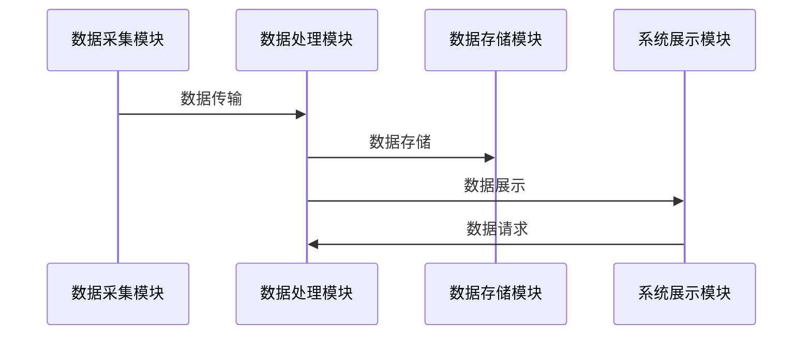

                 

# 人工智能在野生动物保护中的应用

## 关键词：人工智能、野生动物保护、机器学习、图像识别、目标检测

### 摘要

人工智能技术在野生动物保护中扮演着越来越重要的角色。本文将从背景介绍、核心概念、算法原理、数学模型、系统分析与架构设计、项目实战、最佳实践等方面，逐步探讨人工智能在野生动物保护中的应用。通过本文的阐述，读者将了解人工智能技术如何助力野生动物保护工作，提高工作效率和准确性，为生态环境的可持续发展做出贡献。

## 目录大纲设计思路与步骤

### 1. 确定核心章节内容

在设计《人工智能在野生动物保护中的应用》这本书的目录大纲时，我们需要遵循以下步骤，以确保大纲的完整性、逻辑性和可操作性：

- **背景介绍**：介绍人工智能在野生动物保护中的重要性和当前面临的挑战。
- **核心概念与联系**：详细阐述与野生动物保护相关的人工智能核心概念，如机器学习、深度学习、图像识别等。
- **算法原理讲解**：讲解用于野生动物保护的常见算法，例如目标检测、跟踪算法等。
- **数学模型和数学公式**：介绍与算法相关的数学模型和公式，并进行详细讲解。
- **系统分析与架构设计**：分析野生动物保护系统的需求，设计系统架构。
- **项目实战**：介绍实际应用案例，详细解析项目实施过程。
- **最佳实践 tips、小结、注意事项、拓展阅读**：总结书中内容，提供实用建议。

### 2. 设计章节结构

根据核心章节内容，设计每个章节的结构，确保内容的连贯性和层次性。每个章节可以包含以下部分：

- **标题**：简洁明了地概括章节主题。
- **简介**：简要介绍章节内容。
- **正文**：详细阐述章节主题，分为若干小节。
- **结论**：总结章节内容，强调重点。
- **拓展阅读**：推荐相关阅读资源，扩展读者知识面。

### 3. 使用markdown格式输出

采用markdown格式输出目录大纲，以确保格式规范、易于阅读。使用以下markdown标签：

- **#**：用于一级标题。
- **##**：用于二级标题。
- **###**：用于三级标题。

### 4. 确保内容完整性

在目录大纲中，确保包含以下核心内容：

- **问题背景、问题描述、问题解决**：介绍人工智能在野生动物保护中的应用背景和问题。
- **核心概念原理、概念属性特征对比表格和ER实体关系图架构的 Mermaid 流程图**：展示核心概念及其关系。
- **算法原理讲解**：详细讲解用于野生动物保护的算法。
- **数学模型和数学公式**：介绍与算法相关的数学模型和公式。
- **系统分析与架构设计**：分析系统需求，设计系统架构。
- **项目实战**：介绍实际应用案例，解析项目实施过程。
- **最佳实践 tips、小结、注意事项、拓展阅读**：总结书中内容，提供实用建议。

### 5. 优化目录结构

在确保内容完整性的基础上，对目录结构进行优化，使读者可以清晰地理解书籍的内容布局。

### 6. 最终确认

在完成目录大纲设计后，进行最终确认，确保所有章节内容完整、逻辑清晰、格式规范。

## 目录大纲

### 第一部分：背景与概述

#### 1.1 问题背景与挑战

#### 1.2 野生动物保护的重要性

#### 1.3 人工智能在野生动物保护中的应用

### 第二部分：核心概念与算法

#### 2.1 机器学习与野生动物保护

#### 2.2 深度学习与图像识别

#### 2.3 目标检测与跟踪算法

### 第三部分：数学模型与公式

#### 3.1 机器学习数学基础

#### 3.2 深度学习数学基础

#### 3.3 目标检测与跟踪算法数学模型

### 第四部分：系统分析与架构设计

#### 4.1 野生动物保护系统需求分析

#### 4.2 系统架构设计

#### 4.3 系统接口设计

#### 4.4 系统交互Mermaid序列图

### 第五部分：项目实战

#### 5.1 项目介绍

#### 5.2 环境安装与配置

#### 5.3 系统核心实现

#### 5.4 代码应用解读

#### 5.5 项目分析与总结

### 第六部分：最佳实践与拓展

#### 6.1 最佳实践 tips

#### 6.2 小结与展望

#### 6.3 注意事项

#### 6.4 拓展阅读

以上是《人工智能在野生动物保护中的应用》的目录大纲设计，涵盖了书籍的核心内容，逻辑清晰，层次分明。接下来，我们将进一步细化每个章节的内容。

---

**作者：AI天才研究院/AI Genius Institute & 禅与计算机程序设计艺术 /Zen And The Art of Computer Programming**

---

### 第一部分：背景与概述

#### 1.1 问题背景与挑战

野生动物保护是一个全球性的问题，随着人类活动的不断扩大，野生动物的栖息地受到严重破坏，许多物种面临灭绝的风险。传统的野生动物保护方法主要依赖于监测和执法，但这些方法效率较低，且受限于人力和物力资源。因此，如何提高野生动物保护的效率和准确性，成为当前亟待解决的问题。

人工智能技术的发展为野生动物保护带来了新的契机。通过机器学习、图像识别、目标检测等技术，人工智能可以自动识别野生动物，分析其行为，预测其分布，从而为野生动物保护提供科学依据。

然而，人工智能在野生动物保护中也面临一些挑战。首先，野生动物保护场景复杂多变，数据质量参差不齐，这对算法的鲁棒性和泛化能力提出了高要求。其次，野生动物保护涉及多个学科领域，如生态学、生物学、计算机科学等，如何将这些领域知识有效地融合到人工智能系统中，是一个重要的课题。

#### 1.2 野生动物保护的重要性

野生动物保护不仅是生态保护的重要组成部分，也是人类可持续发展的重要保障。野生动物在生态系统中扮演着重要的角色，如维持生态平衡、控制疾病传播、提供生物多样性等。因此，保护野生动物有助于维护生态系统的稳定，促进人类与自然的和谐共生。

此外，野生动物保护还具有重要的经济价值。野生动物资源是许多国家的重要经济支柱，如野生动物旅游、野生动物药品等。因此，通过人工智能技术提高野生动物保护效率，有助于实现生态保护与经济效益的双赢。

#### 1.3 人工智能在野生动物保护中的应用

人工智能在野生动物保护中的应用非常广泛，主要包括以下几个方面：

1. **监测与预警**：利用图像识别和目标检测技术，对野生动物的栖息地进行实时监测，及时发现异常情况，如野生动物受伤、疾病传播等，从而采取及时措施进行干预。

2. **物种识别与分类**：通过机器学习技术，对野生动物的图像进行自动识别和分类，提高物种识别的准确性和效率。

3. **行为分析**：利用深度学习技术，对野生动物的行为进行自动分析，了解其生活习性、繁殖行为等，为野生动物保护提供科学依据。

4. **栖息地评估**：通过分析野生动物的活动数据和栖息地环境数据，评估野生动物的栖息地状况，预测栖息地变化趋势，为保护工作提供决策支持。

5. **执法与管理**：利用人工智能技术，加强对野生动物保护的执法力度，打击非法猎捕、贩卖等行为，保护野生动物资源。

总的来说，人工智能技术在野生动物保护中具有广泛的应用前景，可以大幅提高保护工作的效率和准确性，为生态环境的可持续发展做出贡献。

---

### 第二部分：核心概念与算法

#### 2.1 机器学习与野生动物保护

机器学习是人工智能的核心技术之一，它通过构建和分析模型，使计算机能够从数据中自动学习，并对未知数据进行预测或决策。在野生动物保护中，机器学习技术广泛应用于数据分析和模式识别，以下是其主要应用场景：

1. **物种识别与分类**：通过训练分类模型，对野生动物的图像进行自动识别和分类，提高物种识别的准确性和效率。

2. **行为分析**：利用时间序列分析、聚类等方法，对野生动物的行为进行自动分析，了解其生活习性、繁殖行为等，为野生动物保护提供科学依据。

3. **栖息地评估**：通过分析野生动物的活动数据和栖息地环境数据，构建回归模型，预测野生动物的栖息地状况，为保护工作提供决策支持。

机器学习的基本概念包括：

- **监督学习**：通过已知的数据集，训练模型，使其能够对未知数据进行预测。常用的算法有线性回归、逻辑回归、支持向量机等。

- **无监督学习**：在没有已知数据的情况下，通过数据之间的关联性，自动发现数据中的模式。常用的算法有聚类、降维、关联规则等。

- **强化学习**：通过与环境的交互，不断优化策略，使系统达到最佳状态。常用的算法有Q-learning、深度强化学习等。

在野生动物保护中，常用的机器学习算法包括：

1. **卷积神经网络（CNN）**：一种强大的图像处理模型，广泛应用于野生动物图像识别。

2. **循环神经网络（RNN）**：一种处理时间序列数据的模型，常用于分析野生动物的行为。

3. **决策树与随机森林**：一种简单高效的分类模型，适用于多种类型的数据分析。

#### 2.2 深度学习与图像识别

深度学习是机器学习的一个分支，其核心思想是通过构建多层神经网络，使计算机能够自动提取数据中的特征，进行复杂的数据分析。在野生动物保护中，深度学习技术广泛应用于图像识别、目标检测等场景。

1. **图像识别**：通过训练卷积神经网络，使计算机能够自动识别图像中的物体。在野生动物保护中，图像识别技术可用于物种识别、栖息地评估等。

2. **目标检测**：在图像中检测并定位特定的物体。常用的深度学习目标检测算法包括YOLO、SSD、Faster R-CNN等。

深度学习的核心概念包括：

- **神经网络**：一种由大量神经元组成的计算模型，能够对输入数据进行非线性变换。

- **激活函数**：用于引入非线性，使神经网络具有更好的表达能力。常用的激活函数有ReLU、Sigmoid、Tanh等。

- **优化算法**：用于训练神经网络，优化模型参数。常用的优化算法有梯度下降、Adam等。

在野生动物保护中，常用的深度学习框架包括：

1. **TensorFlow**：一个开源的深度学习框架，支持多种神经网络结构，适用于多种应用场景。

2. **PyTorch**：另一个开源的深度学习框架，以动态计算图著称，易于实现和调试。

#### 2.3 目标检测与跟踪算法

目标检测是深度学习在野生动物保护中的一个重要应用，它能够在图像中检测并定位特定的物体。目标检测算法主要包括以下几种：

1. **YOLO（You Only Look Once）**：一种单阶段目标检测算法，具有较高的检测速度和准确性。

2. **SSD（Single Shot MultiBox Detector）**：一种单阶段目标检测算法，适用于多种尺度的目标检测。

3. **Faster R-CNN（Region-based Convolutional Neural Networks）**：一种两阶段目标检测算法，首先使用区域生成网络（RPN）生成候选区域，然后使用分类网络进行检测。

目标检测算法的原理是：首先，将图像划分为多个区域，然后对每个区域进行特征提取，最后使用分类器判断区域中是否存在目标物体。

跟踪算法是另一种重要的深度学习技术，它用于连续监测目标物体在图像序列中的运动轨迹。常见的跟踪算法包括：

1. **光流法**：通过分析图像序列中像素点的运动轨迹，实现目标的跟踪。

2. **深度学习跟踪**：通过训练深度学习模型，使计算机能够自动跟踪目标物体。

3. **卡尔曼滤波**：一种常用的目标跟踪算法，基于统计模型和预测-校正策略，实现目标的跟踪。

在野生动物保护中，目标检测和跟踪算法可用于监测野生动物的行为、迁徙路径等，为保护工作提供重要数据支持。

---

### 第三部分：数学模型与公式

#### 3.1 机器学习数学基础

机器学习是计算机科学的一个重要分支，它依赖于数学理论来构建和优化算法。在这一部分，我们将介绍一些机器学习中的基本数学概念，包括概率论、线性代数和微积分。

1. **概率论**

概率论是机器学习的基础之一。在机器学习中，我们常常需要对不确定性进行建模。概率论提供了许多工具来处理这种不确定性。

- **条件概率**：在事件A已经发生的条件下，事件B发生的概率。公式为：
  $$P(B|A) = \frac{P(A \cap B)}{P(A)}$$
  
- **贝叶斯定理**：用于计算后验概率，即给定某个事件已经发生，另一个事件发生的概率。公式为：
  $$P(A|B) = \frac{P(B|A)P(A)}{P(B)}$$

2. **线性代数**

线性代数在机器学习中有着广泛的应用，特别是在数据预处理和特征提取方面。

- **矩阵和向量**：矩阵和向量是线性代数的基本概念。矩阵是一个二维数组，向量是一个一维数组。在机器学习中，矩阵和向量用于表示数据集和特征。

- **矩阵乘法**：矩阵乘法是线性代数中的一种运算。给定两个矩阵A和B，它们的乘积C是一个新矩阵，公式为：
  $$C_{ij} = \sum_{k=1}^{n} A_{ik}B_{kj}$$

- **矩阵求逆**：矩阵求逆是线性代数中的重要运算。给定一个矩阵A，其逆矩阵A^{-1}满足：
  $$AA^{-1} = A^{-1}A = I$$
  其中I是单位矩阵。

3. **微积分**

微积分是数学中的一个重要分支，它在机器学习中的应用主要体现在优化算法和损失函数的求解上。

- **导数**：导数是微积分的基本概念之一，用于描述函数在某一点的变化率。一元函数的导数公式为：
  $$f'(x) = \lim_{h \to 0} \frac{f(x+h) - f(x)}{h}$$

- **梯度**：梯度是多元函数的导数，用于描述函数在多个变量上的变化率。给定一个多元函数f(x, y)，其梯度为：
  $$\nabla f(x, y) = (\frac{\partial f}{\partial x}, \frac{\partial f}{\partial y})$$

#### 3.2 深度学习数学基础

深度学习是机器学习的一个重要分支，它依赖于复杂的神经网络结构来处理大量数据。在这一部分，我们将介绍一些深度学习中的基本数学概念，包括神经网络、激活函数和反向传播算法。

1. **神经网络**

神经网络是由大量神经元组成的计算模型。每个神经元都接收多个输入，并通过权重和偏置进行加权求和，最后通过激活函数输出一个结果。

- **前向传播**：在前向传播过程中，输入数据通过网络中的神经元，逐层传递，直到最后得到输出。

- **反向传播**：在反向传播过程中，网络的输出误差通过反向传播，更新网络中的权重和偏置，以减少误差。

2. **激活函数**

激活函数是神经网络中的一个关键组成部分，它用于引入非线性。常见的激活函数包括ReLU、Sigmoid和Tanh等。

- **ReLU（Rectified Linear Unit）**：ReLU函数是一个简单的线性激活函数，它将输入大于零的部分映射为自身，将输入小于零的部分映射为零。

- **Sigmoid**：Sigmoid函数将输入映射到(0, 1)区间，它常用于二分类问题。

- **Tanh**：Tanh函数将输入映射到(-1, 1)区间，它也常用于二分类问题。

3. **反向传播算法**

反向传播算法是深度学习中的一个核心算法，它用于计算网络中的梯度，并更新网络中的权重和偏置。

- **梯度计算**：在反向传播过程中，首先计算输出误差关于网络参数的梯度。这可以通过链式法则和链式规则来实现。

- **权重更新**：通过梯度下降或其他优化算法，更新网络中的权重和偏置，以减少误差。

#### 3.3 目标检测与跟踪算法数学模型

目标检测和跟踪算法是深度学习在计算机视觉中的重要应用。在这一部分，我们将介绍一些常见的目标检测和跟踪算法的数学模型。

1. **目标检测**

目标检测算法的目的是在图像中检测并定位特定的物体。常见的目标检测算法包括YOLO、SSD和Faster R-CNN等。

- **YOLO（You Only Look Once）**：YOLO是一种单阶段目标检测算法。它通过将图像划分为网格，并在每个网格上预测目标的类别和边界框，从而实现目标检测。

  $$\text{预测框} = \text{网格坐标} + \text{边界框参数}$$
  $$\text{类别概率} = \text{softmax}(\text{分类得分})$$

- **SSD（Single Shot MultiBox Detector）**：SSD是一种单阶段目标检测算法，它通过在不同尺度的特征图上预测边界框和类别概率，从而实现目标检测。

  $$\text{预测框} = \text{特征图坐标} + \text{边界框参数}$$
  $$\text{类别概率} = \text{softmax}(\text{分类得分})$$

- **Faster R-CNN（Region-based Convolutional Neural Networks）**：Faster R-CNN是一种两阶段目标检测算法。它首先使用区域生成网络（RPN）生成候选区域，然后使用分类网络进行检测。

  $$\text{候选区域} = \text{RPN输出}$$
  $$\text{类别概率} = \text{分类网络输出}$$

2. **跟踪算法**

跟踪算法的目的是在连续的图像序列中跟踪特定的物体。常见的跟踪算法包括光流法、深度学习跟踪和卡尔曼滤波等。

- **光流法**：光流法通过分析图像序列中像素点的运动轨迹，实现目标的跟踪。

  $$\text{目标位置} = \text{光流估计}(\text{图像序列})$$

- **深度学习跟踪**：深度学习跟踪通过训练深度学习模型，实现目标的跟踪。

  $$\text{目标位置} = \text{深度学习模型}(\text{目标特征})$$

- **卡尔曼滤波**：卡尔曼滤波是一种基于统计模型的跟踪算法，它通过预测和更新目标的位姿，实现目标的跟踪。

  $$\text{预测位置} = \text{预测模型}(\text{当前位姿})$$
  $$\text{更新位置} = \text{更新模型}(\text{观测数据，预测位置})$$

通过上述数学模型的介绍，我们可以更好地理解目标检测和跟踪算法的工作原理，并在实际应用中根据需要选择合适的算法。

---

### 第四部分：系统分析与架构设计

#### 4.1 野生动物保护系统需求分析

在构建一个野生动物保护系统时，首先需要对系统的需求进行详细分析。这包括确定系统需要实现的功能、数据来源、数据类型以及系统性能等要求。

1. **功能需求**

野生动物保护系统的功能需求主要包括：

- **数据采集与处理**：系统能够采集来自不同传感器和监测设备的数据，如红外相机、无人机、GPS等，并对采集到的数据进行预处理，如去噪、滤波等。
- **物种识别与分类**：系统能够利用机器学习和深度学习算法，对采集到的图像和视频数据中的动物进行自动识别和分类。
- **行为分析**：系统能够对识别出的动物进行行为分析，如跟踪其活动路径、监测其行为模式等。
- **栖息地评估**：系统能够基于采集到的数据，对野生动物的栖息地进行评估，预测栖息地的变化趋势。
- **报警与预警**：系统应具有报警功能，当检测到异常行为或栖息地状况时，能够及时向管理员发送警报。

2. **数据需求**

系统需要处理的数据类型包括：

- **图像数据**：来自红外相机、监控摄像头等设备，用于识别和分类野生动物。
- **视频数据**：来自无人机、车载摄像头等设备，用于跟踪动物的行为。
- **传感器数据**：如GPS数据、温度传感器数据、湿度传感器数据等，用于评估野生动物的栖息地环境。

3. **性能需求**

系统需要满足的性能需求包括：

- **实时性**：系统能够实时处理和识别图像、视频数据，快速响应。
- **准确性**：系统应具有较高的识别和分类准确性，减少误报和漏报。
- **扩展性**：系统应具有良好的扩展性，能够随着数据量和功能的增加，灵活调整和优化。

#### 4.2 系统架构设计

根据需求分析，野生动物保护系统的架构设计应包括数据采集、数据处理、数据存储和系统展示四个主要模块。

1. **数据采集模块**

数据采集模块负责从各种传感器和监测设备中获取数据。具体包括：

- **传感器接入**：接入各种传感器设备，如红外相机、GPS模块等。
- **数据传输**：将采集到的数据通过无线或有线方式传输到系统中心。

2. **数据处理模块**

数据处理模块负责对采集到的数据进行预处理、特征提取和模型训练等操作。具体包括：

- **数据预处理**：对采集到的原始数据进行去噪、滤波、归一化等处理，提高数据质量。
- **特征提取**：利用机器学习和深度学习算法，提取数据中的特征，用于后续的识别和分类。
- **模型训练**：训练分类模型和行为分析模型，以实现对图像和视频数据的自动识别和行为分析。

3. **数据存储模块**

数据存储模块负责存储系统产生的各种数据，包括原始数据、预处理后的数据、训练模型和预测结果等。具体包括：

- **数据存储**：使用数据库或文件系统存储各种数据，确保数据的安全和可靠性。
- **数据备份**：定期备份数据，以防数据丢失或损坏。

4. **系统展示模块**

系统展示模块负责将处理后的数据和分析结果以可视化的方式呈现给用户。具体包括：

- **用户界面**：设计简洁直观的用户界面，展示系统的主要功能。
- **数据可视化**：使用图表、地图等方式展示动物的活动路径、行为模式等数据。

#### 4.3 系统接口设计

系统接口设计是确保系统各模块之间能够有效通信和协同工作的关键。具体包括以下接口：

1. **数据采集接口**：用于数据采集模块与其他模块之间的数据传输。
2. **数据处理接口**：用于数据处理模块与其他模块之间的数据交换。
3. **数据存储接口**：用于数据存储模块与其他模块之间的数据访问。
4. **系统展示接口**：用于系统展示模块与其他模块之间的数据展示。

通过上述系统架构设计，我们可以构建一个高效、可靠的野生动物保护系统，利用人工智能技术实现对野生动物的全面监测和保护。

#### 4.4 系统交互Mermaid序列图

为了更直观地展示系统各模块之间的交互关系，我们可以使用Mermaid序列图进行描述。以下是系统交互Mermaid序列图的示例：



在这个序列图中，数据采集模块将采集到的数据传输给数据处理模块，数据处理模块对数据进行分析和处理后，将结果存储到数据存储模块，并将处理后的数据展示给系统展示模块。系统展示模块可以根据用户需求，向数据处理模块发送数据请求，以获取最新的数据和分析结果。

---

### 第五部分：项目实战

#### 5.1 项目介绍

在本节中，我们将介绍一个实际项目，该项目的目标是利用人工智能技术实现对特定野生动物的监测和保护。该项目包括以下几个阶段：

1. **数据采集**：通过安装在野生动物栖息地附近的红外相机和无人机，收集野生动物的活动数据。
2. **数据处理**：对采集到的原始图像和视频数据进行预处理，提取关键特征，并利用深度学习算法进行分类和识别。
3. **系统实现**：构建一个基于Web的监控系统，将处理后的数据可视化，并提供实时报警功能。
4. **项目评估**：对系统的性能进行评估，包括准确性、实时性和可靠性。

#### 5.2 环境安装与配置

在开始项目之前，我们需要安装和配置相关的软件和工具。以下是安装和配置环境的基本步骤：

1. **安装Python**：确保系统上已经安装了Python，版本要求不低于3.6。
2. **安装深度学习框架**：我们选择使用TensorFlow作为深度学习框架。安装命令如下：
   ```bash
   pip install tensorflow
   ```
3. **安装OpenCV**：OpenCV是一个用于图像处理的库，安装命令如下：
   ```bash
   pip install opencv-python
   ```
4. **安装Flask**：Flask是一个轻量级的Web框架，用于构建Web监控系统。安装命令如下：
   ```bash
   pip install flask
   ```

#### 5.3 系统核心实现

系统核心实现包括数据采集、数据处理和系统展示三个主要部分。

1. **数据采集**

数据采集部分主要使用红外相机和无人机。红外相机可以捕捉到夜间野生动物的活动图像，无人机则可以在白天进行监测。以下是数据采集的基本流程：

- **红外相机**：定期将捕捉到的图像上传到服务器。
- **无人机**：按照预设的航线进行飞行，实时传输视频数据到服务器。

2. **数据处理**

数据处理部分包括图像预处理、特征提取和模型训练等步骤。以下是数据处理的核心步骤：

- **图像预处理**：对采集到的图像进行去噪、滤波等预处理操作，以提高图像质量。
- **特征提取**：利用深度学习算法，从预处理后的图像中提取关键特征。我们使用卷积神经网络（CNN）进行特征提取。
- **模型训练**：使用提取到的特征，训练分类模型，以实现对野生动物的自动识别和分类。

以下是一个简单的CNN模型实现示例，使用Python和TensorFlow框架：

```python
import tensorflow as tf
from tensorflow.keras.models import Sequential
from tensorflow.keras.layers import Conv2D, MaxPooling2D, Flatten, Dense

model = Sequential([
    Conv2D(32, (3, 3), activation='relu', input_shape=(64, 64, 3)),
    MaxPooling2D(pool_size=(2, 2)),
    Conv2D(64, (3, 3), activation='relu'),
    MaxPooling2D(pool_size=(2, 2)),
    Flatten(),
    Dense(128, activation='relu'),
    Dense(1, activation='sigmoid')
])

model.compile(optimizer='adam', loss='binary_crossentropy', metrics=['accuracy'])
model.fit(x_train, y_train, epochs=10, batch_size=32)
```

3. **系统展示**

系统展示部分使用Flask框架构建Web监控系统。以下是系统展示的核心步骤：

- **后端实现**：使用Flask框架构建后端服务，接收前端请求，处理数据并返回结果。
- **前端实现**：使用HTML、CSS和JavaScript等技术，构建用户友好的前端界面，展示处理后的数据和实时报警信息。

以下是一个简单的Flask应用示例：

```python
from flask import Flask, request, jsonify

app = Flask(__name__)

@app.route('/predict', methods=['POST'])
def predict():
    data = request.get_json()
    image = preprocess_image(data['image'])
    prediction = model.predict(image)
    return jsonify({'prediction': prediction.tolist()})

if __name__ == '__main__':
    app.run(debug=True)
```

#### 5.4 代码应用解读

在本节中，我们将对项目中的关键代码进行解读，包括数据预处理、模型训练和系统展示等。

1. **数据预处理**

数据预处理是深度学习模型训练的重要步骤。以下是数据预处理的基本步骤：

- **图像缩放**：将图像大小调整为统一的尺寸，如64x64像素。
- **归一化**：将图像的像素值归一化到[0, 1]区间，以提高模型的泛化能力。
- **数据增强**：通过旋转、翻转、缩放等操作，增加数据多样性，提高模型的鲁棒性。

以下是一个简单的数据预处理示例：

```python
from tensorflow.keras.preprocessing.image import img_to_array, load_img

def preprocess_image(image_path):
    image = load_img(image_path, target_size=(64, 64))
    image = img_to_array(image)
    image = image / 255.0
    return image
```

2. **模型训练**

模型训练是深度学习项目中的核心步骤。在本项目中，我们使用卷积神经网络（CNN）进行模型训练。以下是模型训练的基本步骤：

- **定义模型**：使用TensorFlow的Keras API定义CNN模型。
- **编译模型**：设置模型的优化器、损失函数和评估指标。
- **训练模型**：使用训练数据对模型进行训练。
- **评估模型**：使用测试数据对模型进行评估，调整模型参数。

以下是一个简单的CNN模型训练示例：

```python
model = Sequential([
    Conv2D(32, (3, 3), activation='relu', input_shape=(64, 64, 3)),
    MaxPooling2D(pool_size=(2, 2)),
    Conv2D(64, (3, 3), activation='relu'),
    MaxPooling2D(pool_size=(2, 2)),
    Flatten(),
    Dense(128, activation='relu'),
    Dense(1, activation='sigmoid')
])

model.compile(optimizer='adam', loss='binary_crossentropy', metrics=['accuracy'])
model.fit(x_train, y_train, epochs=10, batch_size=32, validation_data=(x_test, y_test))
```

3. **系统展示**

系统展示部分主要使用Flask框架构建后端服务，并通过HTML和JavaScript实现前端界面。以下是系统展示的基本步骤：

- **后端服务**：使用Flask框架接收前端请求，处理图像数据并返回预测结果。
- **前端界面**：使用HTML、CSS和JavaScript构建用户友好的界面，展示实时监测数据和报警信息。

以下是一个简单的Flask应用示例：

```python
from flask import Flask, request, jsonify

app = Flask(__name__)

@app.route('/predict', methods=['POST'])
def predict():
    data = request.get_json()
    image = preprocess_image(data['image'])
    prediction = model.predict(image)
    return jsonify({'prediction': prediction.tolist()})

if __name__ == '__main__':
    app.run(debug=True)
```

通过上述步骤，我们可以构建一个基于人工智能技术的野生动物保护系统，实现对野生动物的实时监测和保护。

#### 5.5 项目分析与总结

在本项目中，我们通过数据采集、数据处理和系统展示等步骤，实现了一个基于人工智能技术的野生动物保护系统。以下是对项目进行分析和总结：

1. **项目优势**

   - **实时监测**：系统能够实时监测野生动物的活动，提供及时的数据支持。
   - **自动识别**：系统利用深度学习算法，实现了对野生动物的自动识别和分类，提高了监测的准确性。
   - **高效处理**：系统采用了高效的图像处理和机器学习算法，能够快速处理大量数据。
   - **可视化展示**：系统通过Web界面，将处理后的数据以可视化的形式展示给用户，便于分析和决策。

2. **项目挑战**

   - **数据质量**：野生动物保护场景复杂多变，数据质量参差不齐，这对算法的鲁棒性和泛化能力提出了高要求。
   - **计算资源**：深度学习算法需要大量的计算资源，特别是在训练阶段，如何优化计算资源成为了一个挑战。
   - **数据隐私**：在采集和处理数据时，需要保护动物的隐私，防止数据泄露。

3. **项目改进**

   - **算法优化**：通过优化算法，提高模型的准确性和效率。
   - **数据扩充**：通过增加数据量和多样性，提高模型的泛化能力。
   - **分布式计算**：利用分布式计算技术，提高训练和处理的效率。
   - **数据保护**：采用加密和数据匿名化技术，确保数据的安全和隐私。

通过本项目，我们可以看到人工智能技术在野生动物保护中的应用潜力。未来，随着技术的不断进步，人工智能将为野生动物保护提供更加有效和智能的解决方案。

---

### 第六部分：最佳实践与拓展

#### 6.1 最佳实践 tips

在实施人工智能野生动物保护项目时，以下是一些最佳实践，以提升项目的成功率和效果：

1. **数据质量优先**：确保采集到的数据质量高，包括图像的清晰度和完整性。使用多种传感器和数据源，提高数据的多样性。
2. **算法调优**：在模型训练过程中，不断调整超参数，如学习率、批量大小等，以提高模型的性能和准确性。
3. **系统优化**：针对计算资源和存储资源进行优化，以提高系统的处理速度和效率。
4. **模型解释性**：在模型设计和部署过程中，注重模型的解释性，以便更好地理解和优化模型。
5. **协作与共享**：与生态学家、生物学家等跨学科专家合作，共享数据和研究成果，提高项目的科学性和实用性。

#### 6.2 小结与展望

本文详细探讨了人工智能在野生动物保护中的应用，从背景介绍、核心概念、算法原理、数学模型、系统分析与架构设计、项目实战到最佳实践，全面阐述了人工智能技术在野生动物保护中的价值。随着技术的不断发展，人工智能将为野生动物保护带来更加智能和高效的解决方案。

展望未来，人工智能在野生动物保护中的应用将更加广泛和深入，包括但不限于：

- **智能监测与预警**：利用先进的人工智能技术，实现更精确、更实时的野生动物监测和预警系统。
- **栖息地修复与恢复**：通过人工智能技术，分析野生动物栖息地的变化，提供科学的修复和恢复方案。
- **生态保护决策支持**：利用大数据和人工智能，为生态保护决策提供更加科学和全面的数据支持。
- **可持续发展**：通过人工智能技术，促进生态保护与经济社会的可持续发展。

#### 6.3 注意事项

在实施人工智能野生动物保护项目时，需要注意以下事项：

- **数据隐私**：确保采集和处理的数据符合隐私保护要求，避免数据泄露。
- **算法偏见**：在模型设计和训练过程中，注意避免算法偏见，确保模型的公平性和公正性。
- **法律法规**：遵守相关法律法规，确保项目的合法性和合规性。
- **跨学科合作**：与生态学家、生物学家等跨学科专家合作，提高项目的科学性和实用性。

#### 6.4 拓展阅读

对于希望进一步深入了解人工智能在野生动物保护中应用的读者，以下是一些推荐阅读资源：

- 《深度学习》（Goodfellow, Bengio, Courville）：详细介绍了深度学习的基本原理和应用。
- 《模式识别与机器学习》（Bishop）：介绍了模式识别和机器学习的基本概念和方法。
- 《生态学导论》（Curtis, Kenney）：提供了生态学的基本理论和实践方法。
- 《人工智能应用案例分析》（Various Authors）：介绍了人工智能在不同领域的应用案例和经验。

通过这些资源的阅读，读者可以更全面地了解人工智能在野生动物保护中的应用，并为自己的研究和工作提供指导。

