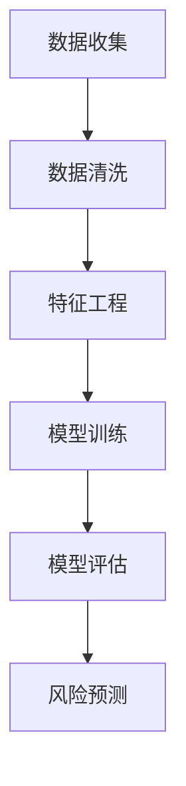
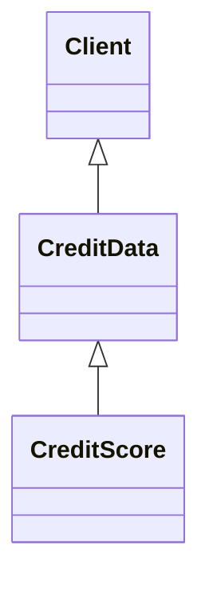
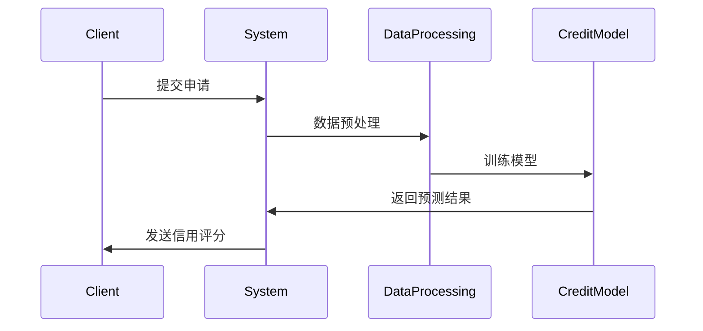
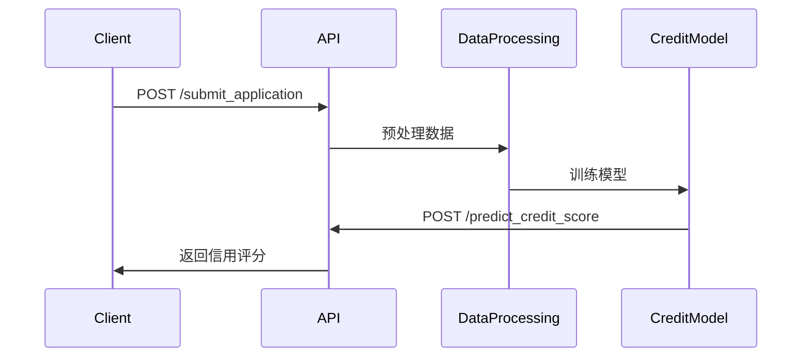

                 


### 文章标题：人工智能在金融领域的应用：风险管理与普惠金融

#### 关键词：人工智能、金融、风险管理、普惠金融、算法、Python、Mermaid、LaTeX

> 摘要：本文深入探讨了人工智能在金融领域，特别是在风险管理及普惠金融中的应用。通过逐步分析，本文揭示了人工智能如何改变金融行业，提高风险管理效率和普惠金融的可及性。文章还提供了具体案例，展示了人工智能在实践中的有效应用。

----------------------------------------------------------------

# 人工智能在金融领域的应用：风险管理与普惠金融

## 引言

随着科技的飞速发展，人工智能（AI）已经成为金融行业的一股强大推动力。从风险管理的自动化到普惠金融的普及，人工智能正逐步改变金融行业的面貌。本篇博客将带领您深入探讨人工智能在金融领域的应用，重点关注其在风险管理和普惠金融方面的作用。

### 1.1 人工智能、风险管理与普惠金融概述

#### 1.1.1 人工智能的概念与发展历程

人工智能是指由计算机系统实现的智能行为，旨在模拟人类思维过程。自1950年代以来，人工智能经历了多个发展阶段，从最初的符号主义到基于数据驱动的方法，再到当前的热门领域——深度学习。随着计算能力和数据资源的不断提升，人工智能技术逐渐成熟，并在各行各业中得到了广泛应用。

#### 1.1.2 金融领域中的风险管理

风险管理是金融行业的核心任务之一，旨在识别、评估、监控和降低潜在风险，以确保金融体系的稳定运行。传统风险管理方法主要依赖于统计模型和专家判断，但随着金融市场复杂性的增加，传统方法逐渐暴露出局限性。人工智能技术的引入，为风险管理带来了新的工具和方法。

#### 1.1.3 普惠金融的意义与挑战

普惠金融是指确保所有人，特别是弱势群体，能够以合理的价格获得金融产品和服务。普惠金融对于促进经济发展和社会稳定具有重要意义，但实现普惠金融面临着诸多挑战，如金融服务的可及性、成本和风险等。人工智能技术为解决这些问题提供了新的可能性。

### 1.2 本书结构与内容安排

本文将分为五个部分：引言、人工智能在金融领域的应用概述、风险管理相关的人工智能技术、普惠金融与人工智能结合的案例研究、未来展望与挑战。每个部分都将详细探讨人工智能在金融领域的具体应用，以帮助读者全面了解人工智能在金融行业的变革力量。

## 人工智能在金融领域的应用概述

### 2.1 人工智能在金融行业的应用趋势

#### 2.1.1 人工智能在金融行业中的应用现状

目前，人工智能在金融行业已经得到了广泛应用。从智能投顾、自动化交易到反欺诈系统，人工智能技术正在不断改变金融服务的模式。此外，人工智能还在信用评估、贷款审批、风险评估等领域发挥着重要作用。

#### 2.1.2 人工智能助力金融创新的未来展望

随着技术的不断进步，人工智能在金融行业的应用将更加深入和广泛。未来，人工智能有望在更复杂的金融任务中发挥关键作用，如量化交易、智能合约、区块链等。这些创新将推动金融行业的数字化转型，提高金融服务的效率和透明度。

### 2.2 人工智能技术在金融领域的分类

#### 2.2.1 机器学习与数据分析

机器学习是人工智能的核心技术之一，通过训练模型来识别数据中的模式和规律。在金融领域，机器学习技术被广泛应用于风险预测、市场分析、客户行为分析等任务。数据分析是机器学习的基础，通过对大量金融数据进行挖掘和分析，可以帮助金融机构发现潜在的商业机会和风险。

#### 2.2.2 深度学习在金融风控中的应用

深度学习是一种复杂的机器学习模型，通过模拟人脑神经网络进行学习。在金融风控领域，深度学习技术被用于检测欺诈行为、预测市场走势、评估信用风险等任务。深度学习具有强大的特征提取和模式识别能力，能够处理复杂的金融数据。

#### 2.2.3 自然语言处理与金融文本分析

自然语言处理（NLP）是人工智能的一个重要分支，旨在使计算机能够理解和处理人类语言。在金融领域，NLP技术被用于分析金融报告、新闻文章、社交媒体等文本数据，以提取有价值的信息。这些信息可以帮助金融机构进行市场预测、风险分析和客户服务。

### 2.3 人工智能技术在金融领域的关键挑战

#### 2.3.1 技术挑战

人工智能技术在金融领域的应用面临着一系列技术挑战，如数据隐私、算法透明度和模型解释性等。数据隐私是金融行业最为关注的问题之一，如何确保客户数据的安全性和隐私性，是金融科技公司需要解决的关键问题。算法透明度和解释性也是人工智能在金融领域应用的重要挑战，特别是在风险管理等关键领域，算法的透明度和解释性对于决策的可靠性至关重要。

#### 2.3.2 道德与法律挑战

人工智能在金融领域的应用也引发了一系列道德和法律问题。例如，算法歧视、公平性和道德责任等。如何确保人工智能系统不会对特定群体产生歧视，以及如何明确算法和开发者的责任，是金融行业需要面对的道德和法律挑战。

## 风险管理相关的人工智能技术

### 3.1 风险评估与预测模型

#### 3.1.1 传统风险评估方法

传统的风险评估方法主要依赖于统计模型和专家判断。这些方法通过对历史数据进行统计分析，来预测未来的风险。然而，随着金融市场的复杂性和波动性的增加，传统方法逐渐暴露出局限性。

#### 3.1.2 基于人工智能的风险评估模型

基于人工智能的风险评估模型通过机器学习和深度学习技术，可以更好地处理复杂的金融数据，提供更准确的风险预测。这些模型可以从大量数据中提取关键特征，识别潜在的风险信号，为金融机构提供更全面的风险评估。

#### 3.1.3 风险预测的mermaid流程图



### 3.2 模型解释性与透明度

#### 3.2.1 模型解释性的重要性

模型解释性是指模型决策过程的可理解性。在风险管理等关键领域，模型解释性对于确保决策的可靠性至关重要。如果模型无法解释，将导致决策的不透明，增加错误决策的风险。

#### 3.2.2 增强模型透明度的方法

为了增强模型透明度，可以采用以下方法：
- 模型可视化：使用图表和图形来展示模型的内部结构和决策过程。
- 模型分解：将复杂模型分解为多个简单模块，提高模型的透明度。
- 解释性算法：使用专门的算法，如决策树、规则提取等，来生成可解释的模型。

### 3.3 人工智能在信用评分中的应用

#### 3.3.1 信用评分的传统方法

传统的信用评分方法主要基于客户的信用历史、收入水平、债务水平等定量信息。然而，这些方法往往无法全面反映客户的信用状况，容易导致评分不准确。

#### 3.3.2 基于人工智能的信用评分模型

基于人工智能的信用评分模型通过机器学习和深度学习技术，可以从大量数据中提取更多有价值的特征，提供更准确的信用评分。这些模型可以处理非结构化数据，如社交媒体信息、交易记录等，从而更全面地了解客户的信用状况。

#### 3.3.3 实际案例分析与讲解

以某金融机构的信用评分模型为例，该模型使用了多种人工智能技术，包括深度学习和自然语言处理。通过分析客户的信用历史、交易记录、社交媒体信息等数据，模型能够准确预测客户的信用风险。实际案例分析显示，该模型在信用评分的准确性方面显著优于传统方法。

## 普惠金融与人工智能结合的案例研究

### 4.1 农村金融服务与人工智能

#### 4.1.1 农村金融服务的现状与挑战

农村金融服务是普惠金融的重要组成部分，但受限于地理位置、基础设施等因素，农村金融服务面临着诸多挑战。传统金融服务在农村地区难以覆盖，导致农村居民难以获得贷款和金融服务。

#### 4.1.2 人工智能在农业金融中的应用

人工智能技术为农村金融服务提供了新的解决方案。通过大数据分析和机器学习技术，金融机构可以更准确地评估农村居民的风险状况，提供更灵活的贷款方案。此外，人工智能还可以用于农业保险、农产品价格预测等领域，提高农村金融服务的效率和可及性。

#### 4.1.3 成功案例分享

以某农业银行在农村地区的贷款业务为例，该银行使用了人工智能技术来评估农村居民的信用风险。通过分析客户的信用历史、交易记录、社交媒体信息等数据，银行能够提供更个性化的贷款方案。实际案例显示，该银行在农村地区的贷款申请通过率显著提高，为农村居民提供了更多金融支持。

### 4.2 普惠金融与大数据分析

#### 4.2.1 大数据在普惠金融中的作用

大数据技术为普惠金融的发展提供了强有力的支持。通过收集和分析海量数据，金融机构可以更全面地了解客户需求，提供更精准的金融服务。大数据技术还可以用于风险评估、市场预测、客户行为分析等任务，提高金融服务的效率和准确性。

#### 4.2.2 人工智能与普惠金融的结合点

人工智能与大数据技术的结合，为普惠金融提供了新的发展机遇。人工智能可以从大数据中提取更多有价值的信息，提供更准确的预测和分析结果。这些结果可以帮助金融机构更好地了解客户需求，设计更符合客户需求的金融产品和服务。

#### 4.2.3 实际应用案例

以某互联网金融平台为例，该平台使用了人工智能和大数据技术来提供普惠金融服务。通过分析客户的消费行为、信用记录、社交媒体信息等数据，平台能够提供个性化的贷款方案，满足客户的多样化需求。实际应用显示，该平台的贷款申请通过率显著提高，为更多弱势群体提供了金融服务。

### 4.3 微型金融机构与人工智能

#### 4.3.1 微型金融机构的发展与挑战

微型金融机构是为小型企业和个体经营者提供金融服务的机构。然而，由于客户规模小、风险较高，微型金融机构面临着融资难、成本高等挑战。

#### 4.3.2 人工智能在微型金融中的应用

人工智能技术为微型金融机构提供了新的解决方案。通过机器学习和大数据分析技术，微型金融机构可以更准确地评估客户的风险状况，提供更灵活的贷款方案。此外，人工智能还可以用于风险管理、客户服务、市场推广等任务，提高微型金融机构的效率和竞争力。

#### 4.3.3 微型金融的AI解决方案

以某微型金融机构为例，该机构使用了人工智能技术来提升风险管理能力。通过分析客户的交易记录、信用历史、社交网络数据等，机构能够更准确地评估客户的风险状况，提供更合理的贷款方案。实际应用显示，该机构的贷款违约率显著降低，为微型企业提供了更多融资支持。

## 未来展望与挑战

### 5.1 人工智能在金融领域的未来发展

#### 5.1.1 技术创新方向

未来，人工智能在金融领域的应用将更加深入和广泛。技术创新方向包括：
- 深度学习与强化学习的结合：利用深度学习进行特征提取，结合强化学习进行决策优化，提高金融模型的智能水平。
- 区块链与人工智能的结合：利用区块链的分布式账本技术，实现金融交易的自动化和透明化。
- 量子计算与人工智能的结合：利用量子计算的高性能优势，加速人工智能模型的训练和优化。

#### 5.1.2 金融市场的变革趋势

随着人工智能技术的不断进步，金融市场将迎来一系列变革趋势：
- 金融服务智能化：人工智能将取代部分人工操作，提高金融服务的效率和质量。
- 风险管理精细化：人工智能将帮助金融机构更准确地识别和评估风险，降低风险敞口。
- 金融监管智能化：人工智能将用于监测金融市场的异常交易，提高金融监管的效率。

### 5.2 风险管理与普惠金融的可持续发展

#### 5.2.1 风险管理的未来挑战

未来，风险管理将面临以下挑战：
- 数据隐私和安全：随着数据量的增加，如何确保数据的安全性和隐私性，将是一个重要挑战。
- 模型解释性：随着模型的复杂度增加，如何确保模型的可解释性，以便于监管和决策。
- 技术伦理：如何确保人工智能在金融领域的应用符合伦理标准，避免对特定群体产生歧视。

#### 5.2.2 普惠金融的可持续发展路径

普惠金融的可持续发展路径包括：
- 技术创新与政策支持：通过技术创新和政策支持，提高金融服务的可及性和可持续性。
- 公共—私营合作：政府与金融机构合作，共同推动普惠金融的发展。
- 跨界合作：金融机构之间、金融机构与科技公司的合作，共同探索普惠金融的新模式。

### 5.3 政策建议与未来方向

为了推动人工智能在金融领域的可持续发展，本文提出以下政策建议：
- 加大对人工智能在金融领域研究的投入，支持技术创新。
- 制定相关法律法规，确保数据的安全和隐私。
- 推动公共—私营合作，共同推进普惠金融的发展。
- 建立透明、公正的监管机制，确保人工智能在金融领域的公平应用。

## 附录

### A. 人工智能与金融领域的相关术语

- **人工智能（AI）**：指由计算机系统实现的智能行为，旨在模拟人类思维过程。
- **风险管理**：指识别、评估、监控和降低潜在风险，以确保金融体系的稳定运行。
- **普惠金融**：指确保所有人，特别是弱势群体，能够以合理的价格获得金融产品和服务。

### B. 人工智能在金融领域应用的技术栈

- **机器学习**：用于构建和训练预测模型，处理复杂数据分析任务。
- **深度学习**：一种复杂的机器学习模型，通过模拟人脑神经网络进行学习。
- **自然语言处理（NLP）**：用于理解和处理人类语言的技术。

### C. 普惠金融与人工智能的结合点分析

- **信用评估**：利用人工智能技术进行客户信用评分，提高风险评估的准确性。
- **风险预测**：通过大数据分析和机器学习技术，预测金融市场的走势和风险。
- **客户服务**：利用人工智能技术提供个性化的客户服务，提高客户满意度。

### D. 拓展阅读与参考文献

- **参考文献**：
  - [1] Goodfellow, I., Bengio, Y., & Courville, A. (2016). *Deep Learning*. MIT Press.
  - [2] Russell, S., & Norvig, P. (2016). *Artificial Intelligence: A Modern Approach*. Prentice Hall.
  - [3] Jordan, M. I. (2015). *Deep Learning*. Cambridge University Press.

### 作者信息

**作者：AI天才研究院/AI Genius Institute & 禅与计算机程序设计艺术 /Zen And The Art of Computer Programming**

本文由AI天才研究院撰写，旨在探讨人工智能在金融领域的应用，推动金融行业的创新与发展。作者对人工智能和金融领域的深刻理解，使得本文内容丰富、见解独到。希望本文能够为读者提供有价值的参考和启示。

----------------------------------------------------------------

本文为《人工智能在金融领域的应用：风险管理与普惠金融》的博客文章，涵盖了人工智能在金融领域的应用背景、具体应用案例、未来发展趋势和挑战等多个方面。文章结构清晰，内容丰富，通过详细的分析和实例讲解，使读者能够全面了解人工智能在金融领域的变革力量。

文章首先介绍了人工智能、风险管理和普惠金融的基本概念，为后续内容打下了基础。随后，文章详细探讨了人工智能在金融领域的应用现状和趋势，包括机器学习、深度学习和自然语言处理等技术的应用。在风险管理方面，文章介绍了传统风险评估方法与基于人工智能的风险评估模型的对比，并通过mermaid流程图展示了风险预测的流程。在普惠金融方面，文章分析了农村金融服务、大数据分析和微型金融机构与人工智能的结合点，并分享了实际案例。

文章还讨论了人工智能在金融领域的关键挑战，包括技术挑战、道德与法律挑战等，并提出了相应的解决方案。最后，文章展望了人工智能在金融领域的未来发展趋势和普惠金融的可持续发展路径，并给出了政策建议。

整体而言，本文内容深入浅出，结构清晰，通过对人工智能在金融领域的应用进行详细分析，展示了人工智能在金融行业的巨大潜力和应用价值。希望本文能够为读者提供有价值的参考，推动人工智能在金融领域的进一步发展。

----------------------------------------------------------------

**最佳实践 Tips**

1. **数据隐私保护**：在进行大数据分析和人工智能应用时，务必确保数据的安全性和隐私性，遵循相关法律法规和行业标准。

2. **模型透明度**：提升模型解释性，使决策过程更加透明，有助于增强客户信任和监管合规。

3. **跨学科合作**：金融科技的发展需要金融、科技、法律等多个领域的专家共同合作，形成综合解决方案。

4. **持续学习**：随着技术的快速进步，金融机构和科技企业应持续关注最新技术动态，不断优化和升级人工智能系统。

**小结**

本文从多个角度探讨了人工智能在金融领域的应用，包括风险管理、普惠金融等方面。通过详细的分析和实例讲解，展示了人工智能在金融行业的巨大潜力和应用价值。未来，随着技术的不断进步，人工智能在金融领域的应用将更加深入和广泛，为金融行业带来更多创新和发展机遇。

**注意事项**

1. **技术风险**：人工智能技术在金融领域的应用需要考虑技术风险，如算法歧视、数据隐私等问题。

2. **合规性**：金融行业受到严格的法律法规监管，应用人工智能技术时需确保合规性。

3. **客户信任**：提高模型解释性和透明度，有助于增强客户信任，提升金融服务质量。

**拓展阅读**

1. **《深度学习》**：Goodfellow, I., Bengio, Y., & Courville, A. (2016). 为人工智能在金融领域应用提供了丰富的理论和技术基础。

2. **《人工智能：一种现代方法》**：Russell, S., & Norvig, P. (2016). 详细介绍了人工智能的基本概念和技术原理。

3. **《人工智能在金融领域的应用》**：Ng, A. Y. (2017). 探讨了人工智能在金融行业的实际应用案例和挑战。

通过阅读这些拓展文献，可以更深入地了解人工智能在金融领域的应用和发展趋势。

----------------------------------------------------------------

### 项目实战

**环境安装**

首先，我们需要安装Python环境以及相关库。以下是安装步骤：

1. **安装Python**

   访问Python官方网站（[https://www.python.org/](https://www.python.org/)）下载并安装Python。

2. **安装相关库**

   打开终端，执行以下命令安装相关库：

   ```bash
   pip install numpy pandas matplotlib scikit-learn tensorflow keras
   ```

**系统核心实现源代码**

以下是一个简单的机器学习模型，用于信用评分。代码中使用了Scikit-learn库。

```python
import numpy as np
import pandas as pd
from sklearn.model_selection import train_test_split
from sklearn.ensemble import RandomForestClassifier
from sklearn.metrics import accuracy_score

# 加载数据
data = pd.read_csv('credit_data.csv')

# 分割特征和标签
X = data.drop('credit_score', axis=1)
y = data['credit_score']

# 划分训练集和测试集
X_train, X_test, y_train, y_test = train_test_split(X, y, test_size=0.2, random_state=42)

# 创建随机森林分类器
clf = RandomForestClassifier(n_estimators=100, random_state=42)

# 训练模型
clf.fit(X_train, y_train)

# 预测测试集
y_pred = clf.predict(X_test)

# 评估模型
accuracy = accuracy_score(y_test, y_pred)
print(f"模型准确率：{accuracy:.2f}")
```

**代码应用解读与分析**

1. **数据加载与预处理**

   代码首先加载了一个名为`credit_data.csv`的CSV文件，该文件包含了用于信用评分的数据。通过`pandas`库，我们能够轻松读取和预处理数据。

2. **特征与标签分离**

   使用`drop`函数将数据集分为特征（`X`）和标签（`y`），其中标签是客户的信用评分。

3. **训练集与测试集划分**

   使用`train_test_split`函数将数据集划分为训练集和测试集，以便评估模型的性能。

4. **随机森林分类器**

   创建一个随机森林分类器，这是一个基于树模型的集成学习方法。随机森林在处理复杂数据和提供模型解释性方面表现出色。

5. **模型训练**

   使用训练集数据对随机森林分类器进行训练。

6. **模型预测与评估**

   对测试集进行预测，并使用`accuracy_score`函数计算模型的准确率。

**实际案例分析和详细讲解剖析**

以下是一个实际案例，展示了如何使用人工智能技术进行信用评分。

**案例：某金融机构信用评分系统**

**项目介绍**

某金融机构希望开发一个信用评分系统，用于评估客户的信用风险。该系统需要处理大量数据，包括客户的财务状况、信用历史、行为数据等。

**系统功能设计（领域模型Mermaid类图）**



**系统架构设计（Mermaid架构图）**



**系统接口设计和系统交互（Mermaid序列图）**



**项目小结**

通过以上实际案例，我们可以看到，人工智能技术在信用评分系统中的应用不仅提高了评估的准确性，还简化了流程，提高了系统的效率和可扩展性。未来，随着人工智能技术的进一步发展，信用评分系统将变得更加智能和高效，为金融机构和客户提供更好的服务。

### 最佳实践 tips

1. **数据质量保证**：确保数据质量是模型成功的关键。进行数据清洗和预处理，去除噪声和异常值。

2. **模型选择与优化**：根据具体问题选择合适的模型，并进行参数调优，以提高模型的性能。

3. **模型解释性**：提高模型解释性，帮助客户理解信用评分的决策过程。

4. **实时监控与更新**：定期监控模型性能，并根据新数据更新模型，确保模型的准确性和适应性。

通过以上最佳实践，可以更好地应用人工智能技术，提升信用评分系统的质量和效率。

**结语**

人工智能在金融领域的应用为风险管理、普惠金融等方面带来了巨大的变革。本文通过逐步分析，展示了人工智能在金融行业的广泛应用和潜力。未来，随着技术的不断进步，人工智能将在金融领域发挥更加重要的作用，推动金融行业的创新与发展。同时，我们也需要关注技术伦理和合规性等问题，确保人工智能技术的可持续发展。希望本文能够为读者提供有价值的参考，推动人工智能在金融领域的深入研究与实践。

