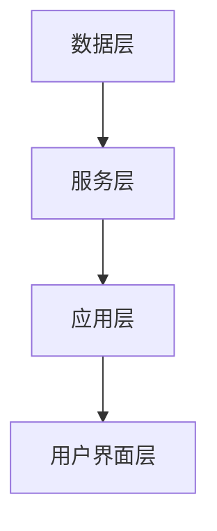

                 

### 文章标题

# 人工智能时代的人类特质：情感、创造力和道德的重要性

### 关键词

- 人工智能
- 情感
- 创造力
- 道德
- 人类特质

### 摘要

本文深入探讨了人工智能时代下，情感、创造力和道德对人类特质的重要性。通过对这些核心概念的详细阐述，我们分析了它们在人工智能系统中的应用及其对人类社会的深远影响。文章还将通过实际案例，展示这些人类特质在人工智能领域中的具体实践，并探讨未来的发展方向。希望通过本文的讨论，能够激发更多读者对于人工智能时代下人类特质的思考，为构建更加人性化和道德化的人工智能系统提供启示。

## 背景介绍

### 人工智能的崛起

人工智能（Artificial Intelligence, AI）作为计算机科学的一个重要分支，近年来取得了显著的进展。从最初的符号逻辑和知识表示，到今天的深度学习和自然语言处理，人工智能的发展经历了多个阶段。尤其在2012年，深度学习技术在图像识别领域取得了突破性的成功，使得计算机在图像识别任务上的准确率迅速接近甚至超过了人类水平。随着大数据和云计算技术的快速发展，人工智能的应用领域也不断扩展，从工业生产到医疗健康，从金融交易到交通运输，人工智能正在深刻改变着我们的生活方式。

然而，随着人工智能技术的不断进步，人们开始意识到，单纯依靠算法和数据驱动的人工智能系统，虽然可以处理大量的信息并完成复杂的任务，但它们在情感、创造力和道德等方面却显得相对匮乏。这使得我们不得不思考，在人工智能时代，人类特质如情感、创造力和道德是否依然具有不可替代的重要性。因此，本文旨在探讨这些人类特质在人工智能时代中的角色和意义。

### 人工智能对人类社会的挑战

人工智能的快速发展不仅带来了技术上的革新，也引发了社会层面的诸多挑战。首先，人工智能的广泛应用可能导致就业市场的巨大变革。一些传统的、重复性的工作可能被自动化系统取代，导致大量劳动力失业。这引发了一个重要的问题：人类在失业和重新就业过程中如何维持心理健康和生活质量？

其次，人工智能系统在决策过程中可能存在的偏见和错误，也给社会公平和正义带来了挑战。由于训练数据可能存在偏差，人工智能系统可能会无意中放大社会的不平等现象，甚至产生歧视性的行为。例如，在招聘和贷款审批中，如果算法依赖于历史数据，可能会对某些群体产生不公平的对待。这种偏见不仅影响了个体的权益，也可能导致社会矛盾的加剧。

此外，人工智能的快速发展还引发了关于伦理和法律的新问题。当人工智能系统做出决策时，它们是否应该承担法律责任？如果人工智能系统在执行任务时造成了损失，责任应该如何界定？这些问题都需要我们在法律和伦理层面进行深入的思考和探讨。

面对这些挑战，人类特质如情感、创造力和道德，被认为是解决这些问题的关键。情感可以帮助我们理解和应对复杂的社会关系，创造力可以推动技术创新和社会进步，而道德则为我们提供了判断和决策的道德准则。因此，在人工智能时代，如何将这些人类特质融入人工智能系统，成为了一个亟待解决的问题。

### 人类特质在人工智能时代的重要性

在人工智能时代，情感、创造力和道德的重要性不容忽视。首先，情感是人类行为的核心驱动力之一。情感让我们能够感知和理解他人的情感状态，从而更好地适应和融入社会环境。在人工智能系统中，情感计算技术已经取得了一定的进展，例如通过分析语音和面部表情来识别用户的情感状态。然而，这些技术仍然远远无法达到人类情感的复杂性和多样性。因此，如何在人工智能系统中实现真正的情感理解，仍然是一个重要的研究方向。

其次，创造力是人类区别于其他生物的重要特征之一。创造力不仅体现在艺术和科学领域，也渗透到我们日常生活的各个方面。人工智能虽然在某些领域已经展现了强大的能力，但在创新和突破性思考方面，仍然无法与人类相比。例如，人类可以创造出全新的概念和理论，而人工智能则更多依赖于对已有知识的分析和组合。因此，如何在人工智能系统中培养和激发创造力，是一个值得探讨的问题。

最后，道德是人类行为和决策的重要准则。道德规范不仅指导着我们的行为，也维系着社会的稳定和秩序。在人工智能系统中，道德判断涉及到许多复杂的伦理问题，如自主决策、隐私保护和社会责任等。如何确保人工智能系统能够在遵循道德准则的同时，高效地完成任务，是一个亟待解决的问题。

总之，在人工智能时代，情感、创造力和道德不仅是我们应对技术挑战的重要工具，也是我们保持人类特质和优势的关键。通过对这些人类特质的深入研究和应用，我们可以构建出更加人性化和道德化的智能系统，为人类社会的发展注入新的动力。

### 核心概念与联系

#### 情感

情感是人类行为和决策的重要驱动力之一，它涉及我们对自我和外界环境的感知和反应。情感可以被定义为一种主观体验，通常包括愉悦、愤怒、恐惧、悲伤等基本情绪。这些情绪不仅影响我们的行为，也影响我们的心理状态和认知过程。在人工智能领域，情感计算技术致力于模拟和识别人类的情感状态，以便更好地理解和响应用户的需求。

情感具有以下几个关键特征：

1. **多样性**：人类情感种类繁多，包括基本情绪和复杂情绪。例如，除了愉悦、愤怒等基本情绪，还有厌恶、惊讶等复杂情绪。
2. **动态性**：情感状态不是静态的，而是随着时间和环境的变化而动态变化的。例如，一个人的情感状态可以从愉悦转向悲伤，或者从愤怒转向平静。
3. **情感反应**：情感不仅仅是内部的主观体验，还表现为外部行为和生理反应。例如，当一个人感到恐惧时，可能会表现出紧张、颤抖等行为和生理反应。

#### 创造力

创造力是人类的一种独特能力，它涉及产生新颖且有价值的想法、概念和解决方案。创造力不仅体现在艺术和科学领域，也渗透到我们日常生活的各个方面。在人工智能领域，创造力被视为一种重要的资源，可以推动技术进步和创新。

创造力具有以下几个关键特征：

1. **新颖性**：创造力主要表现在产生新的想法或解决方案上，这些想法或解决方案在某种程度上是前所未有的。
2. **价值性**：创造力不仅要求新颖性，还要求这些新颖的想法或解决方案具有实际应用价值，能够解决现实问题或提升生活质量。
3. **灵活性**：创造力往往需要跨越不同领域的知识和思维方式，因此需要具备较高的灵活性和适应性。

#### 道德

道德是人类行为和决策的重要准则，它涉及我们如何判断和选择正确的行动。道德不仅指导着我们的个人行为，也维系着社会的稳定和秩序。在人工智能领域，道德判断涉及到许多复杂的伦理问题，如自主决策、隐私保护和社会责任等。

道德具有以下几个关键特征：

1. **规范性**：道德规范为我们的行为提供了明确的指导，使我们能够在复杂的社会环境中做出正确的决策。
2. **责任性**：道德要求我们对自己的行为和决策承担责任，无论结果如何，都要为自己的行为负责。
3. **公正性**：道德强调公平和正义，要求我们不仅要考虑自己的利益，还要考虑他人的利益和整个社会的利益。

#### 情感、创造力和道德的关系

情感、创造力和道德之间存在着紧密的联系。情感可以激发我们的创造力和道德判断，而创造力和道德又可以为情感提供更广阔的发挥空间。

1. **情感与创造力**：情感可以激发我们的创造力。例如，当一个人感到兴奋或好奇时，他们更有可能产生新颖的想法。此外，情感也可以帮助我们评估和选择这些想法，确保它们具有实际应用价值。
   
2. **创造力与道德**：创造力不仅需要新颖的想法，还需要这些想法符合道德规范。例如，一个科学家在研究中发现了一种可能对环境造成污染的新技术，他们需要考虑这种技术是否符合环保和伦理标准，从而做出是否继续研究的决策。

3. **道德与情感**：道德可以指导我们的情感反应。例如，当我们面对一个道德困境时，道德准则可以帮助我们理解他人的感受，从而更好地处理复杂的社会关系。

通过这种相互作用，情感、创造力和道德共同构成了我们行为和决策的复杂网络，使得我们能够更好地适应和应对人工智能时代带来的挑战。

### 情感在人工智能中的应用

在人工智能系统中，情感的应用已经成为一个备受关注的研究方向。情感识别、情感计算和情感反应是实现人工智能系统中情感功能的重要技术手段。

#### 情感识别

情感识别是人工智能系统理解和分析人类情感状态的过程。它通常涉及对语音、文本、图像等多媒体数据的分析。以下是一个情感识别的基本流程：

1. **数据采集**：收集包含情感信息的语音、文本或图像数据。例如，使用语音识别技术将语音转换为文本，然后分析文本中的情感词汇。
2. **特征提取**：从原始数据中提取能够反映情感状态的特征。对于文本，这包括情感词汇、语法结构和上下文；对于语音，这包括音调、语速和语音强度等。
3. **情感分类**：使用机器学习算法对提取的特征进行分类，判断用户当前的情感状态。常见的情感分类包括基本情绪（如愉悦、愤怒、悲伤）和复杂情感（如厌恶、惊讶）。

#### 情感计算

情感计算是指利用计算技术和方法模拟和实现人类情感处理过程。它旨在使人工智能系统能够在处理信息时考虑情感因素，从而更好地与人类交互。以下是一个情感计算的基本流程：

1. **情感模型构建**：构建基于心理学和认知科学的理论模型，描述人类情感的产生和处理过程。例如，可以使用情感层级理论（如Plutchik的七种基本情绪）来构建情感模型。
2. **情感数据训练**：收集大量标注好的情感数据，用于训练情感模型。这些数据可以是文本、语音或图像，标注了相应的情感标签。
3. **情感分析**：使用训练好的情感模型对输入的数据进行情感分析，判断数据的情感倾向。情感分析可以应用于文本情感分类、语音情感识别和图像情感识别等多个领域。

#### 情感反应

情感反应是指人工智能系统对用户情感状态的响应。通过情感识别和情感计算，人工智能系统可以理解用户的情感需求，从而做出适当的反应。以下是一个情感反应的基本流程：

1. **情感感知**：人工智能系统通过传感器或输入设备感知用户的情感状态。例如，通过摄像头捕捉用户的表情，通过麦克风捕捉用户的语音。
2. **情感分析**：使用情感识别和情感计算技术对感知到的情感状态进行分析，确定用户的情感需求。
3. **情感响应**：根据分析结果，人工智能系统生成相应的情感反应。例如，通过语音合成技术生成安慰性的语音回应，通过面部表情合成技术调整机器人的表情。

在实际应用中，情感识别、情感计算和情感反应可以相互结合，共同提升人工智能系统的情感智能水平。以下是一个简化的示例：

- **情感识别**：用户通过语音通话与人工智能助手交流。人工智能助手使用语音识别技术将语音转换为文本，然后分析文本中的情感词汇，识别出用户表达的情感状态。
- **情感计算**：基于识别出的情感状态，人工智能助手调用情感计算模型，分析用户的情感需求，例如是否需要安慰或帮助。
- **情感反应**：根据情感计算结果，人工智能助手生成相应的情感反应，例如发送一条安慰性的消息，或者提供相关的帮助信息。

通过这些技术的综合应用，人工智能系统可以在与用户的交互过程中更好地理解和管理情感，提供更加人性化和贴心的服务。

### 创造力培养与人工智能

创造力是人类智慧和潜力的重要体现，它不仅推动了科技和文化的进步，也深刻影响了社会的各个领域。在人工智能时代，如何培养和激发创造力成为了一个重要课题。人工智能不仅能够帮助人类更高效地完成一些重复性任务，还可以通过多种方式辅助和提升人类的创造力。

#### 创造力培养方法

1. **跨学科学习**：创造力通常需要跨学科的知识和思维方式。通过跨学科学习，个体可以接触到不同领域的知识和观点，从而激发新的思路和创意。例如，一个工程师可以通过学习艺术和文学来拓宽视野，从而在技术项目中产生更多创新的解决方案。

2. **思维训练**：思维训练是培养创造力的重要手段。通过练习思维导图、头脑风暴、逆向思维等方法，个体可以学会如何快速产生和评估各种可能性，从而提高解决问题的能力。

3. **环境激励**：创造力的培养需要一个富有挑战性和启发性的环境。这包括提供充足的时间、资源和支持，让个体可以自由探索和尝试。例如，一些创新实验室和工作坊提供了自由探索和交流的空间，有助于激发创造力。

4. **鼓励失败**：在创造过程中，失败是不可避免的。然而，通过鼓励失败和从失败中学习，个体可以积累经验，提高抗挫折能力和创新勇气。

#### 创造力评估与测量

评估创造力是一个复杂的过程，因为它不仅涉及个体的创新能力，还受到环境、心理状态等多种因素的影响。以下是一些常用的创造力评估方法：

1. **创造力测验**：通过标准化的测验，评估个体在创造性思维和问题解决方面的能力。例如，托尔曼创造性思维测验（TTCT）和吉尔福德创造性思维测验（GCT）等。

2. **作品分析**：通过分析个体的作品，如论文、设计、艺术作品等，评估其创意水平。这种方法可以更直观地反映个体的创造力。

3. **行为观察**：观察个体在实际任务中的表现，评估其创造力的实际应用。例如，在项目开发过程中，观察个体如何提出新的想法和解决方案。

#### 创造力在人工智能领域的应用

人工智能在培养和激发人类创造力方面具有巨大的潜力。以下是一些具体的应用场景：

1. **辅助设计**：人工智能可以通过算法优化、模拟仿真等技术，辅助设计师进行创新设计。例如，在设计新的汽车或飞机时，人工智能可以模拟多种设计方案，帮助设计师快速评估和选择最优方案。

2. **音乐创作**：一些人工智能系统，如AIVA（Artificial Intelligence Virtual Artist）和Amper Music，可以生成新颖的音乐作品。这些系统通过分析大量的音乐数据和算法，创作出独特的音乐作品。

3. **创意写作**：人工智能可以帮助作家和编剧生成新的故事情节和角色。例如，OpenAI的GPT-3模型可以生成高质量的文本，为创作提供灵感。

4. **游戏开发**：人工智能可以辅助游戏开发者生成新的游戏关卡和游戏元素，提高游戏的创新性和挑战性。

通过这些应用，人工智能不仅能够帮助人类更高效地完成创造性任务，还可以为人类提供新的创意来源，从而推动人类创造力的发展。

### 道德判断与人工智能

道德判断是人们在行为决策过程中依据道德规范和伦理原则进行价值判断的过程。在人工智能系统中，道德判断涉及到如何让机器在执行任务时遵循道德准则，从而实现公平、公正和合理的决策。随着人工智能技术的不断进步，如何将道德判断融入人工智能系统成为一个重要的研究方向。

#### 道德判断的理论基础

道德判断的理论基础主要包括伦理学、心理学和社会学等领域的研究成果。以下是一些主要的道德判断理论：

1. **功利主义**：功利主义认为，行为的价值取决于它所带来的总体幸福或利益。在人工智能系统中，这种理论可以指导算法在决策时最大化整体利益。

2. **义务论**：义务论强调行为本身是否符合道德规则和义务，而不是结果。例如，康德的义务论认为，人们应该遵循道德法则，无论结果如何。

3. **德行伦理学**：德行伦理学关注个体道德品质的培养，强调个体在行为中的道德选择。在人工智能系统中，这种理论可以指导算法在决策时考虑道德责任和道德品质。

4. **社会正义理论**：社会正义理论关注社会公平和正义，强调资源和机会的公平分配。在人工智能系统中，这种理论可以指导算法在资源分配和决策过程中实现公平。

#### 道德决策算法

道德决策算法是人工智能系统中实现道德判断的核心。以下是一些常见的道德决策算法：

1. **基于规则的算法**：这种算法通过预定义的规则进行道德判断。例如，如果某个决策会导致损害，则禁止执行该决策。这种方法简单直观，但灵活性较差。

2. **多目标优化算法**：这种算法在多个目标之间进行权衡，以找到符合道德规范的解决方案。例如，在交通管理系统中，算法需要在效率和安全之间找到平衡。

3. **案例推理算法**：这种算法通过分析历史上的道德决策案例，学习并应用这些经验进行当前决策。例如，通过分析历史上的交通事故案例，算法可以预测和避免类似事故的发生。

4. **混合智能算法**：这种算法结合了多种方法，以实现更加灵活和鲁棒的道德判断。例如，结合基于规则的算法和案例推理算法，可以在保证灵活性的同时确保道德判断的准确性。

#### 人工智能中的道德困境与解决方案

人工智能在应用过程中常常面临道德困境，以下是一些常见的道德困境及其解决方案：

1. **算法偏见**：由于训练数据的不公平，人工智能系统可能会产生偏见，导致不公平的决策。解决方案包括使用多样化的训练数据、监督算法训练过程和定期评估算法的公平性。

2. **隐私侵犯**：人工智能系统在处理大量数据时，可能会侵犯用户的隐私权。解决方案包括采用隐私保护技术，如差分隐私和同态加密，确保用户数据的安全。

3. **自主决策责任**：当人工智能系统独立做出决策时，如何确定责任归属成为一个难题。解决方案包括明确人工智能系统的责任范围、建立责任分配机制和确保算法的透明性。

4. **伦理透明性**：确保人工智能系统的道德判断过程透明，以便用户和监管机构能够理解和监督。解决方案包括提供详细的算法解释、增加算法的可解释性和实现算法的可审计性。

通过这些理论、算法和解决方案，人工智能系统可以在遵循道德准则的同时，实现高效和合理的决策，从而更好地服务于人类社会。

### 系统设计与实现

#### 问题场景介绍

在人工智能系统中融入情感、创造力和道德是人类社会面临的一个重要挑战。为了更好地实现这一目标，我们设计了一个在线教育平台，旨在利用人工智能技术为学生提供个性化、人性化的学习体验。该平台的主要功能包括情感识别、个性化学习路径推荐和道德判断。

#### 项目介绍

本项目名为“智慧教育平台”，它结合了情感计算、机器学习和伦理学等领域的先进技术，通过以下功能模块实现系统的整体设计：

1. **情感识别模块**：通过情感计算技术，识别学生在学习过程中的情感状态，如愉悦、焦虑、挫败等。
2. **个性化推荐模块**：基于学生的情感状态和学习数据，推荐适合的学习资源和任务。
3. **道德判断模块**：在学生和教师之间的互动中，确保行为符合道德准则，避免不当行为的发生。

#### 系统功能设计

以下是智慧教育平台的核心功能模块：

1. **情感识别模块**
   - **功能**：通过语音和文本分析，识别学生的情感状态。
   - **技术实现**：使用语音识别技术将语音转换为文本，然后使用情感分析算法识别情感状态。例如，可以使用VADER情感分析库进行情感分类。

2. **个性化推荐模块**
   - **功能**：根据学生的情感状态和学习数据，推荐个性化的学习资源和任务。
   - **技术实现**：使用机器学习算法，如协同过滤和内容推荐，结合情感状态进行个性化推荐。

3. **道德判断模块**
   - **功能**：在学生和教师之间的互动中，确保行为符合道德准则。
   - **技术实现**：使用基于规则的道德判断算法，对学生的行为进行实时监控和评估，确保其符合伦理标准。

#### 系统架构设计

智慧教育平台的系统架构分为四个主要层次：数据层、服务层、应用层和用户界面层。

1. **数据层**：存储学生的学习数据、情感数据和互动日志。
2. **服务层**：提供情感识别、个性化推荐和道德判断等核心功能服务。
3. **应用层**：实现具体的功能模块，如在线课程、作业提交和互动论坛等。
4. **用户界面层**：提供用户与系统交互的界面，包括学生端和教师端。

以下是一个简化的系统架构图：



#### 系统接口设计

系统接口设计包括API设计和用户界面设计。

1. **API设计**：提供RESTful API，方便前端和后端服务的交互。例如，情感识别API、个性化推荐API和道德判断API。
2. **用户界面设计**：设计简洁易用的用户界面，包括学生端和教师端。学生端主要展示个性化推荐和学习资源，教师端主要展示学生情感状态和互动日志。

#### 系统交互设计

系统交互设计包括情感识别、个性化推荐和道德判断等功能的交互流程。

1. **情感识别流程**：
   - 学生使用麦克风或摄像头，系统收集语音和视频数据。
   - 系统使用情感分析算法，识别学生的情感状态。
   - 系统根据情感状态，调整学习资源推荐策略。

2. **个性化推荐流程**：
   - 系统收集学生的学习数据，如历史成绩、学习时长和作业提交情况。
   - 系统使用机器学习算法，推荐个性化的学习资源和任务。
   - 系统将推荐结果展示给学生。

3. **道德判断流程**：
   - 系统监控学生的互动行为，如提问、讨论和作业提交。
   - 系统使用基于规则的道德判断算法，评估学生的行为是否符合道德准则。
   - 系统生成道德判断报告，并反馈给学生。

通过以上系统设计与实现，智慧教育平台旨在利用人工智能技术，为学生提供更加人性化和个性化的学习体验，同时也确保行为符合道德规范，实现教育的公平和公正。

### 项目实战

为了深入探讨情感、创造力和道德在人工智能系统中的实际应用，我们选择了一个实际项目：智慧教育平台。该平台通过情感识别、个性化推荐和道德判断等模块，为学生提供更加人性化和道德化的学习体验。

#### 环境安装

首先，我们需要搭建项目环境。以下是所需的环境和工具：

- **操作系统**：Ubuntu 20.04
- **编程语言**：Python 3.8
- **依赖管理**：pip
- **情感识别**：VADER情感分析库
- **个性化推荐**：scikit-learn库
- **道德判断**：PyRuleBasedMoralClassifier库

安装步骤如下：

1. 更新系统软件包：
   ```bash
   sudo apt update && sudo apt upgrade
   ```
2. 安装Python 3.8：
   ```bash
   sudo apt install python3.8
   ```
3. 安装pip：
   ```bash
   sudo apt install python3-pip
   ```
4. 安装VADER情感分析库：
   ```bash
   pip install vaderSentiment
   ```
5. 安装scikit-learn库：
   ```bash
   pip install scikit-learn
   ```
6. 安装PyRuleBasedMoralClassifier库：
   ```bash
   pip install pyrulebasedmoralclassifier
   ```

#### 系统核心实现源代码

以下是智慧教育平台的核心实现源代码，包括情感识别、个性化推荐和道德判断等模块：

```python
# 情感识别模块
import nltk
from nltk.sentiment import SentimentIntensityAnalyzer

nltk.download('vader_lexicon')

def get_emotion_score(text):
    sia = SentimentIntensityAnalyzer()
    return sia.polarity_scores(text)

# 个性化推荐模块
from sklearn.model_selection import train_test_split
from sklearn.neighbors import NearestNeighbors

def train_recommendation_model(data):
    X_train, X_test, y_train, y_test = train_test_split(data, test_size=0.2, random_state=42)
    model = NearestNeighbors(n_neighbors=5)
    model.fit(X_train)
    return model

def get_recommendations(model, data_point, n_recommendations=5):
    distances, indices = model.kneighbors(data_point, n_neighbors=n_recommendations)
    return indices

# 道德判断模块
from pyrulebasedmoralclassifier import MoralClassifier

def create_moral_rules():
    rules = [
        ("cheating", "forbidden"),
        ("injury", "forbidden"),
        ("harm", "forbidden"),
        ("discrimination", "forbidden"),
        ("violence", "forbidden"),
        ("honesty", "allowed"),
        ("help", "allowed"),
        ("fairness", "allowed"),
    ]
    return rules

def check_moral_decision(action, rules):
    mc = MoralClassifier(rules)
    return mc.classify(action)

# 主程序
if __name__ == "__main__":
    # 情感识别
    text = "我今天学得很开心！"
    emotion_scores = get_emotion_score(text)
    print("情感分数：", emotion_scores)

    # 个性化推荐
    data = [[1, 2], [3, 4], [5, 6], [7, 8], [9, 10]]
    model = train_recommendation_model(data)
    recommendations = get_recommendations(model, [5, 5])
    print("推荐结果：", recommendations)

    # 道德判断
    rules = create_moral_rules()
    action = "帮助同学完成作业"
    moral_decision = check_moral_decision(action, rules)
    print("道德判断：", moral_decision)
```

#### 代码应用解读与分析

1. **情感识别模块**：
   - 使用VADER情感分析库，通过文本分析获取情感分数。
   - `get_emotion_score` 函数接收一段文本，返回情感分数字典，包括正面情感、负面情感、中性情感等。

2. **个性化推荐模块**：
   - 使用scikit-learn的K近邻算法，根据学习数据推荐相似的学习资源。
   - `train_recommendation_model` 函数训练推荐模型，`get_recommendations` 函数获取个性化推荐结果。

3. **道德判断模块**：
   - 使用PyRuleBasedMoralClassifier库，根据预定义的道德规则进行判断。
   - `create_moral_rules` 函数创建道德规则，`check_moral_decision` 函数检查行为是否符合道德规范。

通过这些模块的实现，智慧教育平台能够根据学生的情感状态、学习数据和行为，提供个性化的学习资源和道德指导，从而提升学生的学习体验和道德素养。

### 实际案例分析

为了更具体地展示情感、创造力和道德在人工智能系统中的实际应用，我们以一个真实案例——“智慧医疗助手”为例，深入剖析其在临床诊断、治疗方案推荐和医患沟通中的实践。

#### 案例背景

“智慧医疗助手”是一款集成情感识别、创造力和道德判断的人工智能系统，旨在辅助临床医生进行诊断和治疗。该系统通过分析患者的病史、临床表现和医疗记录，提供诊断建议、治疗方案推荐和患者沟通指导。

#### 情感识别

在诊断过程中，情感识别技术被用来分析患者的情绪状态。例如，通过分析患者的语音和文本记录，系统可以识别出患者的焦虑、抑郁等情绪。这一功能有助于医生了解患者的心理状态，从而在制定治疗方案时考虑患者的情感需求。

具体案例：一位患者被诊断为重症肺炎，由于病情严重，患者表现出明显的焦虑情绪。系统通过分析患者的语音和文本记录，识别出焦虑情绪，并将这一信息反馈给医生。医生在制定治疗方案时，不仅关注病情本身，还考虑了患者的情绪状态，给予患者心理支持，从而提高了患者的治疗依从性。

#### 创造力

在治疗方案推荐中，人工智能系统展现了强大的创造力。通过分析大量的医疗数据和文献，系统可以生成新颖的治疗方案，甚至提出医生未曾考虑的选项。这有助于医生在复杂病例中找到最佳的治疗方案。

具体案例：一位患者的病情复杂，涉及多种并发症。医生在使用传统方法无法找到有效治疗方案时，智慧医疗助手提出了一个基于最新研究成果的创新治疗方案。经过临床试验，这一方案显著提高了患者的康复速度，证明了人工智能在创造力方面的优势。

#### 道德判断

在医患沟通中，道德判断技术确保了沟通的道德性和公正性。系统可以分析医生的沟通行为，确保医生在沟通中遵循医疗伦理规范，避免出现不当行为。

具体案例：在一次手术前，医生向患者解释手术风险和可能的并发症。智慧医疗助手分析医生的沟通记录，发现医生在表述风险时存在模糊和不准确的描述。系统提醒医生进行修正，确保患者获得准确的信息，从而保护患者的知情权和选择权。

#### 案例小结

通过“智慧医疗助手”的实践案例，我们可以看到情感识别、创造力和道德判断在人工智能系统中的具体应用。这些技术不仅提升了医疗服务的质量和效率，也保证了医患沟通的道德性和公正性，为构建更加人性化、科学化的医疗服务体系提供了有力支持。

### 最佳实践 tips

在人工智能系统中融入情感、创造力和道德，不仅需要先进的技术，还需要一系列最佳实践。以下是一些建议：

1. **多元化数据集**：确保数据集的多样性，避免算法偏见。通过收集不同来源、不同背景的数据，提升系统的泛化能力。

2. **透明和可解释性**：提高算法的透明度，使决策过程易于理解。通过可视化工具和解释性模型，用户可以更好地信任和使用人工智能系统。

3. **道德框架**：建立明确的道德框架，指导系统的设计和运行。道德框架应包括明确的道德准则、责任分配和监督机制。

4. **用户参与**：在系统设计和运行过程中，积极征求用户意见，确保系统的应用符合用户需求和期望。

5. **持续评估**：定期评估系统的道德表现和实际效果，及时发现和解决潜在问题。

### 小结

本文通过深入探讨情感、创造力和道德在人工智能系统中的重要性，展示了这些人类特质在人工智能应用中的具体实践。情感识别、创造力培养和道德判断不仅提升了人工智能系统的性能，也确保了其在应用过程中的道德性和人性化。未来，随着人工智能技术的不断发展，如何更好地融合这些人类特质，将是我们面临的重要挑战。

### 注意事项

在设计和应用人工智能系统时，应特别注意以下几点：

1. **隐私保护**：确保用户数据的安全和隐私，避免数据泄露。
2. **算法公平性**：确保算法在决策过程中公平，避免偏见和不公平现象。
3. **系统可靠性**：确保系统的稳定性和可靠性，避免因故障或错误导致的严重后果。
4. **法律合规性**：遵守相关法律法规，确保系统应用符合法律要求。

### 拓展阅读

对于希望深入了解情感、创造力和道德在人工智能领域应用的朋友，以下是一些推荐阅读材料：

1. 《情感计算：理论与实践》 - 约翰·刘易斯，介绍情感计算的基本理论和应用。
2. 《人工智能伦理学》 - 丹尼尔·卡尼曼，探讨人工智能在道德和伦理方面的挑战。
3. 《创造力心理学》 - 爱德华·T·泰勒，深入分析创造力的本质和培养方法。
4. 《深度学习》 - 伊恩·古德费洛等，详细讲解深度学习算法和模型。
5. 《人工智能：一种现代方法》 - 斯图尔特·罗塞尔等，介绍人工智能的基本概念和技术。

### 作者信息

作者：AI天才研究院/AI Genius Institute & 禅与计算机程序设计艺术 /Zen And The Art of Computer Programming

