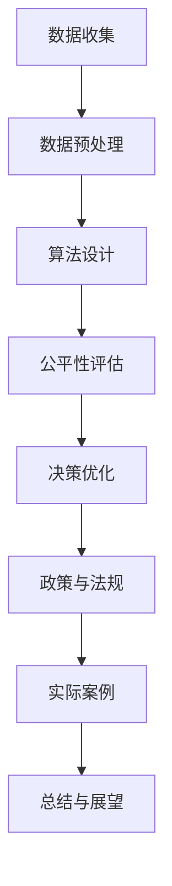

                 

# 人工智能时代的伦理决策：算法公平与社会正义

## 关键词

人工智能、伦理决策、算法公平、社会正义、偏见、公平性评估

> 在这个日新月异的人工智能时代，我们不仅要追求技术上的突破，更要关注算法的伦理性和社会正义。本文将探讨人工智能时代伦理决策的核心问题，分析算法公平与社会正义的重要性，提出评估方法与伦理决策框架，并结合实际案例进行深入剖析。

### 摘要

本文旨在探讨人工智能时代的伦理决策，特别是算法公平与社会正义的问题。随着AI技术的广泛应用，算法偏见和伦理决策的重要性愈发凸显。本文首先介绍了问题背景，然后深入分析了核心概念，包括公平性和社会正义。接着，文章探讨了算法偏见的原因及评估方法，构建了伦理决策框架，并通过实际案例展示了伦理决策的应用。最后，文章提出了政策与法规的建议，以期为人工智能时代的伦理决策提供参考。

## 第1章 引言：问题背景与重要性

### 1.1 问题背景

人工智能（AI）技术的发展带来了前所未有的机遇，但也引发了一系列伦理问题。AI算法在医疗诊断、金融风险评估、交通管理、社交媒体推荐等各个领域都有广泛应用，然而，这些算法的决策过程可能会存在偏见，从而影响社会的公平性和正义。

#### 1.1.1 人工智能技术的发展与普及

人工智能技术自1950年代图灵测试提出以来，经历了多个阶段的发展。近年来，得益于深度学习、神经网络等技术的突破，人工智能在各个领域取得了显著的进展。从语音识别到图像识别，从自然语言处理到智能推荐，AI的应用已经深入到我们生活的方方面面。

#### 1.1.2 伦理决策的重要性

伦理决策在人工智能发展中具有重要意义。伦理决策不仅关系到技术的使用是否合理，更关系到社会公平和正义。在AI算法的决策过程中，如何确保算法的公平性，避免对特定群体产生歧视，是当前亟需解决的重要问题。

### 1.2 问题描述

人工智能算法在决策过程中可能会出现偏见，这些偏见可能来源于数据偏差、算法设计缺陷或社会偏见。这些偏见可能导致不公平的结果，影响社会的和谐与稳定。

#### 1.2.1 算法偏见的表现形式

- **数据偏差**：算法的决策结果可能受到训练数据偏差的影响，导致对某些群体产生偏见。
- **算法偏见**：算法设计本身可能存在缺陷，使得决策结果偏向某些群体。
- **社会偏见**：算法的决策过程可能受到社会偏见的影响，对特定群体产生不公平待遇。

#### 1.2.2 伦理决策面临的挑战

- **决策透明度**：如何确保算法的决策过程透明，便于监督和审查。
- **数据隐私**：如何保护用户数据隐私，避免数据滥用。
- **法律责任**：如何明确算法决策的法律责任，保障受害者的权益。

## 第2章 核心概念

### 2.1 公平性

公平性是伦理决策中最为核心的概念之一。在AI决策中，公平性指的是算法在决策过程中对不同群体的影响是否平等。

#### 2.1.1 公平性的定义与属性

**公平性**的定义：公平性是指在决策过程中，对待所有个体或群体时的公正和合理。在AI决策中，公平性指的是算法在处理不同群体时，是否能够平等对待。

**公平性的属性**：

- **无歧视性**：算法不应基于种族、性别、年龄等非相关特征对个体进行歧视。
- **无偏见性**：算法的决策结果不应受到数据偏见或算法设计偏见的影响。
- **公正性**：算法的决策结果应基于合理的标准和原则，确保对所有个体或群体都是公正的。

#### 2.1.2 公平性的度量方法

**度量方法**：评估算法的公平性需要采用一系列的度量方法。以下是一些常用的度量方法：

- **统计公平性**：通过统计方法评估算法在不同群体中的表现，如评估算法在不同性别、种族、地区等群体中的公平性。
- **素质公平性**：通过评估算法在不同素质水平群体中的表现，如评估算法在高中和初中生群体中的公平性。
- **基于数据的公平性评估**：通过分析算法的决策数据，评估算法在不同数据集上的公平性。

### 2.2 社会正义

社会正义关注的是社会的整体利益和公正性，特别是在AI技术广泛应用的情况下，如何保障弱势群体的权益。

#### 2.2.1 社会正义的概念与内涵

**社会正义**的概念：社会正义是指社会资源、机会和利益的公平分配，以及社会成员之间关系的公正处理。

**社会正义的内涵**：

- **资源分配**：社会资源如财富、教育、医疗等应公平分配，确保所有人都能享有基本的生活保障。
- **机会平等**：社会应为所有人提供平等的机会，无论其种族、性别、社会地位等因素。
- **社会稳定**：通过公平的制度安排，维护社会的和谐与稳定，减少社会冲突和矛盾。

#### 2.2.2 社会正义在AI决策中的应用

社会正义在AI决策中的应用主要体现在以下几个方面：

- **公共政策制定**：AI算法在制定公共政策时，应充分考虑社会正义原则，确保政策的公平性和合理性。
- **社会服务提供**：AI算法在社会服务领域应用时，应确保服务的公平性和公正性，保障弱势群体的权益。
- **法律与司法决策**：AI算法在司法决策中，应遵循社会正义原则，确保决策的公正性和透明性。

## 第3章 算法公平性分析

### 3.1 算法偏见的原因分析

算法偏见通常来源于数据偏差、算法设计缺陷或社会偏见。分析算法偏见的原因对于解决伦理决策问题至关重要。

#### 3.1.1 数据偏差

**数据偏差的定义**：数据偏差是指算法在训练过程中，受到数据本身的不平衡、缺失或偏向性的影响，导致决策结果产生偏见。

**数据偏差的来源**：

- **历史数据偏差**：历史数据可能反映社会偏见，如种族、性别、年龄等特征，导致算法在决策时对这些特征产生偏见。
- **数据收集偏差**：数据收集过程中可能存在偏差，如样本选择偏差、数据标注偏差等，导致算法对某些群体产生偏见。
- **数据缺失**：数据缺失可能导致算法无法准确评估特定群体，从而产生偏见。

#### 3.1.2 算法设计缺陷

**算法偏见的原因**：

- **算法选择**：某些算法可能对特定数据集具有更强的预测能力，但在其他数据集上可能表现较差，导致决策结果产生偏见。
- **模型结构**：算法的模型结构可能对某些特征赋予更高的权重，从而影响决策的公平性。
- **参数设置**：算法的参数设置可能对特定群体产生偏见，如阈值设置、学习率等。

**常见的算法偏见问题**：

- **种族歧视**：算法在招聘、房贷等决策中，可能对特定种族产生歧视。
- **性别歧视**：算法在推荐系统、广告投放等决策中，可能对特定性别产生歧视。
- **社会经济歧视**：算法在金融服务、医疗保健等决策中，可能对特定社会经济群体产生歧视。

#### 3.1.3 社会偏见

**社会偏见的影响**：社会偏见可能在数据收集、算法设计和应用过程中产生影响，导致算法的决策结果出现不公平。

**如何减少社会偏见对算法的影响**：

- **数据平衡**：通过收集更平衡、多样化的数据，减少社会偏见对算法的影响。
- **算法训练**：在算法训练过程中，采用多样化的数据集，减少偏见。
- **算法评估**：在算法评估过程中，采用公平性评估方法，检测和纠正偏见。
- **政策监管**：通过政策监管，确保算法应用过程中的公平性和透明性。

### 3.2 公平性评估方法

评估算法的公平性是保障AI决策伦理性的关键。本章介绍几种常用的公平性评估方法。

#### 3.2.1 统计公平性评估

**统计公平性评估的定义**：统计公平性评估是通过统计分析方法，评估算法在不同群体中的表现，以检测算法是否存在偏见。

**常见的统计公平性度量指标**：

- **基尼系数**：评估群体内部差异程度，差异越大，不公平性越强。
- **标准差**：评估群体内部差异程度，差异越大，不公平性越强。
- **变异系数**：评估群体内部差异程度与平均值的相对关系，变异系数越大，不公平性越强。

#### 3.2.2 素质公平性评估

**素质公平性评估的定义**：素质公平性评估是通过评估算法在不同素质水平群体中的表现，以检测算法是否存在偏见。

**素质公平性评估的优势与局限**：

- **优势**：素质公平性评估可以更全面地评估算法的公平性，包括教育水平、工作经验等。
- **局限**：素质公平性评估可能需要更多的数据和信息，且评估结果可能受到素质定义和标准的影响。

#### 3.2.3 基于数据的公平性评估

**基于数据的公平性评估方法**：基于数据的公平性评估是通过分析算法的决策数据，评估算法在不同数据集上的公平性。

**数据驱动的方法在公平性评估中的应用**：

- **数据划分**：将数据划分为训练集、验证集和测试集，分别评估算法的公平性。
- **交叉验证**：采用交叉验证方法，评估算法在不同数据集上的公平性。
- **敏感性分析**：通过改变数据特征、参数设置等，评估算法对数据变化的敏感度，以检测是否存在偏见。

### 3.3 伦理决策框架

**伦理决策框架的定义**：伦理决策框架是指一套系统化的方法，用于评估、设计和改进AI算法的伦理决策过程。

**伦理决策框架的作用**：

- **指导原则**：为AI算法的伦理决策提供指导原则，确保决策过程的公正性和合理性。
- **评估工具**：提供评估算法公平性和社会正义的工具，帮助检测和纠正偏见。
- **改进建议**：提出改进算法设计和应用的建议，以提高决策的公平性和正义性。

### 3.4 伦理决策流程

**伦理决策流程**包括数据收集、算法设计、公平性评估和决策优化等步骤。

#### 3.4.1 数据收集

**数据收集的原则**：

- **数据平衡**：收集多样化、平衡的数据集，减少偏见。
- **数据隐私**：保护用户数据隐私，避免数据滥用。

**数据收集的方法**：

- **公开数据集**：使用公开的数据集进行训练和评估。
- **定制数据集**：根据特定问题领域，定制符合需求的数据集。

#### 3.4.2 算法设计

**算法设计的伦理考量**：

- **无歧视性**：确保算法在设计过程中，不会对特定群体产生歧视。
- **透明性**：算法的设计和决策过程应透明，便于监督和审查。

**算法优化的方法**：

- **交叉验证**：采用交叉验证方法，优化算法的性能和公平性。
- **启发式搜索**：使用启发式搜索方法，寻找最优的算法参数。

#### 3.4.3 公平性评估

**公平性评估的过程**：

- **数据预处理**：对数据进行清洗、归一化等预处理操作，提高评估的准确性。
- **指标计算**：计算公平性指标，评估算法在不同群体中的表现。
- **结果分析**：分析评估结果，识别和纠正偏见。

**公平性评估的结果与应用**：

- **结果分析**：分析评估结果，识别偏见和不足。
- **优化算法**：根据评估结果，优化算法设计和参数设置。
- **决策优化**：基于公平性评估结果，调整决策策略，提高决策的公平性和正义性。

#### 3.4.4 决策优化

**决策优化的目标**：

- **公平性**：确保决策过程的公平性和正义性。
- **性能**：提高算法的决策性能和预测准确性。

**决策优化的策略**：

- **多目标优化**：同时考虑公平性和性能目标，采用多目标优化方法。
- **智能搜索**：采用智能搜索方法，如遗传算法、粒子群优化等，寻找最优的决策策略。

## 第4章 实际案例分析

### 4.1 案例介绍

本章节将通过实际案例，分析人工智能时代伦理决策的具体应用和挑战。

#### 4.1.1 案例背景

**案例名称**：社交媒体推荐算法的公平性问题

**案例背景**：社交媒体平台通过算法推荐内容给用户，以增加用户粘性。然而，算法的推荐结果可能受到数据偏差、算法设计缺陷或社会偏见的影响，导致对特定群体产生不公平待遇。

#### 4.1.2 案例分析

**案例分析**：

1. **数据偏差**：社交媒体平台收集的用户数据可能存在偏差，如某些地区、年龄、性别等特征的数据不足，导致算法在推荐内容时对这些特征产生偏见。
2. **算法偏见**：算法设计可能对某些特征赋予更高的权重，导致推荐结果对特定群体产生偏见。
3. **社会偏见**：算法的推荐结果可能受到社会偏见的影响，如对某些群体的内容推荐过多，而对其他群体的内容推荐较少。

### 4.2 案例解决

针对案例中的问题，本章将提出解决方案，并分析这些解决方案的优缺点。

#### 4.2.1 解决方案一：数据平衡

**解决方案内容**：通过收集更多平衡、多样化的数据集，减少数据偏差。具体方法包括：

- **扩大数据来源**：从更多渠道收集数据，确保数据覆盖面更广。
- **数据清洗**：对数据进行清洗，去除噪声和异常值，提高数据质量。
- **数据增强**：通过数据增强技术，生成更多多样化的数据样本，提高数据多样性。

**优点**：

- **减少数据偏差**：通过收集更多平衡、多样化的数据集，减少算法对特定群体的偏见。
- **提高算法性能**：多样化数据集有助于提高算法的泛化能力，提高推荐准确性。

**局限**：

- **数据收集成本**：收集多样化数据集需要大量时间和资源。
- **数据隐私**：在收集和使用数据时，需要保护用户隐私，避免数据滥用。

#### 4.2.2 解决方案二：算法优化

**解决方案内容**：优化算法设计，减少算法偏见。具体方法包括：

- **无歧视性设计**：在算法设计过程中，确保算法不会对特定群体产生歧视。
- **算法透明性**：提高算法的透明度，便于监督和审查。
- **算法评估**：定期评估算法的公平性，识别和纠正偏见。

**优点**：

- **减少算法偏见**：通过优化算法设计，减少算法偏见，提高推荐结果的公平性。
- **提高用户满意度**：公平的推荐结果有助于提高用户满意度和平台粘性。

**局限**：

- **算法复杂性**：优化算法设计可能增加算法的复杂性和计算成本。
- **评估难度**：评估算法的公平性需要更多资源和时间，且评估结果可能存在主观性。

#### 4.2.3 解决方案三：政策监管

**解决方案内容**：通过政策监管，确保社交媒体推荐算法的公平性和透明性。具体方法包括：

- **法规制定**：制定相关法规，明确社交媒体推荐算法的伦理要求和规范。
- **监督机构**：设立监督机构，对社交媒体平台的算法进行监督和审查。
- **用户反馈**：鼓励用户反馈，收集用户对推荐算法的满意度，发现和纠正问题。

**优点**：

- **提高法律合规性**：政策监管有助于提高社交媒体平台的合规性，减少法律风险。
- **增强用户信任**：公平、透明的推荐算法有助于增强用户对平台的信任。

**局限**：

- **监管成本**：政策监管需要大量资源和人力投入。
- **执行难度**：政策监管的执行难度较大，需要建立有效的监管机制。

## 第5章 政策与法规

### 5.1 政策框架

在人工智能时代，政策与法规的制定对于保障算法的公平性和社会正义至关重要。以下是一个简化的政策框架，旨在提供指导。

#### 5.1.1 法规制定

**法规制定的目标**：确保算法的公平性和透明性，防止算法偏见和不公平现象。

**法规制定的内容**：

- **算法伦理准则**：明确算法在设计、开发和应用过程中应遵循的伦理准则。
- **数据收集和使用规范**：规范数据收集、存储和使用过程，保护用户隐私。
- **算法评估和监督机制**：建立算法评估和监督机制，确保算法的公平性和透明性。

#### 5.1.2 监督机构

**监督机构的作用**：监督和评估人工智能算法的伦理决策，确保政策法规的执行。

**监督机构的内容**：

- **独立监督机构**：设立独立监督机构，负责对算法进行评估和监督。
- **透明报告机制**：监督机构应定期发布算法评估报告，提高决策过程的透明度。
- **用户参与机制**：鼓励用户参与算法评估和监督，提供反馈和建议。

#### 5.1.3 法律责任

**法律责任的规定**：明确算法决策的法律责任，确保受害者的权益。

**法律责任的内容**：

- **算法开发者责任**：算法开发者应对算法的设计和开发过程负责，确保算法的公平性和透明性。
- **算法应用者责任**：算法应用者应对算法的决策结果负责，确保算法的公平性和透明性。
- **法律救济机制**：建立法律救济机制，为受害者提供法律援助和赔偿。

### 5.2 法规实施的挑战与解决方案

#### 5.2.1 挑战

**挑战**：

- **技术复杂性**：人工智能技术的快速发展和复杂性，给法规制定和实施带来挑战。
- **利益冲突**：利益相关方之间的利益冲突，可能影响法规的执行和效果。
- **数据隐私**：数据收集和使用过程中的隐私保护，是法规制定和实施的关键问题。

#### 5.2.2 解决方案

**解决方案**：

- **技术标准和指南**：制定技术标准和指南，为算法设计和应用提供指导。
- **利益协调机制**：建立利益协调机制，平衡各方利益，确保法规的执行。
- **隐私保护措施**：采用隐私保护技术，如数据去标识化、差分隐私等，确保数据隐私。

## 结论

人工智能时代的伦理决策是一个复杂且重要的问题，涉及算法公平性和社会正义等多个方面。本文通过对问题的背景介绍、核心概念分析、算法偏见原因和评估方法探讨，构建了伦理决策框架，并结合实际案例进行了分析。政策与法规的制定和实施对于保障算法的公平性和社会正义具有重要意义。未来，我们需要进一步研究和完善伦理决策框架，制定有效的政策和法规，以应对人工智能时代的挑战。

### 作者信息

作者：AI天才研究院/AI Genius Institute & 禅与计算机程序设计艺术 /Zen And The Art of Computer Programming

### 拓展阅读

1. **Bryson, S. J., & Lee, J. (2020).** "The ethics of artificial intelligence." *Nature, 576(7789), 22-23.*
2. **McKenna, B. (2018).** "Artificial Intelligence: The Basics." *Polity.*
3. **Russell, S., & Norvig, P. (2020).** "Artificial Intelligence: A Modern Approach." *Prentice Hall.*

## 附录

### 术语表

- **人工智能（AI）**：模拟人类智能行为的计算机系统。
- **算法**：解决问题的方法或步骤。
- **公平性**：对待所有个体或群体时的公正和合理。
- **社会正义**：社会资源、机会和利益的公平分配。

### Mermaid 流程图

### LaTeX 公式

$$
\text{公平性度量} = \frac{1}{n}\sum_{i=1}^{n}(x_i - \bar{x})^2
$$

$ x_i $: 第 $ i $ 个数据点，$ \bar{x} $: 平均值。

## 注意事项

- **数据隐私**：在数据收集和处理过程中，务必注意保护用户隐私。
- **算法透明性**：确保算法设计过程和决策结果透明，便于监督和审查。
- **利益平衡**：在制定政策和法规时，要充分考虑各方利益，确保公平和正义。

## 结语

在人工智能时代，伦理决策尤为重要。本文通过分析算法公平性和社会正义，探讨了伦理决策框架和实际案例分析，提出了政策与法规的建议。希望本文能为人工智能时代的伦理决策提供有益的参考。

### 作者信息

作者：AI天才研究院/AI Genius Institute & 禅与计算机程序设计艺术 /Zen And The Art of Computer Programming

### 拓展阅读

1. **Bryson, S. J., & Lee, J. (2020).** "The ethics of artificial intelligence." *Nature, 576(7789), 22-23.*
2. **McKenna, B. (2018).** "Artificial Intelligence: The Basics." *Polity.*
3. **Russell, S., & Norvig, P. (2020).** "Artificial Intelligence: A Modern Approach." *Prentice Hall.*

