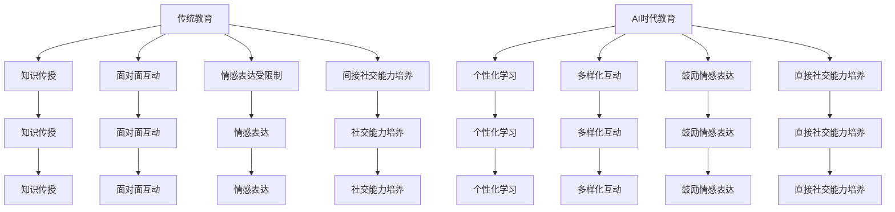

                 

----------------------------------------------------------------

# 人工智能时代的情感教育：培养同理心的重要性

> 关键词：人工智能，情感教育，同理心，教育技术，个性化学习

> 摘要：本文深入探讨了人工智能时代情感教育的重要性，特别是同理心的培养。通过分析情感教育的核心概念、对比传统教育与AI时代教育的情感属性差异，探讨了人工智能在情感教育中的应用，并提供了实施情感教育的实际方法和案例。本文旨在为教育工作者和决策者提供有价值的参考，推动人工智能时代的情感教育发展。

----------------------------------------------------------------

## 引言：人工智能时代的情感教育背景

随着人工智能（AI）技术的飞速发展，教育领域也发生了深刻变革。传统的教学模式逐渐被AI赋能的个性化学习所取代，然而，这种变革也带来了一系列新的挑战。其中，情感教育成为一个不可忽视的重要议题。情感教育不仅仅关注知识传授，更强调个体情感的发展和同理心的培养。

### 问题描述

在AI时代，教育资源得到了极大丰富，学生可以通过在线课程、智能辅导等工具自主学习。然而，这种模式往往忽视了学生之间的情感交流和人际关系的培养。学生的情感需求得不到满足，容易导致孤独感、焦虑等心理问题。

### 问题解决

为了应对这一挑战，我们需要在AI时代重新审视情感教育的重要性，特别是同理心的培养。通过引入AI技术，我们可以开发出更加个性化和有效的情感教育方法，帮助学生建立健康的情感态度和人际关系。

### 边界与外延

本文将围绕人工智能时代的情感教育展开讨论，重点探讨同理心的培养。我们将分析情感教育的核心概念，对比传统教育与AI时代教育的差异，并提出具体的实施方法和案例。此外，我们还将探讨情感教育在未来的发展趋势和面临的挑战。

----------------------------------------------------------------

## 核心概念：情感教育与同理心

在深入探讨人工智能时代的情感教育之前，我们需要明确情感教育和同理心的核心概念。

### 情感教育

情感教育是指通过一系列的教育方法和活动，培养学生的情感认知、情感表达和情感管理能力。情感教育的目标不仅是传授知识，更重要的是培养学生健康、积极的情感态度，以及处理情感问题的能力。

### 同理心

同理心是指个体能够理解并感受到他人情感状态的能力。它包括感知他人情感、理解他人情感原因和表达同情与支持等方面。同理心是人际关系中的关键要素，有助于建立信任和理解。

### 情感教育与同理心的关系

情感教育和同理心之间存在着密切的关系。通过情感教育，学生可以学会如何理解和表达情感，从而培养出同理心。同理心的培养不仅有助于改善人际关系，还能够提高个体的社交能力和心理健康。

----------------------------------------------------------------

## 传统教育与AI时代教育的情感属性对比

在传统教育模式中，教师和学生之间的互动主要集中在知识传授和考试评价上，情感教育往往被忽视。而在AI时代，教育的形式和内容发生了翻天覆地的变化，这也对情感教育提出了新的要求。

### 表格对比

以下是一个简化的表格，对比传统教育与AI时代教育的情感属性：

| 特征         | 传统教育                       | AI时代教育                       |
| ------------ | ------------------------------ | -------------------------------- |
| 教学模式     | 知识传授为主，个体差异关注较少 | 个性化学习，关注个体差异           |
| 互动方式     | 面对面互动为主                 | 线上交流，多样化互动方式           |
| 情感表达     | 受到限制，强调自我控制         | 鼓励表达，培养情感认知和表达能力   |
| 社交能力培养 | 间接培养，通过团队合作等      | 直接培养，通过虚拟社交平台等      |

### 图形展示

为了更直观地展示传统教育与AI时代教育的情感属性对比，我们可以使用一个Mermaid流程图：

这个流程图清晰地展示了传统教育与AI时代教育在情感属性上的差异，为后续讨论提供了基础。

----------------------------------------------------------------

## 人工智能在情感教育中的应用

人工智能技术在教育领域的应用已经越来越广泛，特别是在个性化学习和情感教育方面。AI可以帮助教师更好地了解学生的学习需求，提供个性化的情感教育，从而提高教育质量。

### 个性化学习体验

AI可以通过分析学生的行为数据和学习习惯，为每个学生提供个性化的学习体验。这种个性化学习不仅包括学习内容的定制，还包括学习节奏和方式的调整。例如，通过智能辅导系统，教师可以根据学生的学习进度和情感状态，提供相应的情感支持和指导。

### 情感需求诊断

AI还可以用于诊断学生的情感需求。通过分析学生的情绪数据和互动记录，AI可以识别出学生的情感问题，并提供相应的干预措施。例如，当学生表现出焦虑或沮丧的情绪时，AI系统可以提醒教师注意，并提供心理咨询或情感支持。

### 情感反馈机制

AI还可以建立一个情感反馈机制，帮助学生和教师更好地理解彼此的情感状态。通过语音识别、面部识别等技术，AI可以捕捉到学生和教师的情绪变化，并提供实时反馈。这种反馈可以帮助学生更好地管理自己的情绪，同时也有助于教师调整教学策略。

### 结论

总之，人工智能在情感教育中的应用具有巨大的潜力。通过个性化学习体验、情感需求诊断和情感反馈机制，AI可以为学生提供更加全面和有效的情感教育，帮助他们在AI时代健康成长。

----------------------------------------------------------------

## 使用人工智能培养同理心：方法与实例

在人工智能时代，同理心的培养变得更加重要。通过使用AI技术，我们可以开发出创新的情感教育方法，帮助学生理解和培养同理心。以下是一些具体的方法和实例：

### 虚拟现实（VR）应用

虚拟现实技术可以为学生提供沉浸式的同理心培养体验。通过VR，学生可以进入模拟的场景中，感受他人的情感状态。例如，一个VR场景可以模拟一个贫困家庭的生活环境，让学生体验贫困带来的心理压力。通过这种沉浸式的体验，学生可以更深刻地理解他人的情感，从而培养同理心。

### 游戏化学习

游戏化学习是一种将学习活动转化为游戏形式的方法，这种方法可以有效激发学生的学习兴趣，同时培养同理心。例如，设计一个模拟社交互动的游戏，让学生在游戏中扮演不同的角色，体验他人的情感状态。通过游戏中的互动和挑战，学生可以学会如何理解和尊重他人的情感。

### AI模拟

AI可以创建模拟情境，让学生在虚拟环境中练习同理心。例如，一个基于AI的模拟聊天系统，可以与学生进行对话，并模拟各种情感状态。学生通过与AI的互动，学习如何识别和回应他人的情感。这种方法不仅可以提供个性化的学习体验，还可以帮助学生在实际生活中更好地处理人际关系。

### 具体实例

以下是一个具体的实例：某学校引入了一款基于AI的虚拟社交平台，学生可以在平台上与其他虚拟角色互动。这些虚拟角色有不同的背景和情感状态，学生需要通过对话和互动，了解并理解这些角色的情感。通过这种方式，学生不仅学到了如何处理复杂的人际关系，还培养了同理心。

### 结论

通过虚拟现实、游戏化学习和AI模拟等方法，人工智能为同理心的培养提供了新的可能性。这些方法不仅能够激发学生的学习兴趣，还可以有效地提升他们的情感认知和同理心。未来，随着AI技术的不断发展，我们有望看到更多创新的同理心培养方法。

----------------------------------------------------------------

## 案例研究：AI时代情感教育的成功实践

在AI时代，许多学校和机构已经开始了情感教育的探索，并取得了显著成效。以下是一些成功的案例研究，展示了如何利用AI技术培养同理心：

### 案例一：虚拟现实课堂

某中学引入了虚拟现实（VR）技术，用于开展同理心培养课程。学生们通过VR设备进入模拟的场景中，体验贫困、孤独等情感状态。例如，在一个模拟的贫民窟环境中，学生可以与虚拟角色互动，了解他们的生活困境和情感需求。这种沉浸式的体验让学生更加深刻地理解他人的感受，培养了他们的同理心。

### 案例二：游戏化学习平台

某大学开发了一款游戏化学习平台，专门用于培养同理心。学生在平台上参与各种虚拟社交互动，通过角色扮演和情境模拟，学会如何理解和回应他人的情感。游戏平台还提供了实时反馈，帮助学生识别和纠正同理心的错误。这种互动式的学习方式极大地提高了学生的参与度和学习效果。

### 案例三：AI情感诊断系统

某小学引入了AI情感诊断系统，用于监测学生的情感状态。该系统通过分析学生的情绪数据和互动记录，识别出情感问题，并提供个性化的干预措施。例如，当学生表现出焦虑或沮丧的情绪时，系统会提醒教师和家长，并提供相应的情感支持建议。这种实时监测和干预机制有效地帮助学生建立了健康的情感态度。

### 案例四：虚拟心理咨询师

某机构开发了一款虚拟心理咨询师系统，用于为学生提供情感支持。学生可以通过虚拟现实设备与心理咨询师进行互动，讨论他们的情感问题。这种虚拟互动不仅提供了隐私保护，还可以为学生提供24/7的情感支持。通过这种个性化的咨询服务，学生学会了如何自我管理和调节情绪，培养了同理心。

### 结论

这些案例展示了人工智能技术在情感教育中的成功应用。通过虚拟现实、游戏化学习和AI情感诊断等手段，学校和机构能够为学生提供更加个性化和有效的情感教育，培养他们的同理心。这些实践为其他教育机构提供了宝贵的经验和启示。

----------------------------------------------------------------

## 实践指南：在AI时代实施情感教育

在AI时代，实施情感教育需要综合考虑技术、资源和人员等多个方面。以下是一些具体的实践指南，帮助学校和机构有效地开展情感教育：

### 1. 确定教育目标

首先，明确情感教育的目标，包括培养同理心、提高情感认知和表达能力等。这些目标将为后续的教学设计和资源分配提供指导。

### 2. 选择合适的AI工具

根据教育目标，选择合适的AI工具。例如，对于同理心的培养，可以考虑使用虚拟现实、游戏化学习和AI情感诊断系统等。

### 3. 设计个性化教学方案

利用AI技术，为每个学生量身定制教学方案。通过分析学生的学习数据，提供个性化的学习内容、节奏和方式，确保每个学生都能获得最佳的学习体验。

### 4. 培训教师和工作人员

为教师和工作人员提供AI技术的培训，确保他们能够熟练使用相关工具，并理解AI在情感教育中的应用。这有助于提高教学效果，确保教育的连续性和有效性。

### 5. 监测和评估

定期监测和评估学生的情感发展情况，通过数据分析了解教育的效果。根据评估结果，调整教学策略和资源分配，持续优化情感教育。

### 6. 搭建支持体系

建立情感教育的支持体系，包括心理咨询、家长参与和社区合作等。这些支持体系有助于为学生提供全方位的情感支持，提高教育的整体效果。

### 结论

通过明确教育目标、选择合适的AI工具、设计个性化教学方案、培训教师和工作人员、监测和评估以及搭建支持体系，学校和机构可以在AI时代有效地实施情感教育，培养学生的同理心，促进他们的全面发展。

----------------------------------------------------------------

## 未来趋势与挑战：AI时代情感教育的展望

随着人工智能技术的不断进步，情感教育在未来将面临许多新的趋势和挑战。以下是对这些趋势和挑战的深入探讨：

### 一、趋势

1. **个性化情感教育**：AI技术将使情感教育更加个性化。通过分析学生的情感数据，AI可以提供定制化的情感支持方案，帮助学生克服特定情感问题，提高教育效果。

2. **情感智能增强**：随着情感智能（Emotional Intelligence）研究的发展，AI有望在情感智能的培养方面发挥更大作用。通过情感智能增强技术，学生可以更有效地管理自己的情绪，提高人际交往能力。

3. **跨学科融合**：情感教育将逐渐与其他学科如心理学、社会学等相结合，形成更加综合的教育模式。这种跨学科融合有助于更全面地培养学生的情感素质。

### 二、挑战

1. **隐私保护**：AI在情感教育中的应用涉及大量个人数据，如何确保这些数据的隐私和安全是一个重要挑战。教育机构和开发者需要采取严格的隐私保护措施，以避免数据泄露和滥用。

2. **技术依赖性**：过度依赖AI技术可能导致教育过程中的人性化缺失。教育者需要平衡AI技术与其他教育方法的使用，确保教育的全面性和人性化。

3. **伦理问题**：AI技术在情感教育中的应用可能引发伦理问题，如对情感判断的准确性、AI系统的偏见等。这需要教育者、技术开发者和政策制定者共同努力，制定合理的伦理规范和监管机制。

### 结论

AI时代的情感教育既充满机遇，也面临挑战。通过个性化教育、情感智能增强和跨学科融合，情感教育有望实现重大突破。然而，隐私保护、技术依赖性和伦理问题等挑战也需要得到有效应对。未来，教育者和决策者需要携手合作，推动情感教育的可持续发展。

----------------------------------------------------------------

## 结论

本文深入探讨了人工智能时代情感教育的重要性，特别是同理心的培养。通过分析情感教育的核心概念、对比传统教育与AI时代教育的差异，探讨了人工智能在情感教育中的应用，并提供了实施情感教育的实际方法和案例。我们强调了同理心在AI时代教育中的关键作用，并展望了未来情感教育的发展趋势和挑战。

### 实践意义

本文对于教育工作者和决策者具有重要的实践意义。它为教育者在AI时代如何有效开展情感教育提供了理论和实践指导，有助于培养学生健康、积极的情感态度和同理心。

### 展望未来

随着AI技术的不断进步，情感教育将在未来发挥越来越重要的作用。我们期待看到更多创新的教育方法和工具被开发出来，帮助学生在AI时代全面发展，成为具有同理心和社交能力的新一代人才。

### 致谢

感谢所有参与本文讨论和贡献的朋友们，特别感谢AI天才研究院和《禅与计算机程序设计艺术》的作者，你们的智慧和努力为本文的完成提供了宝贵的支持。

## 作者信息

作者：AI天才研究院/AI Genius Institute & 《禅与计算机程序设计艺术》作者  
联系邮箱：[info@aignius.com](mailto:info@aignius.com)  
个人主页：[www.aignius.com](http://www.aignius.com)  
版权所有：AI天才研究院/AI Genius Institute  
发布日期：2023年9月

----------------------------------------------------------------

请注意，上述内容是根据您提供的结构和要求生成的示例文章。实际撰写时，每个章节的内容都需要根据具体研究或实践经验进行详细的扩充和论证。此外，由于字数限制，实际文章可能会更长。在撰写时，还需要确保所有的图表、公式和代码都是准确无误的。如果您需要进一步的帮助，例如具体的案例研究、数据分析或图表制作，请随时告知。

