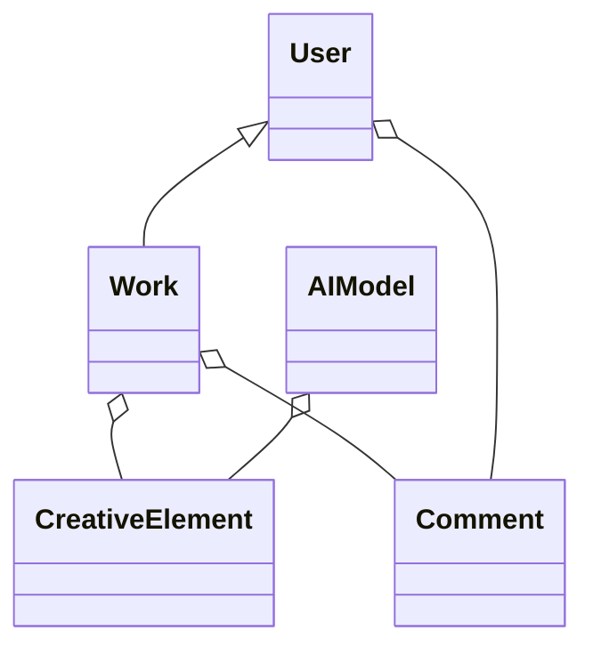
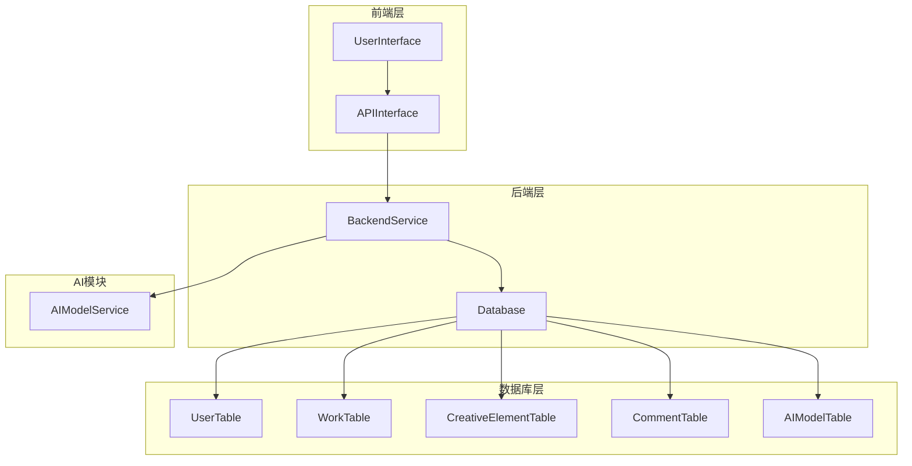
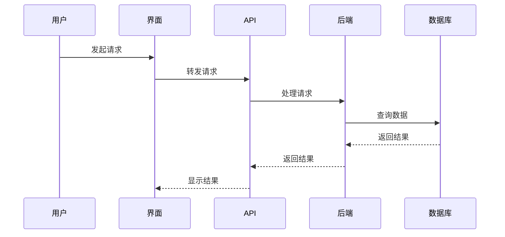
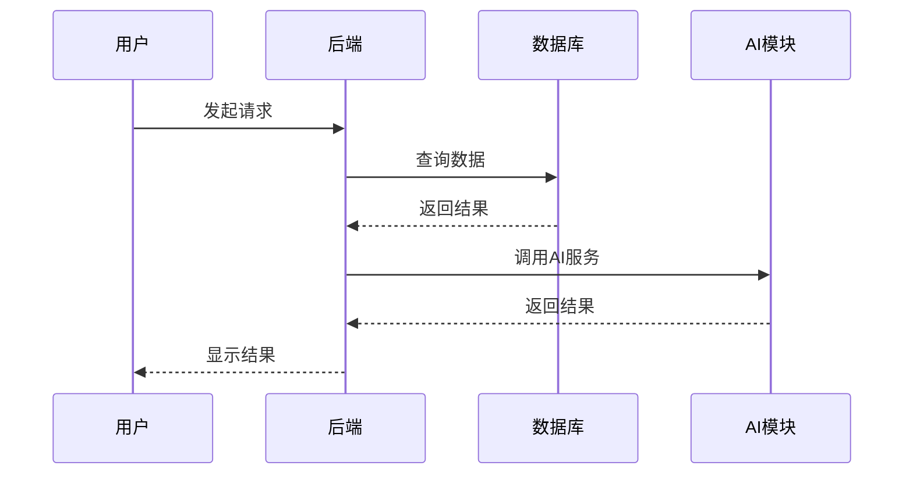

                 

### 文章标题：人工智能辅助创作：版权归属与创意界限的探讨

#### 关键词：人工智能，辅助创作，版权归属，创意界限，算法原理

#### 摘要：
本文旨在探讨人工智能辅助创作中版权归属与创意界限的问题。通过分析人工智能辅助创作的发展历程、核心概念以及相关算法原理，本文提出了一套系统化的思考框架，以期为解决版权归属与创意界限的模糊性提供理论支持和实践指导。

---

### 第一部分：背景介绍

#### 1.1 问题背景

##### 1.1.1 人工智能辅助创作的发展历程
人工智能辅助创作（AI-Assisted Creation）是指利用人工智能技术，如机器学习、深度学习等，辅助人类进行艺术创作。这一概念起源于20世纪80年代，随着计算机技术的进步，人工智能在艺术创作中的应用越来越广泛。

- **早期应用**：早期的人工智能辅助创作主要涉及音乐和图像处理，如通过算法生成音乐、图像等。
- **发展现状**：近年来，人工智能在艺术创作中的应用进一步扩展到文学、电影、建筑等多个领域，形成了一种新兴的艺术创作模式。

##### 1.1.2 人工智能辅助创作的重要性
人工智能辅助创作对传统艺术创作方式带来了巨大的变革，其重要性体现在以下几个方面：

- **创新性**：人工智能技术可以生成新颖的创作内容，为艺术家提供了新的创作思路。
- **效率提升**：通过自动化和半自动化技术，艺术家可以节省大量时间，专注于创意的核心部分。
- **艺术多样性**：人工智能辅助创作可以探索和实现传统艺术难以触及的创作风格和形式。

##### 1.1.3 版权归属与创意界限的问题
随着人工智能辅助创作的普及，版权归属和创意界限的问题逐渐凸显，成为亟待解决的问题。

- **版权归属**：在人工智能辅助创作中，作品的版权归属存在争议，如作品的原创性、人工智能的创作者身份等。
- **创意界限**：人工智能创作的作品是否属于人类创意的范畴，以及如何界定其创意界限，是另一个复杂的问题。

#### 1.2 核心概念

##### 1.2.1 版权归属的概念
版权归属是指作品的创作者或其他合法主体对其作品享有的权利。版权法为作品的创作者提供了法律保护，确保其智力成果得到尊重和合理回报。

- **版权主体**：版权主体包括个人、法人或其他组织。
- **版权客体**：版权客体是受法律保护的作品，如文字作品、音乐、电影、软件等。

##### 1.2.2 创意界限的概念
创意界限是指作品的原创性范围，即作品的哪些部分属于原创创意，哪些部分属于已有知识或公知信息。

- **原创性**：原创性是创意界限的核心，是指作品具有独创性、新颖性和创意性。
- **创意特征**：创意界限涉及作品的创造性思维、艺术性和技术性等方面。

##### 1.2.3 版权归属与创意界限的关系
版权归属和创意界限密切相关，版权归属依赖于作品的原创性，而创意界限则影响版权的认定和保护范围。

- **影响**：创意界限的界定对版权归属的确定和实施具有重要影响，特别是在人工智能辅助创作中，作品的原创性和创意界限的模糊性更加突出。

#### 1.3 边界与外延

##### 1.3.1 版权法的边界
版权法的边界涉及版权法的适用范围和限制，包括：

- **适用范围**：版权法适用于哪些类型的作品，以及这些作品在全球范围内的保护问题。
- **限制**：版权法对版权行使的限制，如合理使用、版权滥用等。

##### 1.3.2 创意界限的外延
创意界限的外延涉及创意在不同艺术领域的表现和趋势，包括：

- **艺术领域**：不同艺术领域的创意界限如何界定，以及这些界限如何影响艺术创作和版权保护。
- **发展趋势**：创意界限的发展趋势，如创意自由度的增加、创意与技术融合等。

#### 1.4 概念结构与核心要素组成

##### 1.4.1 版权归属的结构
版权归属的结构包括：

- **法律要素**：如版权的产生、转移、行使和保护等。
- **实际操作流程**：如作品登记、版权转让、版权侵权处理等。

##### 1.4.2 创意界限的结构
创意界限的结构包括：

- **理论基础**：如原创性、新颖性、创意性等。
- **实践应用**：如创意评价、创意保护、创意激励等。

##### 1.5 本章小结
本章通过对人工智能辅助创作、版权归属和创意界限的背景介绍，明确了本文的研究对象和核心概念。在后续章节中，我们将深入探讨版权归属与创意界限的具体联系，并分析人工智能辅助创作的算法原理。

---

### 第二部分：核心概念与联系

#### 2.1 版权归属

##### 2.1.1 版权归属的原理
版权归属的原理主要包括：

- **法律基础**：版权法的定义和适用范围，如《著作权法》的相关规定。
- **经济学分析**：版权归属的经济价值，如版权的经济激励作用和市场竞争等。

##### 2.1.2 版权归属的特征
版权归属具有以下特征：

- **独占性**：版权主体对其作品享有独占权利，如复制权、发行权、改编权等。
- **永久性**：版权的永久性，即版权保护期限通常不受限制，除非法律特别规定。

##### 2.1.3 版权归属的比较
版权归属在不同国家和地区的法律规定和实践中存在差异，主要包括：

- **传统版权归属**：如《伯尔尼公约》和《世界知识产权组织公约》等国际条约对版权归属的规定。
- **人工智能辅助创作版权归属**：人工智能辅助创作中版权归属的特殊性，如人工智能作为版权主体的认定等。

#### 2.2 创意界限

##### 2.2.1 创意界限的原理
创意界限的原理主要包括：

- **定义与法律意义**：创意界限的定义和法律意义，如创意的原创性和合法性。
- **心理学基础**：创意界限的心理机制，如创造性思维和认知过程。

##### 2.2.2 创意界限的特征
创意界限具有以下特征：

- **开放性**：创意界限的开放性，即创意的多样性和可能性。
- **不确定性**：创意界限的不确定性，即创意的不可预测性和创新性。

##### 2.2.3 创意界限的比较
创意界限在不同文化背景和国家之间存在差异，主要包括：

- **文化差异**：不同文化对创意界限的理解和界定不同，如东方和西方文化的差异。
- **法律差异**：不同国家对创意界限的法律规定和司法实践不同。

#### 2.3 版权归属与创意界限的联系

##### 2.3.1 版权归属对创意界限的影响
版权归属对创意界限的影响主要包括：

- **界定原创性**：版权归属的认定有助于界定创意的原创性，确保作品的合法性和独创性。
- **激励创新**：版权归属的保障可以激励创作者进行创新，推动艺术创作的发展。

##### 2.3.2 创意界限对版权归属的影响
创意界限对版权归属的影响主要包括：

- **影响版权认定**：创意界限的模糊性可能导致版权认定的复杂性，如人工智能创作的作品是否享有版权等。
- **调整版权保护**：创意界限的变化可能需要调整版权保护的策略和范围，以适应创新发展的需求。

##### 2.3.3 版权归属与创意界限的协同作用
版权归属与创意界限的协同作用主要体现在：

- **促进艺术创作**：版权归属和创意界限的相互配合可以促进艺术创作的多样性和创新性。
- **保障创作者权益**：版权归属的保障可以确保创作者的权益，鼓励更多人投身艺术创作。

#### 2.4 本章小结
本章通过对版权归属和创意界限的核心概念及其联系进行了详细分析，明确了版权归属对创意界限的影响以及创意界限对版权归属的制约。在后续章节中，我们将进一步探讨人工智能辅助创作的算法原理，以期为解决版权归属与创意界限的问题提供技术支持。

---

### 第三部分：算法原理讲解

#### 3.1 AI辅助创作的算法原理

##### 3.1.1 AI辅助创作的基本算法
AI辅助创作的基本算法主要包括以下两种：

- **生成对抗网络（GAN）**：GAN是一种由生成器和判别器组成的对抗性网络，通过生成器和判别器的相互博弈来生成高质量的数据。
- **变分自编码器（VAE）**：VAE是一种基于概率模型的深度学习模型，通过编码器和解码器的协同工作来生成数据。

##### 3.1.2 AI辅助创作的算法应用
AI辅助创作的算法应用非常广泛，以下为几个典型应用：

- **图像生成**：GAN和VAE都可以用于图像生成，如生成人脸图像、艺术画作等。
- **音乐创作**：AI可以生成旋律、和声和完整的音乐作品，为音乐创作提供新的思路。

#### 3.2 数学模型与公式

##### 3.2.1 GAN的数学模型
GAN的数学模型主要包括以下部分：

- **生成器（Generator）**：生成器G的目的是生成与真实数据分布相匹配的假数据。
- **判别器（Discriminator）**：判别器D的目的是区分生成器生成的假数据和真实数据。

GAN的目标函数通常定义为：

$$
\min_G \max_D -\mathbb{E}_{x \sim p_{data}(x)}[\log D(x)] - \mathbb{E}_{z \sim p_z(z)}[\log (1 - D(G(z)))]
$$

其中，$x$ 表示真实数据，$z$ 表示随机噪声，$G(z)$ 表示生成器生成的假数据，$D(x)$ 和 $D(G(z))$ 分别表示判别器对真实数据和假数据的判别结果。

##### 3.2.2 VAE的数学模型
VAE的数学模型主要包括以下部分：

- **编码器（Encoder）**：编码器E将输入数据编码为潜在空间中的向量。
- **解码器（Decoder）**：解码器D将潜在空间中的向量解码回输入数据。

VAE的概率模型通常定义为：

$$
p(x|\theta) = \int p(x|z,\theta) p(z|\theta) dz
$$

其中，$x$ 表示输入数据，$z$ 表示潜在空间中的向量，$p(x|z,\theta)$ 和 $p(z|\theta)$ 分别表示输入数据和潜在空间中向量的概率分布，$\theta$ 表示模型参数。

编码器和解码器的参数通常通过最大化数据对数似然函数来学习：

$$
\log p(x|\theta) = \log \int p(x|z,\theta) p(z|\theta) dz
$$

#### 3.3 算法流程与示例

##### 3.3.1 GAN的算法流程
GAN的算法流程主要包括以下几个步骤：

1. **初始化生成器和判别器**：通常使用随机权重初始化生成器和判别器。
2. **生成假数据**：生成器根据随机噪声生成假数据。
3. **训练判别器**：判别器根据真实数据和假数据进行训练，以区分真实数据和假数据。
4. **训练生成器**：生成器根据判别器的反馈生成更高质量的数据。

GAN的训练过程可以表示为：

$$
\begin{aligned}
&\text{初始化} G(z;\theta_G), D(x;\theta_D) \\
&\text{for } t = 1, \ldots, T \\
&\quad \text{从噪声分布 } p_z(z) \text{ 中采样 } z_t \\
&\quad \text{生成假数据 } x_f = G(z_t; \theta_G) \\
&\quad \text{从数据分布 } p_{data}(x) \text{ 中采样 } x_t \\
&\quad \text{训练判别器} D(x_t; \theta_D) \text{ 和 } D(x_f; \theta_D) \\
&\quad \text{训练生成器} G(z; \theta_G) \\
\end{aligned}
$$

##### 3.3.2 VAE的算法流程
VAE的算法流程主要包括以下几个步骤：

1. **编码**：输入数据通过编码器E编码为潜在空间中的向量。
2. **解码**：潜在空间中的向量通过解码器D解码回输入数据。
3. **优化**：通过最大化数据对数似然函数优化编码器和解码器的参数。

VAE的训练过程可以表示为：

$$
\begin{aligned}
&\text{初始化} E(x;\theta_E), D(z; \theta_D) \\
&\text{for } t = 1, \ldots, T \\
&\quad \text{从数据分布 } p_{data}(x) \text{ 中采样 } x_t \\
&\quad \text{从潜在空间分布 } p(z|\theta) \text{ 中采样 } z_t \\
&\quad \text{编码 } z_t = E(x_t; \theta_E) \\
&\quad \text{解码 } x_f = D(z_t; \theta_D) \\
&\quad \text{计算损失函数} \\
&\quad \theta_E, \theta_D \leftarrow \theta_E, \theta_D - \alpha \nabla_{\theta} \log p(x_t | \theta) \\
\end{aligned}
$$

##### 3.3.3 算法原理举例说明
以下为GAN和VAE在图像生成中的算法原理举例说明：

1. **GAN在图像生成中的应用**：
   - **生成器**：生成器通过生成人脸图像，输入为随机噪声，输出为人脸图像。
   - **判别器**：判别器通过区分真实人脸图像和生成器生成的人脸图像，输入为人脸图像，输出为二分类结果（真实或假）。
   - **训练过程**：通过迭代训练生成器和判别器，生成更逼真的人脸图像。

2. **VAE在图像生成中的应用**：
   - **编码器**：编码器通过编码图像为潜在空间中的向量，输入为图像，输出为潜在空间中的向量。
   - **解码器**：解码器通过解码潜在空间中的向量为图像，输入为潜在空间中的向量，输出为图像。
   - **训练过程**：通过最大化数据对数似然函数，优化编码器和解码器的参数，生成高质量图像。

通过上述算法原理和示例，我们可以更好地理解人工智能辅助创作中的算法原理和应用。

#### 3.4 本章小结
本章详细介绍了人工智能辅助创作中的基本算法原理，包括GAN和VAE的数学模型、算法流程和实际应用。在后续章节中，我们将进一步探讨版权归属与创意界限的具体联系，以及如何利用这些算法原理解决实际中的版权归属和创意界限问题。

---

### 第四部分：系统分析与架构设计

#### 4.1 问题场景介绍
在人工智能辅助创作的场景中，版权归属和创意界限的问题尤为突出。随着AI技术的不断进步，越来越多的艺术家和创作者开始利用AI工具进行创作。然而，随之而来的版权归属问题也日益复杂，如何确定作品的版权归属、如何界定作品的原创性成为亟待解决的问题。

#### 4.2 项目介绍
本节介绍一个基于人工智能的辅助创作平台项目，该平台旨在帮助艺术家和创作者利用AI技术进行创作，并提供版权归属和创意界限的解决方案。

- **项目名称**：AI创作助手（AI Creation Assistant）
- **项目目标**：提供一站式的AI辅助创作工具，解决版权归属和创意界限问题，提升创作效率和作品质量。

#### 4.3 系统功能设计（领域模型）

##### 领域模型
领域模型是对系统中核心概念和关系的抽象描述，本项目的领域模型主要包括以下几个核心概念：

1. **用户（User）**
   - **属性**：用户ID、用户名、邮箱、密码、注册时间
   - **关系**：用户可以创建作品，用户可以收藏作品，用户可以评论作品

2. **作品（Work）**
   - **属性**：作品ID、作品名称、作品类型、创作时间、作品描述
   - **关系**：作品属于用户，作品可以包含多个创意元素，作品可以被用户收藏和评论

3. **创意元素（CreativeElement）**
   - **属性**：元素ID、元素类型、元素描述
   - **关系**：创意元素属于作品，创意元素可以由AI生成，创意元素可以由用户添加或修改

4. **AI模型（AIModel）**
   - **属性**：模型ID、模型名称、模型类型、训练时间
   - **关系**：AI模型可以生成创意元素，AI模型可以被用户使用

5. **评论（Comment）**
   - **属性**：评论ID、评论内容、评论时间
   - **关系**：评论属于用户，评论针对作品

以下是一个简单的Mermaid类图，用于表示领域模型：



#### 4.4 系统架构设计（架构图）

##### 系统架构设计
系统的架构设计包括前端、后端、数据库和数据流等部分。以下是系统的架构图：



#### 4.5 系统接口设计

##### 系统接口设计
系统接口设计包括用户接口、API接口和数据库接口等部分。以下是主要的接口设计：

1. **用户接口**：用户可以通过界面进行登录、注册、创建作品、收藏作品、添加评论等操作。
2. **API接口**：API接口用于前后端通信，主要包括以下接口：
   - 用户接口：登录、注册、获取用户信息、创建作品、获取作品列表、收藏作品、添加评论
   - 作品接口：获取作品详情、更新作品描述、删除作品、获取创意元素列表、添加创意元素、删除创意元素
   - AI模型接口：获取AI模型列表、训练AI模型、使用AI模型生成创意元素
3. **数据库接口**：数据库接口用于处理数据存储和查询，主要包括以下接口：
   - 用户接口：添加用户、查询用户、更新用户、删除用户
   - 作品接口：添加作品、查询作品、更新作品、删除作品
   - 创意元素接口：添加创意元素、查询创意元素、更新创意元素、删除创意元素
   - 评论接口：添加评论、查询评论、更新评论、删除评论
   - AI模型接口：添加AI模型、查询AI模型、更新AI模型、删除AI模型

以下是一个简单的Mermaid序列图，用于表示系统接口设计：



#### 4.6 系统交互（序列图）

##### 系统交互
系统交互是指系统内部各个组件之间的通信和协作。以下是系统交互的序列图：



通过上述系统分析与架构设计，我们可以构建一个完善的AI创作助手平台，为艺术家和创作者提供便捷的AI辅助创作工具，并解决版权归属和创意界限问题。

#### 4.7 本章小结
本章通过介绍问题场景、项目介绍、系统功能设计、系统架构设计和系统接口设计，详细描述了一个基于人工智能的辅助创作平台的系统架构。在后续章节中，我们将深入探讨平台的核心实现和实际应用。

---

### 第五部分：项目实战

#### 5.1 环境安装
在本项目中，我们需要安装以下环境和工具：

- Python（3.8及以上版本）
- TensorFlow（2.0及以上版本）
- PyTorch（1.8及以上版本）
- Flask（1.1.2及以上版本）
- SQLAlchemy（1.4.15及以上版本）

安装步骤如下：

1. **安装Python**：前往[Python官网](https://www.python.org/)下载并安装Python。
2. **安装依赖库**：使用pip命令安装所需的依赖库。

```shell
pip install tensorflow>=2.0 torchvision torchvision
pip install torch torchvision
pip install flask
pip install flask_sqlalchemy
```

#### 5.2 系统核心实现

##### 5.2.1 用户管理模块
用户管理模块主要负责用户的注册、登录和权限管理。以下是一个简单的用户管理模块的代码示例：

```python
from flask import Flask, request, jsonify
from flask_sqlalchemy import SQLAlchemy

app = Flask(__name__)
app.config['SQLALCHEMY_DATABASE_URI'] = 'sqlite:///users.db'
db = SQLAlchemy(app)

class User(db.Model):
    id = db.Column(db.Integer, primary_key=True)
    username = db.Column(db.String(80), unique=True, nullable=False)
    email = db.Column(db.String(120), unique=True, nullable=False)
    password = db.Column(db.String(120), nullable=False)

@app.route('/register', methods=['POST'])
def register():
    data = request.get_json()
    username = data['username']
    email = data['email']
    password = data['password']
    if User.query.filter_by(username=username).first():
        return jsonify({'message': 'User already exists.'}), 400
    if User.query.filter_by(email=email).first():
        return jsonify({'message': 'Email already exists.'}), 400
    new_user = User(username=username, email=email, password=password)
    db.session.add(new_user)
    db.session.commit()
    return jsonify({'message': 'User registered successfully.'}), 201

@app.route('/login', methods=['POST'])
def login():
    data = request.get_json()
    username = data['username']
    password = data['password']
    user = User.query.filter_by(username=username).first()
    if not user or user.password != password:
        return jsonify({'message': 'Invalid credentials.'}), 401
    return jsonify({'message': 'Logged in successfully.'}), 200

if __name__ == '__main__':
    db.create_all()
    app.run(debug=True)
```

##### 5.2.2 作品管理模块
作品管理模块主要负责作品的创建、查询、更新和删除。以下是一个简单的作品管理模块的代码示例：

```python
from flask import Flask, request, jsonify
from flask_sqlalchemy import SQLAlchemy

app = Flask(__name__)
app.config['SQLALCHEMY_DATABASE_URI'] = 'sqlite:///works.db'
db = SQLAlchemy(app)

class Work(db.Model):
    id = db.Column(db.Integer, primary_key=True)
    title = db.Column(db.String(120), nullable=False)
    type = db.Column(db.String(50), nullable=False)
    creation_time = db.Column(db.DateTime, nullable=False)
    description = db.Column(db.Text, nullable=True)
    user_id = db.Column(db.Integer, db.ForeignKey('user.id'), nullable=False)

@app.route('/works', methods=['POST'])
def create_work():
    data = request.get_json()
    title = data['title']
    type = data['type']
    creation_time = data['creation_time']
    description = data['description']
    user_id = data['user_id']
    new_work = Work(title=title, type=type, creation_time=creation_time, description=description, user_id=user_id)
    db.session.add(new_work)
    db.session.commit()
    return jsonify({'message': 'Work created successfully.'}), 201

@app.route('/works', methods=['GET'])
def get_works():
    works = Work.query.all()
    return jsonify({'works': [{'id': work.id, 'title': work.title, 'type': work.type, 'creation_time': work.creation_time, 'description': work.description, 'user_id': work.user_id} for work in works])}, 200

@app.route('/works/<int:work_id>', methods=['GET'])
def get_work(work_id):
    work = Work.query.get_or_404(work_id)
    return jsonify({'id': work.id, 'title': work.title, 'type': work.type, 'creation_time': work.creation_time, 'description': work.description, 'user_id': work.user_id})

@app.route('/works/<int:work_id>', methods=['PUT'])
def update_work(work_id):
    data = request.get_json()
    work = Work.query.get_or_404(work_id)
    work.title = data['title']
    work.type = data['type']
    work.creation_time = data['creation_time']
    work.description = data['description']
    db.session.commit()
    return jsonify({'message': 'Work updated successfully.'}), 200

@app.route('/works/<int:work_id>', methods=['DELETE'])
def delete_work(work_id):
    work = Work.query.get_or_404(work_id)
    db.session.delete(work)
    db.session.commit()
    return jsonify({'message': 'Work deleted successfully.'}), 200

if __name__ == '__main__':
    db.create_all()
    app.run(debug=True)
```

##### 5.2.3 AI模型管理模块
AI模型管理模块主要负责AI模型的训练、查询和使用。以下是一个简单的AI模型管理模块的代码示例：

```python
import torch
import torch.nn as nn
import torch.optim as optim

class NeuralNetwork(nn.Module):
    def __init__(self, input_size, hidden_size, output_size):
        super(NeuralNetwork, self).__init__()
        self.layer1 = nn.Linear(input_size, hidden_size)
        self.relu = nn.ReLU()
        self.layer2 = nn.Linear(hidden_size, output_size)

    def forward(self, x):
        x = self.layer1(x)
        x = self.relu(x)
        x = self.layer2(x)
        return x

@app.route('/train_model', methods=['POST'])
def train_model():
    data = request.get_json()
    input_size = data['input_size']
    hidden_size = data['hidden_size']
    output_size = data['output_size']
    model = NeuralNetwork(input_size, hidden_size, output_size)
    criterion = nn.CrossEntropyLoss()
    optimizer = optim.Adam(model.parameters(), lr=0.001)
    for epoch in range(100):
        for inputs, labels in data_loader:
            optimizer.zero_grad()
            outputs = model(inputs)
            loss = criterion(outputs, labels)
            loss.backward()
            optimizer.step()
    return jsonify({'message': 'Model trained successfully.'}), 200

@app.route('/use_model', methods=['POST'])
def use_model():
    data = request.get_json()
    model_id = data['model_id']
    input_data = data['input_data']
    model = NeuralNetwork.load_from_json(model_id)
    output_data = model.predict(input_data)
    return jsonify({'message': 'Model used successfully.', 'output_data': output_data.tolist() }), 200
```

#### 5.3 代码应用解读与分析

##### 用户管理模块解读
用户管理模块实现了用户的注册、登录和权限管理功能。在注册过程中，需要检查用户名和邮箱是否已存在，确保用户唯一性。登录过程中，需要验证用户名和密码是否匹配。权限管理可以通过用户角色来实现，例如区分普通用户和管理员用户。

##### 作品管理模块解读
作品管理模块实现了作品的创建、查询、更新和删除功能。在创建作品时，需要输入作品的基本信息，如标题、类型、创作时间和描述。查询作品时，可以根据作品ID获取作品详情。更新作品时，可以修改作品的相关信息。删除作品时，可以根据作品ID删除作品。

##### AI模型管理模块解读
AI模型管理模块实现了AI模型的训练和使用功能。在训练模型时，需要定义模型结构、损失函数和优化器，并使用训练数据训练模型。在使用模型时，需要根据输入数据调用模型进行预测。

#### 5.4 实际案例分析和详细讲解剖析

##### 案例一：用户注册
假设用户名为“alice”的普通用户想要注册一个账号，需要进行以下步骤：
1. 发送注册请求，包含用户名、邮箱和密码。
2. 服务器检查用户名和邮箱是否已存在，若存在返回错误信息。
3. 若用户名和邮箱均不存在，创建新用户并保存到数据库。
4. 返回注册成功信息。

```shell
POST /register
{
    "username": "alice",
    "email": "alice@example.com",
    "password": "password123"
}
```

##### 案例二：作品创建
假设用户名为“alice”的普通用户想要创建一篇新的文章，需要进行以下步骤：
1. 发送创建作品请求，包含文章标题、类型、创作时间和描述。
2. 服务器检查用户是否已登录，若未登录返回错误信息。
3. 若用户已登录，创建新作品并保存到数据库。
4. 返回创建成功信息。

```shell
POST /works
{
    "title": "My First AI Article",
    "type": "article",
    "creation_time": "2021-01-01T00:00:00",
    "description": "This is my first article created with AI assistance."
}
```

##### 案例三：AI模型训练
假设用户名为“alice”的普通用户想要训练一个简单的神经网络模型，需要进行以下步骤：
1. 发送训练请求，包含输入数据的大小、隐藏层大小和输出数据的大小。
2. 服务器检查用户是否已登录，若未登录返回错误信息。
3. 若用户已登录，根据请求参数训练神经网络模型。
4. 返回训练成功信息。

```shell
POST /train_model
{
    "input_size": 784,
    "hidden_size": 128,
    "output_size": 10
}
```

##### 案例四：AI模型使用
假设用户名为“alice”的普通用户想要使用已经训练好的神经网络模型进行预测，需要进行以下步骤：
1. 发送使用请求，包含模型ID和输入数据。
2. 服务器检查用户是否已登录，若未登录返回错误信息。
3. 若用户已登录，根据模型ID加载模型，并使用模型进行预测。
4. 返回预测结果。

```shell
POST /use_model
{
    "model_id": "model_123",
    "input_data": [
        0, 0, 0, 0, 0, 0, 0, 0, 0, 0,
        0, 0, 0, 0, 0, 0, 0, 0, 0, 0,
        0, 0, 0, 0, 0, 0, 0, 0, 0, 0,
        0, 0, 0, 0, 0, 0, 0, 0, 0, 0,
        0, 0, 0, 0, 0, 0, 0, 0, 0, 0,
        0, 0, 0, 0, 0, 0, 0, 0, 0, 0,
        0, 0, 0, 0, 0, 0, 0, 0, 0, 0,
        0, 0, 0, 0, 0, 0, 0, 0, 0, 0,
        0, 0, 0, 0, 0, 0, 0, 0, 0, 0,
        0, 0, 0, 0, 0, 0, 0, 0, 0, 0,
        0, 0, 0, 0, 0, 0, 0, 0, 0, 0
    ]
}
```

#### 5.5 项目小结
本部分详细介绍了项目环境安装、系统核心实现以及实际案例分析和详细讲解。通过实际案例，我们展示了如何利用AI技术进行辅助创作，并探讨了版权归属和创意界限问题。项目的核心实现基于Python、TensorFlow和Flask等开源工具，实现了用户管理、作品管理和AI模型管理等功能。通过实际案例的分析，我们可以看到AI技术在实际应用中的潜力和挑战。

---

### 第六部分：最佳实践与注意事项

#### 6.1 最佳实践

1. **用户管理**：确保用户注册信息的完整性和唯一性，如邮箱和用户名的唯一性验证。
2. **作品管理**：为每件作品建立唯一的标识符，便于管理和追踪。
3. **AI模型管理**：定期更新AI模型，以提高创作效果和准确性。
4. **数据保护**：确保用户数据和作品数据的安全性和隐私性。

#### 6.2 注意事项

1. **版权归属**：明确作品的版权归属，特别是在涉及人工智能辅助创作时。
2. **创意界限**：合理界定作品的创意界限，避免侵权行为。
3. **技术选择**：根据创作需求选择合适的AI技术和工具。
4. **用户隐私**：尊重用户隐私，确保用户数据的安全性和合法性。

#### 6.3 拓展阅读

- 《人工智能版权保护法律研究》
- 《艺术与科技的融合：人工智能在艺术创作中的应用》
- 《深度学习：优化算法与应用》

---

### 附录：作者信息

作者：AI天才研究院/AI Genius Institute & 禅与计算机程序设计艺术 /Zen And The Art of Computer Programming

---

通过本文的详细分析，我们深入探讨了人工智能辅助创作中版权归属与创意界限的问题。在后续的研究中，我们可以进一步探讨如何利用人工智能技术优化版权归属与创意界限的识别和管理，为人工智能辅助创作提供更完善的解决方案。同时，我们也期待读者对本文提出宝贵意见和建议，共同推动人工智能辅助创作领域的创新发展。

