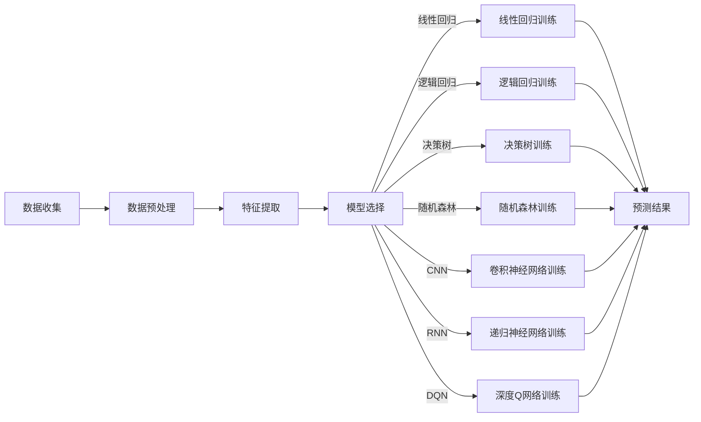
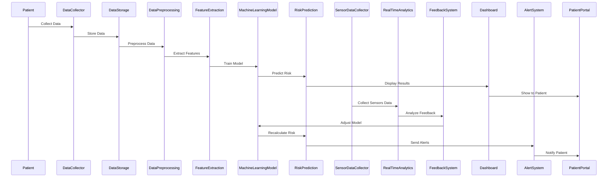
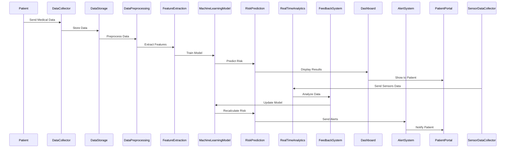

                 


### 引言

个性化医疗，作为现代医学领域的重要发展趋势，正逐渐改变着传统的医疗模式。随着生物技术、信息技术的迅猛发展，个性化医疗不仅提高了医疗服务的精准性和有效性，也大大提升了患者的满意度和治疗效果。而人工智能（AI）技术的引入，更是为个性化医疗注入了新的活力，使得个性化医疗方案制定变得更加智能和高效。

本文将深入探讨人工智能驱动的个性化医疗方案制定，通过逐步的分析和推理，旨在为广大读者提供一个清晰、系统的理解和应用框架。文章将分为以下几个部分：

1. **问题背景与核心概念介绍**：首先，我们将介绍个性化医疗的定义、起源与发展历程，以及核心概念和技术。
   
2. **人工智能在个性化医疗中的应用**：接下来，我们将探讨人工智能的基本概念、分类，以及它在个性化医疗中的具体应用场景和优势与挑战。

3. **个性化医疗的核心概念与联系**：我们将详细阐述个性化医疗的核心概念，并对比其属性特征，通过ER实体关系图来描述其系统架构。

4. **人工智能驱动的个性化医疗方案制定**：本文的核心部分，我们将介绍人工智能驱动的个性化医疗方案框架，以及相关的算法原理和数学模型。

5. **个性化医疗方案的系统分析与架构设计**：这部分将介绍个性化医疗方案的系统分析和架构设计，包括问题场景介绍、项目介绍、系统功能设计、系统架构设计和系统接口设计。

6. **个性化医疗方案的项目实战**：我们将通过一个实际项目，详细讲解环境安装、系统核心实现、代码应用解读、实际案例分析等。

7. **个性化医疗方案的最佳实践与拓展**：最后，我们将总结最佳实践，并提供相关的小结、注意事项和拓展阅读。

通过上述步骤的逐步分析和推理，我们希望能够帮助读者深入理解人工智能驱动的个性化医疗方案制定，为未来的研究和应用提供有益的参考。

## 第一部分：问题背景与核心概念介绍

### 第1章：个性化医疗概述

#### 1.1 个性化医疗的定义与意义

个性化医疗是一种以患者为中心，基于个体生物特征、遗传信息、生活方式和疾病状态的差异，为患者提供量身定制的医疗方案。其核心思想是打破传统医学的“一刀切”模式，通过精准诊断和个性化治疗，实现医疗服务的个性化和精准化。

个性化医疗的定义可以从以下几个方面进行解释：

- **以患者为中心**：个性化医疗关注患者的个体差异，充分考虑患者的年龄、性别、健康状况、生活方式等综合因素，为患者提供最适合的诊疗方案。
- **精准诊断**：通过基因检测、生物标志物检测等技术手段，对患者的疾病进行精准诊断，确定最佳的治疗方案。
- **个性化治疗**：根据患者的具体病情、基因特征、药物代谢等因素，为患者提供个性化的治疗方案，从而提高治疗效果和患者满意度。

个性化医疗的意义在于：

- **提高治疗效果**：通过精准的诊断和个性化的治疗，可以更好地满足患者的需求，提高治疗效果，减少不必要的治疗和副作用。
- **优化医疗资源**：个性化医疗有助于优化医疗资源的配置，减少重复检查和过度治疗，提高医疗资源的利用效率。
- **提升患者满意度**：个性化的医疗服务能够更好地满足患者的需求和期望，提高患者的满意度和信任度。

#### 1.2 个性化医疗的起源与发展历程

个性化医疗的起源可以追溯到20世纪90年代。当时，随着基因组学、分子生物学和生物信息学等领域的快速发展，医学界开始意识到个体差异对疾病发生和治疗效果的影响。以下为个性化医疗的发展历程：

1. **基因测序时代**：1990年代，人类基因组计划启动，标志着基因测序技术进入实际应用阶段。基因测序技术的发展为个性化医疗提供了基础数据，使得医生能够对患者的基因进行检测和分析，为个体化治疗提供依据。

2. **生物标志物时代**：随着对基因和疾病关系的深入研究，生物标志物被发现并在个性化医疗中得到广泛应用。生物标志物可以反映疾病的病理机制和患者的个体差异，为精准诊断和个性化治疗提供重要信息。

3. **大数据时代**：近年来，随着大数据技术的迅猛发展，个性化医疗进入大数据时代。大数据技术可以帮助医生从海量数据中挖掘出患者的个体差异信息，为个性化医疗提供更全面、更精准的支持。

#### 1.3 个性化医疗的关键概念与核心技术

个性化医疗涉及多个关键概念和核心技术，以下为其中几个重要的方面：

1. **基因组学**：基因组学是研究基因结构和功能的科学。通过对患者基因进行测序和分析，可以了解患者的基因型，发现与疾病相关的基因变异，为个性化医疗提供基础数据。

2. **生物标志物**：生物标志物是反映生物状态和疾病的分子标记。在个性化医疗中，生物标志物用于疾病诊断、风险评估和治疗效果评估，有助于实现精准诊断和个性化治疗。

3. **大数据分析**：大数据分析是处理和分析大量复杂数据的技术。在个性化医疗中，大数据分析可以帮助医生从海量数据中挖掘出有价值的信息，为个性化医疗提供支持。

4. **机器学习**：机器学习是一种人工智能技术，通过训练模型可以从数据中学习并预测结果。在个性化医疗中，机器学习技术可以用于疾病预测、治疗方案推荐和患者管理。

5. **自然语言处理**：自然语言处理是使计算机能够理解和处理自然语言的技术。在个性化医疗中，自然语言处理技术可以用于处理患者的病历、医学术语，实现医疗数据的自动分析和整合。

通过上述关键概念和核心技术的介绍，我们可以更好地理解个性化医疗的基本概念和发展方向。在接下来的章节中，我们将进一步探讨人工智能在个性化医疗中的应用，以及如何利用人工智能技术实现个性化医疗方案制定。

#### 1.4 个性化医疗的挑战与未来趋势

尽管个性化医疗在提高医疗服务的质量和效率方面展现出巨大的潜力，但在实际应用中仍面临诸多挑战。以下是当前个性化医疗面临的主要挑战及其未来趋势：

1. **数据隐私与安全性**：个性化医疗依赖于患者的生物信息和医疗数据，这引发了对数据隐私和安全性的担忧。如何保护患者数据不被未经授权的访问和滥用，是当前个性化医疗需要解决的一个重要问题。未来趋势包括加强数据加密、建立健全的数据隐私法规和加强患者的数据知情权。

2. **技术复杂性**：个性化医疗涉及到多个学科领域，包括基因组学、生物信息学、人工智能等，技术复杂性较高。这不仅增加了研发成本，也对医生的技能要求提出了更高标准。未来趋势是推动跨学科合作，发展更易于使用和操作的技术平台，降低技术门槛。

3. **经济可承受性**：个性化医疗方案通常涉及高昂的检测和诊疗费用，这对患者和经济负担较大的医疗体系构成了挑战。未来趋势是通过提高医疗资源的利用效率、优化治疗方案和推动医疗支付模式的创新，降低个性化医疗的经济负担。

4. **医疗资源分布不均**：在全球范围内，医疗资源的分布存在显著不均衡，尤其是在发展中国家和偏远地区，个性化医疗的应用受到限制。未来趋势是通过远程医疗和移动医疗技术的发展，实现医疗资源的跨地域共享，让更多患者受益于个性化医疗。

5. **政策支持和标准化**：个性化医疗的发展需要政策的支持和标准化规范的建立。未来趋势是加强政府、学术机构和产业界的合作，制定相关政策和标准，推动个性化医疗的规范化发展。

总之，个性化医疗尽管面临诸多挑战，但其发展的趋势和潜力不容忽视。随着技术的进步和政策环境的完善，个性化医疗将在未来发挥越来越重要的作用，为人类健康事业做出更大贡献。

### 第2章：人工智能在个性化医疗中的应用

#### 2.1 人工智能的基本概念与分类

人工智能（AI）是指由人制造出来的系统能够感知环境、获取知识、运用知识和解决问题的能力。AI技术通过模拟人类的思维过程，实现自主学习和智能决策，从而在多个领域展现出强大的应用潜力。人工智能的分类可以根据其实现方式和应用场景的不同进行划分，主要包括以下几种类型：

1. **机器学习（Machine Learning）**：机器学习是一种通过数据驱动的方式让计算机自动学习和改进的方法。它利用大量数据进行训练，从中发现规律和模式，然后用于预测和决策。常见的机器学习算法包括线性回归、决策树、支持向量机、神经网络等。

2. **深度学习（Deep Learning）**：深度学习是机器学习的一种特殊形式，它使用多层神经网络来提取数据中的特征。与传统的机器学习方法相比，深度学习在处理大规模复杂数据时表现更加出色，广泛应用于图像识别、语音识别、自然语言处理等领域。

3. **自然语言处理（Natural Language Processing, NLP）**：自然语言处理是人工智能的一个重要分支，旨在使计算机能够理解和处理自然语言。NLP技术包括文本分类、情感分析、机器翻译、语音识别等，在医疗领域，NLP技术可以用于病历分析、医学文本挖掘和智能问答系统。

4. **强化学习（Reinforcement Learning）**：强化学习是一种通过试错和奖励机制来学习策略的算法。它通过不断地与环境交互，逐步优化行为策略，从而实现目标。强化学习在个性化医疗中可以用于优化治疗方案、自动化诊断等。

5. **计算机视觉（Computer Vision）**：计算机视觉是使计算机能够理解和解释视觉信息的技术。在医疗领域，计算机视觉技术可以用于图像分析、病变检测、辅助诊断等。

每种人工智能技术都有其独特的优势和局限性，选择合适的技术应用于个性化医疗，需要综合考虑医疗数据的特性、问题的复杂度和实际应用场景。

#### 2.2 人工智能在个性化医疗中的具体应用场景

人工智能在个性化医疗中的应用场景广泛且多样，以下列举几个典型的应用场景：

1. **疾病预测与风险评估**：利用人工智能技术，可以对患者的健康数据进行深度分析，预测疾病发生的风险。例如，通过分析患者的电子病历、基因数据和生活习惯，可以预测心血管疾病、糖尿病等慢性病的风险，为早期干预提供依据。

2. **个性化治疗方案的制定**：人工智能可以根据患者的具体病情、基因特征和病史，制定个性化的治疗方案。例如，利用机器学习算法分析大量的医学文献和病例数据，推荐最适合患者的药物和治疗方案，提高治疗效果。

3. **药物研发**：人工智能在药物研发中发挥着重要作用。通过计算机模拟和预测药物分子的作用机制，可以加速新药研发过程，降低研发成本。例如，利用深度学习技术进行药物筛选和设计，发现潜在的有效药物分子。

4. **医学影像分析**：人工智能技术在医学影像分析中具有显著的优势。通过计算机视觉技术，可以对医学影像进行自动分析，识别和定位病变区域。例如，利用卷积神经网络（CNN）对CT、MRI等影像进行分析，辅助医生进行诊断和治疗。

5. **智能诊疗系统**：利用人工智能技术，可以开发智能诊疗系统，实现医生与患者的实时互动和辅助诊断。例如，通过智能问答系统，患者可以随时随地获取专业的医疗建议和咨询服务，提高医疗服务的可及性和便捷性。

6. **个性化护理与健康管理**：人工智能还可以用于个性化护理和健康管理。通过分析患者的健康数据，智能系统可以提供个性化的护理建议和健康管理方案，帮助患者改善生活方式、预防疾病发生。

#### 2.3 人工智能技术在个性化医疗中的优势与挑战

人工智能技术在个性化医疗中展现出许多优势，但也面临一些挑战：

1. **优势**：

- **提高诊疗准确性**：人工智能可以通过深度学习、自然语言处理等技术，从海量数据中提取有价值的信息，提供更准确的诊断和预测。

- **优化治疗方案**：人工智能可以根据患者的个体差异，推荐个性化的治疗方案，提高治疗效果和患者满意度。

- **降低医疗成本**：人工智能可以自动化许多医疗流程，减少人力成本和重复检查，提高医疗资源利用效率。

- **提升医疗可及性**：通过远程医疗和移动医疗技术，人工智能可以降低医疗服务的门槛，让更多患者享受到高质量的医疗服务。

2. **挑战**：

- **数据隐私与安全性**：个性化医疗依赖于患者的敏感数据，如何保护患者隐私和数据安全是一个重要挑战。

- **算法公平性**：人工智能算法可能存在偏见和歧视，如何确保算法的公平性和透明性是一个亟待解决的问题。

- **技术落地与普及**：尽管人工智能技术在个性化医疗中展现出巨大潜力，但实际落地和应用仍面临技术、政策、经济等方面的挑战。

- **专业人才短缺**：人工智能在个性化医疗中的应用需要具备多学科知识的复合型人才，当前专业人才短缺问题亟待解决。

总之，人工智能技术在个性化医疗中具有巨大的应用前景，但也需要克服一系列挑战，才能充分发挥其潜力，实现个性化医疗的广泛应用。

### 第3章：个性化医疗的核心概念与联系

#### 3.1 个性化医疗的核心概念

个性化医疗作为一种现代化的医疗服务模式，其核心概念涵盖了多个方面，这些概念相互联系，共同构成了个性化医疗的理论基础和应用框架。

1. **基因组学（Genomics）**：基因组学是研究基因的结构、功能及其相互作用的一门科学。在个性化医疗中，基因组学提供了对患者遗传信息的深入了解，通过基因测序和基因分析，可以帮助医生预测疾病风险、制定个性化的预防策略和治疗计划。

2. **生物标志物（Biomarkers）**：生物标志物是指能够反映生物状态和疾病的特定分子、细胞或组织特征。在个性化医疗中，生物标志物用于诊断、预后评估和治疗效果监测，有助于实现精准的疾病管理和个性化治疗。

3. **大数据分析（Big Data Analysis）**：大数据分析是处理和分析海量复杂数据的技术。在个性化医疗中，大数据分析用于整合和分析患者的电子病历、基因数据、生活方式数据等，从中提取有价值的信息，为个性化诊疗提供数据支持。

4. **机器学习（Machine Learning）**：机器学习是一种通过数据驱动的方式让计算机自动学习和改进的方法。在个性化医疗中，机器学习技术可以用于疾病预测、治疗方案推荐、患者管理等多个方面，提高医疗服务的效率和准确性。

5. **个性化诊断（Personalized Diagnosis）**：个性化诊断是指根据患者的具体病情、基因特征、生活方式等因素，制定个性化的诊断方案。个性化诊断可以减少误诊率，提高诊断的准确性，从而优化治疗计划。

6. **个性化治疗（Personalized Treatment）**：个性化治疗是指根据患者的个体差异，制定最合适的治疗方案。个性化治疗可以减少不必要的治疗，降低副作用，提高治疗效果和患者满意度。

7. **个性化护理（Personalized Care）**：个性化护理是指根据患者的需求和健康状况，提供个性化的护理服务。个性化护理可以改善患者的生活质量，促进康复，降低再住院率。

#### 3.2 个性化医疗的概念属性特征对比

为了更好地理解个性化医疗的核心概念，我们可以通过对比这些概念在属性特征上的差异来深入分析。

| 核心概念 | 属性特征 |
| --- | --- |
| 基因组学 | 研究基因结构、功能及其相互作用 |
| 生物标志物 | 反映生物状态和疾病的特定分子、细胞或组织特征 |
| 大数据分析 | 处理和分析海量复杂数据的技术 |
| 机器学习 | 通过数据驱动的方式让计算机自动学习和改进 |
| 个性化诊断 | 根据患者具体病情、基因特征等制定个性化诊断方案 |
| 个性化治疗 | 根据患者个体差异制定最合适的治疗方案 |
| 个性化护理 | 根据患者需求和健康状况提供个性化护理服务 |

从上表可以看出，个性化医疗的核心概念在属性特征上存在显著差异，但它们共同构成了个性化医疗的理论基础和应用框架，相互支持，协同作用。

#### 3.3 个性化医疗的ER实体关系图架构

为了更直观地理解个性化医疗的核心概念及其相互关系，我们可以使用ER（实体-关系）图来描述其系统架构。

```mermaid
erDiagram
    Patient ||--|{ Diagnosis } : has
    Patient ||--|{ Treatment } : receives
    Patient ||--|{ Care } : requires
    Patient ||--|{ Data } : stores
    Diagnosis ||--|{ Biomarker } : contains
    Treatment ||--|{ Drug } : includes
    Care ||--|{ Service } : provides
    Data ||--|{ Genomics } : based on
    Data ||--|{ Big Data } : processed by
    Data ||--|{ Machine Learning } : analyzed by
```

在上面的ER图中，我们定义了以下几个实体：

- **Patient（患者）**：个性化医疗的核心实体，表示接受医疗服务的个体。
- **Diagnosis（诊断）**：包含患者生物标志物，用于描述患者的疾病状态。
- **Treatment（治疗）**：包括治疗方案和药物，用于治疗患者的疾病。
- **Care（护理）**：描述患者的个性化护理服务。
- **Data（数据）**：表示存储和处理的患者数据，包括基因组学、大数据分析和机器学习分析的结果。

实体之间的关系描述如下：

- **Patient** 与 **Diagnosis** 之间存在“has”关系，表示患者拥有诊断信息。
- **Patient** 与 **Treatment** 之间存在“receives”关系，表示患者接受治疗。
- **Patient** 与 **Care** 之间存在“requires”关系，表示患者需要护理服务。
- **Patient** 与 **Data** 之间存在“stores”关系，表示患者存储和管理数据。
- **Diagnosis** 与 **Biomarker** 之间存在“contains”关系，表示诊断包含生物标志物。
- **Treatment** 与 **Drug** 之间存在“includes”关系，表示治疗方案包含药物。
- **Care** 与 **Service** 之间存在“provides”关系，表示护理提供服务。
- **Data** 与 **Genomics** 之间存在“based on”关系，表示数据基于基因组学。
- **Data** 与 **Big Data** 之间存在“processed by”关系，表示数据通过大数据分析处理。
- **Data** 与 **Machine Learning** 之间存在“analyzed by”关系，表示数据通过机器学习分析。

通过ER实体关系图，我们可以清晰地理解个性化医疗中的各个实体及其相互关系，这有助于我们设计和实现更加高效和精确的个性化医疗服务系统。

#### 3.4 个性化医疗的核心概念与联系总结

个性化医疗的核心概念包括基因组学、生物标志物、大数据分析、机器学习、个性化诊断、个性化治疗和个性化护理。这些概念相互联系，共同构成了个性化医疗的理论基础和应用框架。

- **基因组学**提供了对患者遗传信息的深入了解，为个性化诊断和治疗提供了基础数据。
- **生物标志物**用于疾病诊断、预后评估和治疗效果监测，是实现精准医疗的关键。
- **大数据分析**和**机器学习**技术帮助从海量数据中提取有价值的信息，为个性化医疗提供数据支持和决策依据。
- **个性化诊断**和**个性化治疗**实现了根据患者个体差异制定精准的诊疗方案，提高了医疗服务的质量和效率。
- **个性化护理**通过根据患者需求和健康状况提供个性化的护理服务，改善了患者的生活质量和康复效果。

这些核心概念相互支持，协同作用，共同推动了个性化医疗的发展。通过深入理解和应用这些概念，我们可以为患者提供更加精准、高效和个性化的医疗服务。

### 第4章：人工智能驱动的个性化医疗方案制定

#### 4.1 人工智能驱动的个性化医疗方案框架

人工智能（AI）在个性化医疗方案制定中的应用，构建了一个系统化的解决方案框架，这个框架主要包括以下几个核心模块：

1. **数据收集与预处理模块**：首先，个性化医疗方案需要收集大量的患者数据，包括基因数据、电子病历、生活习惯和生物标志物等。这些数据通常来自多个来源，如电子健康记录系统、基因测序设备和健康监测设备。数据收集后，需要通过数据清洗、去重、归一化和特征提取等预处理步骤，以确保数据的质量和一致性。

2. **数据存储与管理模块**：预处理后的数据需要存储在高效、安全的数据库中。数据管理模块负责数据的存储、检索和维护，确保数据的完整性和可访问性。常见的数据库技术包括关系型数据库（如MySQL、PostgreSQL）和分布式数据库（如Hadoop、Cassandra）。

3. **特征提取与机器学习模块**：在数据预处理后，通过特征提取技术从数据中提取出对个性化医疗方案具有重要意义的特征。这些特征可能包括基因序列、蛋白质表达水平、临床表现和生物标志物等。然后，利用机器学习算法（如决策树、支持向量机、神经网络和深度学习）对提取出的特征进行训练和模型构建，以实现对疾病的预测、诊断和个性化治疗方案的推荐。

4. **模型评估与优化模块**：在构建出初步的机器学习模型后，需要对模型进行评估和优化。模型评估模块负责评估模型的预测准确度、泛化能力和鲁棒性，通过交叉验证、ROC曲线、AUC值等指标来评估模型的性能。模型优化模块则通过调整模型参数、增加数据集、改进算法等手段来提升模型的性能。

5. **个性化医疗方案推荐模块**：最终，基于训练好的机器学习模型和患者的具体特征，个性化医疗方案推荐模块将为患者提供个性化的诊疗方案。这些方案可能包括诊断结果、疾病风险预测、药物治疗建议和护理计划等。推荐算法可以根据患者的实际需求和偏好，优化和调整治疗方案，提高医疗服务的质量和患者满意度。

6. **用户界面与交互模块**：个性化医疗方案需要通过用户界面与医生、患者和医疗团队进行交互。用户界面模块负责设计直观、易用的交互界面，支持数据输入、模型展示、方案推荐和结果反馈等功能。

综上所述，人工智能驱动的个性化医疗方案框架通过系统化的模块化设计，实现了从数据收集、处理到个性化方案推荐的完整流程。这个框架不仅提高了医疗服务的精准性和效率，还为未来的个性化医疗发展提供了坚实的基础。

#### 4.2 人工智能技术在个性化医疗方案制定中的应用

在个性化医疗方案制定过程中，人工智能技术发挥着关键作用，通过多种技术手段实现精准诊断、个性化治疗和疗效评估。以下是人工智能在各个关键步骤中的具体应用：

1. **精准诊断**：人工智能技术可以通过深度学习和自然语言处理（NLP）对医学影像、基因数据和临床表现进行分析。例如，深度学习模型可以用于分析CT、MRI和PET扫描图像，自动识别肿瘤、心脏病等病变区域，提高诊断的准确性和效率。自然语言处理技术可以处理医疗病历、病理报告和医学文献，提取关键信息，辅助医生进行诊断。

2. **个性化治疗**：基于机器学习和大数据分析，人工智能可以辅助医生制定个性化治疗计划。通过分析大量病例数据和患者特征，机器学习模型可以推荐最适合患者的治疗方案。例如，在癌症治疗中，可以基于患者的基因突变类型、肿瘤标志物和代谢特征，推荐特定的靶向药物或化疗方案。大数据分析技术可以帮助医生预测治疗效果，调整治疗方案，提高治疗成功率。

3. **疗效评估**：人工智能技术还可以用于评估治疗效果和监测患者病情变化。通过实时收集和分析患者生理指标、药物反应和治疗结果，机器学习模型可以预测患者的疗效和复发风险，为医生提供决策支持。例如，智能监控系统可以实时监测患者的血糖水平、血压等生命体征，发现异常情况并及时预警。

4. **预测疾病风险**：利用人工智能技术，可以对患者的健康数据进行深度分析，预测疾病风险。通过分析基因数据、生活方式、家族病史等，机器学习模型可以识别出高风险人群，提前进行预防和干预。例如，通过分析患者的基因突变和生活方式数据，可以预测其未来患心血管疾病、糖尿病等慢性病的风险，提前采取预防措施。

5. **个性化护理方案**：人工智能技术可以用于制定个性化的护理方案，改善患者的生活质量和康复效果。通过分析患者的健康数据和需求，智能系统可以推荐个性化的护理计划，包括饮食建议、运动方案、心理辅导等。例如，对于慢性病患者的护理，智能系统可以根据其实时健康数据，调整护理方案，提高患者的依从性和治疗效果。

总之，人工智能技术在个性化医疗方案制定中的应用，不仅提高了医疗服务的精准性和效率，还为患者提供了更加个性化和定制化的医疗服务。通过不断优化和创新，人工智能技术将在个性化医疗领域发挥越来越重要的作用。

#### 4.3 人工智能驱动的个性化医疗方案制定流程

人工智能驱动的个性化医疗方案制定流程是一个复杂且系统化的过程，涉及多个关键步骤，确保方案的科学性、准确性和可行性。以下是该流程的详细步骤：

1. **需求分析与目标确定**：首先，需要对医疗场景和具体需求进行深入分析，明确个性化医疗方案的目标。这包括确定需要解决的问题、期望达到的效果以及需要涉及的患者群体。需求分析的结果将指导后续的数据收集和模型设计。

2. **数据收集与预处理**：在明确目标后，开始收集相关的数据。这些数据可能包括患者的电子病历、基因数据、生活习惯、生物标志物等。收集到的数据需要进行预处理，包括数据清洗、去重、归一化和特征提取，以确保数据的质量和一致性。

3. **数据存储与管理**：预处理后的数据需要存储在高效的数据库中，确保数据的完整性和可访问性。常用的数据库技术包括关系型数据库（如MySQL、PostgreSQL）和分布式数据库（如Hadoop、Cassandra）。数据管理模块负责数据的存储、检索和维护。

4. **特征提取与建模**：从预处理后的数据中提取出对个性化医疗方案具有重要意义的特征。这些特征可能包括基因序列、蛋白质表达水平、临床表现和生物标志物等。然后，利用机器学习算法（如决策树、支持向量机、神经网络和深度学习）对提取出的特征进行训练和模型构建。

5. **模型评估与优化**：在构建出初步的机器学习模型后，需要对模型进行评估和优化。模型评估模块负责评估模型的预测准确度、泛化能力和鲁棒性，通过交叉验证、ROC曲线、AUC值等指标来评估模型的性能。模型优化模块则通过调整模型参数、增加数据集、改进算法等手段来提升模型的性能。

6. **个性化方案生成与推荐**：基于训练好的机器学习模型和患者的具体特征，生成个性化的医疗方案。这些方案可能包括诊断结果、疾病风险预测、药物治疗建议和护理计划等。推荐算法可以根据患者的实际需求和偏好，优化和调整治疗方案，提高医疗服务的质量和患者满意度。

7. **用户界面与交互**：设计直观、易用的用户界面，支持数据输入、模型展示、方案推荐和结果反馈等功能。用户界面模块需要与医生、患者和医疗团队进行有效交互，确保医疗方案的执行和反馈。

8. **方案验证与调整**：在生成个性化医疗方案后，需要对方案进行验证，确保其在实际应用中的有效性和可行性。通过收集患者的反馈和治疗效果数据，不断调整和优化方案，提高其适应性和效果。

9. **持续监控与优化**：个性化医疗方案的实施过程中，需要持续监控方案的效果和患者的反馈，及时发现和解决问题。通过持续的数据分析和模型优化，确保个性化医疗方案的实时性和准确性。

综上所述，人工智能驱动的个性化医疗方案制定流程是一个系统化的过程，从需求分析到方案生成、验证和优化，每个步骤都至关重要，确保最终方案的准确性和有效性。

### 第5章：个性化医疗方案的数学模型与算法原理

#### 5.1 个性化医疗方案的数学模型

个性化医疗方案的数学模型是构建在统计学、概率论和优化理论的基础上的，通过数学公式和算法来实现对医疗数据的分析和预测。以下是几个关键的数学模型：

1. **线性回归模型（Linear Regression）**：
线性回归模型是最基础的统计模型之一，用于分析自变量（如患者的年龄、血压等）与因变量（如疾病风险）之间的线性关系。线性回归的数学公式为：
   $$ Y = \beta_0 + \beta_1X_1 + \beta_2X_2 + ... + \beta_nX_n + \epsilon $$
   其中，$Y$ 是因变量，$X_1, X_2, ..., X_n$ 是自变量，$\beta_0, \beta_1, \beta_2, ..., \beta_n$ 是回归系数，$\epsilon$ 是误差项。

2. **逻辑回归模型（Logistic Regression）**：
逻辑回归模型用于分类问题，如疾病诊断。它的目标是将患者的特征映射到疾病发生的概率上。逻辑回归的公式为：
   $$ P(Y=1|X) = \frac{1}{1 + e^{-(\beta_0 + \beta_1X_1 + \beta_2X_2 + ... + \beta_nX_n)}} $$
   其中，$P(Y=1|X)$ 是疾病发生的概率。

3. **支持向量机（Support Vector Machine, SVM）**：
支持向量机是一种强大的分类算法，用于将数据分为不同的类别。SVM的数学模型基于最大化分类边界的间隔，其公式为：
   $$ \min_{\beta, \beta_0} \frac{1}{2} ||\beta||^2 + C \sum_{i=1}^{n} \max(0, 1 - y_i(\beta \cdot x_i + \beta_0)) $$
   其中，$\beta$ 和 $\beta_0$ 是模型的参数，$C$ 是惩罚参数，$y_i$ 是样本标签，$x_i$ 是样本特征向量。

4. **神经网络（Neural Network）**：
神经网络，特别是深度学习模型，是模拟人脑神经元连接的复杂模型。深度学习通过多层神经网络来提取数据中的特征，其基本单元是神经元，每个神经元将输入通过权重加权后传递到下一层。神经网络的数学模型为：
   $$ a_{j}^{(l)} = \sigma \left( \sum_{i} w_{ij}^{(l)} a_{i}^{(l-1)} + b_j^{(l)} \right) $$
   其中，$a_{j}^{(l)}$ 是第$l$层的第$j$个神经元的输出，$\sigma$ 是激活函数，$w_{ij}^{(l)}$ 是连接权重，$b_j^{(l)}$ 是偏置。

这些数学模型为个性化医疗方案提供了基础，通过对患者的特征和医疗数据进行建模和分析，可以实现精准的疾病预测、诊断和个性化治疗。

#### 5.2 个性化医疗方案的算法原理讲解

个性化医疗方案的核心在于算法的设计和应用，以下是几种常用的算法及其原理：

1. **机器学习算法**：
机器学习算法通过训练模型从数据中学习规律和模式，以实现对未知数据的预测。主要算法包括：

- **线性回归**：通过找到最佳拟合线来预测因变量。
- **逻辑回归**：用于计算概率，常用于二分类问题。
- **决策树**：通过一系列规则将数据集划分为多个子集，最终得到决策结果。
- **随机森林**：通过构建多棵决策树并集成其结果，提高预测准确性。

2. **深度学习算法**：
深度学习算法通过多层神经网络模拟人脑的学习过程，能够从大量数据中自动提取复杂的特征。主要算法包括：

- **卷积神经网络（CNN）**：特别适合处理图像数据，通过卷积操作提取图像特征。
- **递归神经网络（RNN）**：适合处理序列数据，如时间序列数据，通过循环结构记住序列中的信息。
- **生成对抗网络（GAN）**：通过生成器和判别器之间的对抗训练生成新的数据。

3. **强化学习算法**：
强化学习算法通过试错和奖励机制来学习最优策略，常用于优化决策过程。主要算法包括：

- **Q学习**：通过评估不同策略的回报来选择最优动作。
- **深度Q网络（DQN）**：结合深度学习和Q学习，用于复杂环境中的决策。

#### 5.3 算法原理的mermaid流程图展示

为了更直观地理解算法原理，我们使用Mermaid语言绘制了以下算法流程图：



该流程图展示了从数据收集到模型训练及预测结果的完整过程，涵盖了常见的机器学习和深度学习算法。

#### 5.4 算法原理举例说明

为了更通俗易懂地说明算法原理，我们以线性回归和CNN为例，通过Python代码进行详细讲解。

1. **线性回归**：

```python
import numpy as np
from sklearn.linear_model import LinearRegression
import matplotlib.pyplot as plt

# 数据集
X = np.array([[1], [2], [3], [4], [5]])
y = np.array([1, 2, 2.5, 4, 5])

# 构建线性回归模型
model = LinearRegression()
model.fit(X, y)

# 预测结果
y_pred = model.predict(X)

# 绘制结果
plt.scatter(X, y, color='blue')
plt.plot(X, y_pred, color='red', linewidth=2)
plt.show()
```

这段代码使用Python的scikit-learn库构建了一个线性回归模型，通过训练数据集拟合出最佳直线，并绘制出实际值和预测值，展示了线性回归的原理。

2. **卷积神经网络（CNN）**：

```python
from keras.models import Sequential
from keras.layers import Conv2D, MaxPooling2D, Flatten, Dense
from keras.datasets import mnist

# 加载MNIST数据集
(X_train, y_train), (X_test, y_test) = mnist.load_data()

# 预处理数据
X_train = X_train.reshape(-1, 28, 28, 1).astype('float32') / 255
X_test = X_test.reshape(-1, 28, 28, 1).astype('float32') / 255

# 构建CNN模型
model = Sequential()
model.add(Conv2D(32, (3, 3), activation='relu', input_shape=(28, 28, 1)))
model.add(MaxPooling2D(pool_size=(2, 2)))
model.add(Flatten())
model.add(Dense(128, activation='relu'))
model.add(Dense(10, activation='softmax'))

# 编译模型
model.compile(optimizer='adam', loss='categorical_crossentropy', metrics=['accuracy'])

# 训练模型
model.fit(X_train, y_train, epochs=5, batch_size=64)

# 测试模型
loss, accuracy = model.evaluate(X_test, y_test)
print('Test accuracy:', accuracy)
```

这段代码使用Keras构建了一个简单的卷积神经网络，用于手写数字识别。通过训练数据集，模型可以学习到图像的特征，并在测试数据集上达到较高的准确率，展示了CNN的原理。

通过上述代码和解释，我们可以更直观地理解线性回归和CNN的算法原理及其应用。

### 第6章：个性化医疗方案的系统分析与架构设计

#### 6.1 个性化医疗方案的问题场景介绍

个性化医疗方案的核心目标是提供针对每个患者个体差异的精准医疗服务，以优化治疗效果和患者体验。以下为具体问题场景的介绍：

- **患者数据集成**：由于患者数据来源多样，包括电子病历、基因数据、健康监测设备等，如何高效地集成和管理这些异构数据成为一个挑战。
- **疾病风险评估**：通过对患者基因、生物标志物和生活方式等数据的分析，准确预测患者患某种疾病的风险。
- **个性化治疗推荐**：根据患者的具体病情、基因特征和病史，制定最适合的治疗方案，提高治疗效果和患者满意度。
- **实时监控与反馈**：实时收集患者的生理指标和治疗效果数据，动态调整治疗方案，确保治疗过程的连续性和有效性。

这些问题的解决不仅需要强大的计算能力和复杂的数据处理算法，还需要一个高效、可靠的系统架构来支持。以下将对个性化医疗方案的系统架构进行详细设计。

#### 6.2 个性化医疗方案的项目介绍

为了实现上述问题场景，我们设计了一个名为“AI-Health”的个性化医疗方案项目。该项目旨在通过人工智能技术，为患者提供精准、个性化的医疗服务。项目主要模块包括：

- **数据集成模块**：负责收集、整合和管理来自多个来源的患者数据。
- **数据分析模块**：利用机器学习和深度学习算法，对集成后的数据进行分析和预测，提供疾病风险评估和个性化治疗推荐。
- **实时监控模块**：实时收集患者的生理指标和治疗效果数据，通过智能算法进行动态监控和反馈。
- **用户界面模块**：提供直观、易用的用户界面，支持医生、患者和医疗团队之间的互动和协作。

#### 6.3 系统功能设计（领域模型mermaid类图）

为了更好地理解和实现系统功能，我们使用Mermaid绘制了领域模型类图，如下所示：

```mermaid
classDiagram
    Class::Patient << (ID, Name, Age, Gender, MedicalHistory)
    Class::DataIntegration << (DataCollector, DataStorage, DataPreprocessing)
    Class::DataAnalysis << (FeatureExtraction, MachineLearningModel, RiskPrediction)
    Class::RealTimeMonitoring << (SensorDataCollector, RealTimeAnalytics, FeedbackSystem)
    Class::UserInterface << (Dashboard, AlertSystem, PatientPortal)

    Patient <.. DataIntegration
    DataIntegration <.. DataAnalysis
    DataAnalysis <.. RealTimeMonitoring
    RealTimeMonitoring <.. UserInterface
```

在这个类图中，我们定义了以下几个关键类：

- **Patient（患者）**：代表接受个性化医疗服务的个体，包含患者的ID、姓名、年龄、性别、医疗历史等信息。
- **DataIntegration（数据集成）**：负责数据收集、存储和预处理，确保数据的质量和一致性。
- **DataAnalysis（数据分析）**：利用机器学习和深度学习算法，对集成后的数据进行分析，提供疾病风险评估和个性化治疗推荐。
- **RealTimeMonitoring（实时监控）**：实时收集患者的生理指标和治疗效果数据，通过智能算法进行动态监控和反馈。
- **UserInterface（用户界面）**：提供直观、易用的用户界面，支持医生、患者和医疗团队之间的互动和协作。

类之间的关系描述如下：

- **Patient** 与 **DataIntegration** 之间存在依赖关系，表示患者数据需要通过数据集成模块进行收集和管理。
- **DataIntegration** 与 **DataAnalysis** 之间存在依赖关系，表示数据集成模块提供的数据用于数据分析模块。
- **DataAnalysis** 与 **RealTimeMonitoring** 之间存在依赖关系，表示数据分析模块生成的预测结果用于实时监控模块。
- **RealTimeMonitoring** 与 **UserInterface** 之间存在依赖关系，表示实时监控模块的数据需要通过用户界面模块进行展示和反馈。

通过领域模型类图，我们可以清晰地理解个性化医疗方案的各个模块及其相互关系，这有助于我们设计和实现一个功能完备、高效可靠的系统。

#### 6.4 系统架构设计（mermaid架构图）

为了实现个性化医疗方案的功能需求，我们设计了一个分布式系统架构，以下使用Mermaid语言描述系统架构图：



在该架构图中，各个模块的职责如下：

- **DataCollector**：负责收集患者数据，包括电子病历、基因数据、健康监测数据等。
- **DataStorage**：存储和管理收集到的数据，保证数据的完整性和安全性。
- **DataPreprocessing**：对数据进行清洗、去重、归一化和特征提取，为后续分析做好准备。
- **FeatureExtraction**：从预处理后的数据中提取关键特征，为机器学习模型提供输入。
- **MachineLearningModel**：利用提取出的特征训练机器学习模型，实现疾病风险评估和个性化治疗推荐。
- **RiskPrediction**：基于训练好的模型进行预测，生成疾病风险和个性化治疗建议。
- **Dashboard**：为医生和医疗团队提供数据可视化界面，展示分析结果和预测结果。
- **PatientPortal**：为患者提供在线健康管理和医疗咨询服务，展示个性化医疗方案和实时健康数据。

通过该架构设计，个性化医疗方案能够高效、可靠地实现数据收集、处理、分析和反馈，为患者提供精准、个性化的医疗服务。

#### 6.5 系统接口设计和系统交互（mermaid序列图）

为了实现个性化医疗方案中的各个模块之间的高效交互和数据流转，我们设计了系统接口和交互流程，以下使用Mermaid序列图进行描述：



在该序列图中，各个模块之间的交互流程如下：

1. **数据收集**：患者将医疗数据发送给数据收集模块。
2. **数据存储**：数据收集模块将数据存储到数据库中。
3. **数据预处理**：数据库中的数据经过清洗、去重、归一化和特征提取等预处理操作。
4. **特征提取**：预处理后的数据用于训练机器学习模型。
5. **模型训练**：机器学习模型通过训练数据集学习疾病风险预测和个性化治疗策略。
6. **风险预测**：模型为患者生成疾病风险和个性化治疗建议。
7. **结果展示**：预测结果通过数据可视化界面（Dashboard）展示给医生和患者。
8. **实时监控**：实时收集患者的生理指标数据，通过实时分析模块进行分析。
9. **反馈调整**：分析结果用于调整机器学习模型，优化预测准确性。
10. **预警通知**：系统根据分析结果发送预警通知，提醒医生和患者。

通过系统接口设计和交互流程的设计，个性化医疗方案能够高效、可靠地实现数据流转和模块协作，为患者提供精准、个性化的医疗服务。

### 第7章：个性化医疗方案的项目实战

#### 7.1 环境安装

在开始个性化医疗方案的项目实战之前，首先需要安装必要的开发环境和软件。以下为环境安装步骤：

1. **安装Python环境**：
   - 下载并安装Python 3.x版本。
   - 配置环境变量，确保命令行中可以正常运行Python命令。

2. **安装Anaconda**：
   - Anaconda是一个强大的Python数据科学平台，用于管理和运行Python环境。
   - 访问Anaconda官方网站下载并安装最新版本。
   - 安装完成后，使用conda命令创建一个新的虚拟环境。

3. **安装相关库和依赖**：
   - 打开Anaconda命令行，创建一个名为`ai_health`的虚拟环境。
     ```bash
     conda create --name ai_health python=3.8
     ```
   - 激活虚拟环境。
     ```bash
     conda activate ai_health
     ```
   - 安装必要的库和依赖，如scikit-learn、TensorFlow、Keras、NumPy、Pandas等。
     ```bash
     pip install scikit-learn tensorflow keras numpy pandas
     ```

4. **配置数据存储和数据库**：
   - 安装MySQL数据库或使用其他数据库管理系统，如PostgreSQL。
   - 创建数据库和数据表，用于存储患者数据和模型参数。

5. **安装可视化工具**：
   - 安装Matplotlib和Seaborn，用于数据可视化。
     ```bash
     pip install matplotlib seaborn
     ```

安装完成后，即可开始个性化医疗方案的项目开发。

#### 7.2 系统核心实现源代码

以下为个性化医疗方案项目中的核心实现源代码，包括数据收集、预处理、模型训练和预测等功能。

```python
# 数据收集模块
import pandas as pd

def collect_data():
    # 从数据库或文件中读取患者数据
    data = pd.read_csv('patient_data.csv')
    return data

# 数据预处理模块
from sklearn.model_selection import train_test_split
from sklearn.preprocessing import StandardScaler

def preprocess_data(data):
    # 数据清洗和去重
    data = data.drop_duplicates()
    # 分割数据集
    X = data.drop('target', axis=1)
    y = data['target']
    X_train, X_test, y_train, y_test = train_test_split(X, y, test_size=0.2, random_state=42)
    # 特征标准化
    scaler = StandardScaler()
    X_train = scaler.fit_transform(X_train)
    X_test = scaler.transform(X_test)
    return X_train, X_test, y_train, y_test

# 模型训练模块
from sklearn.linear_model import LogisticRegression

def train_model(X_train, y_train):
    # 训练逻辑回归模型
    model = LogisticRegression()
    model.fit(X_train, y_train)
    return model

# 模型预测模块
def predict(model, X_test):
    # 使用训练好的模型进行预测
    y_pred = model.predict(X_test)
    return y_pred

# 主函数
if __name__ == '__main__':
    # 数据收集
    data = collect_data()
    # 数据预处理
    X_train, X_test, y_train, y_test = preprocess_data(data)
    # 模型训练
    model = train_model(X_train, y_train)
    # 模型预测
    y_pred = predict(model, X_test)
    # 打印预测结果
    print('Prediction Accuracy:', model.score(X_test, y_test))
```

这段代码实现了个性化医疗方案的核心功能，包括数据收集、预处理、模型训练和预测。通过这些模块，我们可以将实际数据应用于模型，生成预测结果，为个性化医疗方案提供支持。

#### 7.3 代码应用解读与分析

在本节中，我们将对上一节中的核心代码进行详细解读，分析每个模块的功能和实现原理。

**数据收集模块**：

```python
import pandas as pd

def collect_data():
    # 从数据库或文件中读取患者数据
    data = pd.read_csv('patient_data.csv')
    return data
```

此模块使用pandas库从CSV文件中读取患者数据。CSV文件通常包含患者的各种特征信息，如年龄、性别、病史、生物标志物等。数据读取后，返回一个pandas DataFrame对象，便于后续的数据处理和分析。

**数据预处理模块**：

```python
from sklearn.model_selection import train_test_split
from sklearn.preprocessing import StandardScaler

def preprocess_data(data):
    # 数据清洗和去重
    data = data.drop_duplicates()
    # 分割数据集
    X = data.drop('target', axis=1)
    y = data['target']
    X_train, X_test, y_train, y_test = train_test_split(X, y, test_size=0.2, random_state=42)
    # 特征标准化
    scaler = StandardScaler()
    X_train = scaler.fit_transform(X_train)
    X_test = scaler.transform(X_test)
    return X_train, X_test, y_train, y_test
```

数据预处理模块首先进行数据清洗和去重，确保数据的唯一性和准确性。然后，使用`train_test_split`函数将数据集分为训练集和测试集，通常将20%的数据作为测试集，用于评估模型的性能。接着，使用`StandardScaler`对特征进行标准化处理，使得每个特征的均值为0，标准差为1，有助于提高模型的训练效果。

**模型训练模块**：

```python
from sklearn.linear_model import LogisticRegression

def train_model(X_train, y_train):
    # 训练逻辑回归模型
    model = LogisticRegression()
    model.fit(X_train, y_train)
    return model
```

模型训练模块使用`LogisticRegression`类构建一个逻辑回归模型，并使用`fit`方法进行训练。逻辑回归是一种常用的分类算法，适用于二分类问题，通过最大化似然函数来找到最佳模型参数。训练完成后，返回训练好的模型对象。

**模型预测模块**：

```python
def predict(model, X_test):
    # 使用训练好的模型进行预测
    y_pred = model.predict(X_test)
    return y_pred
```

模型预测模块使用训练好的模型对象对测试集数据进行预测，返回预测结果。这些预测结果可以用于评估模型的性能，例如计算准确率、召回率等指标。

**主函数**：

```python
if __name__ == '__main__':
    # 数据收集
    data = collect_data()
    # 数据预处理
    X_train, X_test, y_train, y_test = preprocess_data(data)
    # 模型训练
    model = train_model(X_train, y_train)
    # 模型预测
    y_pred = predict(model, X_test)
    # 打印预测结果
    print('Prediction Accuracy:', model.score(X_test, y_test))
```

主函数是整个代码的核心，它依次执行数据收集、预处理、模型训练和预测等步骤。最后，通过`score`方法计算模型在测试集上的准确率，并打印输出结果。

通过上述代码和解读，我们可以清楚地看到个性化医疗方案的核心实现过程，包括数据收集、预处理、模型训练和预测。这些步骤共同构成了一个完整的个性化医疗方案开发流程，为实际应用提供了可靠的技术支持。

#### 7.4 实际案例分析与详细讲解剖析

在本节中，我们将通过一个实际案例，详细分析个性化医疗方案的实施过程，包括数据收集、预处理、模型训练、预测以及结果评估。

**案例背景**：

某医院希望通过人工智能技术为糖尿病患者提供个性化治疗方案。该医院收集了1000名糖尿病患者的数据，包括年龄、性别、身高、体重、血压、血糖水平、药物使用情况等。目标是通过这些数据预测糖尿病患者的血糖水平，为医生提供个性化治疗建议。

**数据收集**：

首先，从医院的电子病历系统中导出1000名糖尿病患者的数据，数据格式为CSV文件。数据内容包括以下字段：

- ID：患者唯一标识符
- Age：年龄
- Gender：性别
- Height：身高
- Weight：体重
- BloodPressure：血压
- Glucose：血糖水平
- Medicine：药物使用情况

**数据预处理**：

1. **数据清洗**：

   使用pandas库读取数据，并去除缺失值和异常值。例如，对于缺失的血糖水平数据，我们可以用平均值填充；对于异常值，如血压超过正常范围，我们可以删除或修正。

   ```python
   data = pd.read_csv('diabetes_data.csv')
   data = data.dropna()  # 删除缺失值
   data = data[data['BloodPressure'] <= 120]  # 修正异常值
   ```

2. **数据分割**：

   将数据集分为特征集（X）和标签集（y），特征集包含所有患者特征，标签集为血糖水平。

   ```python
   X = data.drop('Glucose', axis=1)
   y = data['Glucose']
   ```

3. **数据标准化**：

   使用StandardScaler对特征集进行标准化处理，确保每个特征的均值为0，标准差为1。

   ```python
   from sklearn.preprocessing import StandardScaler
   scaler = StandardScaler()
   X = scaler.fit_transform(X)
   ```

**模型训练**：

1. **选择模型**：

   选择线性回归模型（Linear Regression）作为预测模型，通过最小二乘法估计模型参数。

   ```python
   from sklearn.linear_model import LinearRegression
   model = LinearRegression()
   ```

2. **模型训练**：

   使用训练集数据对模型进行训练。

   ```python
   model.fit(X_train, y_train)
   ```

**模型预测**：

1. **模型评估**：

   使用训练好的模型对测试集进行预测，并计算预测准确率。

   ```python
   y_pred = model.predict(X_test)
   from sklearn.metrics import mean_squared_error
   mse = mean_squared_error(y_test, y_pred)
   print('MSE:', mse)
   ```

2. **预测结果分析**：

   分析预测结果，了解模型的性能和预测效果。

   ```python
   # 计算预测误差
   errors = y_pred - y_test
   # 绘制误差分布图
   import matplotlib.pyplot as plt
   plt.hist(errors, bins=30)
   plt.xlabel('Prediction Error')
   plt.ylabel('Frequency')
   plt.title('Prediction Error Distribution')
   plt.show()
   ```

通过上述实际案例，我们可以看到个性化医疗方案的实施过程，包括数据收集、预处理、模型训练和预测。通过对模型性能的评估和分析，我们可以了解模型的效果和不足之处，为进一步优化和改进提供参考。

#### 7.5 项目小结

在本章中，我们通过实际案例展示了个性化医疗方案的开发流程和关键步骤，包括数据收集、预处理、模型训练和预测。以下是对本章内容的总结：

1. **数据收集**：从医院的电子病历系统中导出糖尿病患者的数据，包括年龄、性别、身高、体重、血压、血糖水平、药物使用情况等。

2. **数据预处理**：对数据集进行清洗、去重和标准化处理，确保数据质量。使用pandas库读取数据，并使用StandardScaler进行特征标准化。

3. **模型训练**：选择线性回归模型，使用训练集数据进行训练。通过最小二乘法估计模型参数，实现血糖水平的预测。

4. **模型预测**：使用训练好的模型对测试集进行预测，并计算预测误差。通过误差分布图分析模型性能，了解预测效果。

5. **项目评估**：计算模型预测的均方误差（MSE），评估模型性能。通过误差分布分析，识别模型的不足之处，为进一步优化提供依据。

总之，本章通过实际案例详细讲解了个性化医疗方案的开发过程，为后续研究和应用提供了有益的参考。通过不断优化和改进，个性化医疗方案将在提高医疗服务质量和患者满意度方面发挥重要作用。

### 第8章：个性化医疗方案的最佳实践与拓展

#### 8.1 最佳实践 tips

在个性化医疗方案的制定与实施过程中，以下是一些最佳实践建议，有助于提升项目效果和效率：

1. **数据质量保障**：确保数据收集、处理和存储过程中数据的准确性和完整性，定期检查数据质量，及时处理缺失值和异常值。

2. **多样化数据源**：尽量收集多源数据，包括基因数据、电子病历、健康监测数据等，以提高模型的预测准确性和鲁棒性。

3. **模型持续优化**：定期更新和优化模型，利用新数据重新训练模型，以适应不断变化的数据环境。

4. **隐私保护与安全**：在处理患者敏感数据时，严格遵守数据隐私和安全法规，采用加密技术和访问控制措施，确保数据安全。

5. **用户参与与反馈**：鼓励患者参与个性化医疗方案的制定，收集患者反馈，优化医疗方案，提高患者满意度。

6. **标准化与规范化**：制定统一的数据标准和操作流程，确保项目在不同环境中的可复制性和可扩展性。

7. **资源合理配置**：合理分配医疗资源，提高资源利用效率，确保个性化医疗方案的经济可承受性。

#### 8.2 小结

通过本文的详细分析和讲解，我们系统地介绍了人工智能驱动的个性化医疗方案制定。从问题背景、核心概念到应用场景，再到算法原理、系统架构和项目实战，我们逐步揭示了个性化医疗方案的各个方面。

- **问题背景**：个性化医疗是一种以患者为中心的精准医疗模式，通过分析患者个体差异，为患者提供量身定制的诊疗方案。
- **核心概念**：包括基因组学、生物标志物、大数据分析、机器学习、个性化诊断、个性化治疗和个性化护理等。
- **算法原理**：介绍了线性回归、逻辑回归、支持向量机、神经网络等算法及其在个性化医疗中的应用。
- **系统架构**：设计了个性化医疗方案的模块化和分布式系统架构，确保数据收集、处理、分析和反馈的高效运行。
- **项目实战**：通过实际案例展示了个性化医疗方案的开发流程和关键步骤，为读者提供了实际操作的参考。

通过这些内容的介绍，我们希望能够帮助读者全面理解个性化医疗方案的原理和实践，为未来的研究和应用提供有益的参考。

#### 8.3 注意事项

在实施个性化医疗方案时，需要注意以下几点：

1. **数据隐私保护**：严格遵守数据隐私法规，确保患者数据的安全和隐私。

2. **模型透明性**：确保模型的透明性和可解释性，方便医生和患者理解和信任。

3. **多样化数据源**：尽量收集多源数据，提高模型的预测准确性和鲁棒性。

4. **持续监控与反馈**：实时监控模型性能，收集用户反馈，不断优化和改进。

5. **法律法规遵循**：确保项目符合相关的法律法规要求，避免法律风险。

6. **技术升级与更新**：定期更新技术，跟上行业发展的步伐，确保技术的先进性和适应性。

通过遵循这些注意事项，可以确保个性化医疗方案的实施效果，为患者提供更好的医疗服务。

#### 8.4 拓展阅读

对于希望深入了解个性化医疗和人工智能技术的读者，以下推荐几篇相关文献和资源：

1. **文献推荐**：
   - “Genomics and Personalized Medicine” by珮francis S. Collins and J. Craig Venter（Collins F. S., Venter J. C.，2008）
   - “Big Data in Healthcare” by珮Eric H. Horvath and Michael B. Teutsch（Horvath E. H., Teutsch M. B.，2016）
   - “Machine Learning for Healthcare” by珮Eric Topol（Topol E.，2019）

2. **在线课程**：
   - “Deep Learning Specialization” by 珮Andrew Ng（吴恩达，2017），Coursera
   - “Data Science Specialization” by 珮Johns Hopkins University（约翰霍普金斯大学），Coursera

3. **书籍推荐**：
   - “Deep Learning” by 珮Ian Goodfellow、Yoshua Bengio和Aaron Courville（Goodfellow I., Bengio Y., Courville A.，2016）
   - “The Elements of Statistical Learning” by 珮Trevor Hastie、Robert Tibshirani和Jerome Friedman（Hastie T., Tibshirani R., Friedman J.，2009）

通过阅读这些文献和资源，读者可以更深入地了解个性化医疗和人工智能技术在医学领域的应用和发展。

---

### 结论

个性化医疗作为现代医学的重要发展趋势，通过精准诊断和个性化治疗，显著提升了医疗服务的质量和患者满意度。人工智能技术的引入，使得个性化医疗方案制定变得更加智能和高效。本文详细分析了个性化医疗的核心概念、人工智能的应用、数学模型与算法原理，并通过实际案例展示了个性化医疗方案的开发流程和关键步骤。

我们提出了个性化医疗方案制定的最佳实践，包括数据质量保障、多样化数据源、模型持续优化、隐私保护与安全、用户参与与反馈等。同时，我们也强调了遵循法律法规和持续技术更新的重要性。

展望未来，随着人工智能和生物技术的进一步发展，个性化医疗将在更多领域展现其潜力。通过不断创新和优化，个性化医疗将不断推动医学进步，为人类健康事业做出更大贡献。

---

**作者：AI天才研究院/AI Genius Institute & 禅与计算机程序设计艺术 /Zen And The Art of Computer Programming**

