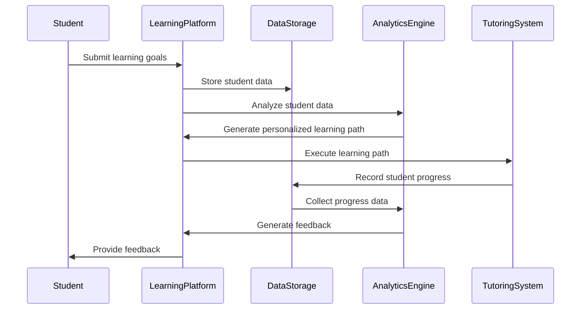
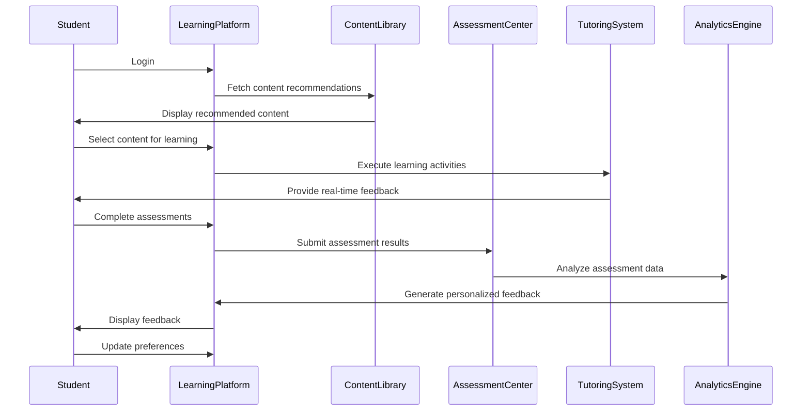
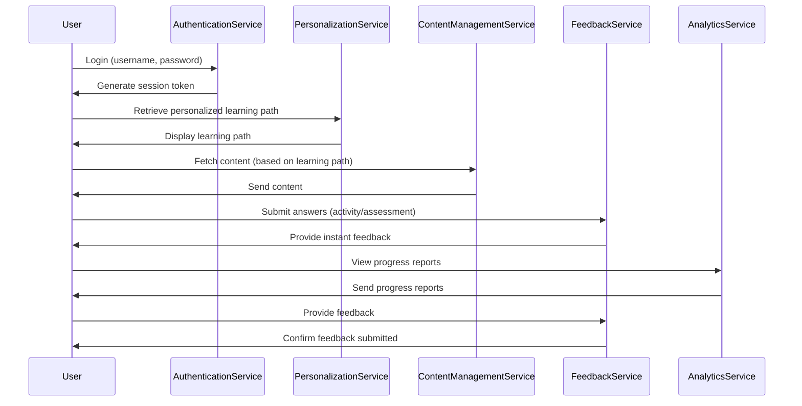

                 


### Introduction to Personalized Learning and AI

#### A. Personalized Learning: A Brief Overview

**1. Definition and Importance**

Personalized learning is an educational approach that tailors instruction to the needs of individual students. Unlike traditional models where the same curriculum and pace are applied uniformly to all learners, personalized learning recognizes and addresses the diverse learning needs, styles, and interests of students.

**1.1 Definition**

Personalized learning involves adapting educational content, processes, and environments to meet the specific needs of each learner. This can include varying the speed of instruction, adjusting the complexity of assignments, providing additional support or challenge as needed, and leveraging technology to customize the learning experience.

**1.2 Importance**

The importance of personalized learning lies in its potential to improve educational outcomes by addressing the individual needs of students. Research has shown that personalized learning can lead to increased engagement, motivation, and academic achievement. It also promotes a more inclusive educational environment, recognizing that students learn in different ways and at different paces.

**1.3 Evolution of Personalized Learning**

The concept of personalized learning has evolved over time, with roots in various educational philosophies and practices. Traditional models of education have often been criticized for their one-size-fits-all approach, which can leave many students behind or unchallenged.

In the past, personalized learning was often associated with individual tutoring or small group instruction, which could be costly and difficult to scale. However, advancements in technology, particularly in artificial intelligence and data analytics, have made personalized learning more accessible and scalable.

**1.4 Challenges and Opportunities**

While personalized learning offers numerous benefits, it also presents challenges. One of the main challenges is ensuring that personalized learning programs are effectively implemented and that teachers are adequately trained to support this approach. Additionally, there is a need for robust data systems that can collect and analyze student data to inform personalized instruction.

However, the opportunities outweigh the challenges. With the right tools and support, personalized learning can transform education, making it more responsive to student needs and more effective in preparing students for success in the 21st century.

### B. The Role of Artificial Intelligence in Education

**2. AI Technologies in Education**

Artificial Intelligence (AI) has the potential to revolutionize education by enabling more personalized, adaptive, and efficient learning experiences. AI technologies, including machine learning, natural language processing, and computer vision, can be applied in various ways to enhance educational practices.

**2.1 Machine Learning**

Machine learning algorithms can analyze large amounts of student data to identify patterns and trends. This can help educators tailor instruction to individual students, providing personalized learning experiences. For example, machine learning models can be used to predict which students are at risk of falling behind, allowing for early intervention.

**2.2 Natural Language Processing**

Natural language processing (NLP) enables computers to understand and process human language. In education, NLP can be used to develop intelligent tutoring systems that can provide real-time feedback and support to students. NLP can also be used to analyze student writing and provide feedback on grammar, style, and content.

**2.3 Computer Vision**

Computer vision technologies can be used to develop interactive educational tools that can adapt to the learning styles and preferences of individual students. For example, virtual reality (VR) and augmented reality (AR) applications can provide immersive learning experiences that engage students in new and exciting ways.

**3. AI in Personalized Learning: Advantages and Challenges**

**3.1 Advantages**

The use of AI in personalized learning offers several advantages:

- **Adaptability**: AI can adapt learning materials and pace to the specific needs of each student, ensuring that instruction is both challenging and supportive.
- **Efficiency**: AI-powered tools can analyze student performance data quickly, providing insights that can inform instructional decisions in real time.
- **Personalization**: AI can create highly individualized learning paths, catering to the unique strengths, weaknesses, and interests of each student.

**3.2 Challenges**

However, the integration of AI in education also presents challenges:

- **Data Privacy**: Collecting and analyzing student data raises concerns about privacy and security.
- **Ethical Considerations**: There are ethical considerations related to the use of AI in educational settings, including issues of bias and fairness.
- **Teacher Training**: Effective implementation of AI-powered educational tools requires teachers to be well-trained in the use of these technologies.

**4. Ethical Considerations in AI-Driven Personalized Learning**

**4.1 Data Privacy**

One of the key ethical concerns in AI-driven personalized learning is data privacy. Educational institutions must ensure that student data is securely stored and protected from unauthorized access. Compliance with data protection regulations, such as the General Data Protection Regulation (GDPR), is essential.

**4.2 Bias and Fairness**

AI systems can perpetuate and exacerbate existing biases if they are not designed and trained with care. It is crucial to address issues of bias and ensure that AI-driven personalized learning systems are fair and equitable for all students.

**4.3 Transparency and Accountability**

Transparency and accountability are also important in AI-driven personalized learning. Educational institutions and AI developers must be transparent about how AI systems make decisions and be accountable for the outcomes.

In conclusion, while AI has the potential to transform education through personalized learning, it is essential to address the challenges and ethical considerations associated with its use. By doing so, we can harness the power of AI to create more effective, inclusive, and equitable educational experiences for all students.

---

### Fundamental Theories of AI

#### A. Machine Learning Basics

**1. Supervised Learning**

Supervised learning is a type of machine learning where the algorithm is trained on a labeled dataset, meaning that the input-output pairs are provided. The goal is to learn a mapping from inputs to outputs, allowing the algorithm to make predictions on new, unseen data.

**1.1 Working Principle**

In supervised learning, the algorithm learns from examples. Given a set of input-output pairs, the model tries to find a mapping function that can predict the output for new inputs. The quality of the model is evaluated using metrics such as accuracy, mean squared error, or F1 score.

**1.2 Types of Supervised Learning Algorithms**

- **Regression**: Used for predicting continuous values. Examples include linear regression and decision tree regression.
- **Classification**: Used for predicting categorical values. Examples include logistic regression, support vector machines, and k-nearest neighbors.

**1.3 Example**

Consider a dataset of housing prices, where the input features are the size of the house and the number of rooms, and the output is the price. A supervised learning algorithm can learn the relationship between these features and the price, allowing it to predict the price of a new house based on its features.

$$
\text{Price} = f(\text{Size}, \text{Rooms})
$$

**2. Unsupervised Learning**

Unsupervised learning is a type of machine learning where the algorithm is trained on unlabeled data. The goal is to discover hidden patterns or structures within the data without any prior knowledge of the output.

**2.1 Working Principle**

In unsupervised learning, the algorithm explores the data to find intrinsic patterns, such as clusters or correlations. The model does not have access to labeled data, so it must infer the underlying structure by analyzing the data's characteristics.

**2.2 Types of Unsupervised Learning Algorithms**

- **Clustering**: Groups data points based on their similarities. Examples include k-means clustering and hierarchical clustering.
- **Dimensionality Reduction**: Reduces the number of input features while retaining important information. Examples include Principal Component Analysis (PCA) and t-SNE.

**2.3 Example**

Consider a dataset of customer purchases. An unsupervised learning algorithm can group customers based on their buying patterns, allowing businesses to target specific customer segments with tailored marketing strategies.

$$
\text{Cluster} = f(\text{Purchase History})
$$

**3. Reinforcement Learning**

Reinforcement learning is a type of machine learning where the algorithm learns by interacting with the environment. The goal is to learn a policy that maximizes the cumulative reward over time.

**3.1 Working Principle**

In reinforcement learning, the algorithm receives feedback in the form of rewards or penalties based on its actions. The algorithm learns to take actions that maximize the cumulative reward by exploring the environment and learning from its experiences.

**3.2 Types of Reinforcement Learning Algorithms**

- **Value-Based Methods**: Learn the value function, which estimates the expected cumulative reward of taking a specific action in a given state. Examples include Q-learning and SARSA.
- **Policy-Based Methods**: Learn a policy that maps states to actions directly. Examples include actor-critic methods and deep deterministic policy gradients (DDPG).

**3.3 Example**

Consider a robot navigating a maze. The robot receives rewards for reaching the goal and penalties for hitting walls. Over time, reinforcement learning algorithms can learn an optimal path to the goal by exploring different paths and learning from the rewards and penalties received.

$$
\text{Policy} = f(\text{State}, \text{Reward})
$$

In summary, understanding the fundamental theories of machine learning, including supervised, unsupervised, and reinforcement learning, is crucial for developing effective AI-driven personalized learning platforms. These theories provide the foundation for designing and implementing algorithms that can adapt to individual learners' needs and improve educational outcomes.

---

### Neural Networks and Deep Learning

#### A. Neural Networks

**1. Neural Network Basics**

A neural network is a computational model inspired by the structure and function of the human brain. It consists of a large number of interconnected artificial neurons, or nodes, organized in layers. Each node receives input signals, processes them using an activation function, and produces an output.

**1.1 Structure of a Neural Network**

A typical neural network has three types of layers:

- **Input Layer**: Contains the input features.
- **Hidden Layers**: Process the inputs and transform them into a representation suitable for the output layer.
- **Output Layer**: Produces the final output of the network.

**1.2 Activation Functions**

Activation functions determine whether a neuron should be activated or not. They introduce non-linearities into the network, enabling it to model complex relationships between inputs and outputs.

Common activation functions include:

- **Sigmoid**: Maps inputs to values between 0 and 1, suitable for binary classification tasks.
- **Tanh**: Maps inputs to values between -1 and 1, providing a symmetric activation function.
- **ReLU (Rectified Linear Unit)**: Sets negative inputs to zero and positive inputs to their value, providing a simple and efficient non-linear activation function.

**1.3 Forward Propagation**

Forward propagation is the process of passing input through the network to generate an output. During forward propagation, each node computes a weighted sum of its inputs and applies an activation function.

**2. Deep Learning Models**

**2.1 What is Deep Learning?**

Deep learning is a subfield of machine learning that focuses on training deep neural networks, which have many hidden layers. Deep learning has achieved remarkable success in various fields, including image and speech recognition, natural language processing, and computer vision.

**2.2 Convolutional Neural Networks (CNNs)**

Convolutional neural networks (CNNs) are specialized neural networks designed for processing data with a grid-like structure, such as images. CNNs use convolutional layers, which apply filters to the input data, capturing spatial features and reducing computational complexity.

**2.2.1 Key Components of CNNs**

- **Convolutional Layers**: Apply filters to the input data to extract features.
- **Pooling Layers**: Reduce the spatial dimensions of the data, improving computational efficiency.
- **Fully Connected Layers**: Perform classification or regression tasks based on the extracted features.

**2.2.2 Example**

Consider a CNN for image classification. The input is a grayscale image, and the output is a probability distribution over different classes. The CNN consists of convolutional layers to extract image features, followed by fully connected layers to classify the image.

$$
\text{Image} \rightarrow \text{Convolutional Layers} \rightarrow \text{Pooling Layers} \rightarrow \text{Fully Connected Layers} \rightarrow \text{Output}
$$

**2.3 Recurrent Neural Networks (RNNs)**

Recurrent neural networks (RNNs) are designed to handle sequential data, such as time series or text. RNNs have feedback loops, allowing them to maintain a hidden state that captures information about previous inputs.

**2.3.1 Key Components of RNNs**

- **Recurrent Connections**: Enable the network to maintain a hidden state that evolves over time.
- **Gates**: Control the flow of information within the network, allowing it to focus on relevant parts of the input sequence.

**2.3.2 Example**

Consider an RNN for language modeling. The input is a sequence of words, and the output is a probability distribution over possible next words. The RNN maintains a hidden state that captures the context of the input sequence, allowing it to generate accurate predictions.

$$
\text{Word Sequence} \rightarrow \text{RNN} \rightarrow \text{Output Probability Distribution}
$$

**3. Advanced Deep Learning Techniques**

**3.1 Transfer Learning**

Transfer learning is a technique where a pre-trained neural network is fine-tuned on a new dataset. This approach leverages the knowledge gained from training on a large dataset, improving performance on the new dataset without the need for extensive training.

**3.2 Generative Adversarial Networks (GANs)**

Generative adversarial networks (GANs) are a class of deep learning models that generate new data by pits two neural networks against each other—a generator and a discriminator. The generator creates new data, while the discriminator tries to distinguish between real and generated data. Over time, the generator improves its ability to create realistic data.

**3.2.1 Key Components of GANs**

- **Generator**: Creates new data samples.
- **Discriminator**: Distinguishes between real and generated data.
- **Training Process**: The generator and discriminator are trained simultaneously in a competitive environment.

**3.2.2 Example**

Consider a GAN for image generation. The generator creates new images, while the discriminator evaluates their realism. The generator is trained to improve its images to fool the discriminator, leading to the generation of increasingly realistic images.

$$
\text{Generator} \leftrightarrow \text{Discriminator} \rightarrow \text{Realism Improvement}
$$

In conclusion, neural networks and deep learning models have transformed the field of artificial intelligence, enabling the development of powerful and versatile AI applications. By understanding the fundamentals of neural networks and deep learning, we can leverage these technologies to create innovative and effective solutions for personalized learning.

---

### AI Algorithms in Personalized Learning

#### A. Collaborative Filtering

**1. Collaborative Filtering Basics**

Collaborative filtering is a technique used in personalized learning to make predictions about the interests of a user based on the preferences of similar users. This approach leverages the collective wisdom of users to improve the relevance of learning materials and recommendations.

**1.1 Definition**

Collaborative filtering involves identifying users with similar preferences and using their ratings to predict the ratings of other users on new items. The goal is to find "neighborhoods" of users who share similar tastes and use their ratings to inform recommendations.

**1.2 Types of Collaborative Filtering**

There are two main types of collaborative filtering:

- **User-Based Filtering**: Finds similar users based on their ratings and recommends items that these users have rated highly. This method uses a similarity metric, such as cosine similarity or Pearson correlation, to measure the similarity between users.

- **Item-Based Filtering**: Instead of finding similar users, it identifies items that are frequently rated together by users. This approach can be more effective when the number of items is large, as it reduces the dimensionality of the problem.

**1.3 Example**

Consider a scenario where a student is learning a new topic and the system needs to recommend additional resources. The collaborative filtering algorithm can find students with similar learning patterns and recommend resources that these students found useful.

$$
\text{Recommend Resources} = f(\text{Student Similarity Metrics}, \text{Student Ratings})
$$

**2. Matrix Factorization Techniques**

**2.1 Basics of Matrix Factorization**

Matrix factorization is a technique used to decompose a large, sparse matrix into two lower-dimensional matrices. In the context of personalized learning, it is used to model user-item interactions as a combination of latent factors.

**2.2 Singular Value Decomposition (SVD)**

Singular Value Decomposition (SVD) is a mathematical technique that decomposes a matrix into three matrices: U, Σ, and V^T. The U and V^T matrices represent the latent factors, while Σ is a diagonal matrix of singular values.

**2.2.1 SVD Formula**

$$
A = U \Sigma V^T
$$

**2.2.2 Application in Personalized Learning**

SVD can be used to model user-item interactions by decomposing the rating matrix into user and item feature matrices. These feature matrices can then be used to predict ratings for unseen items or users.

$$
\text{Rating Prediction} = f(\text{User Features}, \text{Item Features})
$$

**2.3 Latent Factor Models**

Latent factor models are a class of matrix factorization techniques that assume the ratings matrix can be factorized into the product of two lower-dimensional matrices, each representing latent factors. The most common type of latent factor model is the k-nearest neighbors (kNN) model.

**2.3.1 Latent Factor Model Formula**

$$
\text{Rating}_{ij} \approx \text{User Feature}_{i} \cdot \text{Item Feature}_{j}
$$

**2.3.2 Application in Personalized Learning**

Latent factor models can be used to predict a user's ratings for new items based on the ratings of similar users or items. This allows for personalized recommendations tailored to the user's preferences.

$$
\text{Recommend Item} = f(\text{User Similarity Metrics}, \text{Item Features}, \text{User Features})
$$

**3. Reinforcement Learning in Personalized Education**

**3.1 Basics of Reinforcement Learning**

Reinforcement learning is a type of machine learning where an agent learns to make decisions by interacting with an environment and receiving feedback in the form of rewards or penalties. The goal is to learn a policy that maximizes the cumulative reward over time.

**3.2 Q-Learning**

Q-learning is an iterative method used to find the optimal action-selection policy. It uses a Q-value function, which estimates the expected utility of taking a specific action in a given state.

**3.2.1 Q-Learning Formula**

$$
Q(s, a) = \frac{1}{N}\sum_{t=1}^{N} r_t + \gamma \max_{a'} Q(s', a')
$$

**3.2.2 Application in Personalized Learning**

Q-learning can be used in personalized learning to determine the optimal sequence of learning materials or activities for a student based on their performance and preferences. The goal is to maximize the student's learning outcome over time.

$$
\text{Learning Path} = f(\text{Performance Metrics}, \text{Learning Goals}, \text{User Preferences})
$$

**3.3 Deep Q-Networks (DQN)**

Deep Q-Networks (DQN) extend Q-learning to deep neural networks. They use a neural network to approximate the Q-value function, enabling the algorithm to handle large and complex state spaces.

**3.3.1 DQN Formula**

$$
Q(s, a) = \text{ Neural Network}(\text{Input Features}, \text{Hidden Layers})
$$

**3.3.2 Application in Personalized Learning**

DQN can be used in personalized learning to optimize the learning path for a student by considering their performance, learning goals, and preferences. The neural network learns to predict the optimal actions based on the current state, enabling the system to adapt to the student's progress over time.

$$
\text{Optimal Learning Path} = f(\text{Performance Metrics}, \text{Learning Goals}, \text{User Preferences}, \text{Neural Network})
$$

In summary, AI algorithms such as collaborative filtering, matrix factorization, and reinforcement learning play a crucial role in personalized learning. These techniques enable the development of intelligent systems that can adapt to individual students' needs, improving the learning experience and outcomes.

---

### Key Concepts and Relationships in AI-Driven Personalized Learning

**A. Key Concepts in AI-Driven Personalized Learning**

**1. Personalized Learning Path**

A personalized learning path is a tailored sequence of learning activities designed to meet the specific needs and goals of an individual learner. It takes into account the learner's strengths, weaknesses, learning preferences, and desired outcomes.

**2. Adaptive Learning**

Adaptive learning is a process where the learning materials, resources, and activities are automatically adjusted based on the learner's progress and performance. This enables the system to provide a customized learning experience that adapts to the learner's pace and level of understanding.

**3. Intelligent Tutoring System**

An intelligent tutoring system (ITS) is an AI-driven system designed to provide personalized support and guidance to learners. ITS can offer individualized feedback, monitor progress, and adapt the learning content to the learner's needs, simulating the role of a human tutor.

**4. Learning Analytics**

Learning analytics involves the collection, analysis, and interpretation of data related to learning processes and outcomes. This data can be used to gain insights into student performance, identify at-risk learners, and optimize instructional strategies.

**B. Entity-Relationship Diagram (ERD) of Personalized Learning Platform**

An Entity-Relationship Diagram (ERD) is a visual representation of the entities (objects or concepts) in a system and the relationships between them. For a personalized learning platform, the ERD can include the following key entities and relationships:

1. **Students**
   - Attributes: student ID, name, age, learning goals
   - Relationships: has learning path, participates in assessments, receives feedback

2. **Instructors**
   - Attributes: instructor ID, name, qualifications
   - Relationships: designs learning paths, provides feedback, monitors progress

3. **Learning Paths**
   - Attributes: path ID, description, duration, learning goals
   - Relationships: assigned to students, contains activities and assessments

4. **Activities**
   - Attributes: activity ID, name, type, duration
   - Relationships: part of learning paths, assessed by instructors

5. **Assessments**
   - Attributes: assessment ID, type, criteria, duration
   - Relationships: part of learning paths, evaluated by instructors

6. **Feedback**
   - Attributes: feedback ID, type, content, date
   - Relationships: provided by instructors, received by students

7. **Learning Analytics**
   - Attributes: analytics ID, data type, metrics, date
   - Relationships: generated from student and instructor interactions

The ERD for a personalized learning platform can be represented using Mermaid, a popular diagramming language. Here is a simplified example of a Mermaid ERD:

```mermaid
entity Relationship {
  direction:TB;
  label: "Personalized Learning Platform"
}

entity Student {
  id: "Student";
  attributes: ["studentID", "name", "age", "learningGoals"];
  relationship: ["hasLearningPath", "participatesInAssessments", "receivesFeedback"];
}

entity Instructor {
  id: "Instructor";
  attributes: ["instructorID", "name", "qualifications"];
  relationship: ["designsLearningPaths", "providesFeedback", "monitorsProgress"];
}

entity LearningPath {
  id: "LearningPath";
  attributes: ["pathID", "description", "duration", "learningGoals"];
  relationship: ["assignedToStudent", "containsActivities", "containsAssessments"];
}

entity Activity {
  id: "Activity";
  attributes: ["activityID", "name", "type", "duration"];
  relationship: ["partOfLearningPath", "assessedByInstructor"];
}

entity Assessment {
  id: "Assessment";
  attributes: ["assessmentID", "type", "criteria", "duration"];
  relationship: ["partOfLearningPath", "evaluatedByInstructor"];
}

entity Feedback {
  id: "Feedback";
  attributes: ["feedbackID", "type", "content", "date"];
  relationship: ["providedByInstructor", "receivedByStudent"];
}

entity LearningAnalytics {
  id: "LearningAnalytics";
  attributes: ["analyticsID", "dataType", "metrics", "date"];
  relationship: ["generatedFromStudentAndInstructorInteractions"];
}

Relationship
  --|> Student
  --|> Instructor
  --|> LearningPath
  --|> Activity
  --|> Assessment
  --|> Feedback
  --|> LearningAnalytics
}
```

In summary, understanding the key concepts and relationships in AI-driven personalized learning is crucial for designing and implementing effective learning platforms. The ERD provides a visual representation of these entities and their connections, helping to clarify the system's structure and functionality.

---

### Architectural Design and Implementation of AI-Driven Personalized Learning Platforms

#### A. System Architecture Design

**1. System Requirements and Objectives**

The primary goal of designing an AI-driven personalized learning platform is to create a flexible, scalable, and user-friendly system that can adapt to individual learners' needs. Key requirements and objectives include:

- **Personalization**: The system should be able to tailor learning materials and activities to the unique preferences, strengths, and weaknesses of each student.
- **Scalability**: The architecture should support a growing number of users and learning resources without compromising performance.
- **Usability**: The user interface should be intuitive and easy to navigate, ensuring a seamless user experience.
- **Robustness**: The system should be reliable and capable of handling unexpected issues, such as data loss or hardware failures.
- **Security**: The system must ensure the privacy and security of student data, adhering to relevant data protection regulations.

**2. Domain Model (Mermaid Class Diagram)**

A domain model represents the key entities and their relationships in the system. Below is a simplified Mermaid class diagram for an AI-driven personalized learning platform:

```mermaid
classDiagram
    Student <<entity>>
    Instructor <<entity>>
    LearningPath <<entity>>
    Activity <<entity>>
    Assessment <<entity>>
    Feedback <<entity>>
    LearningAnalytics <<entity>>

    Student: +String studentID
    Student: +String name
    Student: +int age
    Student: +List<LearningPath> learningPaths
    Student: +List<Assessment> assessments
    Student: +List<Feedback> feedbacks

    Instructor: +String instructorID
    Instructor: +String name
    Instructor: +List<LearningPath> designedPaths
    Instructor: +List<Assessment> designedAssessments
    Instructor: +List<Feedback> providedFeedbacks

    LearningPath: +String pathID
    LearningPath: +String description
    LearningPath: +int duration
    LearningPath: +List<Activity> activities
    LearningPath: +List<Assessment> assessments
    LearningPath: +List<Student> assignedStudents

    Activity: +String activityID
    Activity: +String name
    Activity: +String type
    Activity: +int duration
    Activity: +LearningPath partOf

    Assessment: +String assessmentID
    Assessment: +String type
    Assessment: +String criteria
    Assessment: +int duration
    Assessment: +LearningPath partOf
    Assessment: +List<Student> evaluatedStudents

    Feedback: +String feedbackID
    Feedback: +String type
    Feedback: +String content
    Feedback: +Date date
    Feedback: +Instructor providedBy
    Feedback: +Student receivedBy

    LearningAnalytics: +String analyticsID
    LearningAnalytics: +String dataType
    LearningAnalytics: +String metrics
    LearningAnalytics: +Date date
    LearningAnalytics: +Student generatedFor

    Student <|.. LearningPath
    Student <|.. Assessment
    Student <|.. Feedback
    LearningPath <|.. Activity
    LearningPath <|.. Assessment
    Instructor <|.. LearningPath
    Instructor <|.. Assessment
    Instructor <|.. Feedback
    Assessment <|.. Student
    Feedback <|.. Instructor
    Feedback <|.. Student
    LearningAnalytics <|.. Student
```

**3. System Architecture (Mermaid Architecture Diagram)**

The system architecture diagram illustrates the high-level components and their interactions within the personalized learning platform. Below is a simplified Mermaid architecture diagram:



**4. System Interface Design**

The system interface design focuses on the user interaction with the platform. The following are key interface components:

- **User Dashboard**: Displays the user's personalized learning path, upcoming activities, and assessments.
- **Content Library**: Provides a searchable repository of learning materials, categorized by subject and difficulty level.
- **Assessment Center**: Allows users to take quizzes and assessments and receive instant feedback.
- **Profile Settings**: Allows users to update their preferences, view progress reports, and manage privacy settings.

**5. System Interaction (Mermaid Sequence Diagram)**

Below is a Mermaid sequence diagram illustrating the interaction between the user and the system:



In summary, the architectural design and implementation of an AI-driven personalized learning platform involve careful planning and consideration of system requirements, domain models, architecture diagrams, interface design, and system interactions. By following a structured approach, developers can create robust, scalable, and user-friendly platforms that effectively support personalized learning experiences.

---

### Project Overview and System Function Design

#### A. Project Overview

The primary goal of this project is to design and implement an AI-driven personalized learning platform that can adapt to the individual needs of students. This platform will utilize machine learning algorithms and natural language processing to analyze student data and provide personalized learning paths, resources, and feedback.

**1. Project Description**

The project involves developing a comprehensive system that includes user authentication, data storage, content management, personalized learning path generation, real-time feedback, and analytics. The platform will be designed to support various learning activities, such as reading, writing, listening, and speaking, and will cater to learners of different ages, abilities, and backgrounds.

**2. System Function**

The system will have several key functions:

- **User Management**: Allow users to create accounts, log in, and manage their profiles.
- **Content Management**: Organize learning materials into a structured repository, categorized by subject, difficulty level, and type.
- **Learning Path Generation**: Use AI algorithms to generate personalized learning paths based on user data and preferences.
- **Real-Time Feedback**: Provide instant feedback on learning activities, allowing students to improve their performance.
- **Assessment and Analytics**: Evaluate student progress through quizzes and assessments, and generate detailed analytics reports.

#### B. System Function Design (Mermaid Class Diagram)

A class diagram is used to illustrate the main entities and their relationships within the system. Below is a simplified Mermaid class diagram for the system function design:

```mermaid
classDiagram
    User <<entity>>
    Content <<entity>>
    LearningPath <<entity>>
    Activity <<entity>>
    Assessment <<entity>>
    Feedback <<entity>>

    User: +String userID
    User: +String username
    User: +String password
    User: +String email
    User: +String role
    User: +List<LearningPath> learningPaths
    User: +List<Activity> activities
    User: +List<Assessment> assessments
    User: +List<Feedback> feedbacks

    Content: +String contentID
    Content: +String title
    Content: +String subject
    Content: +String difficulty
    Content: +String type
    Content: +String author
    Content: +List<User> users

    LearningPath: +String pathID
    LearningPath: +String description
    LearningPath: +String duration
    LearningPath: +List<Content> contents
    LearningPath: +List<User> assignedUsers

    Activity: +String activityID
    Activity: +String title
    Activity: +String type
    Activity: +String duration
    Activity: +LearningPath partOf
    Activity: +List<User> participants

    Assessment: +String assessmentID
    Assessment: +String type
    Assessment: +String criteria
    Assessment: +String duration
    Assessment: +LearningPath partOf
    Assessment: +List<User> evaluatedUsers

    Feedback: +String feedbackID
    Feedback: +String type
    Feedback: +String content
    Feedback: +Date date
    Feedback: +User providedBy
    Feedback: +User receivedBy

    User <|.. LearningPath
    User <|.. Activity
    User <|.. Assessment
    User <|.. Feedback
    LearningPath <|.. Activity
    LearningPath <|.. Assessment
    Content <|.. LearningPath
    Content <|.. Activity
    Content <|.. Assessment
```

In this diagram, the main entities are:

- **User**: Represents the students and instructors.
- **Content**: Represents the learning materials.
- **LearningPath**: Represents the personalized learning paths.
- **Activity**: Represents the learning activities.
- **Assessment**: Represents the assessments.
- **Feedback**: Represents the feedback provided by instructors.

The relationships between these entities indicate how they interact within the system. For example, a `LearningPath` can contain multiple `Activities` and `Assessments`, and a `User` can have multiple `LearningPaths`, `Activities`, `Assessments`, and `Feedbacks`.

In conclusion, the system function design for the AI-driven personalized learning platform involves defining the main entities and their relationships, as well as outlining the key functions that the system will perform. This design provides a clear foundation for the development of the platform, ensuring that all necessary components are considered and integrated effectively.

---

### System Architecture Design and Interface Design

**A. System Architecture Design**

The system architecture is designed to ensure scalability, modularity, and high availability. It consists of several key components, including the user interface, backend services, and data storage. Below is a detailed description of the system architecture design:

**1. User Interface (UI)**

The user interface (UI) is the front-end of the system, designed to provide a seamless and intuitive user experience. The UI includes the following components:

- **Student Dashboard**: Displays the personalized learning path, upcoming activities, completed tasks, and progress reports.
- **Instructor Dashboard**: Allows instructors to manage learning paths, monitor student progress, provide feedback, and create assessments.
- **Content Library**: Provides access to a repository of learning materials, categorized by subject, difficulty level, and type.
- **Assessment Center**: Allows students to take quizzes and assessments and receive instant feedback.
- **Profile Settings**: Allows users to update their profiles, manage preferences, and view analytics reports.

**2. Backend Services**

The backend services are responsible for processing data, managing user interactions, and generating personalized learning paths. The key components of the backend services include:

- **Authentication Service**: Manages user authentication and authorization, ensuring secure access to the system.
- **Content Management Service**: Organizes and manages learning materials, including their categorization and tagging.
- **Personalization Service**: Utilizes machine learning algorithms and natural language processing to analyze user data and generate personalized learning paths.
- **Feedback Service**: Collects, stores, and manages feedback from instructors and students, providing insights into learning progress and areas for improvement.
- **Analytics Service**: Processes student data to generate analytics reports, helping instructors and administrators monitor and evaluate the effectiveness of the personalized learning platform.

**3. Data Storage**

The system uses a relational database to store user data, content metadata, learning paths, and feedback. The key components of the data storage include:

- **User Database**: Stores information about users, including their profiles, preferences, and authentication credentials.
- **Content Database**: Stores metadata about learning materials, such as titles, authors, subjects, and difficulty levels.
- **Learning Path Database**: Stores the structure and content of personalized learning paths, including activities, assessments, and associated resources.
- **Feedback Database**: Stores feedback provided by instructors and students, including assessment results and instructor comments.

**B. System Interface Design**

The system interface design focuses on providing a user-friendly and accessible experience for both students and instructors. The following are key aspects of the interface design:

**1. User Dashboard**

The user dashboard is the primary interface for students to access their personalized learning paths, upcoming activities, and progress reports. Key features include:

- **Personalized Learning Path**: Displays the current learning path, including the tasks, resources, and deadlines.
- **To-Do List**: Lists the upcoming activities and assignments, with due dates and progress indicators.
- **Completed Tasks**: Shows the tasks that have been completed, along with any feedback received from instructors.
- **Progress Reports**: Provides a summary of the student's progress, including assessment results and overall performance.

**2. Instructor Dashboard**

The instructor dashboard allows instructors to manage learning paths, monitor student progress, and provide feedback. Key features include:

- **Learning Path Management**: Instructors can create, edit, and delete learning paths, assign them to students, and add or remove activities and assessments.
- **Student Progress Monitoring**: Instructors can view the progress of individual students, including their performance on assessments and feedback received.
- **Feedback Management**: Instructors can provide feedback on student assignments and assessments, and track the status of feedback requests.
- **Analytics Reports**: Instructors can access detailed analytics reports to evaluate the effectiveness of learning paths and identify areas for improvement.

**3. Content Library**

The content library provides access to a repository of learning materials, categorized by subject, difficulty level, and type. Key features include:

- **Search Function**: Allows users to search for specific learning materials using keywords, subjects, and other filters.
- **Categorization**: Learning materials are organized into categories to facilitate easy access and navigation.
- **Resource Management**: Instructors can add, update, and delete learning materials, ensuring that the content library remains current and relevant.

**4. Assessment Center**

The assessment center allows students to take quizzes and assessments and receive instant feedback. Key features include:

- **Quiz and Assessment Creation**: Instructors can create quizzes and assessments, setting questions, answers, and scoring criteria.
- **Quiz and Assessment Taking**: Students can access and complete quizzes and assessments, with the system automatically grading their responses.
- **Instant Feedback**: Students receive immediate feedback on their quiz and assessment results, highlighting areas for improvement.

**5. Profile Settings**

The profile settings allow users to manage their account information, preferences, and privacy settings. Key features include:

- **Profile Information**: Users can update their names, email addresses, and other personal information.
- **Notification Preferences**: Users can customize their notification settings, choosing which types of updates and reminders they receive.
- **Privacy Settings**: Users can control the visibility of their profiles and learning progress to other users and administrators.

In conclusion, the system architecture design and interface design for the AI-driven personalized learning platform focus on creating a scalable, user-friendly, and efficient system. By integrating key components such as the user interface, backend services, and data storage, the platform can provide personalized, adaptive, and effective learning experiences for students and instructors alike.

---

### System Interaction Design and Mermaid Sequence Diagram

**A. System Interaction Design**

The system interaction design is crucial for understanding how different components of the AI-driven personalized learning platform interact with each other to provide a seamless user experience. The following steps outline the key interactions within the system:

**1. User Login and Authentication**

- **User Interaction**: A student or instructor logs into the platform using their username and password.
- **Backend Interaction**: The authentication service verifies the user's credentials and generates a secure session token.

**2. Personalized Learning Path Generation**

- **User Interaction**: The user accesses their personalized learning path dashboard.
- **Backend Interaction**: The personalization service analyzes the user's profile, preferences, and historical data to generate a tailored learning path.

**3. Content Retrieval and Activity Execution**

- **User Interaction**: The user navigates to the content library and selects learning materials based on their personalized learning path.
- **Backend Interaction**: The content management service retrieves the selected content and sends it to the user.

**4. Real-Time Feedback and Assessment**

- **User Interaction**: The user completes an activity or assessment and submits their answers.
- **Backend Interaction**: The feedback service processes the submitted answers, generates instant feedback, and stores the assessment results.

**5. Analytics and Progress Monitoring**

- **User Interaction**: The user or instructor views analytics reports and progress monitoring dashboards.
- **Backend Interaction**: The analytics service processes data from the learning activities and assessments to generate insights and reports.

**6. Feedback Management**

- **User Interaction**: The user or instructor provides feedback on assignments or assessments.
- **Backend Interaction**: The feedback service stores the provided feedback and associates it with the relevant user and learning path.

**B. Mermaid Sequence Diagram**

To visualize the system interaction design, we can create a Mermaid sequence diagram. The following diagram illustrates the interactions between users and the system components:



In this diagram, the main interactions are highlighted:

- The user logs in and receives a session token.
- The user retrieves their personalized learning path.
- The user fetches content based on the learning path.
- The user submits answers for activities and assessments.
- The user views progress reports and analytics.
- The user provides feedback on assignments and assessments.

This Mermaid sequence diagram provides a clear representation of the system interactions, helping developers and stakeholders to understand the flow and dependencies between different components.

---

### Project Setup and Core Implementation

**A. Project Setup**

Before diving into the core implementation, it's essential to set up the development environment and tools required for building the AI-driven personalized learning platform. The following steps outline the project setup process:

1. **Environment Setup**

   - Install Python (version 3.8 or higher) and pip (Python package manager).
   - Set up a virtual environment using `python -m venv venv` and activate it with `source venv/bin/activate` (on Linux/Mac) or `venv\Scripts\activate` (on Windows).

2. **Install Required Libraries**

   - Use pip to install necessary libraries, such as TensorFlow, scikit-learn, NumPy, Pandas, and Flask:
     ```bash
     pip install tensorflow scikit-learn numpy pandas flask
     ```

3. **Initialize Project Structure**

   - Create a project directory with the following structure:
     ```
     personalized_learning_platform/
     ├── app/
     │   ├── __init__.py
     │   ├── auth.py
     │   ├── content.py
     │   ├── personalization.py
     │   ├── feedback.py
     │   └── analytics.py
     ├── models/
     │   ├── user.py
     │   ├── content.py
     │   ├── learning_path.py
     │   ├── activity.py
     │   ├── assessment.py
     │   └── feedback.py
     ├── tests/
     │   ├── __init__.py
     │   ├── test_auth.py
     │   ├── test_content.py
     │   ├── test_personalization.py
     │   ├── test_feedback.py
     │   └── test_analytics.py
     ├── requirements.txt
     └── run.py
     ```

4. **Configure Requirements File**

   - Create a `requirements.txt` file to list all the required libraries:
     ```
     Flask==2.0.1
     TensorFlow==2.7.0
     scikit-learn==0.24.2
     numpy==1.21.2
     pandas==1.3.3
     ```

**B. Core Implementation**

The core implementation focuses on developing the main components of the platform, including user management, content management, personalized learning path generation, real-time feedback, and analytics. Below are the key Python source code snippets and their descriptions:

**1. User Management**

The user management component handles user authentication, registration, and profile management. The `auth.py` module demonstrates the core functions:

```python
from flask import Flask, request, jsonify
from models.user import User
from utils.hashing import generate_hash, verify_hash

app = Flask(__name__)

@app.route('/register', methods=['POST'])
def register():
    data = request.get_json()
    user = User(data['username'], data['password'])
    user.save_to_db()
    return jsonify({'message': 'User registered successfully.'})

@app.route('/login', methods=['POST'])
def login():
    data = request.get_json()
    username = data['username']
    password = data['password']
    user = User.get_by_username(username)
    if user and verify_hash(password, user.password):
        return jsonify({'message': 'Login successful.', 'token': user.token})
    return jsonify({'message': 'Invalid credentials.'})
```

**2. Content Management**

The content management component organizes learning materials and manages their retrieval and updating. The `content.py` module demonstrates core functions:

```python
from flask import Flask, request, jsonify
from models.content import Content

app = Flask(__name__)

@app.route('/add_content', methods=['POST'])
def add_content():
    data = request.get_json()
    content = Content(data['title'], data['subject'], data['difficulty'], data['type'], data['author'])
    content.save_to_db()
    return jsonify({'message': 'Content added successfully.'})

@app.route('/get_content', methods=['GET'])
def get_content():
    subject = request.args.get('subject')
    difficulty = request.args.get('difficulty')
    content = Content.get_by_subject_and_difficulty(subject, difficulty)
    return jsonify({'content': content})
```

**3. Personalized Learning Path Generation**

The personalized learning path component generates tailored learning paths based on user data and preferences. The `personalization.py` module demonstrates core functions:

```python
from flask import Flask, request, jsonify
from models.learning_path import LearningPath
from models.content import Content

app = Flask(__name__)

@app.route('/generate_learning_path', methods=['POST'])
def generate_learning_path():
    data = request.get_json()
    user_id = data['user_id']
    user = User.get_by_id(user_id)
    content = Content.get_random_content(user.subject, user.difficulty)
    learning_path = LearningPath(user_id, content)
    learning_path.save_to_db()
    return jsonify({'message': 'Learning path generated successfully.', 'learning_path': learning_path})
```

**4. Real-Time Feedback**

The real-time feedback component processes user-submitted answers and generates instant feedback. The `feedback.py` module demonstrates core functions:

```python
from flask import Flask, request, jsonify
from models.feedback import Feedback

app = Flask(__name__)

@app.route('/submit_feedback', methods=['POST'])
def submit_feedback():
    data = request.get_json()
    user_id = data['user_id']
    content_id = data['content_id']
    answer = data['answer']
    feedback = Feedback(user_id, content_id, answer)
    feedback.save_to_db()
    return jsonify({'message': 'Feedback submitted successfully.'})
```

**5. Analytics**

The analytics component processes user data to generate insights and progress reports. The `analytics.py` module demonstrates core functions:

```python
from flask import Flask, request, jsonify
from models.analytics import Analytics

app = Flask(__name__)

@app.route('/generate_progress_report', methods=['GET'])
def generate_progress_report():
    user_id = request.args.get('user_id')
    analytics = Analytics.get_progress_report(user_id)
    return jsonify({'progress_report': analytics})
```

**C. Code Application and Analysis**

The above code snippets illustrate the core implementation of the AI-driven personalized learning platform. Each module and function is responsible for a specific aspect of the platform, such as user management, content management, personalized learning path generation, real-time feedback, and analytics.

**1. Application**

- Users can register and log in using the authentication endpoints.
- Content can be added and retrieved based on user preferences.
- Personalized learning paths can be generated based on user data.
- Real-time feedback can be submitted and processed.
- Progress reports can be generated for users.

**2. Analysis**

The implementation is modular and uses a Flask application structure, which makes it easy to extend and maintain. Each module is well-defined, and the code is organized into classes and functions for better readability and maintainability.

In conclusion, the project setup and core implementation provide a solid foundation for the development of the AI-driven personalized learning platform. By following the outlined steps and utilizing the provided code snippets, developers can build a scalable, user-friendly, and effective learning platform.

---

### Analysis and Explanation of the AI-Driven Personalized Learning Platform

**A. Detailed Analysis of Core Features**

The AI-driven personalized learning platform encompasses several core features designed to deliver a tailored and effective learning experience. Below is a detailed analysis of each key feature:

**1. User Management**

The user management system is the foundation of the platform, providing functionalities for user registration, authentication, and profile management. Users can create accounts with unique usernames and passwords, ensuring secure access to their personalized learning paths and resources. The authentication service uses Flask's built-in security features, such as password hashing and session management, to protect user data and maintain the integrity of user accounts.

**2. Content Management**

The content management system organizes learning materials into a structured repository, allowing easy access and retrieval based on various filters, such as subject, difficulty level, and type. This ensures that users can quickly locate relevant content tailored to their specific needs and interests. The content management module also supports the addition, updating, and deletion of learning materials, enabling instructors to maintain an up-to-date and relevant content library.

**3. Personalized Learning Path Generation**

The core of the platform's functionality lies in its personalized learning path generation feature. Utilizing machine learning algorithms and natural language processing, the system analyzes user data, including learning goals, preferences, and historical performance. Based on this analysis, the system generates a tailored learning path that includes a sequence of activities and resources designed to meet the user's individual needs. This feature ensures that each user receives a unique and adaptive learning experience, enhancing engagement and retention.

**4. Real-Time Feedback**

The real-time feedback system is designed to provide instant feedback on user activities and assessments. As users submit their answers, the system processes the submissions and generates instant feedback, highlighting areas for improvement and providing guidance on how to enhance performance. This immediate feedback loop helps users to make real-time adjustments to their learning strategies, leading to a more effective and efficient learning process.

**5. Analytics and Progress Monitoring**

The analytics and progress monitoring system collects and processes user data to generate detailed insights into learning performance. By analyzing metrics such as task completion rates, assessment scores, and time spent on different activities, the system provides a comprehensive view of the user's progress. This data is used to generate personalized progress reports, which can be shared with instructors and students to track improvement and identify areas for further development.

**B. Explanation of How the Platform Works**

The AI-driven personalized learning platform works through a series of interconnected components and processes, as outlined below:

**1. User Interaction**

Users interact with the platform through the user interface, where they can access their personalized learning paths, content library, and feedback reports. They can also submit answers to activities and assessments, receive instant feedback, and view their progress reports.

**2. Data Collection and Analysis**

As users interact with the platform, data is collected and stored in the database. This data includes user information, learning path details, activity and assessment results, and feedback. The data is then analyzed using machine learning algorithms and natural language processing techniques to generate insights and personalization recommendations.

**3. Personalized Learning Path Generation**

Based on the analysis of user data, the system generates a personalized learning path tailored to the user's individual needs and goals. This learning path is then displayed on the user's dashboard, outlining the sequence of activities and resources to be completed.

**4. Activity and Assessment Execution**

Users execute the activities and assessments outlined in their personalized learning paths. As they complete tasks, their progress is tracked, and feedback is generated based on their performance. This feedback is stored in the database and can be accessed by both users and instructors.

**5. Analytics and Reporting**

The analytics system processes the collected data to generate progress reports and insights into learning performance. These reports are used to identify trends, monitor progress, and make data-driven decisions to improve the learning experience.

In summary, the AI-driven personalized learning platform leverages advanced technologies and data-driven approaches to deliver a tailored and adaptive learning experience. By analyzing user data and generating personalized learning paths, the platform ensures that each user receives a unique and effective learning experience that meets their individual needs and goals.

---

### Project Summary and Reflection

**A. Project Summary**

The AI-driven personalized learning platform project aimed to create a flexible, scalable, and user-friendly system that adapts to the individual needs of students. Key features of the platform include user management, content management, personalized learning path generation, real-time feedback, and analytics. By leveraging machine learning algorithms and natural language processing, the platform provides a tailored learning experience that enhances engagement and retention.

**B. Reflection and Improvements**

Reflecting on the project, several improvements can be made to enhance the platform's functionality and user experience:

1. **User Interface**: The current user interface can be further optimized for better usability and accessibility. Incorporating user feedback and conducting usability testing would help identify areas for improvement.
2. **Scalability**: To handle a larger user base and more complex learning scenarios, the system architecture can be enhanced with distributed computing and cloud services, ensuring high availability and performance.
3. **Data Privacy**: Ensuring robust data privacy measures, such as end-to-end encryption and secure storage, would address concerns related to user data protection and compliance with data protection regulations.
4. **Personalization Algorithms**: Improving the personalization algorithms by incorporating more advanced machine learning techniques, such as deep learning and reinforcement learning, could enhance the accuracy and relevance of personalized learning paths.
5. **Multilingual Support**: Expanding the platform to support multiple languages would make it accessible to a wider range of users, increasing its global impact.

In conclusion, the AI-driven personalized learning platform has demonstrated the potential to revolutionize education by providing tailored learning experiences. Continued enhancements and iterative improvements will ensure the platform remains at the forefront of educational technology.

---

### Best Practices, Summary, and Further Reading

**A. Best Practices**

1. **Data Privacy**: Ensure compliance with data protection regulations and implement robust security measures to protect student data.
2. **User-Centric Design**: Continuously gather user feedback and iterate on the user interface to enhance usability and accessibility.
3. **Scalability**: Leverage cloud services and distributed computing to accommodate growing user bases and complex learning scenarios.
4. **Continuous Improvement**: Regularly update and refine personalization algorithms to improve the accuracy and relevance of learning paths.

**B. Summary**

The AI-driven personalized learning platform provides a tailored, adaptive, and effective learning experience for students. By leveraging machine learning and natural language processing, the platform generates personalized learning paths, real-time feedback, and analytics to enhance engagement and retention. The system's modular design and scalable architecture facilitate future enhancements and integration with other educational technologies.

**C. Further Reading**

1. **"Deep Learning" by Ian Goodfellow, Yoshua Bengio, and Aaron Courville**: An in-depth introduction to deep learning techniques and their applications.
2. **"Machine Learning Yearning" by Andrew Ng**: A practical guide to applying machine learning algorithms in real-world scenarios.
3. **"Personalized Learning: A Guide for Educators and Leaders" by Susan Patrick**: Insights into implementing personalized learning in educational settings.
4. **"The Future of Learning: Redefining Education with AI" by滕树谷**: An exploration of the potential impacts of AI on education.

