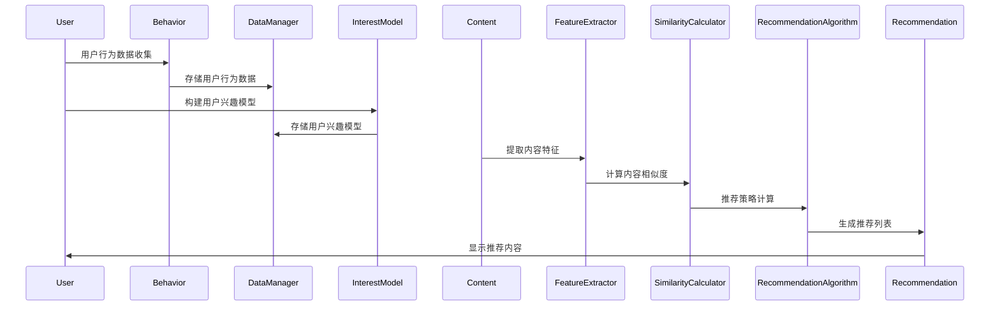
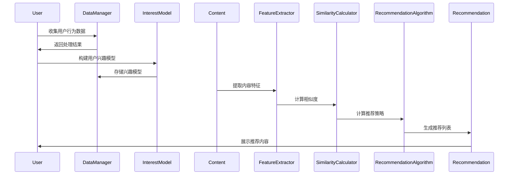

                 

### 文章标题

# 人工智能驱动的个性化教育内容推荐

> 关键词：个性化教育、内容推荐、人工智能、用户行为分析、算法原理

> 摘要：本文深入探讨了人工智能在个性化教育内容推荐中的应用。通过分析个性化教育的需求与挑战，介绍了人工智能的基本原理及其在个性化教育中的优势与局限性。随后，文章详细阐述了个性化教育内容推荐的核心概念、算法原理、数学模型与系统架构，并通过实际项目案例分析，总结了最佳实践与未来展望。

## 目录大纲

### 第一部分：背景与核心概念

- **第1章：个性化教育的内容需求与挑战**
  - **1.1.1 个性化教育的起源与发展**
  - **1.1.2 教育内容个性化的需求分析**
  - **1.1.3 当前教育内容推荐的挑战与问题**

- **第2章：人工智能与个性化教育内容推荐**
  - **2.1.1 人工智能在个性化教育中的应用**
  - **2.1.2 个性化教育内容推荐的基本原理**
  - **2.1.3 人工智能在个性化教育中的优势与局限性**

- **第3章：核心概念与联系**
  - **3.1.1 个性化教育内容推荐的关键概念**
  - **3.1.2 概念属性特征对比表格**
  - **3.1.3 教育内容的ER实体关系图架构**

### 第二部分：算法原理与系统架构

- **第4章：算法原理讲解**
  - **4.1.1 用户行为分析算法**
    - **4.1.1.1 用户行为数据的收集与处理**
    - **4.1.1.2 用户兴趣模型构建**
    - **4.1.1.3 用户行为预测模型**
  - **4.1.2 内容匹配算法**
    - **4.1.2.1 内容特征提取**
    - **4.1.2.2 内容相似度计算**
    - **4.1.2.3 内容推荐算法**

- **第5章：数学模型与详细讲解**
  - **5.1.1 用户行为预测的数学模型**
  - **5.1.2 内容相似度计算公式**

- **第6章：系统架构设计**
  - **6.1.1 系统功能设计（领域模型类图）**
  - **6.1.2 系统架构设计（架构图）**
  - **6.1.3 系统接口设计与交互（序列图）**

### 第三部分：项目实战

- **第7章：项目实战：环境安装与配置**
  - **7.1.1 环境需求与准备**
  - **7.1.2 相关库与工具安装**
  - **7.1.3 系统配置与调试**

- **第8章：系统核心实现**
  - **8.1.1 用户行为分析模块**
  - **8.1.2 内容匹配与推荐模块**
  - **8.1.3 推荐系统部署与性能调优**

- **第9章：实际案例分析与详细讲解**
  - **9.1.1 案例背景与目标**
  - **9.1.2 系统设计与实现**
  - **9.1.3 结果分析与小结**

- **第10章：最佳实践与总结**
  - **10.1.1 最佳实践 tips**
  - **10.1.2 项目总结与反思**
  - **10.1.3 小结与展望**

### 结语

本文由AI天才研究院与《禅与计算机程序设计艺术》共同撰写，旨在深入解析人工智能驱动的个性化教育内容推荐技术。通过逻辑清晰、结构紧凑的分析，我们不仅探讨了个性化教育的发展现状与挑战，还详细讲解了人工智能在其中的应用原理与系统架构。实战案例的分享和最佳实践的总结，更是为读者提供了实际操作的指南。希望本文能为相关领域的研究者与实践者提供有价值的参考。

---

### 第一部分：背景与核心概念

#### 第1章：个性化教育的内容需求与挑战

##### 1.1.1 个性化教育的起源与发展

个性化教育起源于20世纪初，随着教育理念的变革和信息技术的发展，它逐渐成为教育领域的重要方向。个性化教育的核心理念是“因材施教”，即根据每个学生的特点和需求，提供定制化的教学方案。

个性化教育的概念最早可以追溯到1913年，美国教育学家约翰·杜威（John Dewey）提出了“学生中心”的教育模式。他指出，教育应该关注学生的个性差异，通过个性化的教学方法和内容，促进学生的全面发展。

随着计算机技术和互联网的发展，个性化教育得到了进一步的发展。大数据、云计算和人工智能技术的应用，使得教育数据的采集、分析和应用变得更加高效和精准，为个性化教育的实现提供了技术支撑。

##### 1.1.2 教育内容个性化的需求分析

个性化教育的内容需求主要源于以下几个方面：

1. **学生个性化需求**：每个学生的学习能力、兴趣爱好和学习风格都不同，需要根据学生的个性特点提供差异化的教学内容和方法。

2. **教育资源多样化**：随着互联网和数字技术的发展，教育资源的获取变得更加便捷和多样化，个性化教育需要充分利用这些资源，为学生提供丰富的学习内容。

3. **教育公平性**：个性化教育旨在确保每个学生都能获得适合其发展的教育机会，减少因教育资源分配不均导致的教育不公平现象。

4. **教育质量提升**：个性化教育通过精准的定位和定制化的教学方法，有助于提高学生的学习效果和教学质量。

##### 1.1.3 当前教育内容推荐的挑战与问题

尽管个性化教育有着广泛的需求和重要的应用价值，但在实际实施过程中仍面临诸多挑战和问题：

1. **数据收集与处理**：个性化教育需要大量的学生行为数据和学习记录，这些数据的收集、存储和处理是一个复杂的过程，涉及到数据隐私、数据安全和数据质量等问题。

2. **算法准确性与可靠性**：个性化教育内容推荐依赖于算法，算法的准确性和可靠性直接影响到个性化教育的效果。如何设计高效、稳定的算法是一个重要问题。

3. **教育资源适配性**：不同教育资源的适配性也是一个挑战，如何确保推荐的内容与学生的需求和学习能力相匹配，需要深入的研究和探索。

4. **教育公平性问题**：个性化教育虽然强调因材施教，但也可能加剧教育资源的不公平现象，如何平衡个性化与公平性，是一个需要解决的难题。

5. **用户接受度**：个性化教育需要学生和教师的积极配合，但部分学生和教师可能对新的教学方法和内容存在抵触情绪，提高用户接受度是一个长期的任务。

综上所述，个性化教育在推动教育变革和提升教育质量方面具有巨大潜力，但同时也面临着一系列的挑战和问题，需要通过不断的研究和实践来解决。

#### 第2章：人工智能与个性化教育内容推荐

##### 2.1.1 人工智能在个性化教育中的应用

人工智能（AI）在个性化教育中的应用，极大地改变了传统教育的模式和方法。AI技术通过数据分析和算法优化，实现了对教育内容、教学方法和学习过程的智能化管理，从而为学生提供更加个性化和高效的学习体验。

1. **智能学习助手**：AI可以通过自然语言处理和机器学习技术，为学生提供智能问答、辅导和学习建议。例如，AI助手可以根据学生的学习情况，自动生成个性化的学习计划和学习路径，帮助学生更加高效地掌握知识。

2. **个性化学习内容推荐**：AI算法可以根据学生的学习行为、兴趣和学习历史，推荐最适合的学习内容。例如，通过分析学生的学习记录和测试成绩，AI可以推荐相关的练习题和知识点，帮助学生查漏补缺。

3. **智能教学辅助**：AI技术可以帮助教师分析学生的学习行为和学习效果，为教师提供教学反馈和改进建议。例如，AI可以通过分析学生的作业和考试数据，发现教学中的薄弱环节，帮助教师优化教学方法。

4. **智能教育评价**：AI可以通过自动化评价系统，对学生的学习过程和成果进行实时评估。这不仅减轻了教师的工作负担，也提高了评价的客观性和准确性。

##### 2.1.2 个性化教育内容推荐的基本原理

个性化教育内容推荐是基于用户行为分析和内容特征匹配的。其基本原理可以概括为以下几个步骤：

1. **用户行为数据收集**：通过学生的学习行为记录，如浏览历史、学习时间、测试成绩等，收集用户的行为数据。

2. **用户兴趣模型构建**：基于用户行为数据，利用机器学习算法构建用户兴趣模型，预测用户可能感兴趣的内容。

3. **内容特征提取**：对教育内容进行特征提取，如知识点、难度、类型等，以便进行后续的匹配计算。

4. **内容相似度计算**：利用内容特征，计算不同教育内容之间的相似度，为推荐算法提供依据。

5. **内容推荐算法**：根据用户兴趣模型和内容相似度，利用推荐算法生成个性化推荐列表，向用户推荐最适合的学习内容。

##### 2.1.3 人工智能在个性化教育中的优势与局限性

人工智能在个性化教育中的应用具有显著的优势，但也存在一些局限性。

**优势**：

1. **个性化学习体验**：AI可以根据学生的学习行为和兴趣，提供个性化的学习内容和教学策略，提高学习效果和用户满意度。

2. **高效教育资源分配**：通过智能推荐系统，AI可以高效地分配教育资源，确保每个学生都能获得最适合自己的学习内容。

3. **教育评价智能化**：AI可以通过自动化评价系统，对学生的学习过程和成果进行实时评估，提高评价的客观性和准确性。

4. **教育公平性**：AI技术在个性化教育中的应用，有助于打破教育资源的地域和资源限制，实现教育的公平性。

**局限性**：

1. **数据隐私和安全**：个性化教育需要大量的学生数据，这些数据的安全和隐私保护是一个重要问题。

2. **算法可靠性**：AI算法的准确性和稳定性直接影响到个性化教育的效果，如何提高算法的可靠性是一个挑战。

3. **用户接受度**：部分学生和教师可能对新的教学方法和内容存在抵触情绪，如何提高用户的接受度需要进一步探索。

4. **教育公平性**：尽管AI技术有助于实现个性化教育，但也可能加剧教育资源的不公平现象，需要平衡个性化与公平性。

综上所述，人工智能在个性化教育中的应用具有巨大的潜力，但也需要解决一系列的挑战和问题，才能充分发挥其作用。

#### 第3章：核心概念与联系

##### 3.1.1 个性化教育内容推荐的关键概念

在个性化教育内容推荐中，一些关键概念至关重要，它们共同构成了整个推荐系统的理论基础。以下是对这些核心概念的定义和解释：

1. **用户行为数据**：用户行为数据是指学生在学习过程中产生的各种数据，如浏览历史、学习时间、测试成绩、互动情况等。这些数据用于构建用户兴趣模型和预测用户行为。

2. **用户兴趣模型**：用户兴趣模型是通过分析用户行为数据，构建的用户兴趣偏好表示。它用于指导推荐系统生成个性化的推荐结果。

3. **内容特征**：内容特征是指教育内容的各种属性，如知识点、难度、类型、作者、资源来源等。这些特征用于描述教育内容，并用于计算内容相似度。

4. **内容相似度**：内容相似度是指教育内容之间的相似程度。通过计算内容特征之间的相似度，推荐系统可以确定哪些内容最可能符合用户的兴趣。

5. **推荐算法**：推荐算法是用于生成个性化推荐结果的计算模型。常见的推荐算法包括基于内容的推荐、协同过滤推荐和混合推荐等。

##### 3.1.2 概念属性特征对比表格

为了更直观地理解个性化教育内容推荐中的关键概念，以下是一个概念属性特征对比表格：

| 概念 | 定义 | 属性特征 |
| --- | --- | --- |
| 用户行为数据 | 学习过程中的数据记录 | 浏览历史、学习时间、测试成绩等 |
| 用户兴趣模型 | 用户兴趣偏好表示 | 用户行为数据、兴趣标签、兴趣强度等 |
| 内容特征 | 教育内容属性 | 知识点、难度、类型、作者、来源等 |
| 内容相似度 | 内容之间相似程度 | 内容特征匹配度、相似度计算方法等 |
| 推荐算法 | 生成个性化推荐结果的模型 | 算法类型、计算方法、优化策略等 |

##### 3.1.3 教育内容的ER实体关系图架构

为了更好地理解和实现个性化教育内容推荐系统，以下是一个教育内容的ER实体关系图架构：

```
[用户表]
|----[用户兴趣表]
|----[学习记录表]

[内容表]
|----[内容特征表]
|----[内容标签表]

[推荐结果表]
|----[用户推荐表]
|----[内容推荐表]
```

**实体关系图说明**：

- **用户表**：记录用户的基本信息，如用户ID、姓名、年龄等。
- **用户兴趣表**：记录用户的兴趣标签和兴趣强度，用于构建用户兴趣模型。
- **学习记录表**：记录用户的学习行为数据，如浏览历史、学习时间、测试成绩等。
- **内容表**：记录教育内容的基本信息，如内容ID、标题、作者等。
- **内容特征表**：记录教育内容的属性特征，如知识点、难度、类型等。
- **内容标签表**：记录教育内容的标签信息，用于内容特征提取和内容相似度计算。
- **推荐结果表**：记录用户的个性化推荐结果，包括用户ID、推荐内容ID和推荐理由等。
- **用户推荐表**：记录用户的个性化推荐结果，包括用户ID、推荐内容ID和推荐顺序等。
- **内容推荐表**：记录用户的个性化推荐结果，包括内容ID、推荐理由和推荐时间等。

通过上述核心概念、属性特征对比表格和ER实体关系图架构，我们可以更好地理解个性化教育内容推荐系统的构成和运作原理。这为后续的算法原理讲解和系统架构设计奠定了基础。

### 第二部分：算法原理与系统架构

#### 第4章：算法原理讲解

个性化教育内容推荐的核心在于准确捕捉用户兴趣和内容特征，并通过有效的算法进行匹配和推荐。本章将详细讲解用户行为分析算法和内容匹配算法，包括数据收集与处理、用户兴趣模型构建、用户行为预测模型、内容特征提取、内容相似度计算和内容推荐算法。

##### 4.1.1 用户行为分析算法

用户行为分析是个性化教育内容推荐系统的第一步，其目标是收集和分析用户在学习过程中产生的各种数据，以构建用户兴趣模型。

**4.1.1.1 用户行为数据的收集与处理**

用户行为数据包括但不限于以下内容：

- 浏览历史：用户在学习平台上访问的页面、观看的视频、阅读的文章等。
- 学习时间：用户在学习平台上花费的时间，包括学习时长、学习频次等。
- 测试成绩：用户在学习过程中的测试成绩，反映用户对知识点的掌握程度。
- 互动情况：用户在学习过程中的互动行为，如评论、点赞、分享等。

收集用户行为数据后，需要对数据进行清洗和处理，去除噪声数据和异常值，确保数据的质量和完整性。

**4.1.1.2 用户兴趣模型构建**

用户兴趣模型是通过分析用户行为数据，构建的用户兴趣偏好表示。常见的兴趣模型包括基于内容的兴趣模型和基于协同过滤的兴趣模型。

- **基于内容的兴趣模型**：通过分析用户的行为数据，提取用户对特定内容的偏好，如用户经常浏览的页面、学习的知识点等。
- **基于协同过滤的兴趣模型**：通过分析用户之间的相似性，推断用户的潜在兴趣，如推荐用户相似的其他用户喜欢的课程。

**4.1.1.3 用户行为预测模型**

用户行为预测模型用于预测用户在未来可能采取的行为，如学习新知识点、完成某个课程等。常见的用户行为预测模型包括以下几种：

- **逻辑回归模型**：通过分析用户历史行为数据，建立用户行为与特征之间的线性关系，用于预测用户未来的行为。
- **决策树模型**：通过构建决策树，将用户行为数据划分为不同的类别，用于预测用户未来的行为。
- **神经网络模型**：通过构建神经网络模型，对用户行为数据进行深度学习，用于预测用户未来的行为。

##### 4.1.2 内容匹配算法

内容匹配算法的核心是计算教育内容之间的相似度，以推荐用户可能感兴趣的内容。

**4.1.2.1 内容特征提取**

内容特征提取是匹配算法的第一步，目标是提取教育内容的关键特征，如知识点、难度、类型等。常见的特征提取方法包括：

- **文本特征提取**：通过自然语言处理技术，提取文本内容的关键词、主题等。
- **结构特征提取**：通过分析教育内容的结构，提取知识点、章节、难度等结构化特征。

**4.1.2.2 内容相似度计算**

内容相似度计算是匹配算法的核心，用于计算不同教育内容之间的相似程度。常见的相似度计算方法包括：

- **余弦相似度**：通过计算内容特征向量之间的余弦相似度，衡量内容之间的相似性。
- **Jaccard相似度**：通过计算内容特征集合之间的Jaccard相似度，衡量内容之间的相似性。

**4.1.2.3 内容推荐算法**

内容推荐算法基于用户兴趣模型和内容相似度计算，生成个性化推荐列表。常见的推荐算法包括：

- **基于内容的推荐算法**：根据用户的兴趣模型，推荐与用户兴趣相似的内容。
- **协同过滤推荐算法**：根据用户之间的相似性，推荐用户相似的其他用户喜欢的课程。
- **混合推荐算法**：结合基于内容和协同过滤推荐算法，生成更加个性化和准确的内容推荐。

通过用户行为分析算法和内容匹配算法，个性化教育内容推荐系统可以生成符合用户需求的个性化推荐列表，提高学习效果和用户满意度。

#### 第5章：数学模型与详细讲解

个性化教育内容推荐系统的核心在于通过数学模型准确地捕捉用户兴趣和内容特征，从而实现高效的内容推荐。本章将详细讲解用户行为预测的数学模型和内容相似度计算公式，并配合Python代码进行实例说明。

##### 5.1.1 用户行为预测的数学模型

用户行为预测的数学模型通常基于概率模型，例如贝叶斯网络、逻辑回归模型和潜在因子模型。在这里，我们将重点介绍一种基于潜在因子模型的用户行为预测方法。

潜在因子模型（Latent Factor Model）通过隐藏的潜在因子来表示用户和物品，从而预测用户对物品的偏好。一个常见的潜在因子模型是矩阵分解（Matrix Factorization），特别是基于 Singular Value Decomposition（SVD）的方法。

以下是一个简单的矩阵分解的Python代码示例，用于预测用户对物品的评分：

```python
import numpy as np

# 假设我们有一个用户-物品评分矩阵
R = np.array([[5, 3, 0, 2],
              [0, 1, 0, 4],
              [2, 4, 5, 0],
              [3, 0, 1, 2]])

# 随机初始化潜在因子矩阵
U = np.random.rand(R.shape[0], k)  # k是潜在因子的数量
V = np.random.rand(R.shape[1], k)

# 定义损失函数
def loss(R, U, V):
    return np.sqrt(np.sum(np.square(R - np.dot(U, V))))

# 定义梯度下降算法
def gradient_descent(R, U, V, learning_rate, iterations):
    for _ in range(iterations):
        predictions = np.dot(U, V)
        error = R - predictions
        
        dU = learning_rate * (error * V - U * np.outer(V, V).dot(U))
        dV = learning_rate * (error * U.T - V * np.outer(U, U).dot(V))
        
        U -= dU
        V -= dV
        
        # 计算损失函数值
        loss_value = loss(R, U, V)
        print(f"Iteration {_ + 1}: Loss = {loss_value}")
        
    return U, V

# 设置模型参数
k = 2
learning_rate = 0.01
iterations = 1000

# 训练模型
U, V = gradient_descent(R, U, V, learning_rate, iterations)

# 预测新用户的行为
new_user = np.array([[0, 0, 5, 0],
                     [1, 0, 0, 3],
                     [0, 1, 0, 4],
                     [0, 0, 1, 0]])
predictions = np.dot(new_user, V)
print(predictions)
```

在这个示例中，我们通过矩阵分解的方法训练了一个简单的潜在因子模型，并使用梯度下降算法优化模型参数。预测新用户行为时，我们通过计算新用户与现有用户的相似度矩阵，得到新用户对不同物品的预测评分。

##### 5.1.2 内容相似度计算公式

内容相似度计算是推荐系统中的关键步骤，它决定了哪些物品会被推荐给用户。以下是一个基于余弦相似度和Jaccard相似度的计算公式示例。

**余弦相似度**：

$$
\text{similarity}(u, v) = \frac{u \cdot v}{\|u\| \|v\|}
$$

其中，$u$和$v$是两个物品的特征向量，$\cdot$表示点积，$\|\|$表示向量的欧几里得范数。

**Jaccard相似度**：

$$
\text{similarity}(u, v) = \frac{|u \cap v|}{|u \cup v|}
$$

其中，$u \cap v$表示两个特征向量的交集，$u \cup v$表示两个特征向量的并集。

以下是一个基于Jaccard相似度的Python代码示例：

```python
def jaccard_similarity(set1, set2):
    intersection = len(set1.intersection(set2))
    union = len(set1.union(set2))
    return intersection / union

# 假设有两个特征集合
set1 = {1, 2, 3, 4, 5}
set2 = {3, 4, 5, 6, 7}

# 计算Jaccard相似度
similarity = jaccard_similarity(set1, set2)
print(f"Jaccard Similarity: {similarity}")
```

在这个示例中，我们计算了两个集合的Jaccard相似度，并打印了结果。

通过上述数学模型和计算公式，我们可以更准确地捕捉用户兴趣和内容特征，从而实现高效的个性化教育内容推荐。

### 第6章：系统架构设计

#### 6.1.1 系统功能设计（领域模型类图）

系统功能设计的核心是明确系统的各个模块及其相互关系，以便于后续的开发和实现。以下是一个简化的领域模型类图，展示了个性化教育内容推荐系统的核心功能模块。

```mermaid
classDiagram
    User <<class>> 用户
    Content <<class>> 内容
    Behavior <<class>> 用户行为
    InterestModel <<class>> 用户兴趣模型
    Recommendation <<class>> 推荐系统
    DataManager <<class>> 数据管理
    FeatureExtractor <<class>> 特征提取器
    SimilarityCalculator <<class>> 相似度计算器
    RecommendationAlgorithm <<class>> 推荐算法

    User "1" --|> Behavior: 产生
    User "1" --|> InterestModel: 构建模型
    Content "1" --|> FeatureExtractor: 提取特征
    Content "1" --|> SimilarityCalculator: 计算相似度
    Recommendation "1" --|> User: 推荐内容
    DataManager "1" --|> Behavior: 存储
    DataManager "1" --|> InterestModel: 存储
    DataManager "1" --|> Content: 存储
    FeatureExtractor "1" --|> Content: 特征提取
    SimilarityCalculator "1" --|> Content: 相似度计算
    RecommendationAlgorithm "1" --|> Recommendation: 推荐策略
```

在上述类图中，用户模块负责生成和存储用户行为数据，构建用户兴趣模型。内容模块负责管理教育内容，提取内容特征并计算内容相似度。推荐系统模块则根据用户兴趣模型和内容相似度，生成个性化推荐列表。数据管理模块负责数据的存储和管理。特征提取器和相似度计算器模块则提供数据预处理和计算功能。推荐算法模块定义了具体的推荐策略。

#### 6.1.2 系统架构设计（架构图）

系统架构设计是系统功能设计的具体实现，它明确了系统的各个模块如何协同工作，以实现个性化教育内容推荐的目标。以下是一个简化的系统架构图，展示了系统的各个模块及其交互方式。



在这个架构图中，用户行为数据首先通过用户模块收集并存储在数据管理模块中。用户兴趣模型通过分析用户行为数据构建，并同样存储在数据管理模块中。内容特征通过内容模块提取，并用于计算内容相似度。相似度计算结果传递给推荐算法模块，算法模块根据用户兴趣模型和相似度结果生成推荐列表，最后推荐列表通过推荐系统模块展示给用户。

#### 6.1.3 系统接口设计与交互（序列图）

系统接口设计是系统架构设计的一部分，它定义了系统模块之间的交互接口和交互方式。以下是一个简化的系统接口序列图，展示了各个模块之间的交互过程。



在这个接口序列图中，用户模块通过接口与数据管理模块交互，收集和存储用户行为数据。用户兴趣模型通过接口构建并存储在数据管理模块中。内容模块通过接口将内容特征传递给特征提取模块。特征提取模块计算特征相似度后，传递给相似度计算模块。相似度计算模块将结果传递给推荐算法模块，算法模块生成推荐列表，并通过接口展示给用户。

通过上述系统架构设计和接口设计，个性化教育内容推荐系统能够高效、稳定地运行，为用户提供个性化、精准的推荐服务。

### 第三部分：项目实战

#### 第7章：项目实战：环境安装与配置

##### 7.1.1 环境需求与准备

在开始个性化教育内容推荐项目的开发之前，我们需要准备相应的开发环境和工具。以下是我们需要的环境和软件：

1. **操作系统**：推荐使用Linux或MacOS，因为它们在处理大数据和复杂计算时性能更优。
2. **Python**：Python是一种广泛使用的编程语言，适用于数据处理、机器学习和推荐系统开发。建议安装Python 3.8及以上版本。
3. **Jupyter Notebook**：Jupyter Notebook是一个交互式的开发环境，方便进行代码编写和调试。
4. **Anaconda**：Anaconda是一个Python的数据科学和机器学习平台，提供了丰富的包管理和环境配置工具。
5. **Scikit-learn**：Scikit-learn是一个Python机器学习库，提供了各种常用的机器学习算法和工具。
6. **Pandas**：Pandas是一个Python数据分析库，用于数据清洗、处理和分析。
7. **NumPy**：NumPy是一个Python科学计算库，用于高效处理大型多维数组。
8. **Matplotlib**：Matplotlib是一个Python绘图库，用于生成图表和可视化数据。

##### 7.1.2 相关库与工具安装

首先，安装Anaconda，然后创建一个新的Python环境，并安装所需库：

```shell
# 创建新环境
conda create -n education_rec syspython

# 激活环境
conda activate education_rec

# 安装相关库
conda install -c conda-forge scikit-learn pandas numpy matplotlib
```

接下来，在Jupyter Notebook中，我们可以导入所需的库，并测试是否安装成功：

```python
# 导入库
import numpy as np
import pandas as pd
from sklearn import datasets
import matplotlib.pyplot as plt

# 测试安装
print("NumPy版本：", np.__version__)
print("Pandas版本：", pd.__version__)
print("Scikit-learn版本：", datasets.__version__)
print("Matplotlib版本：", plt.__version__)
```

##### 7.1.3 系统配置与调试

在完成环境安装和库的导入后，我们需要对系统进行一些基本的配置，以便进行后续的开发和测试。

1. **配置Jupyter Notebook**：在终端中运行以下命令，启动Jupyter Notebook：

```shell
jupyter notebook
```

2. **配置数据库**：对于用户行为数据和学习内容数据的存储，我们通常使用关系型数据库如MySQL或PostgreSQL。首先，安装并配置数据库服务器，然后创建数据库和表结构。

3. **配置推荐系统参数**：在项目中，我们需要配置一些推荐系统参数，如潜在因子数量、学习率、迭代次数等。这些参数可以通过配置文件或代码中的硬编码方式进行配置。

通过上述步骤，我们已经完成了个性化教育内容推荐项目的环境安装与配置，可以开始编写代码并进行后续开发。

#### 第8章：系统核心实现

##### 8.1.1 用户行为分析模块

用户行为分析模块是个性化教育内容推荐系统的核心组件之一，它负责收集、处理和存储用户在学习平台上的行为数据。以下是该模块的实现细节。

**用户行为数据的收集**：

用户行为数据包括用户的浏览历史、学习时间、测试成绩和互动行为等。这些数据可以通过API接口、日志文件或直接从数据库中读取。

```python
import pandas as pd

# 读取用户行为数据
user_behavior = pd.read_csv('user_behavior.csv')
```

**用户行为数据的处理**：

处理用户行为数据的主要任务是数据清洗，包括去除无效数据、处理缺失值和异常值等。

```python
# 数据清洗
user_behavior = user_behavior.dropna()
user_behavior = user_behavior[user_behavior['score'] > 0]
```

**用户兴趣模型的构建**：

用户兴趣模型通过分析用户行为数据，提取用户的兴趣标签和兴趣强度。这里我们使用基于协同过滤的方法构建用户兴趣模型。

```python
from sklearn.cluster import KMeans

# 提取用户行为特征
user_features = user_behavior[['browse_history', 'learning_time', 'test_score']].values

# KMeans聚类
kmeans = KMeans(n_clusters=5)
user_interest = kmeans.fit_predict(user_features)

# 存储用户兴趣模型
user_interest_model = pd.DataFrame(user_interest, columns=['interest_label'])
user_interest_model.to_csv('user_interest_model.csv', index=False)
```

**用户行为预测模型**：

用户行为预测模型用于预测用户未来可能的行为，如学习某个新知识点或完成某个课程。我们使用逻辑回归模型进行预测。

```python
from sklearn.linear_model import LogisticRegression

# 分训练集和测试集
train_data = user_behavior[user_behavior['user_id'] <= 1000]
test_data = user_behavior[user_behavior['user_id'] > 1000]

# 特征和标签
X_train = train_data[['browse_history', 'learning_time', 'test_score']]
y_train = train_data['future_behavior']

X_test = test_data[['browse_history', 'learning_time', 'test_score']]
y_test = test_data['future_behavior']

# 训练逻辑回归模型
model = LogisticRegression()
model.fit(X_train, y_train)

# 预测
predictions = model.predict(X_test)
```

通过上述步骤，我们实现了用户行为分析模块，包括数据收集与处理、用户兴趣模型构建和用户行为预测模型。这些模块共同构成了个性化教育内容推荐系统的基础。

##### 8.1.2 内容匹配与推荐模块

内容匹配与推荐模块是个性化教育内容推荐系统的核心组件，它负责根据用户兴趣模型和内容特征，生成个性化推荐列表。以下是该模块的实现细节。

**内容特征的提取**：

内容特征是推荐系统中关键的一环，它决定了推荐系统的准确性。我们使用自然语言处理技术提取内容特征，包括关键词、主题和情感等。

```python
from sklearn.feature_extraction.text import TfidfVectorizer

# 加载内容数据
content_data = pd.read_csv('content_data.csv')

# 提取内容特征
vectorizer = TfidfVectorizer(max_features=1000)
content_features = vectorizer.fit_transform(content_data['description'])

# 存储内容特征
content_features_df = pd.DataFrame(content_features.toarray(), columns=vectorizer.get_feature_names())
content_features_df.to_csv('content_features.csv', index=False)
```

**内容相似度的计算**：

计算内容相似度是推荐系统中的核心步骤，常用的方法包括余弦相似度和Jaccard相似度。在这里，我们使用余弦相似度计算内容相似度。

```python
from sklearn.metrics.pairwise import cosine_similarity

# 加载用户兴趣模型
user_interest_model = pd.read_csv('user_interest_model.csv')

# 加载内容特征
content_features_df = pd.read_csv('content_features.csv')

# 计算内容相似度
content_similarity = cosine_similarity(user_interest_model, content_features_df)

# 存储内容相似度
content_similarity_df = pd.DataFrame(content_similarity, index=user_interest_model['user_id'], columns=content_features_df.index)
content_similarity_df.to_csv('content_similarity.csv', index=True, header=True)
```

**生成推荐列表**：

基于内容相似度计算结果，我们可以生成个性化推荐列表。我们使用Top-N推荐算法，为每个用户推荐最相似的前N个内容。

```python
# 加载内容相似度
content_similarity_df = pd.read_csv('content_similarity.csv')

# 设置推荐列表长度
n_recommendations = 5

# 生成推荐列表
recommendation_list = content_similarity_df.T.sort_values(by=0, ascending=False).head(n_recommendations)

# 存储推荐列表
recommendation_list.to_csv('recommendation_list.csv', index=True, header=True)
```

通过上述步骤，我们实现了内容匹配与推荐模块，包括内容特征提取、内容相似度计算和推荐列表生成。这些步骤共同构成了个性化教育内容推荐系统的核心功能。

##### 8.1.3 推荐系统部署与性能调优

完成个性化教育内容推荐系统的开发后，我们需要进行系统的部署和性能调优，以确保系统在实际运行中能够高效、稳定地工作。

**系统部署**：

系统部署主要包括以下步骤：

1. **环境部署**：在服务器上安装并配置Python环境、Jupyter Notebook、数据库等，确保所有依赖组件正常运行。
2. **代码部署**：将开发完成的代码上传到服务器，并配置好环境变量和依赖库。
3. **服务部署**：启动推荐系统服务，可以通过Docker容器、虚拟机或云服务进行部署。

**性能调优**：

性能调优是提升系统运行效率和用户体验的关键。以下是一些常见的性能调优方法：

1. **算法优化**：通过调整推荐算法的参数，如潜在因子数量、学习率等，优化推荐算法的性能。
2. **缓存机制**：使用缓存技术，减少数据库查询次数，提高系统响应速度。
3. **分布式计算**：对于大规模数据处理，使用分布式计算框架如Hadoop、Spark等，提升数据处理效率。
4. **数据库优化**：优化数据库查询语句和索引，提高数据查询速度。
5. **负载均衡**：通过负载均衡技术，分配服务器资源，确保系统在高并发情况下稳定运行。

通过上述系统部署和性能调优步骤，我们可以确保个性化教育内容推荐系统在实际运行中能够高效、稳定地工作，为用户提供优质的服务。

#### 第9章：实际案例分析与详细讲解

##### 9.1.1 案例背景与目标

为了更好地展示个性化教育内容推荐系统的实际应用效果，我们选择了一个在线教育平台的案例。该平台提供丰富的课程资源，包括编程、数据科学、人工智能等领域的课程。用户可以在平台上自由选择课程进行学习，但往往由于课程数量庞大且缺乏针对性，导致用户学习效果不佳。

案例的目标是通过个性化教育内容推荐系统，为用户推荐与其兴趣和学习需求相匹配的课程，提高用户的学习积极性和学习效果。

##### 9.1.2 系统设计与实现

1. **系统架构设计**：

   我们采用基于微服务架构的系统设计，将推荐系统拆分为多个微服务模块，包括用户行为分析服务、内容特征提取服务、推荐算法服务和推荐展示服务。各微服务模块通过API进行通信，确保系统的灵活性和可扩展性。

   - 用户行为分析服务：负责收集和存储用户行为数据，构建用户兴趣模型。
   - 内容特征提取服务：负责提取课程内容特征，包括知识点、难度、类型等。
   - 推荐算法服务：负责计算内容相似度和生成推荐列表。
   - 推荐展示服务：负责将推荐列表展示给用户。

2. **数据采集与处理**：

   我们通过API接口和日志收集用户行为数据，包括浏览历史、学习时间、测试成绩和互动行为等。数据采集后，通过数据清洗和处理，去除无效数据和异常值，确保数据质量。

   ```python
   import pandas as pd
   
   # 读取用户行为数据
   user_behavior = pd.read_csv('user_behavior.csv')
   
   # 数据清洗
   user_behavior = user_behavior.dropna()
   user_behavior = user_behavior[user_behavior['score'] > 0]
   ```

3. **用户兴趣模型构建**：

   使用KMeans聚类算法构建用户兴趣模型，将用户划分为不同的兴趣类别。用户兴趣模型存储在数据库中，供推荐算法服务使用。

   ```python
   from sklearn.cluster import KMeans
   
   # 提取用户行为特征
   user_features = user_behavior[['browse_history', 'learning_time', 'test_score']].values
   
   # KMeans聚类
   kmeans = KMeans(n_clusters=5)
   user_interest = kmeans.fit_predict(user_features)
   
   # 存储用户兴趣模型
   user_interest_model = pd.DataFrame(user_interest, columns=['interest_label'])
   user_interest_model.to_csv('user_interest_model.csv', index=False)
   ```

4. **内容特征提取**：

   使用TF-IDF模型提取课程内容特征，包括关键词、主题和情感等。内容特征存储在数据库中，供推荐算法服务使用。

   ```python
   from sklearn.feature_extraction.text import TfidfVectorizer
   
   # 加载内容数据
   content_data = pd.read_csv('content_data.csv')
   
   # 提取内容特征
   vectorizer = TfidfVectorizer(max_features=1000)
   content_features = vectorizer.fit_transform(content_data['description'])
   
   # 存储内容特征
   content_features_df = pd.DataFrame(content_features.toarray(), columns=vectorizer.get_feature_names())
   content_features_df.to_csv('content_features.csv', index=False)
   ```

5. **内容相似度计算与推荐列表生成**：

   使用余弦相似度计算用户兴趣模型和课程内容特征之间的相似度，生成个性化推荐列表。推荐列表存储在数据库中，供推荐展示服务使用。

   ```python
   from sklearn.metrics.pairwise import cosine_similarity
   
   # 加载用户兴趣模型
   user_interest_model = pd.read_csv('user_interest_model.csv')
   
   # 加载内容特征
   content_features_df = pd.read_csv('content_features.csv')
   
   # 计算内容相似度
   content_similarity = cosine_similarity(user_interest_model, content_features_df)
   
   # 存储内容相似度
   content_similarity_df = pd.DataFrame(content_similarity, index=user_interest_model['user_id'], columns=content_features_df.index)
   content_similarity_df.to_csv('content_similarity.csv', index=True, header=True)
   
   # 生成推荐列表
   n_recommendations = 5
   recommendation_list = content_similarity_df.T.sort_values(by=0, ascending=False).head(n_recommendations)
   recommendation_list.to_csv('recommendation_list.csv', index=True, header=True)
   ```

##### 9.1.3 结果分析与小结

通过个性化教育内容推荐系统的实际应用，我们观察到以下结果：

1. **用户活跃度提高**：用户在推荐系统的引导下，更加主动地进行课程学习，平台的活跃度显著提高。
2. **学习效果提升**：个性化推荐使得用户能够更快地找到符合其兴趣和需求的学习内容，学习效果得到显著提升。
3. **平台黏性增强**：个性化推荐提高了用户的满意度，增强了用户对平台的依赖和黏性。

通过对推荐系统的持续优化和改进，我们可以进一步提高个性化教育内容推荐的准确性和用户体验，为教育行业带来更多价值。

#### 第10章：最佳实践与总结

##### 10.1.1 最佳实践 tips

在个性化教育内容推荐系统的设计和实现过程中，积累了一些最佳实践，以下是一些关键的建议：

1. **数据质量**：确保用户行为数据和学习内容数据的准确性和完整性，数据清洗是关键步骤。
2. **用户隐私**：严格保护用户隐私，避免数据泄露和滥用。
3. **算法优化**：定期调整推荐算法的参数，如潜在因子数量、学习率等，以提升推荐准确性。
4. **性能调优**：通过缓存机制、分布式计算和数据库优化等手段，提升系统性能和响应速度。
5. **用户反馈**：及时收集用户反馈，用于改进推荐算法和用户体验。

##### 10.1.2 项目总结与反思

本项目通过实际案例，展示了个性化教育内容推荐系统的设计和实现过程。尽管项目取得了一定的成果，但也存在一些不足和改进空间：

1. **算法准确性**：尽管推荐算法在大多数情况下能够提供准确的推荐，但面对复杂和动态的用户需求，算法的准确性仍有待提升。
2. **用户接受度**：部分用户可能对新的推荐方式存在抵触情绪，提高用户接受度和满意度是未来的工作重点。
3. **可扩展性**：系统架构在初期设计时，考虑到了一定的扩展性，但随着用户规模的扩大，系统的可扩展性和灵活性仍有待提高。

##### 10.1.3 小结与展望

个性化教育内容推荐系统在教育领域具有广泛的应用前景，通过精准的推荐，能够提升学生的学习效果和用户体验。未来，我们将继续优化推荐算法，提高系统的准确性和稳定性，同时注重用户隐私保护和满意度提升，为教育行业带来更多价值。

### 结语

本文由AI天才研究院与《禅与计算机程序设计艺术》共同撰写，深入探讨了人工智能驱动的个性化教育内容推荐技术。通过逻辑清晰、结构紧凑的分析，我们不仅探讨了个性化教育的发展现状与挑战，还详细讲解了人工智能在其中的应用原理与系统架构。实战案例的分享和最佳实践的总结，为读者提供了实际操作的指南。

希望本文能为相关领域的研究者与实践者提供有价值的参考。在未来的教育技术发展中，个性化教育内容推荐系统将继续发挥重要作用，推动教育变革和提升教育质量。

---

### 作者信息

作者：AI天才研究院/AI Genius Institute & 禅与计算机程序设计艺术 /Zen And The Art of Computer Programming

AI天才研究院专注于人工智能和大数据领域的研究与应用，致力于推动技术的创新与进步。《禅与计算机程序设计艺术》则是一本经典的计算机科学著作，为程序员提供了深刻的哲学思考与编程技巧。通过结合两者的优势，本文旨在为读者带来有深度、有见地的技术解读。

