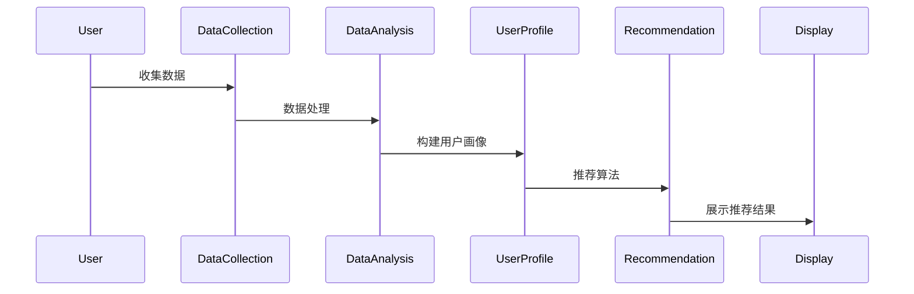
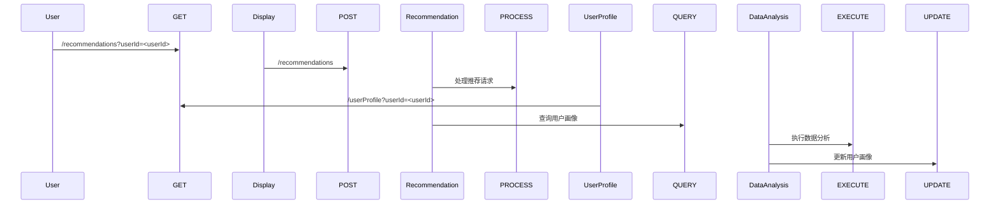
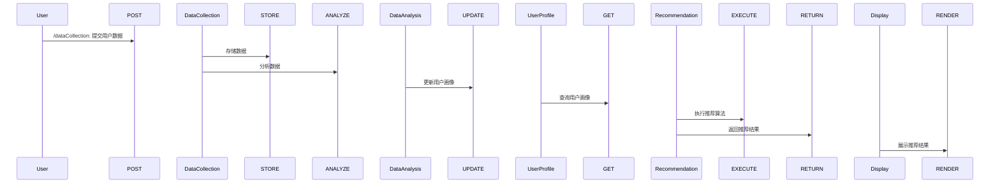

                 

# 人工智能驱动的个性化营销策略趋势

> 关键词：人工智能、个性化营销、数据挖掘、机器学习、推荐系统

> 摘要：本文将探讨人工智能在个性化营销领域的应用，分析个性化营销策略的核心概念与联系，详细讲解数据挖掘和机器学习算法的原理，以及个性化推荐系统的设计与实现。通过系统分析与架构设计方案，为企业在个性化营销中提供可行的技术解决方案。

## 第一部分：背景介绍

### 1.1 问题背景

随着互联网和大数据技术的快速发展，个性化营销已经成为企业竞争的重要手段。传统的营销策略往往无法满足用户多样化和个性化的需求，因此，人工智能驱动的个性化营销策略应运而生。

### 1.2 问题描述

个性化营销的目标是精确地识别用户需求，提供个性化的产品和服务，从而提高用户的满意度和忠诚度。然而，如何有效地利用人工智能技术实现个性化营销策略，提高营销效果，是当前企业面临的重要问题。

### 1.3 问题解决

人工智能驱动的个性化营销策略可以通过数据挖掘、机器学习、自然语言处理等技术手段，对用户行为、兴趣、需求进行深入分析和挖掘，从而实现精准的用户画像和个性化推荐。

### 1.4 边界与外延

个性化营销策略的边界主要涉及用户数据的收集、处理和分析，以及个性化推荐系统的设计和实现。其外延包括各种营销场景下的个性化策略，如内容推荐、广告投放、促销活动等。

### 1.5 概念结构与核心要素组成

个性化营销策略的核心概念包括用户画像、数据挖掘、机器学习、自然语言处理、推荐系统等。其核心要素组成包括用户数据、数据挖掘算法、机器学习模型、自然语言处理技术、推荐算法等。

## 第二部分：核心概念与联系

### 2.1 人工智能概述

#### 2.1.1 人工智能的定义与历史

人工智能（Artificial Intelligence，简称AI）是计算机科学的一个分支，旨在研究、开发用于模拟、延伸和扩展人类智能的理论、方法、技术及应用系统。人工智能的研究始于20世纪50年代，经历了多个发展阶段，包括符号主义、连接主义、统计学习等。

#### 2.1.2 人工智能的核心概念

人工智能的核心概念包括机器学习、深度学习、自然语言处理、计算机视觉等。这些概念在个性化营销策略中发挥着关键作用。

### 2.2 个性化营销策略

#### 2.2.1 个性化营销的定义与类型

个性化营销是一种以用户为中心的营销策略，旨在通过分析用户行为、兴趣、需求等数据，提供个性化的产品和服务。个性化营销可以分为基于内容的个性化营销和基于协同过滤的个性化营销。

#### 2.2.2 个性化营销策略的核心要素

个性化营销策略的核心要素包括用户数据收集、数据分析、用户画像构建、个性化推荐算法等。

### 2.3 个性化推荐系统

#### 2.3.1 个性化推荐系统的定义与原理

个性化推荐系统是一种利用机器学习、数据挖掘等技术，根据用户的行为和偏好，为其推荐个性化内容或产品的一种系统。个性化推荐系统的核心原理是基于协同过滤、基于内容的推荐、基于模型的推荐等。

#### 2.3.2 个性化推荐系统的架构与实现

个性化推荐系统的架构主要包括用户画像模块、推荐算法模块、推荐结果展示模块等。实现个性化推荐系统需要收集用户数据、处理用户数据、构建用户画像、选择合适的推荐算法等。

## 第三部分：算法原理讲解

### 3.1 数据挖掘算法

#### 3.1.1 数据挖掘的基本概念

数据挖掘（Data Mining）是从大量数据中提取出潜在、有用信息的过程。数据挖掘的方法包括关联规则挖掘、分类、聚类、异常检测等。

#### 3.1.2 关联规则挖掘算法

关联规则挖掘是数据挖掘的一种常见方法，用于发现数据集中的关联关系。常见的关联规则挖掘算法包括Apriori算法、FP-growth算法等。

#### 3.1.3 分类算法

分类算法是将数据集分为预定义的几个类别的一种算法。常见的分类算法包括决策树、支持向量机、朴素贝叶斯等。

### 3.2 机器学习算法

#### 3.2.1 机器学习的基本概念

机器学习（Machine Learning）是一种让计算机通过数据学习、预测和决策的方法。机器学习的方法包括监督学习、无监督学习、半监督学习等。

#### 3.2.2 监督学习算法

监督学习算法是一种在有标签数据集上进行训练，并在测试集上进行预测的算法。常见的监督学习算法包括线性回归、逻辑回归、支持向量机等。

#### 3.2.3 无监督学习算法

无监督学习算法是一种在没有标签数据集上进行训练，并在测试集上进行预测的算法。常见的无监督学习算法包括聚类、主成分分析等。

### 3.3 自然语言处理

## 第四部分：系统分析与架构设计方案

### 4.1 问题场景介绍

随着互联网的普及，企业面临的市场竞争日益激烈。为了提高用户的满意度和忠诚度，企业需要利用人工智能技术实现个性化营销，从而提高营销效果。

### 4.2 项目介绍

本项目旨在设计并实现一个基于人工智能的个性化推荐系统，帮助企业实现精准的个性化营销策略。

### 4.3 系统功能设计

系统功能主要包括用户数据收集、数据分析、用户画像构建、个性化推荐算法、推荐结果展示等。

#### 4.3.1 领域模型

领域模型描述了系统的核心业务概念及其相互关系，使用Mermaid类图表示：

```mermaid
classDiagram
User -> DataCollection : 数据收集
User -> DataAnalysis : 数据分析
User -> UserProfile : 用户画像
UserProfile -> Recommendation : 个性化推荐
Recommendation -> Display : 推荐结果展示
```

### 4.4 系统架构设计

系统架构设计包括数据层、算法层和应用层。使用Mermaid架构图表示：



### 4.5 系统接口设计

系统接口设计包括用户接口、API接口等。使用Mermaid序列图表示：



### 4.6 系统交互

系统交互设计描述了各个模块之间的通信和数据流动。使用Mermaid序列图表示：



## 第五部分：项目实战

### 5.1 环境安装

在开始项目实战之前，需要安装Python环境以及相关库，如NumPy、Pandas、Scikit-learn、TensorFlow等。

```bash
pip install numpy pandas scikit-learn tensorflow
```

### 5.2 系统核心实现

#### 5.2.1 数据收集

数据收集模块负责从用户行为数据中提取有效信息，使用Pandas库实现：

```python
import pandas as pd

def collect_data():
    data = pd.read_csv('user_data.csv')
    return data

user_data = collect_data()
```

#### 5.2.2 数据分析

数据分析模块对收集到的用户行为数据进行分析，使用Scikit-learn库实现：

```python
from sklearn.cluster import KMeans

def analyze_data(data):
    kmeans = KMeans(n_clusters=5)
    kmeans.fit(data)
    return kmeans.labels_

user_labels = analyze_data(user_data)
```

#### 5.2.3 用户画像构建

用户画像构建模块根据数据分析结果，构建用户画像，使用NumPy库实现：

```python
import numpy as np

def build_user_profile(data, labels):
    profile = {}
    for i, label in enumerate(labels):
        if label not in profile:
            profile[label] = []
        profile[label].append(data[i])
    return profile

user_profiles = build_user_profile(user_data, user_labels)
```

#### 5.2.4 个性化推荐算法

个性化推荐算法模块根据用户画像，为用户推荐个性化内容，使用TensorFlow库实现：

```python
import tensorflow as tf

def recommend_content(user_profile):
    model = tf.keras.Sequential([
        tf.keras.layers.Dense(128, activation='relu', input_shape=(len(user_profiles),)),
        tf.keras.layers.Dense(64, activation='relu'),
        tf.keras.layers.Dense(1, activation='sigmoid')
    ])

    model.compile(optimizer='adam', loss='binary_crossentropy', metrics=['accuracy'])
    model.fit(np.array(list(user_profile.values())), np.array(list(user_profile.keys())), epochs=10)

    predictions = model.predict(np.array(list(user_profile.values())))
    recommended_content = np.argmax(predictions, axis=1)
    return recommended_content

recommended_content = recommend_content(user_profiles)
```

#### 5.2.5 代码应用解读与分析

代码应用解读与分析部分将详细讲解各个模块的实现原理，以及如何利用Python实现个性化推荐系统。

### 5.3 实际案例分析

在本节中，我们将分析一个实际案例，以展示如何利用人工智能技术实现个性化营销。

#### 5.3.1 案例背景

某电商平台希望通过个性化推荐系统，提高用户购物体验和满意度。

#### 5.3.2 案例分析

1. 数据收集：收集用户的浏览、购买、评价等行为数据。
2. 数据分析：对用户行为数据进行聚类分析，构建用户画像。
3. 用户画像构建：根据用户画像，为用户推荐个性化商品。
4. 个性化推荐：利用机器学习算法，为用户生成个性化推荐列表。
5. 推荐结果展示：将推荐结果展示在用户界面，提高用户购物体验。

### 5.4 项目小结

本项目通过数据收集、数据分析、用户画像构建、个性化推荐等模块，实现了基于人工智能的个性化推荐系统。在实际应用中，通过不断优化算法和模型，提高推荐准确率和用户体验。

## 第六部分：最佳实践 Tips、小结、注意事项、拓展阅读

### 6.1 最佳实践 Tips

1. 确保数据质量，对用户行为数据进行清洗和预处理。
2. 选择合适的算法和模型，根据业务需求进行优化。
3. 定期更新用户画像，提高推荐准确性。
4. 关注用户反馈，不断优化推荐策略。

### 6.2 小结

本文从背景介绍、核心概念与联系、算法原理讲解、系统分析与架构设计方案、项目实战等方面，探讨了人工智能驱动的个性化营销策略。通过实际案例分析，展示了如何利用人工智能技术实现个性化推荐系统，提高企业营销效果。

### 6.3 注意事项

1. 保护用户隐私，确保数据安全。
2. 遵循法律法规，避免违规行为。
3. 注重用户体验，避免过度推荐。

### 6.4 拓展阅读

1. [《深度学习推荐系统》](https://book.douban.com/subject/26879070/)
2. [《数据挖掘：概念与技术》](https://book.douban.com/subject/1439042/)
3. [《机器学习实战》](https://book.douban.com/subject/26707186/)

## 作者

作者：AI天才研究院/AI Genius Institute & 禅与计算机程序设计艺术 /Zen And The Art of Computer Programming

