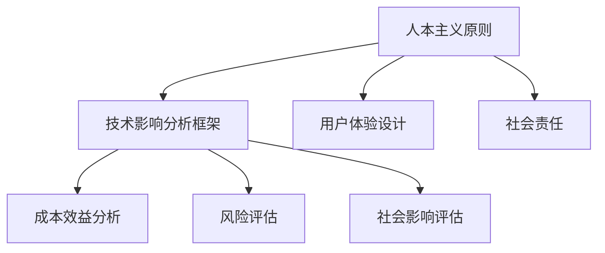

                 

### 让我们一步一步思考：人文导向的技术评估

在信息技术迅猛发展的今天，技术评估的重要性愈加凸显。然而，传统的技术评估方法往往忽略了人类因素，无法全面衡量技术对人类社会的影响。这种局限性催生了人文导向的技术评估，其核心理念是以人为本，强调技术对人类生活、工作和社会环境的影响。

**背景介绍**：

1. **技术评估的概念**：
   技术评估是对技术项目、技术产品或技术方案进行系统分析、评价和决策的过程。它旨在确定技术是否符合预期目标、能否实现预期效益，并评估其潜在的风险和影响。

2. **人文导向的技术评估的必要性**：
   传统的技术评估方法往往侧重于技术本身，忽略了人类在使用技术过程中的需求和感受。而人文导向的技术评估则强调将人类因素纳入评估过程，确保技术发展更好地服务于人类。

3. **问题背景**：
   随着人工智能、大数据、物联网等技术的广泛应用，技术对人类社会的影响日益深远。然而，技术发展的速度往往超过了社会的适应能力，导致了一系列的社会问题，如隐私侵犯、就业危机、道德伦理争议等。

4. **问题描述**：
   技术评估面临的问题是如何在确保技术效率和创新性的同时，最大限度地减少其负面影响，提升人类福祉。

5. **问题解决**：
   通过引入人文导向的评估方法，可以更全面地分析技术对人类的影响，从而在技术设计、开发和应用过程中，采取相应的措施，减少负面影响，提升人类生活质量。

6. **边界与外延**：
   人文导向的技术评估不仅关注技术的直接影响，还关注其间接和长期影响，如社会文化、经济、环境等方面。

7. **概念结构与核心要素组成**：
   - **人本主义原则**：以人为本，关注人类需求和福祉。
   - **技术影响分析框架**：包括评估标准、方法和技术，用于系统评估技术的影响。
   - **用户参与**：在评估过程中，积极邀请用户参与，确保评估结果的准确性和公正性。

**核心概念与联系**：

1. **人本主义原则**：
   人本主义原则是人文导向的技术评估的核心。它强调技术应服务于人类，提升人类生活质量。具体包括：
   - 用户需求分析：深入了解用户需求，确保技术符合用户实际需要。
   - 用户体验设计：注重用户在使用技术过程中的感受，提供愉悦、高效的使用体验。
   - 社会责任：考虑技术对社会的影响，确保其发展符合社会伦理和价值观。

2. **技术影响分析框架**：
   技术影响分析框架是评估技术对人类影响的基础工具。它包括以下几个方面：
   - 成本效益分析：评估技术投入与收益的关系，确保技术发展具有经济效益。
   - 风险评估：识别技术潜在的风险，采取预防措施，降低风险。
   - 社会影响评估：分析技术对社会文化、经济、环境等方面的影响，确保其发展符合社会需求。

为了更好地理解这些核心概念，我们可以通过以下表格和Mermaid图来展示它们之间的关系：

| **概念** | **定义** | **关系** |
| :------: | :------: | :------: |
| 人本主义原则 | 技术应服务于人类 | 与技术影响分析框架相结合 |
| 技术影响分析框架 | 评估技术对人类的影响 | 包括成本效益分析、风险评估、社会影响评估 |
| 用户参与 | 在评估过程中邀请用户参与 | 确保评估结果的准确性和公正性 |

通过以上表格和Mermaid图，我们可以清晰地看到人本主义原则与技术影响分析框架之间的联系，以及用户体验设计和社会责任作为其重要组成部分。

在接下来的章节中，我们将进一步探讨人文导向的技术评估框架、具体评估方法、案例分析，以及评估工具与技术，帮助读者深入了解这一领域的核心概念和实践方法。接下来，我们将详细介绍人文导向的核心概念，包括人本主义原则、技术影响分析框架等，为后续内容奠定坚实基础。

