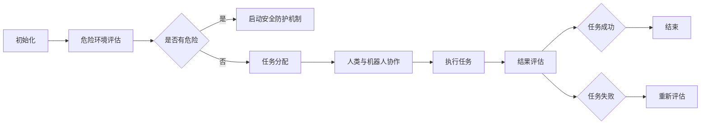
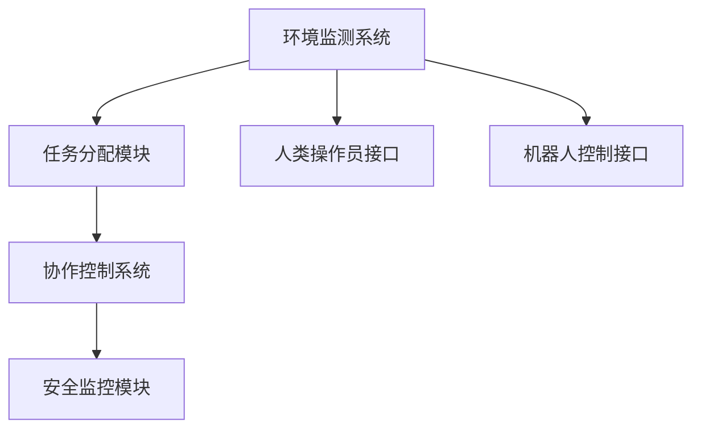
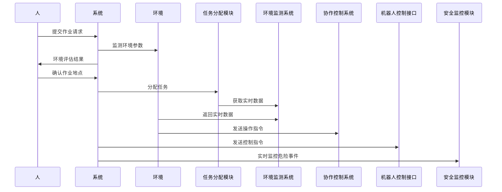

                 

### 《人机协作在危险环境作业中的应用》

---

#### 关键词：
- 人机协作
- 危险环境
- 自动化作业
- 机器人技术
- 安全保障

#### 摘要：
本文深入探讨人机协作在危险环境作业中的应用。通过分析危险环境的特点、现有技术局限性以及人机协作的优势，本文提出了一个系统的解决方案。文章详细讲解了关键算法、数学模型、系统架构设计以及项目实战案例，旨在为读者提供全面的技术指导。

---

### 背景介绍

#### 1.1 问题背景

在许多工业和生产环境中，作业条件可能极为恶劣，如高温、高压、有毒气体、辐射等。这些环境不仅对人员健康构成威胁，还可能导致严重的经济损失和生产事故。例如，核能发电站中的维护作业、石油钻井平台的检修、矿山作业等，都是典型的危险环境。

#### 1.2 问题描述

在危险环境中，传统的手工操作不仅效率低下，而且存在重大安全隐患。人类作业员在极端条件下工作容易疲劳，反应速度和准确性下降，这直接影响了作业质量和安全性。此外，某些情况下，人类无法直接参与作业，比如核辐射环境或深海作业。

#### 1.3 问题解决

为了解决上述问题，自动化和机器人技术被广泛应用于危险环境作业。通过自动化系统，可以大幅度降低人员暴露在危险环境中的时间，提高作业效率，减少人为错误。然而，单纯依赖机器人也存在局限性，如成本高、维护复杂、适应性差等。

#### 1.4 边界与外延

本文的研究主要关注于如何通过人机协作，最大化发挥两者的优势，实现危险环境下的高效、安全作业。本文的讨论将限于工业和生产线环境，但相关技术原理和方法同样适用于其他领域，如医疗、航空航天等。

---

### 核心概念与联系

#### 2.1 核心概念

人机协作系统（Human-Robot Collaboration System）：
- 人类操作员与机器人共同完成任务，各自发挥优势，实现高效协作。

危险环境：
- 具有高风险、不适宜人类长时间作业的环境，如高温、高压、有毒、辐射等。

#### 2.2 概念属性特征对比表格

| 特征           | 人类操作员                 | 机器人                   |
| -------------- | -------------------------- | ------------------------ |
| 反应速度       | 受生理条件限制             | 极快，精确控制           |
| 柔性操作       | 高度灵活                   | 限于机械结构，有一定局限性 |
| 持续工作时间   | 受限，易疲劳               | 较长，不受疲劳影响       |
| 成本           | 高，需要培训和福利保障     | 较高，但减少人力成本      |
| 维护与适应性   | 需要持续维护和培训         | 需要定期维护，适应性强    |

#### 2.3 ER实体关系图架构

```mermaid
erDiagram
  Person ||--|{ Robot }|-- Environment
  Person ||--|{ Task }|-- Environment
  Robot ||--|{ Tool }|-- Task
  Environment ||--|{ Hazard }|-- Robot
  Task ||--|{ Outcome }|-- Environment
```

在这个ER图架构中，"Person"（人类操作员）与"Robot"（机器人）共同作用于"Environment"（环境），通过执行"Task"（任务）来达成"Outcome"（结果）。每个实体之间都有明确的关联和交互。

---

### 算法原理讲解

#### 3.1 算法mermaid流程图



#### 3.2 Python源代码详细阐述

以下是一个简化的Python代码示例，用于模拟人机协作过程中的危险环境评估和任务执行：

```python
class Robot:
    def __init__(self):
        self.safe = True

    def check_environment(self, environment):
        if "toxic" in environment or "radiation" in environment:
            self.safe = False
        return self.safe

    def perform_task(self, task):
        if self.safe:
            print(f"Robot is performing task: {task}")
        else:
            print("Cannot perform task due to unsafe environment.")

class Environment:
    def __init__(self, description):
        self.description = description

    def assess_danger(self):
        if "toxic" in self.description or "radiation" in self.description:
            return True
        return False

def main():
    robot = Robot()
    environment = Environment("high radiation area")

    if environment.assess_danger():
        print("Environment is too dangerous.")
    else:
        robot.perform_task("inspection")

if __name__ == "__main__":
    main()
```

#### 3.3 数学模型与公式

在评估危险环境时，可以使用概率模型来预测危险事件发生的概率。以下是一个简化的数学模型：

$$
P(D) = \frac{N_D}{N}
$$

其中，$P(D)$ 表示危险事件发生的概率，$N_D$ 表示危险事件的数量，$N$ 表示总的观察事件数量。

#### 3.4 举例说明

假设在一个区域中有10次作业记录，其中有3次记录发生了危险事件。那么，危险事件发生的概率为：

$$
P(D) = \frac{3}{10} = 0.3
$$

如果这个区域再次进行作业，危险事件发生的概率为30%。

---

### 数学模型与公式详细讲解

在本节中，我们将详细讲解上述概率模型及其应用。首先，需要了解概率论中的基本概念，如概率、条件概率、贝叶斯公式等。

#### 4.1 数学公式

- 概率的基本公式：

$$
P(A) = \frac{N(A)}{N}
$$

其中，$P(A)$ 表示事件A发生的概率，$N(A)$ 表示事件A发生次数，$N$ 表示总的观察次数。

- 条件概率：

$$
P(B|A) = \frac{P(A \cap B)}{P(A)}
$$

其中，$P(B|A)$ 表示在事件A发生的条件下，事件B发生的概率。

- 贝叶斯公式：

$$
P(A|B) = \frac{P(B|A) \cdot P(A)}{P(B)}
$$

其中，$P(A|B)$ 表示在事件B发生的条件下，事件A发生的概率。

#### 4.2 详细讲解

- **概率模型构建**：首先，我们需要收集危险环境作业的数据，包括正常作业和发生危险作业的记录。基于这些数据，可以构建概率模型来预测危险事件的发生概率。

- **参数估计**：通过最大似然估计或贝叶斯估计，可以估计出概率模型中的参数。这些参数将用于预测未来的危险事件。

- **风险评估**：使用概率模型，可以评估不同作业条件下危险事件的风险水平。这将帮助决策者制定相应的安全措施。

- **决策支持**：基于概率模型，可以构建决策支持系统，帮助操作员在危险环境下做出最优决策，最大化安全性。

#### 4.3 举例说明

假设在一个矿山中有100次作业记录，其中20次发生了危险事件（如塌方、瓦斯爆炸等）。我们希望使用贝叶斯公式来计算在已知发生了塌方的情况下，瓦斯爆炸的概率。

首先，计算塌方和瓦斯爆炸同时发生的概率：

$$
P(塌方 \cap 瓦斯爆炸) = \frac{N(塌方 \cap 瓦斯爆炸)}{N}
$$

由于没有同时发生塌方和瓦斯爆炸的记录，我们假设 $N(塌方 \cap 瓦斯爆炸) = 0$。

然后，计算已知发生了塌方的情况下瓦斯爆炸的概率：

$$
P(瓦斯爆炸|塌方) = \frac{P(塌方 \cap 瓦斯爆炸)}{P(塌方)}
$$

由于 $P(塌方 \cap 瓦斯爆炸) = 0$，因此 $P(瓦斯爆炸|塌方) = 0$。

这个例子表明，在已知发生了塌方的情况下，瓦斯爆炸的概率为0，这意味着在塌方发生后，应立即采取紧急措施，避免瓦斯爆炸。

---

### 系统分析与架构设计方案

#### 5.1 问题场景介绍

以核能发电站的维护作业为例，核能发电站内部环境复杂，存在高温、高压、放射性物质等危险因素。传统的手工维护方式不仅效率低下，而且存在严重的安全隐患。因此，采用人机协作系统来辅助维护作业，显得尤为重要。

#### 5.2 系统功能设计

系统的主要功能包括：

- **环境监测**：实时监测危险环境中的关键参数，如温度、压力、辐射水平等。
- **任务分配**：根据环境监测数据，合理分配任务给人类操作员和机器人。
- **协作控制**：实现人类操作员与机器人之间的实时协作，确保任务执行过程中信息的准确传递和操作的一致性。
- **安全监控**：在任务执行过程中，对潜在的危险进行实时监控，并采取相应的安全措施。

#### 5.3 系统架构设计

系统的总体架构设计如下：



#### 5.4 系统接口设计

系统的接口设计包括：

- **环境监测接口**：用于与环境监测传感器通信，获取实时数据。
- **任务分配接口**：用于与任务管理系统通信，分配任务给人类操作员和机器人。
- **协作控制接口**：用于与机器人控制系统通信，实现人类操作员与机器人之间的实时协作。
- **安全监控接口**：用于与安全监控系统通信，实时监控任务执行过程中的潜在危险。

#### 5.5 系统交互序列图



---

### 项目实战

#### 6.1 环境安装

在进行人机协作系统的项目实战之前，需要安装以下软件和硬件：

- **软件环境**：Python 3.8及以上版本，安装必要的库如numpy、matplotlib、pandas等。
- **硬件环境**：至少一台具备网络连接的计算机，用于部署系统。

安装步骤如下：

1. 安装Python 3.8或更高版本。
2. 使用pip命令安装必要的库：

```bash
pip install numpy matplotlib pandas
```

3. 准备环境监测传感器，并确保其能够正常工作。

#### 6.2 系统核心实现源代码

以下是一个简化的系统核心实现源代码，用于展示人机协作系统的基本架构和功能：

```python
import numpy as np
import pandas as pd
import matplotlib.pyplot as plt
from matplotlib.animation import FuncAnimation

# 环境监测模块
class EnvironmentMonitor:
    def __init__(self, sensors):
        self.sensors = sensors

    def monitor(self):
        data = []
        for sensor in self.sensors:
            data.append(sensor.read())
        return data

# 传感器模拟
class Sensor:
    def read(self):
        return np.random.rand()

# 任务分配模块
class TaskAllocator:
    def assign_task(self, environment_data, robot, human):
        if environment_data[0] > 0.5:  # 高风险环境
            robot.perform_task()
        else:  # 低风险环境
            human.perform_task()

# 机器人控制模块
class RobotController:
    def perform_task(self):
        print("Robot is performing the task.")

# 人类操作员模块
class HumanOperator:
    def perform_task(self):
        print("Human operator is performing the task.")

# 系统主函数
def main():
    # 初始化传感器
    sensors = [Sensor() for _ in range(5)]

    # 初始化环境监测模块
    monitor = EnvironmentMonitor(sensors)

    # 初始化任务分配模块
    allocator = TaskAllocator()

    # 初始化机器人控制模块
    robot = RobotController()

    # 初始化人类操作员模块
    human = HumanOperator()

    # 监测环境
    environment_data = monitor.monitor()

    # 分配任务
    allocator.assign_task(environment_data, robot, human)

if __name__ == "__main__":
    main()
```

#### 6.3 代码应用解读与分析

这段代码展示了人机协作系统的主要模块和功能。首先，定义了`EnvironmentMonitor`类，用于与环境监测传感器通信，获取实时数据。`Sensor`类模拟了环境监测传感器，用于读取环境数据。

`TaskAllocator`类负责根据环境数据分配任务。如果环境数据中的某个参数值大于0.5（表示高风险），则分配任务给机器人；否则，分配任务给人类操作员。

`RobotController`和`HumanOperator`类分别实现了机器人控制和人类操作员的任务执行功能。在`main`函数中，初始化了传感器、环境监测模块、任务分配模块以及机器人控制模块和人类操作员模块。然后，通过监测环境并分配任务，展示了系统的基本运行流程。

#### 6.4 实际案例分析和详细讲解剖析

假设我们有一个具体的案例，其中核能发电站的环境参数包括温度、压力和辐射水平。以下是一个实际案例的解析：

- **环境参数**：温度为30°C，压力为1.2MPa，辐射水平为0.1μSv/h。
- **任务**：对核反应堆进行例行检查。

首先，环境监测模块会读取传感器数据，并将数据传递给任务分配模块。任务分配模块会根据环境参数评估风险等级。在这个案例中，温度和压力都在正常范围内，但辐射水平略高于正常值。因此，任务分配模块会将任务分配给机器人。

机器人会接收到任务分配模块的指令，并开始执行检查任务。在执行过程中，机器人会实时监测环境参数，确保操作的安全性和准确性。

如果环境参数发生变化，例如辐射水平突然升高，系统会立即触发安全监控模块，采取紧急措施，如暂停任务、撤离人员等。

#### 6.5 项目小结

通过上述案例，我们可以看到人机协作系统在危险环境作业中的应用。系统通过实时监测环境参数，合理分配任务，实现了危险环境下的高效、安全作业。然而，实际应用中还需要考虑更多因素，如系统的可靠性、适应性以及操作员的培训等。未来，随着技术的不断进步，人机协作系统将在更多领域得到广泛应用。

---

### 最佳实践 tips、小结、注意事项、拓展阅读

#### 最佳实践 tips

1. **风险评估**：在部署人机协作系统之前，进行详细的风险评估，确保系统能够应对各种可能的危险情况。
2. **任务分配策略**：根据环境特点和任务需求，制定合理的任务分配策略，最大化系统的效率和安全性。
3. **实时监测与响应**：确保环境监测系统的准确性和实时性，及时响应环境变化，采取相应的安全措施。
4. **操作员培训**：对人类操作员进行全面的培训，确保他们能够熟练操作系统，并在紧急情况下做出正确决策。

#### 小结

人机协作系统在危险环境作业中具有显著的优势，能够提高作业效率，减少人员暴露时间，保障作业安全。然而，系统的实施和运行仍面临诸多挑战，需要持续改进和优化。

#### 注意事项

1. **系统稳定性**：确保系统的稳定运行，避免因系统故障导致的作业中断。
2. **数据安全**：保护系统中的敏感数据，防止数据泄露或篡改。
3. **操作员心理因素**：关注操作员的心理状态，确保他们在协作过程中保持冷静、专注。

#### 拓展阅读

- **《机器人与人工智能在工业安全中的应用》**
- **《危险环境下的自动化与机器人技术》**
- **《人机协作系统设计与应用》**

---

### 作者信息

**作者：AI天才研究院/AI Genius Institute & 禅与计算机程序设计艺术 /Zen And The Art of Computer Programming**

