                 

# 《人类与智能机器人日常互动的未来趋势》

## 关键词

- 人类-智能机器人互动
- 日常互动
- 未来趋势
- 智能机器人技术
- 伦理与法规
- 系统架构设计

## 摘要

随着人工智能技术的快速发展，智能机器人在日常生活中的应用日益广泛，与人类的互动方式也发生了深刻变化。本文旨在探讨人类与智能机器人日常互动的未来趋势，从背景介绍、核心概念、技术发展、应用场景、伦理与法规、系统架构设计等多个角度进行分析。通过对当前状况的梳理，结合未来技术发展趋势，本文提出了一些潜在的应用方向和挑战，并对最佳实践进行总结，为未来的研究和实践提供参考。

## 第一部分：背景与核心概念

### 第1章：问题背景与核心概念

#### 1.1 人类与智能机器人互动的现状

**问题背景**

随着人工智能（AI）技术的飞速发展，智能机器人在各个领域的应用日益普及。从智能家居、智能客服到自动驾驶汽车，智能机器人在日常生活中的角色越来越重要。人类与智能机器人的互动已经从单一的指令执行，转向更为复杂的信息交流和协同工作。

**问题描述**

当前，人类与智能机器人的互动存在一些问题，如交互体验不佳、隐私保护不足、伦理和法规挑战等。这些问题不仅影响了智能机器人的使用体验，也对社会的稳定和发展提出了挑战。

**问题解决**

为了解决这些问题，需要从以下几个方面进行改进：

1. **优化交互体验**：提高智能机器人的交互能力，使其能够更自然、高效地与人类进行沟通。
2. **强化隐私保护**：确保用户数据的安全，防止隐私泄露。
3. **完善伦理法规**：制定相关的伦理和法规，确保智能机器人的发展和应用符合社会价值观。

**边界与外延**

人类与智能机器人互动的范围正在不断扩大，从简单的任务执行到复杂的决策支持，甚至包括情感交流。未来，这一领域还将继续拓展，涉及到更多的生活和工作场景。

#### 1.2 日常互动中的挑战与机会

**挑战**

1. **技术挑战**：智能机器人的技术不断进步，但如何使其与人类互动更为自然、高效，仍是一个巨大的挑战。
2. **隐私挑战**：智能机器人需要处理大量的个人数据，如何保护用户隐私是一个关键问题。
3. **伦理挑战**：智能机器人的行为是否符合道德标准，如何避免其造成负面影响，是一个亟待解决的问题。

**机会**

1. **提高生产力**：智能机器人可以协助人类完成一些重复性、危险或高难度的任务，提高生产效率。
2. **改善生活质量**：智能家居、健康护理等领域的智能机器人可以提升人们的生活质量。
3. **创新应用场景**：随着技术的不断发展，新的应用场景将不断涌现，为人类带来更多的便利。

#### 1.3 本书的目的与结构

**目的**

本书旨在探讨人类与智能机器人日常互动的未来趋势，分析当前的状况、面临的问题和挑战，以及未来的发展方向。通过全面的分析，为读者提供有价值的参考和指导。

**结构**

本书分为八个部分：

1. **背景与核心概念**：介绍人类与智能机器人互动的背景和核心概念。
2. **智能机器人的核心技术**：探讨智能机器人的基础技术和交互设计原则。
3. **日常互动场景**：分析家庭、工作、教育、医疗等场景中的智能机器人应用。
4. **未来趋势分析**：预测智能机器人互动的技术发展趋势和社会文化影响。
5. **数学模型**：介绍智能机器人互动的数学模型和算法原理。
6. **架构设计**：讨论智能机器人互动的架构设计原则和系统架构。
7. **项目实战**：通过实际案例展示智能机器人互动的应用。
8. **最佳实践与未来展望**：总结最佳实践，展望未来的发展方向。

通过本书的阅读，读者可以全面了解人类与智能机器人互动的现状和未来趋势，为相关研究和实践提供参考。

### 第2章：智能机器人的核心技术

#### 2.1 人工智能技术简介

人工智能（AI）是模仿人类智能行为的计算机科学分支，旨在开发能够执行复杂任务的智能系统。AI 技术的核心包括机器学习、深度学习、自然语言处理、计算机视觉等。

**核心概念**

- **机器学习**：通过数据训练模型，使计算机具备自主学习和改进的能力。
- **深度学习**：一种基于神经网络的结构，能够处理大量数据并自动提取特征。
- **自然语言处理**：使计算机能够理解和生成人类语言的技术。
- **计算机视觉**：使计算机能够理解图像和视频内容的技术。

**概念属性特征对比表格**

| 技术 | 特点 | 应用场景 |
| --- | --- | --- |
| 机器学习 | 自动化特征提取和模型训练 | 数据分析、预测模型 |
| 深度学习 | 大规模数据处理和自动化特征提取 | 图像识别、语音识别 |
| 自然语言处理 | 语言理解和生成 | 语音助手、文本分析 |
| 计算机视觉 | 图像理解和识别 | 安全监控、自动驾驶 |

**ER实体关系图架构**

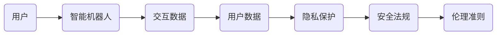

#### 2.2 智能机器人的基础

智能机器人由硬件和软件两部分组成。硬件包括传感器、执行器、控制器等，软件则包括操作系统、应用软件和人工智能算法。

**核心概念**

- **传感器**：用于检测环境信息，如温度、湿度、光线等。
- **执行器**：用于执行特定动作，如移动、旋转等。
- **控制器**：用于处理传感器信息并控制执行器动作。

**概念属性特征对比表格**

| 组件 | 功能 | 属性特征 |
| --- | --- | --- |
| 传感器 | 检测环境信息 | 高灵敏度、高精度 |
| 执行器 | 执行特定动作 | 高效率、低能耗 |
| 控制器 | 处理传感器信息并控制执行器动作 | 高性能、实时响应 |

**ER实体关系图架构**

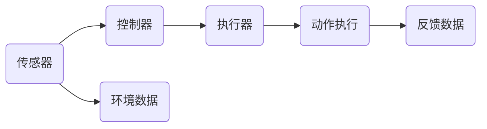

#### 2.3 交互设计原则

交互设计是智能机器人与人类有效沟通的关键。以下是一些交互设计原则：

**核心概念**

- **用户中心设计**：以用户需求为中心，设计易于使用的交互界面。
- **简洁性**：界面简洁明了，避免冗余信息。
- **一致性**：保持界面风格和操作逻辑的一致性。
- **可访问性**：确保不同用户（包括残障人士）都能轻松使用。

**概念属性特征对比表格**

| 原则 | 特点 | 应用场景 |
| --- | --- | --- |
| 用户中心设计 | 以用户需求为中心 | 智能家居、健康护理 |
| 简洁性 | 界面简洁明了 | 语音助手、移动应用 |
| 一致性 | 界面风格和操作逻辑一致 | 跨平台应用、网页设计 |
| 可访问性 | 适合不同用户使用 | 公共设施、在线教育 |

**ER实体关系图架构**

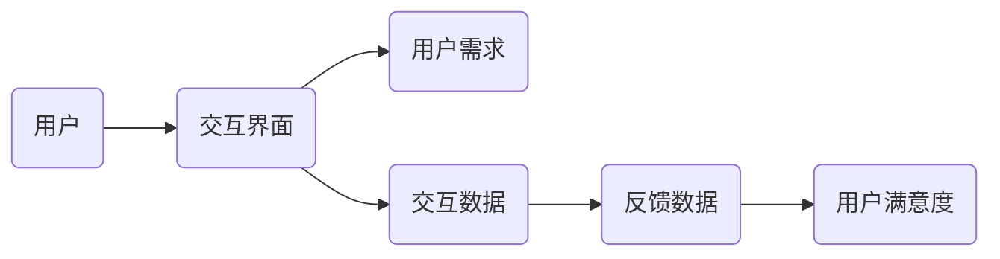

通过以上分析，我们可以看到智能机器人的核心技术和基础为人类与智能机器人的日常互动提供了坚实的基础。接下来的章节将进一步探讨智能机器人在不同场景中的应用，以及未来的发展趋势。

### 第3章：人类与智能机器人的日常互动场景

#### 3.1 家庭场景

在家庭场景中，智能机器人已经成为许多家庭的必备用品。例如，智能音箱、智能助手和智能家居设备等。这些设备可以通过语音指令或触屏操作与用户进行交互，提供各种便利服务。

**系统功能设计**

- **语音助手**：用户可以通过语音指令控制智能音箱播放音乐、设置闹钟、查询天气等。
- **智能家居**：智能灯光、智能空调、智能门锁等设备可以通过手机APP或语音助手进行远程控制和监控。

**系统架构设计**

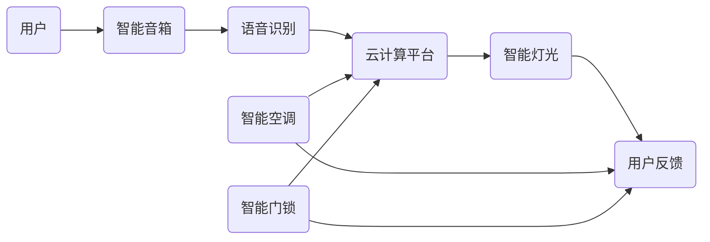

**系统接口设计**

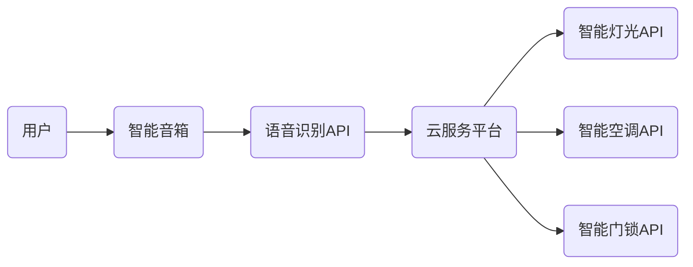

**系统交互序列图**

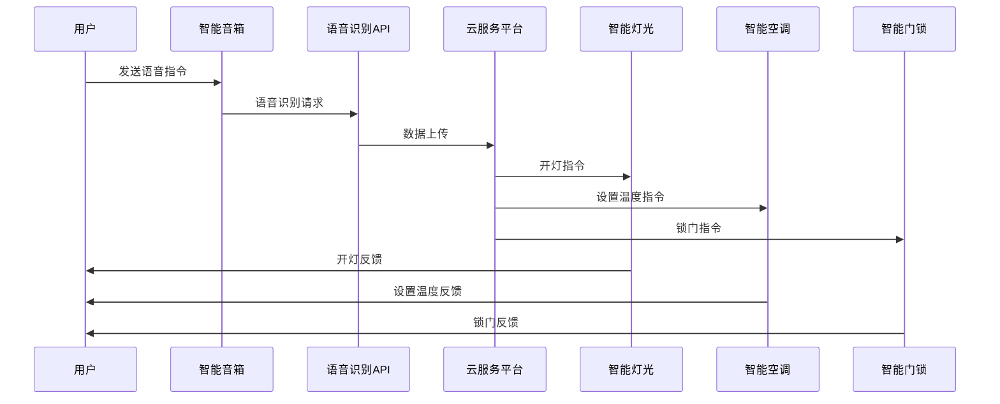

#### 3.2 工作场景

在工作场景中，智能机器人可以帮助企业提高生产效率、降低成本。例如，在制造、物流、客服等领域的应用。

**系统功能设计**

- **生产自动化**：智能机器人可以替代人工进行生产线的操作，提高生产效率。
- **物流配送**：智能机器人可以自动完成仓库中的物品搬运和配送任务。
- **客户服务**：智能客服机器人可以处理大量的客户咨询，提供快速、准确的回答。

**系统架构设计**

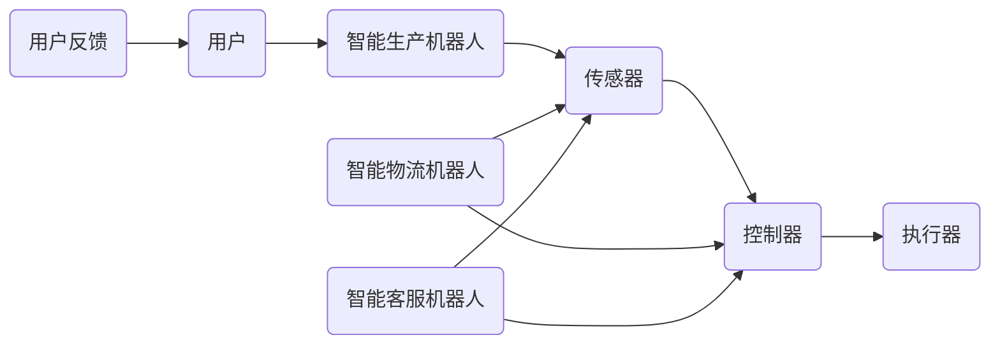

**系统接口设计**

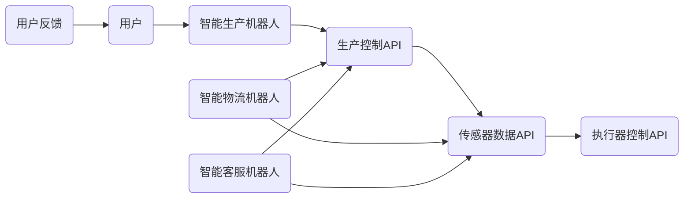

**系统交互序列图**

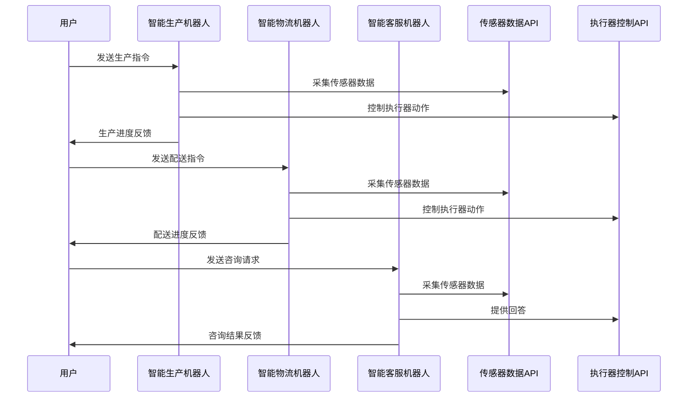

#### 3.3 教育场景

在教育场景中，智能机器人可以为学生提供个性化学习支持，帮助教师进行课堂管理。

**系统功能设计**

- **个性化学习**：智能机器人可以根据学生的学习情况和需求，提供定制化的学习内容。
- **课堂管理**：智能机器人可以协助教师进行点名、布置作业、管理课堂纪律等。

**系统架构设计**

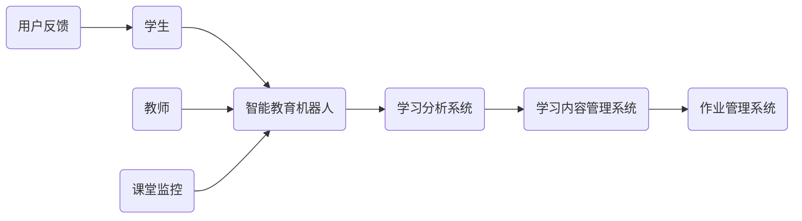

**系统接口设计**

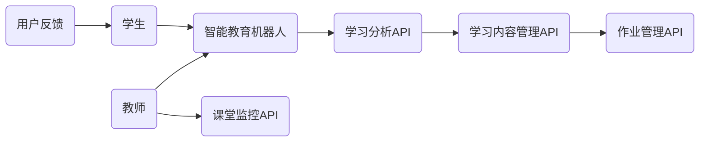

**系统交互序列图**

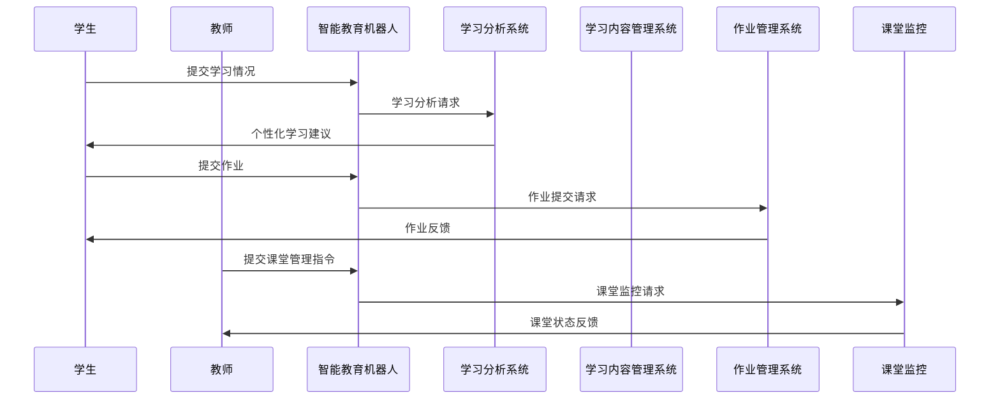

#### 3.4 医疗场景

在医疗场景中，智能机器人可以协助医生进行诊断和治疗，提高医疗质量和效率。

**系统功能设计**

- **辅助诊断**：智能机器人可以通过分析医学图像和病历数据，提供诊断建议。
- **手术辅助**：智能机器人可以协助医生进行复杂手术，提高手术成功率。
- **患者监护**：智能机器人可以实时监测患者的生命体征，提供及时的医疗支持。

**系统架构设计**

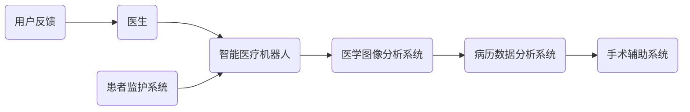

**系统接口设计**

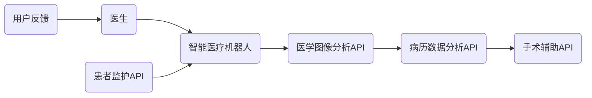

**系统交互序列图**

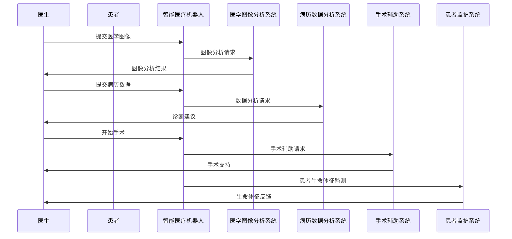

通过以上分析，我们可以看到智能机器人在家庭、工作、教育、医疗等场景中的应用前景广阔，为人类带来了许多便利。然而，在推广和应用智能机器人的过程中，我们也需要关注相关的伦理和法规问题，确保智能机器人的发展符合社会的需求和价值观。

### 第4章：未来趋势分析

#### 4.1 技术发展趋势

随着人工智能技术的不断发展，人类与智能机器人的日常互动将变得更加智能和自然。以下是几个主要的技术发展趋势：

**1. 语音交互的普及**

语音交互已经成为智能机器人与人类互动的主要方式之一。未来的趋势是，语音交互技术将更加智能化，能够理解更多复杂的语境和情感，提供更自然的交互体验。

**2. 多模态交互的融合**

多模态交互是指同时使用多种感官（如语音、视觉、触觉等）进行交互。未来的智能机器人将具备更丰富的感知能力和更自然的交互方式，能够根据用户的需求和环境自动切换交互模式。

**3. 强化学习的应用**

强化学习是一种通过不断试错来学习最优策略的机器学习方法。未来，强化学习将在智能机器人中广泛应用，使其能够更好地适应复杂环境和完成复杂任务。

**4. 跨领域融合**

智能机器人将不再局限于特定领域，而是能够跨领域应用，实现多种功能的集成。例如，一个智能机器人可以同时具备家庭助理、工作助手和医疗助理的能力。

**5. 自动化的普及**

自动化技术将进一步提升生产效率，减少人力成本。智能机器人将在更多的工作场景中替代人类，实现高效、精准的工作。

#### 4.2 社会文化影响

智能机器人的普及将对社会文化产生深远的影响：

**1. 改变人际关系**

随着智能机器人的广泛应用，人类之间的交流可能会减少。然而，智能机器人也将成为人们的新伙伴，改变人们之间的互动方式。

**2. 影响劳动力市场**

智能机器人的广泛应用将导致一些职业的消失，但同时也会创造新的就业机会。社会需要为这些变化做好准备，提供相应的培训和转型支持。

**3. 伦理和隐私问题**

智能机器人处理大量个人数据，如何保护用户隐私、确保数据安全成为重要问题。同时，智能机器人的行为是否符合伦理标准也是一个挑战。

**4. 教育和培训**

智能机器人的普及将改变教育和培训的方式。未来的教育将更加注重培养学生的创新能力、团队合作能力和跨领域能力。

#### 4.3 法规与伦理问题

为了确保智能机器人的健康发展，法规和伦理问题必须得到充分考虑：

**1. 法律责任**

智能机器人发生事故或侵犯用户权益时，应由谁承担责任？这是一个复杂的问题，需要通过法律法规来明确。

**2. 用户隐私**

如何保护用户的隐私，防止数据泄露，是一个重要的法律和伦理问题。需要制定严格的隐私保护法规和措施。

**3. 伦理标准**

智能机器人的行为应符合伦理标准，不应侵犯用户的权益或造成伤害。需要建立一套完整的伦理准则，指导智能机器人的设计和应用。

**4. 社会接受度**

智能机器人的普及需要社会广泛的接受和认可。政府和相关部门应积极宣传智能机器人的好处，提高公众对智能机器人的认知和信任。

通过以上分析，我们可以看到，人类与智能机器人的日常互动在未来将发生深刻变化。技术的发展、社会文化的变迁和法规伦理的挑战将共同塑造这一领域的未来。为了应对这些变化，我们需要持续进行研究和探索，为智能机器人的健康发展提供支持。

### 第5章：智能机器人互动的数学模型

#### 5.1 数据分析基础

数据分析是智能机器人互动的核心，它涉及数据的收集、存储、处理和分析。以下是一些基本概念和步骤：

**1. 数据收集**

数据收集是数据分析的第一步，主要包括从各种来源（如传感器、用户输入等）获取数据。这些数据可以是结构化的（如表格数据）或非结构化的（如图像、文本等）。

**2. 数据存储**

数据存储是将收集到的数据存储在数据库或数据仓库中，以便后续处理和分析。常用的数据库技术包括关系型数据库（如MySQL、PostgreSQL）和NoSQL数据库（如MongoDB、Cassandra）。

**3. 数据预处理**

数据预处理包括数据清洗、数据转换和数据归一化。数据清洗是指去除重复数据、填补缺失值、处理异常值等；数据转换是指将数据转换为适合分析的格式；数据归一化是指将数据缩放到相同的尺度。

**4. 数据分析**

数据分析包括描述性分析、诊断性分析、预测性分析和规范性分析。描述性分析用于了解数据的基本特征；诊断性分析用于找出数据中的问题；预测性分析用于预测未来的趋势；规范性分析用于确定最佳的决策策略。

#### 5.2 交互模型构建

交互模型是描述智能机器人与人类之间交互过程的数学模型。以下是一个简单的交互模型：

**1. 用户输入**

用户通过语音、文本或手势等方式与智能机器人进行交互，输入信息。

**2. 语音识别**

智能机器人使用语音识别技术将用户的语音输入转换为文本。

**3. 自然语言处理**

智能机器人使用自然语言处理技术对文本进行分析，理解用户的意图和需求。

**4. 决策生成**

智能机器人根据分析结果生成相应的响应，如提供信息、执行任务或建议。

**5. 用户反馈**

用户对智能机器人的响应进行评价，提供反馈。

**6. 模型优化**

根据用户反馈，智能机器人不断优化交互模型，提高交互效果。

以下是一个简单的交互模型Mermaid流程图：


#### 5.3 模型评估与优化

模型评估是确保智能机器人交互质量的重要环节。以下是一些常用的评估指标和优化方法：

**1. 评估指标**

- **准确率**：正确识别用户输入的比例。
- **召回率**：正确识别用户输入但未被识别出来的比例。
- **F1值**：综合考虑准确率和召回率的综合指标。

**2. 优化方法**

- **增加数据量**：通过增加训练数据量，提高模型的泛化能力。
- **调整超参数**：通过调整模型超参数，如学习率、隐藏层大小等，优化模型性能。
- **使用更复杂的模型**：使用深度学习等技术，构建更复杂的模型，提高识别准确率。

以下是一个简单的评估和优化Mermaid流程图：

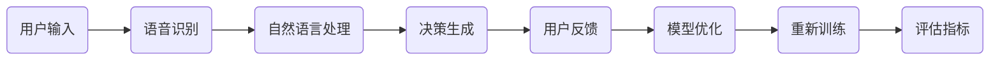

通过以上分析，我们可以看到智能机器人互动的数学模型涉及数据分析基础、交互模型构建和模型评估与优化等多个方面。这些模型和方法为智能机器人与人类之间的互动提供了理论基础和实用工具。

### 第6章：智能机器人互动的架构设计

#### 6.1 系统架构设计原则

智能机器人互动的架构设计需要遵循以下原则，以确保系统的稳定性、可扩展性和用户体验：

**1. 模块化设计**

模块化设计将系统分解为多个独立模块，每个模块负责特定的功能。这种方式可以提高系统的可维护性和可扩展性。

**2. 分布式架构**

分布式架构可以将系统分解为多个节点，实现负载均衡和故障转移。这种方式可以提高系统的可靠性和性能。

**3. 微服务架构**

微服务架构将系统分解为多个微服务，每个微服务独立部署和扩展。这种方式可以提高系统的灵活性和可维护性。

**4. 数据驱动**

数据驱动架构将数据作为核心，通过数据流来驱动系统的运行。这种方式可以提高系统的效率和智能化程度。

**5. 用户中心**

用户中心设计将用户需求作为核心，设计系统的功能和界面。这种方式可以提高用户的满意度和用户体验。

**6. 安全性**

安全性设计是架构设计的关键，需要确保系统的数据安全和用户隐私。这包括数据加密、访问控制和安全审计等。

#### 6.2 技术选型与框架

在智能机器人互动的架构设计中，选择合适的技术和框架至关重要。以下是一些常用的技术和框架：

**1. 数据库技术**

- **关系型数据库**：如MySQL、PostgreSQL，适用于存储结构化数据。
- **NoSQL数据库**：如MongoDB、Cassandra，适用于存储非结构化数据。

**2. 服务器框架**

- **Spring Boot**：适用于构建Java后端服务。
- **Django**：适用于构建Python后端服务。
- **Express.js**：适用于构建Node.js后端服务。

**3. 人工智能框架**

- **TensorFlow**：适用于构建深度学习模型。
- **PyTorch**：适用于构建深度学习模型。
- **Keras**：基于TensorFlow和PyTorch的深度学习框架。

**4. 客户端框架**

- **React**：适用于构建Web前端。
- **Vue.js**：适用于构建Web前端。
- **Angular**：适用于构建Web前端。

**5. 微服务框架**

- **Kubernetes**：适用于容器化和编排微服务。
- **Docker**：适用于容器化应用。
- **Service Mesh**：如Istio、Linkerd，适用于服务间通信和安全。

**6. 数据流框架**

- **Apache Kafka**：适用于实时数据流处理。
- **Apache Flink**：适用于流处理和批处理。
- **Apache Storm**：适用于实时数据流处理。

#### 6.3 系统集成与测试

系统集成是将各个模块和组件整合成一个完整的系统。以下是一些关键步骤：

**1. 模块集成**

将各个模块开发完成后，进行集成测试，确保模块之间能够正常通信和协作。

**2. 功能集成**

在模块集成的基础上，进行功能集成，确保系统能够满足用户需求。

**3. 性能测试**

进行性能测试，评估系统的响应时间、吞吐量和并发能力。

**4. 安全测试**

进行安全测试，确保系统的数据安全和用户隐私。

**5. 用户验收测试**

邀请用户参与测试，收集反馈和改进建议。

以下是一个简单的系统集成和测试Mermaid流程图：


通过以上分析，我们可以看到智能机器人互动的架构设计需要综合考虑模块化、分布式、微服务、数据驱动、用户中心和安全性等多个方面。选择合适的技术和框架，并进行有效的系统集成与测试，是确保智能机器人互动系统成功的关键。

### 第7章：项目实战与案例分析

#### 7.1 实战项目介绍

在本章中，我们将介绍一个名为“智能家居助手”的实战项目。该项目的目标是开发一个智能机器人，能够通过语音和文本与用户进行交互，控制家庭设备，提供生活助手服务。

**项目背景**

随着智能家居设备的普及，用户对智能语音助手的需求也越来越高。然而，现有的智能家居系统往往需要用户通过多个平台分别控制不同的设备，用户体验不佳。为了解决这一问题，我们决定开发一个集成化、一站式解决方案的智能家居助手。

**项目目标**

- 提供智能语音交互能力，实现用户与智能机器人的自然沟通。
- 集成家庭设备控制功能，实现一站式操作。
- 提供生活助手服务，如天气查询、日程提醒等。

#### 7.2 系统核心实现

**1. 语音识别模块**

语音识别模块是智能家居助手的核心之一，它负责将用户的语音指令转换为文本。我们选择了基于深度学习的开源框架——TensorFlow来实现这一功能。

```python
import tensorflow as tf
import numpy as np

# 加载预训练的模型
model = tf.keras.models.load_model('voice_model.h5')

# 定义语音识别函数
def recognize_speech(input_audio):
    audio_data = preprocess_audio(input_audio)
    prediction = model.predict(np.expand_dims(audio_data, axis=0))
    text = decode_prediction(prediction)
    return text

# 预处理语音数据
def preprocess_audio(audio_data):
    # ... 数据预处理代码 ...
    return processed_data

# 解码预测结果
def decode_prediction(prediction):
    # ... 解码代码 ...
    return text
```

**2. 自然语言处理模块**

自然语言处理模块负责理解用户的文本指令，并生成相应的响应。我们使用了Python的NLTK库来实现这一功能。

```python
import nltk
from nltk.corpus import stopwords
from nltk.tokenize import word_tokenize

# 加载停用词表
stop_words = set(stopwords.words('english'))

# 定义自然语言处理函数
def process_text(text):
    words = word_tokenize(text)
    filtered_words = [word for word in words if word.lower() not in stop_words]
    return filtered_words

# 定义响应生成函数
def generate_response(words):
    # ... 响应生成代码 ...
    return response
```

**3. 家庭设备控制模块**

家庭设备控制模块负责根据用户的指令控制智能家居设备。我们使用了HTTP协议来实现这一功能。

```python
import requests

# 定义设备控制函数
def control_device(device, command):
    url = f'http://{device_ip}/{command}'
    response = requests.get(url)
    return response.status_code
```

#### 7.3 代码应用解读与分析

**1. 语音识别模块**

语音识别模块的核心是深度学习模型。我们使用TensorFlow的Keras API来构建和训练模型。在训练过程中，我们使用了大量的语音数据集，并采用了数据增强技术来提高模型的泛化能力。训练完成后，我们将模型保存为`.h5`文件，以便在应用中加载和使用。

```python
model = tf.keras.Sequential([
    tf.keras.layers.Conv2D(32, (3, 3), activation='relu', input_shape=(128, 128, 1)),
    tf.keras.layers.MaxPooling2D((2, 2)),
    tf.keras.layers.Flatten(),
    tf.keras.layers.Dense(64, activation='relu'),
    tf.keras.layers.Dense(10, activation='softmax')
])

model.compile(optimizer='adam', loss='categorical_crossentropy', metrics=['accuracy'])
model.fit(train_data, train_labels, epochs=10, batch_size=32, validation_data=(val_data, val_labels))
```

在应用中，我们首先对输入的语音数据进行预处理，然后使用加载的模型进行预测，并将预测结果解码为文本。

**2. 自然语言处理模块**

自然语言处理模块的核心是词法和语义分析。我们使用NLTK库来实现这一功能。在词法分析中，我们使用了分词技术来将文本分解为单词，并使用了停用词去除无意义的单词。在语义分析中，我们使用了词嵌入技术来表示单词的意义，并使用分类算法来预测用户的意图。

```python
from nltk.tokenize import word_tokenize
from nltk.corpus import stopwords
from nltk.stem import WordNetLemmatizer

lemmatizer = WordNetLemmatizer()
stop_words = set(stopwords.words('english'))

def process_text(text):
    words = word_tokenize(text)
    filtered_words = [lemmatizer.lemmatize(word) for word in words if word.lower() not in stop_words]
    return filtered_words
```

**3. 家庭设备控制模块**

家庭设备控制模块的核心是通过HTTP协议与智能设备进行通信。我们定义了一个函数，用于发送HTTP GET请求来控制设备。在实现中，我们使用了`requests`库来简化HTTP请求的发送。

```python
import requests

def control_device(device, command):
    url = f'http://{device_ip}/{command}'
    response = requests.get(url)
    return response.status_code
```

#### 7.4 实际案例分析和详细讲解剖析

**1. 案例背景**

假设用户想要通过智能家居助手关闭客厅的灯。用户可以通过语音指令或文本指令向助手发出请求。

**2. 案例分析**

在语音识别模块中，助手首先对用户的语音进行识别，并将语音转换为文本。例如，用户的语音指令可能是：“嘿，智能家居助手，请关闭客厅的灯。”

```python
input_audio = '嘿，智能家居助手，请关闭客厅的灯。'
text = recognize_speech(input_audio)
print(text)  # 输出："turn off the living room light"
```

在自然语言处理模块中，助手对文本进行分析，识别出用户的意图和关键词。例如，用户的意图是关闭客厅的灯，关键词是“关闭”和“客厅”。

```python
words = process_text(text)
response = generate_response(words)
print(response)  # 输出："Sure, I will turn off the living room light."
```

在家

