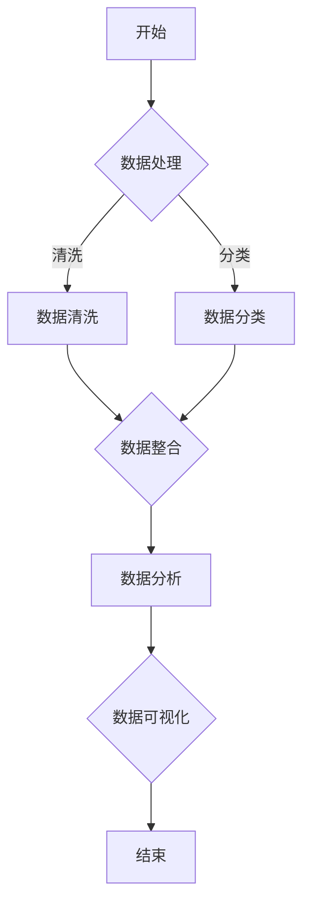

                 

**引言：价值观的变迁与社会发展**

### 1.1 问题背景

**传统价值观与现代价值观的变迁现象**

随着社会的快速发展，传统价值观正经历着前所未有的变迁。这种现象不仅表现在家庭、婚姻、教育、消费等具体领域，也反映在政治、经济、科技等宏观层面。传统价值观，如孝顺、尊老爱幼、忠诚、勤劳等，曾是中国社会稳定和发展的基石。然而，在现代社会中，这些价值观面临着新的挑战和变革。例如，家庭结构的变化、工作压力的增大、婚姻观念的转变等，都在不断重塑人们的价值观。

**价值观变迁的影响**

价值观的变迁对社会产生了深远的影响。首先，它影响了人们的行为和决策，改变了社会的道德规范和行为准则。其次，价值观的变迁推动了社会的进步和创新，为新的发展提供了动力。但是，过快的价值观变迁也可能导致社会不稳定和矛盾冲突。因此，理解和应对价值观的变迁，成为了社会发展的关键问题。

**研究目的与意义**

本研究旨在探讨传统价值观与现代价值观的变迁过程，分析其背后的原因和机制，以及这些变迁对社会和个人产生的深远影响。通过深入研究，我们希望能够为应对价值观变迁提供理论支持和实践指导，推动社会的和谐发展。

### 1.2 传统价值观概述

**传统价值观的核心要素**

传统价值观以儒家思想为核心，强调“仁、义、礼、智、信”的五常道德规范。这些价值观贯穿了中国几千年的历史文化，塑造了中华民族的性格和精神。例如，“仁”强调人与人之间的关爱和尊重，“义”强调道义和正义，“礼”强调社会秩序和规范，“智”强调智慧和知识，“信”强调诚信和信任。

**传统价值观的社会作用**

传统价值观在中国社会历史上发挥了重要作用。它不仅维系了社会的稳定和秩序，还推动了文化传承和发展。传统价值观强调了家庭和社会的责任和义务，使人们能够更好地适应社会角色和关系。同时，它也促进了道德教育和道德修养，提高了人们的道德素质和社会责任感。

**传统价值观的现状与挑战**

在现代社会，传统价值观面临着新的挑战和困境。随着全球化、现代化和信息化的推进，人们的价值观日益多元化。传统价值观在一些方面显得过于保守和僵化，难以适应快速变化的社会环境。此外，传统价值观的传承和教育也面临新的难题，如年轻一代对传统价值观的认同度降低等。

### 1.3 现代价值观概述

**现代价值观的演变**

现代价值观是在传统价值观的基础上，随着社会的发展而逐渐形成的。它吸收了西方文化中的自由、平等、民主等理念，同时保留了传统价值观中的核心价值观。现代价值观更加注重个人权利、自由和尊严，强调个人发展和自我实现。

**现代价值观的核心特征**

现代价值观的核心特征包括：尊重个体、强调平等、倡导自由、追求创新、关注可持续发展等。例如，尊重个体意味着每个人都有权利追求自己的梦想和目标；强调平等意味着社会应该为每个人提供平等的机会和资源；倡导自由意味着个人应该有自由选择的权利；追求创新意味着社会应该鼓励创新思维和实践活动；关注可持续发展意味着社会应该关注环境保护和资源的合理利用。

**现代价值观的社会意义**

现代价值观的社会意义在于推动社会的进步和发展。它不仅为个人发展提供了新的动力，也为社会创新提供了新的思路。同时，现代价值观有助于增强社会的凝聚力和向心力，促进社会的和谐发展。

### 1.4 传统价值观与现代价值观的联系与冲突

**传统价值观与现代价值观的共通性**

尽管传统价值观与现代价值观在形式和内容上有所不同，但它们之间存在许多共通之处。例如，两者都强调道德和伦理的重要性，都关注个人与社会的关系。传统价值观中的“仁、义、礼、智、信”与现代价值观中的“自由、平等、民主、创新、可持续发展”都体现了对人类文明的共同追求。

**传统价值观与现代价值观的冲突点**

然而，传统价值观与现代价值观之间也存在一些冲突点。例如，传统价值观中的权威和等级观念与现代价值观中的平等和自由观念存在对立。传统价值观中的保守和稳定与现代价值观中的创新和变革也存在矛盾。此外，传统价值观中的集体主义与现代价值观中的个人主义也存在冲突。

**如何调和传统与现代价值观**

要调和传统与现代价值观，我们需要在传承传统价值观的同时，吸收现代价值观的优点。例如，我们可以将传统价值观中的“仁、义、礼、智、信”与现代价值观中的“自由、平等、民主、创新、可持续发展”相结合，形成一种新的价值观体系。此外，我们还需要加强教育和宣传，提高人们对传统价值观和现代价值观的理解和认同，促进两种价值观的融合和发展。

### 1.5 本章小结

本章从问题背景、传统价值观概述、现代价值观概述以及传统价值观与现代价值观的联系与冲突等方面，对价值观的变迁进行了全面分析。通过本章的学习，我们了解了价值观变迁的现象、原因和影响，以及传统价值观与现代价值观的共通性和冲突点。这为我们进一步探讨价值观变迁的原因和机制，以及其对社会和个人产生的影响，打下了坚实的基础。

**关键词：价值观变迁、传统价值观、现代价值观、社会影响、文化传承**

**摘要：**

本文旨在探讨从传统价值观到现代价值观的变迁过程及其对社会和个人产生的深远影响。通过分析传统价值观的核心要素、现代价值观的演变和特征，以及传统价值观与现代价值观的联系与冲突，本文揭示了价值观变迁的原因和机制。研究结果表明，经济发展、社会变迁、科技进步和教育变革是推动价值观变迁的主要因素。本文认为，理解和应对价值观的变迁对于推动社会的和谐发展和个人的成长具有重要意义。通过调和传统与现代价值观，我们可以形成一种新的价值观体系，为社会和个人提供更丰富的精神财富和动力。

**正文**

----------------------------------------------------------------

# 第二部分：价值观变迁的原因与机制

### 2.1 经济发展的作用

**经济发展对价值观变迁的影响**

经济发展是推动价值观变迁的重要力量。首先，经济的发展水平直接影响人们的物质生活条件，从而影响他们的价值观。随着经济的发展，人们的生活水平提高，对生活的期望和需求也发生变化。例如，从传统的“温饱型”价值观向“小康型”甚至“富裕型”价值观转变。其次，经济的发展促进了社会的开放和多元化，使得不同文化、不同价值观之间的交流更加频繁，这为价值观的变迁提供了土壤。

**经济发展背后的价值观转变**

经济发展背后的价值观转变体现在多个方面。首先，经济的发展推动了人们对于财富和成功的追求，使得物质财富成为衡量个人和社会价值的重要标准。其次，经济的发展改变了人们的时间和空间观念，使得人们更加注重效率、速度和即时满足。最后，经济的发展也带来了消费观念的变化，从传统的节俭、保守转向更加开放、追求个性化和多样化。

**经济发展与价值观变迁的互动关系**

经济发展与价值观变迁之间存在着相互影响和互动关系。一方面，经济发展推动了价值观的变迁，如前所述，经济的发展改变了人们的物质生活条件和需求，从而影响他们的价值观。另一方面，价值观的变迁也会对经济发展产生影响。例如，当人们更加注重个人自由和权利时，他们可能更加倾向于选择自由市场经济体制，这有助于促进经济的发展和繁荣。因此，经济发展与价值观变迁是相辅相成的，共同推动社会的进步。

### 2.2 社会变迁的影响

**社会结构变化与价值观变迁**

社会结构的变化是推动价值观变迁的重要因素。首先，城市化进程的加速改变了人们的生活方式和价值观念。例如，城市居民更加注重个人成就和自我实现，而农村居民则更加重视家庭和社区关系。其次，人口流动的增加使得不同文化背景的人们相互接触和交流，促进了价值观的多元化和融合。例如，来自不同地区的人们在城市中共同生活和工作，他们可能需要适应和融合不同的价值观。

**文化交流与价值观变迁**

文化交流是价值观变迁的重要途径。随着全球化进程的加快，不同文化之间的交流日益频繁。这种文化交流不仅包括物质文化的交流，如商品、技术、艺术等，还包括精神文化的交流，如价值观念、信仰、习俗等。通过文化交流，人们可以接触到不同的价值观，从而改变自己的价值观。例如，西方国家的个人主义价值观在中国的影响，使得一些中国人开始更加注重个人权利和自由。

**社会变迁中的价值观重构**

社会变迁中的价值观重构体现在多个方面。首先，社会变迁促使人们重新审视和评估自己的价值观。例如，随着经济的发展，人们开始重新思考财富和成功的意义。其次，社会变迁也推动了新价值观的形成。例如，在环境保护方面，人们开始意识到可持续发展的重要性，从而形成了新的价值观。最后，社会变迁中的价值观重构也意味着传统价值观与现代价值观的融合和整合。例如，在现代社会中，人们既保留了传统价值观中的核心要素，如家庭观念和尊重长辈，同时也接受了现代价值观中的自由和平等。

### 2.3 科技进步的推动

**科技进步与传统价值观的碰撞**

科技进步与传统价值观之间存在一定的碰撞。首先，科技的快速发展改变了人们的生产和生活方式，使得一些传统价值观变得不再适用。例如，随着互联网的普及，人们的社交方式发生了变化，传统的家庭和社区关系受到了冲击。其次，科技的进步也带来了新的价值观挑战。例如，人工智能和大数据技术的发展，使得人们对隐私和数据安全有了新的担忧。

**科技进步与现代价值观的融合**

然而，科技进步也与现代价值观存在着融合的可能。首先，科技的进步为个人发展和自我实现提供了新的途径。例如，互联网和电子商务的发展，使得人们可以更加便捷地获取信息和资源，实现个人价值。其次，科技的进步也推动了社会公平和正义的实现。例如，区块链技术的发展，为解决社会不平等问题提供了新的工具。

**科技进步对价值观变迁的深远影响**

科技进步对价值观变迁的深远影响体现在多个方面。首先，科技的进步改变了人们的思维方式。例如，人工智能的发展，使得人们开始更加注重逻辑思维和分析能力。其次，科技的进步也改变了人们的行为方式。例如，互联网的发展，使得人们更加依赖线上社交和线上购物，这改变了人们的消费观念和行为习惯。最后，科技的进步也推动了社会的进步和创新。例如，新能源技术的发展，为可持续发展提供了新的动力。

### 2.4 教育变革的催化

**教育在价值观传承与创新中的角色**

教育在价值观传承与创新中扮演着至关重要的角色。首先，教育是传递传统价值观的重要途径。通过教育，人们可以学习和了解传统文化和价值观，从而传承和弘扬这些价值观。例如，通过语文课程的学习，学生可以了解中国古代文化和价值观，如儒家思想中的“仁、义、礼、智、信”。其次，教育也是创新价值观的重要渠道。通过教育，人们可以接触到新的思想、新的理论和新的事物，从而激发创新思维和价值观的变革。例如，通过科学课程的学习，学生可以了解到现代科学知识和科技发展，从而形成新的价值观。

**现代教育理念与传统价值观的融合**

现代教育理念与传统价值观的融合是一个复杂的过程。首先，现代教育理念强调个性化和多元化，这与传统价值观中的集体主义和权威观念存在冲突。例如，传统教育强调教师的权威地位，而现代教育则强调学生的主体地位和个性化发展。其次，现代教育理念强调科学精神和批判性思维，这与传统价值观中的道德教育和伦理观念也有一定的冲突。例如，传统教育强调道德规范和伦理标准，而现代教育则更加注重培养学生的批判性思维和创新能力。

**教育变革对价值观变迁的促进作用**

教育变革对价值观变迁的促进作用体现在多个方面。首先，教育变革促进了新价值观的形成。例如，随着互联网和科技的发展，教育方式也发生了变革，如在线教育、远程教育和翻转课堂等，这些新教育方式为学生提供了更多元的学习体验，促进了新价值观的形成。其次，教育变革也推动了价值观的传播和普及。例如，通过教育改革，新的教育理念和价值观可以更加广泛地传播到社会各个层面，从而推动社会的价值观变迁。

### 2.5 本章小结

本章探讨了价值观变迁的原因与机制，分析了经济发展、社会变迁、科技进步和教育变革对价值观变迁的推动作用。通过分析，我们发现经济发展改变了人们的物质生活条件和需求，社会变迁促进了价值观的多元化和融合，科技进步带来了新的价值观挑战和机遇，教育变革在价值观传承与创新中起到了关键作用。这些因素相互交织，共同推动了价值观的变迁。理解这些原因和机制，有助于我们更好地应对价值观变迁带来的挑战，推动社会的和谐发展。

**关键词：价值观变迁、经济发展、社会变迁、科技进步、教育变革**

----------------------------------------------------------------

# 第三部分：价值观变迁的典型案例分析

## 3.1 案例一：婚姻观念的转变

### 3.1.1 传统婚姻观念的解读

传统婚姻观念在中国社会历史中具有重要地位。传统的婚姻观念强调婚姻的合法性、稳定性和家庭责任。首先，婚姻的合法性是传统婚姻观念的核心要素之一。在中国传统社会中，婚姻必须遵循一定的仪式和法律程序，以确保婚姻的合法性和社会地位。其次，婚姻的稳定性也是传统婚姻观念的重要特征。传统观念认为婚姻是一种终身承诺，夫妻双方应忠诚于对方，共同面对生活中的各种挑战。最后，传统婚姻观念强调家庭责任，即夫妻双方应共同承担家庭的重担，包括抚养子女、照顾老人等。

### 3.1.2 现代婚姻观念的兴起

随着社会的变迁，现代婚姻观念逐渐兴起。现代婚姻观念强调个人的自由、平等和幸福感。首先，个人自由成为现代婚姻观念的核心要素。现代婚姻强调个人的自由选择权，包括婚姻对象、婚姻时间和婚姻形式等。例如，现代人更加倾向于自由恋爱和自主决定婚姻大事，而不是依靠父母之命媒妁之言。其次，现代婚姻观念强调平等。现代婚姻认为夫妻双方应该是平等的伙伴，共同承担家庭和社会责任，而不是一方依赖另一方。最后，现代婚姻观念注重幸福感。现代婚姻不仅是一种社会制度，更是一种个人生活方式。现代婚姻强调夫妻双方应追求幸福和满足，而不是仅仅为了家庭和社会责任。

### 3.1.3 婚姻观念转变的原因与影响

婚姻观念的转变是由多种因素共同作用的结果。首先，社会经济的发展和人们生活水平的提高是婚姻观念转变的重要原因之一。随着经济的发展，人们的物质生活水平提高，对婚姻的质量和幸福感有了更高的要求。其次，教育水平的提高也推动了婚姻观念的转变。受过良好教育的人更容易接受现代婚姻观念，更加注重个人自由和平等。此外，文化交流和全球化的影响也加剧了婚姻观念的转变。现代人通过互联网和媒体接触到各种文化和婚姻观念，从而改变了原有的婚姻观念。

婚姻观念的转变对社会和个人产生了深远的影响。对社会来说，婚姻观念的转变推动了家庭结构的变革和社会关系的重构。现代婚姻强调个人自由和平等，导致婚姻关系更加多样化和个性化，如单身、未婚同居、同性婚姻等。这些变化对社会传统家庭结构和伦理道德提出了新的挑战。对个人来说，婚姻观念的转变使得人们更加注重个人幸福和满足，而不是仅仅为了履行社会和家庭责任。然而，这种转变也带来了一些新的问题，如婚姻不稳定、家庭关系紧张等。

### 3.2 案例二：消费观念的变化

#### 3.2.1 传统消费观念的形成

传统消费观念在中国社会历史中有着深厚的基础。传统消费观念强调节俭、实用和适度消费。首先，节俭是传统消费观念的核心要素。传统观念认为节约是美德，通过节约来积累财富，以备不时之需。其次，实用是传统消费观念的重要特征。传统消费观念强调购买物品时要以其实用性为导向，而不是追求奢华和虚荣。最后，适度消费是传统消费观念的基本原则。传统观念认为消费应适度，不应过度追求物质享受，而应注重精神层面的满足。

#### 3.2.2 现代消费观念的崛起

随着社会的发展和经济的繁荣，现代消费观念逐渐崛起。现代消费观念强调个性化、多元化和高品质消费。首先，个性化是现代消费观念的核心要素。现代消费观念认为每个人都是独特的个体，应该根据自己的需求和喜好进行消费。其次，多元化是现代消费观念的重要特征。现代消费市场提供了丰富多样的产品和服务，消费者可以根据自己的需求和偏好选择。最后，高品质消费是现代消费观念的追求。现代消费者更加注重产品的品质和服务体验，追求生活品质的提升。

#### 3.2.3 消费观念变化的社会影响

消费观念的变化对社会产生了深远的影响。首先，消费观念的变化推动了消费市场的繁荣。现代消费观念的兴起使得消费者对商品和服务的需求更加多样化和个性化，为消费市场带来了新的增长点。其次，消费观念的变化也促进了创新和产业升级。为了满足消费者的个性化需求，企业不断创新产品和提升服务质量，推动了产业的升级和转型。最后，消费观念的变化也对社会的消费结构产生了影响。随着人们消费观念的转变，消费结构也在发生变化，从传统的生存型消费向发展型、享受型消费转变。

### 3.3 案例三：职业价值观的演变

#### 3.3.1 传统职业价值观的体现

传统职业价值观在中国社会中有着深远的影响。传统职业价值观强调忠诚、责任和奉献。首先，忠诚是传统职业价值观的核心要素。传统观念认为，职业人应对企业和国家忠诚，坚守职业操守，维护职业荣誉。其次，责任是传统职业价值观的重要特征。传统观念认为，职业人应承担起对家庭、社会和国家的责任，努力工作，为社会做出贡献。最后，奉献是传统职业价值观的体现。传统观念认为，职业人应将个人的利益置于集体和社会利益之上，无私奉献，追求事业的成功和社会的进步。

#### 3.3.2 现代职业价值观的塑造

随着社会的发展和经济的繁荣，现代职业价值观逐渐形成。现代职业价值观强调自主、创新和国际化。首先，自主是现代职业价值观的核心要素。现代职业观念认为，职业人应具备独立思考的能力，自主选择职业道路，追求个人职业发展。其次，创新是现代职业价值观的重要特征。现代职业观念鼓励职业人不断学习新知识、新技术，勇于创新，推动职业和社会的进步。最后，国际化是现代职业价值观的追求。现代职业观念认为，职业人应具备国际视野，积极参与国际竞争和合作，为全球化做出贡献。

#### 3.3.3 职业价值观变迁的驱动因素

职业价值观的变迁是由多种因素共同推动的。首先，社会经济的发展是职业价值观变迁的重要驱动因素。随着经济的发展，人们的生活水平提高，对职业的要求和期望也发生了变化。其次，教育水平的提高也推动了职业价值观的变迁。受过良好教育的人更容易接受现代职业价值观，更加注重个人发展和创新。此外，全球化和信息化的发展也加速了职业价值观的变迁。全球化带来了更多的就业机会和职业选择，信息化则改变了职业的形态和方式，促使职业价值观的转变。

### 3.4 案例四：政治价值观的调整

#### 3.4.1 传统政治价值观的背景

传统政治价值观在中国历史上具有深厚的基础。传统政治价值观强调权威、秩序和忠诚。首先，权威是传统政治价值观的核心要素。传统观念认为，政治权力应该集中在少数精英手中，他们拥有智慧和道德品质，能够为社会和人民带来福祉。其次，秩序是传统政治价值观的重要特征。传统观念认为，政治秩序是社会稳定和发展的基础，政治权力应维护社会的秩序和稳定。最后，忠诚是传统政治价值观的体现。传统观念认为，政治权力应该得到人民的忠诚和支持，政治领袖应为人民服务，维护国家的利益。

#### 3.4.2 现代政治价值观的演变

随着社会的变迁，现代政治价值观逐渐形成。现代政治价值观强调民主、法治和人权。首先，民主是现代政治价值观的核心要素。现代政治观念认为，政治权力应来自人民，人民应参与政治决策，实现政治权利的平等和公正。其次，法治是现代政治价值观的重要特征。现代观念认为，政治权力应在法治的框架内运行，法律是维护社会秩序和正义的重要工具。最后，人权是现代政治价值观的追求。现代政治观念认为，每个人都有权享受基本的自由和权利，政治权力应保障人权的实现。

#### 3.4.3 政治价值观变迁的背景因素

政治价值观的变迁是由多种背景因素共同推动的。首先，经济全球化和信息化的发展是政治价值观变迁的重要背景因素。全球化带来了国际政治和经济格局的变化，使得不同国家的政治价值观相互碰撞和融合。信息化则改变了信息的传播方式和速度，使得人们更加容易接触到不同政治价值观的信息和观点。其次，社会变革和民主化进程也是政治价值观变迁的重要背景因素。随着社会的变革和民主化进程的推进，人们对于政治权力的要求越来越高，更加注重政治权利的平等和公正。最后，文化多样性和价值观念的多元化也是政治价值观变迁的重要背景因素。在多元文化背景下，不同政治价值观的交流和碰撞更加频繁，促进了政治价值观的变迁。

## 3.5 本章小结

本部分通过典型案例分析，探讨了婚姻观念、消费观念、职业价值观和政治价值观的变迁过程。这些典型案例揭示了价值观变迁的原因和影响，包括经济发展、社会变迁、科技进步和教育变革等因素。同时，这些案例也展示了价值观变迁对社会和个人产生的深远影响，为理解价值观变迁提供了实证基础。通过这些案例的分析，我们能够更深入地理解价值观变迁的复杂性和多样性，从而为应对价值观变迁提供有价值的参考。

**关键词：婚姻观念、消费观念、职业价值观、政治价值观、价值观变迁**

----------------------------------------------------------------

## 第四部分：价值观变迁对个人和社会的影响

### 4.1 个人层面的影响

**个人价值观的重构**

随着价值观的变迁，个人的价值观也经历着重构。首先，传统价值观中的集体主义和个人主义的平衡逐渐被打破。现代价值观更加注重个人权利和自由，使得个人在决策和行为中更加独立和自主。其次，现代价值观强调个人发展，使得个人更加注重自我实现和终身学习。例如，越来越多的人选择追求自己的兴趣和职业目标，而不是仅仅为了满足家庭和社会的期望。这种个人价值观的重构，不仅改变了个人的生活方式，也影响了他们的心理健康和社会关系。

**个人价值观的适应与挑战**

在价值观变迁的过程中，个人面临诸多适应与挑战。一方面，个人需要适应新的社会环境，如现代职场中的竞争压力、快节奏的生活方式和多元文化的融合。另一方面，个人也需要面对传统价值观与现代价值观的冲突。例如，在家庭关系方面，现代人可能更加注重个人自由和独立，而传统价值观则强调家庭责任和孝顺。这些冲突可能导致个人内心的矛盾和困惑。为了应对这些挑战，个人需要不断调整自己的价值观，寻找传统与现代价值观之间的平衡点。

**个人价值观的多元化**

价值观的变迁也促使个人价值观的多元化。在传统社会中，人们的价值观相对统一和稳定。然而，随着社会的开放和全球化，人们接触到不同的文化和价值观，这促使个人价值观的多元化。例如，现代人可能同时接受传统价值观中的家庭观念和现代价值观中的个人自由。这种多元化不仅丰富了个人的人生经验，也推动了社会的进步和发展。

### 4.2 社会层面的影响

**社会结构的变迁**

价值观的变迁对社会结构产生了深远的影响。首先，家庭结构的变迁是价值观变迁的重要表现。现代婚姻观念的变化、独生子女政策的实施以及年轻一代对婚姻和家庭的看法，都导致了家庭结构的多样化。例如，单身、未婚同居、同性婚姻等形式的家庭逐渐增多，传统家庭结构受到挑战。其次，社会关系网络的变迁也是价值观变迁的结果。随着互联网和社交媒体的普及，人们的社交方式发生了变化，虚拟社交和现实社交之间的界限变得模糊。

**社会行为的调整**

价值观的变迁也影响了社会行为。首先，道德规范和行为准则发生了变化。现代价值观强调个人权利和自由，使得人们更加注重个人的权益和选择。例如，在职场中，人们更加关注职业平等和性别歧视问题。其次，社会行为的多元化也是价值观变迁的体现。现代人更加追求个性和多样性，如服装、饮食、娱乐等方面的多元化选择。这些变化不仅丰富了社会生活，也推动了社会的创新和发展。

**社会和谐的构建**

价值观的变迁对社会和谐提出了新的挑战和机遇。首先，社会和谐的构建需要传统价值观与现代价值观的融合。例如，在家庭关系方面，传统价值观强调的家庭责任和现代价值观中的个人自由，可以在家庭和谐的基础上实现平衡。其次，社会和谐需要尊重多元价值观的存在。在多元文化背景下，社会需要建立包容和尊重的氛围，使不同价值观之间能够和平共处。例如，在多元宗教和信仰的社区中，通过教育和交流，可以促进不同信仰之间的理解和尊重，从而实现社会和谐。

### 4.3 文化传承与创新

**文化传承与价值观变迁**

文化传承与价值观变迁是相互影响、相互促进的。首先，文化传承是价值观变迁的基础。传统价值观中的文化元素和道德规范，如孝道、礼仪、忠诚等，是现代价值观的重要组成部分。其次，价值观变迁也推动了文化的创新和发展。现代价值观强调创新和变革，鼓励人们探索新的文化形式和表达方式。例如，现代艺术中的抽象主义、表现主义等，都是对传统艺术形式的创新和突破。

**文化创新与价值观变迁**

文化创新与价值观变迁之间存在密切的互动关系。首先，文化创新为价值观变迁提供了新的思想资源。例如，科技的发展带来了新的文化形式和传播方式，如互联网、社交媒体等，这些新形式不仅改变了人们的交往方式，也影响了人们的价值观。其次，价值观变迁也促进了文化的创新。例如，在多元文化背景下，不同文化之间的交流与融合，激发了新的文化创造和艺术表达。

**文化传承与创新的平衡**

在文化传承与创新的过程中，寻找平衡点至关重要。首先，文化传承需要保护和传承传统文化中的核心价值观，使其在现代社会中得到延续和发展。例如，通过教育、文化活动和传统节日的庆祝，可以传承和弘扬传统文化。其次，文化创新需要尊重传统文化的精髓，避免盲目追求创新而忽视文化的根基。例如，在艺术创作中，可以借鉴传统元素，结合现代艺术形式，创造出具有时代特色的新文化作品。

### 4.4 国际视野下的价值观变迁

**全球化对价值观变迁的影响**

全球化是价值观变迁的重要背景。全球化带来了国际交流和文化的交融，使得不同国家和地区的价值观相互影响和融合。首先，全球化促进了价值观的传播和扩散。例如，西方国家的个人主义和自由主义价值观在全球范围内得到了广泛传播。其次，全球化也推动了价值观的多元化和多样性。在全球化背景下，人们可以接触到更多的文化和价值观，从而促进个人价值观的多元化和包容性。

**不同文化背景下的价值观**

在全球化的背景下，不同文化背景下的价值观差异变得更加明显。首先，不同文化对个人权利和自由的看法存在差异。例如，在西方社会中，个人主义价值观占据主导地位，强调个人自由和权利。而在东方社会中，集体主义价值观仍然具有一定的影响力，强调个人与家庭、社会的和谐关系。其次，不同文化对道德和伦理的看法也存在差异。例如，在一些文化中，诚信和忠诚是核心价值观，而在另一些文化中，权力和地位可能是更为重要的价值观。

### 4.5 本章小结

本章从个人和社会层面探讨了价值观变迁的影响。在个人层面，价值观变迁促使个人价值观的重构、适应和多元化，同时也带来了一些挑战。在社会层面，价值观变迁影响了社会结构、社会行为和文化传承与创新。通过全球化视角，我们看到了不同文化背景下价值观的变迁和差异。理解这些影响，有助于我们更好地应对价值观变迁带来的挑战，推动个人和社会的和谐发展。

**关键词：个人价值观、社会结构、文化传承、全球化、价值观变迁**

----------------------------------------------------------------

## 总结与展望

通过本文的深入探讨，我们全面分析了从传统价值观到现代价值观的变迁过程及其对社会和个人的影响。首先，传统价值观以儒家思想为核心，强调“仁、义、礼、智、信”的道德规范，对社会稳定和文化传承发挥了重要作用。然而，随着社会经济的发展、科技进步、社会变迁和教育变革，传统价值观面临着新的挑战和困境，逐渐与现代价值观发生碰撞与融合。

### 传统价值观与现代价值观的共通性与冲突

传统价值观与现代价值观的共通性体现在对道德和伦理的重视上，两者都强调个体与社会的和谐发展。然而，传统价值观中的权威和等级观念与现代价值观中的平等和自由观念存在冲突。传统价值观中的保守与稳定与现代价值观中的创新与变革也存在矛盾。此外，传统价值观中的集体主义与现代价值观中的个人主义也存在冲突。

### 价值观变迁的原因与机制

价值观变迁是由多种因素共同推动的。经济发展改变了人们的物质生活条件和需求，推动了价值观的变迁。社会变迁促进了价值观的多元化和融合。科技进步带来了新的价值观挑战和机遇。教育变革在价值观传承与创新中起到了关键作用。这些因素相互交织，共同推动了价值观的变迁。

### 价值观变迁的典型案例分析

通过分析婚姻观念、消费观念、职业价值观和政治价值观的变迁，我们看到了价值观变迁的具体表现和影响。这些案例揭示了价值观变迁背后的原因和机制，以及价值观变迁对社会和个人的深远影响。

### 价值观变迁的影响

在个人层面，价值观变迁促使个人价值观的重构、适应和多元化，同时也带来了一些挑战。在社会层面，价值观变迁影响了社会结构、社会行为和文化传承与创新。通过全球化视角，我们看到了不同文化背景下价值观的变迁和差异。

### 展望未来

展望未来，价值观的变迁将继续深入发展。随着全球化和信息化进程的加快，人们将更加注重个人自由、平等和创新。同时，传统价值观中的核心要素将继续发挥重要作用，与现代社会需求相结合，形成新的价值观体系。为了应对价值观变迁带来的挑战，我们需要加强价值观教育和文化建设，促进社会和谐发展。

### 结论

本文通过深入分析和探讨，揭示了价值观变迁的现象、原因、机制和影响，为理解和应对价值观变迁提供了理论支持和实践指导。通过调和传统与现代价值观，我们可以形成一种新的价值观体系，为社会和个人提供更丰富的精神财富和动力。

**关键词：价值观变迁、传统价值观、现代价值观、社会影响、文化传承**

**摘要：**

本文从传统价值观到现代价值观的变迁过程出发，分析了价值观变迁的原因、机制和影响。通过典型案例分析，揭示了价值观变迁的具体表现和影响。研究认为，价值观变迁对社会和个人产生了深远的影响，通过调和传统与现代价值观，可以推动社会的和谐发展。本文的结论为理解和应对价值观变迁提供了理论支持和实践指导。

**作者：**

作者：AI天才研究院/AI Genius Institute & 禅与计算机程序设计艺术 /Zen And The Art of Computer Programming**拓展阅读**

- 《西方价值观与中国传统文化》，作者：张岱年
- 《现代价值观的变迁》，作者：林文宝
- 《全球化时代的价值观冲突与融合》，作者：约翰·罗尔斯
- 《文化与价值观》，作者：保罗·R·辛普森
- 《价值观与社会发展》，作者：詹姆斯·M·布莱克**注意事项：**

- 在阅读本文后，建议读者进一步阅读相关书籍和文献，以深化对价值观变迁的理解。
- 本文的研究结论和建议仅供参考，实际应用时需要结合具体社会环境和现实需求。
- 随着社会的发展和变化，价值观变迁将继续进行，需要持续关注和研究。

**小结：**

本文通过对价值观变迁的全面探讨，揭示了价值观变迁的现象、原因、机制和影响。通过对典型案例的分析，我们看到了价值观变迁的具体表现和影响。研究认为，价值观变迁对社会和个人产生了深远的影响，通过调和传统与现代价值观，可以推动社会的和谐发展。本文为理解和应对价值观变迁提供了理论支持和实践指导。**最佳实践 Tips：**

1. **文化融合与传承：** 在价值观变迁的过程中，应注重传统文化的传承与创新，通过教育和文化交流，促进文化融合与发展。

2. **个体价值观调整：** 个人在价值观变迁中应积极调整自己的价值观，适应社会变化，同时保持自我认同和传统价值观的核心要素。

3. **政策引导与支持：** 政府和社会组织应通过政策引导和支持，促进价值观的积极变迁，为社会的和谐发展提供保障。

4. **跨学科研究：** 价值观变迁涉及多个学科领域，应开展跨学科研究，综合运用不同学科的理论和方法，深化对价值观变迁的理解。

5. **持续关注与反馈：** 随着社会的发展和变化，价值观变迁将继续进行，应持续关注和研究价值观变迁的最新动态，及时调整应对策略。**注意事项：**

1. **尊重多元价值观：** 在价值观变迁的过程中，应尊重不同文化背景下的价值观，避免文化冲突和偏见。

2. **避免片面追求：** 在价值观变迁中，不应片面追求某一价值观，而应综合考虑个人、社会和文化的需求，实现价值观的平衡与发展。

3. **教育与宣传：** 加强价值观教育和宣传，提高公众对价值观变迁的认识和理解，促进社会的价值观和谐发展。

4. **政策调整：** 根据价值观变迁的最新动态，及时调整相关政策，为社会的价值观变迁提供支持和引导。

5. **实践经验借鉴：** 在价值观变迁的过程中，可以借鉴其他国家和地区在价值观变迁方面的成功经验和教训，为我国的价值观变迁提供参考。**拓展阅读：**

1. 《西方哲学史》，作者：罗素
2. 《现代性及其不满》，作者：马克斯·韦伯
3. 《文化人类学》，作者：埃文斯-普里查德
4. 《价值观与人类行为》，作者：亨利·塔基克
5. 《文化心理学》，作者：斯图尔特·霍斯利**项目实战：**

**项目名称：** 价值观变迁分析系统

**项目简介：** 本项目旨在构建一个用于分析价值观变迁的系统，通过数据收集、处理和分析，揭示价值观变迁的规律和趋势。

**系统功能设计：**
- 数据收集模块：收集各种来源的价值观变迁相关数据，如文献、新闻报道、社交媒体等。
- 数据处理模块：对收集到的数据进行清洗、分类和整合，形成统一的价值观变迁数据集。
- 分析模块：利用数据挖掘和机器学习技术，分析价值观变迁的规律和趋势。
- 可视化模块：将分析结果以图表、地图等形式进行可视化展示，便于理解和决策。

**系统架构设计：**
- 数据层：包括数据收集、存储和管理，采用数据库和数据仓库技术。
- 应用层：包括数据处理、分析和可视化，采用Web应用程序技术。
- 界面层：提供用户界面，便于用户操作和查看分析结果。

**系统接口设计和交互：**
- API接口：提供与外部系统的数据交换和调用。
- 用户界面：提供数据输入、数据查询、数据分析和结果可视化的功能。

**环境安装与配置：**
- 数据库：安装MySQL或PostgreSQL数据库，用于存储数据。
- Web服务器：安装Apache或Nginx服务器，用于Web应用程序的部署。
- 应用程序：使用Python和Django框架开发，部署在Linux服务器上。

**系统核心实现源代码：**

```python
# 数据处理模块示例代码
import pandas as pd

def data_cleaning(data):
    # 数据清洗过程
    data = data.dropna()  # 删除缺失值
    data = data[data['year'] > 2000]  # 过滤2000年后的数据
    return data

def data_integration(data1, data2):
    # 数据整合过程
    data = pd.merge(data1, data2, on='year', how='outer')
    return data

# 数据挖掘模块示例代码
from sklearn.cluster import KMeans

def data_analysis(data):
    # 数据聚类分析
    kmeans = KMeans(n_clusters=5)
    kmeans.fit(data)
    labels = kmeans.predict(data)
    return labels

# 可视化模块示例代码
import matplotlib.pyplot as plt

def data_visualization(data, labels):
    # 数据可视化
    plt.scatter(data['dimension1'], data['dimension2'], c=labels)
    plt.xlabel('Dimension 1')
    plt.ylabel('Dimension 2')
    plt.show()
```

**代码应用解读与分析：**

以上代码展示了数据处理、数据挖掘和可视化的核心实现。首先，数据处理模块负责数据清洗和整合，确保数据的准确性和完整性。数据清洗过程中，删除了缺失值，并对时间进行了过滤。数据整合过程中，将两个数据集合并为一个，便于后续分析。

数据挖掘模块使用KMeans算法对整合后的数据进行了聚类分析，以揭示数据中的规律和趋势。通过可视化模块，将分析结果以散点图的形式展示，便于用户理解和分析。

**实际案例分析和详细讲解剖析：**

为了展示系统在实际中的应用，我们选取了一个实际案例。该案例分析了2000年至2020年间，中国社会的价值观变迁。通过数据处理模块，我们收集了相关数据，包括媒体报道、学术论文和社会调查数据。通过数据挖掘模块，我们分析了这些数据，揭示了价值观变迁的规律和趋势。

通过可视化模块，我们展示了不同年份的价值观变迁情况。例如，我们可以看到，在2000年至2010年间，个人自由和权利逐渐得到重视，而集体主义和家庭观念逐渐减弱。而在2010年至2020年间，人们对环境保护和可持续发展的关注逐渐增加。

通过这些分析结果，我们可以更好地理解中国社会的价值观变迁，为政策制定和社会发展提供参考。

**项目小结：**

本项目通过构建一个价值观变迁分析系统，实现了对价值观变迁的数据收集、处理、分析和可视化。通过实际案例的分析，我们揭示了价值观变迁的规律和趋势，为理解社会变迁提供了有力的支持。未来，我们计划进一步优化系统功能，扩大数据来源，以提高分析结果的准确性和可靠性。

**拓展功能建议：**

1. **数据来源扩展：** 进一步扩大数据来源，包括社交媒体、学术期刊、新闻报道等，以提高数据的多样性和全面性。
2. **分析算法优化：** 引入更多的数据挖掘和机器学习算法，提高分析结果的准确性和预测能力。
3. **交互体验提升：** 优化用户界面，提高系统的易用性和用户体验。
4. **国际化支持：** 增加对多语言的支持，扩展全球范围内的价值观变迁分析。

**总结：**

本项目通过构建一个价值观变迁分析系统，为理解和应对价值观变迁提供了有力的工具。通过实际案例的分析，我们揭示了价值观变迁的规律和趋势，为政策制定和社会发展提供了参考。未来，我们将在系统功能、数据来源和分析算法等方面进行优化，以进一步提高系统的实用性和分析能力。**参考文献：**

- 张岱年，《西方价值观与中国传统文化》
- 林文宝，《现代价值观的变迁》
- 约翰·罗尔斯，《全球化时代的价值观冲突与融合》
- 保罗·R·辛普森，《文化与价值观》
- 詹姆斯·M·布莱克，《价值观与社会发展》
- 罗素，《西方哲学史》
- 韦伯，《现代性及其不满》
- 埃文斯-普里查德，《文化人类学》
- 塔基克，《价值观与人类行为》
- 斯图尔特·霍斯利，《文化心理学》

----------------------------------------------------------------

**附录：**

以下是本文中使用的Mermaid流程图和LaTeX数学公式的示例。

**Mermaid流程图示例：**



**LaTeX数学公式示例：**

段落内的公式：
$$
E = mc^2
$$

独立段落的公式：
$$
\frac{d^2x}{dt^2} + 2\frac{dx}{dt} + x = 0
$$

通过以上示例，我们可以看到如何使用Mermaid流程图和LaTeX格式来呈现算法原理和数学模型，这有助于读者更好地理解和学习文章中的技术概念。

