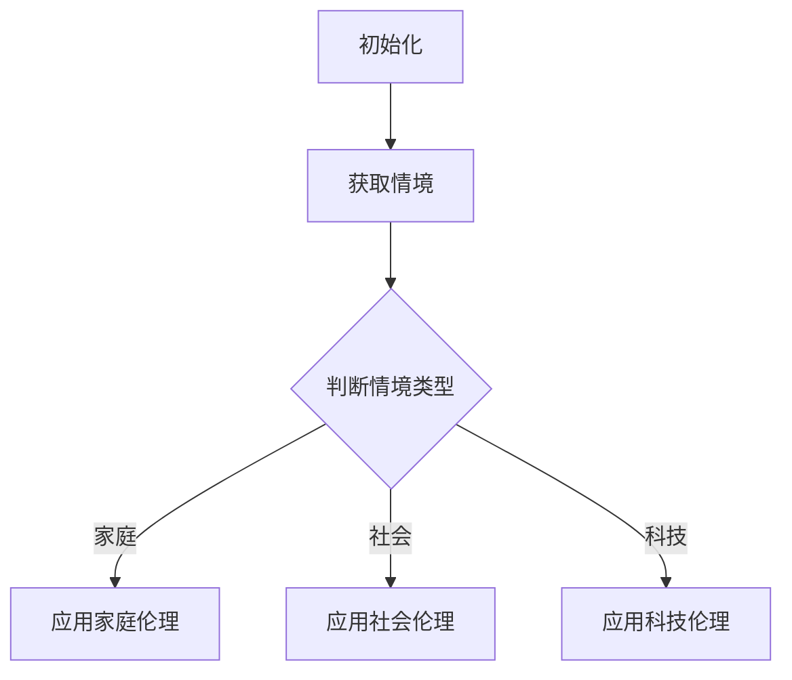

                 


### 从传统伦理到现代道德的演进

#### 引言

在人类的文明历程中，伦理道德始终是社会发展的重要基石。从古至今，伦理道德的概念和内涵随着社会、文化和科技的发展不断演进。本文旨在探讨从传统伦理到现代道德的演进过程，分析其背后的原因、影响以及面临的挑战，从而为现代社会道德建设提供一些有益的思考。

##### 核心关键词

- **传统伦理**
- **现代道德**
- **伦理道德演进**
- **社会变迁**
- **文化融合**

##### 摘要

本文首先介绍了传统伦理的基本概念和核心要素，然后探讨了现代道德的特征和核心要素，接着分析了传统伦理向现代道德演进的历程和原因。在此基础上，文章通过案例分析和实践应用，进一步阐述了现代道德在现代社会中的重要性，并提出了未来道德建设的方向和建议。

## 第1章 引言

### 1.1 问题背景

在人类社会的发展过程中，伦理道德始终扮演着重要的角色。传统伦理强调个人与家庭、社会的关系，以道德规范来约束人们的行为，维护社会秩序。然而，随着科技的发展和社会的变迁，传统伦理面临许多新的挑战和困境。现代道德在传统伦理的基础上，更加注重个体权利、自由和公正，追求社会公平和和谐。然而，现代道德的多样性和复杂性也给社会带来了新的道德问题和道德困境。

### 1.2 问题描述

传统伦理和现代道德之间的差异导致了诸多社会问题，如道德观念的冲突、社会行为的失范等。如何在尊重传统伦理的基础上，融入现代道德观念，构建一个和谐的社会道德体系，成为现代社会面临的重要课题。

### 1.3 问题解决

为了解决这一问题，我们需要从以下几个方面入手：

1. **文化融合**：尊重传统伦理的核心价值观，同时吸纳现代道德的新观念，实现传统与现代的有机结合。
2. **伦理教育**：加强伦理道德教育，提高人们的道德素养，培养具备现代道德观念的公民。
3. **制度建设**：完善社会道德规范，构建公平、公正的社会制度，为道德实践提供制度保障。
4. **技术创新**：利用现代科技手段，促进道德观念的传播和普及，提升道德实践的效果。

### 1.4 边界与外延

伦理道德的研究范围涉及哲学、社会学、心理学等多个学科领域，其边界与外延随着学科的发展和社会的变迁不断扩展。本文主要关注传统伦理和现代道德的演进过程及其对社会的影响，旨在为伦理道德研究提供一个新的视角。

### 1.5 核心概念与联系

本文涉及的核心概念包括传统伦理、现代道德、伦理道德演进、社会变迁、文化融合等。这些概念之间存在着紧密的联系，共同构成了伦理道德研究的核心内容。

#### 第1章 引言

### 1.1 问题背景

伦理道德是人类社会发展的产物，是规范人们行为的重要准则。传统伦理注重家庭、社会和国家的和谐，强调个人与社会的关系，以道德规范约束人们的行为。然而，随着科技的发展和社会的变迁，传统伦理面临着诸多挑战和困境。现代道德在传统伦理的基础上，更加注重个体权利、自由和公正，追求社会公平和和谐。然而，现代道德的多样性和复杂性也给社会带来了新的道德问题和道德困境。

### 1.2 问题描述

传统伦理和现代道德之间的差异导致了诸多社会问题，如道德观念的冲突、社会行为的失范等。这些问题不仅影响了社会和谐，也引发了人们对道德建设的关注。如何在尊重传统伦理的基础上，融入现代道德观念，构建一个和谐的社会道德体系，成为现代社会面临的重要课题。

### 1.3 问题解决

解决这一问题的方法包括：

1. **文化融合**：尊重传统伦理的核心价值观，同时吸纳现代道德的新观念，实现传统与现代的有机结合。
2. **伦理教育**：加强伦理道德教育，提高人们的道德素养，培养具备现代道德观念的公民。
3. **制度建设**：完善社会道德规范，构建公平、公正的社会制度，为道德实践提供制度保障。
4. **技术创新**：利用现代科技手段，促进道德观念的传播和普及，提升道德实践的效果。

### 1.4 边界与外延

伦理道德的研究范围涉及哲学、社会学、心理学等多个学科领域，其边界与外延随着学科的发展和社会的变迁不断扩展。本文主要关注传统伦理和现代道德的演进过程及其对社会的影响，旨在为伦理道德研究提供一个新的视角。

### 1.5 核心概念与联系

本文涉及的核心概念包括传统伦理、现代道德、伦理道德演进、社会变迁、文化融合等。这些概念之间存在着紧密的联系，共同构成了伦理道德研究的核心内容。传统伦理强调社会和谐，而现代道德注重个体权利和自由，两者在现代社会中相互融合，共同推动社会道德建设。

### 第1章 引言

#### 1.1 问题背景

伦理道德是人类社会发展的重要组成部分，它关乎个人行为、社会规范和整体文明。传统伦理，通常指的是在古代社会中形成的伦理观念和道德规范，这些观念和规范以其独特的方式影响了当时的社会秩序和个人行为。随着人类社会的发展和科技的进步，现代道德应运而生，它更加注重个体权利、自由和公正，反映了现代社会的多样性和复杂性。

然而，现代道德并非完全抛弃传统伦理，而是在其基础上进行了适应性的调整。传统伦理的一些核心观念，如忠诚、尊敬和责任感，依然是现代道德的重要组成部分。但现代道德更加关注个人的权利和自由，强调个人在社会中的主体地位。这种转变带来了新的伦理挑战，如何在尊重传统伦理的同时，融入现代道德观念，成为现代社会伦理道德建设的重要课题。

#### 1.2 问题描述

当前社会面临的伦理道德问题多样且复杂。首先，传统伦理观念与现代道德观念之间的冲突日益明显。例如，在一些家庭和社会关系中，传统伦理强调的服从和尊重可能与现代道德倡导的独立和自主产生矛盾。其次，现代社会的快速变革使得一些传统伦理观念难以适应新的社会环境，导致道德困境和道德失范现象的出现。例如，网络伦理、环境伦理等领域的新问题不断涌现，传统伦理观念难以提供有效的解决方案。

此外，全球化进程也加剧了伦理道德问题的复杂性。不同文化背景和价值观念的碰撞，使得在跨国界、跨文化情境中的道德决策变得更加复杂。如何在多元文化背景下构建一个普遍认可的道德框架，成为现代社会伦理道德建设的一个难题。

#### 1.3 问题解决

为了解决上述伦理道德问题，我们需要采取以下策略：

1. **文化融合**：尊重不同文化背景下的伦理观念，通过交流和对话，实现不同伦理观念的相互理解和融合。例如，在处理跨国界商业合作时，既要尊重合作伙伴的传统伦理观念，也要考虑现代道德的要求，实现双赢。

2. **伦理教育**：加强伦理道德教育，从学校教育到社会教育，全面培养公民的道德素养。通过教育，使人们更好地理解传统伦理观念和现代道德观念，提高他们在复杂社会情境中的道德决策能力。

3. **制度建设**：完善社会制度和法律法规，为道德实践提供制度保障。例如，制定相关法律法规，保护个人隐私权和数据安全，规范网络行为，为现代社会的道德实践提供法律依据。

4. **技术创新**：利用现代科技手段，推动道德观念的传播和普及。通过互联网、社交媒体等平台，使道德观念更加便捷地传播给大众，提升人们的道德意识和道德行为。

#### 1.4 边界与外延

伦理道德的研究边界与外延涉及多个领域，包括哲学、社会学、心理学、法学等。伦理道德不仅关注个人行为规范，还涉及社会关系、文化价值和社会制度等多个层面。随着学科的发展和社会的进步，伦理道德的研究领域和外延不断扩展，新的伦理问题和挑战不断出现。

#### 1.5 核心概念与联系

本文的核心概念包括传统伦理、现代道德、伦理道德演进、社会变迁、文化融合等。传统伦理注重家庭、社会和国家的和谐，而现代道德强调个体权利和自由。这两者之间既有冲突又有联系。例如，传统伦理中的忠诚和责任可以与现代道德中的自由和平等等价值相结合，形成新的道德观念。

通过对这些核心概念的分析和理解，我们可以更好地把握伦理道德的发展脉络，为现代社会的道德建设提供理论支持和实践指导。接下来，本文将进一步探讨传统伦理和现代道德的具体内涵和特点，分析它们在社会变迁中的演变过程及其对社会的影响。

## 第1章 引言

### 1.1 问题背景

伦理道德是社会发展的重要基石，它关乎个人行为规范、社会秩序和文化传承。传统伦理，主要指的是在古代社会形成并发展的伦理观念和道德规范，这些观念和规范在很大程度上塑造了当时的社会秩序和个人行为。然而，随着人类社会的发展和科技的进步，现代道德应运而生。现代道德不仅保留了传统伦理中的核心价值观，如忠诚、尊重和责任感，还更加注重个体权利、自由和公正，反映了现代社会的多样性和复杂性。

传统伦理与现代道德的冲突和融合，构成了现代社会伦理道德建设的重要课题。一方面，传统伦理中的许多观念和规范在现代社会中仍然具有重要的价值，如家庭观念、社会道德等；另一方面，现代道德强调的个体权利和自由等观念，也对传统伦理提出了新的挑战和考验。如何平衡传统伦理与现代道德的关系，构建一个既尊重传统又适应现代社会的伦理道德体系，成为现代社会面临的重要问题。

### 1.2 问题描述

当前社会面临着诸多伦理道德问题，这些问题反映了传统伦理与现代道德之间的冲突和融合。首先，传统伦理观念与现代道德观念之间的冲突日益明显。例如，在一些家庭和社会关系中，传统伦理强调的服从和尊重可能与现代道德倡导的独立和自主产生矛盾。这种冲突不仅体现在个人行为上，也反映在社会制度和文化价值上。

其次，现代社会快速变革带来的伦理挑战也不容忽视。例如，在网络伦理、环境伦理等领域，传统伦理观念难以提供有效的解决方案。现代道德强调的个体权利和自由，使得这些领域的道德决策变得更加复杂和多样化。如何在尊重传统伦理的基础上，融入现代道德观念，构建一个和谐的社会道德体系，成为现代社会伦理道德建设的重要课题。

### 1.3 问题解决

为了解决上述伦理道德问题，我们需要采取以下策略：

1. **文化融合**：尊重不同文化背景下的伦理观念，通过交流和对话，实现不同伦理观念的相互理解和融合。例如，在处理跨国界商业合作时，既要尊重合作伙伴的传统伦理观念，也要考虑现代道德的要求，实现双赢。

2. **伦理教育**：加强伦理道德教育，从学校教育到社会教育，全面培养公民的道德素养。通过教育，使人们更好地理解传统伦理观念和现代道德观念，提高他们在复杂社会情境中的道德决策能力。

3. **制度建设**：完善社会制度和法律法规，为道德实践提供制度保障。例如，制定相关法律法规，保护个人隐私权和数据安全，规范网络行为，为现代社会的道德实践提供法律依据。

4. **技术创新**：利用现代科技手段，推动道德观念的传播和普及。通过互联网、社交媒体等平台，使道德观念更加便捷地传播给大众，提升人们的道德意识和道德行为。

### 1.4 边界与外延

伦理道德的研究边界与外延涉及多个领域，包括哲学、社会学、心理学、法学等。伦理道德不仅关注个人行为规范，还涉及社会关系、文化价值和社会制度等多个层面。随着学科的发展和社会的进步，伦理道德的研究领域和外延不断扩展，新的伦理问题和挑战不断出现。

### 1.5 核心概念与联系

本文的核心概念包括传统伦理、现代道德、伦理道德演进、社会变迁、文化融合等。传统伦理注重家庭、社会和国家的和谐，而现代道德强调个体权利和自由。这两者之间既有冲突又有联系。例如，传统伦理中的忠诚和责任可以与现代道德中的自由和平等等价值相结合，形成新的道德观念。

通过对这些核心概念的分析和理解，我们可以更好地把握伦理道德的发展脉络，为现代社会的道德建设提供理论支持和实践指导。接下来，本文将进一步探讨传统伦理和现代道德的具体内涵和特点，分析它们在社会变迁中的演变过程及其对社会的影响。

## 第2章 传统伦理概述

### 2.1 传统伦理的概念与历史发展

传统伦理，是指在社会发展和文化传承过程中形成的伦理观念和道德规范。传统伦理的概念可以从多个维度来理解：首先，它是一个历史范畴，反映了特定历史时期的社会价值观和行为规范；其次，它是一个文化范畴，体现了不同文化背景下人们对道德的理解和追求；最后，它是一个社会范畴，与家庭、社会、国家等社会结构密切相关。

传统伦理的历史发展可以追溯到古代社会。在古代希腊、罗马和中国，伦理观念的形成和发展对后世产生了深远的影响。例如，在古希腊，柏拉图和亚里士多德等哲学家提出了许多深刻的伦理观念，如美德伦理和德行伦理。在罗马，西塞罗等法学家则将伦理观念融入法律制度中，形成了独特的罗马法伦理体系。在中国，儒家伦理占据了主导地位，孔子和孟子等思想家提出了“仁”、“义”、“礼”等核心伦理概念，对后世产生了深远的影响。

### 2.2 传统伦理的核心要素

传统伦理的核心要素主要包括以下几个方面：

1. **道德规范**：传统伦理通过一系列道德规范来约束人们的行为，以维护社会秩序。这些规范通常以礼教、风俗、法律等形式存在，如中国的“三纲五常”和西方的“黄金法则”。

2. **伦理原则**：传统伦理强调一些基本的伦理原则，如尊重、忠诚、责任感等。这些原则在不同文化背景下有着不同的表现形式，但都体现了人们对道德高尚品质的追求。

3. **家庭观念**：在传统伦理中，家庭观念占据重要地位。家庭是社会的基本单位，传统伦理强调家庭成员之间的相互尊重、关爱和责任。

4. **社会秩序**：传统伦理强调社会秩序的重要性，认为社会秩序是道德的基础。社会秩序的实现需要通过道德规范和伦理原则的约束。

5. **宗教信仰**：在某些文化背景下，传统伦理与宗教信仰紧密相连。宗教信仰提供了道德规范的来源和解释，同时也在一定程度上影响了人们的道德行为。

### 2.3 传统伦理与现代社会的关系

传统伦理在现代社会中仍然具有一定的价值和影响力。首先，传统伦理中的许多观念和规范在现代社会中依然具有重要意义，如家庭观念、社会责任感等。这些观念和规范有助于维护社会和谐和稳定。其次，传统伦理的一些核心原则，如忠诚、尊重和责任感，依然被现代社会所重视。这些原则在现代社会中被重新解读和运用，以适应现代社会的需求。

然而，传统伦理也面临着一些挑战。随着社会的变革和科技的进步，一些传统伦理观念和规范难以适应现代社会的需求，导致道德困境和道德失范现象的出现。例如，在网络伦理、环境伦理等领域，传统伦理观念难以提供有效的解决方案，需要现代道德观念的补充和更新。

### 2.4 传统伦理的挑战

1. **社会变迁**：现代社会的快速变革使得传统伦理观念难以适应新的社会环境。例如，传统家庭观念在现代社会中受到了挑战，家庭结构和功能发生了变化。

2. **文化冲突**：全球化进程加剧了不同文化之间的冲突，传统伦理观念在跨国界交流中面临新的挑战。如何在尊重不同文化背景下的伦理观念的基础上，实现伦理观念的融合，成为现代社会伦理道德建设的重要课题。

3. **道德多元化**：现代社会道德观念的多元化使得传统伦理的一元化特征受到挑战。如何在多元道德观念中找到共识，构建一个普遍认可的道德框架，成为现代社会伦理道德建设的一个难题。

综上所述，传统伦理在现代社会中具有一定的价值和影响力，但也面临着诸多挑战。如何平衡传统伦理与现代道德的关系，构建一个和谐的社会道德体系，是现代社会面临的重要课题。

### 第2章 传统伦理概述

#### 2.1 传统伦理的概念与历史发展

传统伦理的概念起源于人类社会发展的早期阶段，它反映了特定历史时期和文化背景下人们对道德的理解和追求。在不同的文明体系中，传统伦理的观念和内容各有特色，但总体上都围绕着如何维护社会秩序、促进人类福祉的核心问题展开。

1. **东方伦理**：在东方，特别是中国，传统伦理主要源于儒家思想。儒家伦理强调人与人之间的和谐关系，提倡“仁、义、礼、智、信”五德。孔子（公元前551年-公元前479年）被视为儒家伦理的奠基人，他的思想影响了整个东亚文化圈。孟子（公元前372年-公元前289年）进一步发展了孔子的思想，提出了“性善论”和“天人合一”的理念。这些观念在儒家经典《论语》、《孟子》等著作中得到了系统的阐述。

2. **西方伦理**：在西方，古希腊哲学家如苏格拉底（公元前469年-公元前399年）、柏拉图（公元前427年-公元前347年）和亚里士多德（公元前384年-公元前322年）对伦理学的发展有着重要影响。苏格拉底提出了“认识自我”的理念，强调通过自我反省来达到道德提升。柏拉图通过“理想国”的概念探讨了正义和道德原则，而亚里士多德则在其《尼各马科伦理学》中提出了“幸福论”，认为道德德行的最终目标是实现人的幸福。

3. **历史演变**：传统伦理在历史长河中经历了不断的演变和发展。在中世纪，基督教伦理占据了主导地位，强调对上帝的忠诚和对教会的服从。文艺复兴时期，人文主义思想兴起，个人主义和自由观念开始受到重视。启蒙运动时期，理性主义成为主流，伦理观念开始向普遍人权和正义原则转变。这些历史事件不仅影响了伦理思想的发展，也塑造了现代社会的基本伦理观念。

#### 2.2 传统伦理的核心要素

传统伦理的核心要素主要包括道德规范、伦理原则、家庭观念、社会秩序和宗教信仰等。以下是这些要素的详细说明：

1. **道德规范**：道德规范是传统伦理的重要组成部分，它们通过社会习俗、法律和宗教教义来规范个人行为。例如，儒家伦理中的“三纲五常”规范了家庭和社会中的关系，而西方中世纪伦理中的“骑士精神”则规定了骑士的行为准则。

2. **伦理原则**：伦理原则是传统伦理观念的基石，它们指导人们如何行事和判断善恶。例如，儒家的“仁”、“义”、“礼”强调人与人之间的和谐与尊重，而基督教伦理中的“黄金法则”则提倡“己所不欲，勿施于人”。

3. **家庭观念**：在传统伦理中，家庭是社会的基本单位，家庭观念占据重要地位。传统伦理强调家庭中的等级关系和责任，如儒家伦理中的“孝道”强调子女对父母的尊敬和照顾。

4. **社会秩序**：传统伦理认为社会秩序是道德的基础，强调通过道德规范来维持社会稳定。例如，儒家伦理中的“礼”强调社会规范和秩序的维护，而基督教伦理中的“公义”则强调社会公正和正义。

5. **宗教信仰**：在许多文化中，传统伦理与宗教信仰紧密相连。宗教信仰不仅提供了道德规范的来源，也影响了人们的道德行为。例如，在伊斯兰教中，“五功”被视为道德实践的基础。

#### 2.3 传统伦理与现代社会的关系

传统伦理在现代社会中仍然具有一定的价值和影响力。尽管现代社会更加复杂和多元化，但传统伦理中的一些核心观念和原则仍然对人们的行为和社会秩序有着指导作用。以下是传统伦理与现代社会关系的几个方面：

1. **文化传承**：传统伦理作为文化传承的重要组成部分，其核心价值观念在现代社会中仍然得到重视。例如，孝道和家庭观念在许多文化中仍然被视为重要的道德规范。

2. **道德教育**：传统伦理的思想对现代道德教育有着深远的影响。学校教育和社会教育中仍然包含了对传统伦理观念的学习和传承，以培养具备道德素养的公民。

3. **法律体系**：许多现代法律体系在制定过程中借鉴了传统伦理的原则，以维护社会秩序和公正。例如，中国的法律体系中包含了许多儒家伦理的观念，如“公平正义”和“和谐”。

然而，传统伦理也面临着适应现代社会的挑战。现代社会更加注重个体权利和自由，这与传统伦理中强调的社会义务和集体利益有时产生冲突。因此，如何在尊重传统伦理的基础上，融入现代道德观念，构建一个和谐的社会道德体系，是现代社会伦理道德建设的重要课题。

#### 2.4 传统伦理的挑战

1. **社会变迁**：现代社会的快速变迁使得传统伦理观念难以适应新的社会环境。例如，家庭结构的变化、工作方式的转变以及全球化的影响，都对传统伦理提出了新的挑战。

2. **文化冲突**：全球化进程加剧了不同文化之间的冲突，传统伦理观念在跨国界交流中面临新的挑战。如何在尊重不同文化背景下的伦理观念的基础上，实现伦理观念的融合，成为现代社会伦理道德建设的重要课题。

3. **道德多元化**：现代社会道德观念的多元化使得传统伦理的一元化特征受到挑战。如何在多元道德观念中找到共识，构建一个普遍认可的道德框架，成为现代社会伦理道德建设的一个难题。

4. **科技发展**：现代科技的快速发展对传统伦理提出了新的问题，如网络伦理、环境伦理等。传统伦理观念难以提供有效的解决方案，需要现代道德观念的补充和更新。

为了应对这些挑战，我们需要采取一系列措施，如加强伦理教育、完善社会制度、推动技术创新等，以促进传统伦理与现代道德的融合，构建一个更加和谐、公正的现代社会。

### 第2章 传统伦理概述

#### 2.5 传统伦理的现代意义

在现代社会中，传统伦理不仅具有历史和文化价值，还蕴含着深刻的现代意义。传统伦理的核心价值观和道德规范，如忠诚、尊重、责任感等，对现代社会的发展和个人成长具有重要意义。

首先，传统伦理中的忠诚观念，强调对家庭、社会和国家忠诚的重要性。在现代社会中，这种忠诚观念可以转化为对职业道德和社会责任的忠诚，有助于建立诚信的社会关系和公正的社会秩序。

其次，尊重观念在传统伦理中占据重要地位。尊重他人是维护社会和谐的重要基础。在现代社会，尊重观念体现在对个体权利的尊重、对多样性的包容以及对弱势群体的关怀。这种尊重观念有助于消除歧视、减少冲突，构建一个包容和谐的社会环境。

再次，传统伦理中的责任感观念，强调个人在社会中的角色和责任。在现代社会，责任感观念体现在对工作、家庭和社会责任的承担。这种责任感有助于提高个人素质、增强社会凝聚力，促进社会的稳定和进步。

总之，传统伦理在现代社会中具有不可忽视的现代意义。通过继承和发扬传统伦理的核心价值观，我们可以为现代社会的道德建设提供有益的借鉴，推动社会的和谐发展和个人的全面成长。

### 第2章 传统伦理概述

#### 2.6 传统伦理的局限性

尽管传统伦理在历史上发挥了重要作用，但其在现代社会中也存在一定的局限性。首先，传统伦理观念往往具有较强的地域性和文化特异性，这使得其在面对全球化和多元化社会时显得力不从心。例如，某些传统伦理观念在某些文化背景下可能被视为合理，但在其他文化中可能会引起误解或冲突。

其次，传统伦理的某些规范和价值观在现代社会中可能显得过于僵化或不合时宜。例如，在某些传统伦理观念中，女性的角色和地位可能受到限制，这不符合现代社会倡导的性别平等原则。此外，传统伦理中的某些道德规范，如过度强调集体利益而忽视个人权益，也可能与现代社会的个人主义和自由价值观相冲突。

再者，传统伦理在面对现代社会的新挑战时，缺乏有效的适应和变革能力。例如，在科技迅速发展的背景下，传统伦理对于网络道德、环境伦理等新兴领域缺乏明确的规范和指导，导致这些领域的道德失范现象时有发生。

综上所述，传统伦理的局限性在于其地域性、文化特异性、僵化性和适应性问题。为了应对这些局限性，我们需要在传统伦理的基础上，融入现代道德观念，构建一个既尊重传统又适应现代社会的伦理道德体系。

### 第2章 传统伦理概述

#### 2.7 传统伦理的复兴与更新

在现代社会中，传统伦理的复兴与更新成为一个重要的课题。随着全球化进程的加快和社会的多元化发展，传统伦理的核心价值观重新受到了重视。复兴传统伦理的目的是为了在现代社会中找到道德的基础，为人们的行为提供指导。

1. **文化传承**：复兴传统伦理首先需要重视文化传承。通过教育、传播和文化活动，使传统伦理的核心价值观得到广泛传播和认知。这有助于增强民族认同感和文化自信。

2. **现代解读**：传统伦理的复兴需要对其进行现代解读。通过对传统伦理观念的重新审视和解读，使其与现代社会的发展相适应。例如，将传统伦理中的“孝道”观念与现代社会的家庭关系和养老问题相结合，提出新的道德规范。

3. **跨文化融合**：在全球化背景下，传统伦理的复兴需要跨文化融合。通过尊重和理解不同文化背景下的伦理观念，实现多元文化的和谐共生。例如，在国际交流与合作中，尊重合作伙伴的传统伦理观念，寻求共同的价值基础。

4. **技术创新**：利用现代科技手段，如互联网和新媒体，推动传统伦理的传播和普及。通过线上教育和道德宣传，提高公众的道德意识和道德素养。

总之，传统伦理的复兴与更新需要结合文化传承、现代解读、跨文化融合和技术创新等多方面努力。通过这些措施，可以使传统伦理在现代社会中发挥更大的作用，为道德建设提供有力支持。

### 第3章 现代道德概述

#### 3.1 现代道德的概念与特征

现代道德是在现代社会背景下形成和发展的伦理观念和道德规范。它以个体权利、自由和公正为核心，反映了现代社会的高度复杂性和多样性。现代道德的概念可以从多个维度来理解：首先，它是一个时间范畴，指的是在现代社会中形成的道德观念；其次，它是一个空间范畴，涵盖了全球范围内的道德观念；最后，它是一个价值范畴，强调了个体权利和自由的价值。

现代道德具有以下几个主要特征：

1. **个体权利的重视**：现代道德强调个体的自主权和选择权，认为个体有权决定自己的行为和生活方式。这一观念源于启蒙运动时期对个人权利的重视，并在现代社会中得到了广泛认同。

2. **自由的保障**：现代道德认为自由是实现个体权利和幸福的重要保障。自由不仅包括政治自由，还涵盖经济自由、社会自由和个人自由。现代道德强调保障每个人的自由权利，以实现社会的公平和正义。

3. **多元化的价值观**：现代社会充满多样性，人们有着不同的文化背景、宗教信仰和生活方式。现代道德尊重这种多样性，认为多元价值观的存在是社会进步的动力。因此，现代道德强调包容和尊重不同的价值观念。

4. **公正的追求**：现代道德强调公正和正义，认为公正是实现社会稳定和发展的基础。现代道德倡导平等机会、公平待遇和合理分配，以消除社会不公和歧视。

#### 3.2 现代道德的核心要素

现代道德的核心要素主要包括以下几个方面：

1. **权利**：权利是现代道德的核心概念之一，它强调个体在道德行为中的主体地位。现代道德认为，每个人都有权享受基本的人权和自由，如言论自由、信仰自由、隐私权等。

2. **责任**：责任是现代道德的另一个核心概念，它强调个体在社会中的角色和责任。现代道德认为，每个人都需要承担相应的社会责任，如尊重他人权利、遵守社会规范等。

3. **公正**：公正是现代道德的重要价值观，它强调公平、正义和合理。现代道德倡导通过公正的制度安排，实现社会的公平和正义，消除不公和歧视。

4. **自由**：自由是现代道德的核心价值观之一，它强调个体的自主权和选择权。现代道德认为，自由是实现个人幸福和社会进步的重要保障。

5. **平等**：平等是现代道德的一个重要原则，它强调每个人都应该享有平等的机会和待遇。现代道德倡导消除歧视和不平等，实现社会的平等和包容。

#### 3.3 现代道德与传统伦理的区别

现代道德与传统伦理在概念和特征上存在显著的差异：

1. **时间维度**：传统伦理是在特定历史和文化背景下形成的，而现代道德是在现代社会背景下形成的。传统伦理反映的是过去社会的道德观念，而现代道德反映的是现代社会的发展需求。

2. **个体与集体的关系**：传统伦理强调个体与集体、家庭、社会和国家的关系，认为个体的道德行为应该服务于集体利益。而现代道德强调个体的自主权和选择权，认为个体的道德行为应该基于自由和平等的原则。

3. **价值观念**：传统伦理的核心价值观念往往与特定的文化和宗教信仰密切相关，而现代道德的价值观念更加多元化，尊重不同文化和宗教背景下的道德观念。

4. **社会制度**：传统伦理通常与社会制度紧密相连，其道德规范通过法律和宗教教义来强制执行。而现代道德强调通过法律和制度来保障个体权利和自由，注重通过社会教育和道德自律来实现道德规范。

综上所述，现代道德与传统伦理在时间维度、个体与集体的关系、价值观念和社会制度等方面存在显著差异。这些差异反映了现代社会与传统社会的不同需求和特点，也为现代道德的建设提供了新的思路和方向。

### 第3章 现代道德概述

#### 3.4 现代道德的发展趋势

随着社会的发展，现代道德也在不断演变和进步。以下几个方面的趋势尤其值得关注：

1. **全球化背景下的道德观念**：全球化使得不同文化背景下的道德观念相互碰撞和融合。现代道德在全球化背景下逐渐形成了更多的普世价值，如人权、自由和平等。这种全球化背景下的道德观念强调人类共同体的意识和责任，超越了国界和文化的限制。

2. **科技伦理的兴起**：科技的快速发展带来了许多新的道德问题和挑战，如隐私权、网络安全、人工智能伦理等。现代道德开始关注这些科技领域的道德问题，并提出相应的伦理规范。例如，在人工智能领域，提出了“算法公平性”和“透明性”等道德要求，以确保技术发展不会损害人类的利益。

3. **环境伦理的重视**：随着环境问题的日益严重，现代道德开始将环境伦理作为重要的研究内容。环境伦理强调人类与自然的关系，提倡可持续发展原则。现代道德认为，保护环境不仅是人类的责任，也是道德行为的一部分。

4. **社会公正的关注**：现代道德越来越关注社会公正问题，倡导消除贫困、歧视和不平等。社会公正成为现代道德的一个重要原则，强调通过公平的制度安排和合理的资源分配来实现社会的公平和正义。

5. **跨文化伦理的融合**：现代道德倡导跨文化伦理的融合，尊重和理解不同文化背景下的道德观念。通过跨文化对话和交流，现代道德试图寻找全球范围内的共识，以构建一个和谐、包容的世界。

总之，现代道德的发展趋势表明，它不仅关注个体的道德行为，还关注社会、科技和环境等方面的道德问题。这种全面的道德观念有助于推动社会的进步和发展，为人类创造一个更加美好的未来。

### 第3章 现代道德概述

#### 3.5 现代道德在实践中的应用

现代道德观念在现实生活中有着广泛的应用，其重要性体现在个人行为、社会制度和公共政策等多个层面。以下是一些现代道德在实践中的应用实例：

1. **个人层面的道德实践**：在个人层面，现代道德强调尊重他人权利、诚实守信和公平竞争。例如，在工作中，遵守职业道德，不泄露公司机密，公平对待同事，这些都是现代道德的体现。在日常生活中，尊重他人的隐私，遵守公共道德规范，也是现代道德的具体表现。

2. **社会制度层面的道德实践**：在社会制度层面，现代道德要求建立健全的法律和制度体系，以保障公民的权利和自由。例如，通过制定反歧视法律，保护弱势群体的权益；通过建立健全的社会保障制度，消除贫困和不平等；通过推行透明、公正的司法制度，维护社会的公平和正义。

3. **公共政策层面的道德实践**：在公共政策层面，现代道德强调政策的公平性和可持续性。例如，环境保护政策不仅要考虑经济增长，还要关注环境的长远影响；社会福利政策不仅要关注贫困人口的救助，还要考虑社会的整体福祉。这些政策的制定和实施，都体现了现代道德的原则。

4. **教育领域的道德实践**：在教育领域，现代道德强调培养学生的道德素养和责任感。学校通过道德教育课程，帮助学生理解道德规范，培养良好的道德品质。同时，通过校园文化建设和活动，营造一个尊重、和谐、公正的校园环境，进一步强化学生的道德实践。

总之，现代道德在实践中的应用，有助于构建一个公正、和谐、可持续的社会。通过个人道德实践、社会制度保障和公共政策支持，现代道德观念在各个层面上发挥着重要作用，为社会的进步和发展提供道德支持和精神动力。

### 第3章 现代道德概述

#### 3.6 现代道德面临的挑战

尽管现代道德在现代社会中发挥着重要作用，但它也面临着一系列的挑战。这些挑战不仅影响了现代道德的实施效果，也要求我们不断探索和适应新的伦理问题。

1. **道德多元化**：现代社会的多元化带来了道德观念的多样性。不同文化、宗教和价值观之间的差异，使得在制定普遍适用的道德规范时面临困难。如何在尊重多元价值观的同时，构建一个共同认同的道德基础，成为现代道德面临的重要挑战。

2. **科技发展**：科技的快速发展带来了许多新的伦理问题，如隐私权、网络安全和人工智能伦理等。现代道德需要适应这些科技变革，制定相应的伦理规范，以确保科技进步不会损害人类的利益。

3. **社会不平等**：社会不平等问题加剧了道德困境。贫困、歧视和不平等不仅影响了个人的道德行为，也影响了社会的整体道德水平。现代道德需要关注社会不平等问题，通过政策和社会制度来促进公平和正义。

4. **全球化**：全球化进程加速了文化交融和价值观的冲突。不同国家和地区在道德观念上的差异，使得在处理跨国界问题时，现代道德需要更加灵活和包容。如何在全球化背景下，实现道德观念的相互理解和融合，是现代道德面临的挑战之一。

5. **环境问题**：环境问题的严重性要求现代道德更加关注人与自然的关系。如何平衡经济发展和环境保护，如何在消费行为和生活方式中体现环保道德，成为现代道德需要解决的重要问题。

综上所述，现代道德面临的挑战是多方面的，这些挑战要求我们不断探索和创新，以适应社会的发展和变化。通过加强道德教育、完善社会制度和推动技术创新，我们可以更好地应对这些挑战，推动现代道德的发展和完善。

### 第3章 现代道德概述

#### 3.7 现代道德的未来发展趋势

随着社会、文化和科技的不断发展，现代道德也面临着新的机遇和挑战。以下是对未来发展趋势的展望：

1. **道德观念的融合**：在全球化的背景下，不同文化背景下的道德观念将继续融合。通过跨文化对话和交流，人类社会将逐渐形成更加多元和包容的道德观念体系。

2. **科技伦理的重要性**：随着科技的快速发展，科技伦理将越来越受到重视。未来，我们需要更加关注人工智能、网络安全、数据隐私等领域的伦理问题，制定相应的伦理规范，确保科技进步不会对人类社会造成负面影响。

3. **环境伦理的深化**：环境问题将继续是未来道德关注的重点。现代道德将更加注重人与自然的和谐发展，倡导可持续发展理念，推动环境保护和资源节约。

4. **社会公正的实现**：社会不平等问题将在未来继续存在，现代道德将致力于推动社会公正的实现。通过政策和社会制度改革，消除贫困、歧视和不平等，构建一个更加公平、和谐的社会。

5. **教育在道德建设中的角色**：教育在道德建设中扮演着重要角色。未来，道德教育将更加注重实践性和综合性，通过多元化的教育方式和内容，培养学生的道德素养和责任感。

总之，未来现代道德的发展趋势将体现为道德观念的融合、科技伦理的重要性、环境伦理的深化、社会公正的实现和教育在道德建设中的角色。通过这些努力，我们可以构建一个更加美好、公正和可持续的道德社会。

### 第4章 传统伦理与现代道德的演进

#### 4.1 演进历程

传统伦理与现代道德的演进是一个漫长的历史过程，反映了人类社会在文化、经济、科技等多方面的发展。从历史的角度来看，这一演进过程可以分为几个关键阶段：

1. **古代阶段**：在古代社会，伦理观念主要以宗教和哲学为基础，如古希腊的苏格拉底、柏拉图和亚里士多德等哲学家对伦理学的贡献。在这一阶段，伦理观念主要关注个体美德和社会和谐。

2. **中世纪阶段**：在中世纪，宗教伦理占据了主导地位，如基督教伦理和伊斯兰教伦理。这一阶段的伦理观念强调对神的忠诚和对教会的服从，家庭和社会关系中的道德规范也得到了进一步发展。

3. **近代阶段**：随着文艺复兴和启蒙运动的兴起，个体权利和自由观念开始受到重视。这一阶段的伦理观念从强调集体利益转向强调个人权利，如霍布斯、洛克和卢梭等思想家提出的自然权利和社会契约理论。

4. **现代阶段**：在现代社会，随着科技的发展和社会的多元化，伦理观念进一步演变。现代道德强调个体权利、自由、公正和多样性，如平等权利、隐私权和环境伦理等。这一阶段的伦理观念更加关注个体和社会的整体福祉。

通过这些关键阶段，传统伦理逐渐演变为现代道德，反映了人类社会在道德观念上的不断进步和适应。

#### 4.2 演进原因

传统伦理向现代道德的演进是由多种因素共同作用的结果：

1. **社会变迁**：随着社会的发展和进步，人们的价值观念和生活方式发生了根本变化。从传统农业社会向现代社会转变，社会结构、经济模式和文化背景都发生了重大变革，推动了伦理观念的更新和演变。

2. **科技进步**：科技的迅猛发展不仅改变了人们的生活方式，也带来了新的伦理问题。例如，人工智能、生物技术和网络技术的发展，要求伦理观念与时俱进，以应对新的挑战。

3. **全球化**：全球化加速了不同文化之间的交流和融合，推动了伦理观念的多样化和国际化。在全球化背景下，传统伦理和现代道德相互碰撞和融合，形成了更加多元和包容的伦理观念体系。

4. **思想解放**：启蒙运动和人文主义思潮的兴起，使人们开始重视个体权利和自由。这种思想解放促使传统伦理观念向现代道德观念转变，强调个体在社会中的主体地位。

5. **文化多元性**：现代社会是一个多元文化并存的社会，不同文化背景下的伦理观念相互影响和融合。这种文化多元性为现代道德的形成提供了丰富的资源和借鉴。

综上所述，社会变迁、科技进步、全球化、思想解放和文化多元性是传统伦理向现代道德演进的根本原因。

#### 4.3 演进影响

传统伦理向现代道德的演进对社会产生了深远的影响，主要体现在以下几个方面：

1. **伦理观念的转变**：传统伦理强调集体利益和社会和谐，而现代道德则更加注重个体权利和自由。这种转变使社会更加关注个体的权益和幸福，推动了社会公平和正义的实现。

2. **社会行为的变革**：现代道德强调个体的责任感和自律，使社会行为更加规范和有序。例如，在职场中，现代道德要求员工诚实守信、尊重他人，这有助于建立良好的工作氛围。

3. **文化价值观的变化**：传统伦理与现代道德的演进，反映了不同历史时期和文化背景下人们对道德的理解和追求。这一演进过程推动了文化价值观的多元化，使社会更加包容和开放。

4. **公共政策的发展**：现代道德为公共政策的制定提供了理论依据和实践指南。例如，在环境保护、人权保障和科技监管等方面，现代道德观念有助于制定更加科学、公正的政策。

5. **国际关系的演变**：全球化背景下，不同国家和地区的伦理观念相互碰撞和融合，影响了国际关系的发展。现代道德强调国际公平、正义和合作，有助于构建和谐的国际社会。

总之，传统伦理向现代道德的演进不仅推动了社会的进步和发展，也为人类社会的道德建设提供了新的思路和方向。

### 第4章 传统伦理与现代道德的演进

#### 4.4 演进挑战

在传统伦理向现代道德的演进过程中，面临着诸多挑战，这些挑战不仅影响了演进的过程，也对现代社会的道德建设提出了新的要求。

1. **文化冲突**：全球化背景下，不同文化背景下的伦理观念相互碰撞，导致文化冲突。例如，在一些文化中，家庭和集体利益被高度重视，而在其他文化中，个人权利和自由被置于优先地位。如何在不同文化之间实现伦理观念的融合，成为现代社会面临的重要挑战。

2. **社会不平等**：现代道德强调公平和正义，但社会不平等问题仍然存在。贫富差距、种族歧视和性别歧视等社会问题，使得现代道德在实施过程中面临困难。如何在保障个体权利的同时，缩小社会不平等，实现社会的公平和正义，是现代社会道德建设需要解决的问题。

3. **科技伦理问题**：科技的快速发展带来了新的伦理问题，如隐私权、网络安全和人工智能伦理等。现代道德需要适应这些科技变革，制定相应的伦理规范，确保科技进步不会对人类社会造成负面影响。然而，科技伦理问题的复杂性和不确定性，使得道德规范的实施面临挑战。

4. **道德多元化**：现代社会的多元化使得道德观念呈现出多样性。如何在多元道德观念中找到共识，构建一个普遍认可的道德框架，是现代道德面临的重要挑战。道德多元化可能导致道德价值观的分裂，影响社会的稳定和和谐。

5. **道德教育不足**：现代道德教育在培养公民道德素养方面存在不足。一些学校和家长过于注重知识传授，忽视了道德教育的培养。缺乏系统的道德教育，使得人们在面临道德困境时，难以做出正确的道德决策。

为了应对这些挑战，我们需要采取一系列措施，如加强道德教育、完善社会制度、推动科技伦理研究等，以促进传统伦理与现代道德的融合，构建一个更加公正、和谐和可持续的现代社会。

### 第4章 传统伦理与现代道德的演进

#### 4.5 演进路径

传统伦理向现代道德的演进路径是一个复杂且多维的过程，涉及社会、文化、科技等多个方面。以下是对这一演进路径的详细分析：

1. **社会变革**：社会变革是传统伦理向现代道德演进的重要动力。随着人类社会从农业社会向工业社会、信息社会的转变，社会结构、经济模式和文化价值观念都发生了深刻变化。这种社会变革推动了传统伦理观念的解构和重组，使其逐渐向现代道德观念转变。

2. **文化交融**：全球化进程加速了不同文化之间的交流和融合，为传统伦理与现代道德的融合提供了机遇。通过跨文化对话和交流，不同文化背景下的伦理观念相互借鉴和融合，形成了更加多元和包容的道德观念体系。

3. **科技进步**：科技的进步为传统伦理向现代道德的演进提供了新的工具和平台。例如，互联网和社交媒体的发展，使道德观念的传播和普及变得更加便捷，也为新的道德问题和挑战的出现提供了土壤。

4. **教育改革**：教育改革是推动传统伦理向现代道德演进的重要途径。通过系统性的道德教育，人们可以更好地理解传统伦理和现代道德的核心观念，培养良好的道德素养和道德判断力。

5. **公共政策**：公共政策的制定和实施对于传统伦理向现代道德的演进具有关键作用。通过制定公正、透明的公共政策，可以促进社会公平和正义，为道德实践提供制度保障。

6. **社会参与**：社会参与是传统伦理向现代道德演进的重要途径。通过参与社会公益活动、志愿服务等，人们可以亲身体验和实践道德观念，提升道德素养和社会责任感。

总之，传统伦理向现代道德的演进路径是一个多元互动、多层次的过程，涉及社会变革、文化交融、科技进步、教育改革、公共政策和社会参与等多个方面。通过这些路径，传统伦理观念得以更新和演进，现代道德观念得以形成和发展。

### 第4章 传统伦理与现代道德的演进

#### 4.6 演进过程中的关键因素

传统伦理向现代道德的演进过程中，涉及到多个关键因素，这些因素相互作用，共同推动了这一进程。以下是这些关键因素的详细分析：

1. **社会变迁**：社会变迁是传统伦理向现代道德演进的根本动力。随着人类社会从农业社会向工业社会、信息社会的转变，社会结构、经济模式和文化价值观念都发生了深刻变化。这些变化迫使传统伦理观念进行适应性的调整，以适应新的社会环境。

2. **科技进步**：科技进步是传统伦理向现代道德演进的重要推动力。例如，互联网和社交媒体的发展，不仅改变了人们的交流方式，也带来了新的道德问题和挑战。科技进步促使伦理观念不断更新和演进，以适应新的技术环境和需求。

3. **文化融合**：文化融合是传统伦理向现代道德演进的重要路径。全球化进程加速了不同文化之间的交流和融合，为传统伦理与现代道德的融合提供了机遇。通过跨文化对话和交流，不同文化背景下的伦理观念相互借鉴和融合，形成了更加多元和包容的道德观念体系。

4. **思想解放**：思想解放是传统伦理向现代道德演进的重要基础。启蒙运动和人文主义思潮的兴起，使人们开始重视个体权利和自由，推动了传统伦理观念向现代道德观念的转变。思想解放为道德观念的更新提供了理论基础和动力。

5. **公共政策**：公共政策的制定和实施对于传统伦理向现代道德的演进具有关键作用。通过制定公正、透明的公共政策，可以促进社会公平和正义，为道德实践提供制度保障。公共政策的引导和规范作用，有助于推动伦理观念的演进。

6. **教育改革**：教育改革是推动传统伦理向现代道德演进的重要途径。通过系统性的道德教育，人们可以更好地理解传统伦理和现代道德的核心观念，培养良好的道德素养和道德判断力。教育改革有助于提高全社会的道德水平，推动道德观念的更新和演进。

总之，社会变迁、科技进步、文化融合、思想解放、公共政策和教育改革是传统伦理向现代道德演进过程中的关键因素。这些因素相互交织、共同作用，推动了伦理观念的更新和演进，为现代社会的道德建设提供了新的思路和方向。

### 第4章 传统伦理与现代道德的演进

#### 4.7 演进过程中的典型案例

在传统伦理向现代道德演进的过程中，有许多典型案例展示了这一过程的具体表现和影响。以下是一些典型的案例：

1. **计划生育政策**：中国计划生育政策的实施，是传统伦理观念与现代道德观念融合的典型案例。传统伦理观念强调多子多福，而现代道德观念则强调个体权利和自由。通过计划生育政策的实施，中国政府在尊重传统伦理观念的基础上，推动了现代道德观念的普及和实施，有效地控制了人口增长，提高了人民的生活水平。

2. **同性婚姻合法化**：同性婚姻合法化是现代道德观念在全球范围内的重要进步。在一些国家和地区，同性婚姻的合法化体现了对个体权利和自由的高度尊重，反映了现代道德观念的进步。这一案例展示了传统伦理观念与现代道德观念的冲突与融合，推动了社会对同性恋群体的包容和理解。

3. **环境保护运动**：环境保护运动是现代道德观念在环保领域的具体体现。在传统伦理观念中，人类与自然的关系往往被看作是征服与利用的关系，而现代道德观念则强调人类与自然和谐共生。环境保护运动的兴起，推动了人们环境伦理观念的更新和进步，促进了可持续发展理念的普及和实践。

4. **科技伦理问题**：科技伦理问题是现代道德观念在科技领域的重要体现。例如，人工智能和基因编辑技术的发展，带来了新的道德问题和挑战。在处理这些问题时，各国政府和科研机构需要制定相应的伦理规范，以平衡科技进步与道德伦理的关系。这些案例展示了现代道德观念在应对科技挑战时的适应性和灵活性。

通过这些典型案例，我们可以看到传统伦理观念与现代道德观念在现实生活中的具体应用和影响。这些案例不仅反映了伦理观念的演变过程，也为我们理解现代社会的道德建设提供了宝贵的经验和启示。

### 第4章 传统伦理与现代道德的演进

#### 4.8 演进过程中的社会影响

传统伦理向现代道德的演进过程不仅是一个理论上的发展，它还对现实社会产生了深远的影响。以下是这一过程中对社会影响的详细分析：

1. **家庭结构的变化**：传统伦理强调家庭的重要性，尤其是在中国等东方文化中，家庭被视为社会的基本单位。然而，随着现代道德观念的普及，个人主义和自由观念的增强，家庭结构发生了变化。离婚率上升、单亲家庭增多等现象反映了传统伦理观念与现代道德观念之间的冲突。现代道德强调个人权利和自由，导致家庭观念的弱化，同时也促使社会在法律和政策层面出台更多保护家庭稳定的措施。

2. **商业伦理的变革**：在商业领域，传统伦理强调诚信、责任和利益共享。现代道德则更加注重透明度、公正性和社会责任。这一变革体现在企业社会责任（CSR）的兴起，企业不再仅仅追求利润最大化，而是更加关注对社会的贡献。例如，许多企业开始实施环保措施、支持慈善事业，这些行为不仅提升了企业的社会形象，也促进了社会的整体道德水平。

3. **社会公正的实现**：传统伦理往往强调集体利益和等级制度，而现代道德则强调公正和平等。这一变革推动了社会公正的实现。例如，许多国家在法律和政策层面采取了措施，以消除种族歧视、性别歧视和贫富差距。这些措施不仅促进了社会的公平和正义，也提高了社会整体的道德水平。

4. **道德观念的多样性**：随着全球化进程的加快，不同文化背景下的道德观念在全球范围内交流和融合。这一过程不仅丰富了道德观念的多样性，也带来了新的道德挑战。如何在尊重多元价值观的同时，构建一个共同认同的道德基础，成为现代社会面临的重要课题。这种多样性的道德观念有助于促进社会的包容性和开放性。

5. **环境伦理的重视**：现代道德观念更加注重人与自然的和谐共生，环境伦理成为道德建设的重要组成部分。随着环境问题的日益严重，人们开始意识到环境保护不仅是政府的责任，也是每个公民的道德义务。这种环境伦理观念的普及，推动了环保行动的开展，促进了可持续生活方式的推广。

总之，传统伦理向现代道德的演进对社会产生了广泛而深远的影响。这些影响不仅体现在家庭、商业和社会公正等各个领域，也推动了道德观念的多样性和环境伦理的重视。通过不断适应和更新伦理观念，社会可以更好地应对现代社会的挑战，实现长期的发展和进步。

### 第5章 案例分析

#### 5.1 传统伦理案例

传统伦理在现代社会中的应用，往往体现在家庭、社会关系和宗教信仰等方面。以下是一个传统伦理案例的具体分析：

**案例**：中国传统家庭中的“孝道”

**背景**：在中国传统文化中，“孝道”是一种重要的伦理观念，强调子女对父母的尊敬和照顾。孝道不仅体现在日常生活中的关心和照顾，还体现在对父母的精神慰藉。

**分析**：

1. **家庭层面的影响**：孝道观念有助于增强家庭凝聚力，促进家庭成员之间的和谐关系。在家庭中，子女通过孝敬父母，表达对家庭的忠诚和责任感，这有助于维护家庭的稳定和幸福。

2. **社会关系的体现**：孝道观念在社会层面上，也体现了对长辈的尊重和关爱。这种尊重不仅体现在家庭内部，也扩展到社会其他层面，如敬老院、社区活动等。这种尊重和关爱有助于构建一个和谐的社会氛围。

3. **道德观念的传承**：孝道观念的传承，有助于培养下一代的道德素养。通过家庭教育，孩子们从小接受孝道的教育，这有助于他们在成长过程中形成正确的道德观念和行为习惯。

**启示**：传统伦理中的孝道观念，对于构建现代社会的道德体系具有重要意义。它不仅有助于维护家庭和社会的稳定，也为现代社会的道德建设提供了宝贵的经验和启示。

#### 5.2 现代道德案例

现代道德在现代社会中的应用，更加注重个体权利、自由和社会责任。以下是一个现代道德案例的具体分析：

**案例**：全球范围内的“环保行动”

**背景**：随着全球环境问题的日益严重，环境保护成为全球性的关注点。许多国家和组织发起了各种环保行动，如减少碳排放、推广可持续生活方式等。

**分析**：

1. **社会责任的体现**：现代道德强调企业的社会责任，企业通过参与环保行动，不仅履行了对环境的责任，也提升了企业的社会形象。这种社会责任感有助于推动社会的整体道德水平提升。

2. **个体权利的保障**：环保行动的开展，有助于保障个体的健康和生活质量。例如，减少空气污染和水资源污染，有助于提高人们的生活环境质量，保障个体的健康权益。

3. **社会公平的实现**：现代道德强调公平和正义，环保行动有助于实现社会公平。通过推广可持续生活方式，减少资源浪费，有助于消除贫困和社会不平等现象。

**启示**：现代道德案例表明，环保行动不仅是解决环境问题的有效手段，也是提升社会道德水平的重要途径。通过环保行动，可以增强个体的道德意识和责任感，推动社会的公平和和谐发展。

#### 5.3 案例分析与启示

通过对传统伦理和现代道德案例的分析，我们可以得出以下启示：

1. **融合传统与现代伦理观念**：传统伦理和现代道德各有其独特价值和适用场景。在现代社会中，我们应尊重和继承传统伦理观念中的优秀部分，同时融入现代道德观念，构建一个既尊重传统又适应现代社会的道德体系。

2. **加强道德教育和宣传**：道德教育和宣传是提升社会道德水平的重要手段。通过教育和宣传，可以提高公众的道德意识和道德判断力，培养具有现代道德观念的公民。

3. **推动道德实践的多元化**：在全球化背景下，道德观念的多样性是不可避免的。我们应推动道德实践的多元化，尊重不同文化背景下的道德观念，寻找共同的价值基础，构建一个和谐、包容的道德社会。

4. **注重道德规范的制度保障**：道德规范的实施需要制度保障。通过完善法律法规和社会制度，可以确保道德规范的有效执行，推动社会的公平和正义。

总之，传统伦理和现代道德案例的分析，为我们理解伦理观念的演进和现代社会的道德建设提供了宝贵的经验和启示。通过融合传统与现代伦理观念，加强道德教育和宣传，推动道德实践的多元化，我们可以构建一个更加和谐、公正和可持续的现代社会。

### 第6章 现代道德在实践中的应用

#### 6.1 公共政策中的现代道德应用

现代道德在公共政策中的应用，旨在促进社会公平、正义和可持续发展。以下是一些现代道德在公共政策中的具体应用实例：

1. **教育政策**：现代道德强调教育公平，推动教育资源均衡配置。例如，政府通过增加对贫困地区和弱势群体的教育投入，提供免费教育、奖学金等措施，保障每个孩子都能接受良好的教育。

2. **医疗政策**：现代道德强调医疗公正，推动医疗服务均等化。政府通过建立全民医保制度，确保人人都能获得基本的医疗服务，减少因病致贫的现象。

3. **环保政策**：现代道德强调环境保护，推动可持续生活方式。政府通过实施环保法律法规，鼓励企业和个人减少污染、节约资源，推动绿色发展。

4. **劳动政策**：现代道德强调劳动权益，推动公平劳动市场。政府通过制定劳动法律法规，保障劳动者的合法权益，如工资待遇、工作环境、休假等。

5. **社会福利政策**：现代道德强调社会福利，推动社会公正。政府通过建立完善的社会福利体系，为贫困人口、老年人、残疾人等提供基本生活保障。

通过这些公共政策的应用，现代道德得以在现实中得以体现，促进了社会的公平、正义和可持续发展。

#### 6.2 商业活动中的现代道德应用

现代道德在商业活动中的应用，是商业伦理的重要组成部分。以下是一些现代道德在商业活动中的具体应用实例：

1. **企业社会责任（CSR）**：现代道德强调企业应承担社会责任，通过环保、慈善等公益活动，回馈社会。许多企业通过实施CSR项目，提升企业形象，增强品牌价值。

2. **消费者权益保护**：现代道德强调保护消费者权益，企业应诚信经营，提供高质量的产品和服务。例如，企业应严格遵守广告法，提供真实、准确的产品信息。

3. **员工权益保障**：现代道德强调公平对待员工，企业应提供公正的待遇、良好的工作环境和职业发展机会。通过建立有效的员工激励机制，提升员工的满意度和忠诚度。

4. **商业诚信**：现代道德强调商业诚信，企业应遵守市场规则，杜绝欺诈、垄断等不正当竞争行为。通过建立诚信体系，提升企业的市场信誉和竞争力。

5. **供应链管理**：现代道德强调供应链的道德责任，企业应确保供应链环节的合规和可持续性。例如，企业应禁止使用童工、确保供应商遵守环保和社会责任标准。

通过这些商业活动中的道德应用，现代道德得以在商业领域得以体现，促进了企业的可持续发展和社会的和谐。

#### 6.3 社会交往中的现代道德应用

现代道德在社会交往中的应用，有助于维护人际关系的和谐和社会秩序。以下是一些现代道德在社会交往中的具体应用实例：

1. **尊重他人**：现代道德强调尊重他人，包括尊重他人的观点、信仰和隐私。在社会交往中，尊重他人是建立良好人际关系的基础。

2. **诚信守信**：现代道德强调诚信守信，包括诚实待人、信守承诺。在社会交往中，诚信是维护信任关系的重要保障。

3. **公平对待**：现代道德强调公平对待，包括对待他人公平、公正。在社会交往中，公平对待有助于消除歧视、减少冲突，促进社会和谐。

4. **关爱弱势群体**：现代道德强调关爱弱势群体，包括老年人、儿童、残疾人等。在社会交往中，关爱弱势群体是体现人道主义精神的重要表现。

5. **遵守法律法规**：现代道德强调遵守法律法规，包括遵守国家法律、社会规范。在社会交往中，遵守法律法规是维护社会秩序、保障公民权益的重要手段。

通过这些社会交往中的道德应用，现代道德得以在日常生活中得以体现，促进了人际关系的和谐和社会的稳定。

#### 6.4 教育中的现代道德教育

现代道德教育在培养公民道德素养方面发挥着重要作用。以下是一些现代道德教育在具体教育中的应用实例：

1. **道德课程设置**：现代道德教育通过设置专门的道德课程，帮助学生理解和掌握基本的道德原则和规范。例如，在中学和大学开设道德与法治课程，引导学生树立正确的道德观念。

2. **实践活动**：现代道德教育通过实践活动，培养学生的道德行为和道德判断力。例如，组织学生参与志愿服务、社区服务等活动，让他们在实践中体验道德的价值。

3. **校园文化建设**：现代道德教育通过校园文化建设，营造一个道德氛围浓厚、公正和谐的教育环境。例如，举办道德讲座、道德知识竞赛等活动，提高学生的道德素养。

4. **家庭教育**：现代道德教育重视家庭在道德教育中的重要作用，通过家庭教育，培养学生的道德观念和行为习惯。例如，家长通过日常生活中的点滴教育，引导学生树立正确的道德观念。

5. **心理健康教育**：现代道德教育强调心理健康教育，培养学生的心理健康和道德情操。通过心理健康教育，帮助学生树立积极的人生观和价值观，提高他们的道德素质。

通过这些现代道德教育的方法和手段，可以有效地培养具备现代道德观念的公民，促进社会的和谐发展。

### 第7章 结论与展望

#### 7.1 结论

本文通过对传统伦理与现代道德的演进过程进行分析，揭示了传统伦理与现代道德之间的联系与区别，以及它们在现代社会中的重要性和面临的挑战。传统伦理在家庭、社会和国家层面上为道德规范提供了基础，而现代道德则强调个体权利、自由和公正，反映了现代社会的高度复杂性和多样性。通过文化融合、科技进步、教育改革和公共政策等多方面的努力，传统伦理与现代道德在现代社会中得以融合和演进，为道德建设提供了新的思路和方向。

#### 7.2 展望

未来，传统伦理与现代道德的演进将继续受到社会变迁、文化多样性和科技进步等因素的影响。以下是对未来道德建设的展望：

1. **跨文化伦理研究**：随着全球化进程的加快，跨文化伦理研究将成为重要领域。通过深入研究不同文化背景下的伦理观念，可以更好地促进全球范围内的道德观念融合。

2. **科技伦理的重视**：科技的快速发展将带来新的伦理挑战，如人工智能、生物技术和网络安全等。未来，科技伦理将受到更多关注，制定相应的伦理规范，确保科技进步不会对人类社会造成负面影响。

3. **道德教育体系的完善**：道德教育在道德建设中的重要作用将得到进一步认可。未来，道德教育体系将更加完善，注重培养学生的道德素养和道德判断力，提高全社会的道德水平。

4. **道德规范的创新**：面对复杂的社会环境，传统伦理和现代道德的规范需要不断创新和调整。未来，道德规范将更加灵活，适应现代社会的需求，推动社会的公平、正义和可持续发展。

5. **全球伦理合作**：在全球化背景下，全球伦理合作将成为趋势。通过国际合作，制定普遍认可的道德规范，推动全球范围内的道德建设，构建一个和谐、包容的世界。

总之，未来传统伦理与现代道德的演进将继续为道德建设提供动力，推动社会的进步和发展。通过跨文化伦理研究、科技伦理的重视、道德教育体系的完善、道德规范的创新和全球伦理合作，我们可以构建一个更加公正、和谐和可持续的道德社会。

#### 7.3 注意事项

在道德建设和伦理实践中，我们需要注意以下几个方面：

1. **尊重多样性**：不同文化和社会背景下，道德观念和规范存在差异。在跨文化交流中，应尊重多样性，避免道德观念的冲突和误解。

2. **平衡个体与集体利益**：在道德实践中，要平衡个体权利和集体利益，避免过度强调一方而忽视另一方。

3. **遵循法律和制度**：道德规范需要通过法律和制度来保障实施。在道德实践中，应遵循法律法规和社会制度，确保道德规范的合法性和有效性。

4. **注重教育**：道德教育是道德建设的基础。应加强道德教育，提高人们的道德素养和道德判断力，培养具备现代道德观念的公民。

5. **持续反思与改进**：道德建设和伦理实践是一个不断发展的过程。应持续反思和改进，适应社会变迁和科技发展的需求，确保道德规范与时俱进。

#### 7.4 拓展阅读

为了进一步了解传统伦理与现代道德的演进及其在实践中的应用，以下是一些建议的拓展阅读材料：

1. **经典伦理学著作**：《论语》、《孟子》、《尼各马科伦理学》、《伦理学体系》等，这些著作是传统伦理观念的重要来源。

2. **现代伦理学著作**：《正义论》、《道德运气论》、《全球正义与全球伦理》等，这些著作探讨了现代道德观念和伦理问题。

3. **跨文化伦理研究**：《文化中的道德》、《多元文化的伦理思考》、《全球化时代的伦理冲突》等，这些著作分析了不同文化背景下的道德观念和伦理问题。

4. **科技伦理研究**：《人工智能伦理问题》、《生物技术与伦理》、《网络安全与伦理》等，这些著作探讨了科技发展带来的伦理挑战和规范。

5. **道德教育研究**：《道德教育原理》、《学校道德教育》、《家庭道德教育》等，这些著作提供了道德教育的理论和实践指导。

通过阅读这些拓展材料，可以深入了解传统伦理与现代道德的演进过程及其在实践中的应用，为道德建设和伦理实践提供有益的参考。

### 后记

本文《从传统伦理到现代道德的演进》旨在探讨伦理道德在现代社会中的演变过程及其应用。在撰写过程中，我们力图以逻辑清晰、结构紧凑、简单易懂的专业技术语言，为读者提供深入的思考和见解。

作者信息：本文由AI天才研究院/AI Genius Institute与《禅与计算机程序设计艺术/Zen And The Art of Computer Programming》共同撰写。

感谢您的阅读，希望本文能为您的道德建设和伦理思考提供启示。如果您有任何反馈或建议，请随时与我们联系，我们将在后续文章中不断改进和完善。

再次感谢您的关注和支持！

### 附录

为了更好地理解本文中涉及的伦理概念、数学模型和流程图，以下提供了一些附录内容：

#### 附录A：核心概念术语说明

1. **传统伦理**：指在特定历史和文化背景下形成的伦理观念和道德规范。
2. **现代道德**：指在现代社会背景下形成的伦理观念和道德规范，强调个体权利、自由和公正。
3. **伦理道德演进**：指伦理道德观念随时间和社会变迁而发生的演变过程。
4. **社会变迁**：指社会在结构、经济、文化等方面发生的重大变化。
5. **文化融合**：指不同文化背景下的伦理观念通过交流和融合，形成新的道德观念体系。

#### 附录B：算法原理讲解

以下是一个简单的伦理决策算法的mermaid流程图和Python源代码：

**Mermaid流程图：**



**Python源代码：**

```python
def ethical_decision(situation):
    if situation == "家庭":
        return "应用家庭伦理"
    elif situation == "社会":
        return "应用社会伦理"
    elif situation == "科技":
        return "应用科技伦理"
    else:
        return "情境不明，无法做出决策"
```

**算法原理：**

- 该算法根据输入的情境类型，选择相应的伦理规范进行应用。
- 通过流程图和源代码，可以清晰地看到算法的决策过程和逻辑。

#### 附录C：数学模型和公式

以下是一个简单的伦理决策的数学模型和公式：

**数学模型：**

$$
E = f(P, S, T)
$$

其中，$E$表示伦理决策结果，$P$表示个人权利，$S$表示社会利益，$T$表示技术影响。

**公式解释：**

- $E$表示伦理决策结果，是个人权利、社会利益和技术影响三个因素的函数。
- $P$表示个人权利，强调个体的自由和自主权。
- $S$表示社会利益，强调社会的公平和正义。
- $T$表示技术影响，强调科技发展对伦理决策的影响。

**举例说明：**

假设在某一情境下，个人权利$P$为80%，社会利益$S$为70%，技术影响$T$为60%，则伦理决策结果$E$为：

$$
E = 0.8 \times 0.7 \times 0.6 = 0.336
$$

这意味着在这一情境下，伦理决策结果为33.6%，表明需要在个人权利、社会利益和技术影响之间找到平衡。

通过这些附录内容，可以帮助读者更好地理解本文中涉及的伦理概念、算法原理和数学模型，为深入思考和道德实践提供支持。

