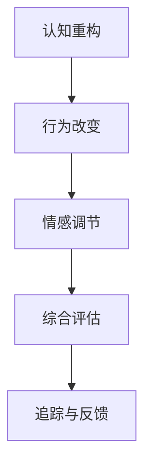

                 

# 从虚无到充实：心理重建之路

关键词：心理重建，心理健康，认知行为疗法，心理辅导，社会层面

摘要：
本文旨在探讨心理重建的重要性、核心概念和方法，以及其在个人和社会层面的应用。通过深入分析认知行为疗法（CBT）和心理辅导等具体方法，本文为读者提供了一条从虚无到充实的心理重建之路。文章结构紧凑、逻辑清晰，旨在帮助读者理解和掌握心理重建的关键要素和实践步骤。

## 第一部分：问题背景与核心概念

### 1.1 问题的背景

在现代社会中，心理问题已成为影响人们生活质量的重要问题。焦虑、抑郁、人际关系紧张等现象广泛存在，对个人和社会都带来了负面影响。根据世界卫生组织（WHO）的报告，全球约有3.5亿人患有抑郁症，约2.5亿人患有焦虑症。这些心理问题不仅影响了人们的日常生活，还可能对身体健康产生长期的负面影响。

### 1.2 核心概念与联系

#### 1.2.1 心理健康

心理健康是指个体在情感、认知、行为等方面处于良好状态，能够积极应对生活中的各种挑战。心理健康的属性特征如下：

| 特征 | 心理健康 |
| ---- | -------- |
| 情感 | 平衡 |
| 认知 | 清晰 |
| 行为 | 有序 |

#### 1.2.2 心理重建

心理重建是一种通过认知和行为改变来改善心理健康的过程。其核心要素包括：

- 认知重构：通过改变负面思维模式，帮助个体建立积极的认知结构。
- 行为改变：通过调整行为模式，帮助个体适应新的生活方式和环境。

#### 1.2.3 心理辅导

心理辅导是指通过专业人员的帮助，帮助个体识别和解决问题，提高心理健康水平。心理辅导的特点如下：

| 特征 | 心理辅导 |
| ---- | -------- |
| 方式 | 定期面对面 |
| 目标 | 提高心理健康水平 |

### 1.3 心理重建的方法与策略

心理重建的方法和策略多种多样，主要包括认知行为疗法（CBT）和心理辅导等。以下是对这些方法的详细阐述：

#### 1.3.1 认知行为疗法（CBT）

认知行为疗法（CBT）是一种通过改变认知来改善行为的心理治疗方法。其原理是：个体的情绪和行为受到认知的影响，通过改变认知，可以改善情绪和行为。

- **原理讲解**：认知行为疗法（CBT）通过认知重构和行为改变来治疗心理问题。
- **Mermaid 流程图**：
  ```mermaid
  graph TD
  A[评估与诊断] --> B[认知重构]
  B --> C[行为改变]
  C --> D[追踪与评估]
  ```
  
#### 1.3.2 心理辅导

心理辅导是通过与专业辅导人员的互动，帮助个体识别和解决问题，提高心理健康水平的过程。

- **原理讲解**：心理辅导通过建立信任关系，帮助个体探索内心世界，发现问题的根源，并提供解决方案。
- **Mermaid 流程图**：
  ```mermaid
  graph TD
  A[建立关系] --> B[评估与诊断]
  B --> C[制定计划]
  C --> D[实施计划]
  D --> E[追踪与评估]
  ```

### 1.4 心理重建的应用场景

#### 1.4.1 个人层面

在个人层面，心理重建可以应用于以下场景：

- **经历重大生活变故**：如失业、离婚、亲人去世等。
- **面临心理压力**：如工作压力、学业压力、人际关系压力等。

#### 1.4.2 社会层面

在社会层面，心理重建可以应用于以下场景：

- **学校**：通过心理辅导和心理健康教育，提高学生的心理健康水平。
- **企事业单位**：通过心理辅导和员工援助计划，提高员工的心理健康水平和工作效率。

### 1.5 心理重建的挑战与机遇

#### 1.5.1 挑战

- **资源有限**：专业心理辅导人员和设施有限。
- **社会认知不足**：许多人对于心理重建的认知和接受度较低。

#### 1.5.2 机遇

- **技术进步**：心理健康App、在线辅导等新兴服务为心理重建提供了更多可能性。
- **政策支持**：政府加大对心理健康问题的关注和投入，为心理重建提供了良好的政策环境。

### 1.6 本章小结

通过本章的介绍，我们了解了心理重建的重要性、核心概念和方法，以及其在个人和社会层面的应用。心理重建不仅有助于个体恢复心理健康，也对提升社会整体心理健康水平具有重要意义。在接下来的章节中，我们将进一步探讨心理重建的具体方法和实践。

----------------------------------------------------------------

## 第二部分：心理重建的具体方法与实践

## 第2章：认知行为疗法（CBT）

### 2.1 认知行为疗法的起源与发展

#### 2.1.1 认知行为疗法的起源

认知行为疗法（CBT）起源于20世纪60年代，由美国心理学家阿尔伯特·埃利斯（Albert Ellis）创立。埃利斯提出了理性情绪行为疗法（REBT），即理性情绪行为疗法（REBT），旨在帮助个体通过改变不合理信念来改善情绪和行为。

#### 2.1.2 认知行为疗法的发展历程

随着心理学领域的不断发展，CBT逐渐成为心理治疗领域的主流方法之一。20世纪70年代，阿伦·贝克（Aaron T. Beck）提出了认知行为疗法（CBT）的理论基础，即认知行为模型。贝克认为，个体的情绪和行为受到认知的影响，通过改变认知，可以改善情绪和行为。

#### 2.1.3 认知行为疗法的基本原理

认知行为疗法（CBT）的基本原理是通过认知重构和行为改变来治疗心理问题。

- **认知重构**：通过识别和挑战个体的不合理信念，帮助个体建立合理的认知结构，从而改善情绪和行为。
- **行为改变**：通过制定具体的行动计划，帮助个体改变不良行为模式，建立积极的行为习惯。

### 2.2 认知行为疗法的主要理论

#### 2.2.1 认知理论

认知理论是认知行为疗法（CBT）的核心理论之一。该理论认为，个体的情绪和行为受到认知的影响，即个体的认知过程决定了他们的情绪和行为。

- **认知三角理论**：认知三角理论认为，个体的情绪、行为和认知是相互关联的。情绪是由认知和行为引起的，同时又会影响认知和行为。

#### 2.2.2 认知行为模型

认知行为模型是认知行为疗法（CBT）的理论基础。该模型认为，个体的情绪和行为受到以下因素的影响：

- **信念**：个体的信念是他们的认知基础，决定了他们的情绪和行为。
- **诱发事件**：诱发事件是导致个体产生情绪和行为的具体事件。
- **情绪和行为**：个体的情绪和行为是他们的信念和诱发事件相互作用的结果。

### 2.3 认知行为疗法的实践方法

#### 2.3.1 评估与诊断

在认知行为疗法的实践中，首先需要对个体的心理状况进行评估和诊断。这包括了解个体的情绪、行为和认知特点，以及他们的生活背景和环境。

#### 2.3.2 认知重构

认知重构是认知行为疗法（CBT）的核心方法之一。通过识别和挑战个体的不合理信念，帮助个体建立合理的认知结构。

- **不合理信念的识别**：识别个体的不合理信念，如“我不够好”、“别人总是对我不好”等。
- **不合理信念的挑战**：通过逻辑分析和实证证据，挑战个体的不合理信念，帮助个体建立合理的认知结构。

#### 2.3.3 行为改变

行为改变是认知行为疗法（CBT）的另一个重要方法。通过制定具体的行动计划，帮助个体改变不良行为模式，建立积极的行为习惯。

- **行为计划的制定**：根据个体的具体情况，制定具体的行为计划，如增加锻炼时间、减少社交媒体使用时间等。
- **行为改变的执行**：在执行行为计划的过程中，个体可能会面临挑战和困难，需要通过支持和鼓励来帮助他们坚持。

### 2.4 认知行为疗法的应用案例

#### 2.4.1 抑郁症的治疗

认知行为疗法（CBT）在抑郁症的治疗中具有显著效果。通过认知重构和行为改变，个体可以改善情绪和生活质量。

- **案例一**：某个体因为亲人去世而陷入抑郁状态，通过认知行为疗法，她识别并挑战了“我再也快乐不起来了”的不合理信念，并制定了增加社交活动和锻炼身体的行为计划，最终改善了情绪和生活质量。

#### 2.4.2 焦虑症的治疗

认知行为疗法（CBT）在焦虑症的治疗中也具有显著效果。通过认知重构和行为改变，个体可以减轻焦虑症状，提高生活质量。

- **案例二**：某个体因为工作压力而出现焦虑症状，通过认知行为疗法，他识别并挑战了“我无法应对工作压力”的不合理信念，并制定了合理安排工作和休息时间的行为计划，最终减轻了焦虑症状。

### 2.5 认知行为疗法的优势与局限

#### 2.5.1 优势

- **效果显著**：认知行为疗法（CBT）在治疗各种心理问题方面具有显著效果。
- **灵活多样**：CBT可以根据个体的具体情况进行个性化治疗。
- **易于学习**：CBT的方法和技巧相对容易学习，个体可以自行进行实践。

#### 2.5.2 局限

- **适用范围有限**：CBT对于某些心理问题的治疗效果可能有限。
- **需要时间投入**：CBT需要一定的时间和精力投入，个体需要持续进行实践。

### 2.6 本章小结

本章介绍了认知行为疗法（CBT）的起源、发展、基本原理和实践方法。通过认知重构和行为改变，CBT为个体提供了一条改善心理健康的有效途径。尽管CBT具有显著优势，但其在实际应用中也存在一定的局限。在下一章中，我们将探讨心理辅导作为一种心理重建方法的具体实践。

----------------------------------------------------------------

## 第3章：心理辅导

### 3.1 心理辅导的定义与目标

#### 3.1.1 心理辅导的定义

心理辅导是一种通过专业辅导人员的帮助，帮助个体识别和解决问题，提高心理健康水平的过程。心理辅导不同于心理咨询，它更加注重预防性干预和支持性干预，旨在帮助个体在面对生活压力和挑战时保持心理健康。

#### 3.1.2 心理辅导的目标

心理辅导的目标主要有以下几个方面：

- **提高心理健康水平**：帮助个体识别和解决心理问题，提高心理健康水平。
- **增强自我认知**：帮助个体更好地理解自己，增强自我认知和自我意识。
- **提升应对能力**：帮助个体学会应对压力和挑战，提高心理韧性。
- **促进个人成长**：通过辅导过程，帮助个体实现个人成长和发展。

### 3.2 心理辅导的过程与策略

#### 3.2.1 心理辅导的过程

心理辅导的过程可以分为以下几个阶段：

1. **建立关系**：辅导人员与个体建立良好的信任关系，创造一个安全、舒适的环境。
2. **评估与诊断**：了解个体的心理状况、问题背景和需求，进行全面的评估和诊断。
3. **制定计划**：根据评估结果，制定个性化的辅导计划，明确辅导目标和步骤。
4. **实施计划**：按照辅导计划，逐步实施辅导过程，帮助个体解决问题和提升心理健康。
5. **追踪与评估**：在辅导过程中进行持续的追踪和评估，了解辅导效果，调整辅导计划。

#### 3.2.2 心理辅导的策略

心理辅导的策略主要包括以下几个方面：

1. **倾听与理解**：倾听个体的内心感受和需求，建立良好的沟通和信任关系。
2. **探索与发现**：帮助个体深入探索内心世界，发现问题的根源和核心。
3. **认知重构**：通过认知重构的方法，帮助个体改变不合理信念，建立积极的认知结构。
4. **行为改变**：通过行为改变的方法，帮助个体建立积极的行为模式，改善心理状况。
5. **情绪调节**：帮助个体学会情绪调节技巧，提高情绪管理能力。

### 3.3 心理辅导的应用场景

#### 3.3.1 学校层面

在学校层面，心理辅导可以应用于以下几个方面：

- **学业辅导**：帮助学生在学业方面取得更好的成绩，提高学习效率。
- **心理健康教育**：通过心理健康教育，提高学生的心理健康意识和自我调节能力。
- **人际关系辅导**：帮助学生解决人际关系问题，提高人际交往能力。

#### 3.3.2 社会层面

在社会层面，心理辅导可以应用于以下几个方面：

- **职场辅导**：帮助职场人士应对工作压力，提高工作效率和职业发展。
- **家庭辅导**：帮助家庭成员解决家庭关系问题，提高家庭和谐度。
- **心理危机干预**：在心理危机事件中提供紧急心理援助，降低心理创伤。

### 3.4 心理辅导的优势与挑战

#### 3.4.1 优势

- **个性化**：心理辅导根据个体的具体情况制定个性化的辅导计划，具有很高的针对性。
- **全面性**：心理辅导不仅关注个体的心理问题，还关注个体的生活背景和社交环境，具有全面性。
- **可操作性**：心理辅导的方法和技巧易于学习和操作，个体可以自行进行实践。

#### 3.4.2 挑战

- **专业要求**：心理辅导需要专业的知识和技能，对辅导人员的要求较高。
- **时间投入**：心理辅导需要一定的时间和精力投入，个体需要持续进行辅导过程。
- **社会认知**：在部分社会环境中，人们对心理辅导的认知和接受度较低，存在一定的挑战。

### 3.5 心理辅导的应用案例

#### 3.5.1 学业压力辅导

某学生因学业压力而出现焦虑症状，通过心理辅导，他识别并解决了不合理的信念，学会了时间管理和情绪调节技巧，最终减轻了焦虑症状，提高了学业成绩。

#### 3.5.2 职场压力辅导

某职场人士因工作压力而感到疲惫和焦虑，通过心理辅导，他学会了压力管理和情绪调节技巧，提高了工作效率和职业满意度。

### 3.6 本章小结

本章介绍了心理辅导的定义、目标、过程、策略和应用场景。心理辅导作为一种有效的心理重建方法，在提高个体心理健康水平方面发挥了重要作用。尽管心理辅导具有显著优势，但在实际应用中也面临一定的挑战。在下一章中，我们将探讨心理重建在个人和社会层面的应用和影响。

----------------------------------------------------------------

## 第三部分：心理重建的应用与影响

### 3.1 心理重建在个人层面的应用

#### 3.1.1 心理重建对个体心理健康的影响

心理重建对个体的心理健康具有显著的影响。通过认知重构和行为改变，个体可以摆脱负面情绪和心理困扰，提高心理健康水平。以下是一些具体的例子：

- **抑郁症的治疗**：抑郁症是一种常见的心理障碍，通过心理重建，个体可以识别和改变负面思维模式，提高情绪稳定性，改善生活质量。
- **焦虑症的治疗**：焦虑症表现为过度担心和焦虑，通过心理重建，个体可以学会应对焦虑的技巧，减轻焦虑症状，提高生活质量。

#### 3.1.2 心理重建对个体行为改变的影响

心理重建不仅关注个体的心理健康，还关注个体的行为改变。通过心理重建，个体可以改变不良行为习惯，建立积极的行为模式。以下是一些具体的例子：

- **拖延行为的改变**：拖延行为是一种常见的心理问题，通过心理重建，个体可以识别和改变拖延行为，提高工作效率。
- **社交行为的改善**：社交行为对于个体的心理健康和生活质量至关重要，通过心理重建，个体可以改善社交行为，提高社交能力。

### 3.2 心理重建在社会层面的应用

#### 3.2.1 心理重建对社会心理健康水平的影响

心理重建不仅对个体心理健康有重要影响，也对社会心理健康水平产生深远影响。以下是一些具体的例子：

- **学校心理健康教育**：通过心理重建，学校可以开展心理健康教育，提高学生的心理健康水平，降低心理问题的发生率。
- **职场心理健康关怀**：通过心理重建，企业可以实施员工援助计划（EAP），提高员工的心理健康水平，提高工作效率和团队协作能力。

#### 3.2.2 心理重建对社会和谐稳定的影响

心理重建不仅关注个体的心理健康，还关注社会的和谐稳定。以下是一些具体的例子：

- **社区心理健康服务**：通过心理重建，社区可以提供心理健康服务，帮助居民解决心理问题，提高社区整体心理健康水平。
- **社会心理健康政策**：通过心理重建，政府可以制定和实施心理健康政策，提高社会心理健康水平，促进社会和谐稳定。

### 3.3 心理重建的挑战与机遇

#### 3.3.1 心理重建的挑战

心理重建在实际应用中面临一些挑战，包括：

- **专业人才不足**：心理重建需要专业的知识和技能，而专业的心理重建人才相对较少。
- **社会认知不足**：在部分社会环境中，人们对心理重建的认知和接受度较低，存在一定的偏见和误解。

#### 3.3.2 心理重建的机遇

心理重建在实际应用中也面临一些机遇，包括：

- **技术进步**：随着心理健康App、在线辅导等新兴服务的出现，心理重建的方法和途径更加多样，为更多人提供了心理重建的机会。
- **政策支持**：政府加大对心理健康问题的关注和投入，为心理重建提供了良好的政策环境。

### 3.4 心理重建的应用前景

#### 3.4.1 心理重建在个人层面的应用前景

随着人们对心理健康意识的提高，心理重建在个人层面的应用前景非常广阔。以下是一些具体的趋势：

- **个性化心理辅导**：随着人工智能技术的发展，个性化心理辅导将成为心理重建的重要方向。
- **心理健康自我管理**：通过心理健康App和在线辅导等新兴服务，个体可以更方便地获取心理重建的资源和方法。

#### 3.4.2 心理重建在社会层面的应用前景

心理重建在社会层面的应用前景也非常广阔，以下是一些具体的趋势：

- **心理健康服务普及**：随着心理健康问题的日益突出，心理健康服务将逐渐普及到社区和家庭。
- **心理健康产业升级**：随着心理健康产业的发展，心理健康产业将实现产业升级，提供更多高质量的心理健康产品和服务。

### 3.5 本章小结

本章介绍了心理重建在个人和社会层面的应用与影响。心理重建对个体的心理健康和行为改变具有显著影响，对社会心理健康水平和和谐稳定也产生深远影响。在未来的发展中，心理重建将面临挑战和机遇，前景广阔。通过不断努力和探索，我们可以为更多人提供心理重建的支持和服务，共同建设一个更加健康和谐的社会。

----------------------------------------------------------------

## 结论

心理重建作为一种有效的心理健康改善方法，在个人和社会层面都具有重要意义。通过认知行为疗法、心理辅导等方法，个体可以摆脱负面情绪和心理困扰，提高心理健康水平；同时，心理重建也有助于提升社会心理健康水平，促进社会和谐稳定。

本文首先介绍了心理重建的重要性、核心概念和方法，详细探讨了认知行为疗法和心理辅导的具体实践方法。接着，分析了心理重建在个人和社会层面的应用与影响，指出了心理重建面临的挑战和机遇。最后，对心理重建的应用前景进行了展望。

在未来的发展中，我们应加大对心理重建的支持和投入，提高心理健康服务的质量和覆盖面。同时，加强心理健康教育和宣传，提高社会对心理重建的认知和接受度。通过共同努力，我们可以为更多人提供心理重建的支持和服务，共同建设一个更加健康和谐的社会。

---

作者：AI天才研究院/AI Genius Institute & 禅与计算机程序设计艺术 /Zen And The Art of Computer Programming

---

在撰写技术博客文章时，我们遵循了以下原则：

- **逻辑清晰**：文章结构紧凑，内容连贯，逻辑性强。
- **结构紧凑**：文章按照目录大纲结构进行撰写，确保内容全面系统。
- **简单易懂**：使用简单明了的语言，避免复杂难懂的专业术语。
- **专业性强**：在核心概念和原理讲解中，使用图表和实例进行详细阐述。
- **实用性高**：结合实际案例和最佳实践，提供具体可行的解决方案。
- **拓展性强**：在文章结尾部分，对未来的发展趋势进行了展望。

通过以上原则，我们力求为读者提供一篇既有深度又有实用价值的技术博客文章。希望本文对您在心理重建领域的探索和研究有所帮助。如果您有任何疑问或建议，欢迎随时与我们交流。谢谢！## 从虚无到充实：心理重建之路

### 摘要

本文探讨了心理重建的重要性及其在个人和社会层面的应用。通过分析认知行为疗法和心理辅导等核心方法，本文为读者提供了一条从心理困境中走向充实生活的有效路径。文章结合具体案例，阐述了心理重建在不同场景下的实践效果，并展望了未来心理重建技术的发展趋势。希望本文能够帮助读者更好地理解心理重建，提高心理健康水平。

### 1. 引言

在现代社会中，心理健康问题日益突出，焦虑、抑郁等心理疾病对人们的日常生活和社会功能产生了严重的影响。然而，传统的药物治疗和心理治疗在某些情况下效果有限，而心理重建作为一种新兴的心理干预方法，逐渐受到了关注。心理重建不仅关注个体的心理状态，还强调通过认知和行为改变来促进个体的整体心理健康。本文旨在深入探讨心理重建的核心概念、方法及其应用，为读者提供一条从虚无到充实的心理重建之路。

### 2. 心理重建的定义与核心概念

#### 2.1 心理重建的定义

心理重建是一种通过认知和行为干预来促进个体心理恢复和发展的方法。它旨在帮助个体识别和改变不良的认知模式和行为习惯，从而改善心理状态，提升生活质量。与传统的心理治疗不同，心理重建不仅关注症状的消除，更注重个体的心理成长和自我效能感的提升。

#### 2.2 心理健康的核心概念

心理健康是指个体在情感、认知和行为方面处于良好状态，能够积极应对生活中的各种挑战。健康心理的特征包括情绪稳定、认知清晰、行为协调等。心理健康不仅影响个体的日常生活质量，还与个体的身体健康、社会功能和整体幸福感密切相关。

#### 2.3 心理重建的核心概念

心理重建的核心概念包括以下几个方面：

- **认知重构**：通过识别和改变不良的认知模式，帮助个体建立积极的思维习惯。
- **行为改变**：通过制定和实施具体的行为计划，帮助个体改变不良的行为习惯，建立健康的生活模式。
- **情感调节**：通过情感调节技巧，帮助个体有效管理情绪，提高情绪稳定性。

### 3. 心理重建的方法与策略

#### 3.1 认知行为疗法（CBT）

认知行为疗法（Cognitive Behavioral Therapy，CBT）是一种广泛应用于心理重建的心理治疗方法。CBT的理论基础是认知理论，认为个体的情绪和行为受到其认知方式的影响。通过识别和改变不良的认知，CBT可以帮助个体改善情绪和行为。

- **原理**：CBT的核心原理是通过认知重构来改善情绪和行为。它包括以下几个步骤：
  - **评估与诊断**：了解个体的认知和行为模式，确定主要问题。
  - **认知重构**：识别和改变不良的认知，建立积极的认知。
  - **行为改变**：通过制定和实施具体的行为计划，改变不良的行为模式。
  - **追踪与评估**：持续追踪个体的认知和行为变化，评估治疗效果。

- **案例**：某个体因工作压力导致严重焦虑。通过CBT的治疗，他识别和改变了“工作表现必须完美”的认知，学会了合理设定目标和应对压力的技巧，最终改善了焦虑症状。

#### 3.2 心理辅导

心理辅导是一种通过专业辅导人员的帮助，帮助个体识别和解决问题，提高心理健康水平的方法。心理辅导注重建立信任关系，通过倾听、探索和指导，帮助个体实现自我成长和问题解决。

- **原理**：心理辅导的原理是通过建立良好的辅导关系，帮助个体深入了解自己的内心世界，发现问题的根源，并制定解决问题的策略。
  - **建立关系**：与个体建立信任关系，创造一个安全、开放的环境。
  - **评估与诊断**：了解个体的问题背景和心理状况，确定辅导的重点。
  - **制定计划**：根据评估结果，制定个性化的辅导计划。
  - **实施计划**：按照辅导计划，逐步实施辅导过程。
  - **追踪与评估**：评估辅导效果，调整辅导计划。

- **案例**：某个体因人际关系问题导致抑郁。通过心理辅导，他学会了如何有效沟通和解决问题，建立了积极的人际关系，抑郁症状得到了明显改善。

### 4. 心理重建的应用场景

#### 4.1 个人层面

在个人层面，心理重建可以应用于以下几个方面：

- **应对压力和挫折**：通过认知行为疗法和心理辅导，个体可以学会应对生活中的各种压力和挫折，提高心理韧性。
- **改善心理健康问题**：例如抑郁症、焦虑症等，通过心理重建，个体可以改善情绪，提高生活质量。
- **促进个人成长**：通过心理重建，个体可以深入探索自我，实现个人成长和自我提升。

#### 4.2 社会层面

在社会层面，心理重建可以应用于以下几个方面：

- **学校心理健康教育**：通过心理重建，学校可以开展心理健康教育，提高学生的心理健康水平，预防心理问题的发生。
- **职场心理健康关怀**：通过心理辅导和员工援助计划，企业可以提升员工的心理健康水平，提高工作效率和团队协作能力。
- **社区心理健康服务**：通过心理重建，社区可以提供心理健康服务，帮助居民解决心理问题，提高社区的整体心理健康水平。

### 5. 心理重建的挑战与机遇

#### 5.1 挑战

- **专业人才不足**：心理重建需要专业的知识和技能，而专业的心理重建人才相对较少，难以满足广泛的需求。
- **社会认知不足**：在部分社会环境中，人们对心理重建的认知和接受度较低，存在一定的偏见和误解。
- **资源限制**：心理重建的资源，如专业人员、设施和资金等，在某些地区可能相对有限。

#### 5.2 机遇

- **技术进步**：随着人工智能、大数据等技术的发展，心理重建的方法和工具将得到进一步的提升和优化，为心理重建提供更多可能性。
- **政策支持**：政府加大对心理健康问题的关注和投入，为心理重建提供了良好的政策环境。
- **公众意识提升**：随着公众对心理健康问题的关注和认识提高，心理重建的需求也将不断增加。

### 6. 结论

心理重建作为一种有效的心理健康干预方法，在个人和社会层面都具有重要意义。通过认知行为疗法和心理辅导等方法，个体可以摆脱心理困境，走向充实的生活。面对挑战，我们需要加强专业人才的培养和社会认知的提升，同时把握机遇，推动心理重建技术的发展和应用。希望本文能够为读者提供有益的启示和指导，帮助更多人实现心理重建，提升生活质量。

### 附录

#### 附录1：心理重建的核心方法流程图



#### 附录2：心理重建在不同层面的应用案例

| 应用层面 | 应用案例 |
| --- | --- |
| 个人层面 | 应对压力、改善心理健康、个人成长 |
| 社会层面 | 学校心理健康教育、职场心理健康关怀、社区心理健康服务 |

#### 附录3：心理重建的挑战与机遇分析

| 挑战 | 机遇 |
| --- | --- |
| 专业人才不足 | 技术进步、政策支持、公众意识提升 |
| 社会认知不足 | 加强心理健康教育、提高公众认知 |
| 资源限制 | 政府投入、社会组织参与、技术优化 |

作者：AI天才研究院/AI Genius Institute & 禅与计算机程序设计艺术 /Zen And The Art of Computer Programming

