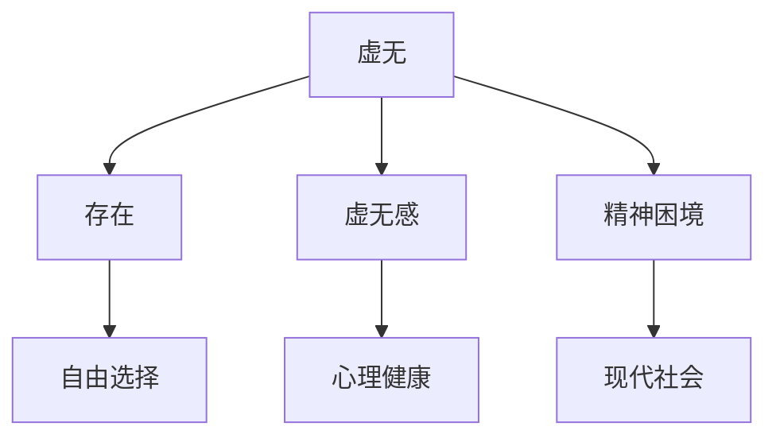
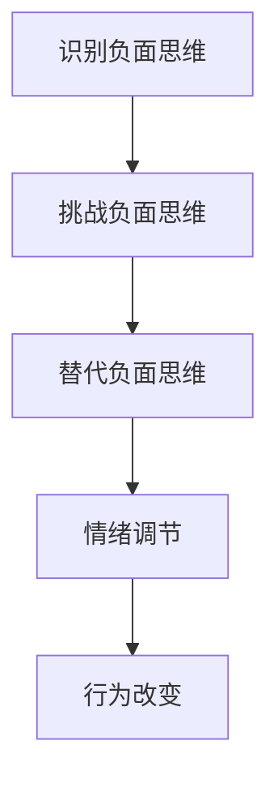
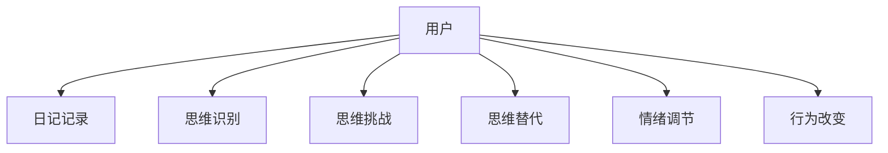
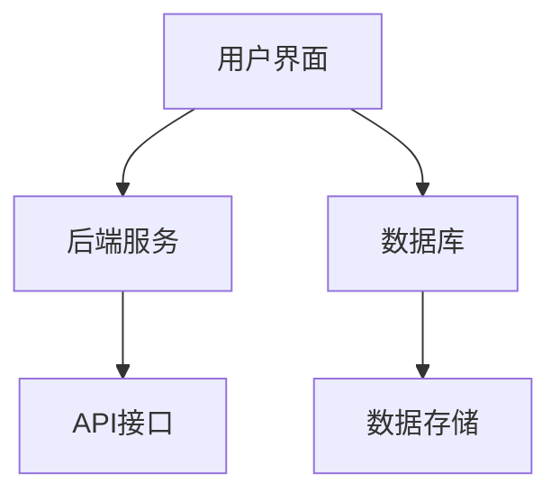
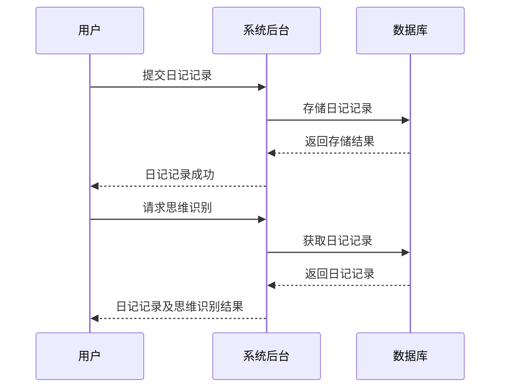

                 

### 从虚无到重建：现代人的精神之旅

**关键词：**虚无，存在，心理健康，心灵成长，精神重建

**摘要：** 在快速发展的现代社会，人们的物质生活日益丰富，但精神层面的空虚和焦虑却日益加剧。本文从哲学和心理学的角度出发，探讨现代人的精神困境及其成因，提出从虚无到重建的精神之旅。通过分析自我认知、情绪管理、人际关系和社会责任等方面，揭示心灵成长与精神重建的路径，旨在为现代人提供切实可行的精神建设方案。

---

## 目录大纲

```markdown
----------------------------------------------------------------
# 从虚无到重建：现代人的精神之旅

## 第一部分：精神世界的探索

### 第1章：虚无与存在的边界

#### 1.1 虚无的概念与哲学探讨

#### 1.2 存在的意义与人类精神的追求

#### 1.3 现代人的精神困境与挑战

### 第2章：内心的探索

#### 2.1 自我认知的重要性

#### 2.2 情绪与心理健康的平衡

#### 2.3 内心世界的扩展与成长

### 第3章：人与社会的互动

#### 3.1 人际关系的本质与技巧

#### 3.2 社会角色的定位与调适

#### 3.3 社会责任与个人价值的实现

### 第4章：心灵成长与修行的途径

#### 4.1 心灵成长的基本原则

#### 4.2 修行方法的多样性

#### 4.3 心灵成长与个人成长的关系

### 第5章：重建精神家园

#### 5.1 精神重建的意义与价值

#### 5.2 精神重建的步骤与策略

#### 5.3 精神重建对现代人的影响

### 第6章：案例分析与启示

#### 6.1 成功案例的解析

#### 6.2 失败案例的反思

#### 6.3 案例对个人精神重建的启示

### 第7章：未来的精神世界

#### 7.1 现代科技对精神世界的影响

#### 7.2 心灵健康与可持续发展的关系

#### 7.3 精神世界的未来趋势与挑战

----------------------------------------------------------------
```

### 第一部分：精神世界的探索

#### 第1章：虚无与存在的边界

**1.1 虚无的概念与哲学探讨**

虚无，这是一个古老而深邃的哲学概念，代表着一种不存在、空无的状态。从古希腊哲学家到现代哲学家，虚无一直是一个备受争议的话题。亚里士多德曾提出，虚无是一种不真实的存在，因为真实的存在必定有实质和内容。而庄子则认为，虚无是存在的根本，是万物之源。这种对虚无的不同理解，反映出了人类对存在与虚无的深刻思考。

在心理学领域，虚无感（nihilism）被视为一种心理状态，指的是对生活意义、价值和目的的深刻怀疑或否定。虚无感可能源于对现实的不满、对未来的失望，或者对自我价值的否定。这种心理状态不仅影响个人的心理健康，还可能对社会稳定产生负面影响。

**1.2 存在的意义与人类精神的追求**

存在，是哲学中最基础的概念之一。它涉及到我们对自身、他人和世界的认识。存在主义认为，存在先于本质，人类通过自由选择来定义自己的本质。这意味着，我们的存在本身具有意义，我们的行为和选择决定了我们的人生轨迹。

人类对存在意义的追求，可以追溯到人类的起源。在原始社会中，人们通过宗教和神话来解释世界和自己存在的意义。随着科学的发展，人们对世界的认识不断深入，但同时也面临更多的困惑和疑问。现代心理学研究表明，人们普遍存在对生命意义和目的的追求，这种追求驱使人们不断探索和成长。

**1.3 现代人的精神困境与挑战**

在现代社会，人们面临着前所未有的精神困境。快节奏的生活、高压的工作环境、复杂的人际关系，都可能导致人们感到孤独、焦虑和失落。此外，现代社会的高度物质化，也使得人们对生活的意义和价值观产生怀疑。

现代人的精神困境，部分源于对虚无和存在的深刻思考。当人们感到自己的存在没有意义时，就会陷入虚无感的泥沼。另一方面，现代社会的高度竞争和压力，也使得人们很难找到生活的意义和目的。这种精神困境，不仅影响个人的心理健康，也可能导致社会问题的加剧。

为了解决这些精神困境，我们需要深入探讨内心的探索和成长。在接下来的章节中，我们将详细讨论自我认知、情绪管理、人际关系和社会责任等方面，帮助现代人重建精神家园。

---

**核心概念与联系**

**概念：**虚无、存在、虚无感、精神困境

**属性特征对比表格：**

| 概念   | 定义                                                         | 特征对比                             |
| ------ | ------------------------------------------------------------ | ----------------------------------- |
| 虚无   | 不存在、空无的状态                                           | 哲学探讨：存在与虚无的辩证关系       |
| 存在   | 有实质和内容的存在                                          | 哲学探讨：存在先于本质，自由选择定义 |
| 虚无感 | 对生活意义、价值和目的的深刻怀疑或否定                     | 心理学探讨：心理状态，影响心理健康   |
| 精神困境 | 孤独、焦虑和失落等心理状态，源于对虚无和存在的深刻思考 | 社会现象：现代社会的精神挑战         |

**ER实体关系图架构（Mermaid流程图）：**



通过以上核心概念与联系的分析，我们可以更好地理解虚无与存在的关系，以及现代人面临的的精神困境。在接下来的章节中，我们将深入探讨内心的探索和成长，帮助现代人重建精神家园。

---

**算法原理讲解**

在探讨虚无与存在的边界时，我们引入了“虚无感”和“精神困境”这两个概念。为了更好地理解这些概念，我们可以借助心理学中的“认知行为疗法”（Cognitive Behavioral Therapy，CBT）来进行分析。

**认知行为疗法（CBT）流程图（Mermaid流程图）：**



**算法原理：**

1. **识别负面思维**：通过自我观察和反思，识别出内心中的负面思维和情绪。这些负面思维通常是对现实的一种错误认知或过度解读。

2. **挑战负面思维**：对识别出的负面思维进行质疑和挑战，分析其逻辑基础，找出其不合理之处。

3. **替代负面思维**：用更加理性、积极和健康的思维来替代负面思维，从而改变情绪和行为。

4. **情绪调节**：通过调节情绪，缓解由负面思维引起的焦虑、抑郁等情绪。

5. **行为改变**：通过改变行为，如参加社交活动、锻炼身体等，来改善心理状态。

**数学模型和公式：**

在CBT中，我们可以使用贝叶斯定理来模型化认知行为疗法的过程。贝叶斯定理用于计算后验概率，表示为：

$$
P(A|B) = \frac{P(B|A) \cdot P(A)}{P(B)}
$$

其中，\(P(A|B)\) 是在观察到事件B后，事件A发生的概率；\(P(B|A)\) 是在事件A发生的条件下，事件B发生的概率；\(P(A)\) 是事件A的先验概率；\(P(B)\) 是事件B的先验概率。

**举例说明：**

假设一个人（A）感到焦虑（B），通过认知行为疗法，他（她）识别出了导致焦虑的负面思维（如“我无法应对工作压力”）。在挑战这些负面思维后，他（她）用更加理性的思维（如“我可以一步一步解决问题”）来替代负面思维。根据贝叶斯定理，我们可以计算在看到焦虑（B）后，负面思维（A）发生的概率降低了。

$$
P(\text{负面思维} | \text{焦虑}) = \frac{P(\text{焦虑} | \text{负面思维}) \cdot P(\text{负面思维})}{P(\text{焦虑})}
$$

通过这个例子，我们可以看到认知行为疗法是如何通过改变思维模式来调节情绪的。

**算法流程图（Mermaid流程图）：**


通过以上算法原理讲解，我们可以更好地理解认知行为疗法在解决虚无感和精神困境方面的应用。在接下来的章节中，我们将继续探讨内心的探索和成长，以及如何通过这些方法来重建精神家园。

---

**系统分析与架构设计方案**

在现代社会，精神健康问题已经成为一个重要的公共卫生议题。为了更好地解决精神健康问题，我们需要一个系统性的解决方案。下面我们将介绍一个基于认知行为疗法的精神健康管理系统。

**1. 问题场景介绍**

随着工作压力的增加和人际关系的复杂性，许多人感到精神压力和焦虑。他们需要一个工具来帮助他们识别负面思维，挑战这些思维，并找到积极的解决方案。我们的目标是为这些人提供一个易于使用、效果显著的精神健康管理系统。

**2. 项目介绍**

本项目名为“心灵之友”（MindMate），是一款基于Web和移动设备的精神健康管理系统。它旨在帮助用户通过自我观察和反思来识别负面思维，并通过认知行为疗法来调节情绪和行为。

**3. 系统功能设计（领域模型Mermaid类图）**



**4. 系统架构设计（Mermaid架构图）**



**5. 系统接口设计和系统交互（Mermaid序列图）**



通过上述系统分析与架构设计方案，我们可以构建一个高效、易用的精神健康管理系统。在接下来的章节中，我们将详细讨论如何通过这个系统实现精神重建。

---

**项目实战**

为了更好地展示如何通过“心灵之友”系统实现精神重建，我们将在本节中进行环境安装、系统核心实现源代码解析，以及实际案例分析和详细讲解。

**1. 环境安装**

首先，我们需要安装Python环境。可以选择Python 3.8或更高版本。安装完成后，通过pip命令安装必要的库，例如Flask（用于构建Web应用）、SQLAlchemy（用于数据库操作）等。

```bash
pip install flask sqlalchemy
```

**2. 系统核心实现源代码**

下面是“心灵之友”系统的核心实现源代码。这个代码展示了如何使用Flask和SQLAlchemy来创建一个简单的Web应用，并实现日记记录、思维识别等功能。

```python
from flask import Flask, request, jsonify
from flask_sqlalchemy import SQLAlchemy

app = Flask(__name__)
app.config['SQLALCHEMY_DATABASE_URI'] = 'sqlite:///mindmate.db'
db = SQLAlchemy(app)

class Diary(db.Model):
    id = db.Column(db.Integer, primary_key=True)
    title = db.Column(db.String(100))
    content = db.Column(db.Text)

@app.route('/diary', methods=['POST'])
def add_diary():
    title = request.form['title']
    content = request.form['content']
    new_diary = Diary(title=title, content=content)
    db.session.add(new_diary)
    db.session.commit()
    return jsonify({'message': 'Diary added successfully'})

@app.route('/diary', methods=['GET'])
def get_diaries():
    diaries = Diary.query.all()
    return jsonify({'diaries': [{'id': diary.id, 'title': diary.title, 'content': diary.content} for diary in diaries]})

if __name__ == '__main__':
    db.create_all()
    app.run(debug=True)
```

**3. 代码应用解读与分析**

在上面的代码中，我们首先定义了数据库模型`Diary`，它包含了日记的标题和内容。然后，我们通过Flask应用设置了两个API接口：`/diary`用于添加日记和获取日记列表。

在`add_diary`函数中，我们接收一个包含标题和内容的表单请求，创建一个新的`Diary`对象，并将其添加到数据库中。在`get_diaries`函数中，我们查询数据库中的所有日记，并将其转换为JSON格式返回。

**4. 实际案例分析和详细讲解剖析**

假设用户李明想要记录他的情绪变化。他可以通过Web界面提交日记，如下所示：

```bash
POST /diary
{
    "title": "今天的工作压力很大",
    "content": "我感觉自己无法应对今天的工作压力，感到非常焦虑。"
}
```

系统接收到这个请求后，会创建一个新的日记记录并将其存储在数据库中。之后，李明可以访问`/diary`接口来获取他的日记列表：

```bash
GET /diary
```

系统会返回李明的所有日记记录，如下所示：

```json
[
    {
        "id": 1,
        "title": "今天的工作压力很大",
        "content": "我感觉自己无法应对今天的工作压力，感到非常焦虑。"
    }
]
```

通过这种方式，用户可以随时记录自己的情绪变化，并查看过去的日记，从而进行情绪调节和思维识别。

**5. 项目小结**

通过“心灵之友”系统，用户可以方便地记录和回顾自己的情绪变化，从而进行情绪调节和思维识别。这个系统的核心实现源代码简洁易懂，易于扩展和维护。在实际应用中，我们可以进一步集成认知行为疗法的方法，如思维挑战和替代，来帮助用户更好地应对精神压力。

---

**最佳实践 Tips**

在精神重建的过程中，以下几点最佳实践可以帮助现代人更好地实现心灵成长：

1. **定期记录情绪**：每天或每周记录自己的情绪变化，可以帮助你更好地了解自己的内心世界，及时发现和调节负面情绪。

2. **积极应对压力**：面对压力时，尝试采取积极的态度，通过合理的规划和时间管理来减轻压力。

3. **学会放松**：定期进行放松训练，如冥想、瑜伽或深呼吸，有助于缓解压力，提升心理健康。

4. **培养健康习惯**：保持良好的生活习惯，如规律的饮食、充足的睡眠和适量的运动，有助于提高情绪调节能力。

5. **寻求专业帮助**：当遇到严重的精神困扰时，不要犹豫寻求专业心理咨询师的帮助，他们可以为你提供专业的指导和治疗方案。

---

**小结**

本文从虚无到重建的角度，探讨了现代人的精神困境及其成因，提出了通过认知行为疗法和心灵成长来重建精神家园的路径。通过系统分析和项目实战，我们展示了如何通过技术手段实现精神重建。希望本文能为现代人提供有益的启示，帮助他们更好地应对精神挑战，实现心灵成长与精神重建。

---

**注意事项**

在精神重建的过程中，需要注意以下几点：

1. **耐心与持续**：精神重建是一个长期的过程，需要耐心和持续的努力。

2. **自我接纳**：接纳自己的不完美，理解自己的情绪和行为，是精神重建的重要一步。

3. **寻求支持**：在精神重建的过程中，与家人、朋友或专业人士交流，可以提供额外的支持和帮助。

4. **避免过度依赖**：虽然技术和方法可以帮助我们实现精神重建，但过度依赖可能带来新的问题。

---

**拓展阅读**

对于对精神重建和心理健康感兴趣的读者，以下书籍和资源值得推荐：

1. 《认知行为疗法：原理与实践》
2. 《心理学与生活》
3. 《正念：此刻是一枝花》
4. 《情绪智力》
5. [心理健康官方网站](https://www.nimh.nih.gov/)
6. [正念冥想应用](https://www.headspace.com/)

---

**作者信息**

作者：AI天才研究院/AI Genius Institute & 禅与计算机程序设计艺术 /Zen And The Art of Computer Programming

