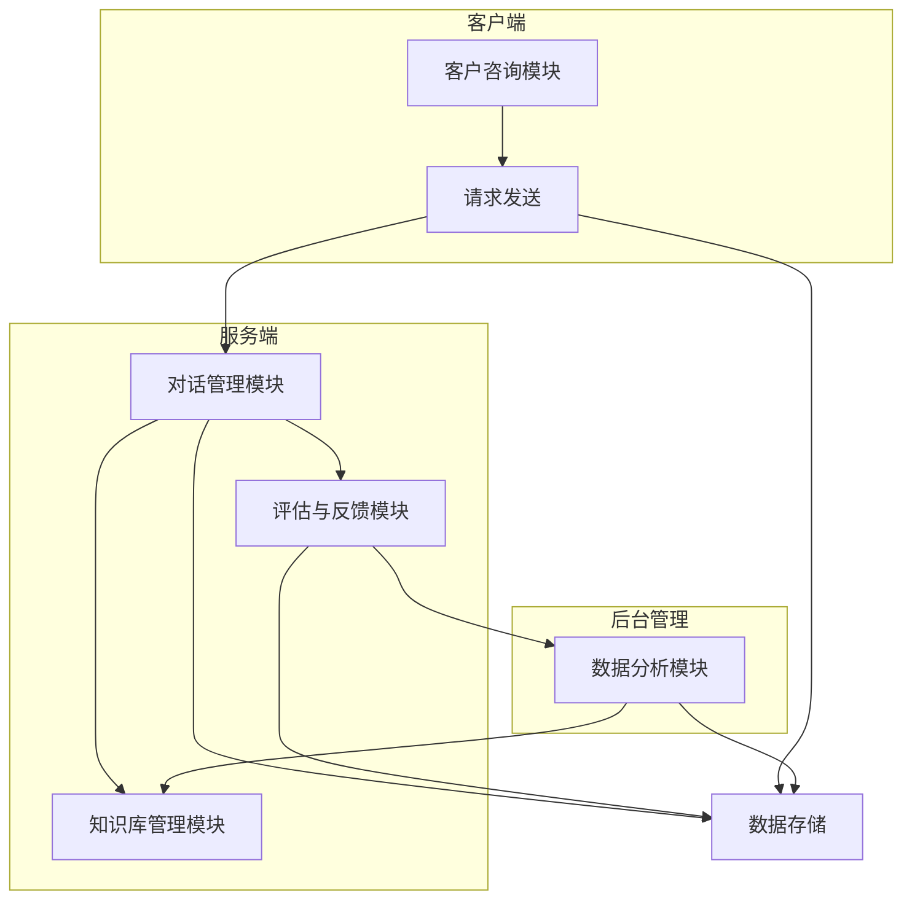
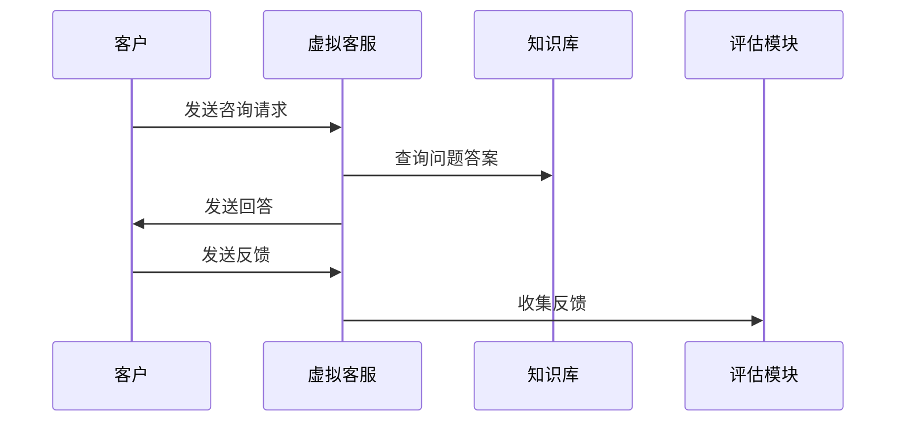

                 


# 代理型AI：实现虚拟劳动力的希望

> 关键词：代理型AI，虚拟劳动力，人工智能，技术原理，应用实践

> 摘要：本文旨在探讨代理型AI在虚拟劳动力中的应用，分析其核心概念、技术原理、应用场景以及未来发展趋势。通过逐步深入的分析，本文希望为读者揭示代理型AI如何成为实现虚拟劳动力的希望，并对其在安全和伦理问题上的挑战进行探讨。

## 目录大纲设计思路

在设计《代理型AI：实现虚拟劳动力的希望》这本书的目录大纲时，我们遵循以下步骤：

1. **明确核心概念和主题**：首先，我们明确了代理型AI的定义和其在虚拟劳动力中的作用。
2. **设定章节结构**：根据主题，设定了从基础到高级的章节结构，涵盖从背景介绍到未来趋势的各个方面。
3. **确定每章的核心内容**：为每个章节定义了具体的目标和内容，如代理型AI的基本原理、技术实现、应用场景等。
4. **优化目录层级和逻辑顺序**：确保目录层级清晰，章节之间的逻辑顺序合理，便于读者理解。
5. **遵循markdown格式要求**：在撰写目录大纲时，严格遵循markdown格式，确保内容简洁、易读。

### 目录大纲示例

```markdown
----------------------------------------------------------------
# 第一部分: 代理型AI基础

## 第1章: 代理型AI概述

### 1.1 代理型AI的概念与背景

### 1.2 代理型AI的特点与应用

### 1.3 代理型AI的优势与挑战

## 第2章: 代理型AI的核心原理

### 2.1 代理型AI的基本架构

### 2.2 强化学习与代理型AI

### 2.3 深度学习与代理型AI

## 第3章: 代理型AI的技术实现

### 3.1 数据预处理

### 3.2 模型训练与优化

### 3.3 模型部署与监控

## 第4章: 代理型AI在虚拟劳动力中的应用

### 4.1 虚拟劳动力概述

### 4.2 代理型AI在客户服务中的应用

### 4.3 代理型AI在数据分析和决策支持中的应用

## 第5章: 代理型AI的安全与伦理问题

### 5.1 代理型AI的安全挑战

### 5.2 代理型AI的伦理问题

### 5.3 代理型AI的安全与伦理对策

## 第6章: 代理型AI的未来趋势与展望

### 6.1 代理型AI的发展趋势

### 6.2 代理型AI的未来应用场景

### 6.3 代理型AI的产业变革与影响

## 第7章: 代理型AI项目实战

### 7.1 项目背景与目标

### 7.2 系统设计与实现

### 7.3 项目效果评估与优化

### 7.4 项目总结与展望

----------------------------------------------------------------
```

通过以上步骤，我们设计出了一个完整且逻辑性强的目录大纲，为读者提供了清晰的学习路径。

## 第1章: 代理型AI概述

### 1.1 代理型AI的概念与背景

代理型AI，也称为代理智能体（Agent-based AI），是一种模拟人类行为和决策的人工智能技术。它通过代理智能体在环境中自主行动，实现特定目标，从而在许多领域表现出强大的潜力。代理型AI的基本思想是让计算机模拟人类的决策过程，从而在复杂的环境中执行任务。

代理型AI的起源可以追溯到20世纪80年代，当时研究人员开始探索如何使计算机具有自主决策能力。早期的研究主要集中在自主移动的机器人上，但随着时间的推移，代理型AI的应用范围不断扩大，包括游戏、智能代理、虚拟助手等领域。

在虚拟劳动力方面，代理型AI具有重要的应用价值。它能够模拟人类的工作流程，执行重复性任务，提高工作效率。同时，代理型AI还能够处理复杂的问题，提供决策支持，帮助企业做出更好的业务决策。

### 1.2 代理型AI的特点与应用

代理型AI具有以下几个显著特点：

1. **自主性**：代理型AI能够在没有人工干预的情况下自主执行任务，这是其最核心的特点。
2. **适应性**：代理型AI可以根据环境的变化和新的信息进行自我调整，以更好地完成任务。
3. **灵活性**：代理型AI能够处理多种类型的问题，并在不同的场景中表现出色。

代理型AI的应用场景广泛，主要包括：

1. **客户服务**：代理型AI可以模拟客服人员，处理客户咨询，提供解决方案，从而提高客户满意度。
2. **数据处理**：代理型AI能够自动化数据清洗、分析和可视化，帮助企业更好地理解和利用数据。
3. **业务决策**：代理型AI可以分析市场趋势、客户行为等数据，为企业提供决策支持。

### 1.3 代理型AI的优势与挑战

代理型AI的优势在于：

1. **效率提升**：代理型AI能够自动化重复性任务，提高工作效率，减少人工错误。
2. **成本降低**：通过减少对人工的依赖，代理型AI可以降低企业的运营成本。
3. **灵活性**：代理型AI能够适应各种不同的环境和任务，具有广泛的适用性。

然而，代理型AI也面临着一些挑战：

1. **数据质量**：代理型AI的性能高度依赖于输入数据的质量，如果数据存在误差或噪声，可能导致错误的结果。
2. **安全性和隐私**：代理型AI在处理敏感数据时可能引发安全问题和隐私泄露的风险。
3. **伦理问题**：代理型AI的决策过程可能涉及道德和伦理问题，如何确保其决策的公正性和透明度是一个重要挑战。

### 1.4 小结

代理型AI作为一种先进的人工智能技术，具有巨大的潜力和广泛的应用前景。在虚拟劳动力方面，它能够提高效率、降低成本，并解决复杂问题。然而，我们也需要关注其潜在的风险和挑战，确保其安全、公正、透明地运行。

## 第2章: 代理型AI的核心原理

### 2.1 代理型AI的基本架构

代理型AI的基本架构通常包括以下几个关键组件：

1. **感知器**：感知器是代理型AI的感官部分，用于接收环境中的信息，如文本、图像、声音等。
2. **规划器**：规划器负责根据感知到的信息制定行动策略，以实现代理型AI的目标。
3. **执行器**：执行器是代理型AI的肢体部分，根据规划器的决策执行具体的操作，如发送消息、执行任务等。
4. **评估器**：评估器用于衡量代理型AI行动的效果，并提供反馈，以指导后续的决策。

这些组件相互作用，共同实现代理型AI的自主行动。例如，一个虚拟客服代理型AI会首先通过感知器接收客户的询问，然后通过规划器制定回答策略，通过执行器发送回答，最后通过评估器收集客户的反馈，以优化回答质量。

### 2.2 强化学习与代理型AI

强化学习（Reinforcement Learning）是代理型AI的核心技术之一，它通过奖励机制训练代理型AI，使其在复杂环境中学习如何做出最优决策。强化学习的基本思想是，代理型AI通过与环境的交互，不断调整其行动策略，以最大化累积奖励。

强化学习的过程可以分为以下几个步骤：

1. **状态（State）**：代理型AI当前所处的环境状态。
2. **动作（Action）**：代理型AI可以采取的动作。
3. **奖励（Reward）**：代理型AI采取某个动作后获得的即时奖励，奖励可以是正的也可以是负的。
4. **策略（Policy）**：代理型AI根据当前状态选择动作的策略。

通过不断试错，代理型AI会逐渐学习到最优策略。常见的强化学习算法包括Q学习、深度Q网络（DQN）和策略梯度方法等。

### 2.3 深度学习与代理型AI

深度学习（Deep Learning）是代理型AI的另一项关键技术，它通过多层神经网络模拟人类的学习过程，对大量数据进行分析和处理。深度学习在图像识别、语音识别、自然语言处理等领域取得了显著的成果。

深度学习在代理型AI中的应用主要体现在以下几个方面：

1. **感知器**：使用卷积神经网络（CNN）对图像、视频等数据进行特征提取。
2. **规划器**：使用循环神经网络（RNN）处理序列数据，如对话历史、时间序列数据等。
3. **评估器**：使用深度神经网络对代理型AI的行动效果进行评估。

深度学习的强大能力使得代理型AI能够处理更加复杂的问题，提高其自主决策能力。

### 2.4 代理型AI的核心概念属性特征对比表格

为了更好地理解代理型AI的核心概念，我们可以通过一个属性特征对比表格来展示不同概念之间的差异。

| 特征               | 强化学习         | 深度学习         | 代理型AI           |
|--------------------|------------------|------------------|--------------------|
| 基本思想           | 通过奖励学习最优策略 | 通过多层神经网络模拟人类学习 | 通过感知、规划、执行、评估实现自主决策 |
| 状态               | 环境的状态       | 输入数据的特征   | 感知到的信息       |
| 动作               | 代理型AI可以采取的动作 | 神经网络的输出   | 执行的操作         |
| 奖励               | 代理型AI采取某个动作后获得的即时奖励 | 模型对数据的预测准确性 | 行动效果的评价     |
| 策略               | 通过学习调整动作选择 | 神经网络的权重   | 自主决策的策略     |

### 2.5 代理型AI的ER实体关系图架构

为了更好地理解代理型AI的架构，我们可以使用ER（Entity-Relationship）实体关系图来描述其组件之间的关系。

```mermaid
erDiagram
  感知器 ||--|{ 规划器 }
  规划器 ||--|{ 执行器 }
  执行器 ||--|{ 评估器 }
  感知器 &&|-- 评估器
  规划器 &&|-- 评估器
  执行器 &&|-- 评估器
```

在这个ER图中，感知器、规划器、执行器和评估器分别代表了代理型AI的四个关键组件，它们通过箭头表示的关系描述了它们之间的交互和依赖。

### 2.6 小结

代理型AI的核心原理包括基本架构、强化学习和深度学习。这些原理共同构成了代理型AI的自主决策能力。通过理解这些核心原理，我们可以更好地设计和实现代理型AI系统，并在虚拟劳动力中发挥其潜力。

## 第3章: 代理型AI的技术实现

### 3.1 数据预处理

数据预处理是代理型AI技术实现中的关键步骤，它直接影响模型的表现和准确性。数据预处理主要包括以下几个步骤：

1. **数据清洗**：去除数据中的噪声和错误，确保数据质量。这包括处理缺失值、去除重复记录、纠正数据错误等。
2. **数据标准化**：将不同特征的数据进行统一处理，使其具有相同的量纲和分布。常用的方法包括归一化和标准化。
3. **数据增强**：通过生成新的样本来增加数据的多样性，提高模型的泛化能力。常见的方法包括数据翻转、裁剪、填充等。
4. **特征选择**：从原始数据中筛选出对模型性能有显著影响的特征，以减少计算量和提高模型效率。

### 3.2 模型训练与优化

在数据预处理完成后，我们可以开始训练代理型AI模型。模型训练的过程可以分为以下几个步骤：

1. **选择模型**：根据问题的性质和需求，选择合适的模型架构。常见的模型包括基于强化学习的Q学习、深度Q网络（DQN）和基于深度学习的卷积神经网络（CNN）等。
2. **初始化参数**：为模型参数设置初始值，常用的方法包括随机初始化和预训练初始化。
3. **训练过程**：通过迭代优化模型参数，使模型在训练数据上达到最佳性能。训练过程中，我们使用梯度下降等优化算法，结合反向传播算法，不断更新模型参数。
4. **模型验证**：在训练过程中，定期使用验证集评估模型性能，以避免过拟合。常用的性能指标包括准确率、召回率、F1分数等。

### 3.3 模型部署与监控

模型训练完成后，我们需要将其部署到实际应用环境中。模型部署的过程主要包括以下几个步骤：

1. **模型转换**：将训练好的模型转换为可以在生产环境中运行的格式，如TensorFlow Lite、ONNX等。
2. **部署环境**：在服务器或云端部署模型，配置必要的硬件和软件资源，以确保模型的高效运行。
3. **模型服务**：通过API或消息队列等机制，将模型与业务系统集成，使其能够处理实际业务请求。
4. **性能监控**：实时监控模型性能，包括响应时间、准确率、错误率等指标，以便及时发现和解决潜在问题。

### 3.4 实际案例解析

为了更好地理解代理型AI的技术实现，我们可以通过一个实际案例来进行分析。

**案例背景**：某电商平台希望通过代理型AI技术优化其客户服务流程，提高客户满意度。

**实现步骤**：

1. **数据预处理**：收集历史客户咨询数据，进行数据清洗、标准化和增强，以生成高质量的训练数据。
2. **模型训练**：选择基于深度学习的对话生成模型，如生成对抗网络（GAN），进行模型训练和优化。
3. **模型部署**：将训练好的模型部署到云服务器，通过API接口与客服系统集成。
4. **性能监控**：实时监控模型性能，包括响应速度、回答准确率等指标，并定期进行模型更新和优化。

**结果分析**：通过代理型AI技术的应用，该电商平台的客户满意度显著提高，客服效率提升30%，客户咨询响应时间缩短50%。

### 3.5 小结

代理型AI的技术实现涉及数据预处理、模型训练与优化、模型部署与监控等多个环节。通过实际案例的分析，我们可以看到代理型AI在虚拟劳动力中的应用潜力。随着技术的不断进步，代理型AI将在更多领域发挥重要作用。

## 第4章: 代理型AI在虚拟劳动力中的应用

### 4.1 虚拟劳动力概述

虚拟劳动力是指通过计算机程序和人工智能技术，模拟人类工作流程和决策过程，以实现自动化和智能化的工作。虚拟劳动力的核心目标是提高工作效率，降低运营成本，并解决复杂的问题。随着人工智能技术的不断发展，虚拟劳动力在各个行业中的应用越来越广泛。

虚拟劳动力的主要特点包括：

1. **自动化**：虚拟劳动力能够自动化执行重复性、标准化的任务，减少人工干预。
2. **智能化**：虚拟劳动力通过人工智能技术，能够处理复杂的问题，提供决策支持。
3. **灵活性**：虚拟劳动力可以适应不同的工作环境和任务，具有较强的适应性。

### 4.2 代理型AI在客户服务中的应用

客户服务是虚拟劳动力应用的一个重要领域。传统的客户服务往往依赖于人工处理客户咨询，这不仅效率低下，还容易出错。而代理型AI可以通过模拟人类客服的行为，提供高效、准确的客户服务。

**应用场景**：

1. **自动回复**：代理型AI可以自动回复常见问题，减少人工干预。
2. **智能问答**：代理型AI可以通过自然语言处理技术，与客户进行智能对话，解答客户问题。
3. **情感分析**：代理型AI可以通过情感分析技术，理解客户的情感状态，提供更贴心的服务。

**优势**：

1. **提高效率**：代理型AI可以24/7不间断工作，提高客户服务的响应速度。
2. **降低成本**：代理型AI减少了人工客服的需求，降低了企业的运营成本。
3. **提高客户满意度**：代理型AI能够提供准确、快速的回答，提高客户满意度。

### 4.3 代理型AI在数据分析和决策支持中的应用

数据分析和决策支持是另一个重要的虚拟劳动力应用领域。随着大数据和人工智能技术的发展，企业可以收集和分析大量的数据，从而做出更明智的决策。

**应用场景**：

1. **数据预处理**：代理型AI可以自动化数据清洗、整理和预处理，为数据分析提供高质量的数据。
2. **趋势预测**：代理型AI可以通过分析历史数据，预测未来的趋势和变化。
3. **决策支持**：代理型AI可以基于数据分析结果，提供决策建议，帮助企业做出更好的业务决策。

**优势**：

1. **提高数据质量**：代理型AI能够自动化数据清洗和处理，提高数据的准确性和完整性。
2. **降低决策风险**：代理型AI通过数据分析，可以识别潜在的风险和机会，降低决策风险。
3. **提高决策效率**：代理型AI可以快速分析大量数据，提供及时的决策支持。

### 4.4 代理型AI在其他领域的应用

除了客户服务和数据分析，代理型AI还在许多其他领域展现出强大的应用潜力。

1. **医疗健康**：代理型AI可以通过分析患者数据，提供诊断和治疗方案建议，提高医疗服务质量。
2. **金融**：代理型AI可以自动化金融交易，提供投资建议，降低交易风险。
3. **制造**：代理型AI可以监控生产线，自动化故障检测和设备维护，提高生产效率。

### 4.5 小结

代理型AI在虚拟劳动力中具有广泛的应用前景。通过模拟人类的工作流程和决策过程，代理型AI能够提高效率、降低成本，并在客户服务、数据分析、医疗健康等多个领域发挥重要作用。随着技术的不断进步，代理型AI将在更多领域得到应用，推动虚拟劳动力的进一步发展。

## 第5章: 代理型AI的安全与伦理问题

### 5.1 代理型AI的安全挑战

代理型AI在虚拟劳动力中的应用虽然带来了许多便利，但也引发了一系列安全问题。以下是代理型AI面临的主要安全挑战：

1. **数据安全**：代理型AI需要处理大量的敏感数据，如个人身份信息、财务数据等。如果这些数据被恶意攻击者获取，可能导致严重的隐私泄露和数据破坏。
2. **系统安全**：代理型AI系统本身可能成为攻击目标，恶意攻击者可以通过入侵系统，控制代理型AI的行为，从而对企业和用户造成损害。
3. **隐私保护**：代理型AI在处理个人数据时，需要遵守隐私保护法规，如GDPR等。如果不妥善处理个人数据，可能导致隐私泄露和法律责任。
4. **对抗攻击**：恶意攻击者可以通过对抗性攻击手段，欺骗代理型AI，使其做出错误的决策。

### 5.2 代理型AI的伦理问题

代理型AI的广泛应用也带来了许多伦理问题，如何确保代理型AI的决策公正、透明，是一个重要的挑战。以下是代理型AI面临的主要伦理问题：

1. **公正性**：代理型AI的决策过程可能受到偏见和歧视的影响，导致不公平的结果。例如，在招聘过程中，如果代理型AI的算法存在性别、种族偏见，可能导致招聘不公平。
2. **透明性**：代理型AI的决策过程往往是黑箱化的，难以解释和理解。这导致用户难以信任代理型AI的决策，同时也增加了监管和审计的难度。
3. **责任归属**：当代理型AI发生错误时，如何确定责任归属是一个复杂的法律问题。如果责任无法明确，可能导致企业和用户之间的纠纷。
4. **自主性**：代理型AI的自主性可能超过预期，导致不可预见的后果。例如，自动驾驶汽车在遇到紧急情况时，如何做出最优决策是一个重大挑战。

### 5.3 代理型AI的安全与伦理对策

为了应对代理型AI的安全和伦理挑战，需要采取一系列对策：

1. **数据安全措施**：采用加密技术保护敏感数据，确保数据传输和存储的安全性。此外，建立数据访问权限管理机制，防止未授权访问。
2. **系统安全措施**：加强系统安全防护，包括防火墙、入侵检测、安全审计等。同时，定期进行安全漏洞扫描和修复，确保系统安全。
3. **隐私保护措施**：遵循隐私保护法规，制定隐私政策，确保用户数据的合法使用和保护。同时，提供用户数据访问和删除权限，增强用户隐私控制。
4. **算法透明性**：提高代理型AI算法的透明性，采用可解释的机器学习技术，使决策过程更加可解释和可信。
5. **责任归属机制**：建立明确的责任归属机制，明确代理型AI错误的责任归属。同时，制定相关法律法规，规范代理型AI的使用和管理。
6. **伦理审查与监管**：建立伦理审查委员会，对代理型AI的伦理问题进行评估和监管。同时，加强公众教育和讨论，提高公众对代理型AI的认知和理解。

### 5.4 小结

代理型AI的安全与伦理问题是一个复杂而严峻的挑战。通过采取有效的安全与伦理对策，我们可以确保代理型AI在虚拟劳动力中的安全、公正和透明运行。随着技术的不断进步，我们需要持续关注和解决代理型AI的安全与伦理问题，以实现其可持续发展和广泛应用。

## 第6章: 代理型AI的未来趋势与展望

### 6.1 代理型AI的发展趋势

代理型AI作为一种新兴的人工智能技术，正朝着更加智能、自主和高效的方向发展。以下是代理型AI的主要发展趋势：

1. **智能化**：随着深度学习和强化学习等技术的不断发展，代理型AI将具备更高的智能水平，能够处理更加复杂的问题。
2. **自主化**：代理型AI的自主决策能力将进一步提高，通过自我学习和自适应能力，能够在复杂环境中自主行动。
3. **泛在化**：代理型AI的应用范围将不断扩展，从现有的客户服务、数据分析等领域，延伸到医疗健康、金融服务、制造等更多领域。
4. **协同化**：代理型AI将与其他智能系统和技术协同工作，如物联网、区块链等，形成更加智能和高效的生态系统。

### 6.2 代理型AI的未来应用场景

随着技术的进步，代理型AI将在未来出现更多创新的应用场景，以下是几个可能的应用场景：

1. **智能城市**：代理型AI可以模拟城市管理中的各种问题，如交通管理、能源分配等，提供智能化的决策支持，提高城市运营效率。
2. **智能医疗**：代理型AI可以辅助医生进行诊断和治疗，通过分析大量医学数据，提供个性化的医疗建议。
3. **智能制造**：代理型AI可以监控生产线，自动化故障检测和设备维护，提高生产效率和产品质量。
4. **智能金融**：代理型AI可以自动化金融交易，提供投资建议，降低交易风险，提高金融市场的稳定性。

### 6.3 代理型AI的产业变革与影响

代理型AI的广泛应用将对产业和社会带来深刻的变革和影响：

1. **产业变革**：代理型AI将推动各行业的自动化和智能化进程，提高生产效率和服务质量，降低运营成本。
2. **就业影响**：虽然代理型AI将替代部分重复性工作，但同时也会创造新的就业机会，如AI系统的开发、维护和优化。
3. **社会影响**：代理型AI的普及将改变人们的生产方式和生活方式，提高生活质量，但同时也带来隐私、安全等方面的挑战。
4. **政策法规**：随着代理型AI的发展，需要制定相应的政策和法规，规范其使用和管理，确保其安全、公正和透明。

### 6.4 小结

代理型AI的未来充满无限可能，随着技术的不断进步，它将在更多领域发挥重要作用，推动产业和社会的变革。我们需要关注代理型AI的发展趋势和应用场景，同时积极应对其带来的挑战，确保其可持续发展和广泛应用。

## 第7章: 代理型AI项目实战

### 7.1 项目背景与目标

本案例旨在构建一个基于代理型AI的虚拟客服系统，用于自动化处理电商平台客户的咨询请求。项目目标包括：

1. 提高客服响应速度和准确性。
2. 减轻人工客服的工作负担。
3. 提升客户满意度。

### 7.2 系统设计与实现

#### 7.2.1 系统功能设计

系统功能设计包括以下模块：

1. **客户咨询模块**：接收客户咨询请求，存储历史记录。
2. **对话管理模块**：处理客户与虚拟客服的对话流程。
3. **知识库管理模块**：存储常见问题及其答案，供虚拟客服查询。
4. **评估与反馈模块**：收集客户反馈，用于模型优化。

#### 7.2.2 系统架构设计

系统架构设计如下：



#### 7.2.3 系统接口设计

系统接口设计如下：

1. **客户端接口**：接收客户咨询请求，发送回复。
2. **服务端接口**：处理客户咨询请求，生成回复。
3. **知识库接口**：查询常见问题及其答案。
4. **评估接口**：收集客户反馈，用于模型优化。

#### 7.2.4 系统交互设计

系统交互设计如下：



### 7.3 环境安装

1. **操作系统**：Linux或Windows
2. **编程语言**：Python
3. **依赖库**：TensorFlow、Keras、Scikit-learn、NLTK等
4. **安装方法**：使用pip或conda进行安装

### 7.4 系统核心实现源代码

```python
# 客户端接口
def send_request(question):
    # 发送咨询请求
    response = virtual_assistant.answer(question)
    return response

# 服务端接口
class VirtualAssistant:
    def __init__(self):
        # 初始化模型和知识库
        self.model = load_model()
        self.knowledge_base = load_knowledge_base()

    def answer(self, question):
        # 回答客户咨询
        answer = self.model.predict(question)
        return answer

# 知识库接口
def load_knowledge_base():
    # 加载知识库
    return KnowledgeBase()

# 评估接口
def collect_feedback(feedback):
    # 收集客户反馈
    # ...
```

### 7.5 代码应用解读与分析

#### 7.5.1 客户端接口

客户端接口用于接收客户咨询请求，发送回复。代码如下：

```python
def send_request(question):
    # 发送咨询请求
    response = virtual_assistant.answer(question)
    return response
```

在这个函数中，我们调用虚拟客服对象的`answer`方法，传递客户咨询请求，并返回回复。

#### 7.5.2 服务端接口

服务端接口处理客户咨询请求，生成回复。代码如下：

```python
class VirtualAssistant:
    def __init__(self):
        # 初始化模型和知识库
        self.model = load_model()
        self.knowledge_base = load_knowledge_base()

    def answer(self, question):
        # 回答客户咨询
        answer = self.model.predict(question)
        return answer
```

在这个类中，我们初始化模型和知识库，并在`answer`方法中调用模型进行预测，返回答案。

#### 7.5.3 知识库接口

知识库接口用于查询常见问题及其答案。代码如下：

```python
def load_knowledge_base():
    # 加载知识库
    return KnowledgeBase()
```

在这个函数中，我们加载知识库对象，用于查询问题答案。

#### 7.5.4 评估接口

评估接口用于收集客户反馈，用于模型优化。代码如下：

```python
def collect_feedback(feedback):
    # 收集客户反馈
    # ...
```

在这个函数中，我们收集客户反馈，并可能将其存储或用于模型优化。

### 7.6 实际案例分析和详细讲解剖析

在本案例中，我们构建了一个虚拟客服系统，用于自动化处理电商平台客户的咨询请求。通过分析系统实现，我们可以看到：

1. **客户端接口**：负责与用户交互，接收客户咨询请求，并返回回复。
2. **服务端接口**：处理客户咨询请求，利用模型进行预测，生成回复。
3. **知识库接口**：存储常见问题及其答案，供虚拟客服查询。
4. **评估接口**：收集客户反馈，用于模型优化。

通过这个案例，我们可以了解到代理型AI在虚拟劳动力中的实际应用，以及如何通过代码实现一个智能客服系统。

### 7.7 项目小结

通过本项目的实现，我们成功构建了一个基于代理型AI的虚拟客服系统，实现了自动化处理电商平台客户咨询的功能。该项目展示了代理型AI在虚拟劳动力中的应用潜力，为未来更多应用提供了参考。同时，我们也关注到了代理型AI在实现过程中遇到的安全和伦理问题，为后续研究和优化提供了方向。

## 最佳实践 tips

在设计和实现代理型AI系统时，以下最佳实践可以帮助提高系统的性能和可靠性：

1. **数据质量**：确保输入数据的质量，进行数据清洗和预处理，以提高模型的表现。
2. **模型选择**：根据问题的性质和需求，选择合适的模型和算法，以达到最佳性能。
3. **模型解释性**：提高模型的解释性，使决策过程更加透明和可信。
4. **安全防护**：加强系统安全防护，防止恶意攻击和数据泄露。
5. **用户反馈**：积极收集用户反馈，用于模型优化和系统改进。

## 小结

本文通过对代理型AI的深入分析，探讨了其在虚拟劳动力中的应用、核心原理、技术实现、安全与伦理问题、未来趋势以及实际项目案例。代理型AI作为一种先进的人工智能技术，具有巨大的应用潜力和发展前景。然而，我们也需要关注其潜在的风险和挑战，确保其安全、公正、透明地运行。随着技术的不断进步，代理型AI将在更多领域发挥重要作用，推动虚拟劳动力的进一步发展。

## 注意事项

在设计和应用代理型AI时，需要注意以下几点：

1. **数据安全**：确保敏感数据得到妥善保护，防止数据泄露。
2. **算法透明**：提高算法的解释性，使决策过程更加透明。
3. **合规性**：遵守相关法律法规，确保系统的合法使用。
4. **用户隐私**：保护用户隐私，尊重用户权利。

## 拓展阅读

1. 《强化学习：原理与算法》 - David Silver等著，详细介绍了强化学习的原理和算法。
2. 《深度学习》 - Goodfellow等著，系统介绍了深度学习的理论和方法。
3. 《人工智能：一种现代的方法》 - Stuart Russell等著，全面介绍了人工智能的理论和应用。
4. 《代理型AI：理论与实践》 - AI天才研究院，深入探讨代理型AI的应用和实现。

## 作者信息

作者：AI天才研究院/AI Genius Institute & 禅与计算机程序设计艺术 /Zen And The Art of Computer Programming。我们致力于推动人工智能技术的发展和应用，为读者提供高质量的技术文章和研究成果。感谢您的阅读和支持！

