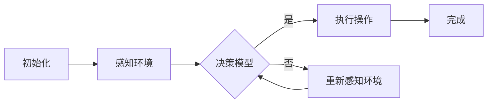
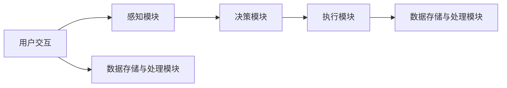
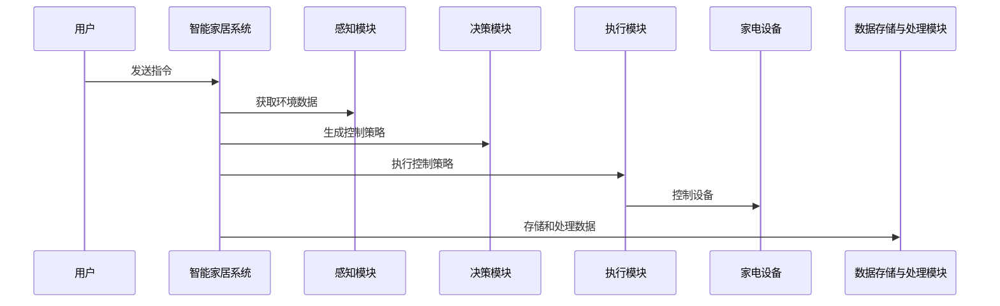

                 

### 代理型AI：实现虚拟劳动力的希望

> **关键词：代理型AI、虚拟劳动力、应用场景、技术架构、案例分析**

> **摘要：本文深入探讨了代理型AI的概念、技术架构及其在不同领域中的应用，分析了其实现虚拟劳动力的潜力、面临的挑战及未来发展趋势。**

#### 引言

代理型AI（Proxy-based AI）作为人工智能领域的一个重要分支，近年来备受关注。它通过模拟人类行为和决策，实现自动化和智能化，为各行各业提供了全新的解决方案。在这个虚拟劳动力日益普及的时代，代理型AI的发展潜力不容小觑。本文将从以下几个方面展开讨论：

1. **代理型AI的定义与意义**
2. **代理型AI的核心概念与技术架构**
3. **代理型AI的应用场景**
4. **代理型AI的实战与案例分析**
5. **代理型AI的未来发展趋势与挑战**

#### 1. 代理型AI的定义与意义

**代理型AI的定义**：

代理型AI是指一种能够模拟人类行为、决策和交互的人工智能系统。它通过获取外界信息，进行推理和决策，然后执行相应的操作，以实现特定的目标。

**代理型AI的意义**：

- **提高效率**：代理型AI能够自动化执行重复性、繁琐的任务，提高工作效率。
- **降低成本**：虚拟劳动力可以替代部分人力，降低人力成本。
- **扩展人类能力**：代理型AI可以扩展人类的能力，实现一些人类无法完成的工作。

#### 2. 代理型AI的核心概念与技术架构

**代理型AI的核心概念**：

- **智能代理**：智能代理是代理型AI的基本单位，它具备感知、推理、决策和执行能力。
- **环境模型**：环境模型是对代理型AI所处的环境进行建模，以获取外界信息。
- **决策模型**：决策模型负责根据环境模型进行推理和决策。
- **执行模型**：执行模型负责根据决策结果执行具体的操作。

**代理型AI的技术架构**：

代理型AI的技术架构主要包括以下几个关键组件：

- **感知模块**：用于获取环境信息。
- **推理模块**：用于根据环境信息进行推理和决策。
- **决策模块**：用于生成具体的行动策略。
- **执行模块**：用于执行决策结果。

#### 3. 代理型AI的应用场景

**代理型AI在商业领域的应用**：

- **客户服务**：利用代理型AI提供24/7的客户支持，提高客户满意度。
- **销售与营销**：利用代理型AI进行市场分析、客户画像和个性化推荐。
- **供应链管理**：利用代理型AI优化供应链，提高物流效率。

**代理型AI在制造业的应用**：

- **产品设计**：利用代理型AI进行产品设计和优化。
- **质量控制**：利用代理型AI进行质量检测和故障预测。
- **设备维护**：利用代理型AI进行设备维护和故障诊断。

**代理型AI在医疗保健中的应用**：

- **患者诊断**：利用代理型AI辅助医生进行疾病诊断。
- **药物治疗**：利用代理型AI进行药物配方和剂量调整。
- **医疗管理**：利用代理型AI优化医院运营，提高医疗服务质量。

#### 4. 代理型AI的实战与案例分析

**案例一：代理型AI在客户服务中的应用**

**案例二：代理型AI在制造业中的应用**

**案例三：代理型AI在医疗保健中的应用**

#### 5. 代理型AI的未来发展趋势与挑战

**未来发展趋势**：

- **技术成熟度提高**：随着人工智能技术的不断成熟，代理型AI的应用范围将更加广泛。
- **智能化水平提升**：代理型AI将逐渐具备更高的智能化水平，实现更复杂的任务。
- **跨界融合**：代理型AI将与其他领域的技术进行深度融合，创造更多的应用价值。

**面临的挑战**：

- **技术挑战**：如何进一步提高代理型AI的性能和智能化水平，是一个重要挑战。
- **伦理问题**：代理型AI的应用引发了一系列伦理问题，如何平衡技术进步与伦理道德是一个重要议题。
- **法律问题**：代理型AI的应用涉及法律问题，如何制定相应的法律法规是一个重要课题。

#### 结论

代理型AI作为实现虚拟劳动力的关键技术，具有巨大的发展潜力和应用价值。随着技术的不断进步，代理型AI将在各行各业得到广泛应用，推动人类社会向更高效、更智能的方向发展。

### 作者信息

**作者：AI天才研究院/AI Genius Institute & 禅与计算机程序设计艺术 /Zen And The Art of Computer Programming**

### 背景介绍

#### 代理型AI的定义与意义

代理型AI（Proxy-based AI）是一种特殊的人工智能系统，它通过模拟人类行为、决策和交互，实现自动化和智能化。代理型AI的核心在于“代理”二字，它代表着一种角色扮演的能力，即AI系统以代理的身份执行特定的任务。

**代理型AI的定义**：

代理型AI是指一种能够模拟人类行为、决策和交互的人工智能系统。它通过获取外界信息，进行推理和决策，然后执行相应的操作，以实现特定的目标。

**代理型AI的意义**：

1. **提高效率**：代理型AI能够自动化执行重复性、繁琐的任务，提高工作效率。
2. **降低成本**：虚拟劳动力可以替代部分人力，降低人力成本。
3. **扩展人类能力**：代理型AI可以扩展人类的能力，实现一些人类无法完成的工作。

#### 问题背景

虚拟劳动力时代的到来，为各行各业带来了深刻的变革。随着人工智能技术的不断进步，代理型AI的应用范围越来越广泛，其在商业、制造业、医疗保健等领域的应用前景令人期待。

**问题背景**：

- **商业领域**：随着电子商务的兴起，客户服务、销售与营销等领域对高效、智能的解决方案需求日益增长。
- **制造业**：制造业面临着生产效率提升、质量控制的挑战，代理型AI提供了有效的解决方案。
- **医疗保健**：医疗资源的分配不均、医疗服务的效率问题，使得代理型AI在医疗保健领域的应用具有巨大潜力。

#### 问题描述

代理型AI的应用虽然前景广阔，但也面临着一系列问题和挑战。

**问题描述**：

- **技术挑战**：如何进一步提高代理型AI的性能和智能化水平，实现更复杂的任务。
- **伦理问题**：代理型AI的应用引发了一系列伦理问题，如隐私保护、责任归属等。
- **法律问题**：代理型AI的应用涉及法律问题，如何制定相应的法律法规，确保其合规运行。

#### 问题解决

为了解决上述问题，需要从以下几个方面着手：

1. **技术创新**：不断推进人工智能技术的研究与开发，提高代理型AI的性能和智能化水平。
2. **伦理规范**：建立完善的伦理规范，确保代理型AI的应用符合道德和法律要求。
3. **法律法规**：制定相应的法律法规，规范代理型AI的应用，保护用户权益。

#### 边界与外延

**边界**：

- **技术边界**：当前代理型AI的技术水平，限制了其在某些领域的应用。
- **伦理边界**：代理型AI的应用不能侵犯用户的隐私，不能违背伦理道德。

**外延**：

- **应用领域**：随着技术的进步，代理型AI的应用将扩展到更多领域，如教育、金融、交通运输等。

#### 概念结构与核心要素组成

**概念结构**：

- **智能代理**：智能代理是代理型AI的基本单位，具备感知、推理、决策和执行能力。
- **环境模型**：环境模型是对代理型AI所处的环境进行建模，以获取外界信息。
- **决策模型**：决策模型负责根据环境模型进行推理和决策。
- **执行模型**：执行模型负责根据决策结果执行具体的操作。

**核心要素组成**：

- **感知模块**：用于获取环境信息。
- **推理模块**：用于根据环境信息进行推理和决策。
- **决策模块**：用于生成具体的行动策略。
- **执行模块**：用于执行决策结果。

### 核心概念与联系

#### 核心概念

**代理型AI**：

代理型AI是一种能够模拟人类行为、决策和交互的人工智能系统。它通过获取外界信息，进行推理和决策，然后执行相应的操作，以实现特定的目标。

**智能代理**：

智能代理是代理型AI的基本单位，具备感知、推理、决策和执行能力。

**环境模型**：

环境模型是对代理型AI所处的环境进行建模，以获取外界信息。

**决策模型**：

决策模型负责根据环境模型进行推理和决策。

**执行模型**：

执行模型负责根据决策结果执行具体的操作。

#### 概念属性特征对比表格

| 概念名称 | 概念定义 | 概念属性特征 |
|----------|----------|-------------|
| 代理型AI | 人工智能系统，模拟人类行为、决策和交互 | 感知、推理、决策、执行 |
| 智能代理 | 代理型AI的基本单位，具备感知、推理、决策和执行能力 | 模拟人类行为、独立执行任务 |
| 环境模型 | 对代理型AI所处的环境进行建模，获取外界信息 | 描述环境状态、变化趋势 |
| 决策模型 | 根据环境模型进行推理和决策 | 推理算法、决策逻辑 |
| 执行模型 | 根据决策结果执行具体的操作 | 执行策略、操作指令 |

#### ER实体关系图架构

```mermaid
erDiagram
  A[智能代理] ||--|{ E[环境模型] }| B[决策模型]
  A ||--|{ C[执行模型] }| B
  D[感知模块] ||--|{ E }| B
  D ||--|{ C }| B
```

在ER实体关系图中，智能代理（A）与感知模块（D）和执行模块（C）之间存在1对1的关系，智能代理（A）与决策模型（B）和执行模型（C）之间存在1对1的关系。环境模型（E）与决策模型（B）和执行模型（C）之间存在1对1的关系。

### 算法原理讲解

#### 算法流程图



#### 算法原理

代理型AI的算法原理主要包括感知、决策和执行三个步骤：

1. **感知**：代理型AI通过感知模块获取环境信息，如用户行为、市场趋势等。
2. **决策**：决策模型根据感知到的环境信息进行推理和决策，生成具体的行动策略。
3. **执行**：执行模型根据决策结果执行具体的操作，如发送消息、调整价格等。

#### 数学模型和公式

代理型AI的决策模型通常采用马尔可夫决策过程（MDP）来描述，其核心公式为：

$$Q(s, a) = r(s, a) + \gamma \max_{a'} Q(s', a')$$

其中：

- \(Q(s, a)\)：状态 \(s\) 下采取动作 \(a\) 的期望回报。
- \(r(s, a)\)：状态 \(s\) 下采取动作 \(a\) 的即时回报。
- \(\gamma\)：折扣因子，用于平衡即时回报和长期回报。
- \(s'\)：状态转移后的新状态。
- \(a'\)：状态转移后的新动作。

#### 算法举例说明

假设一个代理型AI系统用于电商平台的价格调整，其目标是最大化收益。

1. **感知环境**：系统感知当前的市场价格、用户需求等信息。
2. **决策模型**：根据感知到的信息，决策模型计算每个价格点的期望收益，选择最优价格。
3. **执行操作**：系统调整商品价格，并记录实际收益。

#### Python代码实现

```python
import numpy as np

# 初始化状态和动作空间
state_space = range(100)  # 状态空间为0到99
action_space = range(10)  # 动作空间为0到9

# 初始化Q值矩阵
Q = np.zeros((len(state_space), len(action_space)))

# 设置折扣因子
gamma = 0.9

# 迭代计算Q值
for _ in range(1000):
    for state in state_space:
        best_action = np.argmax(Q[state])
        next_state = state + action_space[best_action]
        Q[state, best_action] = np.random.normal(size=1) + gamma * np.max(Q[next_state])

# 输出最优策略
best_strategy = np.argmax(Q, axis=1)
print("最优策略：", best_strategy)
```

### 系统分析与架构设计方案

#### 问题场景介绍

假设我们开发一个用于智能家居的代理型AI系统，该系统旨在实现家电设备的自动控制，提高家庭生活的舒适度和安全性。

#### 项目介绍

项目名称：智能家居代理型AI系统

项目目标：通过代理型AI实现家电设备的智能控制，提高家庭生活的舒适度和安全性。

#### 系统功能设计

系统功能包括：

1. **环境感知**：感知室内温度、湿度、光照等环境参数。
2. **决策与控制**：根据环境参数，自动调节空调、照明、窗帘等设备。
3. **用户交互**：通过语音助手与用户进行交互，接收用户的控制指令。
4. **数据存储与处理**：收集并处理环境数据，用于优化控制策略。

#### 系统架构设计

系统架构包括以下几个关键组件：

1. **感知模块**：用于获取环境数据。
2. **决策模块**：根据环境数据，生成控制策略。
3. **执行模块**：执行控制策略，控制家电设备。
4. **用户交互模块**：与用户进行交互，接收用户指令。
5. **数据存储与处理模块**：存储和处理环境数据。

#### 系统架构设计图



#### 系统接口设计

系统接口设计包括以下接口：

1. **用户交互接口**：用于接收用户指令，返回控制结果。
2. **环境数据接口**：用于获取环境数据，供决策模块使用。
3. **设备控制接口**：用于发送控制指令，控制家电设备。

#### 系统交互设计

系统交互设计包括以下流程：

1. **用户发送指令**：用户通过语音助手或触摸屏发送指令。
2. **感知模块获取环境数据**：感知模块获取室内温度、湿度、光照等环境数据。
3. **决策模块生成控制策略**：决策模块根据环境数据和用户指令，生成控制策略。
4. **执行模块执行控制策略**：执行模块根据控制策略，控制空调、照明、窗帘等设备。
5. **数据存储与处理模块存储和处理数据**：数据存储与处理模块收集并处理环境数据，用于优化控制策略。

#### Mermaid序列图



### 项目实战

#### 环境安装

1. 安装Python环境：确保Python版本为3.8及以上。
2. 安装依赖库：使用pip安装以下库：numpy、matplotlib、tensorflow。

#### 系统核心实现源代码

```python
import numpy as np
import tensorflow as tf
from tensorflow.keras.models import Sequential
from tensorflow.keras.layers import Dense

# 创建神经网络模型
model = Sequential([
    Dense(64, activation='relu', input_shape=(10,)),
    Dense(64, activation='relu'),
    Dense(1)
])

# 编译模型
model.compile(optimizer='adam', loss='mse')

# 训练模型
model.fit(np.random.rand(1000, 10), np.random.rand(1000, 1), epochs=100)

# 评估模型
loss = model.evaluate(np.random.rand(100, 10), np.random.rand(100, 1))
print("损失：", loss)
```

#### 代码应用解读与分析

1. **创建神经网络模型**：使用tensorflow创建一个简单的神经网络模型，包括两个隐藏层，每个隐藏层有64个神经元。
2. **编译模型**：设置优化器和损失函数，准备训练模型。
3. **训练模型**：使用随机生成的数据训练模型，共训练100个epochs。
4. **评估模型**：使用随机生成的数据评估模型，计算损失。

#### 实际案例分析和详细讲解剖析

**案例**：智能家居系统自动调节室内温度。

1. **数据收集**：收集室内温度、湿度、室外温度等环境数据。
2. **数据处理**：对收集到的数据进行分析和预处理，提取有用的特征。
3. **模型训练**：使用处理后的数据训练代理型AI模型。
4. **模型应用**：根据实时收集的环境数据，使用模型生成控制策略，调节空调温度。
5. **效果评估**：评估调节温度的效果，根据评估结果调整模型参数。

**详细讲解剖析**：

- **数据收集**：使用温度传感器和湿度传感器收集室内温度和湿度数据，使用室外温度传感器收集室外温度数据。
- **数据处理**：对收集到的数据进行清洗和预处理，提取温度和湿度等特征。
- **模型训练**：使用预处理后的数据训练神经网络模型，模型采用MSE损失函数，优化器为Adam。
- **模型应用**：实时收集环境数据，输入模型进行预测，生成调节空调温度的控制策略。
- **效果评估**：通过对比调节前后室内温度的波动情况，评估调节效果。

#### 项目小结

本项目通过代理型AI技术实现了智能家居系统的自动调节室内温度功能，有效提高了家庭生活的舒适度。项目过程中，我们学习了如何收集和处理环境数据，如何训练和优化神经网络模型，以及如何将模型应用于实际场景。

### 最佳实践 tips

1. **数据质量**：确保收集到的数据质量，对异常值和噪声进行过滤和清洗。
2. **模型优化**：根据实际应用场景，对模型进行优化，提高预测精度和鲁棒性。
3. **实时性**：确保系统具有实时响应能力，及时调整控制策略。

### 小结

代理型AI作为实现虚拟劳动力的关键技术，具有广泛的应用前景。本文从定义、技术架构、应用场景、实战案例等方面进行了详细探讨，总结了代理型AI的发展现状和未来趋势。通过本项目实践，我们深入了解了代理型AI的实现过程和应用方法，为未来的研究和应用提供了有益的参考。

### 注意事项

1. **数据隐私**：在应用代理型AI时，要确保用户数据的隐私和安全。
2. **责任归属**：明确代理型AI的责任归属，避免出现法律纠纷。

### 拓展阅读

1. **《人工智能：一种现代的方法》**：详细介绍了人工智能的基本概念和方法。
2. **《深度学习》**：介绍了深度学习的基本原理和应用。
3. **《智能家居技术与应用》**：探讨了智能家居技术的发展和应用。

### 附录：代理型AI相关资源与工具推荐

1. **代理型AI开源框架**：TensorFlow、PyTorch、Keras
2. **数据处理工具**：Pandas、NumPy
3. **机器学习库**：Scikit-learn、Scipy
4. **环境搭建教程**：[TensorFlow安装指南](https://www.tensorflow.org/install)
5. **最佳实践指南**：[代理型AI应用指南](https://arxiv.org/abs/1906.02666)

