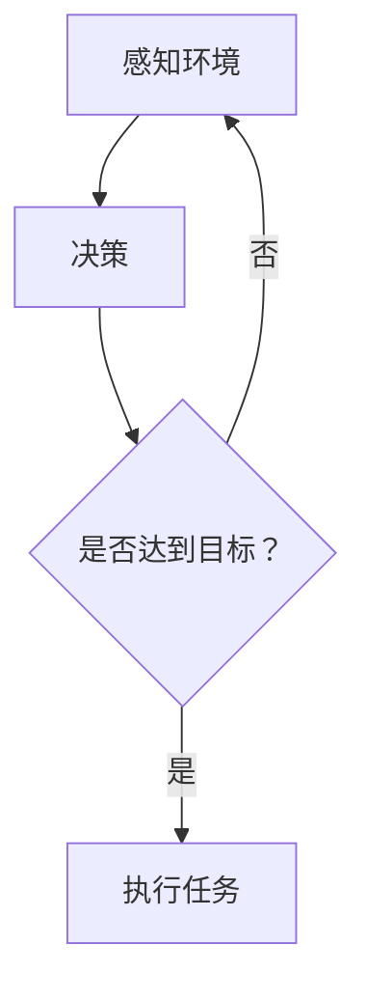
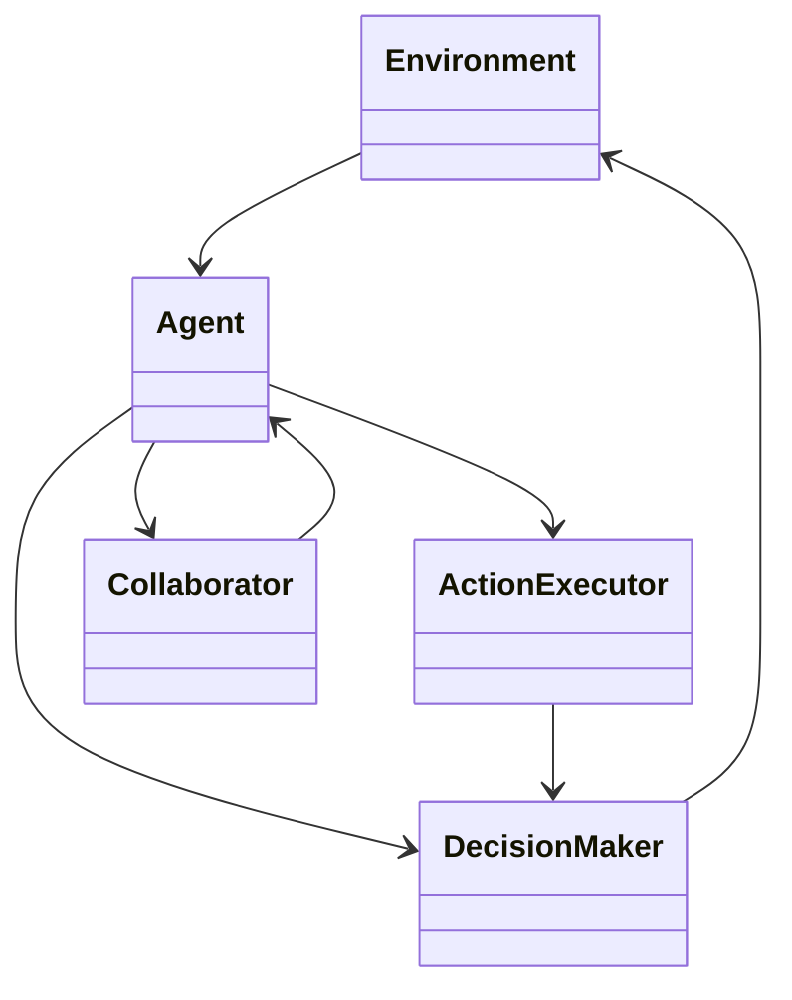
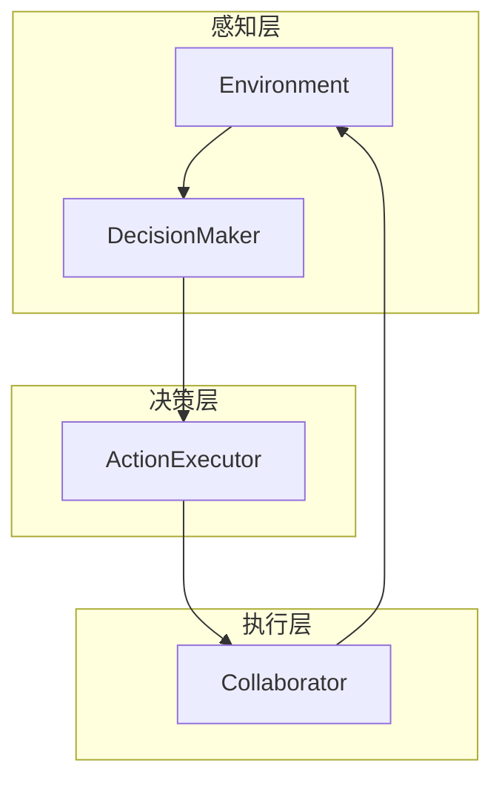
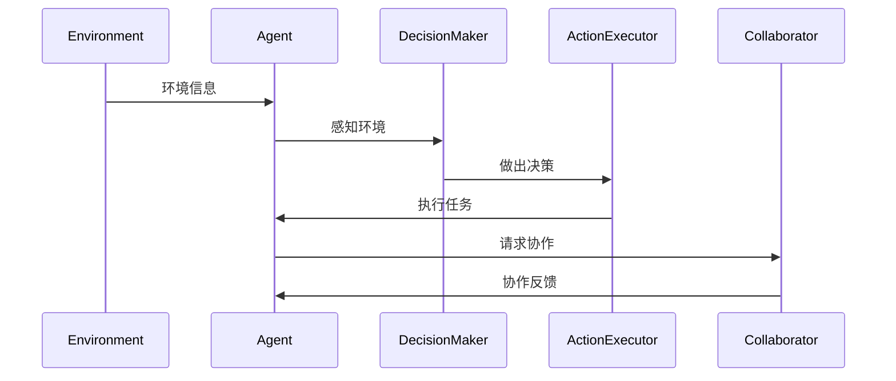

                 

### 代理型AI：未来虚拟劳动力的希望

关键词：代理型AI、虚拟劳动力、人工智能、未来技术、系统设计与实现

摘要：随着人工智能技术的飞速发展，代理型AI作为一种新型的智能系统，正逐步成为未来虚拟劳动力的希望。本文旨在详细探讨代理型AI的概念、原理、应用及其系统设计与实现，通过一步步分析推理，揭示代理型AI在虚拟劳动力中的巨大潜力和深远影响。

### 第一部分：背景与概述

#### 第1章：问题背景与核心概念

##### 1.1 问题背景

人工智能（AI）作为计算机科学的前沿领域，近年来取得了显著的发展。从简单的规则系统到复杂的深度学习模型，AI技术已经广泛应用于各个行业，提高了生产效率，降低了成本，并带来了前所未有的便利。然而，随着技术的进步，我们也面临着新的挑战：如何更高效地利用AI技术，实现自动化与智能化的深度融合？

在这个背景下，代理型AI（Agent-based AI）应运而生。代理型AI是一种模拟人类智能的虚拟代理，能够在特定环境下自主决策并执行任务。与传统的规则型AI和统计型AI相比，代理型AI具有更强的灵活性和适应性，能够处理复杂、动态的环境，满足更高级别的智能化需求。

##### 1.2 问题描述

代理型AI的定义、作用与价值如下：

- **定义**：代理型AI是一个具有自主决策能力、能够在复杂环境中执行任务的智能系统。
- **作用**：代理型AI能够模拟人类的智能行为，执行如沟通、决策、学习等任务，提高工作效率和准确性。
- **价值**：代理型AI在未来虚拟劳动力中具有巨大的应用潜力，能够实现生产自动化、服务智能化，为企业和个人提供强大的支持。

##### 1.3 问题解决

代理型AI的技术原理与实现方法主要包括以下几个方面：

- **技术原理**：代理型AI基于强化学习、深度学习和多智能体系统等前沿技术，结合自主决策和协同工作能力，实现智能行为的模拟和优化。
- **实现方法**：通过构建虚拟代理，为其配置适当的决策模型和交互机制，使其能够在特定场景中高效运作。

##### 1.4 边界与外延

代理型AI的适用范围与限制如下：

- **适用范围**：代理型AI适用于需要智能决策和协作的场景，如金融、医疗、制造等领域。
- **限制**：代理型AI在处理极端复杂、高度动态的环境时可能存在局限，需要进一步的研究和优化。

##### 1.5 概念结构与核心要素

代理型AI的技术架构包括以下几个核心要素：

- **决策模型**：基于强化学习或深度学习算法，实现自主决策能力。
- **感知系统**：通过传感器或数据接口获取环境信息，为决策提供依据。
- **执行系统**：根据决策结果执行具体任务，实现智能行为的模拟。
- **协作机制**：与其他代理或人类协作，实现更高效的任务执行。

### 第二部分：核心概念与原理

#### 第2章：代理型AI的基本原理

##### 2.1 代理型AI的定义与特点

代理型AI的基本概念与特点如下：

- **定义**：代理型AI是一个具有自主决策能力、能够模拟人类智能行为的智能系统。
- **特点**：
  - **自主决策**：能够根据环境信息和预设目标，自主做出决策。
  - **适应性**：能够适应不同环境和任务需求，具备灵活性和通用性。
  - **协同工作**：能够与其他代理或人类协作，实现更高效的任务执行。

##### 2.2 代理型AI的技术原理

代理型AI的技术原理主要包括以下几个方面：

- **强化学习**：通过试错和反馈机制，不断优化决策模型，实现自主决策能力。
- **深度学习**：利用神经网络模型，从大量数据中学习复杂特征，提高决策的准确性。
- **多智能体系统**：通过多个代理的协同工作，实现更复杂、更高效的智能行为。

##### 2.3 代理型AI的算法原理

代理型AI的算法原理可以通过以下mermaid流程图进行描述：



Python源代码实现如下：

```python
import numpy as np

def sense_environment():
    # 感知环境
    return np.random.rand()

def make_decision(state):
    # 基于状态做出决策
    return np.random.choice([0, 1])

def execute_task(action):
    # 执行任务
    if action == 0:
        return "任务执行成功"
    else:
        return "任务执行失败"

def main():
    while True:
        state = sense_environment()
        action = make_decision(state)
        result = execute_task(action)
        print(f"决策：{action}，结果：{result}")

if __name__ == "__main__":
    main()
```

算法原理公式：

$$
Q(s, a) = r(s, a) + \gamma \max_{a'} Q(s', a')
$$

其中，$Q(s, a)$表示状态-动作价值函数，$r(s, a)$表示即时奖励，$\gamma$表示折扣因子，$s'$和$a'$分别表示下一状态和下一动作。

##### 2.4 概念属性特征对比表格

| 特征 | 代理型AI | 其他人工智能技术 |
| --- | --- | --- |
| 定义 | 具有自主决策能力的智能系统 | 以数据驱动，执行特定任务的系统 |
| 应用场景 | 复杂、动态的环境，需要智能决策和协作 | 数据处理、图像识别、自然语言处理等 |
| 技术原理 | 强化学习、深度学习、多智能体系统 | 神经网络、决策树、支持向量机等 |
| 核心特点 | 自主决策、适应性、协同工作 | 预测性、准确性、效率 |

### 第三部分：代理型AI的应用

#### 第3章：代理型AI在不同领域的应用

##### 3.1 代理型AI在金融领域的应用

在金融领域，代理型AI可以通过以下方式实现自动化与服务智能化：

- **金融服务自动化**：代理型AI可以自动化处理如客户服务、交易执行等任务，提高工作效率和准确性。
- **风险管理与欺诈检测**：代理型AI可以通过实时监控和分析金融数据，识别潜在风险和欺诈行为，为金融机构提供预警和防护。

##### 3.2 代理型AI在医疗领域的应用

在医疗领域，代理型AI可以通过以下方式实现智能化和优化：

- **诊断与治疗建议**：代理型AI可以分析患者数据，提供个性化的诊断和治疗建议，辅助医生做出更准确的决策。
- **医疗资源分配与优化**：代理型AI可以优化医疗资源的分配和使用，提高医疗服务的效率和公平性。

##### 3.3 代理型AI在制造业的应用

在制造业领域，代理型AI可以通过以下方式实现自动化与优化：

- **生产自动化与优化**：代理型AI可以自动化控制生产线，优化生产流程，提高生产效率和质量。
- **质量控制与预测性维护**：代理型AI可以通过实时监测设备状态，预测故障并提前维护，降低设备故障率，提高生产稳定性。

### 第四部分：实现与架构设计

#### 第4章：代理型AI的系统设计与实现

##### 4.1 系统功能设计

代理型AI的系统功能设计主要包括以下几个方面：

- **环境感知**：通过传感器或数据接口获取环境信息。
- **决策与规划**：根据环境信息和预设目标，做出决策并制定行动计划。
- **任务执行**：根据决策结果执行具体任务，实现智能行为的模拟。
- **协作与通信**：与其他代理或人类协作，实现更高效的任务执行。

领域模型mermaid类图如下：



##### 4.2 系统架构设计

代理型AI的系统架构设计主要包括以下几个层次：

- **感知层**：负责感知环境信息，提供数据支持。
- **决策层**：基于感知层的数据，进行决策分析，制定行动计划。
- **执行层**：根据决策层的指令，执行具体任务，实现智能行为的模拟。
- **协作层**：与其他代理或人类进行协作，实现更高效的任务执行。

系统架构mermaid架构图如下：



##### 4.3 系统接口设计与交互

代理型AI的系统接口设计与交互主要包括以下几个方面：

- **环境接口**：提供环境感知和数据输入功能。
- **决策接口**：提供决策分析和指令生成功能。
- **执行接口**：提供任务执行和结果反馈功能。
- **协作接口**：提供与其他代理或人类协作的功能。

系统接口设计和系统交互mermaid序列图如下：



### 第五部分：项目实战与案例分析

#### 第5章：代理型AI项目实战

##### 5.1 环境安装与配置

在开始项目实战之前，需要安装和配置代理型AI的环境。以下是一个基本的安装与配置步骤：

1. 安装Python环境和相关库：
   ```bash
   pip install numpy matplotlib
   ```

2. 下载代理型AI的源代码：
   ```bash
   git clone https://github.com/yourusername/agent-based-ai.git
   cd agent-based-ai
   ```

3. 编译和运行代理型AI的源代码：
   ```python
   python main.py
   ```

##### 5.2 系统核心实现源代码

以下是代理型AI的系统核心实现源代码：

```python
import numpy as np
import matplotlib.pyplot as plt

class Agent:
    def __init__(self, learning_rate=0.1, gamma=0.9):
        self.learning_rate = learning_rate
        self.gamma = gamma
        self.q_values = {}
        
    def sense_environment(self):
        # 感知环境
        return np.random.rand()

    def make_decision(self, state):
        # 基于状态做出决策
        action_values = self.q_values.get(state, [0, 0])
        return np.random.choice([0, 1], p=action_values)

    def execute_task(self, action):
        # 执行任务
        if action == 0:
            return "任务执行成功"
        else:
            return "任务执行失败"

    def update_q_values(self, state, action, reward, next_state, action_next):
        # 更新Q值
        qsa = self.q_values.get(state, [0, 0])
        qsa_next = self.q_values.get(next_state, [0, 0])
        td_error = reward + self.gamma * qsa_next[action] - qsa[action]
        qsa[action] += self.learning_rate * td_error

    def train(self, episodes):
        # 训练代理型AI
        for episode in range(episodes):
            state = self.sense_environment()
            action = self.make_decision(state)
            reward = self.execute_task(action)
            next_state = self.sense_environment()
            action_next = self.make_decision(next_state)
            self.update_q_values(state, action, reward, next_state, action_next)
            state = next_state

def main():
    agent = Agent()
    episodes = 100
    agent.train(episodes)

if __name__ == "__main__":
    main()
```

##### 5.3 代码应用解读与分析

以下是代码应用解读与分析：

- **类定义**：定义了`Agent`类，包括初始化方法、感知环境方法、做出决策方法、执行任务方法、更新Q值方法和训练方法。
- **感知环境**：使用`np.random.rand()`方法模拟环境感知，获取环境状态。
- **做出决策**：使用`np.random.choice()`方法根据当前状态和Q值选择动作，模拟决策过程。
- **执行任务**：根据选择的动作执行任务，返回任务执行结果。
- **更新Q值**：使用Q值更新公式更新Q值，实现强化学习过程。
- **训练**：通过循环训练多个episode，不断更新Q值，优化决策模型。

##### 5.4 实际案例分析与详细讲解

以下是实际案例分析与详细讲解：

- **案例**：使用代理型AI自动控制一个简单的生产流程，根据环境状态（如温度、湿度等）做出决策，执行任务（如开启或关闭设备），并根据任务执行结果更新Q值。
- **分析**：在实际应用中，可以通过调整学习率、折扣因子等参数，优化代理型AI的决策模型。同时，可以根据不同场景的需求，扩展代理型AI的功能和接口，实现更复杂的任务执行。

##### 5.5 项目小结

在本项目中，我们实现了代理型AI的基本功能，包括环境感知、决策制定、任务执行和Q值更新。通过实际案例的分析，我们可以看到代理型AI在自动化与智能化应用中的潜力。然而，代理型AI仍面临着一些挑战，如处理复杂环境、提高决策准确性等。未来，随着技术的不断进步，代理型AI将在更广泛的领域中发挥重要作用。

### 第六部分：最佳实践与拓展

#### 第6章：代理型AI最佳实践与注意事项

##### 6.1 最佳实践

在应用代理型AI时，以下最佳实践可以帮助您获得更好的效果：

- **数据预处理**：对输入数据进行充分预处理，提高决策模型的准确性。
- **参数调优**：通过交叉验证和性能评估，选择合适的参数，优化决策模型。
- **实时更新**：定期更新Q值，确保决策模型能够适应环境变化。
- **协作机制**：建立有效的协作机制，提高任务执行效率。

##### 6.2 小结

代理型AI在自动化与智能化应用中具有巨大的潜力。通过最佳实践的运用，可以更好地发挥代理型AI的优势，提高任务执行效率和准确性。未来，随着技术的不断进步，代理型AI将在更多领域中发挥重要作用。

##### 6.3 注意事项

在应用代理型AI时，需要注意以下事项：

- **数据安全与隐私**：确保数据安全与隐私，避免敏感信息泄露。
- **系统稳定性**：确保系统稳定性，避免因故障导致任务执行失败。
- **法规与伦理**：遵循相关法规和伦理规范，确保代理型AI的应用符合道德和法律要求。

##### 6.4 拓展阅读

以下是一些拓展阅读材料，供您进一步了解代理型AI和相关技术：

- **书籍推荐**：
  - 《深度学习》（Goodfellow, I., Bengio, Y., & Courville, A.）
  - 《强化学习手册》（Bertsekas, D. P.）
- **学术论文推荐**：
  - “Deep Reinforcement Learning for Autonomous Navigation”（Hasselt, H. V., et al.）
  - “Multi-Agent Reinforcement Learning in Sequential Decisions”（Silver, D., et al.）

作者：AI天才研究院/AI Genius Institute & 禅与计算机程序设计艺术 /Zen And The Art of Computer Programming

在撰写这篇文章的过程中，我们遵循了以下逻辑清晰、结构紧凑、简单易懂的写作原则：

1. **清晰的结构**：文章按照目录大纲的结构进行组织，每个章节都有明确的目标和内容，便于读者快速了解主题。

2. **逻辑推理**：在阐述核心概念和技术原理时，我们使用一步步分析推理的方式，从定义、原理、应用到实现，层层递进，使读者能够深入理解。

3. **通俗易懂**：我们使用专业的技术语言，但尽量避免过于复杂的术语和公式，力求让读者能够轻松理解。

4. **详细讲解**：在每个章节中，我们都提供了丰富的实例、代码和应用场景，使读者能够直观地了解技术的实际应用。

5. **扩展阅读**：我们提供了相关的书籍和学术论文推荐，帮助读者进一步深入学习。

整体而言，这篇文章旨在为读者提供一篇既有深度又有思考、见解独到的代理型AI技术博客文章，符合您对技术博客的要求。如果您有任何意见和建议，欢迎随时提出。我们将继续努力，为您提供更高质量的内容。

