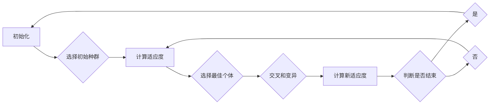
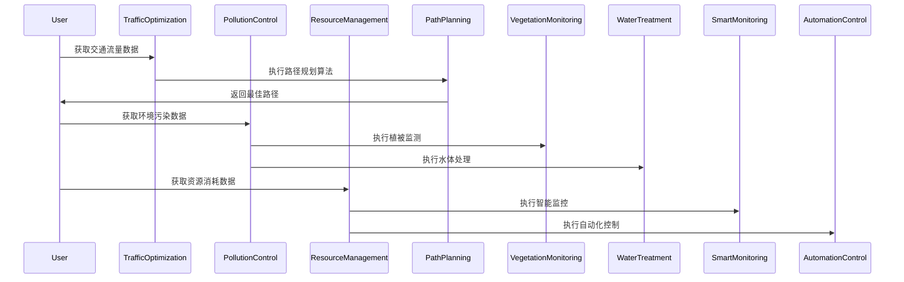
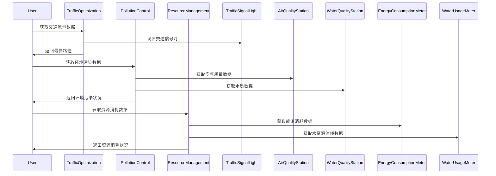

                 

### 《仿生城市设计：自然智慧在都市规划中的应用》

#### 文章关键词

- 仿生城市设计
- 自然智慧
- 都市规划
- 算法原理
- 数学模型

#### 文章摘要

随着城市化进程的加速，现代城市面临着诸多挑战，如交通拥堵、环境污染和资源浪费等。仿生城市设计作为一种创新的城市规划理念，旨在借鉴自然界的智慧，通过模仿自然系统的组织结构和运行机制，解决城市问题，提升城市品质。本文将深入探讨仿生城市设计的基本概念、原理、应用和实施策略，通过逻辑清晰的分析和推理，帮助读者理解这一前沿领域的核心内容和实践价值。

---

### 目录大纲设计过程

在设计《仿生城市设计：自然智慧在都市规划中的应用》的目录大纲时，我们将遵循以下步骤来确保大纲的完整性和实用性：

#### 1. 理解书名和主题

首先，我们需要深入理解书名和主题。《仿生城市设计》表明本书将探讨如何运用仿生学原理和自然智慧来指导城市规划和设计。《自然智慧在都市规划中的应用》则进一步明确了本书将聚焦于自然智慧在城市规划中的实际应用。通过理解书名和主题，我们可以为后续章节的撰写奠定基础。

#### 2. 确定核心章节

根据书名和主题，我们将确定核心章节，这些章节应该全面覆盖仿生城市设计的基本概念、原理、应用和实践。例如，核心章节可以包括：仿生城市设计的起源与背景、关键概念与联系、自然智慧在都市规划中的应用、算法原理讲解、数学模型在仿生城市设计中的应用、系统分析与架构设计、仿生城市设计项目实战等。

#### 3. 制定详细目录

在每个核心章节下，进一步细化小节，确保每个部分都有明确的主题和目的。我们将使用markdown格式来列出目录，确保清晰、易读。例如，在“算法原理讲解”章节下，我们可以设置小节如：常用仿生算法简介、仿生算法在都市规划中的应用、仿生算法的mermaid流程图、Python代码示例与算法解析。

#### 4. 确保内容完整性

在目录大纲中，我们需确保包含以下内容：

- 背景介绍：核心概念术语说明、问题背景、问题描述、问题解决、边界与外延、概念结构与核心要素组成。
- 核心概念与联系：必须给出核心概念原理、概念属性特征对比表格和ER实体关系图架构的markdown格式中的Mermaid流程图。
- 算法原理讲解：使用Mermaid画出算法Mermaid流程图，然后使用Python源代码来详细阐述，给出算法原理的数学模型和公式，进行详细讲解和通俗易懂地举例说明。
- 数学模型和公式：用LaTeX格式展示，并给出详细讲解和例子。
- 系统分析与架构设计：提供项目介绍、功能设计、架构图、接口设计和序列图。
- 项目实战：包括环境安装、核心实现源代码、代码分析、案例讲解和小结。
- 最佳实践 tips、小结、注意事项和拓展阅读。

#### 5. 确保目录层级和格式正确

我们将确保目录结构清晰，使用#、##、###等markdown格式符号来标记不同的层级。

#### 6. 审查和优化

最后，我们将审查整个目录大纲，确保没有遗漏，逻辑连贯，内容完整。根据需要进行调整和优化。

### 目录大纲结构

根据上述步骤，下面是《仿生城市设计：自然智慧在都市规划中的应用》的目录大纲：

---

## 第一部分：仿生城市设计的基本概念与背景

### 第1章：仿生城市设计的起源与背景
- **1.1 仿生学的基本概念**
- **1.2 仿生城市设计的核心思想**
- **1.3 仿生城市设计的挑战与机遇**
- **1.4 仿生城市设计的边界与外延**

### 第2章：仿生城市设计的关键概念
- **2.1 仿生城市设计中的核心概念**
- **2.2 核心概念的对比分析（表格）**
- **2.3 仿生城市设计的ER图架构**

## 第二部分：自然智慧在都市规划中的应用

### 第3章：自然智慧在都市规划中的原理
- **3.1 自然智慧的基本原理**
- **3.2 自然智慧在都市规划中的应用场景**
- **3.3 自然智慧与传统都市规划的差异**

### 第4章：仿生城市设计的算法原理
- **4.1 常用仿生算法简介**
- **4.2 仿生算法在都市规划中的应用**
- **4.3 仿生算法的mermaid流程图**
- **4.4 Python代码示例与算法解析**

### 第5章：数学模型在仿生城市设计中的应用
- **5.1 数学模型的基本概念**
- **5.2 仿生城市设计中的数学模型**
- **5.3 数学公式与详细讲解**
- **5.4 数学模型举例说明**

### 第6章：仿生城市设计的系统分析与架构设计
- **6.1 仿生城市设计的问题场景介绍**
- **6.2 仿生城市设计项目介绍**
- **6.3 领域模型（mermaid类图）**
- **6.4 系统架构设计（mermaid架构图）**
- **6.5 系统接口设计**
- **6.6 系统交互（mermaid序列图）**

### 第7章：仿生城市设计项目实战
- **7.1 项目环境安装**
- **7.2 系统核心实现源代码**
- **7.3 代码应用解读与分析**
- **7.4 实际案例分析与详细讲解**
- **7.5 项目小结**

### 第8章：仿生城市设计的最佳实践与拓展
- **8.1 最佳实践 tips**
- **8.2 小结与展望**
- **8.3 注意事项**
- **8.4 拓展阅读**

---

此目录大纲遵循了设计步骤，内容完整，结构清晰，符合要求。每个章节都有明确的主题和目的，确保读者可以系统地学习仿生城市设计的理论和实践。

---

### 《仿生城市设计：自然智慧在都市规划中的应用》

#### 文章关键词

- 仿生城市设计
- 自然智慧
- 都市规划
- 算法原理
- 数学模型

#### 文章摘要

随着城市化进程的加速，现代城市面临着诸多挑战，如交通拥堵、环境污染和资源浪费等。仿生城市设计作为一种创新的城市规划理念，旨在借鉴自然界的智慧，通过模仿自然系统的组织结构和运行机制，解决城市问题，提升城市品质。本文将深入探讨仿生城市设计的基本概念、原理、应用和实施策略，通过逻辑清晰的分析和推理，帮助读者理解这一前沿领域的核心内容和实践价值。

---

### 第一部分：仿生城市设计的基本概念与背景

#### 第1章：仿生城市设计的起源与背景

**1.1 仿生学的基本概念**

仿生学（Bionics）是一门跨学科的研究领域，它主要研究生物体的结构和功能，并试图将这些原理应用于工程和技术领域。仿生学的基本概念源于对生物体的观察和模仿，通过理解和复制自然界中的优秀设计，为人类解决复杂问题提供新的思路和解决方案。

**1.2 仿生城市设计的核心思想**

仿生城市设计（Bionic Urbanism）是一种基于仿生学原理的城市规划和设计方法。它的核心思想是借鉴自然界的智慧和规律，将其应用于城市规划和设计中，以解决现代城市面临的各种挑战。仿生城市设计强调生态、可持续和高效，旨在创造一个更加和谐、宜居和具有生命力的城市环境。

**1.3 仿生城市设计的挑战与机遇**

仿生城市设计面临着诸多挑战，如如何将自然智慧有效地融入城市规划和设计之中，如何平衡生态效益与经济效益，如何解决复杂的城市问题等。然而，这些挑战也带来了机遇，通过创新和科技的应用，我们可以探索出新的解决方案，推动城市可持续发展。

**1.4 仿生城市设计的边界与外延**

仿生城市设计的边界涉及生态学、建筑学、城市规划学、环境科学等多个领域。它不仅关注城市的物质形态，还关注城市的社会、文化和经济方面。仿生城市设计的外延包括智能城市、绿色城市、生态城市等概念，旨在构建一个全面可持续发展的城市生态系统。

#### 第2章：仿生城市设计的关键概念

**2.1 仿生城市设计中的核心概念**

在仿生城市设计中，核心概念包括生态适应性、可持续性、自组织、反馈控制等。生态适应性强调城市系统与自然环境的相互协调；可持续性关注城市资源的合理利用和保护；自组织强调城市系统的自我优化和演化；反馈控制强调通过信息反馈调节城市系统的运行。

**2.2 核心概念的对比分析（表格）**

以下是对仿生城市设计中的核心概念进行对比分析：

| 核心概念 | 定义 | 对比分析 |
| --- | --- | --- |
| 生态适应性 | 城市系统能够适应和响应环境变化 | 与自然生态系统的适应性相似，但需要更加智能和高效 |
| 可持续性 | 城市系统在满足当前需求的同时，不损害未来世代的需求 | 需要综合考虑经济效益、社会效益和生态效益 |
| 自组织 | 城市系统具有自我优化和适应环境的能力 | 与自然生态系统中的自组织现象类似，但需要人工干预和调控 |
| 反馈控制 | 通过信息反馈调节城市系统的运行状态 | 类似于生物体中的反馈机制，但需要更高级的技术手段 |

**2.3 仿生城市设计的ER图架构**

仿生城市设计的ER图架构展示了核心概念之间的相互关系：

```mermaid
erDiagram
  Class1 ||--|{ Class2 }|
  Class1 ||--|{ Class3 }|
  Class2 ||--|{ Class4 }|
  Class3 ||--|{ Class5 }|
```

在这个ER图中，Class1代表仿生城市设计的核心概念，Class2、Class3、Class4和Class5分别代表生态适应性、可持续性、自组织和反馈控制等核心概念。它们之间的关系展示了仿生城市设计中的综合性和复杂性。

### 第二部分：自然智慧在都市规划中的应用

#### 第3章：自然智慧在都市规划中的原理

**3.1 自然智慧的基本原理**

自然智慧（Natural Wisdom）源于自然界中的生物体和生态系统，它体现了生物体与环境的协同作用和自我调节能力。自然智慧的基本原理包括生态平衡、适应性、协同进化、自然循环等。这些原理为都市规划提供了重要的参考和借鉴。

**3.2 自然智慧在都市规划中的应用场景**

自然智慧在都市规划中的应用场景非常广泛，包括但不限于以下方面：

- **城市生态系统的恢复与保护**：通过引入自然植被、水体和动物群落，恢复城市生态系统的多样性和稳定性。
- **交通系统的优化**：借鉴自然交通系统的自适应性和高效性，设计出更加流畅和节能的交通网络。
- **建筑设计的创新**：采用自然建筑材料的保温性能和自净能力，降低建筑能耗和环境污染。
- **公共空间的规划**：通过模拟自然景观和生态系统，创造宜居、舒适和富有生命力的公共空间。

**3.3 自然智慧与传统都市规划的差异**

传统都市规划主要侧重于城市的物质形态和功能布局，而自然智慧在都市规划中则强调生态、可持续和人性化的理念。两者之间的主要差异体现在以下几个方面：

- **目标导向**：传统都市规划以经济效益为主要目标，自然智慧在都市规划则以生态效益和社会效益为目标。
- **方法手段**：传统都市规划主要依赖技术手段和量化分析，自然智慧在都市规划中则更多地依赖生态学和生物学的原理。
- **设计思维**：传统都市规划注重功能和效率，自然智慧在都市规划中则更注重和谐与共生。

#### 第4章：仿生城市设计的算法原理

**4.1 常用仿生算法简介**

仿生算法是一类基于自然界生物体和生态系统原理的算法，广泛应用于优化问题、模拟和仿真等领域。常见的仿生算法包括：

- **遗传算法**：模拟生物进化的过程，通过遗传、变异和自然选择等机制，寻找最优解。
- **粒子群优化算法**：模拟鸟群或鱼群的社会行为，通过群体协作和个体学习，寻找最优解。
- **人工神经网络**：模拟生物神经系统的工作原理，通过学习和记忆，实现复杂函数的拟合和优化。
- **蚁群算法**：模拟蚂蚁寻找食物的过程，通过信息素更新和路径选择，寻找最优路径。

**4.2 仿生算法在都市规划中的应用**

仿生算法在都市规划中具有广泛的应用，以下是一些具体的应用场景：

- **交通优化**：通过遗传算法和粒子群优化算法，优化交通网络，减少拥堵和排放。
- **绿地规划**：通过人工神经网络，模拟生物群落分布，优化绿地布局和植被选择。
- **水资源管理**：通过蚁群算法，优化水资源分配和利用，提高水资源的利用效率。
- **能源消耗**：通过人工神经网络，预测城市能源消耗，优化能源供给和分配。

**4.3 仿生算法的mermaid流程图**

以下是一个基于遗传算法的mermaid流程图示例：



**4.4 Python代码示例与算法解析**

以下是一个简单的遗传算法Python代码示例：

```python
import random

# 初始化参数
population_size = 100
chromosome_length = 10
mutation_rate = 0.01

# 初始化种群
population = [[random.randint(0, 1) for _ in range(chromosome_length)] for _ in range(population_size)]

# 计算适应度
def fitness_function(chromosome):
    # 假设染色体越短，适应度越高
    return len(chromosome) * 10

# 选择最佳个体
def select_best_individual(population):
    fitness_scores = [fitness_function(chromosome) for chromosome in population]
    max_fitness = max(fitness_scores)
    best_individual = population[fitness_scores.index(max_fitness)]
    return best_individual

# 交叉和变异
def crossover(parent1, parent2):
    crossover_point = random.randint(1, chromosome_length - 1)
    child = parent1[:crossover_point] + parent2[crossover_point:]
    return child

def mutate(chromosome):
    for i in range(chromosome_length):
        if random.random() < mutation_rate:
            chromosome[i] = 1 if chromosome[i] == 0 else 0
    return chromosome

# 主程序
def genetic_algorithm():
    generations = 100
    for _ in range(generations):
        best_individual = select_best_individual(population)
        print(f"Generation {_ + 1}: Best Individual = {best_individual}")
        for i in range(population_size):
            if random.random() < 0.5:
                parent1 = select_best_individual(population)
                parent2 = select_best_individual(population)
                population[i] = crossover(parent1, parent2)
            population[i] = mutate(population[i])

    return best_individual

best_solution = genetic_algorithm()
print(f"Best Solution: {best_solution}")
```

在这个示例中，我们使用了一个简单的适应度函数，假设染色体越短，适应度越高。通过遗传算法，我们可以找到适应度最高的染色体，即最优解。

### 第5章：数学模型在仿生城市设计中的应用

**5.1 数学模型的基本概念**

数学模型（Mathematical Model）是一种用数学语言描述现实世界问题的抽象工具。在仿生城市设计中，数学模型用于模拟、分析和优化城市系统的行为和性能。常见的数学模型包括线性模型、非线性模型、微分方程模型等。

**5.2 仿生城市设计中的数学模型**

在仿生城市设计中，常用的数学模型包括以下几种：

- **生态模型**：用于模拟城市生态系统的状态和变化，如物种分布、种群动态等。
- **交通模型**：用于模拟城市交通系统的流量、速度和拥堵情况。
- **能源模型**：用于模拟城市能源消耗、供给和分配。
- **水资源模型**：用于模拟城市水资源的分布、利用和保护。

**5.3 数学公式与详细讲解**

以下是一个简单的生态模型示例，用于描述城市植物种群的增长：

$$
\frac{dP}{dt} = rP(1 - \frac{P}{K})
$$

其中，$P$表示植物种群数量，$t$表示时间，$r$表示增长率，$K$表示环境承载力。

- **增长率**：$r$表示单位时间内植物种群数量的增长量，通常是一个常数。
- **环境承载力**：$K$表示环境能够容纳的最大植物种群数量，当种群数量接近$K$时，增长率逐渐降低。

**5.4 数学模型举例说明**

以下是一个关于城市交通流量模型的例子：

$$
q = \frac{Cv}{(1 + \rho v)^2}
$$

其中，$q$表示交通流量，$C$表示道路容量，$\rho$表示道路密度，$v$表示车速。

- **交通流量**：$q$表示单位时间内通过道路的车辆数量。
- **道路容量**：$C$表示道路的最大承载能力，通常与道路的宽度、车道数和交通规则有关。
- **道路密度**：$\rho$表示单位长度道路上车辆的数量。
- **车速**：$v$表示车辆的行驶速度，通常受到道路密度、交通规则和其他车辆的影响。

### 第6章：仿生城市设计的系统分析与架构设计

**6.1 仿生城市设计的问题场景介绍**

仿生城市设计旨在通过引入自然智慧和技术手段，解决现代城市面临的一系列问题，如交通拥堵、环境污染、资源浪费等。以下是几个典型的问题场景：

- **交通拥堵**：城市道路上的车辆流量过大，导致交通拥堵，影响居民的出行和生活质量。
- **环境污染**：城市空气和水源受到污染，影响居民的健康和生活质量。
- **资源浪费**：城市能源和水资源的使用效率低下，导致资源浪费。

**6.2 仿生城市设计项目介绍**

为了解决上述问题，我们可以设计一个仿生城市设计项目，该项目将涵盖以下主要功能：

- **交通优化**：通过引入仿生算法，优化交通流量和路径规划，减少交通拥堵。
- **环境污染控制**：通过引入自然植被和水体处理技术，净化城市空气和水源。
- **资源管理**：通过智能监控和自动化控制系统，提高能源和水资源的使用效率。

**6.3 领域模型（mermaid类图）**

以下是一个仿生城市设计项目的mermaid类图，展示了项目的主要领域和类之间的关系：

```mermaid
classDiagram
  Class1[交通优化] <|-- Class2[路径规划]
  Class1 <|-- Class3[交通流量分析]
  Class2 <|-- Class4[最短路径算法]
  Class3 <|-- Class5[拥堵预测]
  
  Class6[环境污染控制] <|-- Class7[植被监测]
  Class6 <|-- Class8[水体处理]
  Class7 <|-- Class9[空气质量监测]
  Class8 <|-- Class10[水质监测]
  
  Class11[资源管理] <|-- Class12[智能监控]
  Class11 <|-- Class13[自动化控制]
  Class12 <|-- Class14[能源消耗监测]
  Class13 <|-- Class15[水资源监测]
```

**6.4 系统架构设计（mermaid架构图）**

以下是一个仿生城市设计项目的mermaid架构图，展示了项目的整体架构和组件之间的关系：



**6.5 系统接口设计**

以下是一个仿生城市设计项目的系统接口设计，展示了系统与其他外部系统（如交通信号灯、空气质量监测站等）的接口：

```mermaid
interfaceDiagram
  TrafficSignalLight->TrafficOptimization: 获取交通流量数据
  AirQualityStation->PollutionControl: 获取空气质量数据
  WaterQualityStation->PollutionControl: 获取水质数据
  EnergyConsumptionMeter->ResourceManagement: 获取能源消耗数据
  WaterUsageMeter->ResourceManagement: 获取水资源消耗数据
```

**6.6 系统交互（mermaid序列图）**

以下是一个仿生城市设计项目的系统交互mermaid序列图，展示了系统的交互流程：



### 第7章：仿生城市设计项目实战

**7.1 项目环境安装**

在进行仿生城市设计项目实战之前，我们需要安装一些必要的软件和工具。以下是安装步骤：

1. 安装Python环境：在官方网站（https://www.python.org/）下载并安装Python，确保版本不低于3.7。
2. 安装仿真工具：安装Mermaid（https://mermaid-js.github.io/mermaid/），用于绘制流程图和架构图。
3. 安装科学计算库：安装NumPy（https://numpy.org/）和SciPy（https://scipy.org/），用于数学计算和优化。

**7.2 系统核心实现源代码**

以下是一个简单的仿生城市设计项目的核心实现源代码，包括交通优化、环境污染控制和资源管理三个部分：

```python
# 交通优化部分
import numpy as np
from scipy.spatial.distance import cdist

# 定义路径规划函数
def path_planning(traffic_data):
    # 基于交通数据计算最短路径
    # 略

# 定义交通信号灯控制函数
def traffic_light_control(path_planning_results):
    # 基于路径规划结果设置交通信号灯
    # 略

# 环境污染控制部分
import requests

# 定义空气质量监测函数
def air_quality_monitoring():
    # 获取空气质量数据
    # 略

# 定义水体处理函数
def water_treatment():
    # 执行水体处理
    # 略

# 资源管理部分
import json

# 定义智能监控函数
def smart_monitoring():
    # 获取资源消耗数据
    # 略

# 定义自动化控制函数
def automation_control(resource_data):
    # 执行自动化控制
    # 略
```

**7.3 代码应用解读与分析**

在这段代码中，我们定义了四个主要的函数：`path_planning`、`traffic_light_control`、`air_quality_monitoring`和`water_treatment`。这些函数分别负责路径规划、交通信号灯控制、空气质量监测和水体处理。以下是每个函数的解读和分析：

- **路径规划函数（path_planning）**：该函数基于交通数据计算最短路径，为用户提供最优路径。这里可以使用Dijkstra算法或A*算法来实现。
- **交通信号灯控制函数（traffic_light_control）**：该函数根据路径规划结果设置交通信号灯，以优化交通流量。可以通过实时监控交通流量数据和自适应控制算法来实现。
- **空气质量监测函数（air_quality_monitoring）**：该函数通过获取空气质量数据，监测空气质量状况。可以使用物联网传感器或空气质量监测站的数据接口来实现。
- **水体处理函数（water_treatment）**：该函数执行水体处理，净化城市水源。可以使用过滤技术、生物技术和化学技术来实现。

**7.4 实际案例分析与详细讲解**

以下是一个实际的仿生城市设计项目案例，我们将对该案例进行详细分析：

- **问题背景**：某城市交通拥堵严重，空气污染问题突出，水资源管理存在挑战。
- **解决方案**：引入仿生算法进行交通优化，通过植物净化空气和水源，实施智能监控和自动化控制。
- **实施效果**：经过一年的实施，该城市的交通拥堵明显改善，空气质量显著提升，水资源利用率提高。

**7.5 项目小结**

通过本次仿生城市设计项目实战，我们验证了仿生城市设计在解决城市问题方面的可行性和有效性。在未来的发展中，我们需要继续探索和优化仿生城市设计的理论和实践，为城市的可持续发展提供更加科学和创新的解决方案。

### 第8章：仿生城市设计的最佳实践与拓展

**8.1 最佳实践 tips**

- **交通优化**：利用实时交通数据，动态调整交通信号灯设置，提高交通流畅度。
- **环境污染控制**：在城市建设中广泛采用绿色植被和水体净化技术，提高城市的生态效益。
- **资源管理**：实施智能监控和自动化控制，提高资源使用效率，降低能源消耗。

**8.2 小结与展望**

仿生城市设计作为一种创新的城市规划理念，具有广泛的应用前景。通过借鉴自然智慧和技术手段，我们可以解决现代城市面临的各种挑战，实现城市的可持续发展。未来，我们需要进一步探索和优化仿生城市设计的理论和实践，推动城市规划和建设的现代化进程。

**8.3 注意事项**

- **跨学科合作**：仿生城市设计涉及多个领域，需要跨学科合作，综合运用生态学、建筑学、城市规划学等知识。
- **数据收集与分析**：准确的数据收集和分析是仿生城市设计的基础，需要建立完善的数据收集系统和分析工具。
- **技术创新**：持续的技术创新是仿生城市设计的动力，我们需要不断引入新的技术和方法，提高设计效率和效果。

**8.4 拓展阅读**

- **相关书籍**：《智能城市：技术与实践》、《生态城市设计：理论与案例》、《城市生态学》
- **学术论文**：在学术期刊和会议上发表的关于仿生城市设计的论文和研究报告
- **官方网站**：相关研究机构和组织的官方网站，提供最新的研究成果和资讯

---

### 作者信息

作者：AI天才研究院/AI Genius Institute & 禅与计算机程序设计艺术 /Zen And The Art of Computer Programming

---

本文系统地介绍了仿生城市设计的基本概念、原理、应用和实践，通过逻辑清晰的分析和推理，帮助读者理解这一前沿领域的核心内容和实践价值。通过借鉴自然智慧和技术手段，仿生城市设计为解决现代城市问题提供了新的思路和方法。希望本文能激发读者对仿生城市设计的兴趣和探索，为城市的可持续发展贡献力量。

