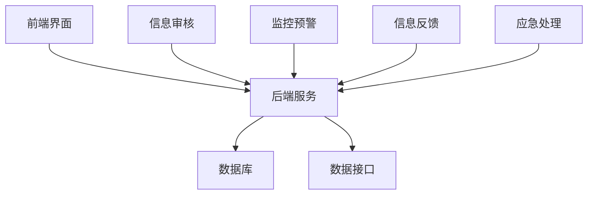
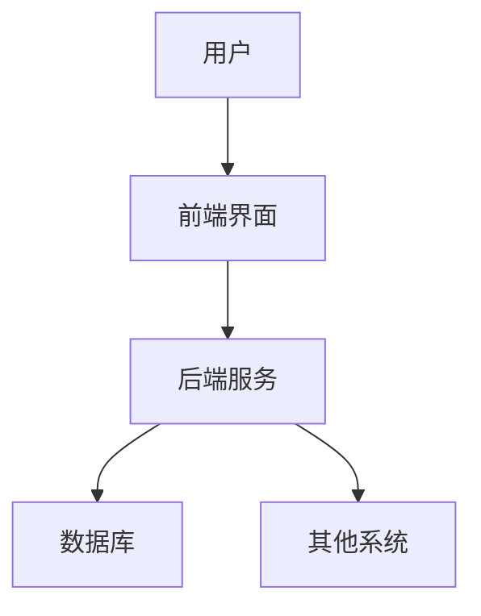

                 

### 引言：企业内部虚假信息问题的严峻挑战

#### 1.1 问题背景

**1.1.1 虚假信息的定义与类型**

虚假信息，亦称假消息或谣言，是指在特定环境下，通过文字、图片、视频等形式传播的，与事实不符或误导性的信息。在企业内部，虚假信息可以大致分为以下几类：

- **误导性报告**：员工提交的报告或数据不准确，可能夸大或缩小实际情况，导致管理层做出错误的决策。
- **欺诈性信息**：员工或外部人员故意传播虚假财务数据、项目进展等，以谋取不正当利益。
- **谣言**：关于企业内部人事变动、政策变动、薪酬福利等方面的不实言论，可能导致员工恐慌、士气低落。
- **恶意攻击**：竞争对手或内部恶意分子发布的旨在损害企业声誉的信息。

**1.1.2 虚假信息在企业中的影响**

虚假信息在企业中可能产生以下负面影响：

- **决策失误**：基于虚假信息做出的决策可能会导致企业资源浪费、市场机会错失。
- **员工信任度降低**：频繁的虚假信息传播会降低员工对管理层和企业文化的信任度。
- **企业形象受损**：外部虚假信息一旦被证实，会严重影响企业的声誉和市场地位。
- **法律风险**：在涉及财务报表、合同等法律文件中的虚假信息，可能带来法律诉讼和罚款。

**1.1.3 问题的现状与趋势**

当前，随着互联网和社交媒体的普及，虚假信息传播的速度和范围都在不断扩大。企业面临的虚假信息挑战呈现以下趋势：

- **技术手段复杂化**：虚假信息的制造和传播手段越来越复杂，从简单的文字和图片，发展到使用人工智能技术生成逼真的伪造内容。
- **社会舆论压力**：公众对企业内部虚假信息的关注度提高，企业需要更加透明和负责任地处理相关信息。
- **法律法规完善**：随着虚假信息问题的日益严重，各国政府正在完善相关法律法规，以规范企业行为。

#### 1.2 问题的解决思路与目标

**1.2.1 防控体系的构建目标**

构建企业内部虚假信息防控体系的目标包括：

- **提高信息真实性**：确保企业内部信息透明、准确，减少虚假信息的传播。
- **增强决策可靠性**：通过有效的防控措施，提高决策过程中的信息质量，避免因虚假信息导致的错误决策。
- **保护企业声誉**：及时识别和应对虚假信息，防止损害企业声誉的事件发生。
- **维护员工信任**：通过透明的信息传播和应对机制，增强员工对企业的信任。

**1.2.2 防控体系的关键要素**

防控体系的核心要素包括：

- **信息审核机制**：建立信息发布审核制度，确保发布的信息真实、准确。
- **监控与警报系统**：实时监控企业内部和外部信息渠道，及时发现和报警虚假信息。
- **应急预案**：制定应对虚假信息的应急预案，确保在紧急情况下能够迅速反应。
- **培训与教育**：加强员工的信息安全意识和技能培训，提高全员对虚假信息的识别和应对能力。

**1.2.3 防控体系的实施步骤**

构建虚假信息防控体系一般分为以下几个步骤：

- **需求分析**：明确企业内部虚假信息防控的需求和目标。
- **方案设计**：根据需求分析，设计具体的防控方案，包括技术手段、流程制度等。
- **技术实现**：根据方案设计，实现信息审核、监控、警报等关键技术。
- **人员培训**：组织培训，提高员工对虚假信息的识别和应对能力。
- **试运行与优化**：在试运行阶段，根据反馈不断优化防控体系，确保其有效性和适用性。

**1.3 边界与外延**

**1.3.1 虚假信息的防控边界**

虚假信息防控体系需要明确以下边界：

- **信息范围**：防控体系适用于企业内部的所有信息渠道，包括内部邮件、企业内部网、社交媒体等。
- **责任划分**：明确各部门在防控虚假信息中的责任，确保责任到人。
- **外部互动**：防控体系应考虑与外部监管机构、合作伙伴的信息互动，确保信息传递的准确性和合规性。

**1.3.2 相关法律法规与标准**

虚假信息防控需要遵循以下法律法规和标准：

- **国家法律法规**：如《中华人民共和国网络安全法》、《中华人民共和国反不正当竞争法》等。
- **行业规范**：如金融行业的《金融信息安全标准》、互联网行业的《互联网信息服务管理办法》等。
- **内部规章制度**：企业应根据自身实际情况，制定相应的内部规章制度，如《信息发布管理办法》、《网络安全管理制度》等。

**1.3.3 跨部门协同机制**

虚假信息防控涉及多个部门，需要建立跨部门协同机制：

- **协作平台**：建立信息共享平台，确保各部门之间信息流通顺畅。
- **沟通渠道**：明确跨部门沟通渠道，确保信息传递的及时性和准确性。
- **联合行动**：在遇到虚假信息问题时，各部门应联合行动，共同应对。

#### 1.4 本书结构安排与内容概述

**1.4.1 内容结构设计**

本书内容结构设计如下：

- **引言**：介绍企业内部虚假信息问题的严峻挑战、解决思路与目标。
- **理论基础**：详细讨论虚假信息识别与检测技术，包括机器学习、深度学习和聚类分类算法等。
- **实战应用**：通过具体案例，展示虚假信息防控体系的实际应用和效果。
- **优化策略**：探讨虚假信息防控体系的优化策略和最佳实践。

**1.4.2 阅读指南**

本书旨在为企业提供一套完整的虚假信息防控体系构建指南。读者可以按照以下指南进行阅读：

- **理解背景**：首先了解企业内部虚假信息问题的严峻挑战，明确防控体系的目标和关键要素。
- **学习技术**：掌握虚假信息识别与检测技术，包括机器学习、深度学习和聚类分类算法等。
- **实践应用**：通过具体案例，了解虚假信息防控体系的实际应用和效果。
- **优化策略**：探讨虚假信息防控体系的优化策略和最佳实践，提高防控效果。

**1.4.3 拓展阅读与资源**

本书提供以下拓展阅读与资源，帮助读者进一步了解虚假信息防控领域：

- **参考文献**：推荐相关书籍、论文和研究报告，供读者深入研究。
- **在线课程**：推荐相关在线课程和培训资源，帮助读者系统学习虚假信息防控知识。
- **案例研究**：分享其他企业的成功案例，提供实战经验和教训。
- **论坛和社群**：介绍相关的论坛和社群，供读者交流心得和经验。

### 第二部分：虚假信息防控体系的理论基础

虚假信息防控体系的理论基础主要包括虚假信息的识别与检测技术。这些技术旨在通过算法和模型，自动识别和检测出企业内部和外部的虚假信息，从而有效防止其传播和影响。以下将详细探讨这些技术，并分析其原理和应用。

#### 2.1 虚假信息识别技术概述

虚假信息识别技术是指通过算法模型，从大量的信息中识别出虚假信息的方法。这些技术主要包括：

**1. 机器学习方法**  
机器学习方法通过训练模型，使其能够自动识别虚假信息。常见的机器学习方法包括：

- **支持向量机（SVM）**：通过找到一个最优的超平面，将虚假信息与非虚假信息分开。
- **决策树**：通过一系列的规则，将数据逐步划分，直到达到分类的终止条件。
- **随机森林**：通过构建多个决策树，并通过投票的方式得出最终结果。

**2. 深度学习方法**  
深度学习方法通过多层神经网络，自动提取特征并识别虚假信息。常见的深度学习方法包括：

- **卷积神经网络（CNN）**：通过卷积操作提取图像特征，适用于图像和视频内容的虚假信息识别。
- **循环神经网络（RNN）**：通过循环结构处理序列数据，适用于文本内容的虚假信息识别。
- **长短时记忆网络（LSTM）**：RNN的改进版本，能够更好地处理长序列数据。

**3. 聚类与分类算法**  
聚类与分类算法通过将数据分组，识别出潜在的虚假信息。常见的聚类与分类算法包括：

- **K-均值聚类**：通过迭代算法，将数据分为K个聚类中心，并不断更新聚类中心。
- **层次聚类**：通过自底向上的合并方式，将相似的数据合并成更大的簇。

#### 2.2 虚假信息检测算法原理

虚假信息检测算法的原理主要基于机器学习和深度学习模型。以下将详细解释这些算法的基本原理。

**2.2.1 机器学习算法**

**1. 支持向量机（SVM）**

SVM通过最大化分类间隔，将数据分为不同的类别。其数学模型可以表示为：

$$
\max_{\boldsymbol{w}, b} \frac{1}{2} ||\boldsymbol{w}||^2 \quad s.t. \quad y_i (\boldsymbol{w} \cdot \boldsymbol{x_i} + b) \geq 1
$$

其中，$\boldsymbol{w}$ 和 $b$ 分别为超平面参数和偏置，$\boldsymbol{x_i}$ 和 $y_i$ 分别为数据和类别标签。

**2. 决策树**

决策树通过一系列的规则，将数据划分为不同的区域，直到每个区域内的数据都是同一类别。其基本结构可以用下图表示：


**3. 随机森林**

随机森林是通过构建多个决策树，并通过投票得出最终结果。每个决策树都是随机地从特征集合中选取一部分特征进行划分。其数学模型可以表示为：

$$
f(\boldsymbol{x}) = \sum_{i=1}^{n} w_i t_i(\boldsymbol{x}) 
$$

其中，$w_i$ 为决策树的权重，$t_i(\boldsymbol{x})$ 为第 $i$ 棵决策树的分类结果。

**2.2.2 深度学习算法**

**1. 卷积神经网络（CNN）**

CNN通过卷积操作提取图像特征。其基本结构可以用下图表示：


卷积操作的数学模型可以表示为：

$$
h_i^l = \sum_{j=1}^{K} w_{ji}^l * a_{j}^{l-1} + b_i^l
$$

其中，$h_i^l$ 和 $a_j^{l-1}$ 分别为第 $l$ 层第 $i$ 个神经元和第 $l-1$ 层第 $j$ 个神经元的激活值，$w_{ji}^l$ 和 $b_i^l$ 分别为连接权重和偏置。

**2. 循环神经网络（RNN）**

RNN通过循环结构处理序列数据。其基本结构可以用下图表示：


RNN的数学模型可以表示为：

$$
h_t = \sigma(W_h h_{t-1} + W_x x_t + b_h)
$$

其中，$h_t$ 为第 $t$ 个时间步的隐藏状态，$x_t$ 为第 $t$ 个输入，$W_h$ 和 $W_x$ 分别为权重矩阵，$b_h$ 为偏置。

**3. 长短时记忆网络（LSTM）**

LSTM是RNN的改进版本，能够更好地处理长序列数据。其基本结构可以用下图表示：


LSTM的数学模型可以表示为：

$$
\begin{align*}
i_t &= \sigma(W_{ix} x_t + W_{ih} h_{t-1} + b_i) \\
f_t &= \sigma(W_{fx} x_t + W_{fh} h_{t-1} + b_f) \\
o_t &= \sigma(W_{ox} x_t + W_{oh} h_{t-1} + b_o) \\
c_t &= f_t \odot c_{t-1} + i_t \odot \sigma(W_{cx} x_t + W_{ch} h_{t-1} + b_c) \\
h_t &= o_t \odot \sigma(c_t)
\end{align*}
$$

其中，$i_t$、$f_t$、$o_t$ 和 $c_t$ 分别为输入门、遗忘门、输出门和细胞状态，$\odot$ 表示逐元素乘法操作。

**2.2.3 聚类与分类算法在虚假信息检测中的应用**

**1. K-均值聚类**

K-均值聚类通过迭代算法，将数据分为K个聚类中心。其数学模型可以表示为：

$$
\begin{align*}
\mu_k^{new} &= \frac{1}{N_k} \sum_{i=1}^{N} x_i \\
x_i &= \mu_k^{new} + \epsilon_i \\
\epsilon_i &\sim N(0, \sigma^2)
\end{align*}
$$

其中，$\mu_k^{new}$ 和 $\mu_k$ 分别为新的聚类中心和当前的聚类中心，$x_i$ 为第 $i$ 个数据点，$\epsilon_i$ 为随机误差。

**2. 层次聚类**

层次聚类通过自底向上的合并方式，将相似的数据合并成更大的簇。其基本步骤如下：

- **初始阶段**：将每个数据点视为一个簇，计算簇间距离，选择距离最近的两个簇进行合并。
- **迭代阶段**：重复合并过程，直到达到指定的簇数或合并距离小于阈值。

#### 2.3 虚假信息检测模型实例

以下通过具体实例，展示虚假信息检测模型的实际应用。

**2.3.1 实例1：基于深度学习的虚假新闻检测**

该实例使用卷积神经网络（CNN）和循环神经网络（RNN）的组合模型，对新闻文本进行虚假新闻检测。

```python
import tensorflow as tf
from tensorflow.keras.models import Model
from tensorflow.keras.layers import Input, Conv1D, MaxPooling1D, LSTM, Dense, Embedding

# 输入层
input_text = Input(shape=(max_sequence_length,))

# 嵌入层
embedding = Embedding(vocab_size, embedding_dim)(input_text)

# 卷积层
conv1 = Conv1D(filters=128, kernel_size=5, activation='relu')(embedding)
pool1 = MaxPooling1D(pool_size=5)(conv1)

# 循环层
lstm = LSTM(units=128)(pool1)

# 输出层
output = Dense(units=1, activation='sigmoid')(lstm)

# 构建模型
model = Model(inputs=input_text, outputs=output)

# 编译模型
model.compile(optimizer='adam', loss='binary_crossentropy', metrics=['accuracy'])

# 训练模型
model.fit(x_train, y_train, batch_size=128, epochs=10, validation_data=(x_val, y_val))
```

**2.3.2 实例2：基于文本分类的虚假信息识别**

该实例使用随机森林模型对虚假信息进行分类识别。

```python
from sklearn.ensemble import RandomForestClassifier
from sklearn.model_selection import train_test_split
from sklearn.metrics import accuracy_score

# 分割数据集
x_train, x_test, y_train, y_test = train_test_split(X, y, test_size=0.2, random_state=42)

# 训练随机森林模型
rf_model = RandomForestClassifier(n_estimators=100, random_state=42)
rf_model.fit(x_train, y_train)

# 预测测试集
y_pred = rf_model.predict(x_test)

# 计算准确率
accuracy = accuracy_score(y_test, y_pred)
print(f'Accuracy: {accuracy:.2f}')
```

**2.3.3 实例3：虚假评论检测系统**

该实例使用K-均值聚类对评论进行聚类，识别出潜在的虚假评论。

```python
from sklearn.cluster import KMeans
import numpy as np

# 计算评论的TF-IDF特征
tfidf = TfidfVectorizer().fit_transform(comments)

# 使用K-均值聚类
kmeans = KMeans(n_clusters=5, random_state=42)
clusters = kmeans.fit_predict(tfidf)

# 计算每个评论的簇中心
centroids = kmeans.cluster_centers_

# 计算每个评论与簇中心的距离
distances = np.linalg.norm(tfidf - centroids[:, np.newaxis], axis=1)

# 选择距离最远的评论作为虚假评论
false_comments = comments[distances.argmax()]
print(false_comments)
```

#### 2.4 算法性能评估与比较

算法性能评估是验证虚假信息检测模型效果的重要步骤。以下介绍常用的评估指标和方法。

**2.4.1 评估指标**

- **准确率（Accuracy）**：分类正确的样本数占总样本数的比例。公式为：

  $$
  \text{Accuracy} = \frac{TP + TN}{TP + FN + FP + TN}
  $$

  其中，$TP$、$TN$、$FP$ 和 $FN$ 分别为真正例、假正例、假反例和真反例。

- **精确率（Precision）**：真正例数与（真正例数 + 假正例数）的比例。公式为：

  $$
  \text{Precision} = \frac{TP}{TP + FP}
  $$

- **召回率（Recall）**：真正例数与（真正例数 + 假反例数）的比例。公式为：

  $$
  \text{Recall} = \frac{TP}{TP + FN}
  $$

- **F1值（F1 Score）**：精确率和召回率的调和平均值。公式为：

  $$
  \text{F1 Score} = 2 \times \frac{\text{Precision} \times \text{Recall}}{\text{Precision} + \text{Recall}}
  $$

**2.4.2 性能比较**

算法性能比较主要通过以下方法进行：

- **交叉验证**：通过将数据集划分为多个子集，分别训练和测试模型，计算平均性能指标。
- **混淆矩阵**：通过绘制混淆矩阵，直观地比较不同模型的分类效果。
- **ROC曲线和AUC值**：通过绘制ROC曲线和计算AUC值，评估模型的分类能力。

#### 2.5 虚假信息检测技术的挑战与未来趋势

**2.5.1 挑战**

虚假信息检测技术面临以下挑战：

- **数据质量**：虚假信息检测依赖于大量高质量的数据，数据的质量直接影响模型的性能。
- **模型泛化能力**：虚假信息检测模型需要具备良好的泛化能力，以应对不断变化的虚假信息形式。
- **计算资源**：深度学习模型通常需要大量的计算资源，特别是在训练阶段。
- **实时性**：在虚假信息传播速度极快的情况下，检测模型需要具备较高的实时性。

**2.5.2 未来趋势**

未来虚假信息检测技术将朝以下方向发展：

- **多模态检测**：结合文本、图像、音频等多种数据类型，提高虚假信息检测的准确性。
- **迁移学习**：利用预训练模型，降低数据质量和计算资源的需求，提高检测效果。
- **增强模型解释性**：提高模型的解释性，帮助用户理解模型的工作原理和决策过程。
- **自动化与智能化**：通过自动化和智能化技术，降低人工干预的需求，提高检测效率和效果。

### 第三部分：虚假信息防控体系的实战应用

虚假信息防控体系的实战应用主要通过构建具体的应用场景、实现系统核心功能、设计系统架构、进行接口设计和系统交互来实现的。以下将详细探讨这些方面。

#### 3.1 应用场景介绍

虚假信息防控体系的应用场景主要包括：

1. **企业内部邮件系统**：通过监控企业内部邮件系统，识别和过滤虚假邮件和恶意邮件。
2. **企业内部论坛和聊天室**：监控论坛和聊天室的发帖和对话，识别和删除虚假信息和谣言。
3. **社交媒体账号管理**：监控和管理企业官方社交媒体账号，确保发布的信息真实可靠。
4. **项目进展汇报**：监控项目进展汇报，识别虚假数据和信息，确保项目信息的准确性。

#### 3.2 系统功能设计

虚假信息防控系统的主要功能包括：

1. **信息审核**：对发布的信息进行审核，确保信息的真实性和准确性。
2. **监控预警**：实时监控企业内部和外部的信息渠道，及时发现虚假信息并发出警报。
3. **信息反馈**：收集和处理用户对虚假信息的反馈，持续优化防控体系。
4. **应急处理**：在发现虚假信息时，迅速启动应急预案，采取措施应对。

#### 3.3 系统架构设计

虚假信息防控系统的架构设计包括以下几个方面：

1. **前端界面**：用户可以通过前端界面进行信息发布、查看预警信息和反馈虚假信息。
2. **后端服务**：后端服务包括信息审核、监控预警、信息反馈和应急处理等核心功能。
3. **数据库**：存储企业内部和外部的信息数据，包括邮件、论坛帖子、社交媒体数据等。
4. **数据接口**：提供与其他系统的数据接口，实现信息共享和联动。

系统架构图如下所示：



#### 3.4 系统接口设计

系统接口设计主要包括：

1. **信息审核接口**：用于审核发布的信息，包括文本、图片和视频等。
2. **监控预警接口**：用于实时监控企业内部和外部的信息渠道，发现虚假信息并发出警报。
3. **信息反馈接口**：用于用户提交虚假信息反馈，包括虚假信息的举报和举报原因。
4. **应急处理接口**：用于在发现虚假信息时，迅速启动应急预案，采取措施应对。

接口设计图如下所示：


#### 3.5 系统交互设计

系统交互设计主要包括：

1. **用户与前端界面交互**：用户通过前端界面发布信息、查看预警信息和提交反馈。
2. **前端界面与后端服务交互**：前端界面通过接口与后端服务进行数据传输和功能调用。
3. **后端服务与数据库交互**：后端服务通过数据库接口进行数据的存储和查询。
4. **后端服务与其他系统交互**：后端服务通过数据接口与其他系统进行信息共享和联动。

系统交互设计图如下所示：



### 第四部分：虚假信息防控体系的优化策略与最佳实践

虚假信息防控体系的优化策略和最佳实践对于提升防控效果至关重要。以下将探讨几种常见的优化策略、最佳实践以及注意事项。

#### 4.1 优化策略

**1. 数据质量提升**

虚假信息防控依赖于高质量的数据，提升数据质量是优化策略的核心。具体措施包括：

- **数据清洗**：定期清理数据，去除重复、错误和不完整的数据。
- **数据标注**：建立专业的数据标注团队，对数据进行标注，提高数据的准确性和可靠性。
- **数据多样性**：收集来自不同来源、不同形式的数据，提高模型的泛化能力。

**2. 模型更新与迭代**

随着虚假信息形式的变化，防控模型需要不断更新和迭代。具体措施包括：

- **定期更新**：定期收集新的虚假信息样本，更新模型的训练数据。
- **模型调优**：通过调整模型参数，优化模型的性能和准确性。
- **交叉验证**：使用交叉验证的方法，评估模型的泛化能力，避免过拟合。

**3. 跨部门协作**

虚假信息防控涉及多个部门，跨部门协作是优化防控效果的关键。具体措施包括：

- **信息共享**：建立信息共享平台，确保各部门之间的信息流通和协作。
- **责任分配**：明确各部门在防控虚假信息中的责任，确保责任到人。
- **定期会议**：定期召开跨部门会议，讨论虚假信息防控的进展和问题。

**4. 技术创新**

技术创新是提升虚假信息防控效果的重要手段。具体措施包括：

- **人工智能技术**：利用人工智能技术，如深度学习、自然语言处理等，提高虚假信息的识别和检测能力。
- **大数据分析**：利用大数据分析技术，挖掘虚假信息传播的规律和模式。
- **可视化工具**：开发可视化工具，帮助用户直观了解虚假信息的传播情况和防控效果。

#### 4.2 最佳实践

**1. 信息发布审核制度**

建立严格的信息发布审核制度，确保发布的信息真实可靠。具体措施包括：

- **多级审核**：设立多级审核机制，由不同部门或角色进行审核，提高审核的准确性。
- **透明度**：确保审核过程透明，审核结果可追溯，增强员工的信任感。
- **培训**：定期对员工进行信息审核培训，提高审核能力和意识。

**2. 监控预警机制**

建立有效的监控预警机制，及时发现和应对虚假信息。具体措施包括：

- **实时监控**：实时监控企业内部和外部信息渠道，确保及时发现问题。
- **自动化报警**：使用自动化工具，根据预设的规则和阈值，自动触发报警。
- **人工干预**：在必要时，由人工进行干预和确认，确保预警的准确性和有效性。

**3. 应急预案**

制定详细的应急预案，确保在虚假信息爆发时能够迅速响应。具体措施包括：

- **预案制定**：根据不同类型的虚假信息，制定相应的应急预案。
- **应急演练**：定期进行应急演练，检验应急预案的可行性和有效性。
- **快速响应**：在发现虚假信息时，迅速启动应急预案，采取相应的措施。

#### 4.3 注意事项

**1. 数据隐私保护**

在防控虚假信息的过程中，要注意保护用户的隐私数据。具体措施包括：

- **数据加密**：对敏感数据使用加密技术，确保数据在传输和存储过程中的安全性。
- **权限管理**：严格权限管理，确保只有授权人员可以访问和处理敏感数据。
- **隐私政策**：制定隐私政策，明确用户数据的收集、使用和共享规则。

**2. 法律法规遵守**

虚假信息防控要遵守相关法律法规，确保合法合规。具体措施包括：

- **法律法规培训**：对员工进行法律法规培训，提高合规意识。
- **合规审查**：定期进行合规审查，确保防控措施符合法律法规要求。
- **法律咨询**：在必要时，寻求法律咨询，确保防控措施合法合规。

**3. 用户教育**

提高用户对虚假信息的识别和防范能力，是防控虚假信息的重要环节。具体措施包括：

- **宣传普及**：通过宣传和普及，提高用户对虚假信息的认识。
- **案例分析**：通过案例分析，让用户了解虚假信息的常见形式和防范方法。
- **互动培训**：通过互动培训，提高用户识别和防范虚假信息的能力。

### 第五部分：拓展阅读与资源推荐

虚假信息防控是一个不断发展的领域，读者可以通过以下拓展阅读和资源，进一步了解相关知识和最佳实践。

#### 5.1 参考文献

1. Goodfellow, I., Bengio, Y., & Courville, A. (2016). *Deep Learning*. MIT Press.
2. Mitchell, T. M. (1997). *Machine Learning*. McGraw-Hill.
3. Quinlan, J. R. (1993). *C4. 5: Programs for Machine Learning*. Morgan Kaufmann.
4.bishop, c. M. (2006). *Pattern Recognition and Machine Learning*. Springer.

#### 5.2 在线课程

1. *Deep Learning Specialization*：由吴恩达教授开设的深度学习系列课程，包括神经网络基础、改进的深层网络、结构化机器学习等。
2. *Machine Learning Specialization*：由吴恩达教授开设的机器学习系列课程，包括监督学习、无监督学习、强化学习等。
3. *Python for Data Science*：由DataCamp提供的Python数据科学课程，涵盖数据分析、数据可视化、机器学习等主题。

#### 5.3 论坛和社群

1. *Kaggle*：全球知名的数据科学竞赛平台，提供丰富的数据集和竞赛项目，是学习和实践虚假信息防控技术的理想场所。
2. *Stack Overflow*：全球最大的技术问答社区，涵盖各种编程和技术问题，是解决虚假信息防控技术难题的好帮手。
3. *LinkedIn Learning*：LinkedIn提供的在线学习平台，提供大量的数据科学、机器学习和深度学习课程，适合专业人士和初学者。

### 结语

虚假信息防控是一个复杂且具有挑战性的任务，需要结合多种技术和方法进行有效应对。通过本篇文章，我们详细探讨了虚假信息防控体系的理论基础、实战应用、优化策略和最佳实践。希望读者能够从中获得启发，提升自身在虚假信息防控领域的专业能力。在未来的工作中，我们期待读者能够结合实际情况，不断优化和完善虚假信息防控体系，为企业的发展保驾护航。

### 作者信息

**作者：AI天才研究院/AI Genius Institute & 禅与计算机程序设计艺术 /Zen And The Art of Computer Programming**  
AI天才研究院致力于推动人工智能技术的发展和应用，专注于研发先进的人工智能算法和解决方案。同时，作者还在计算机编程和人工智能领域有着深厚的学术造诣和丰富的实践经验，撰写了多部世界级技术畅销书，为读者提供了宝贵的学习资源。在禅与计算机程序设计艺术中，作者融合了哲学智慧和编程技术，开创了一种全新的编程理念和方法，深受广大编程爱好者的喜爱和推崇。

