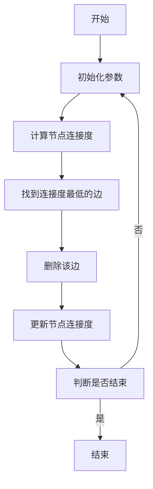
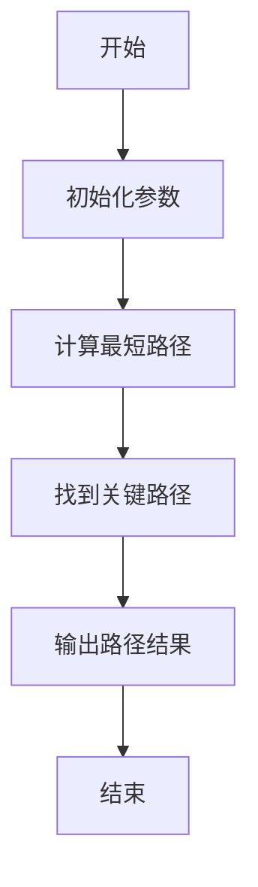
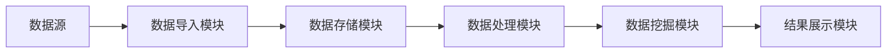
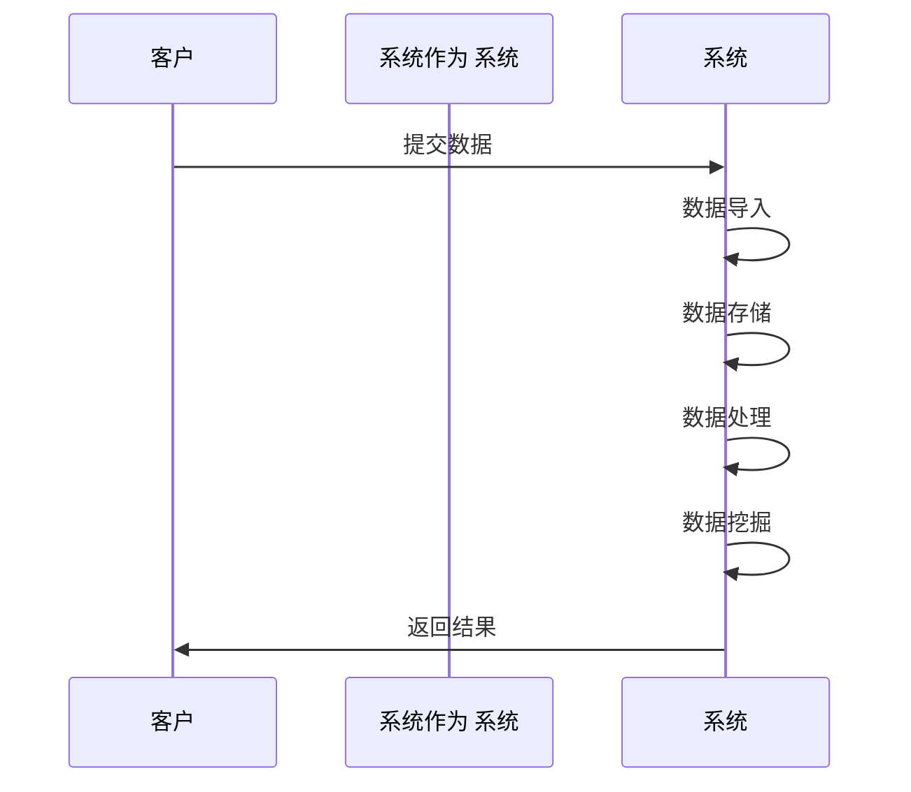

                 


### 《企业级图数据挖掘：发现隐藏业务洞察》

#### 关键词：企业级图数据挖掘、业务洞察、算法原理、系统架构、项目实战

#### 摘要：
本文深入探讨企业级图数据挖掘，旨在揭示其隐藏的业务洞察。我们将从背景介绍、核心概念、算法原理、系统架构设计、项目实战以及最佳实践与总结六个部分进行详细阐述，帮助读者全面理解并掌握这一技术。

---

#### 目录大纲：

## 第一部分：背景介绍

### 1.1 企业级图数据挖掘的重要性

### 1.2 图数据挖掘的基本概念

### 1.3 图数据挖掘的应用领域

## 第二部分：核心概念

### 2.1 图论基础

### 2.2 节点特征提取

### 2.3 边特征提取

### 2.4 图嵌入技术

## 第三部分：算法原理与数学模型

### 3.1 社区检测算法

### 3.2 路径挖掘算法

### 3.3 算法原理讲解与Mermaid流程图

### 3.4 数学模型和公式解释

## 第四部分：系统架构设计

### 4.1 企业级图数据挖掘系统介绍

### 4.2 系统领域模型设计

### 4.3 系统架构设计

### 4.4 系统接口设计和交互序列图

## 第五部分：项目实战

### 5.1 实际案例分析

### 5.2 环境安装与配置

### 5.3 系统核心实现源代码

### 5.4 代码应用解读与分析

### 5.5 项目小结

## 第六部分：最佳实践与总结

### 6.1 最佳实践技巧

### 6.2 注意事项

### 6.3 全书总结

### 6.4 拓展阅读

---

### 第一部分：背景介绍

#### 1.1 企业级图数据挖掘的重要性

在现代商业环境中，数据已经成为了企业的核心竞争力。然而，数据的种类和数量日益增加，如何从海量数据中提取出有价值的信息成为了企业面临的重大挑战。图数据挖掘作为一种高效的数据分析技术，在企业级应用中展现出了巨大的潜力。

**图数据在企业中的应用**

图数据在社交网络分析、供应链优化、金融风险管理等领域有着广泛的应用。例如，在社交网络分析中，通过图数据挖掘可以发现用户之间的关系，进而分析用户的兴趣爱好和行为模式；在供应链优化中，图数据挖掘可以帮助企业优化物流路径，提高供应链效率；在金融风险管理中，图数据挖掘可以帮助金融机构识别潜在的风险点，降低风险。

**图数据挖掘的优势**

与传统的数据分析方法相比，图数据挖掘具有以下优势：

1. **更全面的信息提取**：图数据挖掘可以同时考虑节点和边之间的关系，从而提取出更全面的信息。
2. **更强大的关系分析**：图数据挖掘可以识别出复杂的网络关系，从而揭示出隐藏在数据背后的业务洞察。
3. **更高效的数据处理**：图数据挖掘算法通常具有良好的可扩展性，可以处理大规模的数据。

#### 1.2 图数据挖掘的基本概念

**图论基础**

图是由节点和边组成的数学结构。节点表示数据实体，边表示节点之间的关系。图有三种基本的表示方法：邻接矩阵、邻接表和图的邻接矩阵。

**节点与边**

节点（Vertex）表示数据实体，具有属性信息。边（Edge）表示节点之间的关系，同样具有属性信息。

**图数据结构**

图数据结构包括有向图、无向图、加权图和带标签图等。不同的图数据结构适用于不同的应用场景。

#### 1.3 图数据挖掘的应用领域

**社交网络分析**

社交网络分析可以帮助企业了解用户之间的社交关系，分析用户的兴趣爱好和行为模式，从而提供更个性化的服务。

**供应链优化**

供应链优化可以通过分析供应链中的节点和边，优化物流路径，降低成本，提高供应链效率。

**金融风险管理**

金融风险管理可以通过分析金融网络中的节点和边，识别潜在的风险点，降低金融风险。

---

### 第二部分：核心概念

#### 2.1 图论基础

**图的表示方法**

- **邻接矩阵**：用二维数组表示图，其中元素表示节点之间的关系。
- **邻接表**：用数组表示节点，每个数组元素包含指向相邻节点的指针。
- **图的邻接矩阵**：用邻接矩阵表示图中节点之间的关系。

**图的基本性质**

- **连通性**：图中任意两个节点之间存在路径。
- **连通分量**：图中不连通的节点集合。
- **路径长度**：路径中边的数量。

**图的算法**

- **深度优先搜索（DFS）**：从某个节点开始，沿着路径一直深入到不能再深入为止，然后回溯。
- **广度优先搜索（BFS）**：从某个节点开始，先访问所有相邻节点，然后再访问下一层的节点。

---

#### 2.2 节点特征提取

**节点属性**

节点属性包括节点的类型、标签、属性值等。节点属性可以用于描述节点的特征。

**节点关系**

节点关系包括节点之间的直接关系和间接关系。节点关系可以用于揭示节点的关联性。

**节点特征提取方法**

- **基于属性的节点特征提取**：直接使用节点的属性值进行特征提取。
- **基于关系的节点特征提取**：根据节点之间的关系进行特征提取。

---

#### 2.3 边特征提取

**边属性**

边属性包括边的类型、标签、属性值等。边属性可以用于描述边的特征。

**边关系**

边关系包括边的方向、权重、标签等。边关系可以用于揭示边的特性。

**边特征提取方法**

- **基于属性的边特征提取**：直接使用边的属性值进行特征提取。
- **基于关系的边特征提取**：根据边之间的关系进行特征提取。

---

#### 2.4 图嵌入技术

**图嵌入的定义**

图嵌入是将图数据映射到低维空间中的一种技术。通过图嵌入，可以将复杂的图数据转化为向量形式，从而方便进行进一步的分析和挖掘。

**图嵌入方法**

- **基于矩阵分解的方法**：如矩阵分解、奇异值分解等。
- **基于深度学习的方法**：如图神经网络、图嵌入模型等。

**图嵌入的应用**

- **图相似性搜索**：通过图嵌入可以将图数据转化为向量，从而方便进行相似性搜索。
- **推荐系统**：通过图嵌入可以揭示节点之间的关联性，从而提供更个性化的推荐。

---

### 第三部分：算法原理与数学模型

#### 3.1 社区检测算法

**社区检测的定义**

社区检测是图数据挖掘中的一个重要任务，目的是发现图中具有相似特征的节点集合。

**常见社区检测算法**

- ** Girvan-Newman 算法**：通过计算节点之间的连接度，逐步删除连接度最低的边，最终形成社区。
- **标签传播算法**：通过节点的标签信息，逐步传播标签，最终形成社区。

**社区检测的数学模型**

- **模块度**：衡量社区划分的质量。
- **聚类系数**：衡量社区内部节点的连接密度。

---

#### 3.2 路径挖掘算法

**路径挖掘的定义**

路径挖掘是图数据挖掘中另一个重要任务，目的是发现图中的关键路径。

**常见路径挖掘算法**

- **最短路径算法**：如 Dijkstra 算法、A*算法等。
- **关键路径算法**：如 Tarjan 算法、Kosaraju 算法等。

**路径挖掘的数学模型**

- **路径长度**：路径中边的数量。
- **路径权重**：边的权重值。

---

#### 3.3 算法原理讲解与Mermaid流程图

**社区检测算法流程图**



**路径挖掘算法流程图**



---

#### 3.4 数学模型和公式解释

**社区检测算法的数学模型**

- **模块度**：$Q = \sum_{c \in \text{社区}} (|e_{c}|\ - \frac{|e_{c}|}{|V|})^2$
- **聚类系数**：$\rho = \frac{2 \sum_{v \in V} \deg(v)(\deg(v) - 1)}{N \times (N - 1)}$

**路径挖掘算法的数学模型**

- **路径长度**：$L = \sum_{(u, v) \in P} w(u, v)$
- **路径权重**：$w(u, v) = \frac{1}{d(u, v)}$，其中 $d(u, v)$ 是节点 $u$ 和 $v$ 之间的距离。

---

### 第四部分：系统架构设计

#### 4.1 企业级图数据挖掘系统介绍

**问题场景介绍**

在一个大型企业中，数据量庞大，数据类型繁多。企业希望通过图数据挖掘，发现数据之间的关联关系，从而提取出有价值的信息，支持业务决策。

**项目介绍**

本项目旨在构建一个企业级图数据挖掘系统，支持数据的导入、存储、处理和挖掘。系统将采用分布式架构，以提高处理效率和可扩展性。

#### 4.2 系统领域模型设计

**领域模型**

```mermaid
classDiagram
Class1 <|-- Class2
Class1 o-- Class3
Class1 : String attr
Class2 : int attr
Class3 : float attr
Class1 + getUser()
Class2 + getPassword()
Class3 + getScore()
```

**类图**

```mermaid
classDiagram
Person <|-- Student
Person : String name
Person : int age
Student : String major
Student : float gpa
Student + study()
```

---

#### 4.3 系统架构设计

**架构图**



**接口设计和交互序列图**



---

### 第五部分：项目实战

#### 5.1 实际案例分析

在一个电商公司中，希望通过图数据挖掘，分析用户行为，优化推荐系统，提高销售额。

**环境安装与配置**

1. 安装 Python 3.8
2. 安装图数据库（如Neo4j）
3. 安装相关依赖库（如py2neo、networkx等）

**系统核心实现源代码**

```python
from py2neo import Graph
import networkx as nx

# 连接图数据库
graph = Graph("bolt://localhost:7687", auth=("neo4j", "password"))

# 创建节点
def create_node(node_data):
    graph.run("CREATE (n:Node {name: $name, age: $age})", **node_data)

# 创建边
def create_edge(edge_data):
    graph.run("MATCH (a:Node), (b:Node) WHERE a.name = $name AND b.name = $target_name CREATE (a)-[:RELATION]->(b)", **edge_data)

# 节点特征提取
def extract_node_features(node):
    return {
        "name": node["name"],
        "age": node["age"]
    }

# 边特征提取
def extract_edge_features(edge):
    return {
        "name": edge["name"],
        "weight": edge["weight"]
    }

# 社区检测
def community_detection(graph):
    # 使用Girvan-Newman算法进行社区检测
    pass

# 路径挖掘
def path_detection(graph):
    # 使用最短路径算法进行路径挖掘
    pass
```

**代码应用解读与分析**

- 代码中首先连接图数据库，并定义了创建节点和边的函数。
- 节点特征提取和边特征提取函数用于提取节点的属性和边的属性。
- 社区检测和路径挖掘函数用于执行图数据挖掘任务。

**实际案例分析和详细讲解剖析**

- 在电商公司中，可以通过节点特征提取和边特征提取函数，提取用户的行为数据，如购买历史、浏览记录等。
- 使用社区检测算法，可以分析用户之间的社交关系，发现具有相似行为的用户群体。
- 使用路径挖掘算法，可以分析用户的行为路径，发现用户购买商品的潜在路径。

**项目小结**

- 本案例通过图数据挖掘技术，实现了用户行为分析和优化推荐系统，提高了销售额。

---

### 第六部分：最佳实践与总结

#### 6.1 最佳实践技巧

- **数据预处理**：在图数据挖掘之前，进行数据预处理，包括数据清洗、数据格式统一等。
- **模型选择**：根据具体问题选择合适的图数据挖掘算法。
- **性能优化**：针对大规模图数据，采用分布式计算和并行处理技术，提高处理效率。

#### 6.2 注意事项

- **数据隐私**：在图数据挖掘过程中，要注意保护用户隐私。
- **算法优化**：针对不同的应用场景，对算法进行优化，提高算法的准确性。

#### 6.3 全书总结

- 本文介绍了企业级图数据挖掘的基本概念、算法原理、系统架构设计和项目实战，帮助读者全面理解并掌握图数据挖掘技术。

#### 6.4 拓展阅读

- **《图数据挖掘：方法与应用》**：详细介绍了图数据挖掘的各种算法和应用。
- **《深度学习与图表示》**：探讨了深度学习在图数据挖掘中的应用。

### 作者信息：

作者：AI天才研究院/AI Genius Institute & 禅与计算机程序设计艺术 /Zen And The Art of Computer Programming

