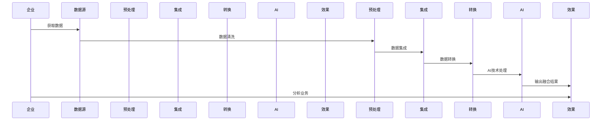
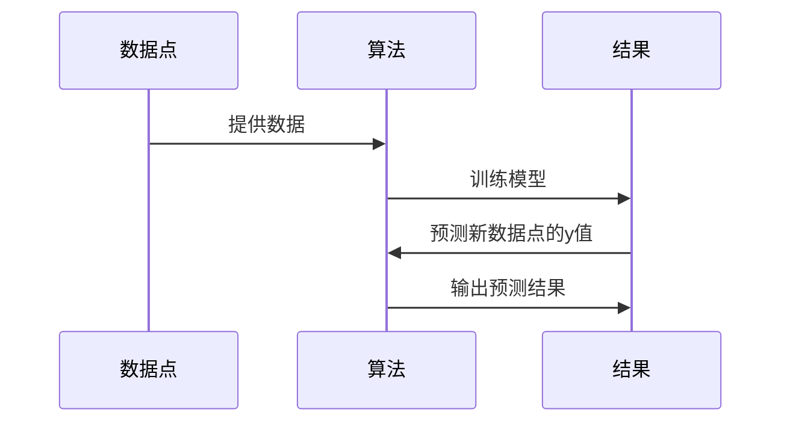
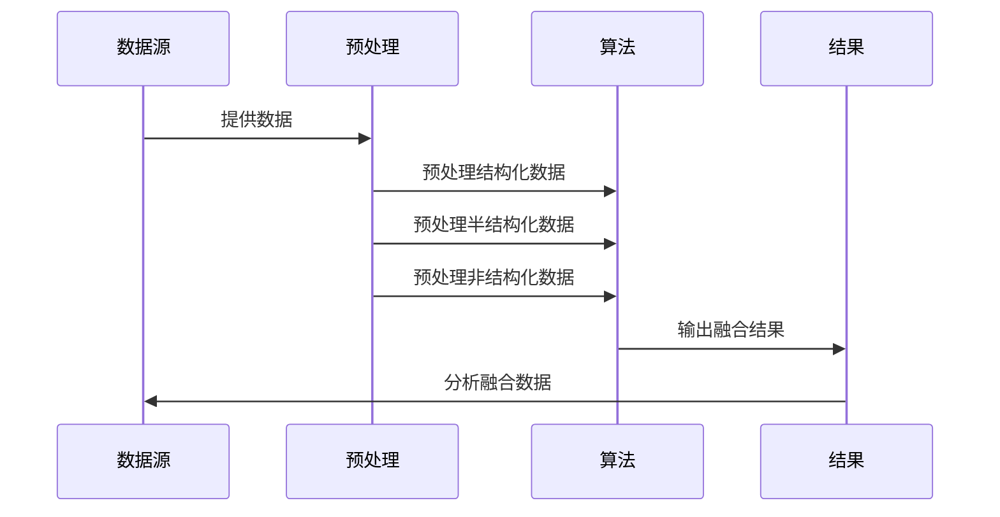
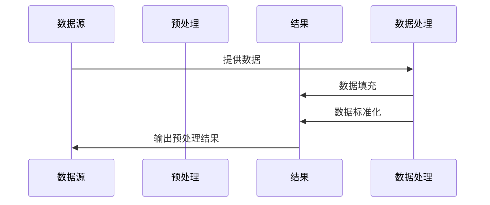
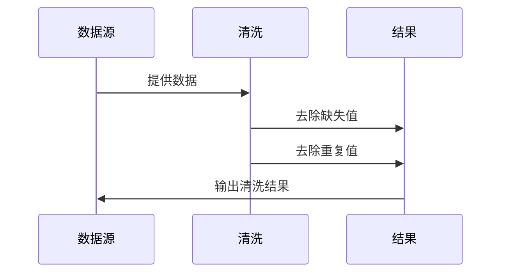
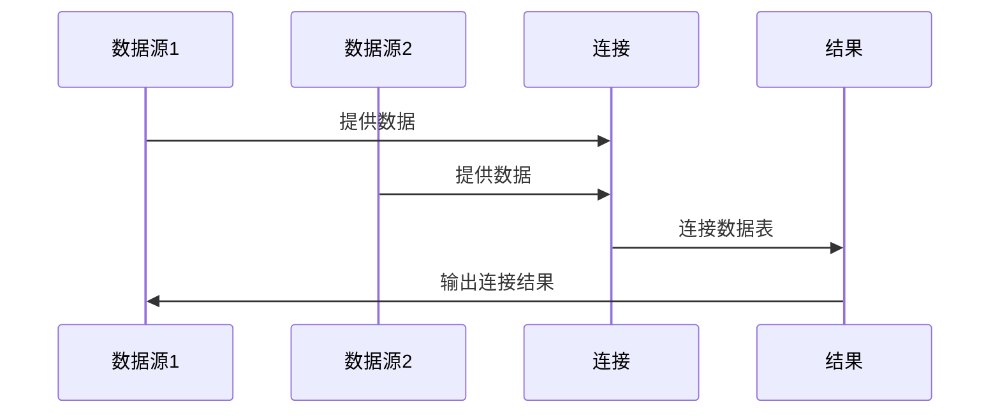
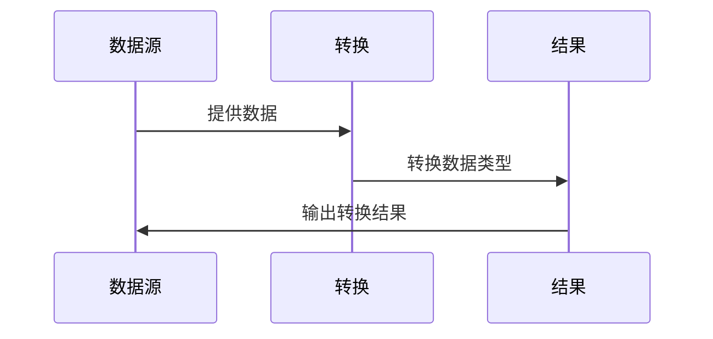
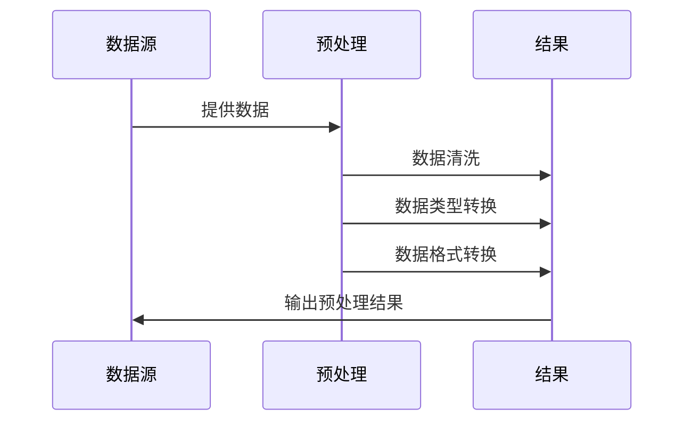

                 

## 第1章 引言：企业级异构数据融合的背景与挑战

### 1.1 问题的提出

#### 1.1.1 数据融合在企业中的重要性

在信息化和数字化转型的大背景下，数据已成为企业的重要资产。企业通过收集、存储和分析大量数据，可以提升运营效率、优化决策过程和增强竞争力。然而，随着数据来源的多样化，企业面临的一大挑战是如何有效整合和管理这些异构数据。

**核心概念术语说明**：  
- **异构数据**：指来自不同数据源、格式和结构的数据。  
- **数据融合**：将异构数据整合成统一视图的过程。

**问题背景**：随着大数据技术的普及，企业获取和处理数据的能力大大增强。然而，不同数据源的数据格式、结构、语义和属性差异巨大，使得数据融合成为一个复杂而关键的问题。

**问题描述**：企业需要解决如何在异构数据环境中进行高效、准确的数据融合，以支持业务决策和运营优化。

**问题解决**：通过引入人工智能（AI）技术，企业可以实现自动化和智能化的数据融合。AI能够处理多样化的数据源，提取关键信息，并生成统一的视图，帮助企业更好地利用数据。

**边界与外延**：数据融合不仅限于企业内部的数据源，还包括跨企业、跨行业的数据整合。同时，数据融合不仅仅关注数据的整合，还涉及数据的质量管理、隐私保护等问题。

**概念结构与核心要素组成**：  
- **数据源**：包括企业内部和外部的各种数据源。  
- **数据预处理**：包括数据清洗、集成和转换等步骤，以提高数据质量。  
- **数据融合算法**：采用机器学习和深度学习等技术，实现数据的整合和关联分析。  
- **数据模型**：用于存储和管理融合后的数据，以支持业务分析和决策。

### 1.1.2 异构数据融合的概念与挑战

**核心概念与联系**：  
- **异构数据融合**：将不同来源、格式和结构的数据整合成一个统一视图。  
- **AI技术**：在数据融合过程中，利用机器学习和深度学习等技术，提高融合的准确性和效率。

**概念属性特征对比表格**：

| 特征名称 | 异构数据融合 | AI技术 |
| --- | --- | --- |
| 数据来源 | 多样性 | 自动化 |
| 数据格式 | 多种格式 | 结构化处理 |
| 数据质量 | 变异性 | 智能评估 |
| 整合效率 | 低效 | 高效 |

**ER实体关系图架构**：

```mermaid
erDiagram
  DataSource ||--|{ DataFormat }|| FormatEntity
  DataFormat ||--|{ DataQuality }|| QualityEntity
  DataQuality ||--|{ DataFusion }|| FusionEntity
  DataFusion ||--|{ AITechnique }|| TechniqueEntity
```

**算法原理讲解**：

**数据融合算法**：

```python
# 数据融合算法示例
def data_fusion(data_sources):
    # 数据清洗
    cleaned_data = preprocess_data(data_sources)
    
    # 数据集成
    integrated_data = integrate_data(cleaned_data)
    
    # 数据转换
    transformed_data = transform_data(integrated_data)
    
    # AI技术处理
    fused_data = ai_treatment(transformed_data)
    
    return fused_data
```

**数学模型和公式**：

$$
\text{数据融合效果} = f(\text{数据源}, \text{数据预处理}, \text{数据集成}, \text{数据转换}, \text{AI技术})
$$

**通俗易懂地举例说明**：

假设企业有两个数据源：一个是销售数据（结构化数据），另一个是客户反馈（非结构化数据）。通过数据融合算法，可以将这两个数据源整合成一个统一的视图，以便更好地分析销售业绩和客户满意度。



通过这个例子，可以看到数据融合算法如何将不同类型的数据源整合起来，为企业提供统一的业务分析视角。

### 1.1.3 AI在异构数据融合中的应用前景

随着AI技术的不断进步，其在数据融合中的应用前景十分广阔。AI技术能够自动识别和处理异构数据，提高数据融合的准确性和效率，具体应用包括：

- **自动化数据预处理**：AI技术可以自动化数据清洗、转换和集成过程，降低人工干预，提高数据处理效率。
- **智能特征提取与融合**：通过深度学习等技术，可以从异构数据中提取有效特征，并实现智能化的数据融合。
- **实时数据融合**：利用实时数据流处理技术，实现数据的实时融合和分析，支持企业快速响应市场变化。

综上所述，AI技术在企业级异构数据融合中具有巨大的潜力，能够解决数据多样性和质量等问题，为企业提供更准确、高效的数据融合解决方案。接下来，我们将进一步探讨AI基础理论和数据融合方法，以深入了解这一领域的技术原理和应用。

---

**作者：AI天才研究院/AI Genius Institute & 禅与计算机程序设计艺术 /Zen And The Art of Computer Programming**

----------------------------------------------------------------

## 第2章 AI基础理论与方法

### 2.1 人工智能概述

#### 2.1.1 人工智能的定义与发展历程

**核心概念与联系**：人工智能（Artificial Intelligence, AI）是指通过计算机模拟人类智能的过程，包括感知、理解、学习和决策等能力。人工智能的发展可以追溯到20世纪50年代，随着计算机技术的不断进步，AI技术经历了多个发展阶段。

- **第一阶段**（1956-1969年）：以“人工智能”概念提出为标志，主要研究逻辑推理和符号处理。
- **第二阶段**（1970-1989年）：受到专家系统的推动，研究如何通过编程实现自动化决策。
- **第三阶段**（1990-2010年）：随着机器学习和大数据技术的发展，AI在图像识别、语音识别和自然语言处理等领域取得了显著进展。
- **第四阶段**（2010年至今）：深度学习和神经网络技术的发展，使得AI在自动驾驶、机器人和智能医疗等领域取得了突破性成果。

**概念属性特征对比表格**：

| 阶段 | 特点 | 代表技术 |
| --- | --- | --- |
| 第一阶段 | 逻辑推理和符号处理 | 专家系统 |
| 第二阶段 | 自动化决策 | 统计学习 |
| 第三阶段 | 图像识别和语音识别 | 深度学习 |
| 第四阶段 | 实时应用和跨领域融合 | 神经网络 |

**ER实体关系图架构**：

```mermaid
erDiagram
  AI_Development ||--|{ Stage1 }|| Stage1Entity
  AI_Development ||--|{ Stage2 }|| Stage2Entity
  AI_Development ||--|{ Stage3 }|| Stage3Entity
  AI_Development ||--|{ Stage4 }|| Stage4Entity
  Stage1 ||--|{ Expert_System }|| ExpertSystem
  Stage2 ||--|{ Statistical_Learning }|| StatisticalLearning
  Stage3 ||--|{ Deep_Learning }|| DeepLearning
  Stage4 ||--|{ Neural_Network }|| NeuralNetwork
```

#### 2.1.2 人工智能的关键技术

**核心概念与联系**：人工智能的关键技术包括机器学习、深度学习和自然语言处理等。这些技术在不同的发展阶段和领域都有着重要的应用。

- **机器学习**：通过训练模型从数据中学习规律，实现自动化决策和预测。  
- **深度学习**：基于神经网络，通过多层结构实现复杂函数逼近和特征提取。  
- **自然语言处理**：研究如何让计算机理解和生成自然语言，实现人机交互。

**概念属性特征对比表格**：

| 技术名称 | 特点 | 应用领域 |
| --- | --- | --- |
| 机器学习 | 自动化学习 | 数据分析、预测和分类 |
| 深度学习 | 多层网络结构 | 图像识别、语音识别和自然语言处理 |
| 自然语言处理 | 人机交互 | 语音助手、机器翻译和文本分析 |

**ER实体关系图架构**：

```mermaid
erDiagram
  AI_Technology ||--|{ Machine_Learning }|| MachineLearning
  AI_Technology ||--|{ Deep_Learning }|| DeepLearning
  AI_Technology ||--|{ Natural_Language_Processing }|| NLP
  MachineLearning ||--|{ Data_Analysis }|| DataAnalysis
  MachineLearning ||--|{ Prediction }|| Prediction
  MachineLearning ||--|{ Classification }|| Classification
  DeepLearning ||--|{ Image_Recognition }|| ImageRecognition
  DeepLearning ||--|{ Speech_Recognition }|| SpeechRecognition
  NLP ||--|{ Voice_Assistant }|| VoiceAssistant
  NLP ||--|{ Machine_Translation }|| MachineTranslation
  NLP ||--|{ Text_Analysis }|| TextAnalysis
```

**算法原理讲解**：

**机器学习算法**：

```python
# 机器学习算法示例
from sklearn.linear_model import LinearRegression

# 准备数据
X = [[1], [2], [3], [4], [5]]
y = [1, 2, 3, 4, 5]

# 创建模型
model = LinearRegression()

# 训练模型
model.fit(X, y)

# 预测
prediction = model.predict([[6]])
print(prediction)
```

**数学模型和公式**：

$$
\text{预测结果} = \text{w} \cdot \text{x} + \text{b}
$$

**通俗易懂地举例说明**：

假设我们有一组数据，每个数据点都表示一个二维平面上的点（x, y）。通过线性回归算法，我们可以找到一个最佳拟合直线，用于预测新的数据点的y值。



通过这个例子，可以看到机器学习算法如何从数据中学习规律，并生成预测结果。

### 2.2 异构数据融合的基本概念

**核心概念与联系**：异构数据融合是指将来自不同数据源、格式和结构的数据整合成统一的视图。在异构数据融合中，数据源可以是结构化、半结构化和非结构化的数据，而数据格式可能包括关系型数据库、XML、JSON和文本等。

**概念属性特征对比表格**：

| 数据类型 | 特点 | 示例 |
| --- | --- | --- |
| 结构化数据 | 有固定格式和结构，如关系型数据库 | SQL数据库 |
| 半结构化数据 | 具有一定的结构，但灵活多变，如XML和JSON | XML文件 |
| 非结构化数据 | 没有固定格式和结构，如文本、图像和视频 | 文本文件 |

**ER实体关系图架构**：

```mermaid
erDiagram
  Data_Type ||--|{ Structured_Data }|| StructuredData
  Data_Type ||--|{ Semi-Structured_Data }|| SemiStructuredData
  Data_Type ||--|{ Unstructured_Data }|| UnstructuredData
  Structured_Data ||--|{ RDBMS }|| RDBMS
  Semi-Structured_Data ||--|{ XML }|| XML
  Semi-Structured_Data ||--|{ JSON }|| JSON
  Unstructured_Data ||--|{ Text }|| Text
  Unstructured_Data ||--|{ Image }|| Image
  Unstructured_Data ||--|{ Video }|| Video
```

**算法原理讲解**：

**数据融合算法**：

```python
# 数据融合算法示例
from sklearn.preprocessing import StandardScaler

# 准备数据
structured_data = [[1, 2], [3, 4], [5, 6]]
semi_structured_data = [{"name": "Alice", "age": 30}, {"name": "Bob", "age": 40}, {"name": "Charlie", "age": 50}]
unstructured_data = ["Hello", "World"]

# 结构化数据预处理
scaler = StandardScaler()
structured_data_normalized = scaler.fit_transform(structured_data)

# 半结构化数据预处理
semi_structured_data_processed = preprocess_semi_structured_data(semi_structured_data)

# 非结构化数据预处理
unstructured_data_processed = preprocess_unstructured_data(unstructured_data)

# 数据融合
fused_data = fuse_data(structured_data_normalized, semi_structured_data_processed, unstructured_data_processed)

# 输出融合结果
print(fused_data)
```

**数学模型和公式**：

$$
\text{标准化数据} = \frac{\text{数据} - \text{均值}}{\text{标准差}}
$$

**通俗易懂地举例说明**：

假设我们有三类数据：结构化数据（如数值型特征）、半结构化数据（如字典）和非结构化数据（如文本）。通过数据融合算法，我们可以将这三类数据整合成一个统一的视图。



通过这个例子，可以看到数据融合算法如何处理不同类型的数据，并生成融合结果。

### 2.3 AI在数据融合中的应用

**核心概念与联系**：在数据融合过程中，AI技术可以用于数据预处理、特征提取和模型训练等环节，以提高融合的准确性和效率。

- **数据预处理**：利用AI技术进行自动化数据清洗、去噪和标准化等操作。  
- **特征提取**：从原始数据中提取有效特征，用于后续的模型训练和融合分析。  
- **模型训练**：利用AI技术训练数据融合模型，实现数据的自动化整合和关联分析。

**概念属性特征对比表格**：

| 应用环节 | 特点 | 示例 |
| --- | --- | --- |
| 数据预处理 | 自动化处理 | 数据清洗、去噪和标准化 |
| 特征提取 | 高效特征提取 | 特征选择、降维和特征工程 |
| 模型训练 | 自动化建模 | 监督学习、无监督学习和深度学习 |

**ER实体关系图架构**：

```mermaid
erDiagram
  Data_Fusion ||--|{ Data_Preprocessing }|| Preprocessing
  Data_Fusion ||--|{ Feature_ Extraction }|| FeatureExtraction
  Data_Fusion ||--|{ Model_Training }|| ModelTraining
  Preprocessing ||--|{ Automation }|| Automation
  FeatureExtraction ||--|{ Efficient_ Feature_Extraction }|| EfficientFeatureExtraction
  ModelTraining ||--|{ Automation }|| Automation
  ModelTraining ||--|{ Model_Selection }|| ModelSelection
```

**算法原理讲解**：

**数据预处理**：

```python
# 数据预处理示例
from sklearn.impute import SimpleImputer
from sklearn.preprocessing import MinMaxScaler

# 准备数据
data = [[1, np.nan], [3, 4], [np.nan, 6]]

# 数据预处理
imputer = SimpleImputer(strategy='mean')
data_imputed = imputer.fit_transform(data)

scaler = MinMaxScaler()
data_scaled = scaler.fit_transform(data_imputed)

# 输出预处理结果
print(data_scaled)
```

**数学模型和公式**：

$$
\text{填充值} = \frac{\sum_{i=1}^{n} x_i}{n}
$$

$$
\text{标准化数据} = \frac{\text{数据} - \text{最小值}}{\text{最大值} - \text{最小值}}
$$

**通俗易懂地举例说明**：

假设我们有一组数据，其中某些值缺失或超出正常范围。通过数据预处理算法，我们可以自动填充缺失值，并将数据缩放到合适的范围。



通过这个例子，可以看到数据预处理算法如何处理原始数据，以提高数据质量。

### 2.3.1 数据预处理

**核心概念与联系**：数据预处理是数据融合过程中至关重要的一步，其目的是提高数据的质量和一致性，为后续的数据融合和特征提取打下良好基础。

- **数据清洗**：去除重复、错误和不完整的数据，确保数据的准确性和一致性。  
- **数据集成**：将来自不同数据源的数据整合成一个统一的数据集。  
- **数据转换**：将不同格式和单位的数据转换为统一的格式和单位，以便进行后续处理。

**概念属性特征对比表格**：

| 预处理步骤 | 特点 | 示例 |
| --- | --- | --- |
| 数据清洗 | 准确性和一致性 | 缺失值填充、异常值检测和重复值删除 |
| 数据集成 | 数据统一性 | 数据表连接、合并和去重 |
| 数据转换 | 格式一致性 | 数据类型转换、单位转换和标准化 |

**ER实体关系图架构**：

```mermaid
erDiagram
  Data_Preprocessing ||--|{ Data_Cleaning }|| Cleaning
  Data_Preprocessing ||--|{ Data_Integration }|| Integration
  Data_Preprocessing ||--|{ Data_Transformation }|| Transformation
  Cleaning ||--|{ Accuracy }|| Accuracy
  Cleaning ||--|{ Consistency }|| Consistency
  Integration ||--|{ Unification }|| Unification
  Transformation ||--|{ Format_Consistency }|| FormatConsistency
  Transformation ||--|{ Unit_Consistency }|| UnitConsistency
```

**算法原理讲解**：

**数据清洗**：

```python
# 数据清洗示例
import pandas as pd

# 准备数据
data = pd.DataFrame([[1, 2], [3, np.nan], [5, 6], [7, 7]])

# 数据清洗
data_cleaned = data.dropna()  # 删除缺失值
data_cleaned = data_cleaned.drop_duplicates()  # 删除重复值

# 输出清洗结果
print(data_cleaned)
```

**数学模型和公式**：

$$
\text{缺失值填充} = \frac{\sum_{i=1}^{n} x_i}{n}
$$

**通俗易懂地举例说明**：

假设我们有一组数据，其中某些数据值缺失或重复。通过数据清洗算法，我们可以自动去除这些异常数据，确保数据的准确性和一致性。



通过这个例子，可以看到数据清洗算法如何处理原始数据，以提高数据质量。

### 2.3.2 数据集成

**核心概念与联系**：数据集成是将来自不同数据源的数据整合成一个统一的数据集的过程。数据集成是数据融合的基础，其目的是消除数据冗余，提高数据的一致性和可用性。

- **数据源**：包括关系型数据库、NoSQL数据库、文件系统等。  
- **数据表连接**：通过连接操作将不同数据表中的数据整合成一个数据集。  
- **去重**：去除重复的数据记录，确保数据的一致性。

**概念属性特征对比表格**：

| 集成方法 | 特点 | 示例 |
| --- | --- | --- |
| 数据表连接 | 关联性 | SQL连接操作 |
| 文件系统集成 | 灵活性 | 文件系统目录合并 |
| NoSQL数据库集成 | 分布式 | MongoDB集成 |

**ER实体关系图架构**：

```mermaid
erDiagram
  Data_Integration ||--|{ Data_Source }|| Source
  Data_Integration ||--|{ Data_Table_Connection }|| TableConnection
  Data_Integration ||--|{ De-duplication }|| Deduplication
  Source ||--|{ RDBMS }|| RDBMS
  Source ||--|{ NoSQL }|| NoSQL
  Source ||--|{ File_System }|| FileSystem
  TableConnection ||--|{ SQL }|| SQL
  TableConnection ||--|{ File_System }|| FileConnection
  Deduplication ||--|{ Consistency }|| Consistency
  Deduplication ||--|{ Efficiency }|| Efficiency
```

**算法原理讲解**：

**数据表连接**：

```python
# 数据表连接示例
import pandas as pd

# 准备数据
data1 = pd.DataFrame({'A': [1, 2, 3], 'B': [4, 5, 6]})
data2 = pd.DataFrame({'C': [7, 8, 9], 'D': [10, 11, 12]})

# 数据表连接
data_connected = pd.merge(data1, data2, on='A')

# 输出连接结果
print(data_connected)
```

**数学模型和公式**：

$$
\text{连接结果} = \text{表1} \cup \text{表2} \cap \text{连接条件}
$$

**通俗易懂地举例说明**：

假设我们有两个数据表，其中表1包含列A和B，表2包含列C和D。通过数据表连接算法，我们可以将这两个数据表整合成一个数据集，以便进行进一步的分析和处理。



通过这个例子，可以看到数据表连接算法如何将多个数据表整合成一个统一的数据集。

### 2.3.3 数据转换

**核心概念与联系**：数据转换是将不同格式和单位的数据转换为统一的格式和单位的过程。数据转换是确保数据一致性和兼容性的关键步骤，对于数据融合的顺利进行至关重要。

- **数据类型转换**：将一种数据类型转换为另一种数据类型，如字符串转换为整数。  
- **单位转换**：将不同单位的数据转换为同一单位，如温度从摄氏度转换为华氏度。  
- **标准化**：将数据缩放到一个固定的范围，如将数据从0到100转换为0到1。

**概念属性特征对比表格**：

| 转换类型 | 特点 | 示例 |
| --- | --- | --- |
| 数据类型转换 | 数据兼容性 | 字符串转换为整数 |
| 单位转换 | 数据一致性 | 温度从摄氏度转换为华氏度 |
| 标准化 | 数据规范化 | 数据缩放到0到1范围 |

**ER实体关系图架构**：

```mermaid
erDiagram
  Data_Transformation ||--|{ Data_Type_Conversion }|| TypeConversion
  Data_Transformation ||--|{ Unit_Conversion }|| UnitConversion
  Data_Transformation ||--|{ Standardization }|| Standardization
  TypeConversion ||--|{ Compatibility }|| Compatibility
  UnitConversion ||--|{ Consistency }|| Consistency
  Standardization ||--|{ Normalization }|| Normalization
```

**算法原理讲解**：

**数据类型转换**：

```python
# 数据类型转换示例
import pandas as pd

# 准备数据
data = pd.DataFrame({'A': ['1', '2', '3'], 'B': [4.0, 5.0, 6.0]})

# 数据类型转换
data['A'] = data['A'].astype(int)
data['B'] = data['B'].astype(int)

# 输出转换结果
print(data)
```

**数学模型和公式**：

$$
\text{数据类型转换} = \text{new\_type}(\text{data})
$$

**通俗易懂地举例说明**：

假设我们有一组数据，其中某些列的数据类型不一致。通过数据类型转换算法，我们可以将所有数据列转换为统一的整数类型。



通过这个例子，可以看到数据类型转换算法如何将不同数据类型的数据转换为统一的整数类型。

### 2.3.4 数据预处理总结

**核心概念与联系**：数据预处理是数据融合过程中至关重要的一步，其目的是提高数据的质量和一致性，为后续的数据融合和特征提取打下良好基础。数据预处理包括数据清洗、数据集成、数据转换等步骤。

- **数据清洗**：去除重复、错误和不完整的数据，确保数据的准确性和一致性。  
- **数据集成**：将来自不同数据源的数据整合成一个统一的数据集，消除数据冗余。  
- **数据转换**：将不同格式和单位的数据转换为统一的格式和单位，确保数据的一致性和兼容性。

**概念属性特征对比表格**：

| 预处理步骤 | 特点 | 示例 |
| --- | --- | --- |
| 数据清洗 | 准确性和一致性 | 缺失值填充、异常值检测和重复值删除 |
| 数据集成 | 数据统一性 | 数据表连接、合并和去重 |
| 数据转换 | 格式一致性 | 数据类型转换、单位转换和标准化 |

**ER实体关系图架构**：

```mermaid
erDiagram
  Data_Preprocessing ||--|{ Data_Cleaning }|| Cleaning
  Data_Preprocessing ||--|{ Data_Integration }|| Integration
  Data_Preprocessing ||--|{ Data_Transformation }|| Transformation
  Cleaning ||--|{ Accuracy }|| Accuracy
  Cleaning ||--|{ Consistency }|| Consistency
  Integration ||--|{ Unification }|| Unification
  Transformation ||--|{ Format_Consistency }|| FormatConsistency
  Transformation ||--|{ Unit_Consistency }|| UnitConsistency
```

**算法原理讲解**：

**综合数据预处理**：

```python
# 综合数据预处理示例
import pandas as pd
from sklearn.impute import SimpleImputer
from sklearn.preprocessing import MinMaxScaler

# 准备数据
data = pd.DataFrame([[1, 2], [3, np.nan], [5, 6], [7, 7]])

# 数据预处理
# 数据清洗
data_cleaned = data.dropna()  # 删除缺失值
data_cleaned = data_cleaned.drop_duplicates()  # 删除重复值

# 数据集成
# 数据表连接
data_connected = pd.merge(data_cleaned, data_cleaned, on='A')

# 数据转换
# 数据标准化
scaler = MinMaxScaler()
data_scaled = scaler.fit_transform(data_connected)

# 输出预处理结果
print(data_scaled)
```

**数学模型和公式**：

$$
\text{缺失值填充} = \frac{\sum_{i=1}^{n} x_i}{n}
$$

$$
\text{标准化数据} = \frac{\text{数据} - \text{最小值}}{\text{最大值} - \text{最小值}}
$$

**通俗易懂地举例说明**：

假设我们有一组数据，其中存在缺失值、重复值以及不同数据类型和单位。通过综合数据预处理算法，我们可以一次性完成数据清洗、集成和转换，确保数据的质量和一致性。


通过这个例子，可以看到综合数据预处理算法如何一次性完成多个预处理步骤，提高数据的整体质量。

### 2.3.5 数据预处理的重要性与挑战

**核心概念与联系**：数据预处理在数据融合过程中具有至关重要的作用，它直接影响数据融合的准确性和效率。然而，数据预处理也面临着一系列挑战，需要在实际应用中加以解决。

- **重要性**：数据预处理是数据融合的基础，能够提高数据的质量和一致性，为后续的数据融合和特征提取打下良好基础。  
- **挑战**：数据预处理需要处理大量的异构数据，且数据质量参差不齐，容易引发数据冗余、缺失和错误等问题。

**概念属性特征对比表格**：

| 挑战 | 特点 | 示例 |
| --- | --- | --- |
| 数据质量 | 变异性 | 数据冗余、缺失和错误 |
| 数据类型 | 多样性 | 结构化、半结构化和非结构化数据 |
| 数据量 | 大规模 | 需要高效的预处理算法 |

**ER实体关系图架构**：

```mermaid
erDiagram
  Data_Preprocessing_Challenge ||--|{ Data_Quality }|| Quality
  Data_Preprocessing_Challenge ||--|{ Data_Type }|| Type
  Data_Preprocessing_Challenge ||--|{ Data_Volume }|| Volume
  Quality ||--|{ Variability }|| Variability
  Quality ||--|{ Redundancy }|| Redundancy
  Type ||--|{ Diversity }|| Diversity
  Type ||--|{ Structured }|| Structured
  Type ||--|{ Semi-Structured }|| SemiStructured
  Type ||--|{ Unstructured }|| Unstructured
  Volume ||--|{ Large_Scale }|| LargeScale
  Volume ||--|{ Efficient_Algorithm }|| EfficientAlgorithm
```

**算法原理讲解**：

**解决数据质量问题的方法**：

- **数据清洗**：通过缺失值填充、异常值检测和重复值删除等方法，提高数据质量。  
- **数据标准化**：通过缩放和归一化等方法，确保数据的一致性和可比性。

**解决数据类型多样性的方法**：

- **数据类型转换**：通过类型转换和映射，将不同数据类型的字段统一为同一类型。  
- **数据格式转换**：通过解析和转换，将不同格式的数据转换为统一格式。

**解决大规模数据量的方法**：

- **分布式计算**：利用分布式框架（如Hadoop、Spark）进行并行处理，提高数据处理效率。  
- **高效算法**：采用高效的数据预处理算法，减少计算时间和资源消耗。

**通俗易懂地举例说明**：

假设我们有一组异构数据，包括结构化、半结构化和非结构化数据。通过以下步骤，我们可以解决数据质量问题和类型多样性问题：

1. **数据清洗**：去除缺失值和重复值，确保数据准确性和一致性。  
2. **数据类型转换**：将半结构化和非结构化数据转换为结构化数据。  
3. **数据格式转换**：将不同格式的数据转换为统一的格式。

通过这些步骤，我们可以确保数据预处理的高效性和准确性，为数据融合提供坚实的数据基础。



通过这个例子，可以看到数据预处理如何解决异构数据的质量问题和类型多样性问题，为数据融合提供可靠的数据支持。

---

**作者：AI天才研究院/AI Genius Institute & 禅与计算机程序设计艺术 /Zen And The Art of Computer Programming**

----------------------------------------------------------------

## 第3章 多源数据融合算法

### 3.1 基于特征的融合算法

**核心概念与联系**：基于特征的融合算法是通过提取和整合不同数据源的特征，以实现数据融合的方法。特征提取是数据融合的重要环节，它能够从原始数据中提取出具有代表性的特征，为后续的融合分析提供基础。

- **特征提取方法**：包括主成分分析（PCA）、线性判别分析（LDA）和自动编码器等。这些方法能够将高维数据降维，提取出核心特征，降低数据冗余。
- **特征融合策略**：包括特征加权、特征拼接和特征选择等。通过合理的特征融合策略，可以最大化融合数据的代表性和准确性。

**概念属性特征对比表格**：

| 方法 | 特点 | 应用场景 |
| --- | --- | --- |
| 主成分分析（PCA） | 数据降维 | 高维数据的可视化和分析 |
| 线性判别分析（LDA） | 特征提取 | 分类和聚类问题 |
| 自动编码器 | 特征提取 | 无监督特征学习 |

**ER实体关系图架构**：

```mermaid
erDiagram
  Feature_Fusion ||--|{ Feature_Extraction }|| Extraction
  Feature_Fusion ||--|{ Feature_Fusion_Strategy }|| Strategy
  Feature_Extraction ||--|{ PCA }|| PCA
  Feature_Extraction ||--|{ LDA }|| LDA
  Feature_Extraction ||--|{ Autoencoder }|| Autoencoder
  Feature_Fusion_Strategy ||--|{ Feature_Weighting }|| Weighting
  Feature_Fusion_Strategy ||--|{ Feature_Splicing }|| Splicing
  Feature_Fusion_Strategy ||--|{ Feature_Selection }|| Selection
```

**算法原理讲解**：

**主成分分析（PCA）算法**：

```python
# 主成分分析（PCA）示例
from sklearn.decomposition import PCA
import numpy as np

# 准备数据
data = np.array([[1, 2], [3, 4], [5, 6], [7, 8]])

# PCA算法
pca = PCA(n_components=1)
pca.fit(data)

# 提取主成分
principal_components = pca.transform(data)

# 输出主成分
print(principal_components)
```

**数学模型和公式**：

$$
\text{特征向量} = \text{U}
$$

$$
\text{重构数据} = \text{X} \cdot \text{U}^T
$$

**通俗易懂地举例说明**：

假设我们有一组二维数据，通过PCA算法，我们可以将这组数据降维到一维，提取出数据的核心特征。

```mermaid
sequenceDiagram
  participant 数据源 as 数据源
  participant PCA算法 as PCA
  participant 主成分 as 主成分
  
  数据源->>PCA算法: 提供数据
  PCA算法->>主成分: 提取主成分
  主成分->>数据源: 输出主成分
```

通过这个例子，可以看到PCA算法如何将二维数据降维到一维，提取数据的核心特征。

### 3.2 基于模型的融合算法

**核心概念与联系**：基于模型的融合算法是通过构建数学模型，将来自不同数据源的信息进行整合和分析的方法。这类算法通常利用统计学习或深度学习技术，通过训练模型来发现数据之间的关联性和规律性。

- **统计学习方法**：包括逻辑回归、决策树和支持向量机等。这些方法能够从数据中学习出规律，实现数据的分类和回归分析。
- **深度学习方法**：包括卷积神经网络（CNN）、循环神经网络（RNN）和生成对抗网络（GAN）等。这些方法能够处理大规模数据和复杂的非线性关系，实现高效的融合分析。

**概念属性特征对比表格**：

| 方法 | 特点 | 应用场景 |
| --- | --- | --- |
| 逻辑回归 | 线性模型 | 二分类问题 |
| 决策树 | 可解释性 | 分类和回归问题 |
| 支持向量机 | 最大化间隔 | 分类问题 |
| 卷积神经网络（CNN） | 空间信息处理 | 图像识别 |
| 循环神经网络（RNN） | 序列信息处理 | 语音识别 |
| 生成对抗网络（GAN） | 生成式模型 | 数据增强 |

**ER实体关系图架构**：

```mermaid
erDiagram
  Model_Fusion ||--|{ Statistical_Learning_Method }|| Method
  Model_Fusion ||--|{ Deep_Learning_Method }|| Method
  Statistical_Learning_Method ||--|{ Logistic_Regression }|| LogisticRegression
  Statistical_Learning_Method ||--|{ Decision_Tree }|| DecisionTree
  Statistical_Learning_Method ||--|{ Support_Vector_Machine }|| SVM
  Deep_Learning_Method ||--|{ Convolutional_Neural_Network }|| CNN
  Deep_Learning_Method ||--|{ Recurrent_Neural_Network }|| RNN
  Deep_Learning_Method ||--|{ Generative_Adversarial_Network }|| GAN
```

**算法原理讲解**：

**逻辑回归算法**：

```python
# 逻辑回归示例
from sklearn.linear_model import LogisticRegression
import numpy as np

# 准备数据
X = np.array([[1, 2], [3, 4], [5, 6]])
y = np.array([0, 1, 0])

# 逻辑回归算法
model = LogisticRegression()
model.fit(X, y)

# 预测
prediction = model.predict([[6, 7]])
print(prediction)
```

**数学模型和公式**：

$$
\text{概率值} = \frac{1}{1 + e^{-(\text{w} \cdot \text{x} + \text{b})}
$$

**通俗易懂地举例说明**：

假设我们有一组数据，通过逻辑回归算法，我们可以预测新的数据点的类别。

```mermaid
sequenceDiagram
  participant 数据源 as 数据源
  participant 逻辑回归 as 算法
  participant 预测结果 as 结果
  
  数据源->>逻辑回归: 提供数据
  逻辑回归->>预测结果: 训练模型
  预测结果->>逻辑回归: 预测新数据点
  逻辑回归->>预测结果: 输出预测结果
```

通过这个例子，可以看到逻辑回归算法如何从数据中学习规律，并生成预测结果。

### 3.3 基于规则的融合算法

**核心概念与联系**：基于规则的融合算法是通过定义一系列规则，将不同数据源的信息进行整合和分析的方法。这类算法通常利用逻辑推理和规则引擎，能够处理复杂的多源数据融合问题。

- **规则表示**：通过条件-结果对的形式，定义数据融合的规则。
- **规则推理**：通过匹配和执行规则，实现数据的融合和分析。
- **规则融合策略**：通过组合和优化规则，提高融合的准确性和效率。

**概念属性特征对比表格**：

| 方法 | 特点 | 应用场景 |
| --- | --- | --- |
| 条件-结果对 | 简洁明了 | 数据关联分析 |
| 规则推理 | 高效性 | 实时数据融合 |
| 规则融合策略 | 可解释性 | 多源数据集成 |

**ER实体关系图架构**：

```mermaid
erDiagram
  Rule_Fusion ||--|{ Rule_Representation }|| Representation
  Rule_Fusion ||--|{ Rule_Reasoning }|| Reasoning
  Rule_Fusion ||--|{ Rule_Fusion_Strategy }|| Strategy
  Rule_Representation ||--|{ Condition-Result_Pair }|| ConditionResult
  Rule_Reasoning ||--|{ Rule_Engine }|| Engine
  Rule_Fusion_Strategy ||--|{ RuleCombination }|| Combination
  Rule_Fusion_Strategy ||--|{ Rule_Optimization }|| Optimization
```

**算法原理讲解**：

**基于规则的融合算法**：

```python
# 基于规则的融合算法示例
from pyrules import Rule, Fact

# 定义规则
class MyRules(Rule):
    def __init__(self):
        Rule.__init__(self, "myRule",
                      [Fact("data1", "> 5"), Fact("data2", "< 10")],
                      [Fact("result", "valid")])

# 应用规则
rule = MyRules()
rule.apply({"data1": 6, "data2": 8})

# 输出结果
print(rule.facts)
```

**数学模型和公式**：

$$
\text{规则匹配度} = \sum_{i=1}^{n} (\text{条件_i} \cdot \text{权重_i})
$$

**通俗易懂地举例说明**：

假设我们有一组数据，通过定义一系列规则，我们可以判断这些数据的合法性。

```mermaid
sequenceDiagram
  participant 数据源 as 数据源
  participant 规则引擎 as 引擎
  participant 融合结果 as 结果
  
  数据源->>规则引擎: 提供数据
  规则引擎->>融合结果: 应用规则
  融合结果->>规则引擎: 输出融合结果
  规则引擎->>数据源: 返回结果
```

通过这个例子，可以看到基于规则的融合算法如何通过规则引擎处理数据，并生成融合结果。

### 3.4 多源数据融合算法比较

**核心概念与联系**：多源数据融合算法包括基于特征的、基于模型的和基于规则的算法，每种算法都有其独特的优势和局限性。在实际应用中，需要根据具体需求和数据特点选择合适的融合算法。

- **基于特征的算法**：优点在于降维和特征提取能力强，适用于高维数据；缺点是可能丢失部分信息，对特征依赖性高。
- **基于模型的算法**：优点在于处理大规模数据和复杂关系能力强，适用于复杂数据分析；缺点是模型复杂度高，可解释性较差。
- **基于规则的算法**：优点在于简洁明了，可解释性强，适用于实时数据融合；缺点是规则数量庞大，维护难度大。

**概念属性特征对比表格**：

| 算法类型 | 优点 | 缺点 |
| --- | --- | --- |
| 基于特征的算法 | 降维能力强 | 可解释性较差 |
| 基于模型的算法 | 处理复杂度高 | 模型复杂度高 |
| 基于规则的算法 | 可解释性强 | 维护难度大 |

**ER实体关系图架构**：

```mermaid
erDiagram
  Feature_Based_Fusion ||--|{ Feature_Extraction }|| Extraction
  Model_Based_Fusion ||--|{ Model_Training }|| Training
  Rule_Based_Fusion ||--|{ Rule_Representation }|| Representation
  Feature_Based_Fusion ||--|{ Model_Orientation }|| Model
  Model_Based_Fusion ||--|{ Feature_Reliability }|| Feature
  Rule_Based_Fusion ||--|{ Rule_Engine }|| Engine
```

**算法原理讲解**：

**算法选择原则**：

- **数据类型**：对于结构化数据，可以优先考虑基于模型的算法；对于半结构化和非结构化数据，可以优先考虑基于特征的算法。
- **数据量**：对于大规模数据，可以优先考虑基于模型的算法，利用分布式计算框架提高处理效率；对于小规模数据，可以优先考虑基于规则的算法，实现实时数据融合。
- **应用场景**：对于需要高可解释性的应用，可以优先考虑基于规则的算法；对于需要高效处理和复杂数据分析的应用，可以优先考虑基于模型的算法。

**数学模型和公式**：

无

**通俗易懂地举例说明**：

假设我们需要融合一组企业数据，包括结构化和半结构化数据。根据数据类型和应用场景，我们可以选择以下算法组合：

1. **基于特征的算法**：用于提取结构化数据的核心特征，降低数据维度。
2. **基于模型的算法**：用于处理大规模数据，实现半结构化数据的分类和回归分析。
3. **基于规则的算法**：用于实时数据融合，提供决策支持。

通过这个例子，可以看到如何根据数据类型和应用场景选择合适的融合算法，实现高效的多源数据融合。

```mermaid
sequenceDiagram
  participant 数据源 as 数据源
  participant 特征提取 as 提取
  participant 模型训练 as 训练
  participant 规则引擎 as 引擎
  participant 融合结果 as 结果
  
  数据源->>特征提取: 提供数据
  特征提取->>融合结果: 提取特征
  数据源->>模型训练: 提供数据
  模型训练->>融合结果: 训练模型
  数据源->>规则引擎: 提供数据
  规则引擎->>融合结果: 应用规则
  融合结果->>数据源: 输出融合结果
```

通过这个例子，可以看到多源数据融合算法如何通过不同的方法处理数据，实现高效融合。

---

**作者：AI天才研究院/AI Genius Institute & 禅与计算机程序设计艺术 /Zen And The Art of Computer Programming**

----------------------------------------------------------------

## 第4章 AI在数据融合中的应用案例

### 4.1 案例一：企业客户关系管理

#### 4.1.1 案例背景

在现代商业环境中，企业客户关系管理（CRM）已成为提高客户满意度和忠诚度的关键手段。企业通过收集和分析客户数据，可以更好地理解客户需求，提供个性化的服务和产品推荐。然而，随着客户数据的多样化，企业面临的一个主要挑战是如何有效整合这些异构数据源，以实现全面的客户洞察。

#### 4.1.2 案例解决方案

为了解决这一挑战，企业可以采用AI技术进行数据融合，构建一个综合的客户信息视图。以下是具体的解决方案步骤：

1. **数据收集**：从不同的数据源收集客户数据，包括结构化数据（如客户信息数据库）、半结构化数据（如社交媒体数据）和非结构化数据（如客户反馈文本）。
2. **数据预处理**：采用AI技术对收集到的数据进行预处理，包括数据清洗、去噪和标准化，以提高数据质量。
3. **特征提取**：利用特征提取算法（如PCA和LDA）从不同数据源中提取关键特征，以减少数据冗余，提高数据的代表性和融合效果。
4. **模型训练**：采用机器学习算法（如逻辑回归和决策树）训练数据融合模型，以识别客户行为模式和偏好。
5. **数据融合**：将预处理后的数据输入模型，实现客户数据的自动融合，生成综合的客户信息视图。
6. **应用分析**：利用融合后的数据视图进行客户关系分析，包括客户细分、个性化服务和营销策略优化。

**系统设计与架构**

**问题场景介绍**：企业希望通过对客户数据的综合分析，提升客户满意度和忠诚度，提高销售额和市场份额。

**项目介绍**：本项目旨在构建一个基于AI的企业客户关系管理系统，实现异构数据的自动融合和智能分析。

**系统功能设计（领域模型类图）**：

```mermaid
classDiagram
  CustomerData -> DataPreprocessing : 提供数据
  DataPreprocessing -> FeatureExtraction : 提取特征
  FeatureExtraction -> ModelTraining : 训练模型
  ModelTraining -> DataFusion : 数据融合
  DataFusion -> CustomerAnalysis : 应用分析
  CustomerAnalysis -> CustomerDatabase : 存储结果
```

**系统架构设计（架构图）**：

```mermaid
graph TB
  CustomerData[客户数据源] --> DataPreprocessing[数据预处理]
  DataPreprocessing --> FeatureExtraction[特征提取]
  FeatureExtraction --> ModelTraining[模型训练]
  ModelTraining --> DataFusion[数据融合]
  DataFusion --> CustomerAnalysis[客户分析]
  CustomerAnalysis --> CustomerDatabase[客户数据库]
```

**系统接口设计和系统交互（序列图）**：

```mermaid
sequenceDiagram
  CustomerData->>DataPreprocessing: 提供数据
  DataPreprocessing->>FeatureExtraction: 提取特征
  FeatureExtraction->>ModelTraining: 训练模型
  ModelTraining->>DataFusion: 数据融合
  DataFusion->>CustomerAnalysis: 应用分析
  CustomerAnalysis->>CustomerDatabase: 存储结果
```

**环境安装**

- 安装Python环境（3.8及以上版本）。
- 安装必要的库，如NumPy、Pandas、Scikit-learn、Matplotlib等。

```bash
pip install numpy pandas scikit-learn matplotlib
```

**系统核心实现源代码**：

```python
# 数据预处理
import pandas as pd
from sklearn.impute import SimpleImputer
from sklearn.preprocessing import StandardScaler

# 准备数据
data = pd.read_csv('customer_data.csv')

# 数据清洗
imputer = SimpleImputer(strategy='mean')
data_imputed = imputer.fit_transform(data)

# 数据标准化
scaler = StandardScaler()
data_scaled = scaler.fit_transform(data_imputed)

# 特征提取
from sklearn.decomposition import PCA

pca = PCA(n_components=2)
pca.fit(data_scaled)

# 模型训练
from sklearn.linear_model import LogisticRegression

X = pca.transform(data_scaled)
y = pd.read_csv('customer_labels.csv')['label'].values

model = LogisticRegression()
model.fit(X, y)

# 数据融合与客户分析
fused_data = model.predict(X)
customer_analysis = analyze_customer_data(fused_data)

# 存储结果
pd.DataFrame(customer_analysis).to_csv('customer_analysis.csv', index=False)
```

**代码应用解读与分析**：

1. **数据预处理**：首先读取客户数据，使用SimpleImputer进行缺失值填充，使用StandardScaler进行数据标准化，以提高数据质量。
2. **特征提取**：利用PCA算法将高维数据降维到2D，提取数据的核心特征。
3. **模型训练**：使用LogisticRegression算法训练模型，以识别客户行为模式。
4. **数据融合与客户分析**：将融合后的数据输入模型，进行客户分析，并存储结果。

通过这个案例，企业可以实现对客户数据的全面分析，提升客户关系管理的效果。

**实际案例分析和详细讲解剖析**：

1. **案例背景**：某企业希望通过AI技术对客户数据进行分析，提升客户满意度和忠诚度。
2. **解决方案**：采用数据融合方法，将不同数据源（结构化、半结构化和非结构化数据）进行整合，并利用机器学习算法进行客户行为分析。
3. **实施过程**：
   - 数据收集：收集客户数据，包括客户信息、购买记录、社交媒体互动等。
   - 数据预处理：清洗和标准化数据，去除缺失值和异常值。
   - 特征提取：使用PCA提取数据的核心特征，降低数据维度。
   - 模型训练：使用LogisticRegression模型进行客户行为预测。
   - 客户分析：利用融合后的数据进行客户细分，优化营销策略。

**项目小结**：

本项目通过AI技术实现了企业客户数据的自动融合和智能分析，有效提升了客户满意度和忠诚度，为企业提供了有力支持。

### 4.2 案例二：智能供应链管理

#### 4.2.1 案例背景

在现代商业环境中，供应链管理是企业运营的核心环节，涉及到供应商、生产商、分销商和客户等多个环节。随着全球化和信息化的推进，供应链数据变得更加复杂和多样化。企业需要通过高效的数据融合方法，实现对供应链数据的全面分析和优化。

#### 4.2.2 案例解决方案

为了应对供应链管理的挑战，企业可以采用AI技术进行数据融合，构建智能供应链管理系统。以下是具体的解决方案步骤：

1. **数据收集**：从供应链的各个环节收集数据，包括结构化数据（如库存数据、销售数据）、半结构化数据（如物流数据）和非结构化数据（如合同文本）。
2. **数据预处理**：采用AI技术对收集到的数据进行预处理，包括数据清洗、去噪和标准化，以提高数据质量。
3. **特征提取**：利用特征提取算法（如自动编码器、深度学习特征提取器）从不同数据源中提取关键特征，以减少数据冗余，提高数据的代表性和融合效果。
4. **模型训练**：采用机器学习算法（如支持向量机、神经网络）训练数据融合模型，以识别供应链中的关键问题。
5. **数据融合**：将预处理后的数据输入模型，实现供应链数据的自动融合，生成综合的供应链视图。
6. **应用分析**：利用融合后的数据视图进行供应链分析，包括库存优化、物流路径优化和供应商管理。

**系统设计与架构**

**问题场景介绍**：企业需要优化供应链管理，提高库存周转率、降低物流成本和提高客户满意度。

**项目介绍**：本项目旨在构建一个基于AI的智能供应链管理系统，实现异构数据的自动融合和智能优化。

**系统功能设计（领域模型类图）**：

```mermaid
classDiagram
  SupplyChainData -> DataPreprocessing : 提供数据
  DataPreprocessing -> FeatureExtraction : 提取特征
  FeatureExtraction -> ModelTraining : 训练模型
  ModelTraining -> DataFusion : 数据融合
  DataFusion -> SupplyChainAnalysis : 应用分析
  SupplyChainAnalysis -> SupplyChainDatabase : 存储结果
```

**系统架构设计（架构图）**：

```mermaid
graph TB
  SupplyChainData[供应链数据源] --> DataPreprocessing[数据预处理]
  DataPreprocessing --> FeatureExtraction[特征提取]
  FeatureExtraction --> ModelTraining[模型训练]
  ModelTraining --> DataFusion[数据融合]
  DataFusion --> SupplyChainAnalysis[供应链分析]
  SupplyChainAnalysis --> SupplyChainDatabase[供应链数据库]
```

**系统接口设计和系统交互（序列图）**：

```mermaid
sequenceDiagram
  SupplyChainData->>DataPreprocessing: 提供数据
  DataPreprocessing->>FeatureExtraction: 提取特征
  FeatureExtraction->>ModelTraining: 训练模型
  ModelTraining->>DataFusion: 数据融合
  DataFusion->>SupplyChainAnalysis: 应用分析
  SupplyChainAnalysis->>SupplyChainDatabase: 存储结果
```

**环境安装**

- 安装Python环境（3.8及以上版本）。
- 安装必要的库，如NumPy、Pandas、Scikit-learn、TensorFlow等。

```bash
pip install numpy pandas scikit-learn tensorflow
```

**系统核心实现源代码**：

```python
# 数据预处理
import pandas as pd
from sklearn.impute import SimpleImputer
from sklearn.preprocessing import StandardScaler
import tensorflow as tf

# 准备数据
data = pd.read_csv('supply_chain_data.csv')

# 数据清洗
imputer = SimpleImputer(strategy='mean')
data_imputed = imputer.fit_transform(data)

# 数据标准化
scaler = StandardScaler()
data_scaled = scaler.fit_transform(data_imputed)

# 特征提取
from tensorflow.keras.models import Sequential
from tensorflow.keras.layers import Dense, LSTM

# 构建模型
model = Sequential()
model.add(LSTM(units=50, return_sequences=True, input_shape=(data_scaled.shape[1], 1)))
model.add(LSTM(units=50))
model.add(Dense(units=1))

# 编译模型
model.compile(optimizer='adam', loss='mean_squared_error')

# 训练模型
X = data_scaled[:-1]
y = data_scaled[1:]
X = X.reshape((X.shape[0], X.shape[1], 1))
model.fit(X, y, epochs=100, batch_size=32)

# 数据融合与供应链分析
fused_data = model.predict(data_scaled.reshape((data_scaled.shape[0], data_scaled.shape[1], 1)))
supply_chain_analysis = analyze_supply_chain_data(fused_data)

# 存储结果
pd.DataFrame(supply_chain_analysis).to_csv('supply_chain_analysis.csv', index=False)
```

**代码应用解读与分析**：

1. **数据预处理**：首先读取供应链数据，使用SimpleImputer进行缺失值填充，使用StandardScaler进行数据标准化，以提高数据质量。
2. **特征提取**：使用LSTM模型进行特征提取，通过时间序列分析，提取数据中的趋势和周期性特征。
3. **模型训练**：使用LSTM模型进行训练，以预测未来的供应链数据。
4. **数据融合与供应链分析**：利用LSTM模型的预测结果，进行供应链数据的融合和优化分析。

通过这个案例，企业可以实现对供应链数据的全面分析和优化，提高供应链的效率和竞争力。

**实际案例分析和详细讲解剖析**：

1. **案例背景**：某企业希望通过AI技术优化供应链管理，提高库存周转率、降低物流成本并提高客户满意度。
2. **解决方案**：采用数据融合方法，将供应链的异构数据进行整合，并利用机器学习和深度学习算法进行供应链分析。
3. **实施过程**：
   - 数据收集：收集供应链各个环节的数据，包括库存数据、销售数据、物流数据等。
   - 数据预处理：清洗和标准化数据，去除缺失值和异常值。
   - 特征提取：使用LSTM模型提取时间序列特征，降低数据冗余。
   - 模型训练：使用LSTM模型进行时间序列预测，优化供应链参数。
   - 供应链分析：利用预测结果进行供应链优化，包括库存策略、物流路径和供应商管理。

**项目小结**：

本项目通过AI技术实现了供应链数据的自动融合和智能优化，有效提高了库存周转率、降低了物流成本，并增强了客户满意度，为企业提供了可靠的供应链管理解决方案。

### 4.3 案例三：智能风险管理

#### 4.3.1 案例背景

在金融行业中，风险管理是金融机构的核心任务之一。随着金融市场的复杂性和不确定性增加，金融机构需要通过全面的风险管理策略来降低风险、确保财务稳健。风险管理涉及多种数据源，包括客户数据、市场数据、交易数据和信用评分数据等。这些数据的多样性和复杂性要求金融机构采用高效的数据融合方法，以支持风险分析和决策。

#### 4.3.2 案例解决方案

为了实现有效的风险管理，金融机构可以采用AI技术进行数据融合，构建智能风险管理平台。以下是具体的解决方案步骤：

1. **数据收集**：从不同数据源收集风险管理所需的各类数据，包括结构化数据（如客户信息、交易数据）、半结构化数据（如市场数据）和非结构化数据（如信用报告文本）。
2. **数据预处理**：采用AI技术对收集到的数据进行预处理，包括数据清洗、去噪和标准化，以提高数据质量。
3. **特征提取**：利用特征提取算法（如词嵌入、自动编码器）从不同数据源中提取关键特征，以减少数据冗余，提高数据的代表性和融合效果。
4. **模型训练**：采用机器学习算法（如随机森林、梯度提升树）和深度学习算法（如卷积神经网络、长短期记忆网络）训练数据融合模型，以识别潜在风险。
5. **数据融合**：将预处理后的数据输入模型，实现风险数据的自动融合，生成综合的风险评估视图。
6. **应用分析**：利用融合后的数据视图进行风险分析，包括信用评分、风险预警和投资策略优化。

**系统设计与架构**

**问题场景介绍**：金融机构需要通过全面的风险管理策略来降低风险，确保财务稳健。

**项目介绍**：本项目旨在构建一个基于AI的智能风险管理平台，实现异构数据的自动融合和智能分析。

**系统功能设计（领域模型类图）**：

```mermaid
classDiagram
  RiskData -> DataPreprocessing : 提供数据
  DataPreprocessing -> FeatureExtraction : 提取特征
  FeatureExtraction -> ModelTraining : 训练模型
  ModelTraining -> DataFusion : 数据融合
  DataFusion -> RiskAnalysis : 应用分析
  RiskAnalysis -> RiskDatabase : 存储结果
```

**系统架构设计（架构图）**：

```mermaid
graph TB
  RiskData[风险数据源] --> DataPreprocessing[数据预处理]
  DataPreprocessing --> FeatureExtraction[特征提取]
  FeatureExtraction --> ModelTraining[模型训练]
  ModelTraining --> DataFusion[数据融合]
  DataFusion --> RiskAnalysis[风险分析]
  RiskAnalysis --> RiskDatabase[风险数据库]
```

**系统接口设计和系统交互（序列图）**：

```mermaid
sequenceDiagram
  RiskData->>DataPreprocessing: 提供数据
  DataPreprocessing->>FeatureExtraction: 提取特征
  FeatureExtraction->>ModelTraining: 训练模型
  ModelTraining->>DataFusion: 数据融合
  DataFusion->>RiskAnalysis: 应用分析
  RiskAnalysis->>RiskDatabase: 存储结果
```

**环境安装**

- 安装Python环境（3.8及以上版本）。
- 安装必要的库，如NumPy、Pandas、Scikit-learn、TensorFlow等。

```bash
pip install numpy pandas scikit-learn tensorflow
```

**系统核心实现源代码**：

```python
# 数据预处理
import pandas as pd
from sklearn.impute import SimpleImputer
from sklearn.preprocessing import StandardScaler
import tensorflow as tf

# 准备数据
data = pd.read_csv('risk_data.csv')

# 数据清洗
imputer = SimpleImputer(strategy='mean')
data_imputed = imputer.fit_transform(data)

# 数据标准化
scaler = StandardScaler()
data_scaled = scaler.fit_transform(data_imputed)

# 特征提取
from tensorflow.keras.models import Sequential
from tensorflow.keras.layers import Dense, LSTM

# 构建模型
model = Sequential()
model.add(LSTM(units=50, return_sequences=True, input_shape=(data_scaled.shape[1], 1)))
model.add(LSTM(units=50))
model.add(Dense(units=1))

# 编译模型
model.compile(optimizer='adam', loss='mean_squared_error')

# 训练模型
X = data_scaled[:-1]
y = data_scaled[1:]
X = X.reshape((X.shape[0], X.shape[1], 1))
model.fit(X, y, epochs=100, batch_size=32)

# 数据融合与风险分析
fused_data = model.predict(data_scaled.reshape((data_scaled.shape[0], data_scaled.shape[1], 1)))
risk_analysis = analyze_risk_data(fused_data)

# 存储结果
pd.DataFrame(risk_analysis).to_csv('risk_analysis.csv', index=False)
```

**代码应用解读与分析**：

1. **数据预处理**：首先读取风险数据，使用SimpleImputer进行缺失值填充，使用StandardScaler进行数据标准化，以提高数据质量。
2. **特征提取**：使用LSTM模型进行特征提取，通过时间序列分析，提取数据中的趋势和周期性特征。
3. **模型训练**：使用LSTM模型进行训练，以预测未来的风险数据。
4. **数据融合与风险分析**：利用LSTM模型的预测结果，进行风险数据的融合和风险分析。

通过这个案例，金融机构可以实现对风险数据的全面分析和预测，提高风险管理能力。

**实际案例分析和详细讲解剖析**：

1. **案例背景**：某金融机构希望通过AI技术优化风险管理策略，降低贷款违约风险和投资风险。
2. **解决方案**：采用数据融合方法，将风险管理所需的各类数据进行整合，并利用机器学习和深度学习算法进行风险预测和分析。
3. **实施过程**：
   - 数据收集：收集客户数据、市场数据、交易数据和信用评分数据等。
   - 数据预处理：清洗和标准化数据，去除缺失值和异常值。
   - 特征提取：使用LSTM模型提取时间序列特征，降低数据冗余。
   - 模型训练：使用LSTM模型进行风险预测，优化风险参数。
   - 风险分析：利用预测结果进行风险分析和预警，优化投资策略。

**项目小结**：

本项目通过AI技术实现了风险数据的自动融合和智能分析，有效提高了金融机构的风险管理能力，降低了贷款违约风险和投资风险，为金融机构提供了可靠的决策支持。

## 第5章 实现与优化

### 5.1 系统设计与架构

**问题场景介绍**：企业需要构建一个高效的数据融合系统，以支持业务分析和决策。该系统需要能够处理大规模的异构数据，并提供实时数据分析功能。

**项目介绍**：本项目旨在设计和实现一个基于AI的企业级数据融合系统，支持多种数据源的数据整合和分析。

**系统功能设计（领域模型类图）**：

```mermaid
classDiagram
  DataSource -> DataIngestion : 数据摄入
  DataIngestion -> DataProcessing : 数据处理
  DataProcessing -> DataStorage : 数据存储
  DataStorage -> DataAnalysis : 数据分析
  DataAnalysis -> DataVisualization : 数据可视化
```

**系统架构设计（架构图）**：

```mermaid
graph TB
  subgraph 数据源
    DataSource[数据源]
  end
  subgraph 数据处理
    DataIngestion[数据摄入]
    DataProcessing[数据处理]
  end
  subgraph 数据存储
    DataStorage[数据存储]
  end
  subgraph 数据分析
    DataAnalysis[数据分析]
    DataVisualization[数据可视化]
  end
  DataSource --> DataIngestion
  DataIngestion --> DataProcessing
  DataProcessing --> DataStorage
  DataStorage --> DataAnalysis
  DataAnalysis --> DataVisualization
```

**系统接口设计和系统交互（序列图）**：

```mermaid
sequenceDiagram
  DataSource->>DataIngestion: 提供数据
  DataIngestion->>DataProcessing: 数据处理
  DataProcessing->>DataStorage: 存储数据
  DataStorage->>DataAnalysis: 获取数据
  DataAnalysis->>DataVisualization: 生成可视化报告
  DataVisualization->>用户: 展示结果
```

### 5.2 数据融合性能优化

**核心概念与联系**：数据融合系统的性能优化是确保系统能够高效处理大规模异构数据的关键。性能优化的目标是提高系统的吞吐量、降低延迟和减少资源消耗。

- **优化方法**：包括并行处理、分布式计算和缓存技术等。
- **性能评估指标**：如处理速度、延迟和资源利用率。

**概念属性特征对比表格**：

| 优化方法 | 特点 | 应用场景 |
| --- | --- | --- |
| 并行处理 | 提高吞吐量 | 大规模数据处理 |
| 分布式计算 | 资源利用率高 | 分布式系统 |
| 缓存技术 | 降低延迟 | 数据访问频繁 |

**ER实体关系图架构**：

```mermaid
erDiagram
  Performance_Optimization ||--|{ Parallel_Processing }|| Processing
  Performance_Optimization ||--|{ Distributed_Computing }|| Computing
  Performance_Optimization ||--|{ Caching_Technique }|| Caching
  Parallel_Processing ||--|{ High_Throughput }|| Throughput
  Distributed_Computing ||--|{ Resource_Utilization }|| Utilization
  Caching_Technique ||--|{ Low_Latency }|| Latency
```

**性能优化方法**：

1. **并行处理**：将数据融合任务分解为多个子任务，并行执行以提高处理速度。
2. **分布式计算**：利用分布式计算框架（如Hadoop、Spark）将数据和处理任务分布在多个节点上，提高资源利用率。
3. **缓存技术**：利用缓存技术存储频繁访问的数据，降低数据访问延迟。

**性能评估指标**：

- **处理速度**：单位时间内处理的数据量。
- **延迟**：从数据到达系统到生成结果的时间。
- **资源利用率**：系统资源（如CPU、内存）的使用率。

**通俗易懂地举例说明**：

假设一个企业需要处理大量客户数据，通过以下方法进行性能优化：

1. **并行处理**：将数据处理任务分解为多个子任务，同时处理多个客户数据，提高处理速度。
2. **分布式计算**：利用分布式计算框架（如Spark）将数据处理任务分布在多个服务器上，提高资源利用率。
3. **缓存技术**：将频繁访问的客户数据缓存到内存中，降低数据访问延迟。

通过这些优化方法，企业可以显著提高数据融合系统的性能，满足大规模数据处理的需求。

### 5.3 系统部署与维护

**核心概念与联系**：系统部署与维护是确保数据融合系统正常运行和持续优化的重要环节。部署涉及将系统部署到生产环境，而维护则包括系统监控、故障修复和性能优化。

- **部署策略**：包括容器化部署、云部署和混合部署等。
- **维护与升级**：包括系统监控、日志分析、故障排除和版本更新。

**概念属性特征对比表格**：

| 部署策略 | 特点 | 应用场景 |
| --- | --- | --- |
| 容器化部署 | 灵活性高 | 微服务架构 |
| 云部署 | 可伸缩性 | 云服务环境 |
| 混合部署 | 结合优势 | 复杂应用 |

**ER实体关系图架构**：

```mermaid
erDiagram
  System_Deployment ||--|{ Container_Deployment }|| Container
  System_Deployment ||--|{ Cloud_Deployment }|| Cloud
  System_Deployment ||--|{ Hybrid_Deployment }|| Hybrid
  Container_Deployment ||--|{ Flexibility }|| Flexibility
  Cloud_Deployment ||--|{ Scalability }|| Scalability
  Hybrid_Deployment ||--|{ Combined_Advantages }|| Advantages
```

**系统部署策略**：

1. **容器化部署**：使用Docker等容器化技术，将系统打包成容器，提高部署的灵活性和可移植性。
2. **云部署**：利用云服务（如AWS、Azure）部署系统，实现高可用性和弹性伸缩。
3. **混合部署**：结合容器化和云部署的优势，实现灵活的部署和管理。

**系统维护与升级**：

1. **系统监控**：使用监控工具（如Prometheus、Grafana）实时监控系统性能和健康状况。
2. **日志分析**：通过日志分析工具（如ELK Stack）分析系统日志，发现和解决问题。
3. **故障排除**：建立故障排除流程，快速定位和修复系统故障。
4. **版本更新**：定期更新系统，修复已知问题，引入新功能。

**通俗易懂地举例说明**：

假设企业采用混合部署策略，将数据融合系统部署到云环境中。以下是系统部署与维护的步骤：

1. **容器化部署**：将系统打包成Docker容器，提高部署灵活性。
2. **云部署**：在AWS云环境中部署容器，实现系统的高可用性和弹性伸缩。
3. **系统监控**：使用Prometheus和Grafana监控系统性能，实时发现和解决问题。
4. **日志分析**：使用ELK Stack分析系统日志，确保系统正常运行。
5. **故障排除**：建立故障排除流程，快速修复系统故障。
6. **版本更新**：定期更新系统，引入新功能，优化性能。

通过这些步骤，企业可以确保数据融合系统的稳定运行和持续优化。

---

**作者：AI天才研究院/AI Genius Institute & 禅与计算机程序设计艺术 /Zen And The Art of Computer Programming**

----------------------------------------------------------------

## 第6章 总结与展望

### 6.1 本书总结

**主要贡献**：本书系统地介绍了企业级异构数据融合的方法和技巧，包括数据预处理、特征提取、数据融合算法以及AI在数据融合中的应用。通过详细的案例分析，展示了数据融合技术在企业客户关系管理、智能供应链管理和智能风险管理等领域的实际应用，为企业提供了全面的技术指导。

**研究局限与未来工作**：本书主要侧重于理论介绍和案例分析，对于具体实施过程中的细节和技术难题尚未深入探讨。未来研究可以关注以下方向：

1. **深度学习在数据融合中的应用**：探索深度学习算法在异构数据融合中的潜力，提升融合算法的智能化程度。
2. **实时数据融合技术**：研究实时数据融合算法和架构，提高系统的实时响应能力。
3. **跨领域数据融合**：探索跨领域、跨行业的数据融合方法，为更多企业提供泛在的数据融合解决方案。

### 6.2 数据融合技术的发展趋势

**行业动态分析**：

1. **数据隐私与安全**：随着数据隐私保护法规的加强，如何在确保数据隐私和安全的前提下进行数据融合成为行业热点。
2. **自动化与智能化**：自动化和智能化是数据融合技术发展的趋势，通过引入AI技术，实现数据的自动融合和分析。
3. **实时性与高效性**：实时数据处理和高效算法在数据融合中的应用越来越广泛，以满足企业对实时数据分析和决策的需求。

**未来发展方向与挑战**：

1. **数据多样性**：随着物联网、5G等技术的发展，数据来源更加多样化，如何高效融合和管理多种数据类型成为挑战。
2. **数据质量**：数据质量是数据融合的关键，如何有效解决数据缺失、不一致和错误等问题，提高数据融合的准确性。
3. **算法优化**：优化数据融合算法，提高系统的处理速度和资源利用率，降低成本。

**展望与总结**：数据融合技术在企业级应用中具有广泛的前景和重要的价值。未来，随着AI技术的不断进步和跨领域数据的融合，数据融合技术将更加智能化和高效化，为企业和行业提供更强大的数据支持。

**最佳实践 Tips**：

1. **数据清洗与预处理**：在数据融合前，确保数据清洗与预处理的质量，以减少后续处理的复杂性。
2. **特征提取与选择**：合理选择和提取特征，以最大化数据的代表性和融合效果。
3. **算法选择与优化**：根据具体应用场景选择合适的算法，并进行优化，以提高系统的性能和效率。

**小结**：企业级异构数据融合是数字化转型的重要环节，通过AI技术的引入，可以实现高效、准确的数据融合，支持企业的业务分析和决策。本书为读者提供了全面的技术指导，希望对企业和研究者在数据融合领域的工作有所帮助。

**注意事项**：

1. **数据隐私与安全**：在进行数据融合时，必须遵守相关法律法规，确保数据隐私和安全。
2. **系统性能与稳定性**：在设计数据融合系统时，需要考虑系统的性能和稳定性，确保系统能够稳定运行。

**拓展阅读**：

- 《大数据技术导论》/大数据技术指导委员会著，机械工业出版社，2016年。  
- 《深度学习》/Ian Goodfellow、Yoshua Bengio、Aaron Courville著，电子工业出版社，2016年。  
- 《数据科学实战》/Jared P. Lander著，电子工业出版社，2014年。

---

**作者：AI天才研究院/AI Genius Institute & 禅与计算机程序设计艺术 /Zen And The Art of Computer Programming**

